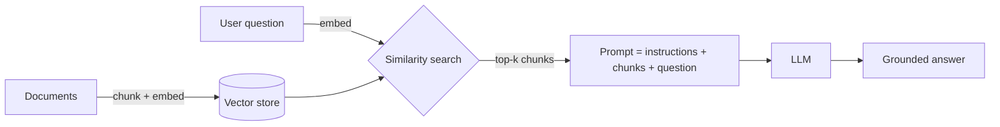
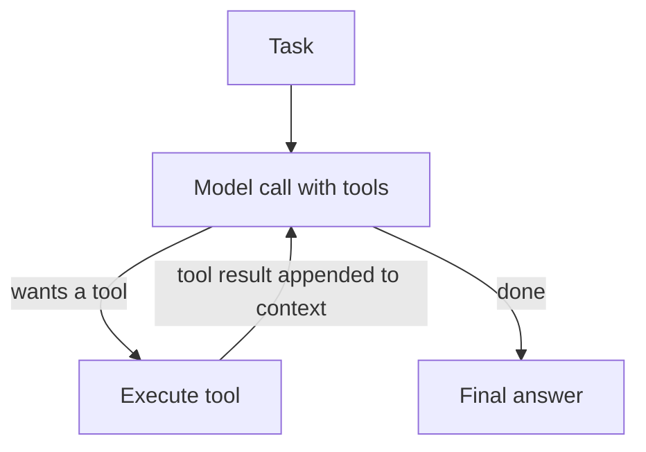
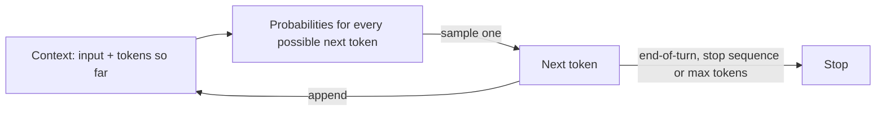

# 00 — Prerequisites: Foundations Before You Build with LLMs

> **Applies to:** both paths ([Claude](../anthropic-claude/README.md) and [OpenAI](../openai-codex/README.md)) · **Est. time:** 6–10 hours if most of this is new, 1–2 hours if you only need the environment setup · **Status:** [ ] not started

This is the vendor-neutral starting point of the journey. Before talking about agents, MCP servers or certification domains, you need three things: enough engineering basics to read and write the code in this repo, a working mental model of how large language models behave, and a local environment that can call both the Anthropic and the OpenAI APIs safely and cheaply.

Nothing here is exam trivia. Every later chapter assumes you are comfortable with these ideas, and the certification scenarios (customer support agents, CI pipelines, structured extraction, multi-agent research) are really questions about the trade-offs introduced on this page: latency vs. cost vs. reliability, what fills a context window, and what to do when a call fails.

---

## Contents

1. [Why this matters for a solution architect](#why-this-matters-for-a-solution-architect)
2. [Learning objectives](#learning-objectives)
3. [What you need before starting](#1-what-you-need-before-starting)
4. [LLM fundamentals](#2-llm-fundamentals)
5. [Software architecture basics for AI systems](#3-software-architecture-basics-for-ai-systems)
6. [Environment setup, step by step](#4-environment-setup-step-by-step)
7. [Self-assessment checklist](#5-self-assessment-checklist)
8. [Certification coverage](#certification-coverage)
9. [Recommended free resources](#6-recommended-free-resources)
10. [Notebooks](#notebooks)
11. [Notes: changed since the guide](#notes-changed-since-the-guide)

---

## Why this matters for a solution architect

A solution architect is the person who answers "should we build it this way?" before anyone writes the code. With LLM systems, most of the expensive mistakes happen at the foundation level:

- **Treating the model like a database.** It is a probabilistic text generator. It does not "know" your data unless you put it in the context, and it can produce fluent, confident, wrong answers.
- **Ignoring the token economy.** Every request is billed by input and output tokens, and the API is stateless, so a chatbot that resends a growing history costs more on every turn.
- **Skipping the boring reliability work.** Rate limits, timeouts, overloaded servers and partial failures are normal. A design without retries, idempotency and logging will fail in production even if the prompt is perfect.

If you can explain these three points to a stakeholder and show them in code, you are ready for the vendor-specific paths.

## Learning objectives

By the end of this section you should be able to:

- [ ] Set up a reproducible Python 3.11+ environment with a virtual environment, pinned dependencies and secrets in `.env`
- [ ] Read and write typed, async Python and explain when `asyncio.gather` helps
- [ ] Describe an HTTP request/response cycle and name the status codes that should and should not be retried
- [ ] Write a small JSON Schema by hand and generate one from a Pydantic model
- [ ] Explain tokens, context windows, sampling, system prompts, hallucination and embeddings in plain words
- [ ] Explain next-token generation and why it makes exact-match tests of model output brittle
- [ ] Explain the difference between a workflow and an agent, and when you need neither
- [ ] Estimate the cost of a workload from token counts and a price table
- [ ] Apply retries with exponential backoff and jitter, idempotency keys and structured logging to an LLM call
- [ ] Make a first successful call to both the Claude API and the OpenAI API

---

## 1. What you need before starting

You do not need a machine learning background. You do need to be a reasonably confident developer. The table shows the minimum level and where each skill shows up later.

| Skill | Minimum level | Where you will use it |
|---|---|---|
| Python 3.11+ | Functions, classes, type hints, `async`/`await`, virtual environments | Every notebook |
| TypeScript / JavaScript | Reading fluency: follow a sample, spot the request and the tool definition | Official SDK samples (Agents SDK for JS/TS, MCP TypeScript servers, plugins) |
| HTTP / REST and JSON | Methods, headers, status codes, request/response bodies | API fundamentals, error handling, MCP transports |
| JSON Schema | Objects, types, `required`, `enum`, nullable fields | Tool definitions, structured output, MCP tools |
| Git and GitHub | Clone, branch, commit, push, `.gitignore`, pull requests | Publishing your journey, Claude Code in CI |
| CLI / shell | Navigate, run commands, set environment variables, read `PATH` | Claude Code, Codex CLI, MCP servers |
| Docker *(optional)* | Run a container, map a port, pass env vars | Isolating MCP servers and agent sandboxes |
| Node.js *(optional)* | Run `npx` | Some MCP servers are distributed as npm packages |

### 1.1 Python 3.11+ (typing, async/await, venv)

**Role expectation.** Python is the working language of this repo: every notebook, exercise and capstone is written in it, and you are expected to write production-quality Python (typed, tested, async where it helps). You are also expected to **read** TypeScript/JavaScript fluently. Many official and community samples are written in TypeScript (the OpenAI Agents SDK for JavaScript/TypeScript, MCP servers built with the TypeScript SDK, many MCP servers bundled in Claude Code plugins), and in customer work you will review code you did not write. Writing TypeScript is a plus, not a requirement here. The Claude Certified Developer – Foundations guide describes its candidate as "proficient in Python and/or TypeScript".

The SDKs used in this repo require Python 3.10 or newer, and the current Jupyter kernel release pinned in `requirements.txt` (`ipykernel` 7.4) requires **3.11+**, so 3.11 is the floor for this repo. Three Python features matter most.

**Type hints.** SDK responses are typed objects (Pydantic models). Your editor can autocomplete `response.usage.input_tokens` only if you work with types instead of raw dictionaries. Type hints also make tool functions self-documenting, which matters later when a framework turns a function signature into a tool schema.

**`async` / `await`.** Model calls spend most of their time waiting on the network. Async code lets you run many calls at once without threads. The Claude Agent SDK and the MCP SDK are async-first, so you will see `async for` and `asyncio.run(...)` from Chapter 3 on.

```python
import asyncio
import time


async def fake_llm_call(prompt: str, delay: float) -> str:
    """Stand-in for a network call; no API key needed."""
    await asyncio.sleep(delay)
    return f"answer to: {prompt}"


async def main() -> None:
    prompts = ["summarize doc A", "summarize doc B", "summarize doc C"]
    start = time.perf_counter()
    # Three 1-second "calls" run concurrently, so this takes ~1s, not ~3s.
    results = await asyncio.gather(*(fake_llm_call(p, 1.0) for p in prompts))
    print(results, f"{time.perf_counter() - start:.1f}s")


asyncio.run(main())  # in Jupyter, use `await main()` instead: the notebook already runs an event loop
```

**Virtual environments.** Each project gets its own isolated set of packages so SDK upgrades in one project cannot break another. The setup steps are in [section 4](#4-environment-setup-step-by-step). [`uv`](https://docs.astral.sh/uv/) is a faster drop-in alternative to `venv` + `pip` if you prefer it.

### 1.2 HTTP / REST and JSON

Under every SDK there is an HTTPS request with a JSON body. Knowing the raw shape helps you debug what the SDK hides. A Claude request is a `POST` to `https://api.anthropic.com/v1/messages`; an OpenAI request is a `POST` to `https://api.openai.com/v1/responses`. Both carry an API key in a header, a model name and the input in the body, and both return JSON with the generated output plus a **usage** block that tells you how many tokens you paid for.

The status codes you need to recognize (meanings as documented for the Claude API; OpenAI uses the same standard HTTP codes, but 529 is Anthropic-specific):

| Code | Meaning | Retry? |
|---|---|---|
| 400 | Invalid request (bad parameter or schema), or usage reached a spend limit you set yourself | No. Fix the request (or raise your own limit) |
| 401 / 403 | Bad or missing API key / key lacks permission | No. Fix credentials |
| 402 | Billing problem (payment details) | No. Fix billing in the console |
| 404 | Wrong endpoint or model name | No |
| 408 / 409 | Request timeout / conflict | Yes, with backoff (the SDKs retry both automatically) |
| 413 | Request too large | No. Send less |
| 429 | Rate limit hit (or your usage tier's monthly spend cap reached) | Yes, after the `retry-after` delay, unless it is a spend cap |
| 500 / 504 | Server error / server-side timeout | Yes, with backoff |
| 529 | Anthropic API temporarily overloaded | Yes, with backoff |

Use [httpx2](https://pydantic.dev/docs/httpx2/) (included in `requirements.txt`) when you want to see the raw request in a notebook. It is the maintained successor to `httpx` and the HTTP client the current Anthropic, OpenAI and MCP SDKs are built on.

### 1.3 JSON Schema basics

JSON Schema is the contract language of LLM systems. You will use it to describe tool inputs to the model, to force structured output, and to define MCP tools. You only need a small subset:

```json
{
  "type": "object",
  "properties": {
    "invoice_id": { "type": "string", "description": "Invoice number exactly as printed" },
    "total":      { "type": "number" },
    "currency":   { "type": "string", "enum": ["USD", "EUR", "GBP"] },
    "due_date":   { "type": ["string", "null"], "description": "ISO 8601 date, or null if absent" }
  },
  "required": ["invoice_id", "total", "currency", "due_date"],
  "additionalProperties": false
}
```

Things to notice: `description` fields are read by the model, so they are part of your prompt. `enum` constrains values. A nullable type (`["string", "null"]`) gives the model a legitimate way to say "not present" instead of inventing a value, which is one of the simplest hallucination defenses. In Python you rarely write schemas by hand. Define a Pydantic model and call `Model.model_json_schema()` ([docs](https://pydantic.dev/docs/validation/latest/concepts/json_schema/)).

### 1.4 Git and GitHub

This repo is your public portfolio, so Git hygiene is part of the job: small commits with clear messages, a `.gitignore` that excludes `.env`, `.venv/` and `.ipynb_checkpoints/` (already configured here), and no secrets in history. If a key ever lands in a commit, **revoke it in the console first**, then clean the history. Deleting the line is not enough because the key stays in Git history. Later chapters run Claude Code inside GitHub Actions, so knowing how branches, pull requests and workflow files fit together will pay off. Free reference: [Pro Git](https://git-scm.com/book/en/v2).

### 1.5 CLI and shell

Claude Code, the Codex CLI and most MCP servers are command-line tools. Be comfortable with: changing directories, running a command with arguments, setting an environment variable for one command (`FOO=bar cmd`) or a session (`export FOO=bar`), understanding why `command not found` usually means a `PATH` problem, and piping output (`curl ... | jq .`). Free reference: [The Missing Semester of Your CS Education](https://missing.csail.mit.edu/).

### 1.6 Docker (optional)

Not required for the exam material, but useful for running third-party MCP servers in isolation and for giving agents a disposable sandbox where a bad `rm -rf` does no harm. Know how to run a container, pass environment variables and map a port. Free reference: [Docker Get Started](https://docs.docker.com/get-started/).

### 1.7 Node.js (optional)

You do **not** need Node.js for the Python path in this repo:

- The **Claude Agent SDK** for Python bundles the Claude Code CLI binary inside the `claude-agent-sdk` package. `pip install` is enough. You can point it at a system-wide install with `ClaudeAgentOptions(cli_path=...)` if you want a specific version.
- The **Claude Code CLI** itself (Chapter 5) installs with a native installer (`curl -fsSL https://claude.ai/install.sh | bash`), Homebrew or WinGet. Only the alternative npm install route needs Node.js 22 or later.

Node.js becomes handy when an MCP server you want to try is published on npm and launched with `npx`, when you want to run a TypeScript SDK sample you are reading (see the role expectation in [§1.1](#11-python-311-typing-asyncawait-venv)), or when you use the optional Promptfoo eval CLI listed in [`requirements-extras.txt`](../requirements-extras.txt). Install it from [nodejs.org](https://nodejs.org/en/download) when you reach that point.

### 1.8 Software-engineering baseline checklist

The Claude Certified Developer – Foundations (CCDV-F) exam guide has a "Software Engineering Foundations" area: REST APIs, JSON, asynchronous programming, version control, SDLC integration, code review and refactoring. The first four are prerequisites for this repo; the rest are taught later with Claude Code. Each row below has one check you can run right now. None of them needs an API key or costs money.

| Item | You should be able to | Runnable check |
|---|---|---|
| REST verbs and status codes | Pick `GET` / `POST` / `PUT` / `PATCH` / `DELETE` for an operation, say which ones are idempotent by definition (`GET`, `PUT`, `DELETE`), and map a status code to "fix the request" or "retry" ([§1.2](#12-http--rest-and-json)) | `curl -s -o /dev/null -w "%{http_code}\n" -X POST https://api.anthropic.com/v1/messages` prints `401`: a `POST` with no API key, which is a non-retryable error. The same call against `https://api.openai.com/v1/responses` also prints `401` |
| JSON parsing | Parse JSON, and tell a syntax error from valid JSON with the wrong content | `python -c "import json; json.loads('{\"total\": 42,}')"` raises `JSONDecodeError` (trailing comma). Models produce this kind of almost-JSON when you do not use structured outputs |
| JSON validation | Validate parsed data against a schema or a typed model ([§1.3](#13-json-schema-basics)) | `python -c "import pydantic; pydantic.TypeAdapter(float).validate_python('forty-two')"` raises `ValidationError`: valid JSON can still break your contract |
| Async basics | Run independent I/O calls concurrently ([§1.1](#11-python-311-typing-asyncawait-venv)) | Run the `asyncio.gather` snippet in §1.1 and confirm it takes about 1 s, not 3 s |
| Git branching and PR flow | Branch, commit, push, open a pull request, get a review, merge, delete the branch; keep secrets out of history ([§1.4](#14-git-and-github)) | `git switch -c practice/day-0 && git commit --allow-empty -m "chore: day 0" && git log --oneline -1 && git switch - && git branch -D practice/day-0` creates a branch with one commit, then cleans it up. `git check-ignore -v .env` prints the `.gitignore` rule that protects your keys |

The flow you should be able to explain without notes: create a short-lived branch from `main` → small commits with clear messages → push → open a pull request (draft first if it is not ready) → automated checks and a human review → address comments with new commits → merge (squash or merge commit, per team policy) → delete the branch. Later chapters put Claude Code into the review and CI steps of exactly this flow.

The [homework notebook](02_homework.ipynb) has offline exercises for the first four rows (Exercise 1 for verbs and status codes, Exercises 3–5 for JSON parsing and validation, Exercise 6 for async). The Git row is self-checked: run the command above and tick the matching item in the homework's readiness checklist.

**OpenAI developer-track prerequisites.** OpenAI's [AI application development track](https://developers.openai.com/tracks/ai-application-development) lists three prerequisites. This repo covers them as follows:

| OpenAI prerequisite | Where it is covered here |
|---|---|
| Comfortable with Python or JavaScript | Python is the repo language ([§1.1](#11-python-311-typing-asyncawait-venv)); TypeScript/JavaScript reading fluency is expected |
| An IDE such as VS Code or Cursor, ideally configured with an agent mode | [Step 8](#step-8--jupyter-or-vs-code) sets up VS Code for notebooks; any editor with an agent mode works, for example the Codex IDE extension from [OpenAI Chapter 05](../openai-codex/05-codex/README.md) |
| An OpenAI API key from the platform dashboard | [Step 5](#step-5--get-an-openai-api-key) |

---

## 2. LLM fundamentals

### 2.1 Tokens

Models do not read characters or words. They read **tokens**, chunks of text produced by a tokenizer. A useful rule of thumb for English is about 4 characters or 0.75 words per token, but the real number depends on the language, on code vs. prose, and on the model's tokenizer.

Why an architect cares:

- **Billing.** You pay per million input tokens and per million output tokens, and output is typically about 5x more expensive than input.
- **Limits.** Context windows, `max_tokens` and rate limits (tokens per minute) are all measured in tokens.
- **Tokenizers differ.** The same text yields different counts on different vendors and even different model generations. Claude 4.7 and later models (Opus 4.7 onward, plus Sonnet 5.5 and Fable 5.1) use a newer tokenizer that produces roughly 30% more tokens for the same text than earlier models such as Haiku 4.5; the exact increase depends on the content. Never reuse one vendor's count for another. Use each vendor's counting endpoint: `client.messages.count_tokens(...)` for Claude and `client.responses.input_tokens.count(...)` for OpenAI.
- **Hidden tokens.** Tool definitions, system prompts and the model's internal reasoning ("thinking") all consume tokens. Reasoning tokens are billed as output.

### 2.2 Context window

The **context window** is the maximum number of tokens the model can consider in one request: system prompt + tool definitions + the full conversation history + any documents + the output it generates. Current Claude Opus, Sonnet and Fable models have a 1M-token window (Haiku 4.5 has 200K). Current OpenAI flagship models have about 1.05M.

Three consequences:

1. **The APIs are stateless.** The model remembers nothing between calls. Your application resends the relevant history every time, so cost and latency grow with conversation length unless you trim, summarize or cache.
2. **More context is not free and not always better.** Long contexts cost more, respond more slowly, and models can attend less reliably to details buried in the middle of a very long input (the "lost in the middle" effect). Curate what you send.
3. **Context is the only memory you control.** Anything the model needs to know for this request must be in the context window or retrievable through a tool.

### 2.3 Temperature and sampling

At each step the model produces a probability distribution over possible next tokens and **samples** one. Sampling parameters reshape that distribution: `temperature` sharpens (low) or flattens (high) it, `top_p` and `top_k` cut off unlikely tokens. Low temperature means more predictable output; high temperature means more varied output.

> **Note: changed since the guide (and since most older tutorials).** On current Claude models (Claude 4.7 and later, including Sonnet 5.5, Opus 5.5 and Fable 5.1), setting `temperature`, `top_p` or `top_k` to anything other than the default returns a **400 error**, and the Anthropic Python SDK v1.x no longer accepts these arguments at all (passing them to `messages.create()` raises a `TypeError`). Claude is steered with **prompting**, the **`effort`** setting (`output_config={"effort": "low" | "medium" | "high" | "xhigh" | "max"}`), and **structured outputs**. Haiku 4.5 is the exception among current models: it still accepts sampling parameters at the API level but does not support `effort`. The OpenAI Responses API still exposes `temperature` and `top_p`, but check each model's page because reasoning models may restrict them.

Either way, never design a system that depends on identical output for identical input. Even `temperature=0` never guaranteed determinism. Make outputs checkable instead: schemas, validators, tests and evals.

### 2.4 Thinking models and effort

Modern frontier models can reason internally before answering. On current Claude models (everything except Haiku 4.5, which still uses the older extended-thinking `budget_tokens` setting) this is **adaptive thinking**: the model decides how much to think, and you steer depth (and therefore latency and cost) with `effort`. On Sonnet 5.5 the default effort is `high` (Opus 5.5 defaults to `medium`); for a trivial "say hello" call `low` is plenty. Responses can therefore contain `thinking` blocks before the `text` block, so always select output by block type instead of assuming `content[0]` is the answer. OpenAI exposes the same idea through the `reasoning` parameter. Chapter 1 covers this in detail.

### 2.5 System prompts vs. user prompts

| Layer | Purpose | Claude API | OpenAI Responses API |
|---|---|---|---|
| System / developer instructions | Persistent role, rules, tone, constraints for the whole conversation | top-level `system` parameter | `instructions` parameter (or a `developer`-role message) |
| User turn | The actual request or data for this turn | `{"role": "user", ...}` message | `input` (string or list of messages) |
| Assistant turn | The model's previous replies, resent by you to keep history | `{"role": "assistant", ...}` | earlier output items, or `previous_response_id` |

Put stable, trusted instructions in the system layer and treat everything in user turns, documents and tool results as untrusted data. That separation is the first line of defense against prompt injection.

### 2.6 Hallucination

A **hallucination** is fluent output that is not grounded in the input or in reality: an invented citation, a made-up field value, a function that does not exist. It happens because the model is optimized to produce plausible continuations, not to verify facts.

Mitigations you will use throughout the repo:

- **Ground the model.** Put the source material in the context (or give it a retrieval tool) and ask it to answer only from that material.
- **Give it an exit.** Allow "I don't know" in the prompt, and nullable fields in schemas.
- **Ask for evidence.** Request quotes or citations that you can check programmatically.
- **Validate.** Check structured output against a schema and business rules, then retry with the validation error as feedback.
- **Measure.** Build a small evaluation set and track accuracy over time instead of trusting spot checks.

### 2.7 Embeddings at a glance

An **embedding** is a vector of numbers that represents the meaning of a piece of text. Texts with similar meaning have vectors that are close together (usually measured with cosine similarity). Embeddings power semantic search and **RAG** (retrieval-augmented generation): find the most relevant chunks of your data, then put them in the context window.



Vendor note: **Anthropic does not offer its own embedding model.** Its documentation points to Voyage AI as one provider ([Claude docs: Embeddings](https://platform.claude.com/docs/en/build-with-claude/embeddings)). **OpenAI** offers embedding models directly ([OpenAI docs: Embeddings](https://developers.openai.com/api/docs/guides/embeddings)). RAG is not a separate exam domain for the Claude certification, but it appears inside scenarios such as research systems and data extraction.

### 2.8 Why agents

A single model call turns text into text. An **agent** is a model running in a loop. It decides which tool to call, your code (or the SDK) executes the tool, the result goes back into the context, and the loop repeats until the model decides the task is done.



Anthropic's widely cited [Building effective agents](https://www.anthropic.com/engineering/building-effective-agents) separates **workflows** (you hard-code the sequence of LLM calls) from **agents** (the model chooses the sequence). The architect's rule of thumb: use the simplest thing that works. Start with a single well-prompted call. Move to a workflow when the steps are known in advance, and to an agent only when the path really cannot be predicted. Agents trade predictability, latency and cost for flexibility. Chapters 2–4 of the Claude path build this up step by step: tool use, the Agent SDK, then MCP.

### 2.9 Next-token generation

A language model generates text **one token at a time**. For each step it reads the whole context (your input plus every token it has generated so far), computes a probability for every token in its vocabulary, picks one according to the sampling settings, appends it, and repeats. It stops when it emits an end-of-turn token, reaches a stop sequence, or hits `max_tokens` / `max_output_tokens`.



This one loop explains several things you will see all through the repo:

- **Latency.** The input is processed in parallel, but output tokens come out one after another. Output length, including thinking, drives response time far more than input length does. That is also why streaming exists: tokens can be shown as they are produced.
- **Variation.** Sampling picks from a distribution, so the same prompt can produce different text on different runs. On Claude models where you cannot change the sampling settings ([§2.3](#23-temperature-and-sampling)), variation is a given that you design around.
- **No take-backs.** Each token is conditioned on the tokens before it. An early wrong turn (a wrong first word of a label, a JSON key in the wrong place) shapes everything after it. Asking for reasoning *before* the final answer, or constraining the output format with structured outputs, reduces this.
- **Truncation.** If the token budget runs out, the text stops mid-sentence, and the response says so (`stop_reason: "max_tokens"` on Claude, `status: "incomplete"` on OpenAI). Always check it.

**What this means for testing.** Do not assert on exact output strings. Test **properties** instead: the output parses, matches the schema, contains the required facts, stays under a length limit, picks the right label. Run each test case several times, track a **pass rate** instead of a single pass/fail, and keep a small evaluation set that you re-run whenever you change a prompt or a model. [Practice §0.3](01_practice.ipynb) shows the loop with a toy model, and [homework Exercise 7](02_homework.ipynb) has you write a property check and a pass rate. Claude [Chapter 1, §1.5](../anthropic-claude/01-claude-api-fundamentals/README.md#15-the-context-window) shows how generated tokens (including thinking) fill the context window. Chapter 08 of the [applied AI architect track](../applied-ai-architect/README.md#chapter-plan) (evaluation design, planned) turns property tests into full eval suites.

---

## 3. Software architecture basics for AI systems

### 3.1 The latency / cost / reliability triangle

You can almost always buy one of these with the other two. The main levers:

| Lever | Lowers cost | Lowers latency | Improves reliability / quality | Notes |
|---|:---:|:---:|:---:|---|
| Smaller / cheaper model | ✅ | ✅ | ⚠️ | Validate with evals before downgrading |
| Lower `effort` / reasoning | ✅ | ✅ | ⚠️ | Fine for simple, well-specified tasks |
| Shorter, curated context | ✅ | ✅ | ✅ | Usually the best lever overall |
| Prompt caching | ✅ | ✅ | — | Big win for repeated system prompts, tools and documents |
| Batch API (async, ~50% off) | ✅ | ❌ | — | For work that can wait (up to 24h) |
| Streaming | — | ✅ (perceived) | — | First tokens arrive sooner; total time is unchanged |
| Retries with backoff | ❌ (slightly) | ❌ (on failure) | ✅ | Mandatory in production |
| Structured output + validation | — | — | ✅ | Turns "looks right" into "is checked" |

### 3.2 Idempotency

An operation is **idempotent** if doing it twice has the same effect as doing it once. This matters because retries are unavoidable. A timeout does not tell you whether the server processed the request.

- **Model calls** are read-only (they cost money but change nothing), so retrying them is safe.
- **Tool calls with side effects** (issue a refund, send an email, create a ticket) are not. Agents may call the same tool twice, and your retry logic may resend. Give side-effecting tools an **idempotency key** (for example, derived from the conversation ID and the action), and make the backend ignore duplicates.
- **Design for replay.** Log enough (inputs, tool results, request IDs) that you can reconstruct what happened after a failure.

### 3.3 Retries and backoff

Transient failures (429, 5xx, 529 overloaded, connection resets, timeouts) should be retried with **exponential backoff and jitter**: wait roughly 1s, 2s, 4s, ... plus a random amount, so that thousands of clients do not retry at the same instant. Permanent failures (400, 401, 403, 404, 413) must not be retried, because they will fail again.

Both official SDKs already do this for you. By default they retry **2 times** with exponential backoff, honor the `retry-after` header, retry on 408, 409, 429, 5xx and connection errors, and use a **10-minute** request timeout (timeouts are retried too, so wall-clock time can reach `timeout × (max_retries + 1)`). Tune these per client instead of writing your own loop for every call:

```python
import anthropic
from openai import OpenAI

claude = anthropic.Anthropic(max_retries=4, timeout=60.0)  # more retries, shorter timeout
oai = OpenAI(max_retries=4, timeout=60.0)
```

Two traps to know:

- **A spend-cap 429 is not transient.** When an Anthropic organization reaches its usage tier's monthly spend cap, the API returns a 429 (`rate_limit_error`) with no `retry-after` header and keeps failing until the next month or a tier increase; even the SDK's automatic retries just fail again. Detect it (`error.details.error_code` is `enforced_spend_limit_reached`) and alert a human instead of retrying. A lower spend limit that *you* set returns a **400** instead, with a message starting "You have reached your specified API usage limits".
- **Retries multiply cost and load.** Put a cap on attempts and on total elapsed time, and log every retry.

Further reading: [Timeouts, retries and backoff with jitter (AWS Builders' Library)](https://aws.amazon.com/builders-library/timeouts-retries-and-backoff-with-jitter/).

### 3.4 Observability

You cannot improve or defend what you cannot see. For every model call, log at least:

```json
{
  "ts": "2026-10-03T12:00:00Z",
  "provider": "anthropic",
  "model": "claude-sonnet-5-5",
  "request_id": "req_...",
  "latency_ms": 1840,
  "input_tokens": 1250,
  "output_tokens": 310,
  "cache_read_input_tokens": 0,
  "stop_reason": "end_turn",
  "estimated_cost_usd": 0.0056,
  "attempt": 1
}
```

- **Request IDs** let the vendor's support team find your call. The Python SDKs expose them on responses (for example, `message._request_id` in the Anthropic SDK).
- **Usage and cost** per call, per user and per feature catch runaway loops early.
- **`stop_reason` / status** tells you whether the answer was complete or truncated (`max_tokens`).
- **Traces** link the steps of an agent run (model call → tool call → model call). [OpenTelemetry](https://opentelemetry.io/docs/what-is-opentelemetry/) is the vendor-neutral standard, and the OpenAI Agents SDK ships with built-in tracing.
- **Privacy.** Prompts and outputs may contain personal data. Redact or sample before storing them.

### 3.5 Security and secrets

- Keep keys in environment variables or a secret manager, never in code or notebooks.
- Use a **separate key per project or environment** (dev, CI, prod) so you can revoke one without breaking the others.
- Grant agents the **least privilege** they need: read-only tools by default, with human approval for destructive actions.
- Treat documents, web pages and tool results as **untrusted input**. They can contain instructions aimed at the model (prompt injection).

---

## 4. Environment setup, step by step

### Step 1 — Install Python 3.11+

```bash
python3 --version   # expect Python 3.11.x or newer
```

If it is older, install a current version from [python.org](https://www.python.org/downloads/), Homebrew (`brew install python@3.12`), or `uv python install 3.12`.

### Step 2 — Clone the repo and create a virtual environment

```bash
git clone https://github.com/EldanGS/Applied-AI-Solution-Architect.git
cd Applied-AI-Solution-Architect

python3 -m venv .venv
source .venv/bin/activate          # Windows (PowerShell): .venv\Scripts\Activate.ps1
python -m pip install --upgrade pip
```

Your prompt should now show `(.venv)`. Run `deactivate` to leave it.

### Step 3 — Install the shared dependencies

```bash
pip install -r requirements.txt
```

[`requirements.txt`](../requirements.txt) contains everything the notebooks need:

| Package | Import as | Used for |
|---|---|---|
| `anthropic` | `import anthropic` | Claude API (Messages, token counting, batches) |
| `claude-agent-sdk` | `import claude_agent_sdk` | Claude Agent SDK (bundles the Claude Code CLI) |
| `mcp` | `import mcp` | Building MCP servers and clients |
| `openai` | `from openai import OpenAI` | OpenAI API (Responses API) |
| `openai-agents` | `import agents` | OpenAI Agents SDK |
| `python-dotenv` | `from dotenv import load_dotenv` | Loading keys from `.env` |
| `pydantic` | `import pydantic` | Typed models and JSON Schema |
| `httpx2` | `import httpx2` | Raw HTTP calls and offline mock transports (the client the SDKs use) |
| `httpx` | `import httpx` | The classic HTTP client, still imported by a few notebooks and tools |
| `pyyaml` | `import yaml` | Reading and writing YAML (CI workflows, eval case files, agent configs) |
| `jupyterlab`, `ipykernel` | — | Running the notebooks |

Quick check:

```bash
python -c "import anthropic, openai, claude_agent_sdk, mcp, agents, yaml, httpx, httpx2; print('anthropic', anthropic.__version__, '| openai', openai.__version__)"
```

**Optional extras.** A few later chapters need heavier packages that most learners do not want up front: a local embedding model, a local vector store, BM25 keyword search, an agent framework, the Promptfoo eval CLI (a Node.js tool), and the Codex Python SDK (commented out, because it pins a Codex CLI runtime). They are listed, with the chapters that use them, in [`requirements-extras.txt`](../requirements-extras.txt). Install them only when a chapter asks you to:

```bash
pip install -r requirements-extras.txt     # optional; adds dozens of packages (incl. ONNX Runtime), models download on first use
```

The [practice notebook](01_practice.ipynb) checks the core packages and reports which extras are installed.

### Step 4 — Get an Anthropic API key

1. Go to the [Claude Console](https://platform.claude.com/) and sign up or log in. (`console.anthropic.com` now redirects there.)
2. Add credits or a payment method under **Settings → Billing**. New accounts may receive a small amount of free credit for testing.
3. Open **Settings → API keys** ([direct link](https://platform.claude.com/settings/keys)) and create a key with a descriptive name, for example `ai-architect-learning`. Copy it right away, because it is only shown once.
4. Optional but recommended: create a dedicated **Workspace** for this learning repo and put a spend limit on it.

> **API billing is separate from a Claude.ai subscription.** A Pro or Max plan does not give you API credits, and API credits do not give you a Claude.ai plan. Claude Code (Chapter 5) can sign in with either a Claude.ai plan (Pro, Max, Team, Enterprise) or a Console account. Apps you build with the Agent SDK should authenticate with an API key: unless previously approved, Anthropic does not allow third-party products to offer Claude.ai login.

### Step 5 — Get an OpenAI API key

1. Go to the [OpenAI platform](https://platform.openai.com/) and sign up or log in.
2. Add billing credits under **Settings → Billing**.
3. Create a **project** for this repo, then create a key in that project on the [API keys page](https://platform.openai.com/api-keys). Project-scoped keys let you set per-project rate and spend limits and revoke access cleanly.

> **A ChatGPT subscription does not include API credits.** They are billed separately.

### Step 6 — Create your `.env`

```bash
cp .env.example .env
# open .env in your editor and paste both keys
git check-ignore .env && echo ".env is ignored, safe"
```

[`.env.example`](../.env.example) also contains `CLAUDE_MODEL` and `OPENAI_MODEL`, so you can switch the notebooks to a cheaper model in one place. If you switch `CLAUDE_MODEL` to Haiku 4.5, remember it does not accept the `effort` setting; the smoke test below handles that for you.

### Step 7 — Put cost guardrails in place *before* the first call

| Guardrail | Anthropic | OpenAI |
|---|---|---|
| Hard monthly spend limit | **Settings → Billing → Spend limits** (organization) and per-Workspace limits | **Settings → Organization → Limits** (hard spend limit and spend alerts), plus per-project spend and rate limits |
| Usage dashboard | [Usage page](https://platform.claude.com/usage) | Usage page in the dashboard |
| Separate key per project | Workspaces | Projects |

Habits that keep a learning budget small:

- **Start cheap.** Experiment on Sonnet 5.5 with `effort: "low"`. Haiku 4.5 is cheaper per token, but it does not support `effort` (drop `output_config` if you switch to it) and its earliest [retirement date](https://platform.claude.com/docs/en/about-claude/model-deprecations) is "not sooner than October 15, 2026", only days away as of this writing, so check that page before building on it. On OpenAI, use `gpt-6-luna`, its most cost-efficient model.
- **Cap `max_tokens`** in experiments, and remember that thinking tokens count toward it and are billed as output.
- **Count before you send** large prompts (`count_tokens` / `input_tokens.count`), and read `usage` after every call.
- **Cache and batch** once you repeat the same large context or have work that can wait. On the Claude path, prompt caching is introduced in [Chapter 1](../anthropic-claude/01-claude-api-fundamentals/README.md#15-the-context-window) (see the [prompt caching docs](https://platform.claude.com/docs/en/build-with-claude/prompt-caching); the exam only expects you to know it exists) and batching in [Chapter 7](../anthropic-claude/07-message-batches/README.md) (Message Batches). The OpenAI equivalents are in [OpenAI Chapter 07](../openai-codex/07-batch-and-cost/README.md).
- **Watch loops.** An agent stuck in a tool loop is the most common surprise bill. Always set a maximum number of turns.
- **Rotate and delete** keys you no longer use.

Claude prices for reference (USD per million tokens, from the [pricing page](https://platform.claude.com/docs/en/about-claude/pricing), checked 2026-10-03; always re-check before estimating real projects):

| Model | API ID | Input | Output | Context |
|---|---|---:|---:|---:|
| Claude Fable 5.1 | `claude-fable-5-1` | $10 | $50 | 1M |
| Claude Opus 5.5 | `claude-opus-5-5` | $4 | $20 | 1M |
| Claude Sonnet 5.5 | `claude-sonnet-5-5` | $2 | $10 | 1M |
| Claude Haiku 4.5 | `claude-haiku-4-5-20251001` | $1 | $5 | 200K |

The Batch API is 50% off. Cache reads cost 10% of the base input price (5% on Opus 5.5 and 2.5% on Fable 5.1). OpenAI's current lineup and prices are on its [models](https://developers.openai.com/api/docs/models) and [pricing](https://developers.openai.com/api/docs/pricing) pages.

**Worked example.** 1,000 requests × 2,000 input tokens × 500 output tokens on Sonnet 5.5 is 2M input tokens × $2 + 0.5M output tokens × $10 = **$4 + $5 = $9**. The same workload through the Batch API costs **$4.50**. If 1,500 of those 2,000 input tokens are a cached system prompt, the input part drops to roughly 0.5M × $2 + 1.5M × $0.20 = $1.30, plus a one-time cache write.

### Step 8 — Jupyter or VS Code

Register the virtual environment as a named kernel so notebooks always use the right packages:

```bash
python -m ipykernel install --user --name ai-architect --display-name "AI Architect (.venv)"
jupyter lab
```

In **VS Code**, install the *Python* and *Jupyter* extensions, open a notebook, and pick the `.venv` interpreter (or the "AI Architect (.venv)" kernel) from the kernel picker ([VS Code docs](https://code.visualstudio.com/docs/datascience/jupyter-notebooks)).

Notebook hygiene for a public repo:

- Never `print()` a key, and never paste one into a cell. Use `load_dotenv()` and let the SDK read the environment.
- Clear outputs before committing if they contain anything private. Committed outputs are visible to everyone.
- In notebooks, call async code with top-level `await main()` instead of `asyncio.run(main())`.

### Step 9 — Smoke test both APIs

This is the core of the [practice notebook](01_practice.ipynb), which wraps it in a key check and an opt-in `RUN_LIVE` flag. It costs a fraction of a cent.

```python
import os

import anthropic
from dotenv import load_dotenv
from openai import OpenAI

load_dotenv()
for var in ("ANTHROPIC_API_KEY", "OPENAI_API_KEY"):
    print(f"{var}: {'set' if os.getenv(var) else 'MISSING'}")  # never print the value

# --- Claude ---
claude = anthropic.Anthropic()
claude_model = os.getenv("CLAUDE_MODEL", "claude-sonnet-5-5")
# Trivial task: keep thinking (and cost) minimal. Haiku 4.5 does not support `effort`, so skip it there.
effort = {} if claude_model.startswith("claude-haiku") else {"output_config": {"effort": "low"}}
msg = claude.messages.create(
    model=claude_model,
    max_tokens=1024,
    messages=[{"role": "user", "content": "Reply with exactly: hello from Claude"}],
    **effort,
)
text = "".join(block.text for block in msg.content if block.type == "text")  # skip thinking blocks
print(text, "|", msg.stop_reason, "|", msg.usage.input_tokens, "in /", msg.usage.output_tokens, "out |", msg._request_id)

# --- OpenAI ---
oai = OpenAI()
resp = oai.responses.create(
    model=os.getenv("OPENAI_MODEL", "gpt-6-luna"),
    input="Reply with exactly: hello from OpenAI",
)
print(resp.output_text, "|", resp.usage.input_tokens, "in /", resp.usage.output_tokens, "out")
```

If something fails:

| Symptom | Likely cause |
|---|---|
| `AuthenticationError` / 401 | Key missing, mistyped, or revoked. Check `.env` and restart the kernel |
| 400 mentioning `temperature` | Old tutorial code. Remove sampling parameters for current Claude models |
| 400 "credit balance is too low" / 402 `billing_error` | Add credits or fix payment details in the console |
| 400 "You have reached your specified API usage limits" | You hit a spend limit you set yourself. Raise it under Settings → Billing |
| 400 mentioning `effort` on Haiku 4.5 | Haiku 4.5 does not support `effort`. Remove `output_config` |
| 404 model not found | Typo in the model ID, or a model your account cannot access |
| `ModuleNotFoundError` | The notebook is not using the `.venv` kernel |

---

## 5. Self-assessment checklist

Tick these honestly. Anything unticked is a pointer back to the section above or to the resources below.

**Engineering**
- [ ] I can create and activate a virtual environment and explain why it exists
- [ ] I can write a typed async function and run several of them concurrently with `asyncio.gather`
- [ ] I can explain the difference between 400, 401, 429, 500 and 529, and which ones to retry
- [ ] I can write a JSON Schema with required, enum and nullable fields, and generate one from Pydantic
- [ ] I can branch, commit, push and open a pull request, and I know what to do if a secret is committed
- [ ] I can set an environment variable in my shell and explain a `command not found` error

**LLM concepts**
- [ ] I can explain what a token is and why token counts differ between vendors and model generations
- [ ] I can explain next-token generation and how I would test output that varies from run to run
- [ ] I can list everything that consumes a context window and explain why the API is stateless
- [ ] I can explain what temperature does, and why current Claude models are steered with prompts and `effort` instead
- [ ] I know where system instructions go in the Claude API and in the OpenAI Responses API
- [ ] I can name at least four mitigations for hallucination
- [ ] I can explain embeddings and RAG in two sentences, and name which vendor offers native embeddings
- [ ] I can explain the difference between a workflow and an agent, and when to use neither

**Architecture and operations**
- [ ] I can estimate the monthly cost of a workload from request volume and token counts
- [ ] I can explain idempotency and why side-effecting tools need idempotency keys
- [ ] I know the SDKs' default retry behavior and how to change it
- [ ] I know which fields to log for every model call

**Environment**
- [ ] `requirements.txt` installs cleanly in my `.venv`
- [ ] `.env` holds both keys and is git-ignored
- [ ] Spend limits are set on both platforms
- [ ] The smoke test returns a reply from both Claude and OpenAI

---

## Certification coverage

IDs come from this repo's requirement checklists: the Claude certification exam guides (`CCDV-F/...`), OpenAI's developer tracks (`OAI/...`) and the role competency matrix (`ROLE/...`). This page is the prerequisite layer, so most rows are knowledge you need before the exam-domain chapters. Rows marked Supporting are taught in depth in the chapter the checklist assigns them to.

| Requirement ID | What it asks (short) | Where in this chapter | Depth (Primary/Supporting) |
|---|---|---|---|
| `CCDV-F/D2/2.4/K1` | Software engineering foundations: REST APIs | [§1.2](#12-http--rest-and-json) (request shape, status codes, retry or not), [§1.8](#18-software-engineering-baseline-checklist) (verbs, idempotent verbs, `curl` check); practice §0.4–0.5; homework Exercise 1 | Primary |
| `CCDV-F/D2/2.4/K2` | Software engineering foundations: JSON | [§1.3](#13-json-schema-basics) (JSON Schema, nullable fields, Pydantic), [§1.8](#18-software-engineering-baseline-checklist) (parsing vs. validation); homework Exercises 3–5 | Primary |
| `CCDV-F/D2/2.4/K3` | Software engineering foundations: asynchronous programming | [§1.1](#11-python-311-typing-asyncawait-venv) (`async`/`await`, `asyncio.gather`); homework Exercise 6 (bounded concurrency) | Supporting |
| `CCDV-F/D2/2.4/K4` | Software engineering foundations: version control | [§1.4](#14-git-and-github) (Git hygiene, leaked keys), [§1.8](#18-software-engineering-baseline-checklist) (branch → PR → review → merge flow, runnable check); practice §0.2 (`.env` ignored by Git) | Primary |
| `CCDV-F/D5/5.1/K1` | Tokens | [§2.1](#21-tokens) (billing, limits, tokenizers differ by vendor and model generation); practice §0.7 | Supporting |
| `CCDV-F/D5/5.1/K2` | Context windows | [§2.2](#22-context-window) (what fills it, statelessness); practice §0.7 (history growth) | Supporting |
| `CCDV-F/D5/5.1/K3` | Sampling | [§2.3](#23-temperature-and-sampling) (temperature, `top_p`/`top_k`, current Claude restrictions) | Supporting |
| `CCDV-F/D5/5.1/K4` | Non-determinism | [§2.3](#23-temperature-and-sampling), [§2.9](#29-next-token-generation) (same prompt, different output; design for it); homework Q3, Q5 | Supporting |
| `CCDV-F/D5/5.1/K5` | Next-token generation | [§2.9](#29-next-token-generation) (the generation loop, latency, truncation, testing with properties and pass rates); practice §0.3 (toy model); homework Exercise 7 | Primary |
| `OAI/tracks/ai-app-development/1` | Prerequisite: comfortable with Python or JavaScript | [§1.1](#11-python-311-typing-asyncawait-venv), [§1.8](#18-software-engineering-baseline-checklist) (OpenAI prerequisites table) | Primary |
| `OAI/tracks/ai-app-development/2` | Prerequisite: an IDE (VS Code or Cursor), ideally with agent mode | [Step 8](#step-8--jupyter-or-vs-code), [§1.8](#18-software-engineering-baseline-checklist) (OpenAI prerequisites table) | Primary |
| `OAI/tracks/ai-app-development/3` | Prerequisite: an OpenAI API key from the platform dashboard | [Step 5](#step-5--get-an-openai-api-key), [Step 6](#step-6--create-your-env); practice §0.2 and §0.6 | Primary |
| `ROLE/BUILD/1` | Python proficiency | [§1.1](#11-python-311-typing-asyncawait-venv) (role expectation: typed, tested, async Python); every notebook; homework Part B | Primary |
| `ROLE/BUILD/2` | TypeScript/JavaScript (and other languages) | [§1.1](#11-python-311-typing-asyncawait-venv) (reading fluency expected), [§1.7](#17-nodejs-optional) (when you need Node.js) | Supporting |

---

## 6. Recommended free resources

All links were checked on 2026-10-03.

**Anthropic**

| Resource | Why |
|---|---|
| [Anthropic Academy](https://anthropic.skilljar.com/) | Free official courses. Start with [Claude Platform 101](https://anthropic.skilljar.com/claude-platform-101), [Building with the Claude API](https://anthropic.skilljar.com/claude-with-the-anthropic-api), [Introduction to Model Context Protocol](https://anthropic.skilljar.com/introduction-to-model-context-protocol), [Claude Code in Action](https://anthropic.skilljar.com/claude-code-in-action) and [AI Capabilities and Limitations](https://anthropic.skilljar.com/ai-capabilities-and-limitations) |
| [Claude Docs: Get started](https://platform.claude.com/docs/en/get-started) | Official quickstart and API reference |
| [Models overview](https://platform.claude.com/docs/en/models/overview) and [Choosing a model](https://platform.claude.com/docs/en/about-claude/models/choosing-a-model) | Current model IDs, limits and trade-offs |
| [Prompt engineering overview](https://platform.claude.com/docs/en/build-with-claude/prompt-engineering/overview) | Official prompting guidance |
| [Claude Cookbooks](https://github.com/anthropics/claude-cookbooks) | Runnable notebooks for common patterns |
| [Anthropic courses (GitHub)](https://github.com/anthropics/courses) | Notebook-based API and prompting tutorials |
| [Building effective agents](https://www.anthropic.com/engineering/building-effective-agents) | The workflow vs. agent mental model |

**OpenAI**

| Resource | Why |
|---|---|
| [OpenAI Academy](https://academy.openai.com/) | Official learning hub, including "Build with AI" content on the API and Codex |
| [OpenAI Cookbook](https://developers.openai.com/cookbook) ([GitHub](https://github.com/openai/openai-cookbook)) | Runnable examples for the OpenAI API |
| [API quickstart](https://developers.openai.com/api/docs/quickstart) | First call with the Responses API |
| [Models](https://developers.openai.com/api/docs/models) | Current model IDs, prices and limits |
| [Production best practices](https://developers.openai.com/api/docs/guides/production-best-practices) | Projects, keys, limits and scaling |
| [OpenAI Agents SDK docs](https://openai.github.io/openai-agents-python/) | Agents, tools, handoffs and tracing in Python |

**Vendor-neutral**

| Resource | Why |
|---|---|
| [Intro to Large Language Models — Andrej Karpathy (1h talk)](https://www.youtube.com/watch?v=zjkBMFhNj_g) | The best single-hour mental model of LLMs |
| [The Illustrated Transformer](https://jalammar.github.io/illustrated-transformer/) | Visual intuition for how the architecture works |
| [Hugging Face LLM Course](https://huggingface.co/learn/llm-course) | Free, deeper course on tokenizers, transformers and fine-tuning |
| [JSON Schema: Getting started](https://json-schema.org/learn/getting-started-step-by-step) | The contract language for tools and structured output |
| [Python docs: asyncio](https://docs.python.org/3/library/asyncio.html), [typing](https://docs.python.org/3/library/typing.html), [venv tutorial](https://docs.python.org/3/tutorial/venv.html) | The three Python features this repo leans on |
| [MDN: HTTP overview](https://developer.mozilla.org/en-US/docs/Web/HTTP/Guides/Overview) | HTTP fundamentals |
| [Pro Git](https://git-scm.com/book/en/v2) and [The Missing Semester](https://missing.csail.mit.edu/) | Git and shell fluency |
| [Docker Get Started](https://docs.docker.com/get-started/) | Optional container basics |
| [Model Context Protocol](https://modelcontextprotocol.io/) | The open standard covered in Chapter 4 |

**Certification sources this repo follows**

- [Anthropic partner certifications](https://anthropic-partners.skilljar.com/page/partner-certifications): official Claude Certified Architect information
- [Claude Certification Guide](https://claudecertificationguide.com/learn): community learning path
- [paullarionov/claude-certified-architect](https://github.com/paullarionov/claude-certified-architect): community study guide used as the syllabus for the Claude path (credited, restructured and rewritten here)

---

## Notebooks

| Notebook | What it covers | Mini-project / format |
|---|---|---|
| [`01_practice.ipynb`](01_practice.ipynb) | 0.1 Python version, core packages (lower bounds read from `requirements.txt`) and which optional extras are installed · 0.2 API keys present and well-formed (never printed), `.env` ignored by Git, header redaction · 0.3 next-token generation with a toy model, property tests and pass rates · 0.4 anatomy of a Claude and an OpenAI call against an offline fake transport (wire format, thinking/reasoning blocks, `usage`, request IDs) · 0.5 failure modes: 401, SDK retries on 529, the spend-cap 429 · 0.6 first live call to both APIs (opt-in `RUN_LIVE`, guarded by the key check) · 0.7 token counting with both vendors' endpoints, history growth · 0.8 cost estimates from a price table and from `usage`, batch and cache savings | Mini-project: a guarded smoke test (count → worst-case cost → budget check → call → one JSON log line per call), offline by default and live with `RUN_LIVE = True` |
| [`02_homework.ipynb`](02_homework.ipynb) | Quiz: 10 scenario questions on LLM fundamentals (tokens, statelessness, sampling, thinking blocks, testing varying output, hallucination, embeddings, workflow vs. agent, spend caps, idempotency) · 7 offline exercises: REST verbs and retry decisions, backoff with jitter, parsing JSON from model text, a hand-written JSON Schema, the same contract in Pydantic, bounded async concurrency, property tests and pass rates | Architecture scenario (cost, batch vs. sync, failures, idempotency, logging, keys, quality) with a rubric; readiness checklist; scorecard against the 72% pass mark |

Theory stays in this README; notebooks hold code. Run them from the repo root venv (see [Step 2](#step-2--clone-the-repo-and-create-a-virtual-environment) and [Step 8](#step-8--jupyter-or-vs-code)). Both run offline with no API key; only cells behind `RUN_LIVE = True` in the practice notebook call the APIs.

---

## Notes: changed since the guide

The community guide that this repo uses as its syllabus was written against earlier docs. The following points are relevant at the prerequisites level (verified against official docs on 2026-10-03):

- **Docs moved.** The Claude Console and API docs live at `platform.claude.com` (old `console.anthropic.com` links redirect). Agent SDK and Claude Code docs live at `code.claude.com/docs`. The "Anthropic Cookbook" repo is now [`anthropics/claude-cookbooks`](https://github.com/anthropics/claude-cookbooks).
- **Sampling parameters.** Current Claude models reject non-default `temperature`, `top_p` and `top_k`. Use prompting, `effort` and structured outputs instead (see [§2.3](#23-temperature-and-sampling)).
- **Extended thinking replaced by adaptive thinking.** Manual `thinking: {"type": "enabled", "budget_tokens": N}` returns a 400 on Claude 4.7 and later models (including Sonnet 5.5, Opus 5.5 and Fable 5.1). Thinking depth is controlled with `effort`. Haiku 4.5 is the exception: it still uses `budget_tokens` and does not support `effort`.
- **Agent SDK install.** The Python `claude-agent-sdk` bundles the Claude Code CLI. No separate Node.js or CLI install is needed to run it.
- **HTTP client.** The official Python SDKs now use `httpx2` (the maintained successor of `httpx`), so most tutorials' `import httpx` examples have an `httpx2` equivalent. `requirements.txt` lists both: `httpx2` for raw calls and mock transports, and the classic `httpx` because a few notebooks and tools still import it directly.

---

## Share your progress

```text
Day 0 of my AI Solution Architect journey (Anthropic + OpenAI): foundations.

3 things I locked in before writing any agent code:
1. LLM APIs are stateless: you resend the context every call, and you pay for every token.
2. Current Claude models don't take temperature anymore. You steer them with prompts, effort and schemas.
3. Retries, idempotency and logging aren't optional. They separate a demo from a system.

Env set up, spend limits on, first "hello" from both Claude and OpenAI.
Notes + notebooks: https://github.com/EldanGS/Applied-AI-Solution-Architect
#AIArchitecture #ClaudeAI #OpenAI #LLM #BuildInPublic
```

---

[↑ Root README](../README.md) | [Next → Claude path](../anthropic-claude/README.md) · [Next → OpenAI path](../openai-codex/README.md)
