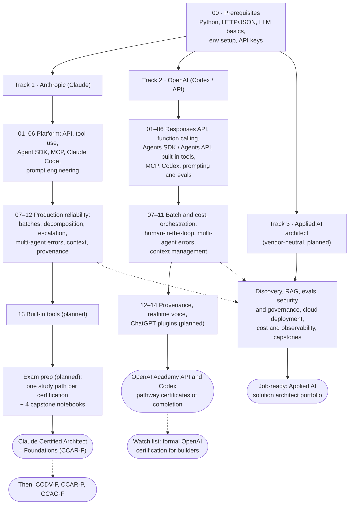

# AI Solution Architect: From Scratch

This is a public learning journal. I am working toward becoming an **AI solution architect** on two of the leading frontier-model platforms, **Anthropic (Claude)** and **OpenAI (Codex / API)**, starting from first principles. Every chapter has three parts. A theory page renders on GitHub and can be shared. Beside it sit two runnable Python notebooks: one for guided practice and one self-test homework. The first goal is to pass the **Claude Certified Architect – Foundations** exam, followed by the other three Anthropic certifications (Developer, Architect – Professional and Associate), and to finish the closest equivalent credentials OpenAI offers. The larger goal is to be job-ready as an **applied AI solution architect**, which is why a third, vendor-neutral track (discovery, RAG, evals, security and governance, deployment, cost and observability) is planned. I share the whole journey on LinkedIn, X and Threads as I go.

> **Status:** in progress. See the [progress tracker](#progress-tracker) below.
> **Last reviewed:** 2026-10-03. Certification facts change often, so check the official links before you book anything.

---

## Table of contents

- [Who this is for](#who-this-is-for)
- [What an AI solution architect actually does](#what-an-ai-solution-architect-actually-does)
- [The journey map](#the-journey-map)
- [Repository structure](#repository-structure)
- [How each folder works](#how-each-folder-works)
- [Quick start](#quick-start)
- [Progress tracker](#progress-tracker)
- [Certification targets](#certification-targets)
- [Follow the journey](#follow-the-journey)
- [Credits and sources](#credits-and-sources)
- [License](#license)

---

## Who this is for

- **Developers** who can already write Python and call a REST API, and who now want to design whole LLM systems rather than single prompts.
- **Solution engineers, consultants and pre-sales architects** who need to explain *why* one design fits a customer better than another, and to back that up with working code.
- **People preparing for the Claude Certified Architect exam** who want the syllabus split into small, runnable pieces instead of one long page.
- **Anyone curious** about how agentic systems, tool use, MCP and coding agents fit together across vendors.

You do not need a machine-learning background. You do need basic Python, comfort with a terminal, and API keys for the platforms you want to try. [00-prerequisites](00-prerequisites/README.md) covers the rest.

---

## What an AI solution architect actually does

An AI solution architect turns a business problem into an LLM-powered system that is reliable, safe, affordable and maintainable. The role sits between the customer, the engineering team and the model platform.

### Core responsibilities

| Area | What it looks like in practice |
|---|---|
| **Problem framing** | Decide whether an LLM is the right tool at all. Then pick the right shape: a single call, a fixed workflow, or an autonomous agent. |
| **Agentic architecture** | Design agent loops, coordinator/subagent hierarchies, task decomposition and handoffs between agents and humans. |
| **Tool and integration design** | Define tools and their descriptions, connect systems through the Model Context Protocol (MCP), and decide which agent gets which tools. |
| **Prompt and output engineering** | Write explicit instructions, few-shot examples and JSON-schema outputs, and build validation and retry loops around them. |
| **Context and reliability** | Manage what goes into the context window, how errors move between components, when to escalate to a human, and how to track where each fact came from. |
| **Developer workflow** | Configure coding agents (Claude Code, Codex) for a team: project memory files, rules, custom commands and skills, and CI/CD integration. |
| **Cost and throughput** | Choose models per task, and use batch processing, caching and parallelism where they actually pay off. |
| **Governance** | Set guardrails, human review points, audit trails and data-handling boundaries. |

### Trade-offs you are expected to reason about

- **Workflow vs. agent.** A deterministic pipeline is predictable and cheap. An agent is flexible but harder to test. Choose the least autonomy that solves the problem.
- **One agent vs. many.** Subagents isolate context and allow parallel work, but every handoff can lose information or let errors spread.
- **Prompt instruction vs. code enforcement.** "Please never refund over $500" in a prompt is a hope. A hook or a validation layer in code is a guarantee.
- **Latency vs. cost.** Real-time calls when a user is waiting, batch calls (about 50% cheaper on both platforms) when nobody is.
- **Bigger model vs. better context.** Often the fix is a better tool description or a cleaner context, not a larger model.
- **Autonomy vs. human review.** Calibrate confidence and route uncertain or high-risk cases to people.

### Typical deliverables

- An architecture diagram and a written design rationale, ideally as Architecture Decision Records (ADRs).
- Tool and MCP server specifications, plus JSON schemas for structured outputs.
- System prompts, few-shot sets and evaluation criteria.
- A working prototype or reference implementation.
- An escalation and human-in-the-loop policy.
- Team configuration for coding agents (for example `CLAUDE.md` / `AGENTS.md`, rules, skills, CI jobs).
- Cost, latency and risk estimates that stakeholders can act on.

---

## The journey map



The two vendor tracks are meant to be studied one after the other, not at the same time. I am doing **Anthropic first**, because that path has a real, proctored architect exam with a published blueprint. The OpenAI track reuses most of the same architectural ideas, so the second pass is mainly about mapping concepts to different APIs. The planned third track, **applied AI architect**, covers the vendor-neutral work that the vendor exams and courses only touch (much of it is CCAR-P territory): scoping a use case with a customer, retrieval design, evaluation, security and governance, cloud deployment, and cost and latency in production. It draws on both vendor tracks and ends in portfolio capstones.

---

## Repository structure

```text
AI-solution-architect/
├── README.md                              # you are here: journey overview, roadmap, tracker
├── requirements.txt                       # shared Python deps for all notebooks
├── .env.example                           # ANTHROPIC_API_KEY=, OPENAI_API_KEY=, model overrides
├── LICENSE                                # MIT
├── 00-prerequisites/
│   └── README.md                          # vendor-neutral foundations + environment setup
├── anthropic-claude/                      # Track 1 (built: 01–12)
│   ├── README.md                          # Claude path: 4 certs, CCAR-F format, 5 domains, scenarios, roadmap
│   ├── 01-claude-api-fundamentals/        # README.md + 01_practice.ipynb + 02_homework.ipynb
│   ├── 02-tool-use/
│   ├── 03-agent-sdk/
│   ├── 04-model-context-protocol/
│   ├── 05-claude-code/
│   ├── 06-prompt-engineering/
│   ├── 07-message-batches/
│   ├── 08-task-decomposition/
│   ├── 09-escalation-human-in-the-loop/
│   ├── 10-multi-agent-error-handling/
│   ├── 11-context-management/
│   ├── 12-provenance/
│   ├── 13-claude-code-builtin-tools/      # planned
│   └── exam-prep/                         # planned: CCAR-F/, CCDV-F/, CCAR-P/, CCAO-F/ + 4 capstones
├── openai-codex/                          # Track 2 (built: 01–11)
│   ├── README.md                          # OpenAI path: credentials, skill tree, chapter folders
│   ├── 01-responses-api-fundamentals/     # README.md + 01_practice.ipynb + 02_homework.ipynb
│   ├── 02-function-calling-and-structured-outputs/
│   ├── 03-agents-sdk-and-agents-api/
│   ├── 04-built-in-tools-and-mcp/
│   ├── 05-codex/
│   ├── 06-prompt-engineering-and-evals/
│   ├── 07-batch-and-cost/
│   ├── 08-task-decomposition-and-orchestration/
│   ├── 09-escalation-human-in-the-loop/
│   ├── 10-multi-agent-error-handling/
│   ├── 11-context-management/
│   ├── 12-provenance/                     # planned
│   ├── 13-realtime-and-voice/             # planned
│   ├── 14-chatgpt-plugins-and-apps/       # planned
│   └── exam-prep/                         # planned: scenario bank + Academy checklists + capstone
└── applied-ai-architect/                  # Track 3 (planned, vendor-neutral)
    ├── 01-discovery-and-scoping/          # planned
    ├── 02-rag-and-retrieval/              # planned
    ├── 03-evals-and-quality/              # planned
    ├── 04-security-safety-governance/     # planned
    ├── 05-cloud-deployment/               # planned
    ├── 06-cost-latency-observability/     # planned
    └── capstones/                         # planned: end-to-end portfolio projects
```

Entry points:

- [00-prerequisites/README.md](00-prerequisites/README.md)
- [anthropic-claude/README.md](anthropic-claude/README.md)
- [openai-codex/README.md](openai-codex/README.md)
- `applied-ai-architect/` (planned; see the [Track 3 plan](#track-3--applied-ai-architect-vendor-neutral-target-job-readiness))

---

## How each folder works

Every chapter folder follows the same pattern:

```text
anthropic-claude/02-tool-use/
├── README.md            # theory: concepts, diagrams, trade-offs, common mistakes, exam notes, links
├── 01_practice.ipynb    # guided practical work: one section per README concept, ending in a mini-project
└── 02_homework.ipynb    # self-test: quiz, auto-checked coding exercises, architecture scenario
```

| File | Purpose | Contains |
|---|---|---|
| `README.md` | **Theory.** Reads well on GitHub and on a phone. You can link to it straight from a post. | Explanations, Mermaid diagrams, trade-offs, common mistakes, exam-relevant notes, a **Notebooks** section, official doc links. |
| `01_practice.ipynb` | **Guided practice.** Walks through the chapter one concept at a time. | One section per README concept (each linking back to its README heading), live API demos plus offline demos that run without credit, *Observe* and *Try it* prompts, and a closing mini-project. |
| `02_homework.ipynb` | **Self-test.** Checks whether you can apply the chapter without help. | A 10-question scenario quiz graded against hashed answers, 4–6 coding exercises with automatic checks, an architecture scenario with a rubric, a scorecard (pass mark 72%, mirroring the Claude exam's 720/1,000), and solutions at the bottom. |

### Why both, and not just one?

- **Markdown alone** is easy to read and share, but you can't run it. The guarantee that "this actually works with today's SDK" disappears.
- **Notebooks alone** are runnable, but GitHub renders long notebook prose poorly. Diffs are noisy, and a notebook is hard to skim or link from a social post.
- **Splitting them** gives each format the job it does best. The README is the article and the notebook is the lab. There is **no duplication**. Theory lives only in the README, and code lives only in the notebook.

Notebook conventions:

- Run `01_practice.ipynb` first, then `02_homework.ipynb`. Try the homework without peeking at the solutions at the bottom.
- Notebooks are committed without outputs, so you always see results from your own run.
- API keys are loaded from `.env` with `python-dotenv` and never hard-coded.
- Claude notebooks default to `claude-sonnet-5-5` (override with `CLAUDE_MODEL`) and OpenAI notebooks to `gpt-6-luna` (override with `OPENAI_MODEL`), unless a point is specific to a model.
- Each notebook should run top to bottom on a fresh kernel.

---

## Quick start

Requirements: Python 3.11+ and git. You also need an Anthropic API key, an OpenAI API key, or both.

```bash
# 1. Clone
git clone https://github.com/<your-handle>/AI-solution-architect.git
cd AI-solution-architect

# 2. Create and activate a virtual environment
python3 -m venv .venv              # Windows: py -m venv .venv
source .venv/bin/activate          # Windows: .venv\Scripts\activate

# 3. Install the shared dependencies
pip install -r requirements.txt

# 4. Add your API keys (the .env file is git-ignored; never commit it)
cp .env.example .env
#   then edit .env and set ANTHROPIC_API_KEY=... and/or OPENAI_API_KEY=...

# 5. Launch Jupyter
jupyter lab
```

Every Claude notebook starts with the same pattern (OpenAI notebooks use the same shape with `OpenAI()` and `OPENAI_MODEL`; see the [OpenAI environment setup](openai-codex/README.md#environment-setup-for-this-path)):

```python
import os
from dotenv import load_dotenv, find_dotenv
import anthropic

# Search upward from the notebook's folder (Jupyter's working directory) until the repo-root .env is found.
load_dotenv(find_dotenv(usecwd=True))
client = anthropic.Anthropic()     # picks up ANTHROPIC_API_KEY from the environment
MODEL = os.getenv("CLAUDE_MODEL", "claude-sonnet-5-5")   # override in .env, not in code
```

Running notebooks makes real API calls, and **they cost money**. Most examples are tiny. The batch and multi-agent exercises use more tokens, so watch your usage dashboard.

---

## Progress tracker

Status legend: ✅ done (studied, notebooks run against the live API) · 🚧 in progress · 📝 written: README and both notebooks drafted, not yet run end to end against the live API · ⏳ planned

### Track 1 · Anthropic (Claude): target CCAR-F, then CCDV-F, CCAR-P and CCAO-F

| # | Chapter | Main CCAR-F domain(s) | Status |
|---|---|---|---|
| 00 | [Prerequisites](00-prerequisites/README.md) | All (foundation) | 📝 (README; notebooks planned) |
| 01 | [Claude API fundamentals](anthropic-claude/01-claude-api-fundamentals/README.md) | D1 Agentic Architecture, D4 Prompt Engineering, D5 Context | 📝 |
| 02 | [Tool use](anthropic-claude/02-tool-use/README.md) | D2 Tool Design & MCP, D4 | 📝 |
| 03 | [Claude Agent SDK](anthropic-claude/03-agent-sdk/README.md) | D1 Agentic Architecture | 📝 |
| 04 | [Model Context Protocol](anthropic-claude/04-model-context-protocol/README.md) | D2 Tool Design & MCP | 📝 |
| 05 | [Claude Code](anthropic-claude/05-claude-code/README.md) | D3 Claude Code Config & Workflows | 📝 |
| 06 | [Prompt engineering](anthropic-claude/06-prompt-engineering/README.md) | D4 Prompt Engineering & Structured Output | 📝 |
| 07 | [Message Batches API](anthropic-claude/07-message-batches/README.md) | D4 (batch processing), D5 | 📝 |
| 08 | [Task decomposition](anthropic-claude/08-task-decomposition/README.md) | D1 (task decomposition), D4 (multi-pass review) | 📝 |
| 09 | [Escalation and human-in-the-loop](anthropic-claude/09-escalation-human-in-the-loop/README.md) | D5 Context Mgmt & Reliability, D1 (handoff) | 📝 |
| 10 | [Multi-agent error handling](anthropic-claude/10-multi-agent-error-handling/README.md) | D5, D2 (structured errors) | 📝 |
| 11 | [Context management](anthropic-claude/11-context-management/README.md) | D5, D1 (session state) | 📝 |
| 12 | [Provenance](anthropic-claude/12-provenance/README.md) | D5 (provenance and uncertainty) | 📝 |
| 13 | `13-claude-code-builtin-tools` | D2 (built-in tools), D5 (codebase exploration) | ⏳ |
| — | `exam-prep`: one study path per certification (CCAR-F, CCDV-F, CCAR-P, CCAO-F) + 4 capstone notebooks ([plan](anthropic-claude/README.md#roadmap)) | All | ⏳ |
| 🎯 | **Sit CCAR-F**, then CCDV-F, CCAR-P and CCAO-F | — | ⏳ |

### Track 2 · OpenAI (Codex / API): target API and Codex pathway certificates

The detailed chapter plan lives in [openai-codex/README.md](openai-codex/README.md#chapter-folders).

| # | Chapter | Claude counterpart | Status |
|---|---|---|---|
| 01 | [Responses API fundamentals](openai-codex/01-responses-api-fundamentals/README.md) | 01 | 📝 |
| 02 | [Function calling and Structured Outputs](openai-codex/02-function-calling-and-structured-outputs/README.md) | 02, 06 | 📝 |
| 03 | [Agents SDK and Agents API](openai-codex/03-agents-sdk-and-agents-api/README.md) | 03 | 📝 |
| 04 | [Built-in tools and MCP](openai-codex/04-built-in-tools-and-mcp/README.md) | 04 | 📝 |
| 05 | [Codex](openai-codex/05-codex/README.md) | 05 | 📝 |
| 06 | [Prompt engineering and evals](openai-codex/06-prompt-engineering-and-evals/README.md) | 06 | 📝 |
| 07 | [Batch API and cost optimization](openai-codex/07-batch-and-cost/README.md) | 07 | 📝 |
| 08 | [Task decomposition and orchestration](openai-codex/08-task-decomposition-and-orchestration/README.md) | 08 | 📝 |
| 09 | [Escalation and human-in-the-loop](openai-codex/09-escalation-human-in-the-loop/README.md) | 09 | 📝 |
| 10 | [Multi-agent error handling](openai-codex/10-multi-agent-error-handling/README.md) | 10 | 📝 |
| 11 | [Context management](openai-codex/11-context-management/README.md) | 11 | 📝 |
| 12 | `12-provenance` | 12 | ⏳ |
| 13 | `13-realtime-and-voice` | none (OpenAI only) | ⏳ |
| 14 | `14-chatgpt-plugins-and-apps` | 04, 05 (plugins) | ⏳ |
| — | `exam-prep` (self-made scenario bank, Academy course checklists, capstone) | Claude `exam-prep` | ⏳ |
| 🎯 | **OpenAI Academy API pathway and Codex pathway certificates** | — | ⏳ |

### Track 3 · Applied AI architect (vendor-neutral): target job-readiness

Planned. These folders do not exist yet. Each will follow the same three-file convention and draw on both vendor tracks.

| # | Chapter folder (planned) | What it adds | Status |
|---|---|---|---|
| 01 | `applied-ai-architect/01-discovery-and-scoping` | Use-case discovery, feasibility, success metrics, workflow vs agent, ROI and stakeholder framing | ⏳ |
| 02 | `applied-ai-architect/02-rag-and-retrieval` | Chunking, embeddings, hybrid search, reranking, retrieval evaluation (CCAR-P territory; out of scope for CCAR-F) | ⏳ |
| 03 | `applied-ai-architect/03-evals-and-quality` | Eval sets, graders and LLM judges, regression testing, release gates | ⏳ |
| 04 | `applied-ai-architect/04-security-safety-governance` | Prompt injection, data handling, access control, audit trails, responsible-use policies | ⏳ |
| 05 | `applied-ai-architect/05-cloud-deployment` | Claude and OpenAI models on AWS, Google Cloud and Azure; networking, identity and data residency | ⏳ |
| 06 | `applied-ai-architect/06-cost-latency-observability` | Cost models, latency budgets, tracing, monitoring and incident response | ⏳ |
| — | `applied-ai-architect/capstones` | End-to-end portfolio projects with ADRs, eval reports and cost estimates | ⏳ |

---

## Certification targets

> These are facts as of **2026-10-03**, taken from the official pages linked below. Prices, eligibility and formats change, so always check the source before you register.

### Anthropic: Claude Certified Architect – Foundations (CCAR-F)

Anthropic runs four certifications for the **Claude Partner Network**. All four are delivered by Pearson VUE. CCAR-F, the first one, moved to Pearson on June 30, 2026, and all four exam guides are v1.0, effective July 2026.

| Certification | Code | List price | Items / time | Who it targets |
|---|---|---|---|---|
| Claude Certified Associate – Foundations | CCAO-F | $99 | 60 / 120 min | Consultants, sellers, delivery leads (business-facing roles) |
| Claude Certified Developer – Foundations | CCDV-F | $125 | 53 / 120 min | Engineers who build with the Claude API |
| **Claude Certified Architect – Foundations** | **CCAR-F** | **$125** | **60 / 120 min** | **People who design Claude solutions end to end** ← my target |
| Claude Certified Architect – Professional | CCAR-P | $175 | 63 / 120 min | Enterprise-scale design and governance |

Prices are list prices in USD, before partner-tier discounts. According to the official FAQ, Select, Preferred and Global Premier partners get 50% off, and Global Premier partners get 100% off through December 31, 2026.

CCAR-F at a glance (from the official exam guide, v1.0, effective July 2026):

- **Format:** multiple-choice and multiple-response items, where each item tells you how many answers to pick. You get 4 scenarios drawn from a bank of 6. The exam is closed book and English only.
- **Delivery:** online proctoring (OnVUE) or a Pearson test center.
- **Scoring:** a scaled score from 100 to 1,000, and you pass at **720**. The score report shows pass/fail, your scaled score and your percentage correct per domain. Passing earns a Credly badge and a downloadable PDF certificate.
- **Domains (official numbering):** D1 Agentic Architecture & Orchestration 27% · D2 Tool Design & MCP Integration 18% · D3 Claude Code Configuration & Workflows 20% · D4 Prompt Engineering & Structured Output 20% · D5 Context Management & Reliability 15%.
- **Validity:** 12 months. You can renew for free before it expires by passing an open-book online assessment on Anthropic Partner Academy, which adds another 12 months.
- **Retakes:** 14 / 30 / 90 day waits after the 1st / 2nd / 3rd fail. You get at most 4 attempts per rolling 12 months, and each attempt costs the standard exam fee (your partner discount still applies).

> **Important: eligibility.** Certification is currently **available only to people at Claude Partner Network organizations**, and you must be at least 18. You register with a partner email on a recognized company domain. Personal email addresses are not accepted. Membership in the Partner Network is per organization, and Anthropic's [launch announcement](https://www.anthropic.com/news/claude-partner-network) says it is free of charge and open to any organization bringing Claude to market. Organizations join through an application, so an individual learner needs to work at a partner organization, or at a company that applies and is accepted. The **Anthropic Academy** courses are free and open to everyone, so you can do all the learning in this repo either way.

> **Note: changed since the community guide.** The study guide this repo follows says "multiple choice, 1 correct of 4" and "4 of 8 scenarios". The official v1.0 exam guide says multiple-choice **and multiple-response**, with **4 of 6** scenarios. The guide's two extra scenarios do not appear in the official blueprint. The "no guessing penalty" claim is a reasonable inference, but the official guide does not state it. More detail is in [anthropic-claude/README.md](anthropic-claude/README.md).

Official links:

- Program page, exam guides and prices: <https://anthropic-partners.skilljar.com/page/partner-certifications>
- FAQ: <https://anthropic-partners.skilljar.com/page/faq-certifications>
- Policies (rescheduling, retakes, recertification): <https://anthropic-partners.skilljar.com/page/policies-certifications>
- Prep courses for CCAR-F: <https://anthropic-partners.skilljar.com/page/claude-certified-architect-foundations-prep-courses>
- Pearson VUE: <https://www.pearsonvue.com/us/en/anthropic.html>
- Claude Partner Network (apply as an organization): <https://claude.com/partners>
- Free public Anthropic Academy: <https://anthropic.skilljar.com/>
- Claude Partner Network launch announcement (eligibility, free membership): <https://www.anthropic.com/news/claude-partner-network>
- Third-party study site (unofficial, not an Anthropic resource): <https://claudecertificationguide.com/learn>

### OpenAI: no architect certification yet

As of today, OpenAI has **no "Solution Architect" certification** and no proctored developer or architect exam that you can book publicly. These are the realistic targets:

| Credential | What it is | Access |
|---|---|---|
| **OpenAI Academy API pathway** (Scope AI Solutions, Evaluate AI Applications, Design and Build Agentic Systems, Build with RAG, Optimize AI Application Performance) | Course badges plus a pathway *certificate of completion*. OpenAI states these "are not certifications." | Free, anyone with a ChatGPT account |
| **OpenAI Academy Codex pathway** (Get Started with Codex, Extend Codex Workflows, Scale Codex Across Governed Teams and Systems) | Same as above | Free |
| API Builder and Codex bootcamps | Live session series. Attending every session in a series earns a shareable completion certificate. | OpenAI Academy |
| *Watch list:* "OpenAI Certified" (Coursera + Credly) | Coursera-powered credential program inside ChatGPT, currently focused on general AI and ChatGPT skills rather than API architecture | Invite-only, ChatGPT Enterprise/Edu workspaces |
| *Watch list:* OpenAI Partner Network specializations | Codex, Agents and Cybersecurity specializations for partner firms (network announced June 2026) | Organizations, not individuals |

Links:

- OpenAI Academy: <https://academy.openai.com/>
- Academy courses and badges (help center): <https://help.openai.com/en/articles/20001270-openai-academy-courses>
- OpenAI Certified app: <https://help.openai.com/en/articles/20001151-openai-certified-app>
- OpenAI Partner Network: <https://openai.com/index/introducing-openai-partner-network/>
- Developer docs: <https://developers.openai.com/> · Codex docs: <https://developers.openai.com/codex>

There is more in [openai-codex/README.md](openai-codex/README.md).

---

## Follow the journey

I post what I learn, what broke, and the notebook that fixed it.

- **LinkedIn:** [linkedin.com/in/&lt;your-handle&gt;](https://www.linkedin.com/in/<your-handle>)
- **X:** [x.com/&lt;your-handle&gt;](https://x.com/<your-handle>)
- **Threads:** [threads.net/@&lt;your-handle&gt;](https://www.threads.net/@<your-handle>)

Suggested hashtags: `#AISolutionArchitect` `#ClaudeAI` `#Anthropic` `#OpenAI` `#Codex` `#AgenticAI` `#MCP` `#LLMOps` `#LearningInPublic` `#BuildInPublic`

A post format that works well: **one concept, one diagram, one notebook link**. For example: "Today: why `stop_reason` drives every agent loop → [README] → [notebook]."

> **About exam confidentiality:** Anthropic's certification policies say exam content is confidential. By taking an exam you agree not to share, reproduce or discuss the questions in any form, including in study groups and online forums. Assume any proctored exam has similar rules. Share the *learning journey* (concepts, code, study notes, your result), but **never share exam questions or exam content**, in any post, comment or forum.

Stars, issues and pull requests that fix mistakes are welcome.

---

## Credits and sources

- **Community study guide:** [Claude Certified Architect – Foundations study guide](https://github.com/paullarionov/claude-certified-architect/blob/main/guide_en.md) by [paullarionov](https://github.com/paullarionov). It is the syllabus backbone for the Claude branch. The content here is restructured, rewritten and expanded, and is corrected against current official docs where they differ.
- **Anthropic documentation:** [Claude Developer Platform docs](https://platform.claude.com/docs), [Claude Code docs](https://code.claude.com/docs), [Model Context Protocol](https://modelcontextprotocol.io), and the official CCAR-F exam guide.
- **Anthropic Academy:** <https://anthropic.skilljar.com/>
- **OpenAI documentation:** [OpenAI developer docs](https://developers.openai.com/), [Codex docs](https://developers.openai.com/codex), [OpenAI Academy](https://academy.openai.com/).

This repository is an independent learning project. It is **not affiliated with, endorsed by, or sponsored by Anthropic or OpenAI**. "Claude" is a trademark of Anthropic, and "OpenAI" and "Codex" are trademarks of OpenAI.

---

## License

[MIT](LICENSE) © 2026 Eldan Abdrashim
