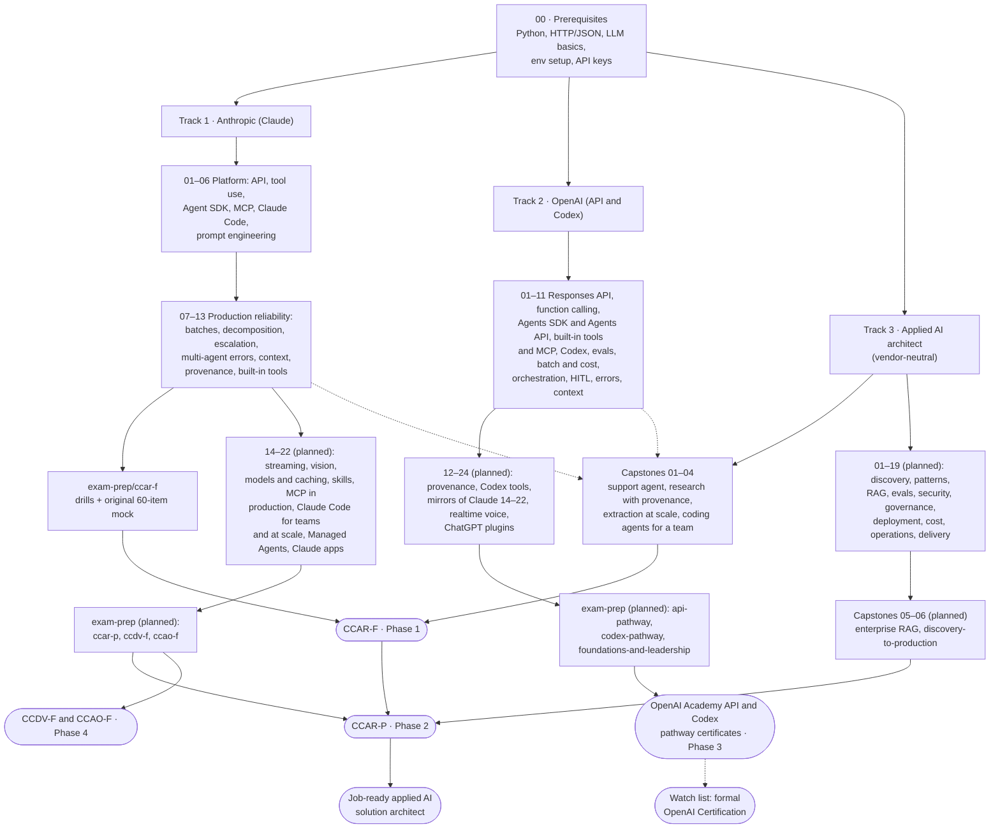

# AI Solution Architect: From Scratch

This is a public learning journal. My mission is to become a **world-class applied AI solution architect** on the two leading frontier-model platforms, **Anthropic (Claude)** and **OpenAI (API and Codex)**, starting from first principles, and to prove it with every certification those vendors offer.

**Certification targets, in order:**

1. **Claude Certified Architect, both levels (primary).** First **Foundations (CCAR-F)**, then **Professional (CCAR-P)**.
2. **The top OpenAI level available today.** The OpenAI Academy **API pathway** and **Codex pathway** certificates of completion. OpenAI's formal certification program is enterprise and invite-only for now, so it sits on a watch list.
3. **The other two Claude certifications (secondary).** **Claude Certified Developer – Foundations (CCDV-F)** and **Claude Certified Associate – Foundations (CCAO-F)**.

The larger goal is to be job-ready as an applied AI solution architect, so the repo has three tracks: one per vendor, plus a vendor-neutral **applied AI architect** track (discovery, architecture patterns, RAG, evals, security and governance, deployment, cost, operations and delivery) that ends in portfolio capstones. Every chapter has three parts: a theory page that renders on GitHub and can be shared, a guided practice notebook and a self-test homework notebook. I share the whole journey on LinkedIn, X and Threads as I go.

> **Status:** Phase 1 (CCAR-F) content is complete: Claude chapters 01–13, the CCAR-F exam-prep folder and capstones 01–04 are written, and every in-scope CCAR-F requirement has a primary home (see [COVERAGE.md](COVERAGE.md)). The OpenAI track has chapters 01–11. See the [progress tracker](#progress-tracker) and the [roadmap](#roadmap).
> **Last reviewed:** 2026-10-04. Certification facts change often, so check the official links before you book anything.

---

## Table of contents

- [Who this is for](#who-this-is-for)
- [What an AI solution architect actually does](#what-an-ai-solution-architect-actually-does)
- [The journey map](#the-journey-map)
- [Roadmap](#roadmap)
- [Repository structure](#repository-structure)
- [How each folder works](#how-each-folder-works)
- [Quick start](#quick-start)
- [Progress tracker](#progress-tracker)
- [Coverage map](#coverage-map)
- [Certification targets](#certification-targets)
- [Follow the journey](#follow-the-journey)
- [Credits and sources](#credits-and-sources)
- [License](#license)

---

## Who this is for

- **Developers** who can already write Python and call a REST API, and who now want to design whole LLM systems rather than single prompts.
- **Solution engineers, consultants and pre-sales architects** who need to explain *why* one design fits a customer better than another, and to back that up with working code.
- **People preparing for the Claude certifications** (especially the Architect exams) who want each blueprint split into small, runnable pieces instead of one long page.
- **Anyone curious** about how agentic systems, tool use, MCP and coding agents fit together across vendors.

You do not need a machine-learning background. You do need basic Python, comfort with a terminal, and API keys for the platforms you want to try. [00-prerequisites](00-prerequisites/README.md) covers the rest.

---

## What an AI solution architect actually does

An AI solution architect turns a business problem into an LLM-powered system that is reliable, safe, affordable and maintainable. The role sits between the customer, the engineering team and the model platform.

### Core responsibilities

| Area | What it looks like in practice |
|---|---|
| **Problem framing** | Decide whether an LLM is the right tool at all. Then pick the right shape: a single call, a fixed workflow, or an autonomous agent. |
| **Agentic architecture** | Design agent loops, coordinator/subagent hierarchies, task decomposition and handoffs between agents and humans. |
| **Tool and integration design** | Define tools and their descriptions, connect systems through the Model Context Protocol (MCP), and decide which agent gets which tools. |
| **Prompt and output engineering** | Write explicit instructions, few-shot examples and JSON-schema outputs, and build validation and retry loops around them. |
| **Context and reliability** | Manage what goes into the context window, how errors move between components, when to escalate to a human, and how to track where each fact came from. |
| **Developer workflow** | Configure coding agents (Claude Code, Codex) for a team: project memory files, rules, custom commands and skills, and CI/CD integration. |
| **Cost and throughput** | Choose models per task, and use batch processing, caching and parallelism where they actually pay off. |
| **Governance** | Set guardrails, human review points, audit trails and data-handling boundaries. |

### Trade-offs you are expected to reason about

- **Workflow vs. agent.** A deterministic pipeline is predictable and cheap. An agent is flexible but harder to test. Choose the least autonomy that solves the problem.
- **One agent vs. many.** Subagents isolate context and allow parallel work, but every handoff can lose information or let errors spread.
- **Prompt instruction vs. code enforcement.** "Please never refund over $500" in a prompt is a hope. A hook or a validation layer in code is a guarantee.
- **Latency vs. cost.** Real-time calls when a user is waiting, batch calls (about 50% cheaper on both platforms) when nobody is.
- **Bigger model vs. better context.** Often the fix is a better tool description or a cleaner context, not a larger model.
- **Autonomy vs. human review.** Calibrate confidence and route uncertain or high-risk cases to people.

### Typical deliverables

- An architecture diagram and a written design rationale, ideally as Architecture Decision Records (ADRs).
- Tool and MCP server specifications, plus JSON schemas for structured outputs.
- System prompts, few-shot sets and evaluation criteria.
- A working prototype or reference implementation.
- An escalation and human-in-the-loop policy.
- Team configuration for coding agents (for example `CLAUDE.md` / `AGENTS.md`, rules, skills, CI jobs).
- Cost, latency and risk estimates that stakeholders can act on.

---

## The journey map



The two vendor tracks are meant to be studied one after the other, not at the same time. I am doing **Anthropic first**, because that path has real, proctored architect exams with published blueprints. The OpenAI track reuses most of the same architectural ideas, so the second pass is mainly about mapping concepts to different APIs; its chapters are numbered to mirror the Claude chapters one to one. The **applied AI architect** track covers the vendor-neutral work that the vendor exams and courses only touch, and most of it is CCAR-P territory: scoping a use case with a customer, architecture patterns, retrieval design, evaluation, security and governance, cloud deployment, cost and latency in production, and handing a solution over. Its capstones build each solution twice, once on Claude and once on OpenAI.

---

## Roadmap

The order follows the certification targets above. Each phase ends with the exam or credential it unlocks.

| Phase | Target | What gets built or studied | Status |
|---|---|---|---|
| **1** | **CCAR-F** (Claude Certified Architect – Foundations) | Claude chapters 01–13, [exam-prep/ccar-f](anthropic-claude/exam-prep/ccar-f/README.md), [capstones 01–04](applied-ai-architect/capstones/README.md); OpenAI chapters 01–11 as the mirror | ✅ done (content complete; next step is to study and book the exam) |
| **2** | **CCAR-P** (Claude Certified Architect – Professional) | The [applied-ai-architect](applied-ai-architect/README.md) chapters 01–19, capstones 05–06, the Claude chapters 14–21 that CCAR-P draws on (model strategy, skills, MCP in production, Claude Code for teams and at scale), and `exam-prep/ccar-p` | ⏳ planned |
| **3** | **OpenAI top level available**: Academy API and Codex pathway certificates | OpenAI chapters 12–24 and `openai-codex/exam-prep/` (`api-pathway`, `codex-pathway`, `foundations-and-leadership`); keep re-checking the formal OpenAI Certification watch list | ⏳ planned |
| **4** | **CCDV-F** and **CCAO-F** (secondary) | `exam-prep/ccdv-f` on top of Claude chapters 14–21; `exam-prep/ccao-f` on top of Claude chapter 22 and applied chapters 01–02 | ⏳ planned |

The full chapter-by-chapter plan lives in each track README: the [Claude roadmap](anthropic-claude/README.md#roadmap), the [OpenAI planned chapter folders](openai-codex/README.md#planned-chapter-folders) and the [applied-ai-architect chapter plan](applied-ai-architect/README.md#chapter-plan). There is no mandatory prerequisite between the Claude exams, so the order is a choice; the [Claude exam-prep index](anthropic-claude/exam-prep/README.md#recommended-order-for-this-repo) explains why it runs this way.

---

## Repository structure

```text
AI-solution-architect/
├── README.md                              # you are here: mission, journey map, roadmap, tracker
├── COVERAGE.md                            # generated certification coverage map (1,935 requirement IDs)
├── requirements.txt                       # shared Python deps for all notebooks
├── requirements-extras.txt                # optional extras for specific later chapters
├── .env.example                           # ANTHROPIC_API_KEY=, OPENAI_API_KEY=, model overrides
├── .gitignore
├── LICENSE                                # MIT
├── 00-prerequisites/                      # README.md + 01_practice.ipynb + 02_homework.ipynb
├── anthropic-claude/                      # Track 1 (built: 01–13, exam-prep index, exam-prep/ccar-f)
│   ├── README.md                          # Claude path: 4 certs, CCAR-F format, domains, scenarios, roadmap
│   ├── 01-claude-api-fundamentals/        # README.md + 01_practice.ipynb + 02_homework.ipynb
│   ├── 02-tool-use/
│   ├── 03-agent-sdk/
│   ├── 04-model-context-protocol/
│   ├── 05-claude-code/
│   ├── 06-prompt-engineering/
│   ├── 07-message-batches/
│   ├── 08-task-decomposition/
│   ├── 09-escalation-human-in-the-loop/
│   ├── 10-multi-agent-error-handling/
│   ├── 11-context-management/
│   ├── 12-provenance/
│   ├── 13-claude-code-builtin-tools/
│   ├── 14-streaming-thinking-and-resilient-clients/       # planned
│   ├── 15-vision-pdfs-files-and-citations/                # planned
│   ├── 16-models-prompt-caching-and-cost/                 # planned
│   ├── 17-agent-skills-and-customization-choices/         # planned
│   ├── 18-mcp-in-production/                              # planned
│   ├── 19-claude-code-for-teams/                          # planned
│   ├── 20-claude-code-automation-at-scale/                # planned
│   ├── 21-managed-agents-memory-and-frameworks/           # planned
│   ├── 22-claude-apps-projects-and-cowork/                # planned
│   └── exam-prep/
│       ├── README.md                      # certification ladder, program rules, Academy checklist
│       ├── ccar-f/                        # README.md + 01_practice.ipynb (drills) + 02_homework.ipynb (mock)
│       ├── ccar-p/                        # planned
│       ├── ccdv-f/                        # planned
│       └── ccao-f/                        # planned
├── openai-codex/                          # Track 2 (built: 01–11)
│   ├── README.md                          # OpenAI path: credentials, skill tree, chapter folders, concept map
│   ├── 01-responses-api-fundamentals/     # README.md + 01_practice.ipynb + 02_homework.ipynb
│   ├── 02-function-calling-and-structured-outputs/
│   ├── 03-agents-sdk-and-agents-api/
│   ├── 04-built-in-tools-and-mcp/
│   ├── 05-codex/
│   ├── 06-prompt-engineering-and-evals/
│   ├── 07-batch-and-cost/
│   ├── 08-task-decomposition-and-orchestration/
│   ├── 09-escalation-human-in-the-loop/
│   ├── 10-multi-agent-error-handling/
│   ├── 11-context-management/
│   ├── 12-provenance-citations-and-annotations/           # planned
│   ├── 13-codex-builtin-tools/                            # planned
│   ├── 14-streaming-reasoning-and-resilient-clients/      # planned
│   ├── 15-vision-files-and-image-generation/              # planned
│   ├── 16-models-migration-and-model-optimization/        # planned
│   ├── 17-skills-and-customization-choices/               # planned
│   ├── 18-mcp-in-production/                              # planned
│   ├── 19-codex-for-teams/                                # planned
│   ├── 20-codex-automation-at-scale/                      # planned
│   ├── 21-agents-api-memory-and-sandboxes/                # planned
│   ├── 22-chatgpt-enterprise-projects-and-workspace-agents/  # planned
│   ├── 23-realtime-and-voice/                             # planned
│   ├── 24-chatgpt-plugins-and-apps/                       # planned
│   └── exam-prep/                                         # planned: README index (Academy badge rules) +
│       ├── api-pathway/                                   #   planned
│       ├── codex-pathway/                                 #   planned
│       └── foundations-and-leadership/                    #   planned
└── applied-ai-architect/                  # Track 3 (built: track README, capstones 01–04)
    ├── README.md                          # track index: certs served, role competencies, chapter plan
    ├── 01-ai-fluency-prompting-and-output-validation/     # planned
    ├── 02-workflow-design-and-delegation/                 # planned
    ├── 03-discovery-and-use-case-scoping/                 # planned
    ├── 04-solution-architecture-patterns/                 # planned
    ├── 05-model-strategy-and-customization/               # planned
    ├── 06-rag-pipelines/                                  # planned
    ├── 07-retrieval-strategy-and-knowledge-operations/    # planned
    ├── 08-evaluation-design/                              # planned
    ├── 09-experimentation-and-release-gates/              # planned
    ├── 10-llm-application-security/                       # planned
    ├── 11-responsible-ai-and-safety-controls/             # planned
    ├── 12-compliance-and-ai-governance/                   # planned
    ├── 13-enterprise-integration-and-identity/            # planned
    ├── 14-cloud-deployment-and-platform-choice/           # planned
    ├── 15-cost-latency-and-scaling/                       # planned
    ├── 16-observability-and-operations/                   # planned
    ├── 17-enterprise-rollout-and-adoption/                # planned
    ├── 18-stakeholder-communication-and-presales/         # planned
    ├── 19-poc-to-production-delivery-and-handoff/         # planned
    └── capstones/
        ├── README.md                      # capstone → scenario → competency matrix, rubric approach
        ├── 01-support-resolution-agent/   # README.md + 01_practice.ipynb + 02_homework.ipynb
        ├── 02-multi-agent-research-with-provenance/
        ├── 03-extraction-pipeline-at-scale/
        ├── 04-coding-agents-for-a-team/
        ├── 05-enterprise-rag-assistant/                   # planned
        └── 06-discovery-to-production-engagement/         # planned
```

Entry points:

- [00-prerequisites/README.md](00-prerequisites/README.md)
- [anthropic-claude/README.md](anthropic-claude/README.md) and the [Claude exam-prep index](anthropic-claude/exam-prep/README.md)
- [openai-codex/README.md](openai-codex/README.md)
- [applied-ai-architect/README.md](applied-ai-architect/README.md) and the [capstones](applied-ai-architect/capstones/README.md)
- [COVERAGE.md](COVERAGE.md): which chapter teaches each certification requirement

---

## How each folder works

Every chapter folder follows the same pattern:

```text
anthropic-claude/02-tool-use/
├── README.md            # theory: concepts, diagrams, trade-offs, common mistakes, exam notes, links
├── 01_practice.ipynb    # guided practical work: one section per README concept, ending in a mini-project
└── 02_homework.ipynb    # self-test: quiz, auto-checked coding exercises, architecture scenario
```

Capstones and the per-certification exam-prep folders use the same three files. In a capstone, `01_practice.ipynb` is the guided build and `02_homework.ipynb` the self-assessment; in an exam-prep folder, `01_practice.ipynb` holds scenario drills and `02_homework.ipynb` a full-length original mock exam. The track indexes, the capstones index and the exam-prep index are README-only.

| File | Purpose | Contains |
|---|---|---|
| `README.md` | **Theory.** Reads well on GitHub and on a phone. You can link to it straight from a post. | Explanations, Mermaid diagrams, trade-offs, common mistakes, exam-relevant notes, a **Notebooks** section, a **Certification coverage** table and official doc links. |
| `01_practice.ipynb` | **Guided practice.** Walks through the chapter one concept at a time. | One section per README concept (each linking back to its README heading), offline demos that run without credit plus opt-in live API demos, *Observe* and *Try it* prompts, and a closing mini-project. |
| `02_homework.ipynb` | **Self-test.** Checks whether you can apply the chapter without help. | A 10-question scenario quiz graded against hashed answers, 4–6 coding exercises with automatic checks, an architecture scenario with a rubric, a scorecard (pass mark 72%, mirroring the Claude exams' 720/1,000), and solutions at the bottom. |

### Why both, and not just one?

- **Markdown alone** is easy to read and share, but you can't run it. The guarantee that "this actually works with today's SDK" disappears.
- **Notebooks alone** are runnable, but GitHub renders long notebook prose poorly. Diffs are noisy, and a notebook is hard to skim or link from a social post.
- **Splitting them** gives each format the job it does best. The README is the article and the notebook is the lab. There is **no duplication**. Theory lives only in the README, and code lives only in the notebook.

Notebook conventions:

- Run `01_practice.ipynb` first, then `02_homework.ipynb`. Try the homework without peeking at the solutions at the bottom.
- Notebooks are committed without outputs, so you always see results from your own run.
- **Offline first.** Every notebook runs top to bottom on a fresh kernel without spending money. Cells that call a paid API, a cloud service or a coding-agent CLI are opt-in: they stay off until you set the flag at the top of the cell (for example `RUN_LIVE`, `RUN_CLAUDE` or `RUN_CODEX`).
- API keys are loaded from `.env` with `python-dotenv` and never hard-coded.
- Claude notebooks default to `claude-sonnet-5-5` (override with `CLAUDE_MODEL`) and OpenAI notebooks to `gpt-6-luna` (override with `OPENAI_MODEL`), unless a point is specific to a model.

---

## Quick start

Requirements: Python 3.11+ and git. For the live cells you also need an Anthropic API key, an OpenAI API key, or both; the offline cells need neither.

```bash
# 1. Clone
git clone https://github.com/<your-handle>/AI-solution-architect.git
cd AI-solution-architect

# 2. Create and activate a virtual environment
python3 -m venv .venv              # Windows: py -m venv .venv
source .venv/bin/activate          # Windows: .venv\Scripts\activate

# 3. Install the shared dependencies
pip install -r requirements.txt

# 3b. Optional: extras for specific later chapters (local embeddings, vector store, BM25,
#     an agent framework). Install only when a chapter asks for it.
# pip install -r requirements-extras.txt

# 4. Add your API keys (the .env file is git-ignored; never commit it)
cp .env.example .env
#   then edit .env and set ANTHROPIC_API_KEY=... and/or OPENAI_API_KEY=...

# 5. Launch Jupyter
jupyter lab
```

[`requirements-extras.txt`](requirements-extras.txt) lists each optional group with the chapters that use it. Today only the OpenAI chapters 05 and 06 refer to it (both optional); the rest serve planned chapters. [00-prerequisites/01_practice.ipynb](00-prerequisites/01_practice.ipynb) reports which packages are installed.

Every Claude notebook starts with the same pattern (OpenAI notebooks use the same shape with `OpenAI()` and `OPENAI_MODEL`; see the [OpenAI environment setup](openai-codex/README.md#environment-setup-for-this-path)):

```python
import os
from dotenv import load_dotenv, find_dotenv
import anthropic

# Search upward from the notebook's folder (Jupyter's working directory) until the repo-root .env is found.
load_dotenv(find_dotenv(usecwd=True))
client = anthropic.Anthropic()     # picks up ANTHROPIC_API_KEY from the environment
MODEL = os.getenv("CLAUDE_MODEL", "claude-sonnet-5-5")   # override in .env, not in code
```

Live cells make real API calls, and **they cost money**. Most examples are tiny. The batch, multi-agent and capstone runs use more tokens, so watch your usage dashboard and set a spend limit first.

---

## Progress tracker

Status legend: ✅ done (studied, notebooks run against the live API) · 🚧 in progress · 📝 written: README and both notebooks drafted, not yet run end to end against the live API · ⏳ planned

### Track 1 · Anthropic (Claude): CCAR-F, then CCAR-P; CCDV-F and CCAO-F secondary

| # | Chapter | Main exam domain(s) | Status |
|---|---|---|---|
| 00 | [Prerequisites](00-prerequisites/README.md) | All (foundation) | 📝 |
| 01 | [Claude API fundamentals](anthropic-claude/01-claude-api-fundamentals/README.md) | CCAR-F D1, D4, D5 · CCDV-F D2, D5 | 📝 |
| 02 | [Tool use](anthropic-claude/02-tool-use/README.md) | CCAR-F D2, D4 | 📝 |
| 03 | [Claude Agent SDK](anthropic-claude/03-agent-sdk/README.md) | CCAR-F D1 | 📝 |
| 04 | [Model Context Protocol](anthropic-claude/04-model-context-protocol/README.md) | CCAR-F D2 | 📝 |
| 05 | [Claude Code](anthropic-claude/05-claude-code/README.md) | CCAR-F D3 | 📝 |
| 06 | [Prompt engineering](anthropic-claude/06-prompt-engineering/README.md) | CCAR-F D4 · CCAR-P D2 | 📝 |
| 07 | [Message Batches API](anthropic-claude/07-message-batches/README.md) | CCAR-F D4 (batch processing), D5 | 📝 |
| 08 | [Task decomposition](anthropic-claude/08-task-decomposition/README.md) | CCAR-F D1 (task decomposition), D4 (multi-pass review) | 📝 |
| 09 | [Escalation and human-in-the-loop](anthropic-claude/09-escalation-human-in-the-loop/README.md) | CCAR-F D5, D1 (handoff) | 📝 |
| 10 | [Multi-agent error handling](anthropic-claude/10-multi-agent-error-handling/README.md) | CCAR-F D5, D2 (structured errors) | 📝 |
| 11 | [Context management](anthropic-claude/11-context-management/README.md) | CCAR-F D5, D1 (session state) | 📝 |
| 12 | [Provenance](anthropic-claude/12-provenance/README.md) | CCAR-F D5 (provenance and uncertainty) | 📝 |
| 13 | [Claude Code built-in tools](anthropic-claude/13-claude-code-builtin-tools/README.md) | CCAR-F D2 (built-in tools), D5 (codebase exploration) | 📝 |
| — | [Exam-prep index](anthropic-claude/exam-prep/README.md): certification ladder, program rules, Academy checklist | All four exams | 📝 |
| — | [exam-prep/ccar-f](anthropic-claude/exam-prep/ccar-f/README.md): scenario drills and an original 60-item mock | CCAR-F, all domains | 📝 |
| 14 | `14-streaming-thinking-and-resilient-clients` | CCDV-F D2, D4, D5 | ⏳ |
| 15 | `15-vision-pdfs-files-and-citations` | CCDV-F D2 | ⏳ |
| 16 | `16-models-prompt-caching-and-cost` | CCDV-F D5 · CCAO-F D3 · CCAR-P D2 | ⏳ |
| 17 | `17-agent-skills-and-customization-choices` | CCDV-F D8 · CCAR-P D2 | ⏳ |
| 18 | `18-mcp-in-production` | CCDV-F D8 | ⏳ |
| 19 | `19-claude-code-for-teams` | CCDV-F D2, D3 · CCAR-P D7 | ⏳ |
| 20 | `20-claude-code-automation-at-scale` | CCDV-F D2 · CCAR-P D7 | ⏳ |
| 21 | `21-managed-agents-memory-and-frameworks` | CCDV-F D1 | ⏳ |
| 22 | `22-claude-apps-projects-and-cowork` | CCAO-F D2, D3, D5 | ⏳ |
| — | `exam-prep/ccar-p`, `exam-prep/ccdv-f`, `exam-prep/ccao-f`: drills and an original full-length mock per exam | CCAR-P, CCDV-F, CCAO-F | ⏳ |
| 🎯 | **Sit CCAR-F**, then CCAR-P; later CCDV-F and CCAO-F | — | ⏳ |

### Track 2 · OpenAI (API and Codex): Academy API and Codex pathway certificates

OpenAI chapters 01–22 mirror the Claude chapters with the same numbers; 23 and 24 are OpenAI-only. The detailed plan lives in [openai-codex/README.md](openai-codex/README.md#chapter-folders).

| # | Chapter | Claude counterpart | Status |
|---|---|---|---|
| 01 | [Responses API fundamentals](openai-codex/01-responses-api-fundamentals/README.md) | 01 | 📝 |
| 02 | [Function calling and Structured Outputs](openai-codex/02-function-calling-and-structured-outputs/README.md) | 02, 06 | 📝 |
| 03 | [Agents SDK and Agents API](openai-codex/03-agents-sdk-and-agents-api/README.md) | 03 | 📝 |
| 04 | [Built-in tools and MCP](openai-codex/04-built-in-tools-and-mcp/README.md) | 04 | 📝 |
| 05 | [Codex](openai-codex/05-codex/README.md) | 05 | 📝 |
| 06 | [Prompt engineering and evals](openai-codex/06-prompt-engineering-and-evals/README.md) | 06 | 📝 |
| 07 | [Batch API and cost optimization](openai-codex/07-batch-and-cost/README.md) | 07 | 📝 |
| 08 | [Task decomposition and orchestration](openai-codex/08-task-decomposition-and-orchestration/README.md) | 08 | 📝 |
| 09 | [Escalation and human-in-the-loop](openai-codex/09-escalation-human-in-the-loop/README.md) | 09 | 📝 |
| 10 | [Multi-agent error handling](openai-codex/10-multi-agent-error-handling/README.md) | 10 | 📝 |
| 11 | [Context management](openai-codex/11-context-management/README.md) | 11 | 📝 |
| 12 | `12-provenance-citations-and-annotations` | 12 | ⏳ |
| 13 | `13-codex-builtin-tools` | 13 | ⏳ |
| 14 | `14-streaming-reasoning-and-resilient-clients` | 14 | ⏳ |
| 15 | `15-vision-files-and-image-generation` | 15 | ⏳ |
| 16 | `16-models-migration-and-model-optimization` | 16 | ⏳ |
| 17 | `17-skills-and-customization-choices` | 17 | ⏳ |
| 18 | `18-mcp-in-production` | 18 | ⏳ |
| 19 | `19-codex-for-teams` | 19 | ⏳ |
| 20 | `20-codex-automation-at-scale` | 20 | ⏳ |
| 21 | `21-agents-api-memory-and-sandboxes` | 21 | ⏳ |
| 22 | `22-chatgpt-enterprise-projects-and-workspace-agents` | 22 | ⏳ |
| 23 | `23-realtime-and-voice` | none (OpenAI only) | ⏳ |
| 24 | `24-chatgpt-plugins-and-apps` | 04 and 19 (plugins), Claude connectors | ⏳ |
| — | `exam-prep/` index (Academy badge rules) + `api-pathway`, `codex-pathway`, `foundations-and-leadership` | Claude `exam-prep` | ⏳ |
| 🎯 | **OpenAI Academy API pathway and Codex pathway certificates** | — | ⏳ |

### Track 3 · Applied AI architect (vendor-neutral): CCAR-P and job-readiness

Each chapter follows the same three-file convention and builds the same solution on Claude and on OpenAI. The full plan, with the certifications and courses each chapter serves, is in [applied-ai-architect/README.md](applied-ai-architect/README.md#chapter-plan).

| # | Item | What it adds | Status |
|---|---|---|---|
| — | [Track README](applied-ai-architect/README.md) | Certifications served, role competency matrix, chapter plan, Claude ↔ OpenAI at the architecture level | 📝 |
| — | [Capstones index](applied-ai-architect/capstones/README.md) | Capstone → scenario → competency matrix, uniform structure, grading rubric approach | 📝 |
| C1 | [Capstone 01: customer support resolution agent](applied-ai-architect/capstones/01-support-resolution-agent/README.md) | CCAR-F scenario 1 and exercise 1, on the Claude Agent SDK and the OpenAI Agents SDK | 📝 |
| C2 | [Capstone 02: multi-agent research with provenance](applied-ai-architect/capstones/02-multi-agent-research-with-provenance/README.md) | CCAR-F scenario 3 and exercise 4 | 📝 |
| C3 | [Capstone 03: structured extraction pipeline at scale](applied-ai-architect/capstones/03-extraction-pipeline-at-scale/README.md) | CCAR-F scenario 6 and exercise 3; Message Batches vs Batch API | 📝 |
| C4 | [Capstone 04: coding agents for a team](applied-ai-architect/capstones/04-coding-agents-for-a-team/README.md) | CCAR-F scenarios 2, 4, 5 and exercise 2; Claude Code vs Codex | 📝 |
| 01–02 | `01-ai-fluency-prompting-and-output-validation`, `02-workflow-design-and-delegation` | Knowledge-work fluency, output validation, delegation (CCAO-F) | ⏳ |
| 03–05 | `03-discovery-and-use-case-scoping`, `04-solution-architecture-patterns`, `05-model-strategy-and-customization` | Discovery and value case, solution patterns, model strategy (CCAR-P D1, D2) | ⏳ |
| 06–09 | `06-rag-pipelines`, `07-retrieval-strategy-and-knowledge-operations`, `08-evaluation-design`, `09-experimentation-and-release-gates` | RAG, retrieval quality, evals, release gates (CCAR-P D3, D4) | ⏳ |
| 10–13 | `10-llm-application-security`, `11-responsible-ai-and-safety-controls`, `12-compliance-and-ai-governance`, `13-enterprise-integration-and-identity` | Security, safety, governance, identity (CCAR-P D5, CCDV-F D7) | ⏳ |
| 14–16 | `14-cloud-deployment-and-platform-choice`, `15-cost-latency-and-scaling`, `16-observability-and-operations` | Deployment, cost and latency, operations (CCAR-P D3, D4) | ⏳ |
| 17–19 | `17-enterprise-rollout-and-adoption`, `18-stakeholder-communication-and-presales`, `19-poc-to-production-delivery-and-handoff` | Rollout, stakeholders, delivery and handoff (CCAR-P D6) | ⏳ |
| C5 | `capstones/05-enterprise-rag-assistant` | Enterprise RAG assistant with evals and observability | ⏳ |
| C6 | `capstones/06-discovery-to-production-engagement` | A full customer engagement, paper plus prototype | ⏳ |

---

## Coverage map

[COVERAGE.md](COVERAGE.md) maps every requirement in the repo's checklist (1,935 IDs from the four Claude exam guides, the Anthropic and OpenAI Academy courses, the OpenAI developer tracks and a role competency matrix) to the chapter that teaches it. It is generated from the **Certification coverage** table at the end of every chapter, capstone and exam-prep README. As generated on 2026-10-04:

| Target | Requirement IDs | Covered by built content | Planned |
|---|---|---|---|
| CCAR-F | 342 (16 out of scope) | 100% of in-scope IDs | — |
| CCAR-P | 110 | 43% | the rest, mostly in applied-ai-architect |
| CCDV-F | 182 | 65% | the rest, mostly in Claude 14–21 |
| CCAO-F | 83 | 43% | the rest, in Claude 22 and applied 01–02 |
| OpenAI Academy and developer tracks | 360 | 49% | the rest, in OpenAI 12–24 and applied-ai-architect |

---

## Certification targets

> These are facts as of **2026-10-03**, taken from the official pages linked below. Prices, eligibility and formats change, so always check the source before you register.

| Priority | Credential | Issuer | Why it is on the list | Status |
|---|---|---|---|---|
| 1 · primary | **Claude Certified Architect – Foundations (CCAR-F)** | Anthropic | Closest match to the solution-architect role; the repo's Claude chapters are written against its blueprint | Content complete; exam not yet taken |
| 2 · primary | **Claude Certified Architect – Professional (CCAR-P)** | Anthropic | The top Claude level: enterprise design, RAG, evaluation, governance, stakeholder and lifecycle management | Planned (Phase 2) |
| 3 · OpenAI top level today | **OpenAI Academy API pathway** and **Codex pathway** certificates of completion | OpenAI | The most advanced builder credentials OpenAI offers to individuals today ("not certifications", in OpenAI's own words) | Planned (Phase 3) |
| watch list | **Formal OpenAI Certification** ("OpenAI Certified") and OpenAI Partner Network specializations | OpenAI | Would become the OpenAI target the day an engineering or architect track opens to individuals | Invite-only / organizations only |
| 4 · secondary | **Claude Certified Developer – Foundations (CCDV-F)** and **Claude Certified Associate – Foundations (CCAO-F)** | Anthropic | Complete the Claude ladder: developer depth and the business-user lens | Planned (Phase 4) |

### Anthropic: the Claude certification ladder

Anthropic runs four certifications for the **Claude Partner Network**. All four are delivered by Pearson VUE. CCAR-F, the first one, moved to Pearson on June 30, 2026, and all four exam guides are v1.0, effective July 2026.

| Certification | Code | List price | Items / time | Who it targets | My priority |
|---|---|---|---|---|---|
| **Claude Certified Architect – Foundations** | **CCAR-F** | **$125** | **60 / 120 min** | **People who design Claude solutions end to end** | **1 (primary)** |
| **Claude Certified Architect – Professional** | **CCAR-P** | **$175** | **63 / 120 min** | **Enterprise-scale design and governance** | **2 (primary)** |
| Claude Certified Developer – Foundations | CCDV-F | $125 | 53 / 120 min | Engineers who build with the Claude API | 4 (secondary) |
| Claude Certified Associate – Foundations | CCAO-F | $99 | 60 / 120 min | Consultants, sellers, delivery leads (business-facing roles) | 4 (secondary) |

Prices are list prices in USD, before partner-tier discounts. According to the official FAQ, Select, Preferred and Global Premier partners get 50% off, and Global Premier partners get 100% off through December 31, 2026. There are no mandatory prerequisites between the exams: Foundations does not upgrade to Professional, and you can sit Professional without holding Foundations.

CCAR-F at a glance (from the official exam guide, v1.0, effective July 2026):

- **Format:** multiple-choice and multiple-response items, where each item tells you how many answers to pick. You get 4 scenarios drawn from a bank of 6. The exam is closed book and English only.
- **Delivery:** online proctoring (OnVUE) or a Pearson test center.
- **Scoring:** a scaled score from 100 to 1,000, and you pass at **720**. The score report shows pass/fail, your scaled score and your percentage correct per domain. Passing earns a Credly badge and a downloadable PDF certificate.
- **Domains (official numbering):** D1 Agentic Architecture & Orchestration 27% · D2 Tool Design & MCP Integration 18% · D3 Claude Code Configuration & Workflows 20% · D4 Prompt Engineering & Structured Output 20% · D5 Context Management & Reliability 15%.
- **Validity:** 12 months. You can renew for free before it expires by passing an open-book online assessment on Anthropic Partner Academy, which adds another 12 months.
- **Retakes:** 14 / 30 / 90 day waits after the 1st / 2nd / 3rd fail. You get at most 4 attempts per rolling 12 months, and each attempt costs the standard exam fee (your partner discount still applies).

CCAR-P uses the same scale and pass mark (720 / 1,000) across 7 domains; its blueprint, and those of CCDV-F and CCAO-F, are summarized in the [Claude path README](anthropic-claude/README.md#the-claude-certification-family).

> **Important: Partner Network eligibility.** Certification is currently **available only to people at Claude Partner Network organizations**, and you must be at least 18. You register with a partner email on a recognized company domain; personal email addresses are not accepted. Membership in the Partner Network is per organization, and Anthropic's [launch announcement](https://www.anthropic.com/news/claude-partner-network) says it is free of charge and open to any organization bringing Claude to market. Organizations join through an application, so an individual learner needs to work at a partner organization, or at a company that applies and is accepted. The **Anthropic Academy** courses are free and open to everyone, so you can do all the learning in this repo either way. The [Claude exam-prep index](anthropic-claude/exam-prep/README.md#eligibility-partners-only) has the full eligibility rules and the [steps for an organization to join](anthropic-claude/exam-prep/README.md#how-an-organization-joins-the-claude-partner-network).

> **Note: changed since the community guide.** The study guide this repo follows says "multiple choice, 1 correct of 4" and "4 of 8 scenarios". The official v1.0 exam guide says multiple-choice **and multiple-response**, with **4 of 6** scenarios. The guide's two extra scenarios do not appear in the official blueprint. The "no guessing penalty" claim is a reasonable inference, but the official guide does not state it. More detail is in [anthropic-claude/README.md](anthropic-claude/README.md).

Official links:

- Program page, exam guides and prices: <https://anthropic-partners.skilljar.com/page/partner-certifications>
- FAQ: <https://anthropic-partners.skilljar.com/page/faq-certifications>
- Policies (rescheduling, retakes, recertification): <https://anthropic-partners.skilljar.com/page/policies-certifications>
- Prep courses for CCAR-F: <https://anthropic-partners.skilljar.com/page/claude-certified-architect-foundations-prep-courses>
- Prep courses for all certifications: <https://anthropic-partners.skilljar.com/page/claude-certification-exam-prep-courses>
- Pearson VUE: <https://www.pearsonvue.com/us/en/anthropic.html>
- Claude Partner Network (apply as an organization): <https://claude.com/partners>
- Free public Anthropic Academy: <https://anthropic.skilljar.com/>
- Claude Partner Network launch announcement (eligibility, free membership): <https://www.anthropic.com/news/claude-partner-network>
- Third-party study site (unofficial, not an Anthropic resource): <https://claudecertificationguide.com/learn>

### OpenAI: the top level available today, plus a watch list

As of today, OpenAI has **no "Solution Architect" certification** and no proctored developer or architect exam that you can book publicly. These are the realistic targets:

| Credential | What it is | Access |
|---|---|---|
| **OpenAI Academy API pathway** (Scope AI Solutions, Evaluate AI Applications, Design and Build Agentic Systems, Build with RAG, Optimize AI Application Performance) | Course badges plus a pathway *certificate of completion*. OpenAI states these "are not certifications." | Free, anyone with a ChatGPT account |
| **OpenAI Academy Codex pathway** (Get Started with Codex, Extend Codex Workflows, Scale Codex Across Governed Teams and Systems) | Same as above | Free |
| API Builder and Codex bootcamps | Live session series. Attending every session in a series earns a shareable completion certificate. | OpenAI Academy |
| *Watch list:* "OpenAI Certified" (Coursera + Credly) | The formal OpenAI Certification program, a Coursera-powered credential program inside ChatGPT, currently focused on general AI and ChatGPT skills rather than API architecture | Invite-only, ChatGPT Enterprise/Edu workspaces |
| *Watch list:* OpenAI Partner Network specializations | Codex, Agents and Cybersecurity specializations for partner firms (network announced June 2026) | Organizations, not individuals |

Links:

- OpenAI Academy: <https://academy.openai.com/>
- Academy courses and badges (help center): <https://help.openai.com/en/articles/20001270-openai-academy-courses>
- OpenAI Certified app: <https://help.openai.com/en/articles/20001151-openai-certified-app>
- OpenAI Partner Network: <https://openai.com/index/introducing-openai-partner-network/>
- Developer docs: <https://developers.openai.com/> · Codex docs: <https://developers.openai.com/codex>

There is more in [openai-codex/README.md](openai-codex/README.md#certification-status-read-this-first).

---

## Follow the journey

I post what I learn, what broke, and the notebook that fixed it.

- **LinkedIn:** [linkedin.com/in/&lt;your-handle&gt;](https://www.linkedin.com/in/<your-handle>)
- **X:** [x.com/&lt;your-handle&gt;](https://x.com/<your-handle>)
- **Threads:** [threads.net/@&lt;your-handle&gt;](https://www.threads.net/@<your-handle>)

Suggested hashtags: `#AISolutionArchitect` `#ClaudeAI` `#Anthropic` `#OpenAI` `#Codex` `#AgenticAI` `#MCP` `#LLMOps` `#LearningInPublic` `#BuildInPublic`

A post format that works well: **one concept, one diagram, one notebook link**. For example: "Today: why `stop_reason` drives every agent loop → [README] → [notebook]."

> **About exam confidentiality:** Anthropic's certification policies say exam content is confidential. By taking an exam you agree not to share, reproduce or discuss the questions in any form, including in study groups and online forums. Assume any proctored exam has similar rules. Share the *learning journey* (concepts, code, study notes, your result), but **never share exam questions or exam content**, in any post, comment or forum.

Stars, issues and pull requests that fix mistakes are welcome.

---

## Credits and sources

- **Community study guide:** [Claude Certified Architect – Foundations study guide](https://github.com/paullarionov/claude-certified-architect/blob/main/guide_en.md) by [paullarionov](https://github.com/paullarionov). It is the syllabus backbone for the Claude branch. The content here is restructured, rewritten and expanded, and is corrected against current official docs where they differ.
- **Anthropic documentation:** [Claude Developer Platform docs](https://platform.claude.com/docs), [Claude Code docs](https://code.claude.com/docs), [Model Context Protocol](https://modelcontextprotocol.io), and the official CCAR-F exam guide.
- **Anthropic Academy:** <https://anthropic.skilljar.com/>
- **OpenAI documentation:** [OpenAI developer docs](https://developers.openai.com/), [Codex docs](https://developers.openai.com/codex), [OpenAI Academy](https://academy.openai.com/).

This repository is an independent learning project. It is **not affiliated with, endorsed by, or sponsored by Anthropic or OpenAI**. "Claude" is a trademark of Anthropic, and "OpenAI" and "Codex" are trademarks of OpenAI.

---

## License

[MIT](LICENSE) © 2026 Eldan Abdrashim
