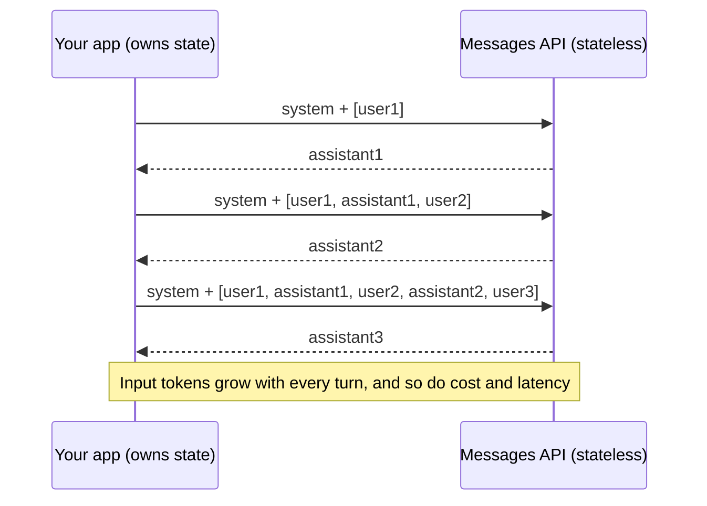
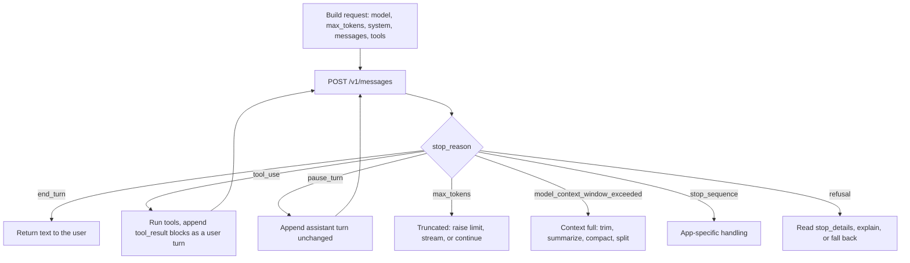
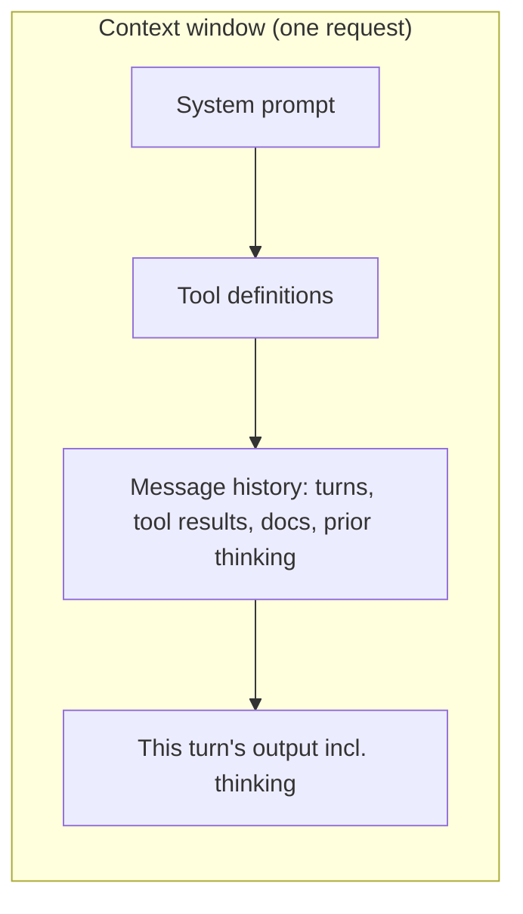

# Chapter 1 — Claude API Fundamentals: How You Talk to the Model

> **Exam domain(s):** Domain 1 — Agentic Architecture & Orchestration (27%) · Domain 4 — Prompt Engineering & Structured Output (20%) · Domain 5 — Context Management & Reliability (15%) · **Est. time:** 6–8 hours (reading + notebooks) · **Status:** [ ] not started

> **Also maps to:** CCDV-F D2.3 (Messages, invoking Claude through third-party vendors) and D5.1–5.2 (tokens, context windows, sampling, non-determinism, effort, SDKs that wrap REST APIs), plus the Messages API lessons of several Anthropic Academy courses. The full mapping is in [Certification coverage](#certification-coverage).

Every topic later in this repo (tool use, the Agent SDK, MCP, Claude Code) is built on one HTTP call: `POST /v1/messages`. This chapter takes that call apart piece by piece: what you send, what comes back, why the conversation has to be resent on every request, how to read `stop_reason`, what the system prompt is for, how tokens, the context window, sampling and model choice drive cost and reliability, and how the same call reaches Claude through an SDK, raw HTTP or a cloud platform.

---

## Why this matters for a solution architect

The Messages API is **stateless**. Your application owns the conversation state, so it also owns latency, cost and memory. Most of the "the bot forgot", "the agent never stopped" and "the bill doubled" incidents in production come from a wrong assumption at this layer. An architect who understands the request/response contract can reason about trade-offs like resending full history vs. summarizing, a bigger model vs. lower effort, or a bigger `max_tokens` vs. a smaller input. Those trade-offs are what the exam scenarios test.

## Learning objectives

- [ ] Build a valid Messages API request and explain every required and common optional field
- [ ] Explain the `user` / `assistant` roles, how tool results travel, and when a mid-conversation `system` message is allowed
- [ ] Explain why the API is stateless and implement a multi-turn chat that resends history correctly
- [ ] Name **all seven** current `stop_reason` values and write a handler for each
- [ ] Use the system prompt for persistent behavior and spot wording that creates unintended tool associations
- [ ] Describe what fills the context window, how overflow behaves, and the "lost in the middle" and summarization risks
- [ ] Explain what sampling does, which sampling parameters current models reject, and why identical requests can return different answers (and what that means for tests and evals)
- [ ] Count tokens before sending a request, read `usage` after it, and estimate cost per request
- [ ] Choose a model (and effort level) based on evals, latency and cost rather than habit
- [ ] Call Claude through the SDK or raw REST, with a sync or async client, and through Amazon Bedrock, Google Cloud or Microsoft Foundry, knowing what changes (client class, model ID, auth, features)

## Prerequisites

- [00 — Prerequisites](../../00-prerequisites/README.md): Python 3.11+, virtual environment, `requirements.txt` installed, `.env` with `ANTHROPIC_API_KEY`
- [Claude path overview](../README.md): exam format, the 5 domains, and the scenario list
- Basic HTTP/JSON knowledge (request body, status codes)

Shared setup used by every snippet in this chapter:

```python
# pip install anthropic python-dotenv
import os
import anthropic
from dotenv import load_dotenv

load_dotenv()                       # reads ANTHROPIC_API_KEY from .env
client = anthropic.Anthropic()      # picks the key up from the environment, never hardcode it
MODEL = "claude-sonnet-5-5"
```

---

## Concepts

### 1.1 Anatomy of a Messages API request

All interaction with Claude, including chat, extraction, agents and tools, goes through a single endpoint, `POST /v1/messages`. Features such as tools or structured output are *parameters on this endpoint*, not separate APIs.

```python
response = client.messages.create(
    model=MODEL,                    # required: which model answers
    max_tokens=16000,               # required: hard ceiling on generated tokens (thinking included)
    system="You are a concise assistant for a cloud architecture team.",   # optional
    messages=[                      # required: the conversation so far
        {"role": "user", "content": "In two sentences, what is an API gateway?"},
    ],
)
```

| Field | Required | What it does | Architect notes |
|---|---|---|---|
| `model` | yes | Model ID, e.g. `claude-sonnet-5-5` | Drives quality, latency, price and limits. Pin it in config, not in code. |
| `max_tokens` | yes | Upper bound on tokens the model may generate in this response | It is a ceiling, not a target. On current models, **thinking tokens count against it**, so values that are too low truncate answers. |
| `messages` | yes | Ordered list of `user` / `assistant` turns | Must contain the **full** history you want the model to see. |
| `system` | no | Operator instructions: role, rules, output format | String or list of text blocks (blocks allow `cache_control`). |
| `tools`, `tool_choice` | no | Tool definitions and the selection strategy | Covered in [Chapter 2](../02-tool-use/README.md). |
| `stop_sequences` | no | Custom strings that end generation | Produces `stop_reason: "stop_sequence"`. |
| `output_config` | no | `effort` (thinking depth / token spend) and `format` (structured outputs) | Effort is covered in [1.7](#17-model-selection-basics); structured outputs in [Chapter 6](../06-prompt-engineering/README.md). |
| `thinking` | no | Thinking configuration | Adaptive thinking runs by default on Sonnet 5.5, Opus 5.5 and Fable 5.1. On Opus 5.5 and Fable 5.1 it is always on: `{"type": "disabled"}` returns 400, so lower `effort` instead. On Sonnet 5.5, `{"type": "disabled"}` also returns 400; to turn off up-front thinking there, send `{"type": "between_tools"}` (accepted only at effort `low`, `medium` or `high`, with no other field in `thinking`). `budget_tokens` returns 400 on all three. Haiku 4.5 still uses the older `{"type": "enabled", "budget_tokens": N}` form. |
| `stream` | no | Server-sent events instead of one JSON body | Use it for long outputs or a large `max_tokens` to avoid HTTP timeouts. |
| `metadata.user_id` | no | Opaque end-user ID for abuse detection | Use a hash or UUID, never an email or name. |

**What comes back.** The response is a `Message` object:

```python
print(response.id)            # "msg_..."
print(response.model)         # the model that actually answered
print(response.stop_reason)   # why generation stopped (see 1.3)
print(response.usage)         # input_tokens, output_tokens, cache_* fields

# content is a LIST of typed blocks: text, thinking, tool_use, ...
for block in response.content:
    if block.type == "text":
        print(block.text)
```

> **Exam trap:** `response.content` is a list of typed blocks, not a string. With adaptive thinking on by default, the first block can be a `thinking` block (on current models its `thinking` field is an empty string by default, and the block has no `.text` attribute at all), so `response.content[0].text` is a bug waiting to happen. Always filter by `block.type`.

> **Note: changed since the guide.** The guide's examples use `claude-sonnet-4-6` / `claude-opus-4-6`. The current lineup is Claude Fable 5.1 (`claude-fable-5-1`), Opus 5.5 (`claude-opus-5-5`), Sonnet 5.5 (`claude-sonnet-5-5`) and Haiku 4.5 (`claude-haiku-4-5-20251001`). Several request fields also behave differently on the newest models: `temperature`, `top_p` and `top_k` are deprecated (non-default values are rejected on models released after Opus 4.6; see [Sampling and non-determinism](#sampling-and-non-determinism)), and thinking is on by default. Check the model page before you copy older snippets.

**Errors are not stop reasons.** A request that fails returns an HTTP error, for example `400 invalid_request_error`, `401`, `429 rate_limit_error`, `500` or `529 overloaded_error`. A request that succeeds returns HTTP 200 with a `stop_reason`. The Python SDK retries connection errors, 408, 409, 429 and 5xx twice by default with exponential backoff (`max_retries` on the client changes this). Catch typed exceptions such as `anthropic.RateLimitError` and `anthropic.BadRequestError`. Do not string-match error messages.

---

### 1.2 Message roles, alternation and stateless conversations

The `messages` array models a dialogue between two parties:

| Role | Who writes it | Typical content blocks |
|---|---|---|
| `user` | Your application, on behalf of the human *or* of your code | `text`, `image`, `document`, **`tool_result`** |
| `assistant` | The model (you replay its earlier outputs) | `text`, `thinking`, `tool_use` |

Key rules:

1. **Turns alternate.** The model is trained on alternating `user` → `assistant` turns. If you send two `user` messages in a row, the API merges them into one turn. Start the array with a `user` turn.
2. **Tool results go in a `user` message.** There is no `"tool"` role (unlike some other vendors' APIs). A tool result is a `tool_result` content block inside a `user`-role message, linked to the request by `tool_use_id`:

   ```python
   {"role": "user", "content": [
       {"type": "tool_result", "tool_use_id": "toolu_01...", "content": "Order 123: shipped"}
   ]}
   ```
3. **Content can be a string or a list of blocks.** `"content": "Hi"` is shorthand for `[{"type": "text", "text": "Hi"}]`. Use the list form for images, documents and tool results.
4. **The API is stateless.** Claude keeps no memory between calls. There is no session ID and no server-side history in the Messages API. To continue a conversation you resend **every** earlier turn.

```python
SYSTEM = "You are a friendly travel assistant. Keep answers under 80 words."
history: list[dict] = []

def chat(user_text: str) -> str:
    history.append({"role": "user", "content": user_text})
    resp = client.messages.create(
        model=MODEL, max_tokens=16000, system=SYSTEM, messages=history,
    )
    # Append the full content list, not just the text, so thinking/tool blocks survive
    history.append({"role": "assistant", "content": resp.content})
    return "".join(b.text for b in resp.content if b.type == "text")

chat("I love hiking and I'm vegetarian.")
chat("Suggest a weekend trip near Almaty.")   # works only because turn 1 is in `history`
```



**Mid-conversation `system` messages (model-gated).** On recent models (Claude Opus 5.5, Opus 5, Opus 4.8, Sonnet 5.5, Fable 5 / 5.1; on the Claude API, Amazon Bedrock and Google Cloud, no beta header) you can append `{"role": "system", "content": "..."}` inside `messages` to add an operator instruction partway through a conversation. Examples are a mode switch, or a fact your backend just learned. The benefit is that you keep the cached prefix intact, because you don't edit the top-level `system` field. Placement rules:

- It must come right after a `user` turn (a turn with `tool_result` blocks counts), or after an `assistant` turn that ends in a server tool result (a paused server-tool turn).
- It must be followed by an `assistant` turn, or be the last item in the array. A system message that carries content can never be `messages[0]`.
- It cannot sit between a `tool_use` and its `tool_result`. Any placement outside these rules returns a 400.
- Later system messages take precedence over earlier ones, and over the top-level `system` field, for the turns that follow.
- Never put untrusted text (raw tool output, retrieved documents, web content) in a system message: it would gain operator-level authority. Keep that data in `tool_result` blocks.

```python
messages = history + [
    {"role": "user", "content": "Any update on my booking?"},
    {"role": "system", "content": "Backend event: booking #A17 was confirmed 2 minutes ago."},
]
```

> **Note: changed since the guide.** The guide describes inline `system` messages as if every model accepts them. They are **model-gated**. Haiku 4.5, Sonnet 5 and older models reject a `role: "system"` message with a `400`, and the general Messages API reference still says there is no `system` role for input messages. Check model support before you design around this feature.

> **Exam trap:** The symptom "two turns later the bot asks again for something the user already said" almost always means the app is not resending earlier turns. It is rarely a context-window problem (two turns cannot overflow 1M tokens), and the fix is never a "session_id" parameter, because none exists.

**Prefill is gone on current models.** Older Claude models let you end `messages` with a partial `assistant` turn (for example `"Here is the JSON: {"`) and the model would continue from it. On Opus 4.6 / Sonnet 4.6 and every later model (including Sonnet 5.5, Opus 5.5 and Fable 5.1), a final-assistant-turn prefill returns **400**. Use structured outputs (`output_config.format`) or system-prompt instructions instead. Haiku 4.5 still accepts prefill. Assistant turns *earlier* in the history, such as few-shot examples, are still fine.

> **Note: changed since the guide.** Some practice questions in the guide (for example, removing "Certainly!" openers) treat prefill as the best answer. That reflects older models. On the exam, read the scenario carefully. In production on current models, prefill is not available.

---

### 1.3 `stop_reason`: why the model stopped

Every successful response carries `stop_reason`. It is the **only reliable control signal** for your code. Don't parse the model's prose ("I'm done!") to decide what to do next.

| `stop_reason` | Meaning | What your code should do |
|---|---|---|
| `end_turn` | The model finished its turn naturally | Return the answer and end the loop |
| `tool_use` | The model is requesting one or more client tool calls | Execute **every** `tool_use` block, send all `tool_result` blocks in one `user` message, and call again |
| `max_tokens` | The `max_tokens` ceiling was hit, so the output is **truncated** | Raise `max_tokens`, stream, or ask the model to continue. Never run a half-written `tool_use` from this turn. |
| `stop_sequence` | One of your `stop_sequences` was generated | Read `response.stop_sequence` to see which one, then apply your app logic |
| `pause_turn` | A **server-side** tool loop (web search, code execution, …) hit its iteration limit | Send the assistant turn back unchanged and call again. Don't add a "Continue" message. |
| `refusal` | The model or a safety classifier declined | Check `stop_reason` *before* reading `content`. `stop_details.category` explains why. Explain to the user or use a fallback model. |
| `model_context_window_exceeded` | Generation filled the model's **context window** (not `max_tokens`) | Treat as truncated. Shrink the input (trim, summarize, compact, split) rather than raise `max_tokens`. |



A defensive handler you can reuse in every notebook:

```python
def handle(resp) -> str | None:
    match resp.stop_reason:
        case "end_turn":
            return "".join(b.text for b in resp.content if b.type == "text")
        case "tool_use":
            raise NotImplementedError("Run tools and loop (Chapter 2)")
        case "pause_turn":
            raise NotImplementedError("Resend history + this assistant turn unchanged")
        case "max_tokens":
            raise RuntimeError("Output truncated: raise max_tokens or stream")
        case "model_context_window_exceeded":
            raise RuntimeError("Context window full: shrink the input")
        case "stop_sequence":
            print("Stopped on", repr(resp.stop_sequence))
            return "".join(b.text for b in resp.content if b.type == "text")
        case "refusal":
            category = resp.stop_details.category if resp.stop_details else None
            print("Refused, category:", category)
            return None
        case other:
            raise ValueError(f"Unknown stop_reason: {other}")   # future-proofing
```

**Refusal fallbacks (opt-in, beta).** Fable 5.1, Fable 5, Opus 5.5, Opus 5 and Sonnet 5.5 run safety classifiers that can decline a request with HTTP 200 and `stop_reason: "refusal"`. `content` is empty when the decline comes before any output; a mid-stream refusal can leave partial output, which you should discard. On the Claude API (not Bedrock, Google Cloud, Foundry or the Batch API) you can ask the server to retry a declined request on a fallback model in the same call. With `fallbacks="default"`, Anthropic picks the fallback model per refusal category; categories without a recommended fallback stay refused. For Sonnet 5.5, the default routing currently retries only `cyber` and `frontier_llm` declines (on Sonnet 5), not `bio`, `reasoning_extraction` or `general_harms`. You can also pass an explicit list of up to three fallback models instead of `"default"`. On other platforms, use the SDK's client-side fallback middleware.

```python
resp = client.beta.messages.create(
    model=MODEL,
    max_tokens=16000,
    betas=["server-side-fallback-2026-07-01"],
    fallbacks="default",
    messages=[{"role": "user", "content": "Review this nginx config for security issues: ..."}],
)
```

`stop_details` is populated **only** for `refusal`. It is `null` for every other stop reason, so guard before reading it. Even on a refusal, `stop_details.category` and `stop_details.explanation` can be `null`, so branch on `stop_reason`, not on the category. When a fallback served the request, the top-level `response.model` names the fallback model.

> **Note: changed since the guide.** The guide lists four stop reasons (`end_turn`, `tool_use`, `max_tokens`, `stop_sequence`). The current API has **seven**: `pause_turn`, `refusal` and `model_context_window_exceeded` were added. On Claude 4.5 and newer models, a request whose *input + max_tokens* exceeds the window is accepted, and generation stops with `model_context_window_exceeded` when the window is actually full. If the *input alone* is over the limit, you still get a `400 "prompt is too long"`. (The beta compaction feature can also return an eighth value, `compaction`, on the beta Messages endpoint. The `case other` branch in the handler above catches it until the later chapter on context management covers it.)

> **Exam trap:** For agent loops, the correct termination logic is "continue while `stop_reason == "tool_use"`, stop on `end_turn`". Distractors include checking whether the reply contains text, looking for words like "done" or "complete", or relying on a fixed iteration cap as the *primary* stopping rule. A cap is a reasonable safety net, but it should not be the main control.

> **Exam trap:** `max_tokens` and `model_context_window_exceeded` look alike (both mean truncated output), but the fixes are opposite. The first means you allowed too few *output* tokens. The second means the *whole context* is full, so adding output budget does nothing and you need to remove input.

---

### 1.4 The system prompt

The system prompt carries **operator-level** instructions that should hold for the whole conversation: role/persona, scope, rules, tone and output format. It lives in the top-level `system` field, not in `messages`, and you send it on **every** request. "Persistent" only means your code resends it each time.

```python
SYSTEM = """You are the support assistant for Acme Cloud.
<scope>Billing, plans and invoices only. For outages, point users to status.acme.example.</scope>
<style>Friendly, direct, max 120 words, no marketing language.</style>
<rules>
- Look up the customer only when the question is about their specific account or invoice.
- Never promise refunds; explain the refund policy and offer escalation.
</rules>"""
```

What belongs where:

| Put it in… | When |
|---|---|
| `system` (top level) | Stable rules, persona, format, and policies that apply to every turn. Keep it stable so prompt caching works. |
| A mid-conversation `system` message | Operator updates that appear partway through (mode switches, backend events) on models that support it |
| The `user` turn | The task itself, the user's data, and per-request context such as retrieved documents |
| Few-shot examples | Behavior that is hard to describe in rules. Concrete examples drift less than long lists of abstract rules ([Chapter 6](../06-prompt-engineering/README.md)). |

**Unintended tool associations.** The system prompt shapes *everything*, including which tools the model reaches for. An absolute instruction such as *"Always verify the customer first"* can make an agent call `get_customer` on every turn, including general FAQ questions where it is pointless. A keyword-flavored rule ("if the user mentions *account*…") can quietly steer tool selection for any message containing that word. Scope instructions to the situation where they apply ("before any action on a specific order or account, verify…").

**Instruction drift.** In long conversations, behavior can slide away from the system prompt as the model increasingly follows patterns in its own earlier replies. Mitigations, from cheapest to most expensive:

1. Make the system prompt concrete: use examples, not 3,000 tokens of abstract rules.
2. Put the most critical constraints where they are easy to find, with clear section tags.
3. Re-inject short reminders at natural breakpoints. Use a mid-conversation `system` message where the model supports it.
4. Validate outputs and regenerate. This is corrective, adds latency, and is the last resort.

> **Exam trap:** "Where should persistent tone and behavior rules live?" → the system prompt. Not the first user message (that carries less authority), not the first assistant message (the model can drift from its own words), and not environment variables (the model never sees them).

> **Exam trap:** If a tool is over-used even though its description is clear, look for **system-prompt wording** that pushes the model toward it, before you rewrite the tool.

---

### 1.5 The context window

The context window is the model's working memory for **one request**. Everything counts toward it:

- the system prompt
- the tool definitions
- every message in `messages`, including tool results, images and documents
- the output generated in this turn, **including thinking**

On Opus 4.5 and later Opus models, Sonnet 4.6 and later Sonnet models, and Fable 5 / 5.1, thinking blocks from earlier assistant turns are kept by default and count as input tokens. Haiku models (and older Opus/Sonnet models) strip them automatically when you pass them back.

| Model | Context window | Max output (sync API) |
|---|---|---|
| Claude Fable 5.1 | 1M tokens | 128K |
| Claude Opus 5.5 | 1M tokens | 128K |
| Claude Sonnet 5.5 | 1M tokens | 128K |
| Claude Haiku 4.5 | 200K tokens | 64K |

A 1M window is the default on these models: no beta header, standard pricing. (Max output is the synchronous Messages API limit. On the Message Batches API, Opus 5.5 and Sonnet 5.5 can produce up to 300K output tokens with the `output-300k-2026-03-24` beta header.) A bigger window does not mean better answers, though. As context grows, recall and accuracy degrade (Anthropic calls this *context rot*). **What** you put in context matters more than how much fits.



Three failure patterns the exam returns to again and again:

1. **Lost in the middle.** Models reliably use information at the start and end of a long input but can miss details buried in the middle. Place key facts and instructions at the edges, and use clear headings. For long documents, put the documents first and the question at the end.
2. **Tool-result bloat.** Every tool call adds its output to history. If a tool returns 40 fields and you need 5, you pay for and dilute the context with 35 irrelevant ones on every later turn. Trim tool outputs to the fields that matter before you append them.
3. **Lossy summarization.** When you compress history, exact values (amounts, percentages, dates, IDs) tend to become vague ("around", "a few"). Keep a separate structured **"case facts"** block (for example `{"order_id": "A17", "refund_amount": 42.50, "deadline": "2026-10-10"}`) that you never summarize. Summarize the chit-chat and keep recent turns verbatim.

Mitigations, roughly in order of how much they change your architecture:

| Technique | What it does | Covered in |
|---|---|---|
| Trim tool outputs | Keep only relevant fields | [Chapter 2](../02-tool-use/README.md) |
| Hybrid history | Structured facts + summary of old turns + recent turns verbatim | this chapter, [`01_practice.ipynb`](01_practice.ipynb) section 1.5; in depth in [Chapter 11](../11-context-management/README.md#111-extract-facts-into-a-persistent-case-facts-block) |
| Prompt caching | Same tokens, much cheaper and faster on reuse (does **not** free space) | [Prompt caching docs](https://platform.claude.com/docs/en/build-with-claude/prompt-caching) (beyond exam scope except knowing it exists) |
| Server-side compaction / context editing (beta) | The API summarizes or clears old content for you | [Chapter 11](../11-context-management/README.md#119-server-side-compaction-beyond-the-guide) |
| Subagents | Isolate verbose exploration in a separate context, return a summary | [Chapter 3](../03-agent-sdk/README.md) |
| Retrieval | Fetch only the relevant slices of a large corpus or a long history | [Chapter 11](../11-context-management/README.md#111-extract-facts-into-a-persistent-case-facts-block) (retrieval over past exchanges); full RAG design is planned for the vendor-neutral track (see the [root progress tracker](../../README.md#progress-tracker)) |

> **Exam trap:** "Switch to a model with a bigger context window" is usually a distractor. If the problem is attention dilution, lost-in-the-middle, or a summarization that dropped numbers, more room does not fix it. Better curation does.

#### Sampling and non-determinism

Everything in the window feeds one loop: the model computes a probability for every possible next token, **samples** one, appends it and repeats (the loop is drawn in [00 — Prerequisites §2.9](../../00-prerequisites/README.md#29-next-token-generation)). Sampling parameters reshape that probability distribution before each pick:

| Parameter | What it does | On Sonnet 5.5, Opus 5.5 and Fable 5.1 |
|---|---|---|
| `temperature` (0.0–1.0, default 1.0) | Low values sharpen the distribution (more predictable text), high values flatten it (more varied text) | Deprecated. Models released after Opus 4.6 reject non-default values with a 400. The API reference still accepts `1.0` for backward compatibility. |
| `top_p` (nucleus sampling) | Keeps the smallest set of most-likely tokens whose probabilities add up to `p` and drops the long tail | Deprecated on the same models. Only values ≥ 0.99 are accepted. |
| `top_k` | Keeps only the `k` most likely tokens | Deprecated on the same models. Any value returns a 400. |

Haiku 4.5, and the 4.6 and older models, still accept all three. The Python SDK 1.x removed them from `messages.create()` (passing one raises a `TypeError`), so for those models you send them through `extra_body={"temperature": 0.2}`. On current models you steer output with the prompt, `effort` ([1.7](#17-model-selection-basics)) and structured outputs instead. Don't send sampling parameters to them at all.

**Why identical requests return different answers.** Each token is sampled, and with adaptive thinking the model also decides how much to reason, so two runs of the same request can take different paths and produce different text, different tool calls, or occasionally a different label. This is not new: the API reference has always noted that "even with `temperature` of `0.0`, the results will not be fully deterministic." Prompt caching does not change this either, because it reuses the processed prompt prefix, not the answer.

What this means for engineering and evals:

- **Test properties, not strings.** Assert that the output parses, matches the schema, picks the right label, contains the required facts, or stays under a length limit.
- **Sample several runs per eval example** (3–5 is a common start) and report a **pass rate** with its spread, not a single pass/fail. Compare two configurations on the same examples with the same number of runs. A one-off run that "worked" proves little.
- **Make the shape deterministic, not the wording.** Structured outputs (`output_config.format`) and strict tool use guarantee the schema ([Chapter 6](../06-prompt-engineering/README.md)). Validators and graders check the content.
- **Pin what you can for reproducibility:** the exact model ID, the prompt version, `effort`, and the tool set. Log the full request and the `request_id`.
- **If the product needs the same answer every time** (an approved FAQ answer, a regulated disclosure), store and reuse that answer in your application. The model will not guarantee it.

> **Exam trap:** "Set `temperature=0` so the tests are deterministic" is wrong twice: current models reject it with a 400, and even where it is accepted it never guaranteed identical output. The expected answer is to run several samples, check properties, and use structured outputs for the shape.

---

### 1.6 Tokens: counting before, measuring after

Tokens are the unit for limits, rate limits and billing. Two tools:

**Before sending: the token counting endpoint.** It accepts the same `system`, `messages`, `tools`, images, PDFs and `thinking` fields as `messages.create`, and returns `input_tokens`. It is **free** (with its own requests-per-minute limit, separate from message creation), and the result is an *estimate*. It rejects a few inputs that `messages.create` accepts: server tools (web search, web fetch, code execution, tool search; the advisor tool is the one server tool it accepts, and then it counts only the executor's first sampling call), the MCP connector, and image/document blocks with a `url` or `file` source. Send images and PDFs as base64 when you count them. For requests with server tools or MCP servers, read the real count from `usage` after the call.

```python
count = client.messages.count_tokens(
    model=MODEL,                      # counts are model-specific: use the model you will call
    system=SYSTEM,
    messages=history + [{"role": "user", "content": open("contract.txt").read()}],
)
print(count.input_tokens)
```

**After sending: `response.usage`.**

```python
u = response.usage
print(u.input_tokens, u.output_tokens)                         # billed input / output
print(u.cache_creation_input_tokens, u.cache_read_input_tokens)  # prompt caching fields

PRICE = {"claude-sonnet-5-5": (2.00, 10.00)}   # USD per million tokens (input, output); check the pricing page
inp, out = PRICE[MODEL]
# Uncached input + output only; cache writes/reads are priced differently (see the pricing page)
cost = u.input_tokens / 1e6 * inp + u.output_tokens / 1e6 * out
print(f"${cost:.5f}")
```

Practical rules:

- **Don't use `tiktoken`** or a "characters ÷ 4" rule for Claude. It is a different tokenizer and the estimate can be badly off.
- **Recount when you change model generation.** Claude 4.7 and later models (including Sonnet 5.5, Opus 5.5 and Fable 5.1) use a newer tokenizer that produces approximately 30% more tokens for the same text than earlier models such as Haiku 4.5. The exact increase depends on the content.
- Thinking tokens are billed as **output** tokens and are part of `max_tokens`.
- Because the API is stateless, a 50-turn chat re-bills the earlier turns as input on every call. Prompt caching cuts the price of that repeated prefix. Summarization and compaction cut its size.

> **Note: changed since the guide.** The guide does not cover token counting or the tokenizer change. The tokenizer change matters in practice: a prompt measured on an older model can come out about 30% larger on current models.

---

### 1.7 Model selection basics

Current lineup (prices per million tokens, Claude API, first-party):

| Model | API ID | Best for | Latency | Input / Output | Context |
|---|---|---|---|---|---|
| Claude Fable 5.1 | `claude-fable-5-1` | The hardest reasoning and long-horizon agentic work | Slower | $10 / $50 | 1M |
| Claude Opus 5.5 | `claude-opus-5-5` | Long-running agentic coding and knowledge work; Anthropic's suggested starting point | Moderate | $4 / $20 | 1M |
| Claude Sonnet 5.5 | `claude-sonnet-5-5` | Best balance of speed and intelligence for everyday production work | Fast | $2 / $10 | 1M |
| Claude Haiku 4.5 | `claude-haiku-4-5-20251001` | High-volume, latency-sensitive, simple tasks (classification, routing, extraction) | Fastest | $1 / $5 | 200K |

Batch API requests are 50% off (covered in [Chapter 7](../07-message-batches/README.md)). Prompt-cache reads cost 10% of the base input price on most models (5% on Opus 5.5, 2.5% on Fable 5.1).

You have three levers, and they interact:

1. **Model tier:** the capability ceiling and the per-token price.
2. **Effort** (`output_config={"effort": "low" | "medium" | "high" | "xhigh" | "max"}`): how much the model thinks and how many tokens it spends. Defaults on the Claude API: Fable 5.1 `high`, Sonnet 5.5 `high`, Opus 5.5 `medium`. Haiku 4.5 does not support effort. A stronger model at lower effort can match or beat a weaker model at high effort, sometimes at a similar or lower cost per task, so measure both.
3. **Architecture:** a cheaper model for routing or sub-tasks, a stronger model for orchestration or final synthesis.

```python
resp = client.messages.create(
    model=MODEL,
    max_tokens=2000,
    output_config={"effort": "low"},           # cheap and fast for a simple classification
    system="Classify the ticket as billing, technical or other. Reply with one word.",
    messages=[{"role": "user", "content": "My invoice shows two charges for September."}],
)
```

Selection process, the way an architect should defend it:

1. Define success with a small **eval set** of 20–100 real examples and a pass criterion.
2. Start from a capable default (Sonnet 5.5 or Opus 5.5) to establish a quality bar.
3. Step down (lower effort, then a cheaper model) while the eval still passes. Step up only when it fails.
4. Compare **cost per completed task**, not cost per request. A cheap model that needs retries or extra turns is not cheap.
5. Check limits and lifecycle: context size, max output, platform availability, and the retirement date on the deprecations page. For example, Haiku 4.5's retirement commitment is only "not sooner than October 15, 2026" (under two weeks after this chapter was checked), while the 5.x models are committed until at least September 2027. Recheck the deprecations page before you build on Haiku 4.5.

Query capabilities at runtime instead of hardcoding them:

```python
m = client.models.retrieve(MODEL)
print(m.display_name, m.max_input_tokens, m.max_tokens)   # context window, max output
```

> **Exam trap:** "Use the biggest model to be safe" and "pick the model with the largest context window" are typical wrong answers. The expected reasoning is: measure on representative data, then choose the cheapest configuration that meets the quality bar.

---

### 1.8 Access paths: SDKs, raw REST, async clients and cloud platforms

The same Messages API request can reach Claude by several routes. An architect picks one based on the team's language, how much concurrency the workload needs, and where data, identity and billing have to live.

**SDK vs raw REST.** The official client SDKs (Python, TypeScript, Java, Go, C#, PHP, Ruby) are typed wrappers over the REST API. Under `client.messages.create(...)` there is one `POST https://api.anthropic.com/v1/messages` with three headers (`x-api-key`, `anthropic-version: 2023-06-01`, `content-type: application/json`) and a JSON body that is exactly your keyword arguments.

```bash
curl https://api.anthropic.com/v1/messages \
  -H "x-api-key: $ANTHROPIC_API_KEY" \
  -H "anthropic-version: 2023-06-01" \
  -H "content-type: application/json" \
  -d '{"model": "claude-sonnet-5-5", "max_tokens": 1024,
       "messages": [{"role": "user", "content": "In two sentences, what is an API gateway?"}]}'
```

| The SDK does this for you | With raw HTTP you build it yourself |
|---|---|
| Finds credentials: `ANTHROPIC_API_KEY`, then `ANTHROPIC_AUTH_TOKEN`, then an `ant auth login` profile or workload identity federation | Read the key and set `x-api-key` on every call |
| Sends `anthropic-version` and SDK identification headers | Set `anthropic-version` yourself |
| Retries connection errors, 408, 409, 429 and 5xx (2 retries by default, exponential backoff, honoring the server's retry-after hint), with a 10-minute default timeout | Write the retry and backoff loop, and decide what is safe to retry |
| Raises typed exceptions (`RateLimitError`, `OverloadedError`, …) and returns typed `Message` objects | Map status codes and parse JSON by hand |
| Helpers: `messages.stream()` with `get_final_message()`, `count_tokens`, batches, pagination, `_request_id` | Parse server-sent events and paginate yourself |

Prefer the SDK. Use raw HTTP when your language has no SDK, in shell scripts, or to debug what the SDK sends. Even then the body is the same. To route SDK traffic through a proxy or an internal gateway, set `base_url=` (or `ANTHROPIC_BASE_URL`) instead of rewriting call sites. The Python SDK 1.x is built on `httpx2`; to customize transport (proxies, connection limits) pass `http_client=anthropic.DefaultHttpxClient(...)`.

**Sync vs async clients.** `anthropic.Anthropic()` blocks on each call. `anthropic.AsyncAnthropic()` has the same methods and parameters, but you `await` them. Use the async client when one process has to keep many requests in flight, for example a web server or a fan-out over many documents. Combine `asyncio.gather` with a semaphore so you stay under your rate limits. Async does not make a single request faster or cheaper. For large volumes that are not urgent, the Message Batches API is 50% cheaper ([Chapter 7](../07-message-batches/README.md)). For very high concurrency, install `anthropic[aiohttp]` and pass `http_client=anthropic.DefaultAioHttpClient()`.

```python
import asyncio
import anthropic

aclient = anthropic.AsyncAnthropic()
limit = asyncio.Semaphore(8)                      # at most 8 requests in flight

async def summarize(doc: str) -> str:
    async with limit:
        resp = await aclient.messages.create(
            model=MODEL, max_tokens=2000,
            messages=[{"role": "user", "content": f"Summarize in one sentence:\n{doc}"}],
        )
    return "".join(b.text for b in resp.content if b.type == "text")

docs = ["First incident report ...", "Second incident report ...", "Third incident report ..."]
summaries = await asyncio.gather(*(summarize(d) for d in docs))   # in a notebook; use asyncio.run(...) in a script
```

**Calling Claude through a cloud platform.** Each platform has its own client class. After construction you call `client.messages.create(...)` exactly as before.

| Platform | Python client | Model ID for Sonnet 5.5 | Authentication | What differs |
|---|---|---|---|---|
| Claude API (Anthropic, first-party) | `Anthropic()` | `claude-sonnet-5-5` | Anthropic API key | Reference surface; new features and betas usually land here first |
| Claude Platform on AWS (Anthropic-operated) | `AnthropicAWS()` (`pip install "anthropic[aws]"`) | `claude-sonnet-5-5` | AWS IAM (SigV4), AWS Marketplace billing | Same API surface as first-party; needs an AWS region and a workspace ID |
| Amazon Bedrock (AWS-operated) | `AnthropicBedrockMantle(aws_region="us-east-1")` (`anthropic[bedrock]`) | `anthropic.claude-sonnet-5-5` | AWS IAM (SigV4) or a short-term Bedrock bearer token | Endpoint `https://bedrock-mantle.{region}.api.aws/anthropic/v1/messages`. The older `AnthropicBedrock` client is the legacy `InvokeModel` path for Opus 4.6 and earlier |
| Google Cloud Agent Platform (Vertex AI) | `AnthropicVertex(project_id="...", region="global")` (`anthropic[vertex]`) | `claude-sonnet-5-5` (older dated models use `@`, for example `claude-haiku-4-5@20251001`) | Google Application Default Credentials; no Anthropic key | The model goes in the URL (`.../models/claude-sonnet-5-5:rawPredict`) and the body carries `"anthropic_version": "vertex-2023-10-16"` instead of a header |
| Microsoft Foundry | `AnthropicFoundry(api_key=..., resource="...")` | Your **deployment name** (defaults to `claude-sonnet-5-5`) | Azure API key or Microsoft Entra ID | Endpoint `https://{resource}.services.ai.azure.com/anthropic/v1/messages`; billed through the Azure Marketplace |

```python
from anthropic import AnthropicBedrockMantle, AnthropicVertex

bedrock = AnthropicBedrockMantle(aws_region="us-east-1")             # AWS credential chain
vertex = AnthropicVertex(project_id="my-gcp-project", region="global")  # gcloud ADC

request = {"max_tokens": 1024, "messages": [{"role": "user", "content": "Hello, Claude"}]}
bedrock.messages.create(model="anthropic.claude-sonnet-5-5", **request)
vertex.messages.create(model="claude-sonnet-5-5", **request)
```

What changes when you move between platforms:

- **Model IDs.** Bedrock adds the `anthropic.` prefix, Foundry expects your deployment name, and Vertex uses `@` for dated snapshots. Keep a per-platform model map in configuration.
- **Feature parity.** Partner platforms omit some features or get them later. The ones this repo uses most, as of October 2026 (check the [Features overview](https://platform.claude.com/docs/en/build-with-claude/overview) before you design):

| Feature | Claude API | Amazon Bedrock | Google Cloud | Microsoft Foundry |
|---|---|---|---|---|
| Messages API, prompt caching, thinking, effort, token counting | ✓ | ✓ | ✓ | ✓ |
| Structured outputs | ✓ | ✗ (only the legacy `InvokeModel` path, older models) | ✓ | ✓ |
| Message Batches API, Models API | ✓ | ✗ | ✗ | ✗ |
| Server-side `fallbacks` (beta) | ✓ | ✗ (use the SDK's client-side fallback middleware) | ✗ (middleware) | ✗ (middleware) |
| Web search / web fetch / code execution | ✓ | ✗ | Web search only | ✓ on deployments hosted on Anthropic; deployments hosted on Azure get only the basic web search and web fetch versions and no code execution |
| Files API and `url` image/document sources | ✓ | ✗ | ✗ | Deployments hosted on Anthropic only |

- **Price, quotas and lifecycle.** Bedrock and Google Cloud set their own prices; their regional and multi-region endpoints cost 10% more than the global endpoint. Quotas come from the platform (Bedrock's default is 2 million input tokens per minute). Foundry bills in Azure Marketplace units. Partner retirement dates can differ from Anthropic's schedule.
- **No Models API off the Claude API.** On Bedrock, Google Cloud and Foundry, keep context window and output limits in configuration instead of calling `models.retrieve()`.

Claude Platform on AWS and Amazon Bedrock are different products: the first is run by Anthropic with the full first-party API on AWS billing and IAM; the second is run by AWS with its own feature subset. Choose by whether you need first-party feature parity or Bedrock's ecosystem and data boundary.

> **Exam trap:** "Move the workload to Bedrock (or Google Cloud) and keep the code unchanged" is wrong: the client class, model ID and credentials change, and features such as batches, the Models API or server-side fallback may not exist there. The opposite distractor, "rewrite the integration for the cloud provider's own API", is also wrong: the request body is the same Messages API, so a platform-specific client plus a model-ID map is enough.

---

## Notebooks

| Notebook | What it covers | What you build |
|---|---|---|
| [`01_practice.ipynb`](01_practice.ipynb) | One section per concept, 1.1–1.8: request anatomy and typed SDK errors; roles, statelessness, mid-conversation `system` messages and prefill; all seven `stop_reason` values (three triggered live, the rest mocked) with a `handle()` dispatcher; system-prompt A/B and a drift experiment; context-window outcomes, tool-result trimming, hybrid history and a needle test; a sampling simulator (temperature, top-p) and a "one run vs. several runs" eval demo; `count_tokens` vs. `usage`, tokenizer comparison and a cost calculator; `models.retrieve()` and a small model/effort eval; the exact HTTP request the SDK sends vs. a raw `httpx2` call, SDK retries, async fan-out, and the same request through the Bedrock, Google Cloud, Foundry and Claude Platform on AWS clients (all offline, through a mock transport). Live and offline cells are labeled. | **Mini-project:** `ChatSession`, a multi-turn chat helper that keeps history, handles every `stop_reason` (tools, `pause_turn`, budget retries, refusal fallback, rollback), and reports token usage and cost. It is tested offline with a scripted fake client, then run live. |
| [`02_homework.ipynb`](02_homework.ipynb) | Self-test: a 12-question exam-style quiz with a hashed answer key, 7 auto-checked coding exercises (build a request, read a response safely, agent-loop control flow, validate `messages`, cost per completed task, fit-in-window check, a per-platform request router), an architecture scenario with a rubric, and a scorecard (pass mark 72%) | Answers and reference solutions sit in collapsed blocks at the bottom. Everything is checked offline; the one optional live cell uses the free token-counting endpoint. |

Theory stays in this README; notebooks hold code. Run them from the repo root venv (see [../../00-prerequisites/README.md](../../00-prerequisites/README.md)).

---

## Architect decision cheat-sheet

| Situation | Choose | Over | Why |
|---|---|---|---|
| The bot forgets facts from earlier turns | Resend full history (or a curated version) every call | Bigger context window or a "session" feature | The API is stateless; the history is your responsibility |
| Deciding whether an agent loop should continue | `stop_reason == "tool_use"` → continue, `end_turn` → stop | Parsing the reply text or fixed iteration counts | `stop_reason` is the structured, reliable signal |
| Output cut off, `stop_reason = max_tokens` | Raise `max_tokens` / stream / continue | Shrinking the prompt | Only the output budget ran out |
| Output cut off, `stop_reason = model_context_window_exceeded` | Trim, summarize, compact or split the input | Raising `max_tokens` | The whole window is full |
| Persona, tone and rules for every turn | Top-level `system` prompt | First user message, env vars | The system prompt carries operator authority and caches well |
| A backend event arrives mid-chat | Mid-conversation `system` message (supported models) or a prefix on the next user turn | Editing the top-level system prompt | Keeps the cached prefix and a clear authority channel |
| Long chat getting slow and expensive | Prompt caching + hybrid history (facts + summary + recent turns) | Truncating to the last N messages | Truncation silently drops critical facts |
| Tool returns 40 fields, 5 matter | Trim before appending to history | Passing raw payloads | Saves tokens on every later turn and reduces dilution |
| Need the token count before a big request | `messages.count_tokens` with the target model | `tiktoken` or chars/4 | Model-specific tokenizer; the endpoint is free |
| High-volume simple classification | Smallest model / lowest effort that passes your eval | Default to the largest model | Cost per completed task at the required quality |
| Need guaranteed JSON shape on current models | Structured outputs (`output_config.format`) | Assistant prefill | Prefill returns 400 on 4.6+ models |
| Tests or evals give different results on identical inputs | Several runs per example, property checks, pass rates; structured outputs for the shape | `temperature=0` | Sampling and adaptive thinking vary by design; current models reject non-default `temperature` |
| Many concurrent requests from one service | `AsyncAnthropic` + `asyncio.gather` + a semaphore (or Batches if not urgent) | A thread per request, or raw HTTP to "go faster" | Same API, more requests in flight, still under rate limits |
| Data, IAM and billing must stay in AWS / Google Cloud / Azure | The platform's client class (`AnthropicBedrockMantle`, `AnthropicVertex`, `AnthropicFoundry`, or `AnthropicAWS` for full first-party parity) + a per-platform model map | The first-party client with copied model IDs | Model IDs, auth and feature sets differ per platform |

---

## Common mistakes and anti-patterns

- **Reading `response.content[0].text` blindly.** It breaks on thinking blocks, tool calls and refusals (where `content` may be empty). Iterate and filter by `type`.
- **Appending only the text of the assistant reply to history.** You lose `tool_use` / `thinking` blocks that later requests need. Append `resp.content`.
- **Assuming the server remembers anything.** No session IDs, no implicit memory, no vector database behind the Messages API.
- **Treating `stop_reason` as optional.** Not handling `max_tokens` ships truncated JSON to production. Not handling `refusal` crashes on empty content.
- **Running tools from a truncated turn.** If `stop_reason == "max_tokens"`, a `tool_use` input may be incomplete. Retry with a larger limit instead.
- **Lowballing `max_tokens`.** With adaptive thinking on, a 512-token limit can be spent entirely on thinking. Use generous limits (around 16K non-streaming) unless you have a hard reason not to.
- **Absolute, keyword-driven system prompt rules** ("ALWAYS call X", "if the user says *account*…"). They create unintended tool associations and over-triggering.
- **"Just use the 1M window."** Stuffing everything in raises cost and latency and invites lost-in-the-middle errors.
- **Summarizing away exact numbers.** Keep amounts, dates and IDs in a structured facts block that you never summarize.
- **Hardcoding API keys or model capabilities.** Use `.env` / secret managers and the Models API.
- **Copying old snippets without checking the model.** Prefill, `temperature`, `budget_tokens` thinking, `thinking: {"type": "disabled"}` and inline `system` messages all behave differently across generations.
- **Judging a prompt or model on one run.** Outputs vary between identical requests. Sample several runs and compare pass rates.
- **Assuming every platform has every feature.** Bedrock, Google Cloud and Foundry lack some features (batches, the Models API, server-side fallback, some server tools) and use different model IDs.

---

## Self-check

**Q1.** Your recipe assistant asks *"Do you have any dietary restrictions?"* although the user said *"I'm allergic to peanuts"* two messages earlier. Total conversation size is about 600 tokens. What is the most likely cause?

- A) The context window is full, so earlier turns are being dropped
- B) The app sends only the latest user message in `messages` on each call
- C) The request is missing a `session_id`, so the API cannot link the turns
- D) Temperature is too high, so the model ignores earlier facts

<details><summary>Answer</summary>

**B.** The Messages API is stateless. The model only knows what is in the current request. 600 tokens cannot overflow any current window (A), there is no `session_id` parameter (C), and sampling settings don't erase facts (D).
</details>

**Q2.** You build a manual agent loop for a support agent. Sometimes it stops after the first tool call, and sometimes it loops forever. The loop currently ends when the reply contains any `text` block. What change makes termination reliable?

- A) Stop when the text contains words like "done" or "resolved"
- B) Cap the loop at 5 iterations and treat that as completion
- C) Continue while `stop_reason == "tool_use"`, executing tools and returning results; stop on `end_turn`
- D) Ask the model to output `{"finished": true}` and parse it

<details><summary>Answer</summary>

**C.** `stop_reason` is the structured control signal. The model often writes text *and* requests a tool in the same turn, so "has text" is wrong, and phrase matching (A, D) is fragile. A cap (B) is a fine safety net but not a completion signal.
</details>

**Q3.** A pipeline streams a 950K-token set of filings to Sonnet 5.5 with `max_tokens=64000` and asks for a summary. The response ends mid-sentence with `stop_reason: "model_context_window_exceeded"`. What should you do?

- A) Increase `max_tokens` to 128000
- B) Retry the same request with a longer HTTP timeout
- C) Reduce the input (split the filings into chunks, summarize each, then synthesize) so input plus output fits in the window
- D) Lower the effort level so thinking uses fewer tokens, and resend unchanged

<details><summary>Answer</summary>

**C.** The whole context window, not the output budget, is exhausted. A larger `max_tokens` (A) cannot help, and a longer timeout (B) changes transport, not capacity. (Streaming is already required here: the Python SDK refuses non-streaming requests whose `max_tokens` is large enough to risk a 10-minute HTTP timeout.) Lower effort (D) might squeeze one answer through, but it leaves the design fragile and lowers summary quality. The input needs to shrink.
</details>

**Q4.** After you added *"Always verify the customer's identity before answering"* to the system prompt, logs show the agent calling `get_customer` for questions like "What are your opening hours?". The tool descriptions are clear. What is the best fix?

- A) Remove `get_customer` from the tool list
- B) Rewrite the instruction to scope it: verify identity only before account- or order-specific actions
- C) Add few-shot examples that show `get_customer` being called first
- D) Switch to a larger model

<details><summary>Answer</summary>

**B.** The absolute wording creates an unintended association between *every* turn and `get_customer`. Scoping the rule fixes the root cause. A breaks legitimate flows, C reinforces the over-use, and D does not change what the prompt tells the model to do.
</details>

**Q5.** Users report that a chat assistant becomes slower and more expensive after about 50 turns, although each answer is short. What is the primary cause?

- A) The model builds an internal user profile that grows over time
- B) The whole conversation history is resent and processed as input on every request
- C) Output length grows linearly with conversation length
- D) The API throttles long conversations

<details><summary>Answer</summary>

**B.** Statelessness means input tokens grow with every turn, which raises both latency and cost. Fixes include prompt caching for the stable prefix and hybrid history (structured facts + summary + recent turns verbatim).
</details>

**Q6.** Before you route a large contract to a model, you need to know whether it fits and roughly what it costs. Which approach is most accurate?

- A) Estimate with `tiktoken`, because tokenizers are similar across vendors
- B) Divide the character count by 4
- C) Call `messages.count_tokens` with the same model, system prompt, tools and messages you will send
- D) Send the request and read `usage`; if it fails, split the document

<details><summary>Answer</summary>

**C.** Token counts are model-specific (current models use a newer tokenizer), and the counting endpoint is free and accepts the same inputs as `messages.create`. A and B are inaccurate. D wastes money and time and gives no answer in advance.
</details>

**Q7.** You migrate a working extractor from Claude Haiku 4.5 to Claude Sonnet 5.5. Every request now fails with HTTP 400. The code ends `messages` with `{"role": "assistant", "content": "{"}` to force JSON output. What is the right fix?

- A) Change the prefill to `"Here is the JSON:"`
- B) Remove the prefill and use structured outputs (`output_config.format`) or clear system-prompt format instructions
- C) Set `temperature=0` so the output is deterministic
- D) Move the prefill into the system prompt as `{"role": "assistant"}`

<details><summary>Answer</summary>

**B.** Final-turn assistant prefill is not supported on Opus 4.6 / Sonnet 4.6 and later models, so any prefill returns 400 (A). Structured outputs guarantee the shape. Non-default `temperature` values are themselves rejected on the newest models (C), and D is not valid API usage.
</details>

**Q8.** You must classify 2 million short support tickets per day into 6 categories, with a p95 latency target under 2 seconds. How should you choose the model?

- A) Use Claude Fable 5.1 because accuracy matters most
- B) Build a labeled eval set, measure Haiku 4.5 and Sonnet 5.5 (at low effort), and pick the cheapest configuration that meets the accuracy and latency targets
- C) Use the model with the largest context window
- D) Use Opus 5.5 because it is Anthropic's recommended default

<details><summary>Answer</summary>

**B.** Model choice should be evidence-based and measured as cost per completed task at the required quality. A and D skip measurement and are likely far more expensive than needed at this volume. C is irrelevant for short inputs.
</details>

**Q9.** Your regression suite runs each of 40 extraction prompts once against Sonnet 5.5 and compares the output to a stored "golden" string. After a harmless prompt edit, 6 tests fail; rerunning the unchanged suite makes 4 different tests fail. A teammate proposes adding `temperature=0` to every request. What should you do?

- A) Add `temperature=0`, because it makes the model deterministic
- B) Switch to Haiku 4.5, which accepts `temperature=0`, so the goldens stay stable
- C) Assert on properties instead of exact strings (schema-valid, required fields correct), run each prompt several times, and track the pass rate per prompt and overall
- D) Increase `max_tokens`, because truncation is causing the differences

<details><summary>Answer</summary>

**C.** Sampling and adaptive thinking make identical requests produce different text, so exact-string goldens are flaky by design. Property checks plus several runs per example give a stable pass rate you can compare across prompt versions. A returns 400 on Sonnet 5.5 and never guaranteed identical output anyway. B changes the model to fit a broken test design, and Haiku is not fully deterministic at `temperature=0` either. D has no evidence behind it: truncation would show up as `stop_reason: "max_tokens"`.
</details>

**Q10.** A bank's security team requires that all Claude traffic stays inside its AWS account boundary with IAM-based access, so the team moves a working Claude API integration to Amazon Bedrock. The integration uses Sonnet 5.5, structured outputs and the Message Batches API for nightly jobs. Which plan is correct?

- A) Keep `anthropic.Anthropic()` and the model ID `claude-sonnet-5-5`; only change the API key
- B) Use `AnthropicBedrockMantle` with the model ID `anthropic.claude-sonnet-5-5`, and redesign the parts that rely on features Claude in Amazon Bedrock does not offer (structured outputs, Message Batches), for example with validation and retry and with concurrent real-time calls
- C) Rewrite the integration against a different, AWS-specific request format, because Bedrock does not use the Messages API shape
- D) Use `AnthropicVertex`, because every cloud platform exposes the same features

<details><summary>Answer</summary>

**B.** Claude in Amazon Bedrock serves the same Messages API body through its own client class and endpoint, with `anthropic.`-prefixed model IDs and AWS credentials. Its feature set is a subset: as of October 2026 it has no structured outputs (outside the legacy `InvokeModel` path for older models) and no Message Batches API. A sends traffic to Anthropic's endpoint, outside the AWS boundary. C is wrong because the body is the same Messages API. D picks the wrong platform, and feature sets differ across platforms anyway. (If the requirement were only AWS billing and IAM rather than the AWS security boundary, Claude Platform on AWS, which Anthropic operates with first-party feature parity, would be the alternative to evaluate.)
</details>

---

## Certification coverage

Requirement IDs come from the repo's requirements checklist, built from the official exam guides (v1.0, July 2026) and the Anthropic Academy course pages. "Primary" means this chapter is the main place the item is taught; "Supporting" means the chapter teaches the content but the item itself is completed or examined elsewhere. Academy lessons appear in several courses with the same title (for example "System prompts" in the Claude API, Amazon Bedrock and Google Cloud courses); each one is listed.

| Requirement ID | What it asks (short) | Where in this chapter | Depth |
|---|---|---|---|
| `CCDV-F/D2/2.3/K1` | Claude API mechanics: messages | [1.1](#11-anatomy-of-a-messages-api-request), [1.2](#12-message-roles-alternation-and-stateless-conversations), [1.3](#13-stop_reason-why-the-model-stopped); practice 1.1–1.3; homework Ex 1–4 | Primary |
| `CCDV-F/D2/2.3/K7` | Invoking Claude through third-party vendors | [1.8](#18-access-paths-sdks-raw-rest-async-clients-and-cloud-platforms) (platform table, feature parity, exam trap); practice 1.8; homework Ex 7, Q12; Self-check Q10 | Primary |
| `CCDV-F/D5/5.1/S1` | LLM fundamentals: tokens, context windows, sampling, non-determinism, model options (effort, thinking) | [1.5](#15-the-context-window), [Sampling and non-determinism](#sampling-and-non-determinism), [1.6](#16-tokens-counting-before-measuring-after), [1.7](#17-model-selection-basics), thinking row in [1.1](#11-anatomy-of-a-messages-api-request). Next-token generation: [00 §2.9](../../00-prerequisites/README.md#29-next-token-generation); zero/one/multi-shot prompting: [Chapter 6](../06-prompt-engineering/README.md) | Primary |
| `CCDV-F/D5/5.1/K1` | Tokens | [1.6](#16-tokens-counting-before-measuring-after) (`count_tokens`, `usage`, tokenizer change); practice 1.6; homework Ex 5–6 | Primary |
| `CCDV-F/D5/5.1/K2` | Context windows | [1.5](#15-the-context-window) (what fills it, overflow, lost in the middle); practice 1.5; homework Ex 6 | Primary |
| `CCDV-F/D5/5.1/K3` | Sampling | [Sampling and non-determinism](#sampling-and-non-determinism) (temperature, top-p, top-k, current-model rules); practice 1.5 sampling simulator; homework Q11 | Primary |
| `CCDV-F/D5/5.1/K4` | Non-determinism | [Sampling and non-determinism](#sampling-and-non-determinism) (why runs differ, eval consequences); practice 1.5 "one run vs. several runs"; Self-check Q9; homework Q11 | Primary |
| `CCDV-F/D5/5.1/K9` | Model option: effort levels | [1.7](#17-model-selection-basics) (levels, per-model defaults, effort vs. model tier); practice 1.7 eval; homework Ex 1 | Primary |
| `CCDV-F/D5/5.2/K1` | Integrating with SDKs that wrap REST APIs | [1.8](#18-access-paths-sdks-raw-rest-async-clients-and-cloud-platforms) (SDK vs. raw REST table, sync vs. async); practice 1.8 (captured SDK request vs. raw `httpx2`, retries, async fan-out) | Primary |
| `ACAD/claude-certified-developer-foundations/LO1` | How Claude works at the level that affects engineering: tokens, context budget, sampling and non-determinism, model tiers, SDK vs. REST | [1.5](#15-the-context-window), [Sampling and non-determinism](#sampling-and-non-determinism), [1.6](#16-tokens-counting-before-measuring-after), [1.7](#17-model-selection-basics), [1.8](#18-access-paths-sdks-raw-rest-async-clients-and-cloud-platforms) | Primary |
| `ACAD/claude-certified-developer-foundations/1` | Complete the prep module "MSO Foundations" | Whole chapter covers the module's objective (see `.../1/LO1`); completing the Academy module itself is done on the Academy site | Supporting |
| `ACAD/claude-certified-developer-foundations/1/LO1` | Tokens, the context window as a fixed budget, why sampling varies outputs, non-determinism for testing and evals | [1.5](#15-the-context-window), [Sampling and non-determinism](#sampling-and-non-determinism), [1.6](#16-tokens-counting-before-measuring-after); practice 1.5–1.6 | Primary |
| `ACAD/claude-platform-101/1` | What is the Claude Platform? | [1.1](#11-anatomy-of-a-messages-api-request) (one endpoint, features as parameters), [1.7](#17-model-selection-basics) (model lineup, Models API), [1.8](#18-access-paths-sdks-raw-rest-async-clients-and-cloud-platforms) (SDKs and platforms) | Primary |
| `ACAD/claude-platform-101/2` | Your first API call | [Prerequisites](#prerequisites) setup snippet, [1.1](#11-anatomy-of-a-messages-api-request); practice 1.1 | Primary |
| `ACAD/claude-with-the-anthropic-api/LO1` | Set up and authenticate, API key management, request configuration | [Prerequisites](#prerequisites) (`.env`, never hardcode), [1.1](#11-anatomy-of-a-messages-api-request) (fields, typed errors), [1.8](#18-access-paths-sdks-raw-rest-async-clients-and-cloud-platforms) (credential resolution, per-platform auth); key creation in [00 Step 4](../../00-prerequisites/README.md#step-4--get-an-anthropic-api-key) | Primary |
| `ACAD/claude-with-the-anthropic-api/LO2` | Single and multi-turn conversations with proper message formatting and context handling | [1.2](#12-message-roles-alternation-and-stateless-conversations), [1.5](#15-the-context-window) (hybrid history); practice 1.2 `StatelessChat`, mini-project `ChatSession` | Primary |
| `ACAD/claude-with-the-anthropic-api/LO3` | System prompts; control behavior with temperature, streaming and structured output formats | [1.4](#14-the-system-prompt), [Sampling and non-determinism](#sampling-and-non-determinism) (temperature), `stream` row in [1.1](#11-anatomy-of-a-messages-api-request) and SDK streaming helper in [1.8](#18-access-paths-sdks-raw-rest-async-clients-and-cloud-platforms). Structured outputs in depth: [Chapter 6](../06-prompt-engineering/README.md) | Primary |
| `ACAD/claude-with-the-anthropic-api/3` | Accessing the API | [1.1](#11-anatomy-of-a-messages-api-request), [1.8](#18-access-paths-sdks-raw-rest-async-clients-and-cloud-platforms) | Primary |
| `ACAD/claude-with-the-anthropic-api/4` | Getting an API key | [Prerequisites](#prerequisites) (load from `.env`), [1.8](#18-access-paths-sdks-raw-rest-async-clients-and-cloud-platforms) (how the SDK finds credentials); step-by-step key creation in [00 Step 4](../../00-prerequisites/README.md#step-4--get-an-anthropic-api-key) | Supporting |
| `ACAD/claude-with-the-anthropic-api/5` | Making a request | [1.1](#11-anatomy-of-a-messages-api-request); practice 1.1; homework Ex 1 | Primary |
| `ACAD/claude-with-the-anthropic-api/6` | Multi-turn conversations | [1.2](#12-message-roles-alternation-and-stateless-conversations); practice 1.2 | Primary |
| `ACAD/claude-with-the-anthropic-api/7` | Chat exercise | Practice 1.2 (`StatelessChat`) and the mini-project (`ChatSession`) | Primary |
| `ACAD/claude-with-the-anthropic-api/8` | System prompts | [1.4](#14-the-system-prompt) | Primary |
| `ACAD/claude-with-the-anthropic-api/9` | System prompts exercise | Practice 1.4 (prompt linter, A/B tool-choice test, drift experiment) | Primary |
| `ACAD/claude-with-the-anthropic-api/10` | Temperature | [Sampling and non-determinism](#sampling-and-non-determinism); practice 1.5 sampling simulator | Primary |
| `ACAD/claude-with-the-anthropic-api/15` | Quiz on accessing Claude with the API | [Self-check](#self-check) Q1–Q10 and homework Part A (12 questions); the Academy quiz itself is taken on the Academy site | Supporting |
| `ACAD/claude-in-amazon-bedrock/4` | Making a request (Bedrock course) | [1.1](#11-anatomy-of-a-messages-api-request); Bedrock client and model IDs in [1.8](#18-access-paths-sdks-raw-rest-async-clients-and-cloud-platforms); practice 1.8 (offline Bedrock request) | Primary |
| `ACAD/claude-in-amazon-bedrock/5` | Multi-turn conversations | [1.2](#12-message-roles-alternation-and-stateless-conversations) (identical on Bedrock) | Primary |
| `ACAD/claude-in-amazon-bedrock/6` | Chat bot exercise | Practice 1.2 `StatelessChat` and the mini-project; swap in the Bedrock client from practice 1.8 | Primary |
| `ACAD/claude-in-amazon-bedrock/7` | System prompts | [1.4](#14-the-system-prompt) | Primary |
| `ACAD/claude-in-amazon-bedrock/8` | System prompt exercise | Practice 1.4 | Primary |
| `ACAD/claude-in-amazon-bedrock/9` | Temperature | [Sampling and non-determinism](#sampling-and-non-determinism) | Primary |
| `ACAD/claude-in-amazon-bedrock/11` | Controlling model output | `max_tokens`, `stop_sequences` ([1.1](#11-anatomy-of-a-messages-api-request), [1.3](#13-stop_reason-why-the-model-stopped)), prefill and why it is gone ([1.2](#12-message-roles-alternation-and-stateless-conversations)), effort ([1.7](#17-model-selection-basics)); practice 1.2–1.3 | Primary |
| `ACAD/claude-in-amazon-bedrock/14` | Quiz on working with the API | [Self-check](#self-check) and homework Part A; the Academy quiz itself is taken on the Academy site | Supporting |
| `ACAD/claude-with-google-vertex/LO2` | Multi-turn conversations with proper message handling and context management | [1.2](#12-message-roles-alternation-and-stateless-conversations), [1.5](#15-the-context-window); Vertex client in [1.8](#18-access-paths-sdks-raw-rest-async-clients-and-cloud-platforms) | Primary |
| `ACAD/claude-with-google-vertex/5` | Making a request (Vertex course) | [1.1](#11-anatomy-of-a-messages-api-request); Vertex client, URL and `anthropic_version` in [1.8](#18-access-paths-sdks-raw-rest-async-clients-and-cloud-platforms); practice 1.8 (offline Vertex request) | Primary |
| `ACAD/claude-with-google-vertex/6` | Multi-turn conversations | [1.2](#12-message-roles-alternation-and-stateless-conversations) | Primary |
| `ACAD/claude-with-google-vertex/7` | Chat exercise | Practice 1.2 `StatelessChat` and the mini-project; swap in the Vertex client from practice 1.8 | Primary |
| `ACAD/claude-with-google-vertex/8` | System prompts | [1.4](#14-the-system-prompt) | Primary |
| `ACAD/claude-with-google-vertex/9` | System prompts exercise | Practice 1.4 | Primary |
| `ACAD/claude-with-google-vertex/10` | Temperature | [Sampling and non-determinism](#sampling-and-non-determinism) | Primary |
| `ACAD/claude-with-google-vertex/13` | Controlling model output | `max_tokens`, `stop_sequences`, prefill, effort ([1.1](#11-anatomy-of-a-messages-api-request), [1.2](#12-message-roles-alternation-and-stateless-conversations), [1.3](#13-stop_reason-why-the-model-stopped), [1.7](#17-model-selection-basics)) | Primary |
| `ACAD/claude-with-google-vertex/16` | Quiz on accessing Claude with the API | [Self-check](#self-check) and homework Part A; the Academy quiz itself is taken on the Academy site | Supporting |

---

## Official documentation

- [Messages API reference](https://platform.claude.com/docs/en/api/messages)
- [Working with the Messages API](https://platform.claude.com/docs/en/build-with-claude/working-with-messages)
- [Stop reasons and fallback](https://platform.claude.com/docs/en/build-with-claude/handling-stop-reasons)
- [Mid-conversation system messages](https://platform.claude.com/docs/en/build-with-claude/mid-conversation-system-messages)
- [Refusals and fallback](https://platform.claude.com/docs/en/build-with-claude/refusals-and-fallback)
- [Context windows](https://platform.claude.com/docs/en/build-with-claude/context-windows)
- [Token counting](https://platform.claude.com/docs/en/build-with-claude/token-counting) · [count_tokens API reference](https://platform.claude.com/docs/en/api/messages/count_tokens)
- [Models overview](https://platform.claude.com/docs/en/models/overview) · [Choosing a model](https://platform.claude.com/docs/en/about-claude/models/choosing-a-model) · [Models API](https://platform.claude.com/docs/en/api/models/list)
- [Pricing](https://platform.claude.com/docs/en/about-claude/pricing) · [Model deprecations](https://platform.claude.com/docs/en/about-claude/model-deprecations)
- [Effort parameter](https://platform.claude.com/docs/en/build-with-claude/effort) · [Adaptive thinking](https://platform.claude.com/docs/en/build-with-claude/thinking) · [Migrating to Claude Sonnet 5.5](https://platform.claude.com/docs/en/models/sonnet-5-5/migration-guide) (`between_tools`, sampling parameters, refusal categories)
- [Streaming](https://platform.claude.com/docs/en/build-with-claude/streaming) · [API errors](https://platform.claude.com/docs/en/api/errors)
- [Client SDKs](https://platform.claude.com/docs/en/cli-sdks-libraries/overview) · [SDK middleware (client-side fallback)](https://platform.claude.com/docs/en/cli-sdks-libraries/middleware) · [Features overview (platform availability)](https://platform.claude.com/docs/en/build-with-claude/overview)
- [Claude in Amazon Bedrock](https://platform.claude.com/docs/en/build-with-claude/claude-in-amazon-bedrock) · [Claude Platform on AWS](https://platform.claude.com/docs/en/build-with-claude/claude-platform-on-aws) · [Claude on Google Cloud](https://platform.claude.com/docs/en/build-with-claude/claude-on-vertex-ai) · [Claude in Microsoft Foundry](https://platform.claude.com/docs/en/build-with-claude/claude-in-microsoft-foundry)
- [Prompt engineering overview](https://platform.claude.com/docs/en/build-with-claude/prompt-engineering/overview) · [Prompting best practices](https://platform.claude.com/docs/en/build-with-claude/prompt-engineering/claude-prompting-best-practices)
- [Effective context engineering for AI agents (Anthropic Engineering)](https://www.anthropic.com/engineering/effective-context-engineering-for-ai-agents)
- [Anthropic Python SDK on GitHub](https://github.com/anthropics/anthropic-sdk-python)

**Source / credit:** the syllabus order follows the community study guide by paullarionov, [*Claude Certified Architect — Foundations: Study Guide*](https://github.com/paullarionov/claude-certified-architect/blob/main/guide_en.md) (Chapter 1, Domains 1/4/5 notes and practice questions). The text here is rewritten and expanded, and has been checked against the current Anthropic docs as of October 2026.

---

## Share your progress

```text
Day 1 of my AI Solution Architect journey: the Claude Messages API.

3 takeaways:
1. The API is stateless: your app resends the whole conversation, so cost grows every turn.
2. stop_reason is the real control signal, and there are now 7 values, not 4.
3. A 1M-token window is not a strategy. Curate the context; don't stuff it.

Notes + notebooks: https://github.com/<your-handle>/AI-solution-architect
#ClaudeAI #Anthropic #AIArchitecture #LLM #BuildInPublic
```

---

[← Claude path overview](../README.md) | [↑ Root README](../../README.md) | [Chapter 2 — Tool Use →](../02-tool-use/README.md)
