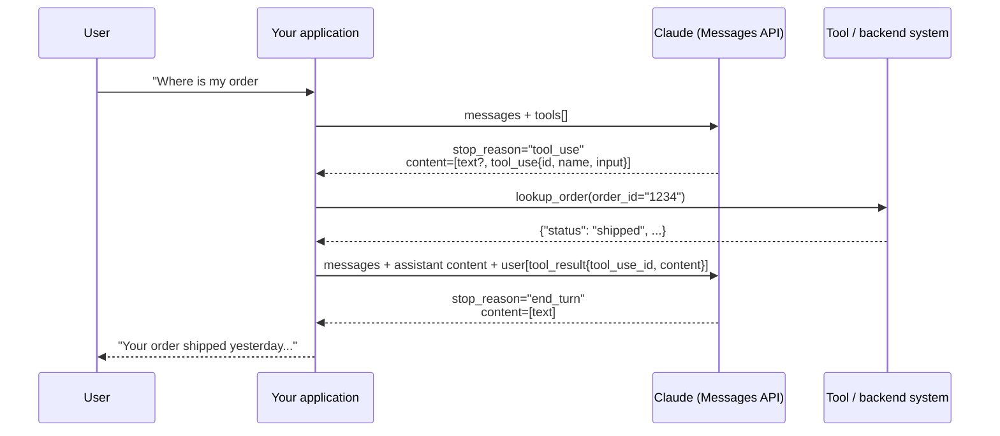

# Chapter 2 — Tools and `tool_use`

> **Exam domain(s):** Domain 2 — Tool Design & MCP Integration (**18%**, tasks 2.1 and 2.3; touches 2.2 error responses and 2.5 built-in tools) · Domain 4 — Prompt Engineering & Structured Output (**20%**, tasks 4.3 and 4.4) · also supports Domain 1 — Agentic Architecture & Orchestration (**27%**, the agent loop) · Claude Certified Developer – Foundations: Tool Implementation (domain 8.1) and tool-use loops
> **Est. time:** 7–9 hours (reading + notebooks) · **Status:** [ ] not started

## Why this matters for a solution architect

Tool use is the point where a language model stops being a text generator and starts acting on real systems: databases, ticketing tools, payment APIs. Every agent you design later in this repo is a loop of tool calls. The architect's job is to decide **where reliability comes from**. Some of it comes from the model (good descriptions lead to good tool choices). Some comes from the API (strict schemas guarantee well-formed arguments). The rest has to come from your own code (business-rule validation, retries, approval gates). If you mix these layers up, the result is either an over-engineered system or a fragile one.

## Learning objectives

- [ ] Explain the client-tool round trip: `tool_use` → your code runs the tool → `tool_result` → final answer
- [ ] Write tool definitions whose descriptions steer the model to the right tool, and spot overlapping tools
- [ ] Choose between `tool_choice` `auto`, `any`, `tool` and `none`, and know which current models reject forced tool use
- [ ] Design JSON schemas for extraction: required vs optional, nullable fields, enums with `"other"` / `"unclear"`
- [ ] Use the current structured-output features: `strict: true` on tools, `output_config.format`, and `client.messages.parse()`
- [ ] Separate **syntax** errors (the schema prevents them) from **semantic** errors (your validation code has to catch them)
- [ ] Implement a correct manual tool loop driven by `stop_reason`, including parallel calls and `is_error` results
- [ ] Tell user-defined client tools, Anthropic-schema client tools (bash, text editor, computer use) and server tools (web search, web fetch, code execution) apart, and build a harness dispatch table that handles all three

## Prerequisites

- [00-prerequisites](../../00-prerequisites/README.md): Python environment, `.env` with `ANTHROPIC_API_KEY`, basic JSON Schema
- [Chapter 1 — Claude API fundamentals](../01-claude-api-fundamentals/README.md): Messages API request shape, roles, `stop_reason`, `max_tokens`

All snippets below assume this setup (the same in every notebook):

```python
from dotenv import load_dotenv
import anthropic

load_dotenv()                    # loads ANTHROPIC_API_KEY from .env, never hardcode keys
client = anthropic.Anthropic()   # the SDK reads ANTHROPIC_API_KEY from the environment
MODEL = "claude-sonnet-5-5"
```

---

## Concepts

### 2.1 What is `tool_use`

Tool use (also called *function calling*) lets Claude ask your application to run a function. **The model never executes anything itself.** It writes a structured request (tool name plus JSON arguments). Your code decides whether to run it, runs it, and sends the result back. Claude then continues with that result in its context.

There are two families of tools:

| Family | Who executes | Examples | What you handle |
|---|---|---|---|
| **Client tools** | Your application | Your own functions (`get_customer`), and Anthropic-schema tools such as `bash` and `text_editor` | Read `tool_use` blocks, run the code, return `tool_result` blocks |
| **Server tools** | Anthropic's infrastructure | `web_search`, `web_fetch`, `code_execution`, `tool_search` | Nothing in the loop; results arrive in the same response (watch for `stop_reason: "pause_turn"`) |

Sections 2.1–2.6 focus on **user-defined client tools**, because that is where most architecture decisions are. Section [2.7](#27-client-tools-anthropic-schema-tools-and-server-tools-beyond-the-guide) covers the Anthropic-provided tools (server tools and Anthropic-schema client tools) and how one harness dispatches all of them.



> **Exam trap:** "Claude called the refund API" is never literally true. Claude *requested* a call and your code made it. That is why approval gates, permission checks and rate limits belong in **your** code, around tool execution, not in the prompt.

### 2.2 Tool definition

A user-defined tool needs a `name` and an `input_schema`. The API treats `description` as optional, but in practice you should always write one, because it drives tool selection:

| Field | Purpose |
|---|---|
| `name` | Must match `^[a-zA-Z0-9_-]{1,128}$`. Prefer specific, namespaced names (`crm_get_customer`, not `get`). |
| `description` *(optional in the API, essential in practice)* | **The main signal Claude uses to decide whether to call this tool.** Plain text: what it does, when to use it, when not to, what it returns. |
| `input_schema` | A JSON Schema object for the arguments. |
| `input_examples` *(optional)* | Example argument objects. Each must validate against the schema (an invalid one returns a 400). Useful for nested or format-sensitive inputs. Not supported on server tools. Adds prompt tokens (roughly 20–200 per example). |
| `strict` *(optional)* | `true` turns on grammar-constrained sampling, so the arguments always match the schema (see 2.4). |

Here is a definition written the way the exam expects:

```python
get_customer = {
    "name": "get_customer",
    "description": (
        "Look up a single customer's profile by email address or numeric customer ID. "
        "Returns name, email, account status and a list of order IDs (not order details). "
        "Use this FIRST to verify who the customer is before calling lookup_order or process_refund. "
        "Do NOT use it to answer questions about an order's status or contents; use lookup_order for that. "
        "Provide either email (format user@domain.com) or customer_id, not both."
    ),
    "input_schema": {
        "type": "object",
        "properties": {
            "email": {"type": "string", "description": "Customer email, e.g. jane@example.com"},
            "customer_id": {"type": "integer", "description": "Numeric customer ID, e.g. 48213"},
        },
        "required": [],
    },
    "input_examples": [{"email": "jane@example.com"}, {"customer_id": 48213}],
}
```

**What a strong description contains:**

1. **What it does and what it returns**, including what it does *not* return.
2. **Input formats with example values.**
3. **When to use it vs. similar tools**: explicit "use this when… / don't use this for…" boundaries.
4. **Edge cases and constraints**: rate limits, required ordering, side effects.

Anthropic's own guidance says to aim for at least 3–4 sentences per description, and more for complex tools.

**Tool-set design rules (Domain 2.1 / 2.3):**

- **No overlap.** If `analyze_content` and `analyze_document` are both described as "analyzes … and extracts key information", the model will mix them up. Fix the root cause by renaming and re-scoping one of them (for example `extract_web_results`: "processes results from web search and URLs").
- **Split vague general-purpose tools** into narrow tools with clear input/output contracts. A generic `analyze_document` becomes `extract_data_points` (returns structured facts), `summarize_content` (returns prose) and `verify_claim_against_source` (returns supported / unsupported plus evidence). The goal is unambiguous selection, not the largest possible number of tools: Anthropic's current docs also recommend *consolidating* closely related operations on one resource into a single tool with an `action` parameter (one `github_pr` tool instead of `create_pr`, `review_pr`, `merge_pr`). Split when one tool hides different contracts; consolidate when several tools are variations of the same contract.
- **Replace generic tools with constrained ones.** A generic `fetch_url` lets an agent fetch anything. A `load_document` tool that accepts only document URLs (allowed hosts, allowed file types) and rejects everything else with an actionable error does the same job with a smaller blast radius. The constraint lives in the tool's code, so it holds even when the model gets it wrong.
- **Keep each agent's toolset small and scoped to its role.** An agent with 18 tools selects less reliably than one with 4–5 role-specific tools, because every extra tool adds to the decision. Agents also misuse tools outside their specialty: a synthesis agent that can search the web starts doing its own research instead of synthesizing what it was given. Give each subagent only its role's tools. When a role has a frequent, simple need from another role, add one **scoped cross-role tool** (for example a `verify_fact` tool for the synthesis agent that checks one claim against the gathered sources) and route anything more complex back through the coordinator.

  ```python
  ROLE_TOOLS = {
      "web_researcher":   ["web_search", "load_document"],
      "document_analyst": ["extract_data_points", "summarize_content", "verify_claim_against_source"],
      "synthesizer":      ["verify_fact"],   # one narrow cross-role tool; new research goes back to the coordinator
  }
  ```

- **Return only high-signal data.** Every `tool_result` stays in the context window. A 40-field payload where 5 fields matter wastes tokens and makes later reasoning worse (more on this in the context-management chapter).
- **Check the system prompt too.** Wording in the system prompt can override otherwise clear descriptions. A rule such as "Whenever the user mentions their *account*, look up the customer first" creates a keyword association: "Which *account* was order ORD-5001 billed to?" now goes to `get_customer` instead of `lookup_order`. When selection goes wrong, review the system prompt for keyword-triggered instructions that name a tool, and rewrite them as conditions on intent ("verify identity before any refund") or remove them.
- **Built-in vs. MCP tools.** In Claude Code and the Agent SDK, agents tend to prefer built-in tools (`Read`, `Grep`) over MCP tools that look similar. If the MCP tool is better, its description must say why: unique data, fresher source, richer context. See [Chapter 4](../04-model-context-protocol/README.md).

> **Exam trap:** When the agent keeps picking the wrong tool, the **first** fix is almost always "rewrite or differentiate the tool descriptions". Routing classifiers, merging tools or adding many few-shot examples are heavier options and usually wrong as a first step. Targeted few-shot examples (4–6 *ambiguous* cases, each with the reason for the choice) are the right *second* step.

### 2.3 The `tool_choice` parameter

`tool_choice` controls **whether** Claude must call a tool and **which** one.

| Value | Behavior | Typical use |
|---|---|---|
| `{"type": "auto"}` | Claude decides between calling tool(s) and answering in text. Default when `tools` are provided. | Assistants and agents |
| `{"type": "any"}` | Claude **must** call one of the provided tools; it picks which. | Several extraction schemas, document type unknown, and you need structured output every time |
| `{"type": "tool", "name": "extract_metadata"}` | Claude **must** call this specific tool. | Forcing a pipeline's first step (extract metadata before enrichment) |
| `{"type": "none"}` | Claude cannot call tools. Default when no `tools` are provided. | Keep tool definitions in the prompt (cache-stable) while forbidding calls on this turn |

Useful details:

- With `any` or `tool`, the API prefills the assistant turn, so Claude **emits no explanatory text before the `tool_use` block**, even if you ask for it. If you want an explanation and a tool call, use `auto` and say "use the X tool" in the user message.
- Any variant can include `"disable_parallel_tool_use": true` (inside the `tool_choice` object, not as a top-level parameter). With `auto` it means **at most one** tool call per response (Claude can still answer in plain text). With `any` or `tool` it means **exactly one** tool call.
- Changing `tool_choice` between requests invalidates cached **message** blocks for prompt caching (tool definitions and the system prompt stay cached).
- With manual extended thinking (`thinking: {"type": "enabled", ...}`), `any` and `tool` return an error.

> **Note: changed since the guide.** The guide presents `any` and forced `tool` as the standard way to guarantee structured output. In current docs, **Claude Opus 5.5, Claude Sonnet 5.5 and Claude Fable 5.1 (and Claude Mythos 5.1, available only through Project Glasswing) reject forced tool use**: `tool_choice` `{"type": "any"}` and `{"type": "tool", ...}` return **HTTP 400** on these models (also in `count_tokens` and Batches). `auto` and `none` still work. The recommended replacements are:
> 1. `auto` + `strict: true` on the tools + an explicit instruction in the prompt ("Use the `extract_metadata` tool"), and then **check in code** that the call was made, re-prompting if it wasn't; or
> 2. **Structured outputs** (`output_config.format`, see 2.4) when the forced call only existed to get JSON back.
>
> This is a per-model restriction, not a generational cutoff: Claude Haiku 4.5, Claude Opus 5, Claude Sonnet 5, Claude Fable 5 and older models still accept `any` and `tool`. On those models, `any` + `strict: true` guarantees both that a tool is called and that its input matches the schema. The exam blueprint still tests the `auto` / `any` / forced semantics, so learn both: the concept and the current model restrictions.

Forced selection, on a model that supports it:

```python
response = client.messages.create(
    model="claude-haiku-4-5",                     # supports forced tool use
    max_tokens=1024,
    tools=[extract_metadata_tool, enrich_vendor_tool, enrich_contract_tool],
    tool_choice={"type": "tool", "name": "extract_metadata"},
    messages=[{"role": "user", "content": document_text}],
)
metadata_call = next(b for b in response.content if b.type == "tool_use")
```

`claude-haiku-4-5` is the alias of the pinned snapshot `claude-haiku-4-5-20251001` (the models overview lists both). This chapter and its notebooks use the alias; pin the dated ID in production if you want the exact snapshot named in your config. Watch its lifecycle: the [model deprecations](https://platform.claude.com/docs/en/about-claude/model-deprecations) page lists Haiku 4.5 as active with a retirement "not sooner than October 15, 2026". If it has been retired when you read this, run the forced-tool examples on `claude-opus-5` instead (the model the Define tools docs use for their forced `tool_choice` example). In the practice notebook, set `CLAUDE_FORCED_TOOL_MODEL=claude-opus-5` in `.env`.

Forcing only fixes the **first** step. Run the enrichment steps in **follow-up turns** with `tool_choice` back on `auto`, so Claude can pick the enrichment tools that fit the metadata it just extracted:

```python
messages = [
    {"role": "user", "content": document_text},
    {"role": "assistant", "content": response.content},
    {"role": "user", "content": [{"type": "tool_result", "tool_use_id": metadata_call.id,
                                  "content": json.dumps(store_metadata(metadata_call.input))}]},
]
follow_up = client.messages.create(
    model="claude-haiku-4-5", max_tokens=1024,
    tools=[extract_metadata_tool, enrich_vendor_tool, enrich_contract_tool],
    tool_choice={"type": "auto"},                 # step 2+: Claude chooses the enrichment tools
    messages=messages,
)
```

The same intent on the current default model (`auto` + strict + check):

```python
def require_tool_call(messages: list, tools: list, expected: str, retries: int = 2) -> dict:
    """Ask for a specific tool with tool_choice=auto and verify the call actually happened."""
    for _ in range(retries + 1):
        response = client.messages.create(
            model=MODEL,                        # claude-sonnet-5-5 rejects any/tool
            max_tokens=2048,
            tools=[{**t, "strict": True} for t in tools],   # schemas need additionalProperties: false
            tool_choice={"type": "auto"},
            messages=messages,
        )
        for block in response.content:
            if block.type == "tool_use" and block.name == expected:
                return block.input
        if response.stop_reason == "tool_use":
            raise RuntimeError("Model called a different tool; route through the normal tool loop")
        if response.stop_reason in ("refusal", "max_tokens"):
            # A refusal or a truncated reply won't be fixed by nudging with the same settings
            raise RuntimeError(f"Stopped with {response.stop_reason}; handle it explicitly")
        # Plain-text answer: nudge and try again
        messages = messages + [
            {"role": "assistant", "content": response.content},
            {"role": "user", "content": f"Please call the {expected} tool now."},
        ]
    raise RuntimeError(f"{expected} was not called after {retries + 1} attempts")
```

> **Exam trap:** `auto` does **not** guarantee a tool call; the model may answer in text. If the business process *requires* a tool to run, the guarantee must come from forced `tool_choice` (on supporting models) or from code that checks for the call. A sentence in the prompt alone is not a guarantee.

### 2.4 JSON schemas for structured output

Defining an "extraction tool" whose `input_schema` *is* your output format, and then reading `tool_use.input`, is the classic way to get structured data out of Claude. Today there are three related mechanisms:

| Mechanism | How | What it guarantees |
|---|---|---|
| Plain tool `input_schema` | Tool definition without `strict` | Usually well-formed and close to the schema, but **not guaranteed**: you may get `"2"` instead of `2`, or a missing required field |
| **Strict tool use** | `"strict": true` on the tool | Grammar-constrained sampling: `input` always validates against the schema, and `name` is always a valid tool |
| **JSON outputs** | `output_config={"format": {"type": "json_schema", "schema": ...}}`, or `client.messages.parse(output_format=PydanticModel)` | The text response is valid JSON matching the schema; `parse()` also returns a validated object in `.parsed_output` |

> **Note: changed since the guide.** The guide says `tool_use` with a JSON schema "guarantees syntactically valid JSON". Under current docs that guarantee comes from **strict mode** (`strict: true`) or **structured outputs** (`output_config.format`), which both use grammar-constrained sampling. The older `output_format` request parameter is deprecated in favor of `output_config.format` (the raw API now accepts `output_format` only with the `structured-outputs-2025-11-13` beta header, and the Python SDK 1.x raises a `TypeError` if you pass it to `create()`). In the Python SDK, `messages.parse(output_format=...)` only accepts a **type** (a Pydantic model); raw schema dicts go in `output_config`. Older course material also gets JSON by prefilling the assistant turn (for example with an opening code fence) and adding a stop sequence. Final-turn prefill returns a 400 on Claude 4.6 and later models (see [Chapter 1](../01-claude-api-fundamentals/README.md)), so on current models use structured outputs or a strict extraction tool instead.

**Schema design principles** (these are exam favorites):

1. **Required vs. optional.** Mark a field required only when the source *always* contains it. A required field the document doesn't contain pushes the model to **invent** a value.
2. **Nullable fields.** Use `"type": ["string", "null"]` (or `Optional[str]` in Pydantic) for data that may be absent, so the model can say "not found" with `null` instead of hallucinating. A good pattern is **required + nullable**: the key must always be present, and `null` is an explicit "not in the source".
3. **Enums with `"other"` + a detail field.** A closed enum forces every input into your predefined buckets. Adding `"other"` together with a `category_detail` string keeps information you didn't anticipate.
4. **An `"unclear"` enum value.** An honest `"unclear"` is better than a confident wrong category, and it gives you a clean signal for routing to human review.
5. **Descriptions on fields.** Field-level `description` texts are prompts too. Spell out units, formats and normalization rules ("ISO 8601 date", "amount in cents").
6. **Normalization rules in the prompt, next to the strict schema.** A schema can say `"type": "string"` but not "write `03/04/26` from a UK supplier as `2026-04-03`". When sources format the same data in different ways (dates, currencies, phone numbers, units), put the rules in the prompt and keep the schema strict:

   ```python
   NORMALIZATION_RULES = """Normalize before you fill the schema:
   - Dates -> ISO 8601 (YYYY-MM-DD). UK and EU suppliers write day/month/year.
   - Money -> integer cents in the invoice currency ("1.299,00 EUR" -> 129900).
   - If a value is missing or unreadable, use null. Never guess."""
   ```

   Then check the results in code (a regex for dates, a range check for amounts). The rules make the output consistent, and the schema makes it well-formed. Neither one makes it correct, so semantic validation (2.5) is still needed.

A strict extraction tool that follows these principles:

```python
classify_ticket = {
    "name": "record_ticket_classification",
    "description": "Record the classification of one support ticket. Call exactly once per ticket.",
    "strict": True,
    "input_schema": {
        "type": "object",
        "properties": {
            "category": {"type": "string", "enum": ["bug", "feature", "docs", "unclear", "other"]},
            "category_detail": {
                "type": ["string", "null"],
                "description": "Short explanation when category is 'other' or 'unclear'; otherwise null.",
            },
            "severity": {"type": "string", "enum": ["critical", "high", "medium", "low"]},
            "customer_email": {
                "type": ["string", "null"],
                "description": "Email exactly as written in the ticket; null if the ticket has none.",
            },
        },
        "required": ["category", "category_detail", "severity", "customer_email"],
        "additionalProperties": False,
    },
}
```

The same contract as a Pydantic model with `messages.parse()` (one source of truth for both the schema and the validation):

```python
from typing import Annotated, Literal, Optional
from pydantic import BaseModel, BeforeValidator

def _lower(v):
    # Enum letter-casing is not guaranteed ("Bug" for "bug"); normalize before Literal validation
    return v.strip().lower() if isinstance(v, str) else v

Category = Annotated[Literal["bug", "feature", "docs", "unclear", "other"], BeforeValidator(_lower)]
Severity = Annotated[Literal["critical", "high", "medium", "low"], BeforeValidator(_lower)]

class TicketClassification(BaseModel):
    category: Category
    category_detail: Optional[str]   # required key, value may be None
    severity: Severity
    customer_email: Optional[str]

response = client.messages.parse(
    model=MODEL,
    max_tokens=1024,
    messages=[{"role": "user", "content": f"Classify this support ticket:\n\n{ticket_text}"}],
    output_format=TicketClassification,
)
ticket = response.parsed_output   # a validated TicketClassification instance
```

`parse()` validates the reply with Pydantic, so a plain `Literal` would turn a harmless `"Bug"` into a `ValidationError`. The `BeforeValidator` lowercases the value before the `Literal` check. The JSON schema sent to the API is unchanged: `anthropic.transform_schema(TicketClassification)` still produces a plain `enum` of the lowercase values.

**Flexible extraction.** Sometimes you can't list every field in advance: a product spec sheet may contain any number of attributes. Two patterns work:

| Pattern | Schema | Works with `strict: true`? | Trade-off |
|---|---|---|---|
| Open object | `"attributes": {"type": "object", "additionalProperties": true}` on a plain (non-strict) tool | No: strict mode requires `additionalProperties: false` on every object | Easy to read; keys and value types are not guaranteed |
| Key/value list | `"attributes": {"type": "array", "items": {"type": "object", "properties": {"name": {...}, "value": {...}, "unit": {"type": ["string", "null"]}}, "required": [...], "additionalProperties": false}}` | Yes | Every entry has a guaranteed shape; you rebuild the dict in code |

Keep the fields you *do* know as named, typed properties, and use the flexible part only for the long tail.

**Strict-mode limits to design around** (from the Structured Outputs docs):

| Limit / restriction | Value |
|---|---|
| `additionalProperties` | Must be `false` on every object |
| Not supported | Recursive schemas, `minimum` / `maximum` / `multipleOf`, `minLength` / `maxLength`, array constraints other than `minItems` of 0 or 1, complex types inside `enum`, external `$ref` |
| Strict tools per request | 20 |
| Optional (non-required) parameters, summed across all strict tool schemas **and** the JSON output schema in one request | 24 |
| Parameters using unions (`anyOf` or `["string", "null"]`), summed the same way | 16 (unions are expensive to compile) |
| Grammar compilation | Hard timeout of 180 seconds |
| First request with a new schema | Extra latency for grammar compilation; the compiled grammar is cached for 24 hours after its last use |
| Enum letter-casing | **Not guaranteed**: Claude may return `"Topic 3"` for an enum value `"topic 3"`. Compare enum values case-insensitively and avoid enum values that differ only in case |

> **Note: changed since the guide.** The guide's example puts `"minimum": 0, "maximum": 1` on a `confidence` field. Numeric constraints like these are **not supported** in strict schemas. The Python SDK's `parse()` helper strips them from the schema it sends, moves them into the field description and validates them client-side. With a raw strict schema, enforce ranges in your own validation code.

> **Exam trap:** "Make every field required so the output is complete" is a trap answer. Required fields for information that may be missing cause **fabrication**. The correct answer is optional or nullable fields, plus an instruction to return `null` when the information is not present.

### 2.5 Syntax vs. semantic errors

| Error type | Examples | What prevents or catches it |
|---|---|---|
| **Syntax / structural** | Invalid JSON, wrong type (`"2"` vs `2`), missing required key, value outside the enum | `strict: true` or `output_config.format` **eliminate** these by construction. Three documented exceptions: a reply cut off by `stop_reason: "max_tokens"`, a `stop_reason: "refusal"` (the output may not match the schema), and enum letter-casing. Always check `stop_reason` first |
| **Semantic** | Line items don't add up to the total, a value in the wrong field, a plausible but invented ID, dates out of order, wrong category | **Your code**: business-rule validation (Pydantic validators, cross-field checks), retry with specific feedback, human review |

A schema guarantees **shape**, never **truth**. Semantic checks are an architectural layer you have to add yourself:

```python
from pydantic import BaseModel

class LineItem(BaseModel):
    description: str
    amount: float

class InvoiceExtraction(BaseModel):
    invoice_number: str | None
    line_items: list[LineItem]
    stated_total: float          # the total exactly as printed on the document

def semantic_errors(inv: InvoiceExtraction) -> list[str]:
    errors = []
    calculated = round(sum(i.amount for i in inv.line_items), 2)
    if abs(calculated - inv.stated_total) > 0.01:
        errors.append(f"sum(line_items) = {calculated} but stated_total = {inv.stated_total}. Re-check each amount.")
    return errors
```

**Retry with feedback** works when the model can fix the mistake from what it already has:

```python
import pydantic

def extract_with_retry(document: str, max_retries: int = 2) -> InvoiceExtraction:
    messages = [{"role": "user", "content": f"Extract the invoice data:\n\n{document}"}]
    errors: list[str] = []
    for attempt in range(max_retries + 1):
        try:
            response = client.messages.parse(
                model=MODEL, max_tokens=2048, messages=messages, output_format=InvoiceExtraction,
            )
        except pydantic.ValidationError as exc:
            # parse() validates INSIDE the call: a reply cut off by max_tokens (invalid JSON),
            # a refusal's text, or an unexpected enum value raises here, before you see stop_reason
            raise ValueError("Unparseable extraction, route to human review") from exc
        if response.stop_reason in ("refusal", "max_tokens") or response.parsed_output is None:
            raise ValueError(f"No valid extraction (stop_reason={response.stop_reason}), route to human review")
        invoice = response.parsed_output
        errors = semantic_errors(invoice)
        if not errors:
            return invoice
        # Send back the original document (already in messages), the wrong extraction, and the SPECIFIC error
        messages += [
            {"role": "assistant", "content": response.content},
            {"role": "user", "content": "Validation failed:\n- " + "\n- ".join(errors)
                + "\nCorrect only the affected fields. If a value is truly not in the document, use null."},
        ]
    raise ValueError(f"Still inconsistent after retries, route to human review: {errors}")
```

- **Two guards, not one.** In the Python SDK, `messages.parse()` runs Pydantic's `validate_json` on the text before it returns, so a truncated or refused reply usually surfaces as a `pydantic.ValidationError`, not as a response you can inspect. Catch that exception, and still check `stop_reason` for the cases where the text happens to parse.
- **Retries help with:** format slips, a value placed in the wrong field, arithmetic the model can re-check.
- **Retries do not help when:** the information is **not in the source**, or it lives in another document you didn't provide. Retrying only produces more confident fabrication, so return `null` or escalate.
- **Extract both** `stated_total` and a computed total (or compute it in code) instead of asking the model to "make the totals match". Otherwise the model will quietly fudge one number. A discrepancy may also be a genuine error **in the source document**, and that should be flagged, not hidden.

> **Exam trap:** "We switched to strict JSON schemas, so the extraction is now correct" is wrong. Strict mode removes syntax errors only. Totals that don't reconcile still require validation logic plus retry-with-error-feedback.

### 2.6 The client-side tool loop and `tool_result` rules *(expanded beyond the guide)*

Every agent is this loop: **call the API → inspect `stop_reason` → run the tools → append the results → repeat**. Control flow depends on `stop_reason`, never on parsing the model's text.

| `stop_reason` | Meaning | Loop action |
|---|---|---|
| `tool_use` | Claude wants one or more client tools to run | Execute them, append the results, call again |
| `end_turn` | Claude has finished | Exit and return the answer |
| `max_tokens` | Output was cut off (a `tool_use` input may be incomplete) | Don't run a truncated call; retry with a higher `max_tokens` |
| `pause_turn` | A *server* tool loop hit its iteration limit (default 10) | Send the assistant content back as-is to resume; don't add `tool_result` blocks or a "continue" message |
| `refusal` | Safety classifier declined (details in `stop_details`) | Stop; never run tools from that turn |
| `stop_sequence` / `model_context_window_exceeded` | A custom stop sequence fired / the reply filled the context window | Handle as a normal stop / as a truncated reply |

```python
import json

def run_agent(user_text: str, tools: list[dict], handlers: dict, max_turns: int = 10):
    messages = [{"role": "user", "content": user_text}]
    for _ in range(max_turns):                       # always bound the loop
        response = client.messages.create(
            model=MODEL, max_tokens=4096, tools=tools, messages=messages,
        )
        # 1. Append the FULL assistant content (text, thinking and tool_use blocks), not just the text
        messages.append({"role": "assistant", "content": response.content})

        if response.stop_reason != "tool_use":       # end_turn, max_tokens, refusal, ...
            return response

        # 2. Exactly one tool_result per tool_use block, matched by id
        results = []
        for block in response.content:
            if block.type != "tool_use":
                continue
            try:
                output = handlers[block.name](**block.input)
                results.append({"type": "tool_result", "tool_use_id": block.id,
                                "content": json.dumps(output)})
            except Exception as exc:                 # unknown tool, bad input, backend failure
                results.append({"type": "tool_result", "tool_use_id": block.id,
                                "content": f"{type(exc).__name__}: {exc}. Check the arguments and try again.",
                                "is_error": True})

        # 3. ALL results go back in ONE user message
        messages.append({"role": "user", "content": results})
    raise RuntimeError("Agent exceeded max_turns")
```

**Formatting rules that cause 400 errors when broken:**

- A `tool_result` must come **immediately** after the assistant message that contains its `tool_use`. Nothing can go in between.
- In that user message, **`tool_result` blocks come first**. Any extra text goes *after* all results. Prefer sending only `tool_result` blocks: trailing text can make Claude end the turn early (empty `end_turn` replies), and if the same assistant turn also has an unfinished *server* tool call, the message must contain only `tool_result` blocks.
- Every `tool_use` needs a matching `tool_result` (`tool_use_id` = `tool_use.id`). For a failed call, return `is_error: true` instead of dropping it.
- **Parallel calls:** one assistant message can contain several `tool_use` blocks. Run them (concurrently if that's safe) and return all results in **one** user message. Splitting them across several messages teaches Claude to stop making parallel calls.
- `tool_result.content` can be a string or a list of `text`, `image`, `document` or `search_result` blocks.

**Single call or parallel calls?** Parallel calls are the default and the right choice for **independent** work: three order lookups, or a customer lookup plus a policy lookup. Use one call per turn when a call **depends on another call's result** (you need `get_customer`'s ID before `process_refund`) or when side effects must happen in a fixed order. You can enforce that with `disable_parallel_tool_use: true` inside `tool_choice`, or keep parallel calls on and add "Only batch tool calls that are independent of each other" to the system prompt (the wording Anthropic's parallel-tool-use docs suggest). If a batch arrives with a hidden dependency, you may run it sequentially, stop at the first failure, and return `is_error: true` for the calls you skipped; Claude reissues them on the next turn.

**Thinking blocks in the loop.** When thinking is on, a tool-use response can start with `thinking` blocks. Pass them back **complete and unmodified** with the `tool_use` blocks they came with. This is required within a tool-use turn, and a modified thinking block returns a 400. Appending the whole `response.content`, as the loop above does, satisfies this automatically. Thinking configuration, budgets and interleaved thinking are covered in the planned Chapter 14 (streaming, thinking and resilient clients).

**Errors as information.** Write `is_error` messages that help the model recover: say what went wrong and what to try next ("Rate limit exceeded. Retry after 60 seconds.", "customer_id must be numeric"). Handle **transient** failures such as timeouts *inside the tool* with automatic backoff, and send back **validation** errors right away with details, because retrying those never works. Structured error metadata (`errorCategory`, `isRetryable`) for MCP tools is covered in [Chapter 4](../04-model-context-protocol/README.md).

**Security.** Tool results often contain untrusted content (web pages, emails, uploads). Keep that content inside `tool_result` blocks, not in the system prompt. For irreversible actions, enforce preconditions **in code**. One example: a `preview_remove_member` tool returns a single-use token that `execute_remove_member` requires, so execution without a preview becomes impossible rather than merely discouraged.

> **SDK shortcut.** The Python SDK's beta **Tool Runner** (`@beta_tool` decorator + `client.beta.messages.tool_runner(...)`) runs this loop for you and still lets you intercept each turn. Write the manual loop once, so you understand what the runner automates (and what the exam asks about), then prefer the runner in real projects. The Claude **Agent SDK** in [Chapter 3](../03-agent-sdk/README.md) is a different product: it adds built-in tools, hooks, subagents and sessions on top of the same loop.

> **Exam trap:** The loop ends when `stop_reason == "end_turn"`, **not** when the text contains "done", when a fixed number of iterations have run, or when the response contains no text. Keep a `max_turns` limit anyway as a safety net, but it is not the primary termination signal.

### 2.7 Client tools, Anthropic-schema tools and server tools *(beyond the guide)*

Every tool in the `tools` array belongs to one of three execution models. The model decides what **your harness** has to do:

| Execution model | Examples (`type` → tool name) | Who runs it | What your harness does | What appears in the response |
|---|---|---|---|---|
| **User-defined client tool** | Your `get_customer`, `lookup_order` | Your application | Dispatch by name, run it, return a `tool_result` | `tool_use` (id `toolu_…`) |
| **Anthropic-schema client tool** | `bash_20250124` → `bash`; `text_editor_20250728` → `str_replace_based_edit_tool`; `memory_20250818` → `memory`; `computer_toolset_20260801` and `browser_toolset_20260801` (client *toolsets*) | Your application, in an environment you control | Implement the published schema, run it (sandboxed), return a `tool_result` | `tool_use`; toolset members also carry `toolset_name` (`"computer"` or `"browser"`) |
| **Server tool** | `web_search_20250305` / `_20260209` / `_20260318` → `web_search`; `web_fetch_*`; `code_execution_*`; `tool_search_tool_regex_20251119` / `_bm25_20251119` | Anthropic's infrastructure | Enable it, read the result, pass the blocks back unchanged, handle `pause_turn`. **Never** send a `tool_result` for it | `server_tool_use` (id `srvtoolu_…`) followed by its result block, e.g. `web_search_tool_result`, in the same assistant turn |

**Why use an Anthropic-schema tool instead of writing your own `run_shell` or `edit_file`?** Anthropic publishes those schemas, and Claude has been trained on many successful trajectories that use exactly those signatures. It calls them more reliably and recovers from errors better than it would with a home-made equivalent. Execution is still yours, so the security boundary is still yours.

#### The harness dispatch table

An agentic harness is a loop plus a **dispatch table**: a map from the tool identity in each `tool_use` block to the code that runs it. Anything that is not a client `tool_use` (text, thinking, `server_tool_use`, server result blocks) is kept in history but never dispatched.

```python
HANDLERS = {
    ("", "lookup_order"): lookup_order,                       # user-defined
    ("", "str_replace_based_edit_tool"): run_text_editor,     # Anthropic-schema, you implement it
    ("computer", "screenshot"): take_screenshot,              # client toolset member
    ("computer", "left_click"): left_click,
}

def dispatch(response) -> list[dict]:
    results = []
    for block in response.content:
        if block.type != "tool_use":       # server_tool_use, web_search_tool_result, text, thinking
            continue
        key = (block.toolset_name or "", block.name)   # toolset members share names such as "screenshot"
        result = {"type": "tool_result", "tool_use_id": block.id}
        if block.toolset_name:
            result["toolset_name"] = block.toolset_name  # member results echo the toolset name
        handler = HANDLERS.get(key)
        if handler is None:
            results.append({**result, "is_error": True, "content": f"Unknown tool {key}"})
            continue
        try:
            # a string, or a list of content blocks (e.g. an image block for screenshot)
            results.append({**result, "content": handler(**block.input)})
        except Exception as exc:
            results.append({**result, "is_error": True, "content": f"{type(exc).__name__}: {exc}"})
    return results
```

Dispatch on the **(`toolset_name`, `name`) pair**, not on `name` alone: the docs warn that a custom tool may share a member's name, and the computer and browser toolsets share names such as `screenshot`.

#### Server tools: what changes in the loop

- **No `tool_result`.** The API runs the tool and puts the result block right after the `server_tool_use` block, paired by `tool_use_id`. Your loop only reads them and appends the full `response.content` as usual.
- **`pause_turn`.** Server tools run in a server-side loop with an iteration limit (default 10). When it hits the limit, the response ends with `stop_reason: "pause_turn"`. Send the conversation back with the paused assistant content appended as-is (no `tool_result`, no "continue" message), keep the same `tools`, and cap the number of continuations. Keep roles alternating when the continuation arrives: the docs' example rebuilds the message list, and the practice notebook's harness merges the continuation into the paused assistant message.
- **Mixed turns.** If Claude calls a server tool and one of your client tools in the same parallel group, the API does **not** run the server tool yet. The response ends with `stop_reason: "tool_use"` and contains a `server_tool_use` block with no result block. Run your client tools, send a user message with only the `tool_result` blocks, and keep the same `tools` array (a resume request that no longer defines the waiting server tool fails with a 400).
- **Errors arrive inside a 200.** A failed web search returns a `web_search_tool_result` whose `content` is an error object (`error_code` such as `max_uses_exceeded`, `too_many_requests`, `query_too_long`), not an HTTP error. A search with no hits returns an empty list.
- **Pass results back unchanged.** Web search results carry `encrypted_content`. Later turns need it exactly as received; a missing or modified value fails with a 400.
- **Cost and control.** Web search costs **$10 per 1,000 searches** plus the tokens of the results it loads. `max_uses` caps searches per request, `allowed_domains` / `blocked_domains` restrict sources, and `usage.server_tool_use.web_search_requests` reports what you were billed for. The `_20260209` and later versions add *dynamic filtering*: Claude filters results with code execution before they reach its context, and their `allowed_callers` defaults to code execution. Models that don't support programmatic tool calling need `allowed_callers: ["direct"]` with those versions. Availability differs by platform (for example, Google Cloud offers only the basic `web_search_20250305`), so check the tool's page for your platform.

```python
response = client.messages.create(
    model=MODEL, max_tokens=1024,
    tools=[{"type": "web_search_20250305", "name": "web_search", "max_uses": 3}],
    messages=[{"role": "user", "content": "What changed in the latest Anthropic API release notes?"}],
)
for block in response.content:
    if block.type == "server_tool_use":
        print("searched:", block.input["query"])
    elif block.type == "web_search_tool_result" and isinstance(block.content, list):
        print([r.url for r in block.content])
```

#### Anthropic-schema client tools in brief

- **Text editor** (`text_editor_20250728`, tool name `str_replace_based_edit_tool`, for Claude 4 and later models): commands `view`, `str_replace`, `create` and `insert` (the Claude 4 versions dropped `undo_edit`). Optional `max_characters` truncates large views. Your handler must resolve every path inside an allowed root, require that `old_str` matches **exactly one** location, and return problems as `is_error` results ("Found 3 matches for replacement text. Please provide more context to make a unique match.").
- **Bash** (`bash_20250124`, tool name `bash`): Claude sends commands; you run them in a sandboxed, persistent shell session. The security model is entirely yours.
- **Computer use** (`computer_toolset_20260801`, generally available on the Claude API and Google Cloud for the models listed on its page): one `tools` entry with no `name` gives Claude 17 member tools such as `screenshot`, `left_click`, `type` and `zoom`. Each call is a `tool_use` block with `"toolset_name": "computer"`. Several member calls in one turn form a **batch action**: run them **in order**, stop at the first failure, and return a result for every block (an image for `screenshot` and `zoom`, short text such as `OK` for the rest). The toolset adds about 4,500 input tokens per request, and screenshots are billed as image input. The older beta versions (`computer_20251124`, `computer_20250124`, with a beta header) remain for older models and for platforms that don't offer the toolset yet. Run computer use in a dedicated VM or container with minimal privileges and an allowlist of domains, keep credentials out of reach, and require human confirmation for consequential actions. Content on screen can carry prompt injections.
- **Memory** (`memory_20250818`): a client tool for a file-like memory directory that you store. It is covered with agent memory in a later chapter of this path.

#### The "batch tool" pattern (legacy)

Some Anthropic Academy courses teach a **batch tool**: a user-defined meta-tool whose input is a list of `{"name": ..., "arguments": ...}` invocations, which your harness fans out to the real handlers. It was a way to get several operations in one turn from models that rarely made parallel calls. Current models emit several `tool_use` blocks in one response natively, so prefer native parallel calls: they keep each call's own schema (and `strict: true`), and each gets its own `tool_result`. If a model makes fewer parallel calls than you want in long agent loops (the docs note this for Claude Fable 5.1), add a system-prompt instruction to batch independent calls instead of a meta-tool. Know the batch-tool pattern so you recognize it in older code and course material.

#### Tool-set construction checklist

1. **Few tools per agent**, scoped to the role (4–5 is a good default). For large catalogs, mark tools `defer_loading: true` and add a tool search tool so Claude loads only what it needs.
2. **Distinct, namespaced names** (`crm_get_customer`, `github_list_prs`). Consolidate variations of one contract into one tool with an `action` parameter; split tools that hide different contracts.
3. **Detailed descriptions** (3–4+ sentences: what it does, what it returns, when *not* to use it), plus `input_examples` for complex inputs.
4. **`strict: true`** on tools that take actions, with `additionalProperties: false` everywhere.
5. **High-signal results**: only the fields the next step needs, with stable identifiers.
6. **The right execution model.** Use a server tool when Anthropic can host the capability (web search, web fetch, code execution) and your data-retention, platform and cost constraints allow it. Use an Anthropic-schema client tool for shell, file editing and desktop control. Write your own tool only for your own systems.
7. **Parallel-friendly design**: independent reads can run together; dependent or ordered side effects run one at a time.
8. **Streaming large tool inputs**: `eager_input_streaming: true` on a user-defined tool turns on fine-grained tool streaming. Streaming is covered in the planned Chapter 14.

> **Exam trap:** "The agent searched the web, so our loop must send a `tool_result` for the search" is wrong. The API executes `server_tool_use` blocks (ids `srvtoolu_…`) and supplies their result blocks itself. Your loop answers only client `tool_use` blocks, and on `pause_turn` it resends the assistant content unchanged.

---

## Notebooks

| Notebook | Sections covered | What you build |
|---|---|---|
| [`01_practice.ipynb`](01_practice.ipynb) | 2.1–2.7, each with offline cells (a scripted fake API, no key needed) and live cells: a hand-made round trip; tool-definition linting, a minimal-vs-rich description selection test, role-scoped toolsets, a constrained `load_document` and a system-prompt keyword audit; `auto`/`any`/`tool`/`none` on Haiku 4.5, the 400 on `claude-sonnet-5-5`, `require_tool_call()` and "force step 1, then `auto`"; a ticket classifier as plain tool, strict tool and `messages.parse()`, normalization rules and strict-compatible flexible attributes; invoice validation with retry-with-feedback; a generic loop with parallel calls, `is_error` results and a protocol validator for the 400 rules; a dispatch-table harness for user-defined, Anthropic-schema (sandboxed text editor, computer-use batch actions) and server tools (`pause_turn`, mixed turns, web search errors and citations), the legacy batch-tool pattern and a tool-set checklist. The one paid web-search cell is off by default (`RUN_PAID_TOOLS`) | **Mini-project:** a customer-support agent (`get_customer`, `lookup_order`, `process_refund` on in-memory data) with strict tools, a bounded `stop_reason` loop, refund rules enforced in code and an audit log |
| [`02_homework.ipynb`](02_homework.ipynb) | Self-test for 2.1–2.7 | 10-question exam-style quiz (hashed answer key), 7 offline coding exercises with auto-checks (strict tool definition, `tool_choice` picker, nullable Pydantic schema, semantic validator, `tool_result` builder, loop control flow against fake responses, next-step planning for a mixed client/server turn), an architecture scenario with rubric, and a scorecard (pass mark 72%) |

Theory stays in this README; notebooks hold code. Run them from the repo root venv (see [../../00-prerequisites/README.md](../../00-prerequisites/README.md)).

---

## Architect decision cheat-sheet

| Situation | Choose | Over | Why |
|---|---|---|---|
| Agent keeps picking the wrong one of two similar tools | Rewrite / rename tools to remove overlap | Routing classifier, merging tools | Descriptions are the selection mechanism; fix the root cause cheaply first |
| You only need JSON back, no action is taken | `output_config.format` / `messages.parse()` | A fake "extraction tool" with forced `tool_choice` | Purpose-built, guaranteed schema, and works on models that reject forced tool use |
| Tool arguments must always type-check (agent calling real APIs) | `strict: true` on the tool | Validating and retrying malformed calls | Grammar-constrained sampling removes the failure class entirely |
| Document type unknown, several extraction schemas | `tool_choice: any` (supporting models) or `auto` + strict + call check | Plain `auto` with no check | `auto` may answer in prose; you need a guaranteed structured result |
| A pipeline step must always run first (e.g. `extract_metadata`) | Forced `tool_choice: tool`, or a deterministic code step | Prompt instruction "always call X first" | Ordering is a business rule, so enforce it in code or the API, not in prose |
| A field may be absent from the source | Nullable (or optional) field + "return null if absent" | Required field | Required fields cause fabrication |
| Category set is not truly closed | Enum + `"other"` + `detail` string (+ `"unclear"`) | Closed enum | Keeps unexpected data and gives an honest low-confidence signal |
| Extraction is well-formed but numbers disagree | Semantic validation + retry with the specific error | Bigger model, "be careful" prompt | Schemas can't express business rules; targeted feedback fixes most slips |
| Info is missing from the document | Return `null` / escalate | More retries | Retries can't create information; they produce confident fabrication |
| Irreversible action (refund, delete) | Code-level precondition (token binding, approval gate) | Prompt rules / tool-description warnings | Probabilistic compliance is not acceptable for destructive actions |
| Custom-tool agent in production | SDK Tool Runner (beta; with per-turn hooks) | Hand-rolled loop everywhere | Less code; still lets you gate, log and modify results |
| Synthesis agent keeps doing its own web research | Remove web search from its toolset; add a scoped `verify_fact` tool; route new research through the coordinator | Prompt rule "don't search" | Tools outside a role's specialty get misused; scoping is enforced, prompts are not |
| Agent needs fresh web information | Server `web_search` tool with `max_uses` and domain filters | Building and hosting your own search tool | Anthropic runs it; you only enable it, cap it and read citations |
| Agent must edit files or run shell commands | Anthropic-schema `text_editor` / `bash` tools in a sandbox you control | Home-made `edit_file` / `run_shell` tools | Trained-in schemas are called more reliably; the sandbox is still yours |
| Several independent lookups per turn | Native parallel `tool_use` blocks | A "batch tool" meta-tool | Keeps each tool's schema, strictness and individual `tool_result` |

## Common mistakes and anti-patterns

- **One-line tool descriptions** ("Gets customer info"), or near-identical descriptions on two tools.
- **Giving one agent every tool.** Large toolsets (15+) lower selection accuracy; scope tools by role.
- **Appending only the assistant's text** to history instead of the full `response.content`. This loses the `tool_use` blocks (and thinking blocks), and the next request fails.
- **Putting text before `tool_result` blocks**, inserting a message between `tool_use` and `tool_result`, or sending parallel results in separate messages.
- **Dropping failed tool calls** instead of returning `is_error: true` with an actionable message, or returning a generic "Operation failed".
- **Ending the loop by parsing text** ("if 'done' in text") instead of checking `stop_reason`.
- **Treating `strict: true` as a correctness guarantee.** It guarantees shape, not truth.
- **Making every field required** "for completeness", which invites hallucinated values.
- **Using `minimum` / `maximum` / `maxLength` in strict schemas** and expecting the API to enforce them. Validate in code.
- **Copying old snippets that force `tool_choice`** onto Opus 5.5 / Sonnet 5.5 / Fable 5.1, then being surprised by a 400.
- **Retrying forever** on errors that can never succeed (syntax errors, missing source data) while not retrying transient timeouts inside the tool.
- **Executing truncated tool calls** after `stop_reason == "max_tokens"`.
- **Catching only `stop_reason` around `messages.parse()`.** A truncated reply raises `pydantic.ValidationError` inside the call, so catch it too.
- **Trying to answer server tools**: sending a `tool_result` for a `server_tool_use` block, adding a "continue" message after `pause_turn`, or dropping the server tool from `tools` when resuming a mixed turn.
- **Dispatching toolset members by `name` alone** instead of by (`toolset_name`, `name`), or running a computer-use batch action concurrently instead of in order.
- **Keyword-triggered tool rules in the system prompt** ("whenever the user says *account*, call `get_customer`") that override good descriptions.

---

## Self-check

**Q1. (Customer support agent)** Your agent often calls `get_customer` when the user asks about an order, even though `lookup_order` would answer it. Both tools have one-line descriptions that look alike. What should you do first?

- A) Add 15 few-shot examples of correct tool choices to the system prompt
- B) Expand both descriptions with what each returns, input formats, examples and explicit "use when / don't use when" boundaries
- C) Add a routing classifier in front of the agent
- D) Merge both tools into one `customer_lookup` tool

<details><summary>Answer</summary>

**B.** Descriptions are the model's main tool-selection signal, so improving them is the cheapest fix with the biggest effect, and it targets the root cause. A adds tokens without fixing the cause (and untargeted examples are weak). C is over-engineering for a first step. D removes a useful separation and costs more effort than the problem justifies.
</details>

**Q2. (Multi-agent research system)** Requests like "analyze the uploaded quarterly report" are routed to the web-search agent 45% of the time. Its tool `analyze_content` is described as "analyzes content and extracts key information". The document agent's tool `analyze_document` says "analyzes documents and extracts key information". What is the best fix?

- A) Add a pre-routing classifier that detects uploaded files
- B) Rename the web tool to `extract_web_results` and describe it as processing results from web search and URLs
- C) Add few-shot routing examples to the coordinator prompt
- D) Add usage examples only to the document tool's description

<details><summary>Answer</summary>

**B.** The root cause is semantic overlap in both the names and the descriptions. Renaming and re-scoping the web tool removes the ambiguity at the source. D only fixes one side, so the overlap remains. A and C add layers on top of a broken tool interface.
</details>

**Q3. (Structured data extraction)** In 30% of invoices there is no PO number. Your schema marks `po_number` as a required string, and reviewers find realistic-looking but invented PO numbers. What change fixes this most directly?

- A) Add "never make up data" to the system prompt
- B) Make `po_number` nullable (`["string", "null"]`), describe it as "null if not printed on the invoice", and treat `null` as a valid result
- C) Retry extraction up to three times when a PO number fails a database lookup
- D) Switch to `strict: true` so the schema is enforced

<details><summary>Answer</summary>

**B.** A required field for data that is often missing pushes the model to fabricate a value. A nullable field gives it an honest way to say "not present". A is a weak prompt-level patch. C cannot help, because retries can't create information that isn't in the source. D enforces shape (a string is still a string), and strict mode is what *forces* a value into a required field, so it doesn't stop the fabrication.
</details>

**Q4. (Structured data extraction)** You moved your extractor to a strict schema. JSON parse errors went to zero, but 5% of invoices still have line items that don't add up to the total. What is the right next step?

- A) Nothing. Strict mode guarantees correctness, so the source documents must be wrong
- B) Add code that compares computed vs. stated totals, and on a mismatch re-prompt with the document, the previous extraction and the specific discrepancy. Send cases that still fail to human review
- C) Add `minimum`/`maximum` constraints on amounts in the strict schema
- D) Switch to a larger model and lower temperature

<details><summary>Answer</summary>

**B.** This is a semantic error. Schemas guarantee syntax and structure, not business rules. Validation plus retry with *specific* feedback fixes most slips, and human review covers the rest (including genuine errors in the source). A misreads what strict mode guarantees. C isn't supported in strict schemas and wouldn't express "sum equals total" anyway. D doesn't address the missing validation layer (and current models reject custom sampling parameters).
</details>

**Q5. (Structured data extraction, exam-blueprint semantics)** Documents arrive as invoices, receipts or contracts, and you can't tell which beforehand. You defined one extraction tool per type and you must always get structured output, never a prose answer. On a model that supports forced tool use, which `tool_choice` fits best?

- A) `{"type": "auto"}`
- B) `{"type": "any"}`
- C) `{"type": "tool", "name": "extract_invoice"}`
- D) `{"type": "none"}`

<details><summary>Answer</summary>

**B.** `any` guarantees that *some* tool is called while letting the model choose the right schema. A may return text. C forces the invoice schema onto receipts and contracts. D forbids tools entirely. (On Opus 5.5 / Sonnet 5.5 / Fable 5.1, which reject `any`, you would use `auto` + `strict: true` + a check that a tool was called, or a single `output_config.format` object schema with a `document_type` enum plus one nullable section per document type.)
</details>

**Q6. (Migration, current API)** A pipeline that sends `tool_choice={"type": "tool", "name": "extract_metadata"}` starts returning HTTP 400 after you switch the model to `claude-sonnet-5-5`. The tool exists only to get a metadata JSON object back. What is the best migration?

- A) Retry the request with exponential backoff
- B) Remove `tools` and ask for JSON in the prompt, then parse the text with a regex
- C) Replace the extraction tool with `output_config.format` (or `messages.parse()` with a Pydantic model) for the metadata schema
- D) Keep forced `tool_choice` and switch `thinking` to `{"type": "enabled"}`

<details><summary>Answer</summary>

**C.** Sonnet 5.5 rejects forced tool use, so a 400 is deterministic and retries (A) won't help. When the forced call only existed to extract JSON, structured outputs are the documented replacement and give a schema guarantee. B gives up all guarantees. D makes things worse: manual extended thinking also blocks forced tool use, and Sonnet 5.5 rejects `{"type": "enabled"}` thinking with a 400 anyway (it uses adaptive thinking).
</details>

**Q7. (Agent loop)** A developer's loop sends the tool results back like this: `[{"type": "text", "text": "Here are the results"}, {"type": "tool_result", ...}]`, and the request fails with a 400. Another teammate suggests ending the loop when the reply contains the word "done". Which pair of fixes is correct?

- A) Put `tool_result` blocks first (text after them, if any), and end the loop when `stop_reason == "end_turn"`
- B) Send each `tool_result` in its own user message, and end the loop after 5 iterations
- C) Put the text in the system prompt, and end the loop when the response has no `tool_use` text
- D) Move the tool results into the assistant message, and end on "done"

<details><summary>Answer</summary>

**A.** In the user message that answers a `tool_use`, the `tool_result` blocks must come first. `stop_reason` is the structured signal for loop control. B breaks parallel-call batching, and a fixed iteration count is only a safety net. C and D misuse roles and rely on fragile text parsing.
</details>

**Q8. (Tool error handling)** Your `search_catalog` tool fails 12% of the time: 8% are network timeouts that succeed on retry, and 4% are query syntax errors that never succeed. Both currently come back as an identical generic error. What should you change?

- A) Add system-prompt examples teaching the model to tell the two apart
- B) Apply exponential backoff to all errors
- C) Retry timeouts with backoff inside the tool, and return syntax errors immediately as `is_error` results with details of the invalid parameter
- D) Return every error with a `retryable` flag and let the agent decide

<details><summary>Answer</summary>

**C.** The tool knows exactly which kind of error happened, so deterministic retry logic belongs there. Validation errors should go straight back with actionable details so the model can fix its arguments. B wastes time retrying errors that will never succeed. A and D depend on the model interpreting the situation correctly when code can simply decide.
</details>

**Q9. (Agent harness, server tools)** Your research agent has the server `web_search` tool and a client tool `save_note`. One response ends with `stop_reason: "tool_use"` and contains a `server_tool_use` block (`web_search`, id `srvtoolu_01…`) with **no** result block, plus a `tool_use` block for `save_note`. What should the harness send next?

- A) A user message with two `tool_result` blocks: one for `save_note` and an empty one for the web search
- B) Run `save_note`, then send a user message with only its `tool_result`, keeping the same `tools` array (including `web_search`)
- C) Treat it as `pause_turn`: resend the assistant content with no user message
- D) Run the web search yourself with another search API, and return both results

<details><summary>Answer</summary>

**B.** When Claude calls a server tool and a client tool in the same parallel group, the API returns early so you can run the client tool first. The pending server call has no result block yet, and the API runs it after you send the client `tool_result` blocks. The resume request must still define `web_search`, or it fails with a 400. A answers a server tool, which the API does itself. C confuses this with `pause_turn` (which never leaves a client `tool_use` waiting). D replaces a tool Anthropic runs for you.
</details>

---

## Certification coverage

Requirement IDs come from the repo's requirements checklist, built from the official exam guides (v1.0, July 2026), the Anthropic Academy course pages and the role skill map. "Primary" means this chapter is the main place the item is taught; "Supporting" means the chapter teaches the content but the item itself is completed or examined elsewhere. Academy lessons with the same title in several courses (Claude API, Amazon Bedrock, Google Cloud) are each listed. "Practice" and "homework" refer to this chapter's two notebooks.

| Requirement ID | What it asks (short) | Where in this chapter | Depth |
|---|---|---|---|
| `CCAR-F/D2/2.1/K1` | Descriptions are the main tool-selection signal; minimal ones cause unreliable selection | [2.2](#22-tool-definition) (field table, "what a strong description contains", exam trap); practice 2.2 minimal-vs-rich experiment; Self-check Q1; homework Q10 | Primary |
| `CCAR-F/D2/2.1/K2` | Input formats, example queries, edge cases and boundaries in descriptions | [2.2](#22-tool-definition) (`get_customer` example, four-point checklist, `input_examples`); practice 2.2 linter; homework Ex 1 | Primary |
| `CCAR-F/D2/2.1/K3` | Overlapping descriptions cause misrouting (`analyze_content` vs `analyze_document`) | [2.2](#22-tool-definition) "No overlap"; Self-check Q2 | Primary |
| `CCAR-F/D2/2.1/K4` | System prompt wording creates keyword-driven tool associations | [2.2](#22-tool-definition) "Check the system prompt too"; practice 2.2 system-prompt keyword audit | Primary |
| `CCAR-F/D2/2.1/S1` | Write descriptions that differentiate purpose, inputs, outputs and when to use each | [2.2](#22-tool-definition); practice 2.2 linter and rich descriptions; homework Ex 1 | Primary |
| `CCAR-F/D2/2.1/S2` | Rename and re-describe tools to remove overlap | [2.2](#22-tool-definition) (`extract_web_results`); Self-check Q2; homework Q10 | Primary |
| `CCAR-F/D2/2.1/S3` | Split generic tools into purpose-specific tools with I/O contracts | [2.2](#22-tool-definition) (`analyze_document` split, split vs. consolidate); practice 2.2 "Scope, split and constrain the toolset" | Primary |
| `CCAR-F/D2/2.1/S4` | Review system prompts for keyword-sensitive instructions | [2.2](#22-tool-definition); practice 2.2 keyword audit with a "Try it" rewrite | Primary |
| `CCAR-F/D2/2.3/K1` | Too many tools (18 vs 4–5) degrades selection | [2.2](#22-tool-definition) "Keep each agent's toolset small", [Tool-set construction checklist](#tool-set-construction-checklist) item 1; homework Q10 | Primary |
| `CCAR-F/D2/2.3/K2` | Agents misuse tools outside their specialization | [2.2](#22-tool-definition) (synthesis agent doing web research); [cheat-sheet](#architect-decision-cheat-sheet) row | Primary |
| `CCAR-F/D2/2.3/K3` | Scoped tool access with limited cross-role tools | [2.2](#22-tool-definition) (`ROLE_TOOLS`, `verify_fact`); practice 2.2 role-scoped toolsets | Primary |
| `CCAR-F/D2/2.3/K4` | `tool_choice` options `auto`, `any`, forced tool | [2.3](#23-the-tool_choice-parameter) (table, current-model restrictions); practice 2.3 four-mode comparison; homework Ex 2 | Primary |
| `CCAR-F/D2/2.3/S1` | Restrict each subagent's tools to its role | [2.2](#22-tool-definition) `ROLE_TOOLS`; practice 2.2 scope check | Primary |
| `CCAR-F/D2/2.3/S2` | Replace generic tools with constrained ones (`fetch_url` → `load_document`) | [2.2](#22-tool-definition) "Replace generic tools with constrained ones"; practice 2.2 constrained `load_document` | Primary |
| `CCAR-F/D2/2.3/S3` | Scoped cross-role tools for frequent needs; complex cases via the coordinator | [2.2](#22-tool-definition) (`verify_fact`, route back to coordinator); practice 2.2 | Primary |
| `CCAR-F/D2/2.3/S4` | Force a specific tool first, then continue in follow-up turns | [2.3](#23-the-tool_choice-parameter) forced `extract_metadata` + follow-up with `auto`; practice 2.3 "Force the first step, then continue with `auto`" | Primary |
| `CCAR-F/D2/2.3/S5` | `tool_choice: "any"` guarantees a tool call instead of text | [2.3](#23-the-tool_choice-parameter); `require_tool_call()` for models that reject `any`; Self-check Q5 | Primary |
| `CCAR-F/D4/4.3/K1` | Tool use with JSON schemas for schema-compliant structured output | [2.4](#24-json-schemas-for-structured-output) (three mechanisms, "changed since the guide": strict mode and `output_config.format` carry the guarantee); practice 2.4 "One contract, three request shapes" | Primary |
| `CCAR-F/D4/4.3/K2` | `auto` vs `any` vs forced tool selection | [2.3](#23-the-tool_choice-parameter); Self-check Q5–Q6; homework Ex 2 | Primary |
| `CCAR-F/D4/4.3/K3` | Strict schemas stop syntax errors, not semantic errors | [2.5](#25-syntax-vs-semantic-errors); practice 2.5 three scenarios; Self-check Q4; homework Q5, Ex 4 | Primary |
| `CCAR-F/D4/4.3/K4` | Required vs optional fields; enum + `"other"` + detail | [2.4](#24-json-schemas-for-structured-output) schema design principles 1–3; homework Q7, Ex 3 | Primary |
| `CCAR-F/D4/4.3/S1` | Define extraction tools and read data from the `tool_use` block | [2.4](#24-json-schemas-for-structured-output) `record_ticket_classification`; practice 2.4 ticket classifier (plain tool, strict tool, `parse()`) | Primary |
| `CCAR-F/D4/4.3/S2` | `any` when several extraction schemas exist and the type is unknown | [2.3](#23-the-tool_choice-parameter) table; Self-check Q5; [cheat-sheet](#architect-decision-cheat-sheet) | Primary |
| `CCAR-F/D4/4.3/S3` | Force `extract_metadata` before enrichment | [2.3](#23-the-tool_choice-parameter) forced-selection example; practice 2.3; Self-check Q6 (migration on current models) | Primary |
| `CCAR-F/D4/4.3/S4` | Nullable fields to stop fabrication of absent data | [2.4](#24-json-schemas-for-structured-output) principle 2 and exam trap; Self-check Q3; homework Q6, Ex 3 | Primary |
| `CCAR-F/D4/4.3/S5` | `"unclear"` enum value and `"other"` + detail | [2.4](#24-json-schemas-for-structured-output) principles 3–4 and the strict classifier; homework Q7 | Primary |
| `CCAR-F/D4/4.3/S6` | Normalization rules in the prompt next to strict schemas | [2.4](#24-json-schemas-for-structured-output) principle 6 (`NORMALIZATION_RULES`); practice 2.4 "Normalization rules and flexible attributes" | Primary |
| `CCAR-F/APPX/TECH/5` | Claude API: `tool_use`, `tool_choice`, `stop_reason`, `max_tokens`, system prompts | [2.3](#23-the-tool_choice-parameter), [2.6](#26-the-client-side-tool-loop-and-tool_result-rules-expanded-beyond-the-guide) (`stop_reason` table, `max_tokens` truncation), system-prompt effects in [2.2](#22-tool-definition); request basics in [Chapter 1](../01-claude-api-fundamentals/README.md) | Primary |
| `CCAR-F/APPX/TECH/7` | JSON Schema: required/optional, enums, nullable, "other" + detail, strict mode | [2.4](#24-json-schemas-for-structured-output) (principles, strict-mode limits table); practice 2.4 strict-schema linter | Primary |
| `CCAR-F/APPX/IN/4` | Tool interface design: descriptions, splitting vs consolidating, naming | [2.2](#22-tool-definition), [Tool-set construction checklist](#tool-set-construction-checklist) | Primary |
| `CCAR-F/APPX/IN/13` | Structured output via `tool_use`: schema design, `tool_choice`, nullable fields | [2.3](#23-the-tool_choice-parameter), [2.4](#24-json-schemas-for-structured-output) | Primary |
| `CCDV-F/D1/1.3/K1` | Tool-use loops | [2.6](#26-the-client-side-tool-loop-and-tool_result-rules-expanded-beyond-the-guide) (`run_agent`, formatting rules); practice 2.6 bounded loop; homework Ex 5–6, Q2, Q8 | Primary |
| `CCDV-F/D2/2.3/K2` | Claude API mechanics: tools | [2.1](#21-what-is-tool_use)–[2.3](#23-the-tool_choice-parameter), [2.7](#27-client-tools-anthropic-schema-tools-and-server-tools-beyond-the-guide) | Primary |
| `CCDV-F/D2/2.5/K3` | Schema design | [2.4](#24-json-schemas-for-structured-output); homework Ex 3 | Primary |
| `CCDV-F/D6/6.3/K1` | Structured output patterns | [2.4](#24-json-schemas-for-structured-output) (strict tools, `output_config.format`, `messages.parse()`, flexible extraction), [2.5](#25-syntax-vs-semantic-errors) (retry with feedback) | Primary |
| `CCDV-F/D8/8.1/S1` | Tool implementation: function calling, descriptions, errors, usage patterns, tool-set construction | Whole chapter: [2.2](#22-tool-definition), [2.6](#26-the-client-side-tool-loop-and-tool_result-rules-expanded-beyond-the-guide), [2.7](#27-client-tools-anthropic-schema-tools-and-server-tools-beyond-the-guide); approval patterns (`K7`) and external-system configuration (`K2`) are taught in other chapters | Primary |
| `CCDV-F/D8/8.1/K1` | Tool use and function calling | [2.1](#21-what-is-tool_use), [2.2](#22-tool-definition), [2.6](#26-the-client-side-tool-loop-and-tool_result-rules-expanded-beyond-the-guide); practice 2.1 round trip | Primary |
| `CCDV-F/D8/8.1/K3` | Tool description writing | [2.2](#22-tool-definition); practice 2.2; homework Ex 1 | Primary |
| `CCDV-F/D8/8.1/K4` | Error handling | [2.6](#26-the-client-side-tool-loop-and-tool_result-rules-expanded-beyond-the-guide) "Errors as information" (`is_error`, transient vs validation); server-tool errors in [2.7](#server-tools-what-changes-in-the-loop); practice 2.6; Self-check Q8; homework Q9 | Primary |
| `CCDV-F/D8/8.1/K5` | Usage pattern: agentic harness dispatch | [The harness dispatch table](#the-harness-dispatch-table); practice 2.7 dispatch-table harness | Primary |
| `CCDV-F/D8/8.1/K6` | Usage pattern: client-side vs server-side tools | [2.7](#27-client-tools-anthropic-schema-tools-and-server-tools-beyond-the-guide) execution-model table and [server tools in the loop](#server-tools-what-changes-in-the-loop); practice 2.7; Self-check Q9; homework Ex 7 | Primary |
| `CCDV-F/D8/8.1/K8` | Tool set construction best practices | [Tool-set construction checklist](#tool-set-construction-checklist); practice 2.7 checklist cell | Primary |
| `ACAD/claude-certified-developer-foundations/LO3` | Tool schemas, the tool-use loop, extended thinking across multi-turn work | [2.2](#22-tool-definition), [2.6](#26-the-client-side-tool-loop-and-tool_result-rules-expanded-beyond-the-guide) (loop, "Thinking blocks in the loop"); thinking configuration in depth: planned Chapter 14 | Primary |
| `ACAD/claude-certified-developer-foundations/2/LO3` | Schema Claude selects correctly, the loop, multi-turn blocks, single vs parallel calls | [2.2](#22-tool-definition), [2.6](#26-the-client-side-tool-loop-and-tool_result-rules-expanded-beyond-the-guide) ("Single call or parallel calls?"); practice 2.6 parallel calls | Primary |
| `ACAD/claude-platform-101/5` | What is tool use? | [2.1](#21-what-is-tool_use); practice 2.1 | Primary |
| `ACAD/claude-platform-101/7` | Built-in tools | [2.7](#27-client-tools-anthropic-schema-tools-and-server-tools-beyond-the-guide) (server tools, Anthropic-schema client tools) | Primary |
| `ACAD/claude-with-the-anthropic-api/LO6` | Custom tools, batch operations and web search | [2.2](#22-tool-definition), [2.6](#26-the-client-side-tool-loop-and-tool_result-rules-expanded-beyond-the-guide), [batch tool](#the-batch-tool-pattern-legacy), [server tools](#server-tools-what-changes-in-the-loop) | Primary |
| `ACAD/claude-with-the-anthropic-api/13` | Structured data | [2.4](#24-json-schemas-for-structured-output) (current methods; why the older prefill + stop-sequence trick no longer works) | Primary |
| `ACAD/claude-with-the-anthropic-api/14` | Structured data exercise | Practice 2.4 (ticket classifier three ways); homework Ex 3 | Primary |
| `ACAD/claude-with-the-anthropic-api/31` | Introducing tool use | [2.1](#21-what-is-tool_use) | Primary |
| `ACAD/claude-with-the-anthropic-api/32` | Project overview | The chapter's running example (practice "a tiny support backend") and the mini-project play the role of the course project | Supporting |
| `ACAD/claude-with-the-anthropic-api/33` | Tool functions | Practice running example (`get_customer`, `lookup_order`, `process_refund`); error messages in [2.6](#26-the-client-side-tool-loop-and-tool_result-rules-expanded-beyond-the-guide) | Primary |
| `ACAD/claude-with-the-anthropic-api/34` | Tool schemas | [2.2](#22-tool-definition); practice 2.2 linter and "schemas from Python functions" | Primary |
| `ACAD/claude-with-the-anthropic-api/35` | Handling message blocks | [2.1](#21-what-is-tool_use) sequence, [2.6](#26-the-client-side-tool-loop-and-tool_result-rules-expanded-beyond-the-guide) (append full `response.content`); practice 2.1 | Primary |
| `ACAD/claude-with-the-anthropic-api/36` | Sending tool results | [2.6](#26-the-client-side-tool-loop-and-tool_result-rules-expanded-beyond-the-guide) formatting rules; practice 2.6 protocol validator; homework Ex 5 | Primary |
| `ACAD/claude-with-the-anthropic-api/37` | Multi-turn conversations with tools | [2.6](#26-the-client-side-tool-loop-and-tool_result-rules-expanded-beyond-the-guide); practice mini-project | Primary |
| `ACAD/claude-with-the-anthropic-api/38` | Implementing multiple turns | [2.6](#26-the-client-side-tool-loop-and-tool_result-rules-expanded-beyond-the-guide) `run_agent`; practice 2.6 loop; homework Ex 6 | Primary |
| `ACAD/claude-with-the-anthropic-api/39` | Using multiple tools | [2.2](#22-tool-definition) tool-set design, parallel calls in [2.6](#26-the-client-side-tool-loop-and-tool_result-rules-expanded-beyond-the-guide); practice 2.6 parallel calls | Primary |
| `ACAD/claude-with-the-anthropic-api/41` | The text edit tool | [Anthropic-schema client tools in brief](#anthropic-schema-client-tools-in-brief); practice 2.7 sandboxed text editor handler | Primary |
| `ACAD/claude-with-the-anthropic-api/42` | The web search tool | [Server tools: what changes in the loop](#server-tools-what-changes-in-the-loop); practice 2.7 result parsing (offline) and optional paid web search | Primary |
| `ACAD/claude-with-the-anthropic-api/43` | Quiz on tool use with Claude | [Self-check](#self-check) Q1–Q9 and homework Part A; the Academy quiz itself is taken on the Academy site | Supporting |
| `ACAD/claude-in-amazon-bedrock/LO3` | Custom tools with JSON Schema; batch processing | [2.2](#22-tool-definition), [2.4](#24-json-schemas-for-structured-output), [batch tool](#the-batch-tool-pattern-legacy) | Primary |
| `ACAD/claude-in-amazon-bedrock/12` | Structured data | [2.4](#24-json-schemas-for-structured-output) | Primary |
| `ACAD/claude-in-amazon-bedrock/13` | Structured data exercise | Practice 2.4; homework Ex 3 | Primary |
| `ACAD/claude-in-amazon-bedrock/30` | Introducing tool use | [2.1](#21-what-is-tool_use) | Primary |
| `ACAD/claude-in-amazon-bedrock/31` | Tool functions | Practice running example; [2.6](#26-the-client-side-tool-loop-and-tool_result-rules-expanded-beyond-the-guide) error messages | Primary |
| `ACAD/claude-in-amazon-bedrock/32` | JSON Schema for tools | [2.2](#22-tool-definition), [2.4](#24-json-schemas-for-structured-output) | Primary |
| `ACAD/claude-in-amazon-bedrock/33` | Handling tool use responses | [2.1](#21-what-is-tool_use), [2.6](#26-the-client-side-tool-loop-and-tool_result-rules-expanded-beyond-the-guide) | Primary |
| `ACAD/claude-in-amazon-bedrock/34` | Running tool functions | [2.6](#26-the-client-side-tool-loop-and-tool_result-rules-expanded-beyond-the-guide) handler dispatch; [harness dispatch table](#the-harness-dispatch-table) | Primary |
| `ACAD/claude-in-amazon-bedrock/35` | Sending tool results | [2.6](#26-the-client-side-tool-loop-and-tool_result-rules-expanded-beyond-the-guide); homework Ex 5 | Primary |
| `ACAD/claude-in-amazon-bedrock/36` | Multi-turn conversations with tools | [2.6](#26-the-client-side-tool-loop-and-tool_result-rules-expanded-beyond-the-guide); practice mini-project | Primary |
| `ACAD/claude-in-amazon-bedrock/37` | Adding multiple tools | [2.2](#22-tool-definition), [2.6](#26-the-client-side-tool-loop-and-tool_result-rules-expanded-beyond-the-guide) parallel calls | Primary |
| `ACAD/claude-in-amazon-bedrock/38` | Batch tool use | [The "batch tool" pattern (legacy)](#the-batch-tool-pattern-legacy); practice 2.7 batch tool vs native parallel calls | Primary |
| `ACAD/claude-in-amazon-bedrock/39` | Structured data with tools | [2.4](#24-json-schemas-for-structured-output) strict extraction tool | Primary |
| `ACAD/claude-in-amazon-bedrock/40` | Flexible tool extraction | [2.4](#24-json-schemas-for-structured-output) "Flexible extraction"; practice 2.4 flexible attributes | Primary |
| `ACAD/claude-in-amazon-bedrock/41` | The text editor tool | [Anthropic-schema client tools in brief](#anthropic-schema-client-tools-in-brief); practice 2.7 text editor handler | Primary |
| `ACAD/claude-in-amazon-bedrock/42` | Quiz on tool use | [Self-check](#self-check) and homework Part A; the Academy quiz itself is taken on the Academy site | Supporting |
| `ACAD/claude-in-amazon-bedrock/79` | Computer Use | [Anthropic-schema client tools in brief](#anthropic-schema-client-tools-in-brief) (computer toolset, safety); practice 2.7 harness | Primary |
| `ACAD/claude-in-amazon-bedrock/80` | How Computer Use works | Same section: member `tool_use` blocks with `toolset_name`, batch actions in order, screenshot results; practice 2.7 batch action with a failing click | Primary |
| `ACAD/claude-with-google-vertex/LO5` | Tool-use implementations against external functions and APIs | [2.1](#21-what-is-tool_use)–[2.7](#27-client-tools-anthropic-schema-tools-and-server-tools-beyond-the-guide) | Primary |
| `ACAD/claude-with-google-vertex/14` | Structured data | [2.4](#24-json-schemas-for-structured-output) | Primary |
| `ACAD/claude-with-google-vertex/15` | Structured data exercise | Practice 2.4; homework Ex 3 | Primary |
| `ACAD/claude-with-google-vertex/32` | Introducing tool use | [2.1](#21-what-is-tool_use) | Primary |
| `ACAD/claude-with-google-vertex/33` | Project overview | Practice running example and mini-project (the course project's role) | Supporting |
| `ACAD/claude-with-google-vertex/34` | Tool functions | Practice running example; [2.6](#26-the-client-side-tool-loop-and-tool_result-rules-expanded-beyond-the-guide) error messages | Primary |
| `ACAD/claude-with-google-vertex/35` | Tool schemas | [2.2](#22-tool-definition) | Primary |
| `ACAD/claude-with-google-vertex/36` | Handling message blocks | [2.1](#21-what-is-tool_use), [2.6](#26-the-client-side-tool-loop-and-tool_result-rules-expanded-beyond-the-guide) | Primary |
| `ACAD/claude-with-google-vertex/37` | Sending tool results | [2.6](#26-the-client-side-tool-loop-and-tool_result-rules-expanded-beyond-the-guide); homework Ex 5 | Primary |
| `ACAD/claude-with-google-vertex/38` | Multi-turn conversations with tools | [2.6](#26-the-client-side-tool-loop-and-tool_result-rules-expanded-beyond-the-guide) | Primary |
| `ACAD/claude-with-google-vertex/39` | Implementing multiple turns | [2.6](#26-the-client-side-tool-loop-and-tool_result-rules-expanded-beyond-the-guide); homework Ex 6 | Primary |
| `ACAD/claude-with-google-vertex/40` | Using multiple tools | [2.2](#22-tool-definition), [2.6](#26-the-client-side-tool-loop-and-tool_result-rules-expanded-beyond-the-guide) parallel calls | Primary |
| `ACAD/claude-with-google-vertex/41` | The batch tool | [The "batch tool" pattern (legacy)](#the-batch-tool-pattern-legacy); practice 2.7 | Primary |
| `ACAD/claude-with-google-vertex/42` | Tools for structured data | [2.4](#24-json-schemas-for-structured-output) | Primary |
| `ACAD/claude-with-google-vertex/43` | The text edit tool | [Anthropic-schema client tools in brief](#anthropic-schema-client-tools-in-brief); practice 2.7 | Primary |
| `ACAD/claude-with-google-vertex/44` | The web search tool | [Server tools: what changes in the loop](#server-tools-what-changes-in-the-loop) (Google Cloud offers only `web_search_20250305`); practice 2.7 | Primary |
| `ACAD/claude-with-google-vertex/45` | Quiz on tool use with Claude | [Self-check](#self-check) and homework Part A; the Academy quiz itself is taken on the Academy site | Supporting |
| `ACAD/claude-with-google-vertex/82` | Computer use | [Anthropic-schema client tools in brief](#anthropic-schema-client-tools-in-brief) (toolset GA on Claude API and Google Cloud) | Primary |
| `ACAD/claude-with-google-vertex/83` | How computer use works | Same section; practice 2.7 batch action | Primary |
| `ROLE/PROMPT/3` | Structured outputs and schema enforcement with validation and retry | [2.4](#24-json-schemas-for-structured-output), [2.5](#25-syntax-vs-semantic-errors) (`extract_with_retry`); practice 2.5; homework Ex 3–4 | Primary |
| `ROLE/AGENT/2` | Tool / function-calling design, tool errors, tool-result flow | [2.2](#22-tool-definition), [2.6](#26-the-client-side-tool-loop-and-tool_result-rules-expanded-beyond-the-guide), [2.7](#27-client-tools-anthropic-schema-tools-and-server-tools-beyond-the-guide); mini-project | Primary |

---

## Official documentation

- [Tool use with Claude: overview](https://platform.claude.com/docs/en/agents-and-tools/tool-use/overview)
- [How tool use works](https://platform.claude.com/docs/en/agents-and-tools/tool-use/how-tool-use-works)
- [Define tools](https://platform.claude.com/docs/en/agents-and-tools/tool-use/define-tools): descriptions, `input_examples`, `tool_choice` and forced-tool-use restrictions
- [Handle tool calls](https://platform.claude.com/docs/en/agents-and-tools/tool-use/handle-tool-calls): `tool_result` format, ordering rules, `is_error`
- [Parallel tool use](https://platform.claude.com/docs/en/agents-and-tools/tool-use/parallel-tool-use)
- [Strict tool use](https://platform.claude.com/docs/en/agents-and-tools/tool-use/strict-tool-use)
- [Structured outputs](https://platform.claude.com/docs/en/build-with-claude/structured-outputs): `output_config.format`, JSON Schema limitations
- [Tool Runner (SDK)](https://platform.claude.com/docs/en/agents-and-tools/tool-use/tool-runner)
- [Tool reference](https://platform.claude.com/docs/en/agents-and-tools/tool-use/tool-reference): every Anthropic-provided tool, its `type` versions, client toolsets and optional tool properties
- [Server tools](https://platform.claude.com/docs/en/agents-and-tools/tool-use/server-tools): `server_tool_use`, `pause_turn`, mixed server and client turns
- [Web search tool](https://platform.claude.com/docs/en/agents-and-tools/tool-use/web-search-tool), [Text editor tool](https://platform.claude.com/docs/en/agents-and-tools/tool-use/text-editor-tool), [Bash tool](https://platform.claude.com/docs/en/agents-and-tools/tool-use/bash-tool), [Computer use tool](https://platform.claude.com/docs/en/agents-and-tools/tool-use/computer-use-tool)
- [Thinking with tool use](https://platform.claude.com/docs/en/build-with-claude/thinking#thinking-with-tool-use): preserving thinking blocks across tool calls
- [Handling stop reasons](https://platform.claude.com/docs/en/build-with-claude/handling-stop-reasons)
- [Writing tools for agents (Anthropic Engineering)](https://www.anthropic.com/engineering/writing-tools-for-agents)
- [Anthropic Python SDK on GitHub](https://github.com/anthropics/anthropic-sdk-python)
- Syllabus source: [Claude Certified Architect study guide, Chapter 2](https://github.com/paullarionov/claude-certified-architect/blob/main/guide_en.md#chapter-2-tools-and-tool_use) by paullarionov (community guide, restructured and expanded here)

## Share your progress

```text
AI Solution Architect journey: Chapter 2, Claude tool use.

The model never runs your code. It asks, your code executes, and you report back.

3 takeaways:
1. Tool descriptions are the router. Vague descriptions = wrong tool.
2. strict: true fixes syntax, not truth. Totals can still be wrong, so validate.
3. Make fields nullable, or the model will invent data to fill them.

Notes + notebooks: https://github.com/<your-handle>/AI-solution-architect
#ClaudeAI #Anthropic #AIArchitecture #LLM #BuildInPublic
```

---

[← Chapter 1 — Claude API Fundamentals](../01-claude-api-fundamentals/README.md) | [↑ Claude path overview](../README.md) | [Chapter 3 — Agent SDK →](../03-agent-sdk/README.md)
