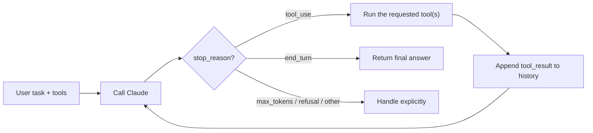
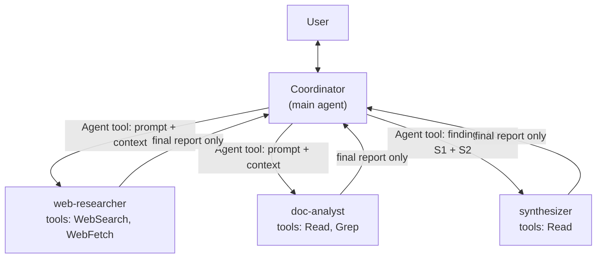
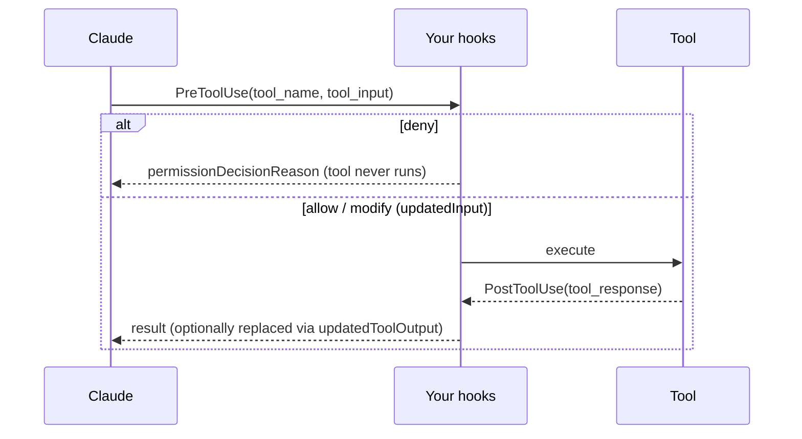
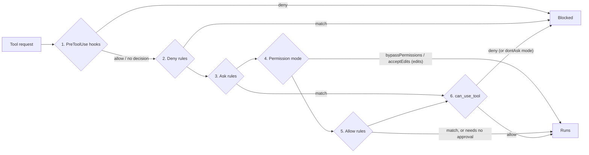

# Chapter 3 — Claude Agent SDK: Building Agentic Systems

> **Exam domain(s):** Domain 1 — Agentic Architecture & Orchestration (**27%**, primary) · also touches Domain 2 — Tool Design & MCP Integration (18%) and Domain 5 — Context Management & Reliability (15%)
> **Est. time:** 9–11 hours (reading + 2 notebooks) · **Status:** [ ] not started

## Why this matters for a solution architect

Domain 1 carries the most weight on the exam, and this chapter is its core. As an architect you decide **who owns the loop** (your code with the Client SDK, or the Agent SDK's built-in loop), **how work is split** (one agent, or a coordinator with specialized subagents), and **which rules must hold every time** (hooks in code) versus which only need to hold most of the time (prompt instructions). Each choice trades control and determinism against build effort, cost, and latency, and the exam scenarios are built to test whether you can tell the cases apart.

## Learning objectives

- [ ] Explain the agentic loop and why `stop_reason` is the only reliable signal that a turn is complete
- [ ] Write a manual tool loop with the `anthropic` Client SDK, then the same task with the Claude Agent SDK, and explain what the SDK does for you
- [ ] Configure subagents with `AgentDefinition` (description, prompt, tools, model) and pass them through `ClaudeAgentOptions(agents=...)`
- [ ] Design a hub-and-spoke system in which the coordinator owns decomposition, routing, aggregation, and error handling
- [ ] Spawn subagents with the subagent tool (`Agent`, formerly `Task`), passing context explicitly and running independent subtasks in parallel
- [ ] Enforce business rules with `PreToolUse` hooks and normalize tool data with `PostToolUse` hooks
- [ ] Choose between hooks and prompt instructions using a "cost of failure" test
- [ ] Resume (including by session name) and fork sessions, and know when a fresh session with a summary is the better option
- [ ] Design human approval for irreversible actions with permission modes, allow/deny rules, the `can_use_tool` callback, and `PreToolUse` hooks

## Prerequisites

- [Chapter 1 — Claude API Fundamentals](../01-claude-api-fundamentals/README.md): Messages API, roles, `stop_reason`
- [Chapter 2 — Tool Use](../02-tool-use/README.md): tool schemas, `tool_use` / `tool_result` blocks, `tool_choice`
- [00 — Prerequisites](../../00-prerequisites/README.md): Python 3.11+, `async`/`await`, virtual environments, `.env` handling
- Install for this chapter: `pip install anthropic claude-agent-sdk python-dotenv` (already listed in the root `requirements.txt`)

> [!TIP]
> **Running the SDK inside Jupyter:** the notebook already runs an event loop, so `asyncio.run(main())` raises `RuntimeError`. Use top-level `await main()` in a cell instead. The snippets below use `asyncio.run` because they are written as scripts.

---

## Concepts

### 3.1 The agentic loop

An **agent** is a model running in a loop. On each pass it looks at the current state, decides on an action (usually a tool call), sees the result, and decides again. The model chooses the next step from what it has learned so far. That is the key difference from a hard-coded decision tree, where your code fixes the order of steps in advance.



#### Two ways to own the loop

| | **Client SDK** (`anthropic`) | **Agent SDK** (`claude-agent-sdk`) |
|---|---|---|
| Who runs the loop | Your code | The SDK (it runs the same loop that powers Claude Code) |
| Tools | You define schemas **and** execute them | Built-in tools (`Read`, `Edit`, `Bash`, `Grep`, `WebSearch`, `Agent`…) plus your own tools (in-process SDK MCP servers) and external MCP servers |
| Extras | None. You build retries, permissions, and context management yourself | Permissions, hooks, subagents, sessions, automatic compaction, cost caps |
| Choose when | You need full control, or a workflow that is short, fixed, or unusual | You want a production agent quickly and can accept the SDK's conventions |

**Manual loop with the Client SDK.** Writing this loop once is the best way to understand what the Agent SDK automates:

```python
import json
import anthropic
from dotenv import load_dotenv

load_dotenv()                      # loads ANTHROPIC_API_KEY from .env
client = anthropic.Anthropic()     # reads the key from the environment

def run_agent(task: str, tools: list[dict], impls: dict, safety_cap: int = 25):
    messages = [{"role": "user", "content": task}]
    for _ in range(safety_cap):    # safety net only, never the success criterion
        resp = client.messages.create(
            model="claude-sonnet-5-5",
            max_tokens=2048,
            tools=tools,
            messages=messages,
        )
        messages.append({"role": "assistant", "content": resp.content})

        if resp.stop_reason == "end_turn":
            return resp                                   # the task is done
        if resp.stop_reason == "tool_use":
            results = [
                {
                    "type": "tool_result",
                    "tool_use_id": block.id,
                    "content": json.dumps(impls[block.name](**block.input)),
                }
                for block in resp.content if block.type == "tool_use"
            ]
            messages.append({"role": "user", "content": results})
            continue
        # max_tokens, refusal, pause_turn, model_context_window_exceeded, ...
        raise RuntimeError(f"Unhandled stop_reason: {resp.stop_reason}")
    raise RuntimeError("Safety cap reached. Investigate instead of returning a partial answer.")
```

**Anti-patterns the exam targets:**

| Anti-pattern | Why it fails |
|---|---|
| Parsing the text for "Task complete" or "Done" | The wording is not guaranteed. The model can say "done" and still request a tool in the same response |
| Using an iteration limit (`max_iterations=5`) as the **main** stop condition | It cuts off legitimate long tasks and hides runaway loops. Keep a cap only as a safety net, and treat hitting it as an error |
| Treating "the response contains text" as completion | Claude often writes text **and** a `tool_use` block in the same response |
| Dropping `tool_result` blocks from history | The model loses what it learned and repeats calls |

#### Environment inspection: let the agent see what its actions did

An agent can only correct itself if it can **observe the environment** after acting. Give it read-only tools that report the current state, and expect it to use them between actions: read a file before editing it, run the tests after changing code, list a directory after writing to it, or check an order's status after a refund. This is why Claude Code's built-in tools include `Read`, `Glob`, `Grep`, and `Bash`: the model inspects, acts, then inspects again. When you design custom tools, pair every action tool (`process_refund`) with a way to check its effect (`lookup_order`), and return results that are specific enough to verify against ("refund RF-001 for $129.00 issued", not "ok"). Without inspection the loop is blind, and the model has to guess whether the step worked.

**In the Agent SDK** you don't write this loop. `query()` yields a stream of messages: `SystemMessage` (subtype `init`), `AssistantMessage` (text or tool calls), `UserMessage` (tool results), and `ResultMessage` when the loop ends. A few trailing system events can still arrive after the `ResultMessage`, so iterate the stream to completion instead of breaking out early. You check `ResultMessage.subtype`:

| `subtype` | Meaning |
|---|---|
| `success` | Claude finished normally. `result` holds the final text |
| `error_max_turns` | Hit `max_turns` (a safety cap on tool-use turns) |
| `error_max_budget_usd` | Hit `max_budget_usd` (subagent spend counts toward it) |
| `error_during_execution` | Something interrupted the loop |
| `error_max_structured_output_retries` | No valid structured output after the configured retries |

```python
import asyncio
from dotenv import load_dotenv
from claude_agent_sdk import query, ClaudeAgentOptions, AssistantMessage, ResultMessage, ToolUseBlock

load_dotenv()  # the SDK reads ANTHROPIC_API_KEY from the environment; it does not load .env itself

async def main():
    options = ClaudeAgentOptions(
        model="claude-sonnet-5-5",
        allowed_tools=["Read", "Glob", "Grep"],   # auto-approve these tools
        permission_mode="dontAsk",                 # set it explicitly; anything that would prompt is denied
        max_turns=20,                              # safety cap
        max_budget_usd=1.00,                       # cost cap
    )
    try:
        async for message in query(prompt="Summarize the structure of this repo", options=options):
            if isinstance(message, AssistantMessage):
                for block in message.content:
                    if isinstance(block, ToolUseBlock):
                        print(f"tool -> {block.name}")
            elif isinstance(message, ResultMessage):
                print(message.subtype, message.total_cost_usd)
                if message.subtype == "success":
                    print(message.result)
    except Exception as err:   # single-shot query() raises after yielding an error result
        print(f"Run ended with an error: {err}")

asyncio.run(main())
```

Use `ClaudeSDKClient` instead of `query()` when you need a multi-turn conversation in one process. It keeps the session open between `client.query(...)` calls, and you read each reply with `client.receive_response()`.

> [!NOTE]
> **Changed since the guide:** the Python package was renamed from `claude-code-sdk` to **`claude-agent-sdk`** (import `claude_agent_sdk`), and `ClaudeCodeOptions` became **`ClaudeAgentOptions`**. The SDK now starts with a **minimal system prompt** unless you pass `system_prompt={"type": "preset", "preset": "claude_code"}`. Both SDKs bundle a native Claude Code binary, so most installs need no separate Claude Code install.

> [!IMPORTANT]
> **Two defaults that surprise people:**
>
> - **Permission mode.** If you don't set `permission_mode`, Claude Code picks the starting mode from a `permissions.defaultMode` in the loaded settings files, and otherwise from its built-in default, which **can be `auto` mode** (a model classifier approves or blocks actions). A session that starts in `auto` also drops broad allow rules such as a bare `Bash`. Older SDK versions treated "unset" as `default`. Always pass the mode you designed for (`"default"`, `"dontAsk"`, ...). See [3.7](#37-human-approval-for-irreversible-actions).
> - **Tool search is on by default.** Tool definitions that can be deferred (MCP tools, including your own in-process SDK MCP tools, and some built-ins) are withheld from the context window. Claude calls the built-in **`ToolSearch`** tool to load the ones it needs, so expect `ToolSearch` calls in your traces. `ToolSearch` needs no permission. Control it with the `ENABLE_TOOL_SEARCH` environment variable (`false` loads every definition upfront; `auto` turns search on only when deferrable definitions reach 10% of the context window). With fewer than about 10 small tools, loading upfront is usually faster.

> **Exam trap:** `max_turns` / `max_budget_usd` are fine as **guardrails**. They are wrong when they are the only thing that decides whether the task "finished". If an answer choice uses an iteration cap or text matching as the completion signal, eliminate it.

### 3.2 `AgentDefinition` configuration

`AgentDefinition` describes a **subagent**: a specialist the main agent can delegate to. You don't instantiate agents one by one. You pass a dictionary of definitions to `ClaudeAgentOptions(agents=...)`, and the **dictionary key is the agent's name**.

```python
from claude_agent_sdk import AgentDefinition

AGENTS = {
    "order-specialist": AgentDefinition(
        description=(                      # REQUIRED: tells the coordinator WHEN to delegate here
            "Looks up orders and refund eligibility for a verified customer. "
            "Use after the customer ID is known. Never use for billing disputes."
        ),
        prompt=(                           # REQUIRED: the subagent's system prompt
            "You are an order specialist. Use only the data passed to you. "
            "Return JSON: {order_id, status, refundable, reason}."
        ),
        tools=["mcp__support__lookup_order"],   # least privilege; omit to inherit all subagent tools
        model="claude-haiku-4-5-20251001",      # alias ("haiku", "sonnet", "opus", "fable", "inherit") or full model ID
        maxTurns=8,                              # note the camelCase (wire format)
    ),
}
```

| Field | Required | Purpose |
|---|---|---|
| `description` | ✅ | Routing signal. The coordinator matches tasks to agents mainly by this text, so write it like a good tool description (Chapter 2) |
| `prompt` | ✅ | System prompt: role, constraints, output format |
| `tools` | — | Allow-list for this subagent. **Omit it and the subagent inherits every tool available to subagents** |
| `disallowedTools` | — | Remove specific tools, including MCP patterns such as `mcp__server__*` |
| `model` | — | Use a cheaper or stronger model per role: an alias (`"haiku"`, `"sonnet"`, `"opus"`, `"fable"`, or `"inherit"` for the parent's model) or a full model ID. `"fable"` resolves to Claude Fable 5.1 unless `ANTHROPIC_DEFAULT_FABLE_MODEL` overrides it. Omit it and Claude Code picks the model by its subagent model order |
| `maxTurns`, `effort`, `permissionMode`, `mcpServers`, `skills`, `memory`, `background` | — | Per-agent limits and capabilities. `permissionMode` only applies when the parent session runs in `default`, `dontAsk`, or `plan` (see [3.7](#37-human-approval-for-irreversible-actions)) |

> [!NOTE]
> **Changed since the guide:** the guide shows `AgentDefinition(name=..., system_prompt=..., allowed_tools=[...])`. The current Python SDK has **no `name` field** (the name is the key in the `agents` dict), uses **`prompt`** rather than `system_prompt`, and uses **`tools`** rather than `allowed_tools`. Multi-word fields stay **camelCase** (`disallowedTools`, `maxTurns`, `mcpServers`), while `ClaudeAgentOptions` uses snake_case (`allowed_tools`, `max_turns`). You can also define subagents as Markdown files in `.claude/agents/`. Programmatic definitions win when the names clash.

**`allowed_tools` vs `tools` vs `disallowed_tools`:** these three are easy to mix up.

| Setting | Where | Effect |
|---|---|---|
| `ClaudeAgentOptions.allowed_tools` | Session | **Auto-approves** the listed tools. It does **not** hide other tools; unlisted tools fall through to the permission mode |
| `ClaudeAgentOptions.disallowed_tools` | Session | Bare name (e.g. `"Bash"`) **removes** the tool from Claude's context; scoped rule (e.g. `"Bash(rm *)"`) denies matching calls |
| `AgentDefinition.tools` | Per subagent | The subagent's tool **set**. Tools you leave out simply don't exist for it |

> **Exam trap:** the guide and the exam use "`allowedTools`" loosely to mean "the agent's scoped tool list". In the real SDK, a hard restriction comes from `AgentDefinition.tools` or `disallowed_tools`. Also remember that `allowed_tools` does **not** constrain `permission_mode="bypassPermissions"`.

**Least privilege matters for quality, not only security.** An agent with 15+ tools picks the wrong one more often than an agent with 4–5 focused tools, and an agent holding tools outside its role tends to misuse them. Give each role only the tools it needs, plus a small, constrained cross-role utility when it saves round trips (for example, a narrow `verify_fact` tool for a synthesis agent instead of full web search).

### 3.3 Hub-and-spoke: coordinator and subagents



**The coordinator owns:**

1. **Decomposition.** It splits the goal into subtasks that together **cover the whole scope**.
2. **Dynamic selection.** It decides which subagents a request needs. Not every request needs every agent.
3. **Delegation with explicit context.** It writes a self-contained prompt for each subagent.
4. **Aggregation and validation.** It merges results, spots gaps or conflicts, and re-delegates if needed (an iterative refinement loop).
5. **Error handling.** It decides whether to retry, take another route, or continue with partial results.
6. **User communication.** It is the single voice to the user.

**Why every message goes through the hub:** the coordinator can observe every interaction, handle errors the same way everywhere, and control what each subagent sees. If subagents talk to each other directly, you lose that visibility and control. You don't gain any batching or retry ability you couldn't have through the hub.

**Context isolation is the defining property.** A subagent:

- starts with a **fresh** context: its own system prompt (`AgentDefinition.prompt`), the prompt string from the Agent tool call, tool definitions, and project `CLAUDE.md` if setting sources load it;
- does **not** see the parent's conversation, tool results, or system prompt;
- returns **only its final message** to the parent. Its intermediate tool calls stay inside it, which is why subagents are also a tool for keeping the coordinator's context window small (Domain 5).

**Common coordinator failure: decomposition that is too narrow.** Suppose the topic is "AI in creative industries", and the coordinator splits it into digital art, graphic design, and photography. Every subagent can do its job perfectly and the report still misses music, film, and writing. When every subagent succeeds but the output has gaps, look at the **coordinator's decomposition** first.

**Partition before you delegate.** When two subagents overlap (both searching the same sources), the fix is for the coordinator to assign **distinct subtopics or source types up front**. Removing duplicates afterwards still wastes the tokens.

**Iterative refinement loop.** A good coordinator doesn't stop at the first synthesis. It checks the draft against its quality criteria (every required area covered, every claim cited, conflicts flagged). For each gap it re-delegates a **targeted** query to the research or analysis subagent ("find sources on AI in film dubbing, 2025–2026"), then re-runs synthesis with the new findings. It repeats until the criteria are met or a round limit is reached, and it reports any remaining gaps instead of hiding them. The round limit is a guardrail, as in 3.1. The criteria decide when the work is done.

**Write coordinator prompts as goals and quality criteria** ("cover all major sub-domains; every claim needs a source; flag conflicts") rather than rigid step-by-step scripts. Step-by-step scripts stop the coordinator from adapting to what it finds.

**Error propagation (Domain 5.3):**

| Situation | Do | Don't |
|---|---|---|
| Transient failure inside a subagent (timeout, flaky parse) | Retry locally; escalate only what you can't fix | Escalate every hiccup to the coordinator |
| Unrecoverable failure | Return **structured** context: failure type, what was attempted, partial results, possible alternatives | Return a generic "search unavailable", or an empty result marked as success |
| "0 results" vs "connection timeout" | Report them differently: one is a valid finding, the other needs a retry decision | Lump both together as "failed" |
| Conflicting values from two sources | Keep both, with attribution, and let the coordinator reconcile them | Silently pick one, or block the pipeline |

### 3.4 The subagent tool (`Agent`, formerly `Task`)

The coordinator spawns a subagent by calling the built-in **`Agent`** tool. The tool input names the agent type (`subagent_type`) and carries the prompt string. If `subagent_type` is omitted, Claude gets the built-in `general-purpose` subagent.

```python
import asyncio
from dotenv import load_dotenv
from claude_agent_sdk import (
    query, ClaudeAgentOptions, AgentDefinition,
    AssistantMessage, ToolUseBlock, ResultMessage,
)

load_dotenv()

AGENTS = {
    "web-researcher": AgentDefinition(
        description="Finds and summarizes external web sources for ONE assigned subtopic.",
        prompt="Research only the subtopic you are given. Return a JSON list of "
               "{claim, source_url, quote, published_date}. Report gaps explicitly.",
        tools=["WebSearch", "WebFetch"],
        model="claude-haiku-4-5-20251001",
    ),
    "synthesizer": AgentDefinition(
        description="Merges research findings passed in the prompt into a cited report.",
        prompt="Write a report using ONLY the findings provided. Keep claim->source mapping. "
               "Mark conflicting values instead of choosing one.",
        tools=["Read"],
    ),
}

COORDINATOR = (
    "You coordinate research. Goal: complete coverage of the topic with cited claims. "
    "1) Partition the topic into non-overlapping subtopics that cover ALL major areas. "
    "2) Spawn one web-researcher per subtopic IN PARALLEL (several Agent calls in one response). "
    "3) Pass every finding verbatim to the synthesizer. 4) Check coverage; re-delegate gaps."
)

async def main():
    options = ClaudeAgentOptions(
        model="claude-sonnet-5-5",
        system_prompt=COORDINATOR,
        agents=AGENTS,
        allowed_tools=["Agent", "WebSearch", "WebFetch", "Read"],   # auto-approve
        max_budget_usd=3.00,                                          # caps subagent spend too
        env={"CLAUDE_CODE_MAX_SUBAGENT_SPAWN_DEPTH": "1"},            # subagents can't spawn more
    )
    try:
        async for message in query(prompt="Research: impact of AI on creative industries", options=options):
            if isinstance(message, AssistantMessage):
                for block in message.content:
                    # Match both names: current versions emit "Agent", older ones emitted "Task"
                    if isinstance(block, ToolUseBlock) and block.name in ("Agent", "Task"):
                        print("spawn ->", block.input.get("subagent_type"))
            if getattr(message, "parent_tool_use_id", None):
                pass  # this message came from inside a subagent: useful for tracing
            if isinstance(message, ResultMessage) and message.subtype == "success":
                print(message.result)
    except Exception as err:   # e.g. the budget cap was hit (error_max_budget_usd)
        print(f"Run ended with an error: {err}")

asyncio.run(main())
```

> [!NOTE]
> **Changed since the guide:** the guide (and likely the exam question bank) calls this tool **`Task`** and says the coordinator's `allowedTools` must include `"Task"`. In current docs the tool is **`Agent`**: `tool_use` blocks have used `"Agent"` since Claude Code v2.1.63, while the `system:init` tool list still shows `"Task"`. Match **both names** in code. On the exam, read `Task` as "the subagent-spawning tool". Listing `"Agent"` in `allowed_tools` is common in the official examples, but it is not strictly required: `Agent` is one of the tools that run without asking for approval in the default permission mode.
>
> Two more behaviors are new. Subagents now run **in the background by default**, and Claude sets `run_in_background: false` when it needs the result before continuing. Subagents can also **spawn their own subagents** (default depth 3). Cap depth, concurrency, and spend with `CLAUDE_CODE_MAX_SUBAGENT_SPAWN_DEPTH`, `CLAUDE_CODE_MAX_CONCURRENT_SUBAGENTS`, and `max_budget_usd`.

**Explicit context passing.** The prompt string is the **only** thing that travels from parent to subagent:

```text
# Weak: the subagent has no idea what "the document" is
"Analyze the document."

# Strong: self-contained, with data separated from instructions and a defined output
"Analyze the contract below for termination clauses.
<document>…full text…</document>
<prior_findings source="web-researcher" retrieved="2026-10-01">…</prior_findings>
Return JSON: {clause, section, risk_level, quote}. If a field is missing, use null."
```

Rules of thumb: include **full outputs** from earlier agents (not your paraphrase), use structured tags or JSON to separate **data** from **metadata** (source, date), and state the **output schema** so the coordinator can merge results reliably.

**Parallel spawning.** Independent subtasks go into **several `Agent` calls in a single coordinator response**. They run concurrently, so wall-clock time is set by the slowest subagent rather than the sum. Dependent steps (synthesis needs research results) must stay sequential.

> **Exam trap:** "The subagent ignored facts the coordinator already knew." The root cause is almost always that the facts were **not in the subagent's prompt**. Subagents don't inherit history. Shared memory, a bigger context window, or "tell it to remember" are not the fix.

### 3.5 Hooks in the Agent SDK

Hooks are **your code** running at fixed points in the agent lifecycle. They run in your application process, outside the model's context window, so they are **deterministic**: they fire on every matching event and do not depend on the model following an instruction.



**Hook events available in the Python SDK:** `PreToolUse`, `PostToolUse`, `PostToolUseFailure`, `UserPromptSubmit`, `Stop`, `SubagentStart`, `SubagentStop`, `PreCompact`, `Notification`, `PermissionRequest`. The TypeScript SDK has more, such as `SessionStart` and `SessionEnd`.

**Registration:** `hooks={EventName: [HookMatcher(matcher=..., hooks=[callback], timeout=...)]}`. The `matcher` is tested against the **tool name**, as an exact name, a `"A|B"` list of exact names, or (once it contains any character other than letters, digits, `_`, `-`, spaces, `,` and `|`) an unanchored regex such as `"^mcp__"`. MCP tools are named `mcp__<server>__<tool>`. Matchers never look at arguments; inspect `tool_input` inside the callback for that.

**Callback signature:** `async def cb(input_data: dict, tool_use_id: str | None, context) -> dict`. Return `{}` to let the call through unchanged.

#### Pattern A: block a policy violation and redirect to escalation (`PreToolUse`)

```python
from claude_agent_sdk import ClaudeAgentOptions, HookMatcher

REFUND_LIMIT_USD = 500

async def enforce_refund_limit(input_data, tool_use_id, context):
    amount = float(input_data["tool_input"].get("amount", 0))
    if amount > REFUND_LIMIT_USD:
        return {
            "hookSpecificOutput": {
                "hookEventName": "PreToolUse",
                "permissionDecision": "deny",                 # the tool never executes
                "permissionDecisionReason": (                  # Claude reads this and adapts
                    f"Refunds over ${REFUND_LIMIT_USD} need human approval. "
                    "Call mcp__support__escalate_to_human with customer_id, amount, and reason."
                ),
            }
        }
    return {}
```

#### Pattern B: a programmatic precondition (verify identity before any money moves)

```python
verified_sessions: set[str] = set()

async def mark_verified(input_data, tool_use_id, context):          # PostToolUse on get_customer
    # PostToolUse fires only when the call succeeded (failures go to PostToolUseFailure).
    # A successful call can still be "no match", so check the response before trusting it.
    if customer_found(input_data["tool_response"]):                 # your own check
        verified_sessions.add(input_data["session_id"])
    return {}

async def require_verified_customer(input_data, tool_use_id, context):  # PreToolUse
    if input_data["session_id"] not in verified_sessions:
        return {"hookSpecificOutput": {
            "hookEventName": "PreToolUse",
            "permissionDecision": "deny",
            "permissionDecisionReason": "Call get_customer first to verify the customer's identity.",
        }}
    return {}

options = ClaudeAgentOptions(
    model="claude-sonnet-5-5",
    hooks={
        "PreToolUse": [
            HookMatcher(matcher="mcp__support__lookup_order|mcp__support__process_refund",
                        hooks=[require_verified_customer]),
            HookMatcher(matcher="mcp__support__process_refund", hooks=[enforce_refund_limit]),
        ],
        "PostToolUse": [HookMatcher(matcher="mcp__support__get_customer", hooks=[mark_verified])],
    },
)
```

#### Pattern C: normalize heterogeneous tool output (`PostToolUse`)

Third-party MCP servers return Unix timestamps, ISO 8601 strings, or numeric status codes, and you can't change their code. A single `PostToolUse` hook converts everything into one format before Claude reads it:

```python
import json

async def normalize_tool_output(input_data, tool_use_id, context):
    raw = input_data["tool_response"]              # the tool's own output shape
    blocks = raw.get("content", []) if isinstance(raw, dict) else raw
    text = "".join(b.get("text", "") for b in blocks if isinstance(b, dict))
    try:
        clean = normalize(json.loads(text))        # your pure function: epoch -> "2026-03-05", 2 -> "shipped", ...
    except json.JSONDecodeError:
        return {}                                  # not JSON: leave the output untouched
    new_blocks = [{"type": "text", "text": json.dumps(clean)}]
    # updatedToolOutput must keep the SAME shape as tool_response:
    #   an MCP result object {"content": [...], ...}  -> the same object with new "content"
    #   a bare list of content blocks                 -> a list
    return {"hookSpecificOutput": {
        "hookEventName": "PostToolUse",
        "updatedToolOutput": {**raw, "content": new_blocks} if isinstance(raw, dict) else new_blocks,
    }}

# register with: "PostToolUse": [HookMatcher(matcher="^mcp__", hooks=[normalize_tool_output])]
```

**Match the output shape.** `updatedToolOutput` replaces what Claude sees, and the value must have the same shape as the tool's output. Built-in tools return structured objects, not plain strings. `Bash`, for example, returns `{"stdout", "stderr", "interrupted", "isImage"}`, so a replacement for a `Bash` result is an object with those fields. For a built-in tool, a value that doesn't match the tool's output schema is **ignored**, and Claude sees the original. MCP output is passed through **without** schema validation, so a wrong shape or stripped error details go straight to Claude. The docs don't pin down the exact `tool_response` an MCP tool delivers to an SDK hook. The code above therefore handles both an MCP result object (`{"content": [...]}`) and a bare block list, and it returns whichever shape it received. Print one raw `tool_response` from a live run before you simplify it. Also remember that the tool has **already run** when `PostToolUse` fires. To stop or change a call, use `PreToolUse`.

> [!NOTE]
> **Changed since the guide:** the guide's `@hook("PostToolUse")` decorator is pseudocode. In the real SDK you register async callbacks through `HookMatcher` in `ClaudeAgentOptions.hooks`. A deny is a **return value** (`hookSpecificOutput.permissionDecision = "deny"`), not a separate redirect function. `PreToolUse` can also rewrite arguments with `updatedInput`. `PostToolUse` can add `additionalContext` or replace output with `updatedToolOutput` (the older `updatedMCPToolOutput` is deprecated). When several hooks match, they run in parallel and the most restrictive decision wins (`deny` > `defer` > `ask` > `allow`). Hooks run **before** permission rules, and a hook `deny` applies even in `bypassPermissions` mode. The reverse is not true: a hook **`allow` does not skip the deny and ask rules** that come after it. Those rules are still evaluated, so a hook can't approve a call that a deny rule blocks (see [3.7](#37-human-approval-for-irreversible-actions)).

#### Hooks vs prompt instructions

| | **Hooks / programmatic checks** | **Prompt instructions** |
|---|---|---|
| Guarantee | Deterministic: runs on every matching call | Probabilistic: usually followed, never guaranteed |
| Lives in | Your code, versioned and testable | System prompt, competing with other instructions |
| Use for | Money, identity, compliance, safety, data format contracts | Tone, preferences, soft heuristics ("try to resolve before escalating") |
| Failure mode | Code bug (testable) | Silent skip in some percentage of runs |

**Rule:** if a single violation would have **financial, legal, or safety** consequences, enforce it in code. Better prompts, few-shot examples, and routing classifiers reduce the failure rate. They don't eliminate it.

### 3.6 Sessions: resume and fork (bonus, from Domain 1.7)

The guide lists `fork_session` under Domain 1.3/1.7, so it belongs here. Claude Code CLI sessions (`--resume`) are covered again in [Chapter 5](../05-claude-code/README.md).

| Need | Agent SDK (Python) |
|---|---|
| Multi-turn chat in one process | `ClaudeSDKClient`: each `client.query()` continues the same session |
| Continue the most recent session after a restart | `ClaudeAgentOptions(continue_conversation=True)` |
| Return to a specific session | Capture `ResultMessage.session_id`, then `ClaudeAgentOptions(resume=session_id)` |
| Try an alternative without losing the original | `ClaudeAgentOptions(resume=session_id, fork_session=True)` gives a **new** session ID; the original stays unchanged |

```python
# Branch an investigation: compare two approaches from the same analyzed starting point
fork_opts = ClaudeAgentOptions(resume=session_id, fork_session=True, max_turns=5)
```

**Named sessions.** A long investigation is easier to return to by name than by UUID. In the Claude Code CLI you name a session with `--name` (`-n`) and come back to it with `--resume <name>`; `--resume` takes an ID or a name, and `--fork-session` branches instead of continuing:

```bash
claude -n auth-refactor-investigation          # day 1: start and name the session
claude --resume auth-refactor-investigation    # day 2: continue that exact conversation
claude --resume auth-refactor-investigation --fork-session   # try an alternative without touching it
```

In the Python Agent SDK, `resume=` takes a **session ID**. To work by name, give the session a title with `rename_session(session_id, "auth-refactor-investigation")`, then find it later with `list_sessions(directory=...)` by its `custom_title` and pass that entry's `session_id` to `resume=`. The [practice notebook](01_practice.ipynb) shows the lookup.

Forking branches the **conversation**, not the filesystem. If a forked agent edits files, every session in that directory sees the change (use file checkpointing to revert).

**Resume or start fresh?** Resume when the earlier context is still accurate. If files changed since then, **tell the agent what changed** when you resume. If most earlier tool results are stale, a **new session seeded with a structured summary** is more reliable than resuming into outdated observations.

### 3.7 Human approval for irreversible actions

Hooks (3.5) enforce rules that never change, such as "no refund above $500, ever". Many actions fall in between: allowed **sometimes**, but a human should look first. Sending an email to a customer, deploying, deleting data, and paying an invoice are examples. The Agent SDK gives you several controls for this. You need to know the order in which they run, because a call that an earlier step approves never reaches the later ones.



| Step | What it does | Facts to remember |
|---|---|---|
| 1. Hooks | Your `PreToolUse` code can deny, allow, ask, defer, or rewrite the input | A hook `deny` wins even in `bypassPermissions`. A hook `allow` does **not** skip steps 2 and 3 |
| 2. Deny rules | `disallowed_tools` and settings `deny` rules | A bare name (`"Bash"`) removes the tool from Claude's context. A scoped rule (`"Bash(rm *)"`) blocks matching calls in **every** mode |
| 3. Ask rules | Settings `ask` rules | A match goes to `can_use_tool`, even in `bypassPermissions` |
| 4. Permission mode | `default`, `dontAsk`, `acceptEdits`, `bypassPermissions`, `plan`, `auto` | `bypassPermissions` approves everything that reaches this step. `allowed_tools` does not constrain it |
| 5. Allow rules | `allowed_tools` and settings `allow` rules | An allow rule approves the call, and **`can_use_tool` never sees it**. Calls that need no approval (file reads in the working directory, `Agent`, `ToolSearch`) are approved here too |
| 6. `can_use_tool` | Your approval callback | Called only for what is still unresolved. In `dontAsk` mode it is never called, and the call is denied |

**Permission modes in one line each:** `default` asks your callback for anything not pre-approved. `dontAsk` denies anything that would ask. `acceptEdits` auto-approves file edits and filesystem commands inside the working directories. `bypassPermissions` approves everything except a few protected actions (for example `rm` on a critical path). `plan` lets Claude explore but sends every edit to your callback. `auto` lets a model classifier approve or block each action. If you don't set a mode, the session may start in `auto` (see 3.1), so **always set it explicitly**. A subagent runs in its parent's mode. `AgentDefinition.permissionMode` only applies when the parent runs in `default`, `dontAsk`, or `plan`, and a subagent never gets `bypassPermissions` unless the parent itself runs in it.

#### Approval patterns

| Action class | Pattern | Mechanism |
|---|---|---|
| Read-only lookups (`Read`, `Grep`, `Glob`, `lookup_order`) | **Pre-approve** | Bare names in `allowed_tools` |
| Reversible edits inside a sandbox directory | **Auto-approve within scope** | `acceptEdits` with `cwd` set to the sandbox, or scoped allow rules |
| Side effects that are hard to undo (send email, pay, deploy, write outside the sandbox) | **Ask a human** | Keep the tool **out of** `allowed_tools`, set `permission_mode="default"`, and decide in `can_use_tool`. Or return `"ask"` from a `PreToolUse` hook to force the question even when a rule would allow the call |
| Never acceptable (`rm -rf`, `DROP TABLE`, a payment over the hard limit) | **Deny** | `disallowed_tools` (bare or scoped) or a `PreToolUse` deny. The check is in code, and no human can click it through |
| The approval may take hours or days | **Defer** | A `PreToolUse` hook returns `"defer"`. The run ends with `stop_reason: "tool_deferred"` and the pending call in `deferred_tool_use`, and you resume the session once a person has decided. This works only in non-interactive runs, and only when Claude made a single tool call in that turn |

```python
from claude_agent_sdk import ClaudeAgentOptions, HookMatcher, PermissionResultAllow, PermissionResultDeny

async def approval_gate(tool_name, input_data, context):
    """Reached only by calls that no hook, rule, or mode resolved earlier."""
    decision = await ask_reviewer(tool_name, input_data)     # your UI: web form, Slack, ticket queue
    if decision.approved:
        # Approve as-is, or with edits (e.g. a corrected recipient). Claude isn't told about the edit.
        return PermissionResultAllow(updated_input=decision.edited_input or input_data)
    return PermissionResultDeny(message=f"Reviewer rejected this: {decision.reason}. Propose an alternative.")

options = ClaudeAgentOptions(
    permission_mode="default",                       # explicit: unset may start in auto mode
    allowed_tools=["Read", "Glob", "Grep", "mcp__crm__lookup_customer"],  # pre-approved reads only
    disallowed_tools=["Bash(rm *)", "mcp__crm__delete_customer"],          # never, in any mode
    can_use_tool=approval_gate,                      # everything else waits for a human
    hooks={"PreToolUse": [HookMatcher(matcher="mcp__billing__pay_invoice", hooks=[enforce_payment_limit])]},
)
```

> [!NOTE]
> **Python specifics:** `can_use_tool` works over the SDK's streaming control channel. The official Python example passes the prompt as an **async iterable** of user messages (or uses `ClaudeSDKClient`) and registers a no-op `PreToolUse` hook to keep the stream open. The callback receives `(tool_name, input_data, context)`. `context.suggestions` holds permission rules that you can send back in `PermissionResultAllow(updated_permissions=...)` for "approve and remember", and `PermissionResultDeny(interrupt=True)` also stops the current run. The SDK warns (`CanUseToolShadowedWarning`) when `bypassPermissions` or a bare `allowed_tools` entry means that the callback will never fire for some tools. To get notified while a request is waiting (Slack, email), add a `PermissionRequest` hook.

**`can_use_tool` or a `PreToolUse` hook?**

| | `PreToolUse` hook | `can_use_tool` callback |
|---|---|---|
| Runs | First, on **every** matching call | Last, only for calls nothing else resolved |
| Survives `bypassPermissions` / allow rules | Yes | No: approved calls skip it |
| Best for | Hard rules (deny, rewrite input, force `ask`, `defer`) | Interactive human decisions |
| Returns | `{"hookSpecificOutput": {...}}` | `PermissionResultAllow` / `PermissionResultDeny` |

**Rule:** put rules that must **always** hold in a hook, and judgment calls that a person should make in the approval callback. Never add a tool you want reviewed to `allowed_tools`. Chapter 9 ([Escalation and human-in-the-loop](../09-escalation-human-in-the-loop/README.md)) builds on these patterns at the workflow level.

> **Exam trap:** "We put `process_refund` in `allowed_tools` and wrote approval logic in `can_use_tool`, but refunds still go through without review." The allow rule approves the call at step 5, so the callback never runs. Remove the tool from `allowed_tools`, or enforce the rule in a `PreToolUse` hook.

---

## Notebooks

| File | What it covers | What you build |
|---|---|---|
| [`01_practice.ipynb`](01_practice.ipynb) | 3.1–3.7: a manual `stop_reason` loop and the three anti-patterns side by side, `query()` and `ClaudeSDKClient`, custom tools via `@tool` + `create_sdk_mcp_server`, `AgentDefinition` and permission settings, narrow vs coverage-driven coordinators, an iterative refinement loop, tracing `Agent`/`Task` calls and `parent_tool_use_id`, `PreToolUse`/`PostToolUse`/`SubagentStop` hooks, resume, fork and named sessions, and the permission evaluation order with a `can_use_tool` approval gate | **Mini-project:** a research coordinator with two subagents, a `PreToolUse` spend gate (purchases over $500 go to human approval), `PostToolUse` date normalization, and budget and depth caps |
| [`02_homework.ipynb`](02_homework.ipynb) | Self-test: a 12-question scenario quiz, 7 auto-checked offline exercises, and an architecture scenario with a rubric | Subagent and coordinator configs, least-privilege tool sets, a refund-limit hook, an agentic loop against a fake client, a subagent trace summarizer, and a `can_use_tool` approval callback |

Theory stays in this README; notebooks hold code. Run them from the repo root venv (see [../../00-prerequisites/README.md](../../00-prerequisites/README.md)).

---

## Architect decision cheat-sheet

| Situation | Choose | Over | Why |
|---|---|---|---|
| Short, fixed workflow; you need full control of every call | Client SDK manual loop | Agent SDK | Fewer moving parts. The Agent SDK's built-in tools and permissions add nothing here |
| Production agent with files, shell, web, permissions, sessions | Agent SDK | Hand-rolled loop | Loop, tool execution, compaction, hooks, and cost caps are built in |
| Rule with financial, legal, or safety impact | `PreToolUse` hook / programmatic precondition | Stronger system prompt or few-shot examples | Deterministic vs probabilistic |
| Tools return inconsistent formats (some third-party) | `PostToolUse` normalization hook | Format notes in the prompt, or a `normalize_data` tool the model must remember to call | Applied centrally on every call, with no reliance on model memory |
| Broad research or review task with independent parts | Coordinator + parallel subagents | One agent doing everything | Context isolation and wall-clock speedup |
| Small, sequential task | Single agent | Multi-agent | Every hop adds tokens, latency, and failure points |
| Subagent needs prior findings | Put full findings in the `Agent` prompt | "It will remember" or shared memory | Subagents start fresh |
| Subagents duplicate work | Coordinator partitions scope before delegating | Deduplicating afterwards | Fixes the cause, saves tokens |
| Synthesis agent often needs simple fact checks | A narrow `verify_fact` tool for that agent; complex checks still go through the coordinator | Full web-search toolset for the synthesizer, or always round-tripping | Least privilege plus fewer round trips |
| Exploring two alternative approaches | `fork_session=True` | Restarting from scratch | Same starting context, independent branches |
| Earlier session's tool results are stale | New session + structured summary | `resume` | Avoids reasoning over outdated observations |
| Action is sometimes fine but a human should confirm it (send email, deploy, pay) | Leave it out of `allowed_tools`, `permission_mode="default"`, decide in `can_use_tool` | Pre-approving it and checking in the callback | Allow rules resolve the call before the callback runs |
| Action must never happen, whoever approves it | `disallowed_tools` or a `PreToolUse` deny | An approval prompt | Deterministic, and no one can click it through |
| Headless agent with a fixed tool surface | `allowed_tools` + `permission_mode="dontAsk"` | Leaving the mode unset | Unset may start in `auto` mode; `dontAsk` denies everything not listed |

## Common mistakes and anti-patterns

- **Text-based completion detection** ("if 'done' in reply"). Use `stop_reason` (Client SDK) or `ResultMessage.subtype` (Agent SDK).
- **Iteration cap as the success criterion.** Keep caps as guardrails and treat reaching them as an error to investigate.
- **Assuming subagents share memory.** Anything a subagent needs must be in its prompt.
- **Vague `description` fields.** The coordinator routes by description, so overlapping descriptions cause misrouting. Fix the description before adding a routing classifier.
- **Omitting `tools` on a subagent "to be safe".** Omitting it grants every available tool, which is the opposite of safe.
- **Thinking `allowed_tools` is a sandbox.** It only auto-approves. Use `disallowed_tools`, `AgentDefinition.tools`, or hooks to restrict, or pair `allowed_tools` with `permission_mode="dontAsk"` so every unlisted call that would prompt is denied.
- **Subagents talking to each other directly.** This removes the coordinator's observability and consistent error handling.
- **Generic errors** ("operation failed") and **errors disguised as success** (an empty list returned with `success=True`).
- **Business rules only in the prompt** (refund limits, identity checks). They will be skipped in some fraction of runs.
- **Mutating `tool_input` inside a hook.** Return a new dict in `updatedInput` instead. Also, don't put `updatedInput` at the top level of the hook output; it belongs inside `hookSpecificOutput`.
- **Unbounded delegation.** No `max_budget_usd`, no depth or concurrency caps, and a strong model that likes to delegate add up to a cost surprise.
- **Running `asyncio.run()` in Jupyter.** Use `await` instead.
- **Leaving `permission_mode` unset.** The session may start in `auto` mode, where a classifier makes approval decisions and broad allow rules are dropped. Set the mode you designed for.
- **Pre-approving a tool you want a human to review.** An allow rule resolves the call before `can_use_tool` runs, so the review never happens.
- **Expecting a hook `allow` to override a deny rule.** Deny and ask rules are still evaluated after a hook allows a call.
- **A `PostToolUse` replacement with the wrong shape.** For built-in tools it is silently ignored. For MCP tools it reaches Claude unvalidated.

---

## Self-check

**Q1.** An agent built with the Client SDK sometimes stops early. The loop ends when the assistant's text contains "complete", or after 5 iterations. What is the best fix?

- A) Raise the iteration limit to 20
- B) Add "Only say 'complete' when truly finished" to the system prompt
- C) Continue while `stop_reason == "tool_use"` and finish on `"end_turn"`, keeping a high cap only as a safety net
- D) Stop when the response contains no text block

<details><summary>Answer</summary>

**C.** `stop_reason` is the structured, explicit signal. A and B keep the unreliable mechanisms (an arbitrary cap and text matching). D is wrong because Claude often returns text together with a `tool_use` block.
</details>

**Q2.** A coordinator researched a customer's contract history over 12 turns, then delegated "Draft the renewal recommendation" to a `writer` subagent. The draft ignores everything learned. Why?

- A) The writer's model is too small
- B) Subagents start with a fresh context, and the coordinator didn't include its findings in the delegation prompt
- C) The writer's `maxTurns` is too low
- D) The coordinator should share its memory store with the writer

<details><summary>Answer</summary>

**B.** The Agent tool's prompt string is the only channel from parent to subagent. The fix is to pass the full findings, ideally structured, in that prompt. D is not how context reaches a subagent: there is no way to hand it the coordinator's live working memory. (`AgentDefinition.memory` exists, but it gives a subagent its own persistent memory source across runs. It does not share the coordinator's conversation.)
</details>

**Q3.** In 9% of conversations a support agent calls `process_refund` before `get_customer` has verified identity. Prompt changes cut this to 4%. What should you do next?

- A) Add more few-shot examples showing the correct order
- B) Add a programmatic precondition (a `PreToolUse` hook) that denies `lookup_order` and `process_refund` until `get_customer` has succeeded in the session
- C) Add a routing classifier in front of the agent
- D) Move the verification instruction to the end of the system prompt

<details><summary>Answer</summary>

**B.** Identity before money is a deterministic requirement. Prompt-based options (A, D) only lower the probability of a skip. C addresses routing, not tool ordering.
</details>

**Q4.** Your agent consumes three MCP servers, two of them third-party. They return dates as Unix epochs, ISO strings, and "Mar 5, 2025", and the agent misreads them. What is the most maintainable approach?

- A) Document each format in the system prompt
- B) Add a `normalize_dates` tool and instruct the agent to call it after each lookup
- C) A `PostToolUse` hook matching `^mcp__` that rewrites the output into one format via `updatedToolOutput`
- D) Fork the third-party servers and change their output

<details><summary>Answer</summary>

**C.** It is applied centrally and deterministically to every tool, including ones you can't modify. A and B depend on the model remembering to apply them. D creates a maintenance burden.
</details>

**Q5.** A research system's final reports on "renewable energy policy" cover only solar subsidies. Logs show every subagent completed successfully, and the coordinator's subtasks were "solar subsidies US", "solar subsidies EU", and "solar subsidies China". What is the root cause?

- A) The web-search subagent's queries are too narrow
- B) The synthesis agent dropped content
- C) The coordinator's decomposition doesn't cover the topic's scope
- D) The context window overflowed

<details><summary>Answer</summary>

**C.** The subagents did what they were told. The assignment itself was too narrow (it missed wind, grid, carbon pricing, and so on). Fix the coordinator's prompt with explicit coverage criteria and add a coverage check before synthesis.
</details>

**Q6.** A web-search subagent times out on one of four source categories. What should it return to the coordinator?

- A) An empty list marked `success`
- B) A generic "search unavailable" error after internal retries
- C) Structured context: failure type (timeout), the query attempted, partial results from the other three categories, and suggested alternatives
- D) Raise an exception that aborts the whole workflow

<details><summary>Answer</summary>

**C.** It gives the coordinator what it needs to choose between retrying, rerouting, and continuing with partial data. A hides the failure, B throws away context, and D overreacts to a partial failure.
</details>

**Q7.** You need four independent document analyses as fast as possible before a synthesis step. How should the coordinator delegate?

- A) Spawn the four subagents sequentially, passing each result to the next
- B) Emit four subagent-tool calls (`Agent`, `Task` in older docs) in a single response, then pass all four results to the synthesizer
- C) Let the four subagents send results directly to the synthesizer
- D) Use one subagent and ask it to analyze all four in turn

<details><summary>Answer</summary>

**B.** Several subagent calls in one turn run concurrently, and synthesis stays sequential because it depends on all four. C bypasses the hub and loses observability and consistent error handling.
</details>

**Q8.** After a long code investigation you want to compare two refactoring strategies without either one contaminating the other's reasoning. What do you do?

- A) Ask the same session to try strategy 1, then "forget it" and try strategy 2
- B) Resume the session twice with `fork_session=True`, once per strategy
- C) Start two blank sessions with no context
- D) Increase `max_turns` and let the agent decide

<details><summary>Answer</summary>

**B.** Each fork starts from the same analyzed context and gets its own session ID, and the original stays unchanged. C throws away the investigation. Only consider a fresh session with a summary if the original findings are stale.
</details>

**Q9.** An operations agent may send customer emails, but a person must approve each one. The team lists `mcp__mail__send` in `allowed_tools` and writes the review logic in `can_use_tool`. Emails go out without review. What is the fix?

- A) Add "always ask before sending email" to the system prompt
- B) Switch to `permission_mode="bypassPermissions"` so that the callback runs for every tool
- C) Remove `mcp__mail__send` from `allowed_tools`, set `permission_mode="default"` explicitly, and keep the review in `can_use_tool`
- D) Switch to `permission_mode="dontAsk"` so that unlisted calls are reviewed

<details><summary>Answer</summary>

**C.** An allow rule approves the call before the callback is consulted, so a tool you want reviewed must not be pre-approved. A is probabilistic. B approves every call that reaches the mode step, so the callback never runs. D never calls the callback and denies instead of asking. If the review must happen even when someone later adds an allow rule, return `"ask"` from a `PreToolUse` hook.
</details>

---

## Certification coverage

Requirement IDs come from the official exam guides and Anthropic Academy course outlines (via the repo's requirements checklist) and the Applied AI architect role map. "Primary" means this chapter is the main place the item is taught. "Supporting" means it is taught mainly in another chapter and reinforced here.

| Requirement ID | What it asks (short) | Where in this chapter | Depth |
|---|---|---|---|
| `CCAR-F/MQC/1` | Build agentic apps with the Agent SDK: orchestration, delegation, tools, hooks | Whole chapter; practice mini-project | Primary |
| `CCAR-F/D1/1.1/K1` | Agentic loop lifecycle and `stop_reason` (`tool_use` vs `end_turn`) | [3.1](#31-the-agentic-loop); practice 3.1 | Primary |
| `CCAR-F/D1/1.1/K2` | Tool results appended to history for the next step | [3.1](#31-the-agentic-loop) (manual loop); homework Ex. 5 | Primary |
| `CCAR-F/D1/1.1/K3` | Model-driven decisions vs pre-configured decision trees | [3.1](#31-the-agentic-loop) | Primary |
| `CCAR-F/D1/1.1/S1` | Loop continues on `tool_use`, ends on `end_turn` | [3.1](#31-the-agentic-loop); homework Ex. 5 | Primary |
| `CCAR-F/D1/1.1/S2` | Add tool results to context between iterations | [3.1](#31-the-agentic-loop); practice scripted fake client | Primary |
| `CCAR-F/D1/1.1/S3` | Avoid text-signal termination, iteration caps as the stop rule, "has text = done" | [3.1](#31-the-agentic-loop) anti-patterns; practice stop-rule experiment; Self-check Q1 | Primary |
| `CCAR-F/D1/1.2/K1` | Hub-and-spoke: coordinator manages all inter-agent traffic | [3.3](#33-hub-and-spoke-coordinator-and-subagents) | Primary |
| `CCAR-F/D1/1.2/K2` | Subagents have isolated context | [3.3](#33-hub-and-spoke-coordinator-and-subagents), [3.4](#34-the-subagent-tool-agent-formerly-task); Self-check Q2 | Primary |
| `CCAR-F/D1/1.2/K3` | Coordinator decomposes, delegates, aggregates, selects subagents | [3.3](#33-hub-and-spoke-coordinator-and-subagents) | Primary |
| `CCAR-F/D1/1.2/K4` | Risk of overly narrow decomposition | [3.3](#33-hub-and-spoke-coordinator-and-subagents); practice coverage check; Self-check Q5 | Primary |
| `CCAR-F/D1/1.2/S1` | Coordinator selects subagents dynamically | [3.3](#33-hub-and-spoke-coordinator-and-subagents) (dynamic selection); practice delegation planner | Primary |
| `CCAR-F/D1/1.2/S2` | Partition scope to minimize duplication | [3.3](#33-hub-and-spoke-coordinator-and-subagents); homework Q8 | Primary |
| `CCAR-F/D1/1.2/S3` | Iterative refinement: find gaps, re-delegate, re-synthesize | [3.3](#33-hub-and-spoke-coordinator-and-subagents) (iterative refinement loop); practice refinement loop | Primary |
| `CCAR-F/D1/1.2/S4` | Route all subagent communication through the coordinator | [3.3](#33-hub-and-spoke-coordinator-and-subagents); Self-check Q7 | Primary |
| `CCAR-F/D1/1.3/K1` | `Task` (now `Agent`) tool spawns subagents; allowed tools include it | [3.4](#34-the-subagent-tool-agent-formerly-task) | Primary |
| `CCAR-F/D1/1.3/K2` | Subagent context must be passed explicitly in the prompt | [3.4](#34-the-subagent-tool-agent-formerly-task) (explicit context passing) | Primary |
| `CCAR-F/D1/1.3/K3` | `AgentDefinition`: description, prompt, tool restrictions | [3.2](#32-agentdefinition-configuration); homework Ex. 1 | Primary |
| `CCAR-F/D1/1.3/K4` | Fork-based sessions from a shared baseline | [3.6](#36-sessions-resume-and-fork-bonus-from-domain-17) | Primary |
| `CCAR-F/D1/1.3/S1` | Pass complete prior findings in the subagent prompt | [3.4](#34-the-subagent-tool-agent-formerly-task); homework Q5 | Primary |
| `CCAR-F/D1/1.3/S2` | Structured formats separate content from metadata | [3.4](#34-the-subagent-tool-agent-formerly-task) (strong prompt example) | Primary |
| `CCAR-F/D1/1.3/S3` | Parallel subagents via several tool calls in one response | [3.4](#34-the-subagent-tool-agent-formerly-task) (parallel spawning); homework Ex. 6 | Primary |
| `CCAR-F/D1/1.3/S4` | Coordinator prompts state goals and quality criteria | [3.3](#33-hub-and-spoke-coordinator-and-subagents); practice narrow vs coverage coordinator | Primary |
| `CCAR-F/D1/1.4/K1` | Programmatic enforcement vs prompt guidance for ordering | [Pattern B](#pattern-b-a-programmatic-precondition-verify-identity-before-any-money-moves), [Hooks vs prompt instructions](#hooks-vs-prompt-instructions) | Primary |
| `CCAR-F/D1/1.4/K2` | Prompt-only compliance has a non-zero failure rate | [Hooks vs prompt instructions](#hooks-vs-prompt-instructions); practice skip-rate experiment; Self-check Q3 | Primary |
| `CCAR-F/D1/1.4/S1` | Block downstream tools until a prerequisite succeeds | [Pattern B](#pattern-b-a-programmatic-precondition-verify-identity-before-any-money-moves); practice support hooks | Primary |
| `CCAR-F/D1/1.5/K1` | `PostToolUse` transforms results before the model sees them | [Pattern C](#pattern-c-normalize-heterogeneous-tool-output-posttooluse) | Primary |
| `CCAR-F/D1/1.5/K2` | Hooks intercept outgoing calls to enforce compliance | [Pattern A](#pattern-a-block-a-policy-violation-and-redirect-to-escalation-pretooluse) | Primary |
| `CCAR-F/D1/1.5/K3` | Hooks are deterministic, prompts are probabilistic | [Hooks vs prompt instructions](#hooks-vs-prompt-instructions) | Primary |
| `CCAR-F/D1/1.5/S1` | `PostToolUse` normalizes timestamps and status codes | [Pattern C](#pattern-c-normalize-heterogeneous-tool-output-posttooluse); practice normalizer; Self-check Q4 | Primary |
| `CCAR-F/D1/1.5/S2` | Block policy violations (refund > $500) and redirect to escalation | [Pattern A](#pattern-a-block-a-policy-violation-and-redirect-to-escalation-pretooluse); homework Ex. 4 | Primary |
| `CCAR-F/D1/1.5/S3` | Choose hooks over prompts when compliance must be guaranteed | [Hooks vs prompt instructions](#hooks-vs-prompt-instructions); cheat-sheet | Primary |
| `CCAR-F/D1/1.7/K1` | Named session resumption with `--resume <session-name>` | [3.6](#36-sessions-resume-and-fork-bonus-from-domain-17) (named sessions) | Primary |
| `CCAR-F/D1/1.7/K2` | `fork_session` creates independent branches | [3.6](#36-sessions-resume-and-fork-bonus-from-domain-17); Self-check Q8 | Primary |
| `CCAR-F/D1/1.7/K3` | Tell a resumed agent which files changed | [3.6](#36-sessions-resume-and-fork-bonus-from-domain-17) (resume or start fresh) | Primary |
| `CCAR-F/D1/1.7/K4` | A fresh session with a summary beats resuming stale results | [3.6](#36-sessions-resume-and-fork-bonus-from-domain-17); homework Q10 | Primary |
| `CCAR-F/D1/1.7/S1` | Use `--resume` with names across work sessions | [3.6](#36-sessions-resume-and-fork-bonus-from-domain-17) (named sessions); practice session lookup by title | Primary |
| `CCAR-F/D1/1.7/S2` | `fork_session` for parallel exploration branches | [3.6](#36-sessions-resume-and-fork-bonus-from-domain-17); practice fork cell | Primary |
| `CCAR-F/D1/1.7/S3` | Choose resume vs fresh start with an injected summary | [3.6](#36-sessions-resume-and-fork-bonus-from-domain-17); practice `session_strategy` | Primary |
| `CCAR-F/D1/1.7/S4` | Inform the resumed session about specific file changes | [3.6](#36-sessions-resume-and-fork-bonus-from-domain-17); practice `fresh_session_prompt` | Primary |
| `CCAR-F/APPX/TECH/1` | Agent SDK: definitions, loops, `stop_reason`, hooks, `Task` spawning, `allowedTools` | [3.1](#31-the-agentic-loop)–[3.5](#35-hooks-in-the-agent-sdk) | Primary |
| `CCAR-F/APPX/TECH/13` | Session resumption, `fork_session`, named sessions, isolation | [3.6](#36-sessions-resume-and-fork-bonus-from-domain-17), [3.3](#33-hub-and-spoke-coordinator-and-subagents) (isolation) | Primary |
| `CCAR-F/APPX/IN/1` | Loop control flow on `stop_reason`, tool results, termination | [3.1](#31-the-agentic-loop) | Primary |
| `CCAR-F/APPX/IN/2` | Coordinator-subagent patterns, decomposition, parallelism, refinement | [3.3](#33-hub-and-spoke-coordinator-and-subagents), [3.4](#34-the-subagent-tool-agent-formerly-task) | Primary |
| `CCAR-P/D1/1.4/S1` | Design multi-agent systems and orchestration strategies | [3.3](#33-hub-and-spoke-coordinator-and-subagents), cheat-sheet, homework Part C | Supporting |
| `CCDV-F/PURPOSE/1` | Build agents with the Agent SDK and custom agent loops | [3.1](#31-the-agentic-loop) (both loops), whole chapter | Primary |
| `CCDV-F/D1/1.1/K3` | Manager/supervisor hierarchies | [3.3](#33-hub-and-spoke-coordinator-and-subagents) (coordinator as supervisor); depth caps in [3.4](#34-the-subagent-tool-agent-formerly-task) | Primary |
| `CCDV-F/D1/1.1/K4` | Role of subagents in task execution | [3.3](#33-hub-and-spoke-coordinator-and-subagents) (context isolation, parallelism) | Primary |
| `CCDV-F/D1/1.2/K1` | Claude Agent SDK | Whole chapter | Primary |
| `CCDV-F/D1/1.2/K4` | Hooks for deterministic actions | [3.5](#35-hooks-in-the-agent-sdk) | Primary |
| `CCDV-F/D1/1.3/K2` | Sub-agents | [3.2](#32-agentdefinition-configuration)–[3.4](#34-the-subagent-tool-agent-formerly-task) | Primary |
| `CCDV-F/D8/8.1/K7` | Usage pattern: approval patterns | [3.7](#37-human-approval-for-irreversible-actions), [Approval patterns](#approval-patterns); practice 3.7; homework Ex. 7, Q11–Q12; Self-check Q9 | Primary |
| `ACAD/claude-platform-101/4` | The agent loop explained | [3.1](#31-the-agentic-loop) | Primary |
| `ACAD/claude-with-the-anthropic-api/80` | Agents and tools | [3.1](#31-the-agentic-loop) ([Two ways to own the loop](#two-ways-to-own-the-loop)), [3.2](#32-agentdefinition-configuration) (least privilege) | Primary |
| `ACAD/claude-with-the-anthropic-api/81` | Environment inspection | [Environment inspection](#environment-inspection-let-the-agent-see-what-its-actions-did) | Primary |
| `ACAD/claude-with-google-vertex/88` | Agents and tools (Vertex edition) | Same as `ACAD/claude-with-the-anthropic-api/80` | Primary |
| `ACAD/claude-with-google-vertex/89` | Environment inspection (Vertex edition) | Same as `ACAD/claude-with-the-anthropic-api/81` | Primary |
| `ACAD/partner-basecamp/7` | Agent SDK | Whole chapter | Primary |
| `ROLE/AGENT/4` | Multi-agent orchestration and sub-agents | [3.3](#33-hub-and-spoke-coordinator-and-subagents), [3.4](#34-the-subagent-tool-agent-formerly-task); mini-project | Primary |
| `ROLE/AGENT/7` | Claude agent stack: Agent SDK, Agent Skills, Claude Code config | Agent SDK: whole chapter; hooks and permissions: [3.5](#35-hooks-in-the-agent-sdk), [3.7](#37-human-approval-for-irreversible-actions); `AgentDefinition.skills` and setting sources only briefly (Skills and Claude Code config are taught in [Chapter 5](../05-claude-code/README.md)) | Supporting |

---

## Official documentation

- [Agent SDK overview](https://code.claude.com/docs/en/agent-sdk/overview) (also linked from [platform.claude.com](https://platform.claude.com/docs/en/agent-sdk/overview))
- [Quickstart](https://code.claude.com/docs/en/agent-sdk/quickstart) · [How the agent loop works](https://code.claude.com/docs/en/agent-sdk/agent-loop)
- [Python SDK reference](https://code.claude.com/docs/en/agent-sdk/python): `query`, `ClaudeSDKClient`, `ClaudeAgentOptions`, `AgentDefinition`, `HookMatcher`
- [Subagents in the SDK](https://code.claude.com/docs/en/agent-sdk/subagents) · [Claude Code subagents](https://code.claude.com/docs/en/sub-agents)
- [Hooks in the SDK](https://code.claude.com/docs/en/agent-sdk/hooks) · [Hooks reference (JSON input/output)](https://code.claude.com/docs/en/hooks)
- [Permissions](https://code.claude.com/docs/en/agent-sdk/permissions) · [Permission modes](https://code.claude.com/docs/en/permission-modes) · [Custom tools](https://code.claude.com/docs/en/agent-sdk/custom-tools) · [Approvals & user input](https://code.claude.com/docs/en/agent-sdk/user-input) · [Tool search](https://code.claude.com/docs/en/agent-sdk/tool-search)
- [Model configuration (aliases such as `fable`)](https://code.claude.com/docs/en/model-config) · [CLI reference (`--resume`, `--name`, `--fork-session`)](https://code.claude.com/docs/en/cli-reference)
- [Sessions](https://code.claude.com/docs/en/agent-sdk/sessions) · [File checkpointing](https://code.claude.com/docs/en/agent-sdk/file-checkpointing)
- [Migration guide (Claude Code SDK → Claude Agent SDK)](https://code.claude.com/docs/en/agent-sdk/migration-guide)
- [Handling stop reasons (Messages API)](https://platform.claude.com/docs/en/build-with-claude/handling-stop-reasons) · [Tool use overview](https://platform.claude.com/docs/en/agents-and-tools/tool-use/overview)
- Engineering posts: [Building effective agents](https://www.anthropic.com/engineering/building-effective-agents) · [How we built our multi-agent research system](https://www.anthropic.com/engineering/multi-agent-research-system)
- Code: [claude-agent-sdk-python](https://github.com/anthropics/claude-agent-sdk-python) · [claude-agent-sdk-demos](https://github.com/anthropics/claude-agent-sdk-demos)

*Syllabus source: Chapter 3 and Domain 1 of the community study guide by [paullarionov/claude-certified-architect](https://github.com/paullarionov/claude-certified-architect/blob/main/guide_en.md), restructured and updated against the official docs (October 2026).*

## Share your progress

```text
Week 3 of my AI Solution Architect journey: I built a multi-agent system with the Claude Agent SDK.

3 takeaways:
1. The loop ends on stop_reason, not on "Done!" in the text
2. Subagents start with a blank context. Pass everything they need in the prompt
3. Rules that touch money or compliance go in hooks, not prompts. Hooks run on every call; prompts only usually get followed

Notes + notebooks: https://github.com/EldanGS/Applied-AI-Solution-Architect
#ClaudeAI #AIAgents #SolutionArchitect #LearningInPublic
```

---

[← Chapter 2 — Tool Use](../02-tool-use/README.md) | [↑ Claude path overview](../README.md) | [Chapter 4 — Model Context Protocol →](../04-model-context-protocol/README.md)
