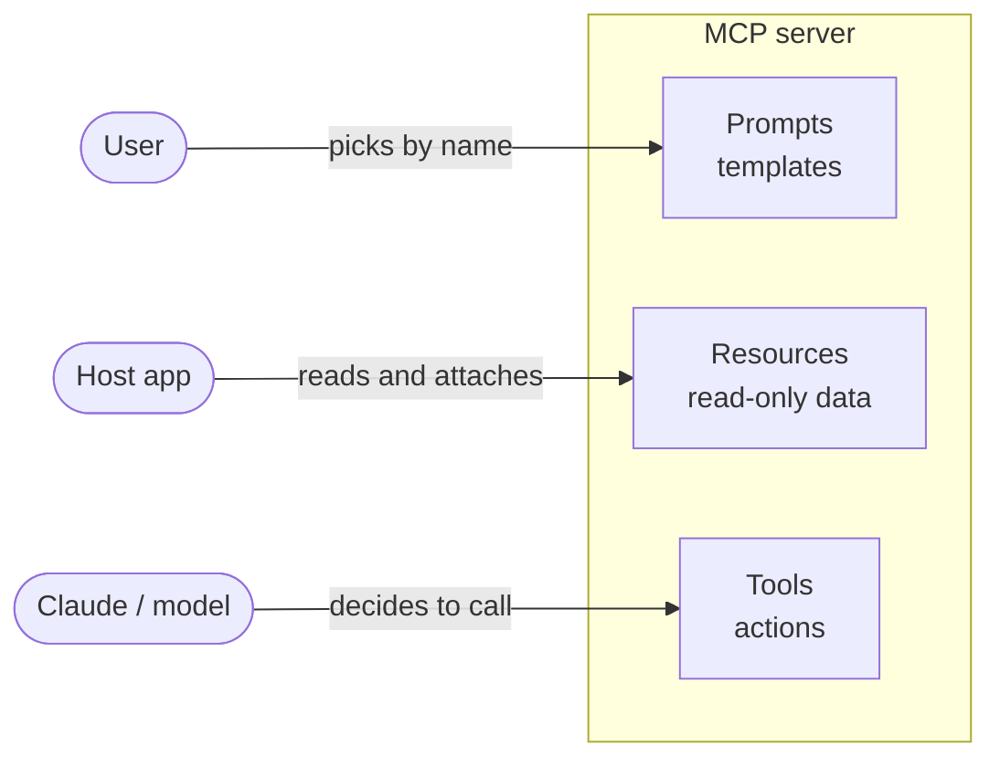
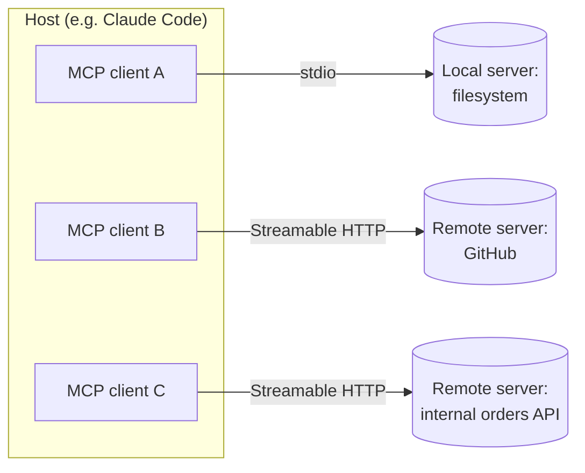
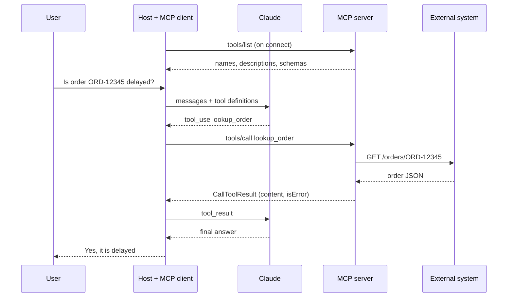
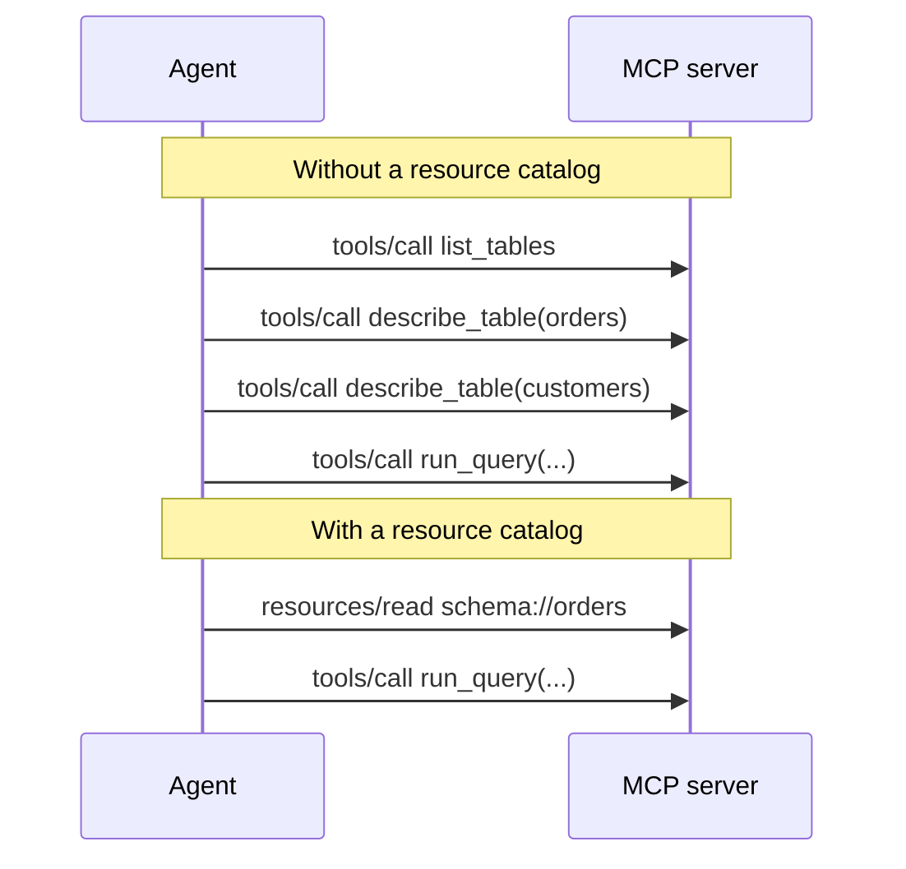

# Chapter 4 — Model Context Protocol (MCP)

> **Exam domain(s):** Domain 2 — Tool Design & MCP Integration (**18%**, primary) · Domain 3 — Claude Code Configuration & Workflows (20%, `.mcp.json` and scopes) · Domain 1 — Agentic Architecture & Orchestration (27%, MCP inside agents) · Domain 5 — Context Management & Reliability (15%, error propagation)
> **Est. time:** 6–8 hours (reading + notebooks) · **Status:** [ ] not started

## Why this matters for a solution architect

Every real Claude deployment ends up talking to systems you did not build: ticketing, CRMs, databases, code hosts. MCP is the standard plug that lets you write that integration **once** and reuse it in Claude Code, the Agent SDK, Claude Desktop, the Messages API, and other vendors' clients. The architect's job is not "can we connect it?" but "which primitive (tool, resource, or prompt), which transport (local or remote), which configuration scope (personal or team), and what error contract?". Getting those four choices right decides whether the agent is reliable, secure, and cheap to run.

## Learning objectives

- [ ] Explain what MCP is, which problem it solves, and how hosts, clients, and servers relate.
- [ ] Distinguish the three server primitives (**tools**, **resources**, **prompts**) by *who controls them* and pick the right one for a given need.
- [ ] Choose between the **stdio** and **Streamable HTTP** transports and explain why HTTP+SSE is deprecated.
- [ ] Configure MCP servers in Claude Code with the correct **scope** (local, project, user) and keep secrets out of git with **environment variable expansion**.
- [ ] Return **structured errors** with `isError: true`, an error category, and a retry hint, and tell a failure apart from a valid empty result.
- [ ] Use **resources** as content catalogs to cut exploratory tool calls.
- [ ] Build and test a small MCP server in Python with the official MCP Python SDK (`MCPServer`, formerly `FastMCP`): tools with `Field` argument descriptions, direct and templated resources with MIME types, prompts, and argument completion; debug it with the MCP Inspector.
- [ ] Connect MCP tools to Claude from the Messages API, the Agent SDK, and Claude Code.

## Prerequisites

- [00-prerequisites](../../00-prerequisites/README.md) — Python environment, `.env` with `ANTHROPIC_API_KEY`, Jupyter, basic async/await.
- [Chapter 2 — Tool use](../02-tool-use/README.md) — tool definitions, `tool_use` / `tool_result` blocks, why descriptions drive tool selection. MCP tools are those same tools, delivered by a server.
- [Chapter 3 — Agent SDK](../03-agent-sdk/README.md) — the agent loop, `allowed_tools`, hooks (you will reuse `PostToolUse` here).
- Node.js 22.19+ (only for the MCP Inspector, `npx @modelcontextprotocol/inspector`; some community servers also need Node).

Install for this chapter (already covered by the root [`requirements.txt`](../../requirements.txt)):

```bash
pip install "mcp>=2.3" anthropic claude-agent-sdk python-dotenv
```

> **Note: changed since the guide.** The source guide predates two big shifts. (1) The MCP specification revision **2026-07-28** made the protocol stateless (no `initialize` handshake, no `Mcp-Session-Id`), and formally deprecated HTTP+SSE, Roots, Sampling, and Logging. (2) The official MCP Python SDK **v2** renamed the high-level server class `FastMCP` to **`MCPServer`** (`from mcp.server import MCPServer`). Old tutorials that use `from mcp.server.fastmcp import FastMCP` no longer run on `mcp>=2.0` (the module path is now `mcp.server.mcpserver`). The separate third-party package also called `fastmcp` (PyPI `fastmcp`) is a different project; this repo uses the official `mcp` package.

---

## Concepts

### 4.1 What MCP is

**The problem.** Before MCP, every AI application wrote its own adapter for every system: N apps × M systems = N×M integrations, each with its own auth, schemas, and bugs. MCP turns that into N + M: each system ships one **MCP server**, each AI application embeds one **MCP client**, and they speak the same JSON-RPC protocol.

A useful mental model is "USB-C for AI applications": the protocol does not care whether the thing on the other end is GitHub, Postgres, or your internal pricing service, as long as it speaks MCP.

**The three server primitives.** An MCP server can expose three kinds of things. The cleanest way to tell them apart is to ask *who decides to use it*:

| Primitive | Controlled by | What it is | Typical examples | Side effects? |
|---|---|---|---|---|
| **Tool** | **The model** — Claude decides to call it | A function with a JSON input schema | `lookup_order`, `create_issue`, `run_query` | May have side effects |
| **Resource** | **The application / user** — the host decides to read and attach it | Read-only data addressed by a URI | `schema://orders`, `docs://api/auth`, `tickets://open` | No (read-only) |
| **Prompt** | **The user** — a person picks it by name | A reusable, parameterized message template | `/review-pr`, `/summarize-incident` | No |



> **Exam trap:** "Resources" in MCP does not mean "anything the server provides". It is one specific primitive: read-only, URI-addressed context. If an option says "expose the database schema as a *tool* the agent must call to discover tables" versus "expose it as a *resource*", the resource is usually the better answer because it removes exploratory calls (see 4.5).

The first runnable example, a server with one of each primitive, using the official SDK:

```python
# server.py
from mcp.server import MCPServer

mcp = MCPServer("Bookshop", instructions="Search the catalog before recommending a book.")

BOOKS = {"978-0441172719": {"title": "Dune", "author": "Frank Herbert"}}


@mcp.tool()
def search_books(query: str) -> list[dict]:
    """Search the bookshop catalog by title or author.

    Use this when the user asks whether a book is in stock or who wrote it.
    Input: a free-text query such as "Herbert" or "Dune".
    Returns: a list of {isbn, title, author}; an empty list means no match.
    """
    q = query.lower()
    return [
        {"isbn": isbn, **b}
        for isbn, b in BOOKS.items()
        if q in b["title"].lower() or q in b["author"].lower()
    ]


@mcp.resource("books://{isbn}")
def get_book(isbn: str) -> dict:
    """A single book record, addressed by ISBN."""
    return BOOKS[isbn]


@mcp.prompt()
def recommend(genre: str) -> str:
    """Ask for three recommendations in a genre."""
    return f"Recommend three {genre} books from our catalog. Search before answering."


if __name__ == "__main__":
    mcp.run()  # stdio by default
```

Note the decorators are factories: `@mcp.tool()` with parentheses. Forgetting them raises a `TypeError` at import time. The docstring becomes the tool description that Claude reads, so it deserves the same care as a hand-written tool definition from [Chapter 2](../02-tool-use/README.md).

**Describing each argument with `Field`.** The SDK builds `inputSchema` from the type hints, so you never write JSON schema by hand. To give an argument its own description, wrap the hint in `Annotated[..., Field(description=...)]` (pydantic). The text lands in that property of the schema, right where Claude looks when it fills in the call:

```python
from typing import Annotated

from pydantic import Field
from mcp.server import MCPServer
from mcp.server.mcpserver.exceptions import ToolError

mcp = MCPServer("DocumentMCP")
DOCS = {"plan.md": "Q4 plan. Hire two support engineers."}


@mcp.tool()
def edit_document(
    doc_id: Annotated[str, Field(description="Id of the document to edit, for example 'plan.md'.")],
    old_str: Annotated[str, Field(description="Exact text to replace, including whitespace.")],
    new_str: Annotated[str, Field(description="Text that replaces old_str.")],
) -> str:
    """Replace one exact occurrence of old_str with new_str and return the updated document."""
    if old_str not in DOCS.get(doc_id, ""):
        raise ToolError("old_str was not found. Read the document first and copy the exact text.")
    DOCS[doc_id] = DOCS[doc_id].replace(old_str, new_str, 1)
    return DOCS[doc_id]
```

Arguments without a default are `required`, and the `ToolError` message tells the model how to fix its next call (section 4.4).

### 4.2 MCP servers, clients, and transports

**Roles.**

- **Host** — the AI application the user interacts with (Claude Code, Claude Desktop, your Agent SDK app).
- **Client** — a connector inside the host. A host creates **one client per server** it connects to.
- **Server** — a program that exposes tools, resources, and prompts. It can be a local process or a remote web service.



**What happens on connection.** The client asks each server for its lists (`tools/list`, `resources/list`, `prompts/list`). Three consequences matter for design:

1. **Discovery is automatic.** You do not hand-write tool definitions for MCP tools; the host gets the names, descriptions, and JSON schemas from the server.
2. **All tools from all connected servers are available at once.** Connect five servers with ten tools each and the model sees fifty tools. Chapter 2 showed that selection reliability drops as the tool count grows, so connect only what the agent's role needs, restrict with `allowed_tools`, and rely on tool search when the catalog is large (Claude Code enables MCP tool search by default).
3. **The server's descriptions decide behavior.** A vague third-party description will cause misrouting, and you may not be able to edit it. That is a selection criterion when you choose a server.

> **Exam trap:** When an agent keeps using a built-in tool (for example `Grep`) instead of a more capable MCP tool with overlapping purpose, the fix is to strengthen the MCP tool's **description** (say what unique data or capability it offers), not to remove the built-in tool or add a routing classifier.

**One request, end to end.** The model never talks to the MCP server. The host sits in the middle and translates:



Both the tool definitions and their execution live in the server; your application only relays. That is the work MCP moves out of your code: you no longer write a schema and an implementation for every external API.

**Transports.** A transport is how JSON-RPC messages travel between client and server. The protocol semantics are identical on every transport. Every message is one of three kinds: a **request** (has an `id` and expects a reply, for example `tools/call` or `resources/read`), a **response** to that `id` (a `result` or an `error`), or a **notification** (no `id`, no reply, for example `notifications/tools/list_changed`, which in revision 2026-07-28 a server sends on a `subscriptions/listen` stream the client opened). The current specification defines two standard transports:

| Transport | How it works | Use when | Watch out for |
|---|---|---|---|
| **stdio** | The client launches the server as a subprocess and exchanges newline-delimited JSON-RPC over stdin/stdout. | Local tools, developer machines, anything that needs local files or local credentials. | Only one user (the one who launched it). Never `print()` to stdout inside a stdio server: stdout is the protocol channel. Log to stderr. (Python SDK v2.3 diverts a tool's `print()` to stderr while serving, but anything printed before `mcp.run()` still corrupts the stream, and other SDKs do not protect you.) |
| **Streamable HTTP** | Each message is an HTTP POST to a single MCP endpoint (for example `/mcp`); the reply is a JSON object or a request-scoped SSE stream. | Shared, remote, multi-user servers; SaaS integrations; anything called from the Messages API MCP connector. | Needs auth (OAuth or bearer tokens), TLS, and normal web-service operations. |
| ~~HTTP+SSE~~ | The older two-endpoint design. | Only for legacy servers. | **Deprecated** since protocol `2025-03-26`, formally scheduled for removal. Migrate to Streamable HTTP. |

> **Note: changed since the guide.** In MCP `2026-07-28` the protocol is **stateless**: there is no `initialize` handshake and no protocol-level session. Every request carries its protocol version and client capabilities in `_meta`, and a new `server/discover` call advertises what a server supports. Servers that need state across calls now pass explicit handles as ordinary tool arguments. Server-initiated requests (sampling, elicitation, roots) were replaced by a *multi round-trip* pattern: the server answers a request (for example a tool call) with an interim result marked `resultType: "input_required"`, and the client retries the original request with the requested input. Every ordinary result now carries `resultType: "complete"`. Roots, Sampling, and Logging are deprecated. SDK v2 speaks both `2025-11-25` and `2026-07-28`, so older clients still work.

Running the same server on each transport with SDK v2 (transport options now go to `run()`, not to the constructor):

```python
mcp.run()                                   # stdio (default)
mcp.run(transport="streamable-http", host="127.0.0.1", port=8000)  # serves http://127.0.0.1:8000/mcp
```

Connecting from Python with the v2 `Client` (it replaces the old `ClientSession` + transport-context nesting):

```python
from mcp import Client, StdioServerParameters

# 1) In-memory: pass the server object itself. Ideal for notebooks and tests.
from server import mcp
async with Client(mcp) as client:
    tools = await client.list_tools()
    print([t.name for t in tools.tools])

# 2) stdio: the client starts the server as a subprocess.
params = StdioServerParameters(command="python", args=["server.py"])
async with Client(params) as client:
    result = await client.call_tool("search_books", {"query": "Herbert"})
    print(result.is_error, result.structured_content)

# 3) Streamable HTTP: pass the endpoint URL.
async with Client("http://127.0.0.1:8000/mcp") as client:
    print(client.server_info, client.protocol_version)
```

Jupyter already runs an event loop, so `async with` works at the top level of a notebook cell. In a plain script, wrap it in `async def main()` and `asyncio.run(main())`.

**A stdio server does not inherit your whole environment.** The Python SDK's stdio client starts the server with only a small safe list of variables (`HOME`, `LOGNAME`, `PATH`, `SHELL`, `TERM`, `USER` on macOS and Linux; a similar list on Windows) merged with whatever you pass in `env`. Your `ANTHROPIC_API_KEY` and cloud credentials therefore do not leak into every server you launch, but the server's own secret must be passed on purpose:

```python
params = StdioServerParameters(
    command="python", args=["crm_server.py"],
    env={"CRM_TOKEN": os.environ["CRM_TOKEN"]},   # without this the server cannot see CRM_TOKEN
)
```

The `env` field of an `.mcp.json` entry (4.3) and of an Agent SDK server config plays the same role. Other hosts may pass a different set of variables, so never rely on implicit inheritance for credentials.

> **Note: changed since the guide.** SDK v2 renamed Python attributes from camelCase to snake_case: `result.is_error`, `tool.input_schema`, `result.structured_content`. The JSON on the wire still uses `isError`, `inputSchema`, `structuredContent`.

**Testing a server with the MCP Inspector.** Before you wire a server into Claude, open it in the **MCP Inspector**, the reference debugging client. It starts your server, lists its tools, resources, and prompts, lets you call each one from a form, and shows the raw JSON-RPC traffic. It needs Node.js 22.19 or newer and runs through `npx`:

```bash
npx @modelcontextprotocol/inspector python server.py         # web UI: prints a URL with a one-time token
npx @modelcontextprotocol/inspector --cli python server.py --method tools/list   # scriptable, good for CI
npx @modelcontextprotocol/inspector --tui python server.py   # terminal UI
npx @modelcontextprotocol/inspector --server-url http://127.0.0.1:8000/mcp --transport http   # a running HTTP server
mcp dev server.py   # Python SDK shortcut for the web UI (needs pip install "mcp[cli]" and uv)
```

Typical checks: every tool and argument has a clear description, error paths return `isError` results with a useful message, resources are listed with the right MIME type, and nothing but JSON-RPC appears on stdout.

**Build or reuse?** For standard systems (GitHub, Jira, Slack, Postgres, Sentry) prefer an existing, well-maintained server, ideally the vendor's official one. Build your own only for workflows that are unique to your team or when you need a narrower, safer surface than the generic server offers (for example `get_refund_eligibility` instead of raw SQL).

### 4.3 Configuring MCP servers

This section is about **Claude Code** (Chapter 5 goes deeper on Claude Code itself). The Agent SDK accepts the same server shapes in code; see 4.6.

**Scopes.** Claude Code stores each server in one of three scopes:

| Scope | Stored in | Shared with team? | Loads in | Use for |
|---|---|---|---|---|
| **local** (default) | `~/.claude.json`, under the current project's entry | No | This project only | Personal experiments in one repo; servers holding personal credentials |
| **project** | `.mcp.json` at the repo root, committed to git | **Yes** | This project, for everyone who clones it | Team-standard tooling |
| **user** | `~/.claude.json`, top level | No | All your projects | Your personal everyday servers |

When the same server is defined in several places, the most specific wins: **local > project > user** (then plugin-provided servers, then claude.ai connectors). The whole entry from the winning scope is used; fields are not merged. One exception sits above all of these: a server your organization provides through the `managedMcpServers` managed setting always wins over a duplicate.

> **Note: changed since the guide.** The guide describes only two places: `.mcp.json` (team) and `~/.claude.json` ("user configuration"). Current Claude Code has **three** scopes, and `~/.claude.json` holds two of them: *local* (per-project, the default for `claude mcp add`) and *user* (global). If an exam option says "add it at user scope" for something only one repo needs, *local* is the more precise answer today; the guide's teaching point (team config in `.mcp.json`, personal config outside git) is unchanged.

**Adding servers from the CLI:**

```bash
# Remote server over Streamable HTTP (recommended transport for remote servers).
# Note: your shell expands ${GITHUB_PAT} right now, so the literal token is stored
# in your private ~/.claude.json (local scope). Never do this with --scope project.
claude mcp add --transport http github https://api.githubcopilot.com/mcp/ \
  --header "Authorization: Bearer ${GITHUB_PAT}"

# Local stdio server. Everything after `--` is the server's own command line.
# Keep another option between --env and the server name, or the CLI reads the
# name as another KEY=value pair and rejects it.
claude mcp add --env ORDERS_DB_URL=postgres://localhost/orders --transport stdio \
  orders -- python servers/orders_server.py

# Share with the team: write it to .mcp.json instead of your private config
claude mcp add --scope project --transport http sentry https://mcp.sentry.dev/mcp

claude mcp list            # what is configured and whether it connects
claude mcp get github      # details for one server
claude mcp remove github
# inside a session: /mcp   (status, OAuth login, tools per server)
```

**Project configuration (`.mcp.json`) with environment variable expansion.** This is the file the exam cares most about. It lives at the repo root, it is committed, and it must never contain a secret:

```json
{
  "mcpServers": {
    "github": {
      "type": "http",
      "url": "https://api.githubcopilot.com/mcp/",
      "headers": {
        "Authorization": "Bearer ${GITHUB_PAT}"
      }
    },
    "orders": {
      "type": "stdio",
      "command": "python",
      "args": ["${CLAUDE_PROJECT_DIR:-.}/servers/orders_server.py"],
      "env": {
        "ORDERS_DB_URL": "${ORDERS_DB_URL:-postgres://localhost:5432/orders_dev}"
      }
    }
  }
}
```

- `${VAR}` is replaced with the developer's environment variable at load time. If it is unset and has no default, the server still loads with the literal `${VAR}` text, and Claude Code shows a missing-variable warning in `claude mcp list` and `/mcp`.
- `${VAR:-default}` falls back to a default (handy for non-secret settings such as a local DB URL).
- Expansion works in `command`, `args`, `env`, `url`, and `headers`.
- `CLAUDE_PROJECT_DIR` is set in the *server's* environment, not in Claude Code's own, so in a project or local entry you must write it with a default, `${CLAUDE_PROJECT_DIR:-.}`, as above. (Only plugin-provided configs substitute a bare `${CLAUDE_PROJECT_DIR}`.)
- `type` is `"stdio"`, `"http"` (alias `"streamable-http"`), `"sse"` (deprecated), or `"ws"`. An entry with a `url` but no `type` is read as stdio and fails, so always set `type` for remote servers.
- Each developer supplies their **own** token through their shell or a secrets manager; the README documents which variables are required.
- For safety, Claude Code asks each developer to **approve** project-scoped servers the first time it sees them in an interactive session (`claude mcp reset-project-choices` resets that). Headless runs (`claude -p`, the Agent SDK) load them without prompting, so review `.mcp.json` changes in code review like any other code.
- A few credential variables (for example `ANTHROPIC_API_KEY`, `ANTHROPIC_AUTH_TOKEN`, `AWS_BEARER_TOKEN_BEDROCK`) are deliberately **not** expanded into remote `url`/`headers`: they read as empty (a `:-default` is ignored), to avoid leaking your Claude or cloud credentials to a third-party server. Use a dedicated variable name for each service.

> **Exam trap:** Six developers each have a personal GitHub token and you want identical tooling for all of them. The idiomatic answer is a project `.mcp.json` with `${GITHUB_PAT}` expansion plus a README note on the required variable. Wrong answers include: everyone adding it at user scope (no single source of truth), committing a placeholder token that people override (fragile, secrets drift into git), or writing a custom proxy server just to read a `.env` file (needless engineering).

**Using MCP inside Claude Code.** Once connected:

- **Tools** appear as `mcp__<server>__<tool>` (for example `mcp__github__create_issue`). The same naming is used in permission rules and in `allowed_tools`.
- **Resources** can be attached with an `@` mention: `@<server>:<protocol>://<path>`, for example `Compare @postgres:schema://users with @docs:file://database/user-model`.
- **Prompts** become slash commands. The `/` menu lists them as `/<server>:<prompt> (MCP)`, and typing `/mcp__<server>__<prompt>` also runs them, for example `/mcp__github__pr_review 456`.
- Large outputs are capped (warning at 10,000 tokens, default limit 25,000; raise the limit with `MAX_MCP_OUTPUT_TOKENS`, the warning threshold is fixed). Design tools to return focused results instead of whole tables.

### 4.4 The `isError` flag and structured errors

**Two kinds of failure.** MCP separates *protocol* errors from *tool* errors:

| Failure | How it is reported | Who sees it |
|---|---|---|
| Unknown tool, malformed request (fails the `tools/call` schema), server-level errors | JSON-RPC error response (e.g. code `-32602`, `-32603`) | The client/host; the model usually does not |
| The tool ran but the operation failed (timeout, bad input, policy refusal, permission) | A normal result with **`isError: true`** and a message in `content` | **The model**, which can then decide what to do |

That table is the specification (revision 2026-07-28). It files argument values that fail validation (a date in the wrong format, a value out of range) under tool execution errors, so the model can correct itself. Implementations differ at the edges: the Python SDK v2 `MCPServer` reports an **unknown tool name** as an `isError: true` result (`Unknown tool: <name>`) rather than a JSON-RPC error, and does the same for arguments that fail the input schema. A robust host handles both paths: catch JSON-RPC errors raised by `call_tool`, and pass `isError` results back to the model.

The point of `isError` is to keep the failure **inside the conversation**, so Claude can retry, fix its arguments, ask the user, or escalate. A tool error that says only "Operation failed" wastes that opportunity: the agent cannot tell whether retrying will help.

**What a good error contains.** Borrowing the error taxonomy from Domain 2:

| `errorCategory` | Example | `isRetryable` | What the agent should do |
|---|---|---|---|
| `transient` | Upstream timeout, 503 | `true` | Retry (bounded, with backoff) |
| `validation` | Order ID has the wrong format | `false` (until input is fixed) | Correct the arguments and call again |
| `business` | Refund exceeds policy limit | `false` | Explain to the user; offer escalation |
| `permission` | Token lacks scope for this repo | `false` | Escalate or ask for access; do not loop |

Plus a human-readable `message`, and where useful the attempted query and any partial results.

> **Note: changed since the guide.** The guide's example puts a JSON object directly in `content`. Per the MCP spec, `content` is always an **array of content blocks** (`[{"type": "text", "text": ...}]`). Put the structured error inside a text block (serialized JSON) and, optionally, also in `structuredContent`:
>
> ```json
> {
>   "isError": true,
>   "content": [
>     {"type": "text", "text": "{\"errorCategory\": \"transient\", \"isRetryable\": true, \"message\": \"Orders API timed out after 5s.\", \"attemptedQuery\": \"order_id=12345\"}"}
>   ],
>   "structuredContent": {"errorCategory": "transient", "isRetryable": true, "message": "Orders API timed out after 5s.", "attemptedQuery": "order_id=12345"}
> }
> ```

**How SDK v2 produces `isError`.** Three paths, and they behave very differently:

1. **Raise `ToolError`** for failures you anticipated. The result has `is_error=True` and *your message* reaches the model, prefixed with the tool name (`Error executing tool lookup_order: order_id must look like ...`). The server logs it at INFO without a traceback.
2. **Any other exception** is treated as a crash. It still comes back as an `is_error=True` result (not a JSON-RPC error), but the model sees only a generic `Error executing tool <name>` and the traceback goes to the server log at ERROR. This is effectively the "Operation failed" anti-pattern, so do not let expected failures escape as bare exceptions.
3. **Return a `CallToolResult` yourself** when you want full control, for example a machine-readable error payload. Annotate the return type as plain `-> CallToolResult` (the SDK rejects it inside a `Union`/`Optional`).

A fourth option, raising `MCPError` (`from mcp import MCPError`), produces a JSON-RPC protocol error that the model never sees. Reserve it for requests that no better arguments could fix.

> **Note: changed since the guide.** In SDK v1, raising any exception (e.g. `ValueError("...")`) put your message in front of the model. In v2 only `ToolError` does; other exceptions are sanitized. Update old code accordingly.

```python
import json

from mcp.server import MCPServer
from mcp.server.mcpserver.exceptions import ToolError
from mcp.types import CallToolResult, TextContent

mcp = MCPServer("Orders")


def tool_error(category: str, message: str, retryable: bool, **extra) -> CallToolResult:
    """Build an isError result that the model can reason about."""
    payload = {"errorCategory": category, "isRetryable": retryable, "message": message, **extra}
    return CallToolResult(
        content=[TextContent(type="text", text=json.dumps(payload))],
        structured_content=payload,
        is_error=True,
    )


@mcp.tool()
async def lookup_order(order_id: str) -> CallToolResult:
    """Fetch one order by ID (format: ORD-12345). Returns status, items and total."""
    if not order_id.startswith("ORD-"):
        # Simple, model-fixable mistake: ToolError is enough.
        raise ToolError("order_id must look like 'ORD-12345'.")
    try:
        order = await orders_api.get(order_id)  # your client
    except TimeoutError:
        return tool_error("transient", "Orders API timed out after 5s.", True,
                          attemptedQuery=f"order_id={order_id}")
    except PermissionError:
        return tool_error("permission", "Service account cannot read this region's orders.", False)
    if order is None:
        # NOT an error: the lookup worked and found nothing.
        return CallToolResult(content=[TextContent(type="text", text=f"No order {order_id} exists.")])
    return CallToolResult(
        content=[TextContent(type="text", text=json.dumps(order))],
        structured_content=order,
    )
```

> **Exam trap:** "No matching records" is a **successful** call with an empty result, not an error. If you flag it with `isError`, the agent may retry pointlessly or tell the user the system is down. If you report a timeout as an empty result, the agent will confidently tell the user "you have no orders". Keep the two apart.

**Where to recover.** In multi-agent systems ([Chapter 10](../10-multi-agent-error-handling/README.md)), a subagent should handle `transient` errors locally with one or two bounded retries, and propagate to the coordinator only what it cannot resolve, together with the category and any partial results. Never loop on `isRetryable: false`.

> **Exam trap:** When third-party MCP servers return inconsistent formats (Unix timestamps from one tool, ISO 8601 from another, numeric status codes) and you cannot change those servers, the most maintainable fix is a **`PostToolUse` hook** that normalizes every tool result deterministically before the model sees it, not a longer system prompt and not an extra `normalize_data` tool the model has to remember to call.

### 4.5 Resources: give the agent a map

A resource is read-only context addressed by a URI. Think of it as what the agent should *know* before it starts *doing*:

- **Content catalogs** — list of projects, open tickets, a category tree.
- **Schemas** — database tables and columns, API object shapes.
- **Documentation** — API references, runbooks, internal policies.
- **Summaries** — a digest of an issue, a customer's account overview.

**Why it helps.** Without a catalog, an agent explores: `list_tables` → `describe_table` × N → `sample_rows` → finally the real query. Each step is a model turn (latency, tokens, chances to go wrong). A `schema://orders` resource attached up front replaces that whole exploration with one read.



**Static resources and URI templates** with SDK v2. Templates follow RFC 6570; function parameters must match the template variables and are type-converted:

```python
from mcp.server import MCPServer

mcp = MCPServer("Warehouse")


@mcp.resource("schema://tables")
def list_tables() -> str:
    """Catalog of every table with a one-line purpose. Read this before writing SQL."""
    return "orders: one row per order\ncustomers: one row per customer\nrefunds: one row per refund"


@mcp.resource("schema://tables/{table}")
def describe_table(table: str) -> dict[str, str]:
    """Columns and types for one table."""
    return SCHEMAS[table]


@mcp.resource("tickets://{project}{?status,limit}")
def tickets(project: str, status: str = "open", limit: int = 20) -> str:
    """Ticket summaries for a project, filtered by status."""
    return summarize(project, status, limit)
```

Reading them from a client:

```python
async with Client(mcp) as client:
    templates = await client.list_resource_templates()
    catalog = await client.read_resource("schema://tables")
    print(catalog.contents[0].text)
```

#### Resource templates, MIME types and argument completion

**Direct vs templated resources.** A *direct* resource has a fixed URI (`docs://documents`) and appears in `resources/list`. A *templated* resource has parameters (`docs://documents/{doc_id}`), appears in `resources/templates/list`, and the client reads a concrete URI (`docs://documents/plan.md`). SDK v2 supports the useful RFC 6570 operators:

| Template | Matches | Parameter value |
|---|---|---|
| `docs://documents/{doc_id}` | `docs://documents/plan.md` | one path segment: `"plan.md"` |
| `manuals://{+path}` | `manuals://hr/leave.md` | several segments: `"hr/leave.md"` |
| `tickets://{project}{?status,limit}` | `tickets://web?status=closed&limit=5` | query values, converted to the annotated types (`limit` arrives as `int`); omitted ones take the Python default |

Two details matter in production. First, the SDK rejects template values that look like path traversal (`..`), absolute paths, or null bytes **before** your handler runs; the client gets the same `-32602` "Unknown resource" error as for a URI that matches nothing. For real filesystem access, still resolve paths with `mcp.shared.path_security.safe_join`. Second, when an id does not exist, raise `ResourceNotFoundError` (from `mcp.server.mcpserver.exceptions`): the client gets `-32602` with your message, while any other exception becomes a generic `-32603`. Resource reads are protocol requests, so their failures are JSON-RPC errors, never `isError` results.

**MIME types.** What you return decides the content type on the wire: a `str` becomes text, `bytes` becomes a base64 `blob`, and anything else (dict, list, pydantic model) becomes **JSON text**. The `mime_type` is only a label you declare. It defaults to `text/plain` and the SDK never guesses it, so a dict you do not label is advertised as plain text. Label every resource, and decode on the client by the label:

```python
import base64
import json

from mcp.server import MCPServer
from mcp.server.mcpserver.exceptions import ResourceNotFoundError
from mcp.types import BlobResourceContents

mcp = MCPServer("DocumentMCP")
DOCS = {"plan.md": "Q4 plan...", "report.pdf": "Q3 revenue grew 12%..."}


@mcp.resource("docs://documents", mime_type="application/json")
def list_documents() -> list[str]:
    """Ids of every document in the store."""
    return sorted(DOCS)


@mcp.resource("docs://documents/{doc_id}", mime_type="text/plain")
def fetch_document(doc_id: str) -> str:
    """The full text of one document."""
    if doc_id not in DOCS:
        raise ResourceNotFoundError(f"No document {doc_id!r}.")
    return DOCS[doc_id]


@mcp.resource("docs://logo", mime_type="image/png")
def logo() -> bytes:
    """The team logo."""
    return LOGO_PNG


async def read_as(session, uri: str):
    """Client side: decode one resource read by its type and MIME label."""
    item = (await session.read_resource(uri)).contents[0]
    if isinstance(item, BlobResourceContents):
        return base64.b64decode(item.blob)          # binary
    if item.mime_type == "application/json":
        return json.loads(item.text)                 # structured data
    return item.text                                 # plain text, Markdown, ...
```

**Argument completion.** A host UI can autocomplete arguments while the user types, for example document ids after `@` or the argument of a prompt picked from a slash menu. Completion applies to exactly two things: **prompt arguments** and **resource-template parameters**. One handler per server serves both, and registering it is what makes the server advertise the `completions` capability (without it, a `completion/complete` request fails with "Method not found"):

```python
from mcp.types import (Completion, CompletionArgument, CompletionContext,
                       PromptReference, ResourceTemplateReference)


@mcp.completion()
async def complete(ref: PromptReference | ResourceTemplateReference,
                   argument: CompletionArgument, context: CompletionContext | None) -> Completion | None:
    if argument.name == "doc_id":
        ids = [d for d in sorted(DOCS) if d.startswith(argument.value)]   # the SDK does not filter for you
        return Completion(values=ids[:100], total=len(ids), has_more=len(ids) > 100)
    return None                                                            # None -> empty list, not an error


# client side
result = await session.complete(ResourceTemplateReference(uri="docs://documents/{doc_id}"),
                                {"name": "doc_id", "value": "pl"})
print(result.completion.values)   # ['plan.md']
```

For dependent arguments (a `repo` list that depends on the chosen `owner`), the client sends the values chosen so far with `context_arguments=...`, and the handler reads them from `context.arguments`.

#### Prompts in the client and context injection

A prompt is a pre-written, high-quality instruction for a workflow your users repeat (format a document, triage an incident, review a PR). It can return several messages, and its arguments take `Field` descriptions and completions like any other:

```python
from typing import Annotated

from pydantic import Field
from mcp.server.mcpserver import Message, UserMessage


@mcp.prompt()
def format_document(doc_id: Annotated[str, Field(description="Id of the document to reformat.")]) -> list[Message]:
    """Rewrite a document in clean Markdown without changing its meaning."""
    return [
        UserMessage(f"Reformat the document <document_id>{doc_id}</document_id> as Markdown."),
        UserMessage("Read it with read_document, keep every fact, save it with edit_document, "
                    "then reply with a one-line summary."),
    ]
```

The host uses it in two steps: `prompts/get` with the user's arguments, then it sends the returned messages to Claude as the conversation (merging consecutive messages with the same role into one turn). **Context injection** is the companion pattern for resources: when the user writes `@plan.md`, the host reads `docs://documents/plan.md` and adds the text to the user turn, so Claude starts with the document instead of spending a tool call to fetch it. Claude Code does the same with `@server:uri` mentions (4.3).

**Choosing the primitive.** A quick rule of thumb:

| Need | Primitive |
|---|---|
| The model must *do* something or fetch something that depends on its reasoning (search with a query it chose, create, update) | **Tool** |
| The agent needs stable background context it should have *before* reasoning (schemas, catalogs, docs) | **Resource** |
| A human repeatedly kicks off the same workflow with a few parameters | **Prompt** |

Be aware of client support: Claude Code supports all three (resources via `@` mentions plus built-in list/read tools; prompts as slash commands), while the Messages API MCP connector (4.6) supports **tools only**. If a capability must work through the connector, expose it as a read-only tool as well.

> **Exam trap:** Tool annotations such as `read_only_hint=True` or `destructive_hint=True` (`from mcp.types import ToolAnnotations`) are **hints** for the client UI and permission prompts. They are not a security boundary. Enforce real limits (for example "refunds above $500 require a human") in server code or in a hook, as covered in Chapter 3.

### 4.6 Beyond Claude Code: MCP from the Agent SDK and the Messages API

This subsection is not in the guide's Chapter 4, but exam scenarios 1 and 3 assume you can wire MCP into an agent, so it is included here.

**Option A — Claude Agent SDK.** The SDK is an MCP host. Pass server configs (same shape as `.mcp.json`) and pre-approve tools with the `mcp__<server>__<tool>` naming:

```python
from claude_agent_sdk import ClaudeAgentOptions, ResultMessage, query

options = ClaudeAgentOptions(
    mcp_servers={
        "orders": {"command": "python", "args": ["servers/orders_server.py"]},
        "docs": {"type": "http", "url": "https://code.claude.com/docs/mcp"},
    },
    allowed_tools=["mcp__orders__lookup_order", "mcp__docs__*"],  # least privilege
)

async for message in query(prompt="Where is order ORD-12345?", options=options):
    if isinstance(message, ResultMessage) and message.subtype == "success":
        print(message.result)
```

**Option B — Messages API MCP connector (beta).** Claude's API connects to a **remote** server for you, with no MCP client in your code:

```python
import anthropic
from dotenv import load_dotenv
import os

load_dotenv()
client = anthropic.Anthropic()

response = client.beta.messages.create(
    model="claude-sonnet-5-5",
    max_tokens=1024,
    messages=[{"role": "user", "content": "Which of my orders are delayed?"}],
    mcp_servers=[{
        "type": "url",
        "url": "https://orders.example.com/mcp",
        "name": "orders",
        "authorization_token": os.environ["ORDERS_MCP_TOKEN"],
    }],
    tools=[{
        "type": "mcp_toolset",
        "mcp_server_name": "orders",
        "default_config": {"enabled": False},          # allowlist pattern:
        "configs": {"lookup_order": {"enabled": True}}, # only this tool is exposed
    }],
    betas=["mcp-client-2025-11-20"],
)
```

The response contains `mcp_tool_use` and `mcp_tool_result` blocks (the latter carries `is_error`). Limits to remember: tools only (no resources or prompts), the server must be publicly reachable over HTTP (Streamable HTTP or SSE), and local stdio servers cannot be used. The connector is not available on Amazon Bedrock or Google Cloud.

> **Note:** `mcp-client-2025-11-20` is the connector's current beta header (the older `mcp-client-2025-04-04` is deprecated). A newer superset header, `mcp-client-2026-09-15`, adds pinning of a server's tool list so it cannot change mid-conversation; send it instead of the 2025-11-20 header if you need that.

**Option C — your own bridge.** When you need a local stdio server, full control of the loop, or a model-agnostic design, run an MCP `Client` yourself and translate MCP tools into regular Messages API tools. This is a direct reuse of the agent loop from Chapter 2:

```python
from anthropic import AsyncAnthropic
from dotenv import load_dotenv
from mcp import Client

from server import mcp  # or StdioServerParameters(...) / an HTTP URL

load_dotenv()
claude = AsyncAnthropic()

async with Client(mcp) as session:
    listing = await session.list_tools()
    tools = [
        {"name": t.name, "description": t.description or "", "input_schema": t.input_schema}
        for t in listing.tools
    ]
    messages = [{"role": "user", "content": "Do you have anything by Frank Herbert?"}]

    while True:
        resp = await claude.messages.create(
            model="claude-sonnet-5-5", max_tokens=1024, tools=tools, messages=messages
        )
        messages.append({"role": "assistant", "content": resp.content})
        if resp.stop_reason != "tool_use":
            break
        results = []
        for block in resp.content:
            if block.type == "tool_use":
                r = await session.call_tool(block.name, block.input)
                text = "\n".join(c.text for c in r.content if c.type == "text")
                results.append({
                    "type": "tool_result",
                    "tool_use_id": block.id,
                    "content": text,
                    "is_error": r.is_error,   # MCP isError -> Messages API is_error
                })
        messages.append({"role": "user", "content": results})

print(resp.content[-1].text)
```

#### Option C, shortcut: the Anthropic SDK's MCP helpers

The two translations above (MCP tool → Claude tool, `CallToolResult` → `tool_result`) are packaged in the Anthropic SDK as **client-side MCP helpers**. Install them with `pip install "anthropic[mcp]"` (the extra only adds the `mcp` package). The Python names are:

| Helper | Converts | Into |
|---|---|---|
| `async_mcp_tool(tool, session)` (`mcp_tool` in sync code) | One MCP tool plus your client session | A runnable tool for the SDK's tool runner, which calls the MCP server for you |
| `mcp_message(message)` | A message from `prompts/get` | A Messages API message |
| `mcp_resource_to_content(result)` | A `resources/read` result | A content block: `text/*` and PDF become `document`, PNG/JPEG/GIF/WebP become `image` |
| `mcp_resource_to_file(result)` | A `resources/read` result | A `(filename, bytes, mime_type)` tuple for the Files API |

```python
from anthropic import AsyncAnthropic
from anthropic.lib.tools.mcp import async_mcp_tool, mcp_resource_to_content
from mcp import Client

claude = AsyncAnthropic()

async with Client(mcp) as session:   # in-memory, stdio params, or an HTTP URL
    tools = [async_mcp_tool(t, session) for t in (await session.list_tools()).tools]
    runner = claude.beta.messages.tool_runner(
        model="claude-sonnet-5-5", max_tokens=1024, tools=tools,
        messages=[{"role": "user", "content": "Do you have anything by Frank Herbert?"}],
    )
    final = await runner.until_done()
```

Three behaviors to know (checked offline with `anthropic` 1.11 and `mcp` 2.3):

- An MCP result with `isError: true` makes the tool's `call()` raise anthropic's `ToolError`. The runner turns that into a `tool_result` with `is_error: true` and the server's content unchanged, so a structured error payload (4.4) still reaches Claude.
- `mcp_resource_to_content` raises `UnsupportedMCPValueError` for MIME types Claude cannot take as a block, including `application/json`. Convert JSON resources to a `text` block yourself, or upload them with `mcp_resource_to_file` and the Files API. The same error covers unsupported content types and unresolved resource links.
- The helpers are typed for the v1 `ClientSession`, but they only call `call_tool`, so the v2 `Client` works.

Choose the helpers when you need local stdio servers, resources, or prompts. Choose the connector (option B) when a remote server's tools are all you need.

---

## Notebooks

| Notebook | What it covers | What you build |
|---|---|---|
| [`01_practice.ipynb`](01_practice.ipynb) | 4.1 primitives (Bookshop `MCPServer`: tool, resources, prompt; in-memory `Client`), `Field` argument descriptions (`DocumentMCP`) · 4.2 stdio, Streamable HTTP, low-level `ClientSession`, the stdout rule, what a stdio server inherits from the environment, an offline inventory plus the opt-in MCP Inspector CLI, one host with many clients · 4.3 generated `.mcp.json`, `${VAR}` expansion, config lint, scope precedence · 4.4 `ToolError` vs bare exception vs structured `CallToolResult`, empty vs failed, live retry/escalate loop · 4.5 resource catalog vs tools-only warehouse (live comparison); direct vs templated resources, MIME types (JSON, text, blob), `ResourceNotFoundError`, a multi-message prompt, one completion handler, prompts → messages, `@mention` context injection · 4.6 MCP → Messages API bridge, the SDK's `anthropic.lib.tools.mcp` helpers (offline), Agent SDK options, MCP connector request | Mini-project: an "orders" stdio MCP server with structured errors, a policy resource and a prompt, plus a client and a Claude support-agent loop (offline scripted run, then live) |
| [`02_homework.ipynb`](02_homework.ipynb) | Self-test: 12 scenario questions (auto-graded), 8 offline coding exercises with checkers, 1 architecture scenario with rubric, scorecard (pass mark 72%) | Namespaced tool definitions, a secret-free `.mcp.json`, a structured error helper, an empty-vs-failure CRM server, a `tool_result` converter, the bridge loop, a MIME-aware resource reader, and a completion handler |

Theory stays in this README; notebooks hold code. Run them from the repo root venv (see [../../00-prerequisites/README.md](../../00-prerequisites/README.md)).

## Architect decision cheat-sheet

| Situation | Choose | Over | Why |
|---|---|---|---|
| Standard SaaS integration (GitHub, Jira, Slack) | Official or well-maintained community MCP server | Writing your own | Less code to own; vendors track their API changes |
| Team-specific workflow or need a narrow, safe surface | Custom server with purpose-built tools | Generic "run any query" server | Fewer, clearer tools; policy enforced in code |
| Whole team needs the same server | Project scope, `.mcp.json` committed | User or local scope on each laptop | Single source of truth, reviewed in PRs |
| Credentials in shared config | `${VAR}` expansion, documented in README | Committed tokens or placeholder-and-override | Secrets stay out of git; each dev uses their own token |
| Trying a server just for yourself | Local scope (default) or user scope | `.mcp.json` | Does not affect teammates |
| Server needs local files or runs on the dev's machine | stdio | Streamable HTTP | Simple, no network exposure |
| Shared, multi-user, or called from the Messages API | Streamable HTTP | stdio, HTTP+SSE | Remote-capable; SSE is deprecated |
| Agent wastes turns discovering what data exists | Resource catalog (schemas, indexes) | More exploratory tools | One read replaces several calls |
| Model needs to act or query with its own parameters | Tool | Resource | Only tools are model-controlled |
| Tool failure | `isError: true` + category + `isRetryable` + message | Generic "Operation failed" or a raised exception | Agent can choose retry / fix / escalate |
| Query found nothing | Successful result, empty payload | `isError: true` | Not a failure; avoids pointless retries |
| Normalizing outputs from servers you cannot modify | `PostToolUse` hook | System prompt instructions | Deterministic and centralized |
| Many servers, many tools | Scope with `allowed_tools`, tool search | Exposing everything to every agent | Selection reliability falls as tool count grows |
| Want MCP in a Messages API app without running a client | MCP connector (beta, remote, tools only) | Custom bridge | Less code, if its limits fit |
| Need local stdio servers, resources, or prompts from a Messages API app | Your own MCP client + the SDK's `anthropic.lib.tools.mcp` helpers and tool runner | Hand-written conversion code | Supported conversions; `isError` maps to `is_error` for you |

## Common mistakes and anti-patterns

- **Committing secrets in `.mcp.json`.** Use `${VAR}` expansion and document the variables.
- **Using stdout for logs in a stdio server.** Any non-protocol byte on stdout corrupts the stream. Log to stderr.
- **Returning "Operation failed".** Or letting expected failures escape as bare exceptions, which SDK v2 turns into a generic message.
- **Marking empty results as errors** (or the reverse: hiding a timeout behind an empty list).
- **Connecting every server to every agent.** Fifty tools of which the agent needs four leads to misrouting and higher token cost.
- **Trusting tool annotations as security.** `read_only_hint` is a hint, not enforcement.
- **Choosing a server without reading its tool descriptions.** You inherit its descriptions, and with third-party servers you may not be able to change them.
- **Building a custom server for GitHub/Jira/Slack** without a concrete gap in the existing one.
- **Still writing new code on HTTP+SSE, `FastMCP` imports, or `ClientSession` boilerplate.** These come from older tutorials; current SDK v2 uses `MCPServer`, `Client`, and Streamable HTTP.
- **Expecting resources or prompts through the MCP connector.** It is tools only.
- **Retrying non-retryable errors in a loop.** Respect `isRetryable: false`; escalate instead.
- **Returning structured data from a resource without `mime_type`.** The SDK serializes it to JSON but labels it `text/plain`, so clients that trust the label will not parse it.
- **Assuming a stdio server sees the host's environment.** With the Python SDK it sees only a small safe subset; pass its credentials in `env`.

## Self-check

**Q1.** Your team adds a GitHub MCP server to Claude Code to search PRs and check CI. Each of the six developers has a personal access token. You want everyone to have the same tools without committing credentials. What is the best approach?

- A) Each developer runs `claude mcp add --scope user` with their own token.
- B) Commit `.mcp.json` with a placeholder token and ask everyone to override it in local config.
- C) Commit `.mcp.json` that reads the token through `${GITHUB_PAT}` and document the variable in the README.
- D) Write a small proxy MCP server that loads tokens from a `.env` file and add the proxy to `.mcp.json`.

<details><summary>Answer</summary>

**C.** A committed `.mcp.json` gives one reviewed source of truth, and environment variable expansion lets each developer supply their own secret. A drifts per laptop and has no shared definition. B risks real tokens ending up in git and depends on everyone overriding correctly. D adds code to own for a problem the config format already solves.
</details>

**Q2.** A customer-support agent calls an MCP `lookup_order` tool. When the orders API times out, the tool returns `isError: true` with the text "Operation failed". Logs show the agent sometimes apologizes and ends the conversation, and sometimes retries five times in a row. What is the most effective fix?

- A) Add a system prompt rule: "If a tool fails, retry exactly twice."
- B) Return a structured error with `errorCategory: "transient"`, `isRetryable: true`, and a clear message, and use distinct categories for validation, business, and permission failures.
- C) Remove `isError` so the agent treats the failure as a normal answer.
- D) Retry inside the MCP server indefinitely until the API responds.

<details><summary>Answer</summary>

**B.** The agent behaves inconsistently because the error carries no information it can act on. Category plus retryability lets it retry transient failures, fix validation errors, and escalate business or permission failures. A treats every failure the same. C hides the failure, so the agent may report wrong data. D can hang the agent and hides the problem from both the model and the user.
</details>

**Q3.** An analytics agent connected to a database MCP server spends 4–6 turns per question calling `list_tables` and `describe_table` before writing the real query. Latency and token cost are too high. What change gives the biggest improvement?

- A) Expose the schema and a table catalog as MCP resources and attach them as context up front.
- B) Merge `list_tables` and `describe_table` into a single `explore_database` tool.
- C) Raise `max_tokens` so the agent can explore in fewer turns.
- D) Add few-shot examples of good SQL queries to the system prompt.

<details><summary>Answer</summary>

**A.** Resources exist for this case: they give the agent a map of what data exists so it does not need exploratory calls. B still needs exploration calls, now through a vaguer tool. C does not change how many calls are made. D helps query style but not schema discovery.
</details>

**Q4.** In a developer-productivity agent, you added an MCP `code_search` tool backed by a semantic index of the whole monorepo. The agent keeps using the built-in `Grep` tool instead and misses relevant results. What should you do first?

- A) Remove `Grep` from the agent's tools.
- B) Strengthen `code_search`'s description: say what it searches (the semantic index across all services), when to prefer it over `Grep`, and give example queries.
- C) Add a routing classifier that decides between `Grep` and `code_search`.
- D) Move `code_search` to a separate subagent.

<details><summary>Answer</summary>

**B.** Descriptions are the main signal the model uses to choose tools; the MCP tool must explain what it offers that the built-in tool does not. A removes a tool that is still the right choice for exact-string searches. C and D add architecture before the cheap, root-cause fix has been tried.
</details>

**Q5.** Your agent uses two third-party MCP servers that you cannot modify. One returns Unix timestamps, the other ISO 8601 dates, and one encodes order status as integers. The agent misreads them. What is the most maintainable fix?

- A) Describe each tool's format conventions in the system prompt.
- B) Add a `normalize_data` tool the agent should call after each retrieval.
- C) Use a `PostToolUse` hook that normalizes every tool result before the model sees it.
- D) Fork both servers and change their output.

<details><summary>Answer</summary>

**C.** A hook is deterministic, centralized, and works for servers you do not control. A relies on the model interpreting formats correctly every time. B relies on the model remembering an extra step. D creates two forks you now have to maintain against upstream changes.
</details>

**Q6.** A `search_customers` MCP tool queries a CRM. In one case the CRM returns zero rows for the given email. In another, the CRM rejects the call because the service account's token expired. How should the tool report these two cases?

- A) Both as `isError: true`, with different messages.
- B) Zero rows as a successful result with an empty list; expired token as `isError: true`, `errorCategory: "permission"`, `isRetryable: false`.
- C) Both as successful results with an empty list, to keep the agent from stopping.
- D) Zero rows as `isError: true`, `errorCategory: "validation"`; expired token as a JSON-RPC protocol error.

<details><summary>Answer</summary>

**B.** "No match" is a valid answer, not a failure, so the agent can tell the user that no customer exists. The expired token is a real failure that retrying will not fix, so it should be flagged as a non-retryable permission error and escalated. C makes the agent claim "no customer found" when the system was actually unreachable, which is the worst outcome.
</details>

**Q7.** A product team wants a Messages API backend (no Claude Code, no Agent SDK) to call an internal MCP server that currently runs only as a local stdio process on a developer laptop. They plan to use the MCP connector (`mcp_servers` in the request). What is the issue?

- A) None; the connector can launch stdio servers by command.
- B) The connector only works with Claude Code.
- C) The connector only reaches remote servers over HTTP and supports tools only, so the server must be deployed with Streamable HTTP (with auth), or the team must run its own MCP client bridge.
- D) The connector supports resources but not tools.

<details><summary>Answer</summary>

**C.** The Messages API cannot reach a process on someone's laptop. The connector needs a publicly reachable HTTP endpoint and exposes only tools. The alternatives are to deploy the server with Streamable HTTP or to run an MCP `Client` in the backend and pass tools through a normal tool-use loop (section 4.6, option C).
</details>

**Q8.** A developer wants to try an experimental MCP server in one repository without affecting teammates or other projects. Which configuration fits best?

- A) Add it to the committed `.mcp.json`.
- B) Add it with `claude mcp add` at the default local scope.
- C) Add it at user scope.
- D) Ask the team lead to add it to managed settings.

<details><summary>Answer</summary>

**B.** Local scope is private to the developer and limited to the current project, which matches the request exactly. A affects every teammate. C is private but loads in every project. D is for organization-wide policy, not experiments.
</details>

**Q9.** In a chat app built on your own MCP client, users attach documents by typing `@` and a document id. They often mistype the id, and the agent then wastes a turn calling `read_document` with a wrong id before it can answer. Which change fixes the cause?

- A) Add a completion handler for the `doc_id` parameter of the `docs://documents/{doc_id}` template, call it as the user types, and inject the chosen document into the user turn.
- B) Annotate `read_document` with `read_only_hint=True`.
- C) Let the agent retry `read_document` with fuzzy-matched ids.
- D) Expose every document as its own tool.

<details><summary>Answer</summary>

**A.** Completion catches the mistake while the user is typing, and context injection hands Claude the document up front, so no exploratory tool call is needed. B changes a UI hint, not behavior. C keeps the wasted turns. D bloats the tool list, which hurts selection.
</details>

**Q10.** A Messages API backend runs its own MCP client against a local stdio server and uses the Anthropic SDK's `mcp_resource_to_content()` to attach resources to the user turn. Text and PDF resources work, but reading `schema://tables` (served as `application/json`) raises `UnsupportedMCPValueError`. What is the right fix?

- A) Switch to the MCP connector, which supports resources.
- B) Convert the JSON resource to a `text` content block in your own code (or upload it with `mcp_resource_to_file` and the Files API), and keep the helper for the types it supports.
- C) Remove the `mime_type` from the resource so it is served without a label.
- D) Expose the schema as a tool instead and let Claude call it.

<details><summary>Answer</summary>

**B.** The helper converts only what Claude accepts as a content block (`text/*`, PDF, four image types), so JSON needs your own conversion or a file upload. A is wrong twice: the connector is tools only and cannot reach a stdio server. C mislabels the data. The SDK would then advertise it as `text/plain`, and every other client that trusts the label loses the JSON type. D turns stable background context back into exploratory tool calls (4.5).
</details>

## Certification coverage

Every requirement mapped to this chapter, from the Claude certification exam guides (CCAR-F, CCDV-F), the Anthropic Academy courses, and the role profile. *Primary* means this chapter is where the topic is taught; *Supporting* means it is covered here but owned elsewhere or has no content of its own.

| Requirement ID | What it asks (short) | Where in this chapter | Depth (Primary/Supporting) |
|---|---|---|---|
| `CCAR-F/MQC/3` | Design MCP tool and resource interfaces for backend integration | [4.1](#41-what-mcp-is) · [4.4](#44-the-iserror-flag-and-structured-errors) · [4.5](#45-resources-give-the-agent-a-map) · practice mini-project | Primary |
| `CCAR-F/D2/2.2/K1` | The `isError` flag pattern | [4.4](#44-the-iserror-flag-and-structured-errors) · practice 4.4 | Primary |
| `CCAR-F/D2/2.2/K2` | Transient vs validation vs business vs permission errors | [4.4](#44-the-iserror-flag-and-structured-errors) (category table) | Primary |
| `CCAR-F/D2/2.2/K3` | Why generic "Operation failed" blocks recovery | [4.4](#44-the-iserror-flag-and-structured-errors) · [Self-check](#self-check) Q2 | Primary |
| `CCAR-F/D2/2.2/K4` | Retryable vs non-retryable; metadata prevents wasted retries | [4.4](#44-the-iserror-flag-and-structured-errors) · practice 4.4 live loop | Primary |
| `CCAR-F/D2/2.2/S1` | Return `errorCategory`, `isRetryable`, message | [4.4](#44-the-iserror-flag-and-structured-errors) (`tool_error`) · homework Ex 3 | Primary |
| `CCAR-F/D2/2.2/S2` | `retriable: false` + customer-friendly business errors | [4.4](#44-the-iserror-flag-and-structured-errors) (business row) · practice 4.4 `request_refund` | Primary |
| `CCAR-F/D2/2.2/S4` | Access failure vs valid empty result | [4.4](#44-the-iserror-flag-and-structured-errors) (exam trap) · [Self-check](#self-check) Q6 · homework Ex 4 | Primary |
| `CCAR-F/D2/2.4/K1` | Project `.mcp.json` vs user `~/.claude.json` scope | [4.3](#43-configuring-mcp-servers) (scopes) | Primary |
| `CCAR-F/D2/2.4/K2` | `${VAR}` expansion in `.mcp.json` | [4.3](#43-configuring-mcp-servers) · practice 4.3 | Primary |
| `CCAR-F/D2/2.4/K3` | All servers' tools discovered at connect, available together | [4.2](#42-mcp-servers-clients-and-transports) (what happens on connection) · practice 4.2 one host, many clients | Primary |
| `CCAR-F/D2/2.4/K4` | Resources as content catalogs to cut exploratory calls | [4.5](#45-resources-give-the-agent-a-map) · practice 4.5 live comparison | Primary |
| `CCAR-F/D2/2.4/S1` | Shared servers in project `.mcp.json` with env expansion | [4.3](#43-configuring-mcp-servers) · homework Ex 2 | Primary |
| `CCAR-F/D2/2.4/S2` | Personal servers in `~/.claude.json` | [4.3](#43-configuring-mcp-servers) (local and user scopes) · [Self-check](#self-check) Q8 | Primary |
| `CCAR-F/D2/2.4/S3` | Better MCP tool descriptions beat built-ins like Grep | [4.2](#42-mcp-servers-clients-and-transports) (exam trap) · [Self-check](#self-check) Q4 | Primary |
| `CCAR-F/D2/2.4/S4` | Community servers for standard integrations | [4.2](#42-mcp-servers-clients-and-transports) (build or reuse) · [cheat-sheet](#architect-decision-cheat-sheet) | Primary |
| `CCAR-F/D2/2.4/S5` | Expose content catalogs as resources | [4.5](#45-resources-give-the-agent-a-map) · [Self-check](#self-check) Q3 | Primary |
| `CCAR-F/APPX/TECH/2` | MCP technology list: servers, tools, resources, `isError`, `.mcp.json`, env expansion | [4.1](#41-what-mcp-is)–[4.5](#45-resources-give-the-agent-a-map) | Primary |
| `CCAR-F/APPX/IN/5` | Resources for catalogs, tools for actions, description quality | [4.5](#45-resources-give-the-agent-a-map) (choosing the primitive) · [4.2](#42-mcp-servers-clients-and-transports) | Primary |
| `CCAR-F/APPX/IN/6` | Project vs user scope, env expansion, multi-server access | [4.3](#43-configuring-mcp-servers) · [4.2](#42-mcp-servers-clients-and-transports) | Primary |
| `CCDV-F/D8/8.1/K2` | Configuration for external system interaction | [4.3](#43-configuring-mcp-servers) · [4.6](#46-beyond-claude-code-mcp-from-the-agent-sdk-and-the-messages-api) (Agent SDK and connector configs) | Primary |
| `CCDV-F/D8/8.2/K1` | MCP server authoring | [4.1](#41-what-mcp-is) · [4.4](#44-the-iserror-flag-and-structured-errors) · [4.5 templates, MIME, completion](#resource-templates-mime-types-and-argument-completion) · practice mini-project | Primary |
| `CCDV-F/D8/8.2/K3` | Integrating MCP with Claude applications | [4.3](#43-configuring-mcp-servers) · [4.6](#46-beyond-claude-code-mcp-from-the-agent-sdk-and-the-messages-api) · [4.6 SDK helpers](#option-c-shortcut-the-anthropic-sdks-mcp-helpers) | Primary |
| `CCDV-F/D8/8.2/K4` | MCP resources, tools, and prompts | [4.1](#41-what-mcp-is) · [4.5](#45-resources-give-the-agent-a-map) · [4.5 prompts in the client](#prompts-in-the-client-and-context-injection) | Primary |
| `ACAD/claude-platform-101/9` | MCP (platform overview lesson) | [4.1](#41-what-mcp-is) · [4.6](#46-beyond-claude-code-mcp-from-the-agent-sdk-and-the-messages-api) | Supporting |
| `ACAD/claude-with-the-anthropic-api/LO10` | Develop MCP servers and clients | [4.1](#41-what-mcp-is)–[4.6](#46-beyond-claude-code-mcp-from-the-agent-sdk-and-the-messages-api) · [4.6 SDK helpers](#option-c-shortcut-the-anthropic-sdks-mcp-helpers) · practice mini-project | Primary |
| `ACAD/claude-with-the-anthropic-api/60` | What MCP is, N×M → N+M, the three primitives | [4.1](#41-what-mcp-is) · practice 4.1 | Primary |
| `ACAD/claude-with-the-anthropic-api/61` | Hosts, clients, servers; the request flow | [4.2](#42-mcp-servers-clients-and-transports) (roles, one request end to end) · practice 4.2 | Primary |
| `ACAD/claude-with-the-anthropic-api/62` | Installing the SDK and tooling | [Prerequisites](#prerequisites) · practice helpers | Supporting |
| `ACAD/claude-with-the-anthropic-api/63` | Tools from decorators, docstrings, type hints, `Field` | [4.1](#41-what-mcp-is) (`Field`) · practice 4.1 `DocumentMCP` | Primary |
| `ACAD/claude-with-the-anthropic-api/64` | Testing a server with the MCP Inspector | [4.2](#42-mcp-servers-clients-and-transports) (MCP Inspector) · practice 4.2 inventory + Inspector CLI | Primary |
| `ACAD/claude-with-the-anthropic-api/65` | Writing an MCP client | [4.2](#42-mcp-servers-clients-and-transports) (`Client`) · [4.6](#46-beyond-claude-code-mcp-from-the-agent-sdk-and-the-messages-api) option C · practice 4.6 · homework Ex 6 | Primary |
| `ACAD/claude-with-the-anthropic-api/66` | Direct and templated resources | [4.5](#45-resources-give-the-agent-a-map) · [4.5 templates, MIME, completion](#resource-templates-mime-types-and-argument-completion) · practice 4.5 | Primary |
| `ACAD/claude-with-the-anthropic-api/67` | Reading resources, MIME handling | [4.5 templates, MIME, completion](#resource-templates-mime-types-and-argument-completion) · practice 4.5 `decode_contents` · homework Ex 7 | Primary |
| `ACAD/claude-with-the-anthropic-api/68` | Prompt templates on the server | [4.5 prompts in the client](#prompts-in-the-client-and-context-injection) · practice 4.5 `format_document` | Primary |
| `ACAD/claude-with-the-anthropic-api/69` | Fetching prompts and sending them to Claude | [4.5 prompts in the client](#prompts-in-the-client-and-context-injection) · practice 4.5 `prompt_to_messages` | Primary |
| `ACAD/claude-with-the-anthropic-api/70` | Course recap | [cheat-sheet](#architect-decision-cheat-sheet) · practice Recap | Supporting |
| `ACAD/claude-with-the-anthropic-api/71` | Course quiz | [Self-check](#self-check) · homework Part A | Supporting |
| `ACAD/claude-with-the-anthropic-api/75` | Adding MCP servers to Claude Code | [4.3](#43-configuring-mcp-servers) (`claude mcp add`, scopes); Chapter 5 goes deeper | Supporting |
| `ACAD/claude-code-101/LO9` | Connect external tools to Claude Code with MCP servers | [4.3](#43-configuring-mcp-servers) | Primary |
| `ACAD/claude-code-101/11` | MCP in Claude Code | [4.3](#43-configuring-mcp-servers) | Primary |
| `ACAD/introduction-to-model-context-protocol/LO1` | Architecture; tool definition and execution move to MCP servers | [4.1](#41-what-mcp-is) · [4.2](#42-mcp-servers-clients-and-transports) (one request, end to end) | Primary |
| `ACAD/introduction-to-model-context-protocol/LO2` | Transport-agnostic communication; message types | [4.2](#42-mcp-servers-clients-and-transports) (transports, requests/responses/notifications) | Primary |
| `ACAD/introduction-to-model-context-protocol/LO3` | Full request-response flow, user → server → Claude | [4.2](#42-mcp-servers-clients-and-transports) (sequence diagram) · [4.6](#46-beyond-claude-code-mcp-from-the-agent-sdk-and-the-messages-api) option C | Primary |
| `ACAD/introduction-to-model-context-protocol/LO4` | Python SDK decorators instead of hand-written schemas | [4.1](#41-what-mcp-is) · practice 4.1 | Primary |
| `ACAD/introduction-to-model-context-protocol/LO5` | Document read/edit tools with `Field` descriptions | [4.1](#41-what-mcp-is) (`Field`) · practice 4.1 `DocumentMCP` | Primary |
| `ACAD/introduction-to-model-context-protocol/LO6` | Test and debug with the MCP Inspector | [4.2](#42-mcp-servers-clients-and-transports) (MCP Inspector) · practice 4.2 | Primary |
| `ACAD/introduction-to-model-context-protocol/LO7` | Direct and templated resources | [4.5 templates, MIME, completion](#resource-templates-mime-types-and-argument-completion) · practice 4.5 | Primary |
| `ACAD/introduction-to-model-context-protocol/LO8` | Client resource reads with MIME handling (JSON, text) | [4.5 templates, MIME, completion](#resource-templates-mime-types-and-argument-completion) · practice 4.5 · homework Ex 7, Q11 | Primary |
| `ACAD/introduction-to-model-context-protocol/LO9` | Prompts as pre-crafted workflow instructions | [4.5 prompts in the client](#prompts-in-the-client-and-context-injection) · practice 4.5 `format_document` | Primary |
| `ACAD/introduction-to-model-context-protocol/LO10` | Tools = model, resources = app, prompts = user | [4.1](#41-what-mcp-is) (primitives table) · [4.5](#45-resources-give-the-agent-a-map) (choosing the primitive) | Primary |
| `ACAD/introduction-to-model-context-protocol/LO11` | Autocomplete and context injection | [4.5 templates, MIME, completion](#resource-templates-mime-types-and-argument-completion) (completion) · [4.5 prompts in the client](#prompts-in-the-client-and-context-injection) · practice 4.5 · homework Ex 8, [Self-check](#self-check) Q9 | Primary |
| `ACAD/introduction-to-model-context-protocol/1` | Course introduction | [Why this matters](#why-this-matters-for-a-solution-architect) | Supporting |
| `ACAD/introduction-to-model-context-protocol/2` | What MCP is, N×M → N+M, the three primitives | [4.1](#41-what-mcp-is) · practice 4.1 | Primary |
| `ACAD/introduction-to-model-context-protocol/3` | Hosts, clients, servers; the request flow | [4.2](#42-mcp-servers-clients-and-transports) (roles, one request end to end) · practice 4.2 | Primary |
| `ACAD/introduction-to-model-context-protocol/4` | Installing the SDK and tooling | [Prerequisites](#prerequisites) · practice helpers | Supporting |
| `ACAD/introduction-to-model-context-protocol/5` | Tools from decorators, docstrings, type hints, `Field` | [4.1](#41-what-mcp-is) (`Field`) · practice 4.1 `DocumentMCP` | Primary |
| `ACAD/introduction-to-model-context-protocol/6` | Testing a server with the MCP Inspector | [4.2](#42-mcp-servers-clients-and-transports) (MCP Inspector) · practice 4.2 inventory + Inspector CLI | Primary |
| `ACAD/introduction-to-model-context-protocol/7` | Course survey (no learning content) | Nothing to teach; complete it on the Academy site | Supporting |
| `ACAD/introduction-to-model-context-protocol/8` | Writing an MCP client | [4.2](#42-mcp-servers-clients-and-transports) (`Client`) · [4.6](#46-beyond-claude-code-mcp-from-the-agent-sdk-and-the-messages-api) option C · practice 4.6 · homework Ex 6 | Primary |
| `ACAD/introduction-to-model-context-protocol/9` | Direct and templated resources | [4.5](#45-resources-give-the-agent-a-map) · [4.5 templates, MIME, completion](#resource-templates-mime-types-and-argument-completion) · practice 4.5 | Primary |
| `ACAD/introduction-to-model-context-protocol/10` | Reading resources, MIME handling | [4.5 templates, MIME, completion](#resource-templates-mime-types-and-argument-completion) · practice 4.5 `decode_contents` · homework Ex 7 | Primary |
| `ACAD/introduction-to-model-context-protocol/11` | Prompt templates on the server | [4.5 prompts in the client](#prompts-in-the-client-and-context-injection) · practice 4.5 `format_document` | Primary |
| `ACAD/introduction-to-model-context-protocol/12` | Fetching prompts and sending them to Claude | [4.5 prompts in the client](#prompts-in-the-client-and-context-injection) · practice 4.5 `prompt_to_messages` | Primary |
| `ACAD/introduction-to-model-context-protocol/13` | Course final assessment | [Self-check](#self-check) · homework Part A | Supporting |
| `ACAD/introduction-to-model-context-protocol/14` | Course recap | [cheat-sheet](#architect-decision-cheat-sheet) · practice Recap | Supporting |
| `ACAD/claude-in-amazon-bedrock/LO7` | Define MCP tools, resources, prompts; use them from a client | [4.1](#41-what-mcp-is) · [4.5](#45-resources-give-the-agent-a-map) · [4.5 prompts in the client](#prompts-in-the-client-and-context-injection) · [4.6](#46-beyond-claude-code-mcp-from-the-agent-sdk-and-the-messages-api) | Primary |
| `ACAD/claude-in-amazon-bedrock/61` | What MCP is, N×M → N+M, the three primitives | [4.1](#41-what-mcp-is) · practice 4.1 | Primary |
| `ACAD/claude-in-amazon-bedrock/62` | Hosts, clients, servers; the request flow | [4.2](#42-mcp-servers-clients-and-transports) (roles, one request end to end) · practice 4.2 | Primary |
| `ACAD/claude-in-amazon-bedrock/63` | Installing the SDK and tooling | [Prerequisites](#prerequisites) · practice helpers | Supporting |
| `ACAD/claude-in-amazon-bedrock/64` | Tools from decorators, docstrings, type hints, `Field` | [4.1](#41-what-mcp-is) (`Field`) · practice 4.1 `DocumentMCP` | Primary |
| `ACAD/claude-in-amazon-bedrock/65` | Testing a server with the MCP Inspector | [4.2](#42-mcp-servers-clients-and-transports) (MCP Inspector) · practice 4.2 inventory + Inspector CLI | Primary |
| `ACAD/claude-in-amazon-bedrock/66` | Writing an MCP client | [4.2](#42-mcp-servers-clients-and-transports) (`Client`) · [4.6](#46-beyond-claude-code-mcp-from-the-agent-sdk-and-the-messages-api) option C · practice 4.6 · homework Ex 6 | Primary |
| `ACAD/claude-in-amazon-bedrock/67` | Direct and templated resources | [4.5](#45-resources-give-the-agent-a-map) · [4.5 templates, MIME, completion](#resource-templates-mime-types-and-argument-completion) · practice 4.5 | Primary |
| `ACAD/claude-in-amazon-bedrock/68` | Reading resources, MIME handling | [4.5 templates, MIME, completion](#resource-templates-mime-types-and-argument-completion) · practice 4.5 `decode_contents` · homework Ex 7 | Primary |
| `ACAD/claude-in-amazon-bedrock/69` | Prompt templates on the server | [4.5 prompts in the client](#prompts-in-the-client-and-context-injection) · practice 4.5 `format_document` | Primary |
| `ACAD/claude-in-amazon-bedrock/70` | Fetching prompts and sending them to Claude | [4.5 prompts in the client](#prompts-in-the-client-and-context-injection) · practice 4.5 `prompt_to_messages` | Primary |
| `ACAD/claude-in-amazon-bedrock/71` | Course recap | [cheat-sheet](#architect-decision-cheat-sheet) · practice Recap | Supporting |
| `ACAD/claude-in-amazon-bedrock/72` | Course quiz | [Self-check](#self-check) · homework Part A | Supporting |
| `ACAD/claude-in-amazon-bedrock/76` | Adding MCP servers to Claude Code | [4.3](#43-configuring-mcp-servers) (`claude mcp add`, scopes); Chapter 5 goes deeper | Supporting |
| `ACAD/claude-with-google-vertex/LO8` | Custom MCP tools, resources, and prompt templates | [4.1](#41-what-mcp-is) · [4.5](#45-resources-give-the-agent-a-map) · [4.5 prompts in the client](#prompts-in-the-client-and-context-injection) | Primary |
| `ACAD/claude-with-google-vertex/64` | What MCP is, N×M → N+M, the three primitives | [4.1](#41-what-mcp-is) · practice 4.1 | Primary |
| `ACAD/claude-with-google-vertex/65` | Hosts, clients, servers; the request flow | [4.2](#42-mcp-servers-clients-and-transports) (roles, one request end to end) · practice 4.2 | Primary |
| `ACAD/claude-with-google-vertex/66` | Installing the SDK and tooling | [Prerequisites](#prerequisites) · practice helpers | Supporting |
| `ACAD/claude-with-google-vertex/67` | Tools from decorators, docstrings, type hints, `Field` | [4.1](#41-what-mcp-is) (`Field`) · practice 4.1 `DocumentMCP` | Primary |
| `ACAD/claude-with-google-vertex/68` | Testing a server with the MCP Inspector | [4.2](#42-mcp-servers-clients-and-transports) (MCP Inspector) · practice 4.2 inventory + Inspector CLI | Primary |
| `ACAD/claude-with-google-vertex/69` | Writing an MCP client | [4.2](#42-mcp-servers-clients-and-transports) (`Client`) · [4.6](#46-beyond-claude-code-mcp-from-the-agent-sdk-and-the-messages-api) option C · practice 4.6 · homework Ex 6 | Primary |
| `ACAD/claude-with-google-vertex/70` | Direct and templated resources | [4.5](#45-resources-give-the-agent-a-map) · [4.5 templates, MIME, completion](#resource-templates-mime-types-and-argument-completion) · practice 4.5 | Primary |
| `ACAD/claude-with-google-vertex/71` | Reading resources, MIME handling | [4.5 templates, MIME, completion](#resource-templates-mime-types-and-argument-completion) · practice 4.5 `decode_contents` · homework Ex 7 | Primary |
| `ACAD/claude-with-google-vertex/72` | Prompt templates on the server | [4.5 prompts in the client](#prompts-in-the-client-and-context-injection) · practice 4.5 `format_document` | Primary |
| `ACAD/claude-with-google-vertex/73` | Fetching prompts and sending them to Claude | [4.5 prompts in the client](#prompts-in-the-client-and-context-injection) · practice 4.5 `prompt_to_messages` | Primary |
| `ACAD/claude-with-google-vertex/74` | Course recap | [cheat-sheet](#architect-decision-cheat-sheet) · practice Recap | Supporting |
| `ACAD/claude-with-google-vertex/75` | Course quiz | [Self-check](#self-check) · homework Part A | Supporting |
| `ACAD/claude-with-google-vertex/79` | Adding MCP servers to Claude Code | [4.3](#43-configuring-mcp-servers) (`claude mcp add`, scopes); Chapter 5 goes deeper | Supporting |
| `ROLE/AGENT/3` | Build and secure MCP servers, clients and connectors | [4.2](#42-mcp-servers-clients-and-transports) · [4.3](#43-configuring-mcp-servers) · [4.4](#44-the-iserror-flag-and-structured-errors) · [4.6](#46-beyond-claude-code-mcp-from-the-agent-sdk-and-the-messages-api) · [4.6 SDK helpers](#option-c-shortcut-the-anthropic-sdks-mcp-helpers) | Primary |

## Official documentation

- MCP introduction — https://modelcontextprotocol.io/docs/getting-started/intro
- MCP architecture (hosts, clients, servers) — https://modelcontextprotocol.io/docs/learn/architecture
- Server concepts (tools, resources, prompts) — https://modelcontextprotocol.io/docs/learn/server-concepts
- Specification 2026-07-28: [Transports](https://modelcontextprotocol.io/specification/2026-07-28/basic/transports) · [Tools](https://modelcontextprotocol.io/specification/2026-07-28/server/tools) · [Resources](https://modelcontextprotocol.io/specification/2026-07-28/server/resources) · [Prompts](https://modelcontextprotocol.io/specification/2026-07-28/server/prompts) · [Changelog](https://modelcontextprotocol.io/specification/2026-07-28/changelog)
- MCP Inspector (debugging tool) — https://modelcontextprotocol.io/docs/tools/inspector
- Specification 2026-07-28: [Base protocol (requests, responses, notifications)](https://modelcontextprotocol.io/specification/2026-07-28/basic) · [Completion](https://modelcontextprotocol.io/specification/2026-07-28/server/utilities/completion)
- MCP Python SDK docs — https://py.sdk.modelcontextprotocol.io/ · [What's new in v2](https://py.sdk.modelcontextprotocol.io/v2/whats-new) · [Handling errors](https://py.sdk.modelcontextprotocol.io/v2/servers/handling-errors) · [Resources](https://py.sdk.modelcontextprotocol.io/v2/servers/resources) · [URI templates](https://py.sdk.modelcontextprotocol.io/v2/servers/uri-templates) · [Completions](https://py.sdk.modelcontextprotocol.io/v2/servers/completions) · [GitHub](https://github.com/modelcontextprotocol/python-sdk)
- Reference and community servers — https://github.com/modelcontextprotocol/servers
- Claude Code: connect to tools via MCP — https://code.claude.com/docs/en/mcp
- Agent SDK: MCP — https://code.claude.com/docs/en/agent-sdk/mcp
- Claude API: MCP connector — https://platform.claude.com/docs/en/agents-and-tools/mcp-connector · [Client-side MCP helpers](https://platform.claude.com/docs/en/agents-and-tools/mcp-connector#client-side-mcp-helpers)
- Anthropic Academy course: Introduction to Model Context Protocol — https://anthropic.skilljar.com/introduction-to-model-context-protocol
- Source study guide (community, by paullarionov), Chapter 4 and Domain 2 — https://github.com/paullarionov/claude-certified-architect/blob/main/guide_en.md#chapter-4-model-context-protocol-mcp

## Share your progress

```text
MCP finally clicked for me: it's one protocol so an integration is built once and works in every AI app.

3 takeaways from week 4 of my AI Solution Architect journey:
1. Tools = model decides, Resources = app decides, Prompts = user decides
2. Team config goes in .mcp.json, secrets come in through ${ENV_VARS}, never committed
3. "Operation failed" is a bug. Errors need a category + retryable flag

Notes + notebooks: https://github.com/EldanGS/Applied-AI-Solution-Architect
#MCP #ClaudeAI #AIArchitecture #LearningInPublic
```

---

[← Chapter 3 — Agent SDK](../03-agent-sdk/README.md) | [↑ Claude path overview](../README.md) | [Chapter 5 — Claude Code →](../05-claude-code/README.md)
