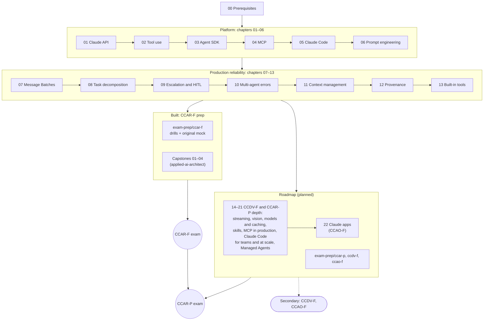

# Anthropic (Claude) Path — Toward Claude Certified Architect

> **Primary targets:** Claude Certified Architect – Foundations (**CCAR-F**), then Claude Certified Architect – Professional (**CCAR-P**) · **Secondary:** CCDV-F and CCAO-F · **Status:** chapters 01–13 and the CCAR-F exam-prep folder written; 14–22 and the other exam-prep folders planned · **Facts checked:** 2026-10-03 against the official exam guides v1.0 (effective July 2026)

This branch of the repo is the Claude half of the journey. Chapters 01–06 cover the platform itself: the Claude API, tool use, the Claude Agent SDK, the Model Context Protocol (MCP), Claude Code and prompt engineering. Chapters 07–13 cover what it takes to run those systems in production: batch processing, task decomposition, escalation and human review, error handling across agents, context management, provenance and Claude Code's built-in tools. [`exam-prep/`](exam-prep/README.md) turns them into one study folder per certification, starting with [CCAR-F](exam-prep/ccar-f/README.md), and the four CCAR-F preparation exercises are built end to end as [capstones 01–04](../applied-ai-architect/capstones/README.md) in the applied-ai-architect track. Chapters 14–22 (planned) add what CCDV-F, CCAR-P and CCAO-F test beyond CCAR-F. Everything is taught through the lens of the architect exam, with notes for the other three Claude certifications where their blueprints go further. Each chapter folder pairs a **README** (the theory, which renders on GitHub and is easy to share) with two runnable Python notebooks: **`01_practice.ipynb`** (guided practical work, one section per README concept, ending in a mini-project) and **`02_homework.ipynb`** (a self-test with a quiz, auto-checked coding exercises and an architecture scenario).

The chapter order follows the community study guide by [paullarionov](https://github.com/paullarionov/claude-certified-architect/blob/main/guide_en.md). That guide puts everything on one long page. Here each topic gets its own folder, rewritten and expanded, and checked against the current official docs. Where the guide has fallen behind, the chapter says so in a **"Note: changed since the guide"** callout.



---

## Contents

- [The Claude certification family](#the-claude-certification-family)
- [Who can sit the exam (eligibility)](#who-can-sit-the-exam-eligibility)
- [CCAR-F exam format](#ccar-f-exam-format)
- [The five exam domains](#the-five-exam-domains)
- [Exam scenarios](#exam-scenarios)
- [Chapter map](#chapter-map)
- [Roadmap](#roadmap)
- [Domain → chapter coverage matrix](#domain--chapter-coverage-matrix)
- [Study plan (8 weeks)](#study-plan-8-weeks)
- [Official prep courses and documentation](#official-prep-courses-and-documentation)
- [Policies you should know before booking](#policies-you-should-know-before-booking)
- [Exam-day tips](#exam-day-tips)
- [Running the notebooks in this branch](#running-the-notebooks-in-this-branch)
- [Sources and credits](#sources-and-credits)

---

## The Claude certification family

Anthropic launched its certification program alongside the **Claude Partner Network** (announced on March 12, 2026). Since June 30, 2026, Pearson VUE delivers every exam. There are four certifications:

| Certification | Code | Level | Who it is for | Items | Time | Passing score | Fee |
|---|---|---|---|---|---|---|---|
| Claude Certified Associate – Foundations | CCAO-F | Foundations | Business professionals who use Claude as a productivity tool (operations, marketing, project management, education, communications, consultants). No software-development or API experience needed. Does **not** count toward Partner Network tier eligibility. | 60 | 120 min | 720 / 1,000 | $99 |
| Claude Certified Developer – Foundations | CCDV-F | Foundations | Engineers who build with the API, the Agent SDK, Claude Code and MCP | 53 | 120 min | 720 / 1,000 | $125 |
| **Claude Certified Architect – Foundations** | **CCAR-F** | Foundations | Solution architects who design and implement production applications with Claude | 60 | 120 min | 720 / 1,000 | $125 |
| Claude Certified Architect – Professional | CCAR-P | Professional | Mid- to senior-level architects and technical leads who own end-to-end Claude solutions, including evaluation, security and governance | 63 | 120 min | 720 / 1,000 | $175 |

Item counts, times, passing scores and fees come from the four official exam guides (v1.0, July 2026) and the certification page. Fees are list prices in USD before any partner-tier discount.

Community material often uses unofficial abbreviations such as **CCA-F** and **CCA-P**, and even the Partner Academy course catalog uses other labels in places. The codes printed in the official exam guides and on the Pearson VUE page are **CCAR-F** and **CCAR-P**.

**Why this repo targets CCAR-F first.** It is the exam that matches the "AI solution architect" goal most directly, and its blueprint (agents, tools, MCP, Claude Code, prompting, reliability) is the one the community guide was built around. CCAR-P is a separate exam with its own blueprint, covered below. Passing Foundations does not upgrade you to Professional, and, according to the official FAQ, there is no formal prerequisite: you can sit Professional without holding Foundations. Even so, Foundations is the natural first step.

<details>
<summary><strong>Blueprints of the other three exams</strong> (for orientation)</summary>

**CCAR-P (Professional, 63 items).** Recommended (not required) experience: 3+ years in systems architecture or platform engineering, plus 6+ months of hands-on experience with Claude or a comparable LLM-based system in production. The CCAR-P candidate profile names retrieval-augmented generation (RAG) and evaluation frameworks explicitly, while the CCAR-F guide lists embeddings and vector-database details as out of scope.

| Domain (official name) | Weight |
|---|---|
| Integration | 19% |
| Solution Design & Architecture | 17% |
| Evaluation, Testing & Optimization | 16% |
| Governance, Safety & Risk Management | 14% |
| Stakeholder Communication & Lifecycle Management | 14% |
| Claude Models, Prompting & Context Engineering | 13% |
| Developer Productivity & Operational Enablement | 7% |

**CCDV-F (Developer, 53 items).** Recommended (not required): 1–5 years of software engineering, 6+ months with Claude or a comparable LLM-based system, proficiency in Python and/or TypeScript.

| Domain (official name) | Weight |
|---|---|
| Applications and Integration | 33.1% |
| Model Selection and Optimization | 16.8% |
| Agents and Workflows | 14.7% |
| Prompt and Context Engineering | 11.0% |
| Tools and MCPs | 10.6% |
| Security and Safety | 8.1% |
| Claude Code | 3.1% |
| Eval, Testing, and Debugging | 2.6% |

**CCAO-F (Associate, 60 items).**

| Domain (official name) | Weight |
|---|---|
| Output Evaluation and Validation | 21% |
| Workflow Integration and Solution Design | 16% |
| Governance, Risk, and Responsible Use | 15% |
| Prompting and Task Execution | 14% |
| Product and Model Selection | 12% |
| Configuration and Knowledge Management | 12% |
| Troubleshooting and Optimization | 10% |

</details>

---

## Who can sit the exam (eligibility)

> [!IMPORTANT]
> **Certification is currently open only to people at Claude Partner Network organizations.** You register with a partner email address on a recognized company domain. Personal addresses (Gmail and similar) are rejected. The minimum age is 18.

What this means for an individual learner:

- **The learning is open to everyone.** The free [Anthropic Academy](https://anthropic.skilljar.com/) courses, the docs and this repo do not require partner status.
- **To book the exam, you need a partner organization.** Either you work for one, or your organization joins. According to Anthropic's launch announcement, any organization bringing Claude to market can join, and membership is free. Membership belongs to the organization, not to individuals. Apply at [claude.com/partners](https://claude.com/partners).
- **Partner tier changes the fee.** The Registered tier pays full price. Select, Preferred and Global Premier partners get 50% off. Global Premier partners get 100% off until December 31, 2026.
- **The credential is a Credly badge** you can share on LinkedIn. You register with a partner email, so the FAQ recommends adding a personal email address to your Credly profile to keep access to your badges wherever you work.

Eligibility rules can change. Check the official [certification FAQ](https://anthropic-partners.skilljar.com/page/faq-certifications) before you plan a booking.

---

## CCAR-F exam format

| Parameter | Value (official exam guide v1.0) |
|---|---|
| Exam code | CCAR-F |
| Items | 60 |
| Time | 120 minutes of exam time (the FAQ says to plan for about 135 minutes of total seat time, including check-in, instructions and a brief post-exam survey) |
| Item types | Multiple-choice **and** multiple-response. Each item tells you how many answers to select. |
| Structure | Scenario-based: **4 scenarios drawn at random from a bank of 6** |
| Scoring | Criterion-referenced, scaled from 100 to 1,000. The cut score of **720** comes from a formal standard-setting study. |
| Score report | Pass/fail with your scaled score (100–1,000), plus your percent correct in each domain. Domain percentages are informational only; pass/fail depends on the total scaled score. The FAQ says scores display immediately, and Credly emails you to claim the badge. |
| Delivery | Pearson VUE: online proctored (OnVUE) or at a test center |
| Rules | Closed book, English only, no browser translation tools (per the official FAQ) |
| Fee | $125 (it was $99 until June 30, 2026), minus any partner-tier discount |
| Validity | 12 months from the date the credential is awarded, renewable for free (see [Policies](#policies-you-should-know-before-booking)) |
| Prerequisites | None stated in the CCAR-F guide (the other three guides say explicitly that there are no mandatory prerequisites) |

> **Note: changed since the guide.** The community guide says questions are "multiple choice (1 correct out of 4)" and that the exam draws "4 out of 8 possible" scenarios. The official v1.0 guide says items are multiple-choice **and multiple-response**, and that the 4 scenarios come from a bank of **6**. The community guide's exam-format table also leaves out the time limit, the fee, Pearson VUE delivery, the 12-month validity and the closed-book, English-only rules.

### The target candidate

The official guide describes the target candidate as a **solution architect** with **6+ months of practical experience building with the Claude APIs, the Agent SDK, Claude Code and MCP**. In practice that means you can:

- design an agentic loop and decide when a workflow is enough instead of an agent;
- split work between a coordinator and subagents, and pass each subagent the context it needs;
- design tools and MCP servers that the model can pick correctly, and that fail in a structured way;
- set up Claude Code for a team (CLAUDE.md, rules, skills, plan mode, CI);
- get reliable structured output with schemas, validation and retries;
- keep long-running and multi-agent systems reliable, with escalation to humans, error propagation and provenance.

The exam tests **judgment about trade-offs**, not trivia. Most questions describe a situation and ask for the *best* design choice among several plausible ones. That is why every chapter in this branch ends with an "Architect decision cheat-sheet" and a "Common mistakes" section.

### What is out of scope for CCAR-F

The official guide lists these topics as out of scope. Do not spend study time on them for this exam:

fine-tuning or training custom models · API authentication, billing and account management · detailed implementation of specific programming languages or frameworks (beyond what tool and schema configuration needs) · deploying or hosting MCP servers · model internals, training and weights · Constitutional AI, RLHF and safety-training methods · embedding models and vector databases · computer use · vision / image analysis · streaming / SSE implementation · rate limits, quotas and pricing calculations · OAuth and API key rotation · cloud-provider configuration (AWS, GCP, Azure) · benchmarking and model-comparison metrics · prompt caching implementation details (beyond knowing it exists) · token counting and tokenization

Some of these still matter to a working architect (and to CCAR-P), so the chapters mention them briefly where they help. They are marked as beyond the exam's scope.

---

## The five exam domains

| # | Domain (official name) | Weight | Approx. items out of 60 |
|---|---|---|---|
| 1 | Agentic Architecture & Orchestration | **27%** | ~16 |
| 2 | Tool Design & MCP Integration | **18%** | ~11 |
| 3 | Claude Code Configuration & Workflows | **20%** | ~12 |
| 4 | Prompt Engineering & Structured Output | **20%** | ~12 |
| 5 | Context Management & Reliability | **15%** | ~9 |

The item counts are estimates (weight × 60). Anthropic does not publish exact counts per domain.

<details>
<summary><strong>All 30 task statements</strong> (what each domain actually tests)</summary>

**Domain 1 — Agentic Architecture & Orchestration**
- 1.1 Agentic loops
- 1.2 Coordinator–subagent orchestration
- 1.3 Subagent invocation and context passing
- 1.4 Multi-step workflows with enforcement and handoff
- 1.5 Agent SDK hooks
- 1.6 Task decomposition
- 1.7 Session state, resumption and forking

**Domain 2 — Tool Design & MCP Integration**
- 2.1 Tool interfaces and descriptions
- 2.2 Structured MCP error responses
- 2.3 Distributing tools across agents, and `tool_choice`
- 2.4 MCP servers in Claude Code and in agents
- 2.5 Built-in tools (Read, Write, Edit, Bash, Grep, Glob)

**Domain 3 — Claude Code Configuration & Workflows**
- 3.1 The CLAUDE.md hierarchy
- 3.2 Custom slash commands and skills
- 3.3 Path-specific rules (`.claude/rules/`)
- 3.4 Plan mode vs direct execution
- 3.5 Iterative refinement
- 3.6 CI/CD integration

**Domain 4 — Prompt Engineering & Structured Output**
- 4.1 Explicit criteria
- 4.2 Few-shot prompting
- 4.3 Structured output via tool use and JSON Schema
- 4.4 Validation, retry and feedback loops
- 4.5 Batch processing
- 4.6 Multi-instance and multi-pass review

**Domain 5 — Context Management & Reliability**
- 5.1 Preserving conversation context
- 5.2 Escalation and ambiguity
- 5.3 Error propagation in multi-agent systems
- 5.4 Context in large-codebase exploration
- 5.5 Human review and confidence calibration
- 5.6 Information provenance and uncertainty

</details>

---

## Exam scenarios

Every question sits inside a scenario: a short description of a system you are building. On exam day you get **4 scenarios drawn at random from the official bank of 6**. Because you cannot know which 4 you will get, prepare for all of them.

### Official scenarios (exam guide v1.0)

| # | Scenario (official name) | What you are building, in brief | Primary domains | Where this repo covers it |
|---|---|---|---|---|
| 1 | **Customer Support Resolution Agent** | An Agent SDK agent that handles high-ambiguity returns, billing disputes and account problems through custom MCP tools (`get_customer`, `lookup_order`, `process_refund`, `escalate_to_human`). The target is 80%+ first-contact resolution while knowing when to escalate. | D1, D2, D5 | [02](02-tool-use/README.md), [03](03-agent-sdk/README.md), [04](04-model-context-protocol/README.md), [09](09-escalation-human-in-the-loop/README.md); [capstone 01](../applied-ai-architect/capstones/01-support-resolution-agent/README.md) |
| 2 | **Code Generation with Claude Code** | Using Claude Code day to day for generation, refactoring, debugging and docs, shaped by CLAUDE.md, custom commands and skills, and knowing when to plan first. | D3, D5 | [05](05-claude-code/README.md), [11](11-context-management/README.md); [capstone 04](../applied-ai-architect/capstones/04-coding-agents-for-a-team/README.md) |
| 3 | **Multi-Agent Research System** | An Agent SDK coordinator that delegates web search, document analysis, synthesis and report generation to specialized subagents, and produces comprehensive, cited reports. (Related task statements also cover what to do when a subagent fails.) | D1, D2, D5 | [03](03-agent-sdk/README.md), [08](08-task-decomposition/README.md), [10](10-multi-agent-error-handling/README.md), [11](11-context-management/README.md), [12](12-provenance/README.md); [capstone 02](../applied-ai-architect/capstones/02-multi-agent-research-with-provenance/README.md) |
| 4 | **Developer Productivity with Claude** | An agent built with the Agent SDK, the built-in tools (Read, Write, Bash, Grep, Glob) and MCP servers that helps engineers explore unfamiliar codebases, understand legacy systems, generate boilerplate and automate repetitive tasks. | D2, D3, D1 | [03](03-agent-sdk/README.md), [04](04-model-context-protocol/README.md), [05](05-claude-code/README.md), [11](11-context-management/README.md), [13](13-claude-code-builtin-tools/README.md); [capstone 04](../applied-ai-architect/capstones/04-coding-agents-for-a-team/README.md) |
| 5 | **Claude Code for Continuous Integration** | Running Claude Code headless in a pipeline for automated PR review, test generation and feedback, with prompts tuned to keep false positives low. | D3, D4 | [05](05-claude-code/README.md), [06](06-prompt-engineering/README.md), [08](08-task-decomposition/README.md); [capstone 04](../applied-ai-architect/capstones/04-coding-agents-for-a-team/README.md) |
| 6 | **Structured Data Extraction** | Pulling fields out of unstructured documents, validating the output against JSON schemas, keeping accuracy high, handling edge cases gracefully and integrating with downstream systems. | D4, D5 | [02](02-tool-use/README.md), [06](06-prompt-engineering/README.md), [07](07-message-batches/README.md), [12](12-provenance/README.md); [capstone 03](../applied-ai-architect/capstones/03-extraction-pipeline-at-scale/README.md) |

### Community-reported scenarios (not in the official v1.0 bank)

The community guide lists two more scenarios. They are **not** in the official v1.0 exam guide. The community guide attributes at least the eighth to reports from exam candidates; neither is confirmed by any official source. They are still worth a light review, because the skills behind them overlap heavily with the official six.

| # | Scenario | Notes |
|---|---|---|
| 7 | **Conversational AI Architecture Patterns** | Multi-turn assistants: managing the context window, keeping instructions in force across turns, memory strategies, safe tool execution, and handling ambiguous or conflicting user requests. Covered by [01](01-claude-api-fundamentals/README.md), [09](09-escalation-human-in-the-loop/README.md) and [11](11-context-management/README.md). |
| 8 | **Agentic AI Tools** | *Community-reported only.* Even the community guide has no content for it, so there is nothing reliable to study beyond the official domains. Treat it as unverified. |

> **Note: changed since the guide.** The guide says the exam draws 4 scenarios out of 8. The official exam guide v1.0 (July 2026) defines a bank of **6**. The official names of scenarios 1 and 4 are "Customer Support Resolution Agent" and "Developer Productivity with Claude".

---

## Chapter map

Chapters follow the order of the community guide. Each one builds on the previous: first the raw API, then tools, then agents, then MCP, then Claude Code, then prompting technique. Chapters 07–13 then take those building blocks into production: cost and throughput, decomposition, human oversight, failure handling, context, provenance and the built-in tools. Every chapter folder holds the same three files: `README.md` (theory), `01_practice.ipynb` (guided practical work) and `02_homework.ipynb` (self-test).

| Chapter folder | Topic | Primary exam domain(s) | Status |
|---|---|---|---|
| [01-claude-api-fundamentals](01-claude-api-fundamentals/README.md) | Messages API anatomy, roles, statelessness, `stop_reason`, system prompts, context window, tokens, model selection | D1, D4, D5 | 📝 |
| [02-tool-use](02-tool-use/README.md) | Tool definitions, `tool_choice`, the client-side tool loop, JSON Schema for structured output, syntax vs semantic errors | D2, D4 | 📝 |
| [03-agent-sdk](03-agent-sdk/README.md) | Agentic loop, `AgentDefinition`, coordinator and subagents, subagent spawning, hooks, sessions | D1 (D2) | 📝 |
| [04-model-context-protocol](04-model-context-protocol/README.md) | MCP architecture, servers, configuration (`.mcp.json`), tools vs resources, `isError` | D2 | 📝 |
| [05-claude-code](05-claude-code/README.md) | CLAUDE.md hierarchy, `@` imports, `.claude/rules/`, commands and skills, plan mode, `/compact`, `/memory`, CI/CD, sessions | D3 (D1, D2, D5) | 📝 |
| [06-prompt-engineering](06-prompt-engineering/README.md) | Few-shot, explicit criteria, prompt chaining, the interview pattern, validation and retry, self-correction | D4 | 📝 |
| [07-message-batches](07-message-batches/README.md) | Message Batches API: 50% cost, up to 24 h processing, `custom_id`, handling failures, choosing batch vs synchronous, SLA planning | D4 (4.5), D5 | 📝 |
| [08-task-decomposition](08-task-decomposition/README.md) | Fixed pipelines (prompt chaining) vs dynamic decomposition, coordinator decomposition, multi-instance and multi-pass code review | D1 (1.6), D4 (4.6) | 📝 |
| [09-escalation-human-in-the-loop](09-escalation-human-in-the-loop/README.md) | When and how to escalate, ambiguity, structured handoffs, confidence calibration, stratified human review | D5 (5.2, 5.5), D1 (1.4) | 📝 |
| [10-multi-agent-error-handling](10-multi-agent-error-handling/README.md) | Error categories, anti-patterns, structured subagent errors, local recovery, coverage annotations in the final synthesis | D5 (5.3), D2 (2.2) | 📝 |
| [11-context-management](11-context-management/README.md) | Case-facts extraction, trimming tool results, position-aware input ("lost in the middle"), scratchpad files, delegating to subagents, state persistence and resumption | D5 (5.1, 5.4), D1 (1.7) | 📝 |
| [12-provenance](12-provenance/README.md) | Claim–source mappings, preventing attribution loss, conflicting sources, dates and uncertainty, rendering citations | D5 (5.6), D1, D4 | 📝 |
| [13-claude-code-builtin-tools](13-claude-code-builtin-tools/README.md) | Read, Write, Edit, Bash, Grep, Glob and when to use each; incremental codebase exploration; the Edit fallback; built-in vs MCP tools | D2 (2.5), D5 (5.4) | 📝 |
| [exam-prep](exam-prep/README.md) | Certification ladder, program rules for all four exams, Academy and Partner Academy checklist, NDA-safe sharing | All four exams | 📝 |
| [exam-prep/ccar-f](exam-prep/ccar-f/README.md) | All 30 task statements mapped to chapters, drills for the six official scenarios, an original 60-item mock (4 scenarios × 15 items) | CCAR-F, all domains | 📝 |

Status legend (same as the [root progress tracker](../README.md#progress-tracker)): ✅ done (studied, notebooks run against the live API) · 🚧 in progress · 📝 written: README and both notebooks drafted, not yet run end to end against the live API · ⏳ planned.

## Roadmap

The folders below are planned and are listed without links until they exist. Chapters 14–22 mirror the planned OpenAI chapters with the same numbers (see the [OpenAI planned chapter folders](../openai-codex/README.md#planned-chapter-folders)). Each one goes deeper than the CCAR-F blueprint, into ground that CCDV-F, CCAR-P or CCAO-F tests (several topics are on the CCAR-F out-of-scope list).

| Chapter folder (planned) | Topic | Main certification domains | Status |
|---|---|---|---|
| `14-streaming-thinking-and-resilient-clients` | Streaming events and recovery, extended and adaptive thinking, SDK vs raw REST, sync vs async clients, error taxonomy, retries with backoff, debugging | CCDV-F D2, D4, D5 | ⏳ |
| `15-vision-pdfs-files-and-citations` | Image and PDF content blocks, the Files API, the Citations API and `search_result` blocks, data-access patterns | CCDV-F D2 | ⏳ |
| `16-models-prompt-caching-and-cost` | Choosing among Fable, Opus, Sonnet and Haiku, version pinning and migration, prompt caching, token budgeting and cost modeling, model choice for business users | CCDV-F D5, CCAO-F D3, CCAR-P D2 | ⏳ |
| `17-agent-skills-and-customization-choices` | Agent Skills across Claude apps, Claude Code, the API and the Agent SDK; choosing between tools, Skills, MCP, subagents and CLAUDE.md | CCDV-F D8, CCAR-P D2 | ⏳ |
| `18-mcp-in-production` | Sampling, notifications and roots, transports in depth, deploying remote MCP servers with OAuth, scaling and gateways | CCDV-F D8 | ⏳ |
| `19-claude-code-for-teams` | Settings layers and managed settings, permissions, hooks as guardrails, custom subagents, plugins and marketplaces, team rollout | CCDV-F D2, D3, CCAR-P D7 | ⏳ |
| `20-claude-code-automation-at-scale` | Headless runs and routines, GitHub Actions and automated review, parallel sessions and worktrees, modernization engagements, measuring impact | CCDV-F D2, CCAR-P D7 | ⏳ |
| `21-managed-agents-memory-and-frameworks` | Your own loop vs the Agent SDK vs Claude Managed Agents, agent memory, HITL checkpoints, agent frameworks (Strands, LangGraph, PydanticAI) | CCDV-F D1 | ⏳ |
| `22-claude-apps-projects-and-cowork` | Claude apps for knowledge work: Projects, artifacts, research, connectors, skills and plugins in the apps, Claude Cowork | CCAO-F D2, D3, D5 | ⏳ |

### Exam prep: one folder per certification

The chapters are written against the CCAR-F blueprint, and each chapter's **Certification coverage** section also maps the matching requirements of the other three exams. [`exam-prep/`](exam-prep/README.md) turns those mappings into a study path per exam. Every certification folder has a README (blueprint, domain → chapter map, study plan, traps), `01_practice.ipynb` (scenario drills) and `02_homework.ipynb` (a full-length original mock in the exam's format and weights).

| Folder | Exam | Builds on | Status |
|---|---|---|---|
| [exam-prep/](exam-prep/README.md) (index) | All four: ladder, program rules, Academy checklist | — | 📝 |
| [exam-prep/ccar-f/](exam-prep/ccar-f/README.md) | Claude Certified Architect – Foundations (primary target 1) | Chapters 01–13, capstones 01–04 | 📝 |
| `exam-prep/ccar-p/` (planned) | Claude Certified Architect – Professional (primary target 2) | Mostly the [applied-ai-architect](../applied-ai-architect/README.md) track, plus chapters 06, 16, 17, 19 and 20; capstones 05–06 | ⏳ |
| `exam-prep/ccdv-f/` (planned) | Claude Certified Developer – Foundations (secondary) | Chapters 01–21, applied-ai-architect 10 (security) | ⏳ |
| `exam-prep/ccao-f/` (planned) | Claude Certified Associate – Foundations (secondary) | Chapter 22, applied-ai-architect 01–02, 11–12 | ⏳ |

### Capstones (built in the applied-ai-architect track)

The official CCAR-F guide's "Preparation Exercises" section describes four hands-on exercises. Each one is built as an end-to-end capstone that ties several chapters together, implemented on Claude and on OpenAI side by side. They live in [applied-ai-architect/capstones/](../applied-ai-architect/capstones/README.md), each with the same three files as a chapter.

| Capstone | Official exercise and scenarios | Claude chapters it combines | Status |
|---|---|---|---|
| [01 · Customer support resolution agent](../applied-ai-architect/capstones/01-support-resolution-agent/README.md) | Exercise 1; scenario 1 | 02, 03, 04, 08, 09, 10 | 📝 |
| [02 · Multi-agent research system with provenance](../applied-ai-architect/capstones/02-multi-agent-research-with-provenance/README.md) | Exercise 4; scenario 3 | 03, 08, 10, 11, 12 | 📝 |
| [03 · Structured extraction pipeline at scale](../applied-ai-architect/capstones/03-extraction-pipeline-at-scale/README.md) | Exercise 3; scenario 6 | 02, 06, 07, 09 | 📝 |
| [04 · Coding agents for a team](../applied-ai-architect/capstones/04-coding-agents-for-a-team/README.md) | Exercise 2; scenarios 2, 4 and 5 | 04, 05 (13 optional) | 📝 |

Capstones 05 (enterprise RAG assistant) and 06 (discovery-to-production engagement) are planned as CCAR-P preparation; see the [capstones index](../applied-ai-architect/capstones/README.md#the-six-capstones).

---

## Domain → chapter coverage matrix

### CCAR-F (domain and task-statement level)

● = primary coverage · ○ = supporting coverage. The [exam-prep/ccar-f](exam-prep/ccar-f/README.md) README maps every task statement to its sections, and [COVERAGE.md](../COVERAGE.md) maps every requirement ID.

| Domain | 01 | 02 | 03 | 04 | 05 | 06 | 07 | 08 | 09 | 10 | 11 | 12 | 13 |
|---|---|---|---|---|---|---|---|---|---|---|---|---|---|
| D1 Agentic Architecture & Orchestration (27%) | ○ | ○ | ● |   | ○ | ○ |   | ● | ○ | ○ | ○ | ○ | ○ |
| D2 Tool Design & MCP Integration (18%) |   | ● | ○ | ● | ○ |   |   |   |   | ○ |   |   | ● |
| D3 Claude Code Configuration & Workflows (20%) |   |   |   | ○ | ● | ○ |   |   |   |   | ○ |   | ○ |
| D4 Prompt Engineering & Structured Output (20%) | ○ | ● |   |   | ○ | ● | ● | ● | ○ |   |   | ○ |   |
| D5 Context Management & Reliability (15%) | ○ |   | ○ |   | ○ | ○ | ○ |   | ● | ● | ● | ● | ○ |

<details>
<summary><strong>Task statement → chapter lookup</strong></summary>

| Task | Primary chapter | Also see |
|---|---|---|
| 1.1 Agentic loops | [03](03-agent-sdk/README.md) | [01](01-claude-api-fundamentals/README.md) (`stop_reason`), [02](02-tool-use/README.md) (tool loop) |
| 1.2 Coordinator–subagent orchestration | [03](03-agent-sdk/README.md) | [08](08-task-decomposition/README.md), [10](10-multi-agent-error-handling/README.md) (the coordinator owns error handling) |
| 1.3 Subagent invocation and context passing | [03](03-agent-sdk/README.md) | [11](11-context-management/README.md), [12](12-provenance/README.md) (metadata that must travel) |
| 1.4 Multi-step workflows with enforcement and handoff | [03](03-agent-sdk/README.md) (hooks) | [09](09-escalation-human-in-the-loop/README.md) |
| 1.5 Agent SDK hooks | [03](03-agent-sdk/README.md) | — |
| 1.6 Task decomposition | [08](08-task-decomposition/README.md) | [06](06-prompt-engineering/README.md) (prompt chaining) |
| 1.7 Session state, resumption and forking | [03](03-agent-sdk/README.md) | [05](05-claude-code/README.md), [11](11-context-management/README.md) |
| 2.1 Tool interfaces and descriptions | [02](02-tool-use/README.md) | [04](04-model-context-protocol/README.md) |
| 2.2 Structured MCP error responses | [04](04-model-context-protocol/README.md) | [02](02-tool-use/README.md), [10](10-multi-agent-error-handling/README.md) |
| 2.3 Distributing tools across agents; `tool_choice` | [02](02-tool-use/README.md) | [03](03-agent-sdk/README.md) |
| 2.4 MCP servers in Claude Code and agents | [04](04-model-context-protocol/README.md) | [05](05-claude-code/README.md) |
| 2.5 Built-in tools | [13](13-claude-code-builtin-tools/README.md) | [05](05-claude-code/README.md), [04](04-model-context-protocol/README.md) (MCP vs built-in) |
| 3.1 CLAUDE.md hierarchy | [05](05-claude-code/README.md) | — |
| 3.2 Custom slash commands and skills | [05](05-claude-code/README.md) | — |
| 3.3 Path-specific rules | [05](05-claude-code/README.md) | — |
| 3.4 Plan mode vs direct execution | [05](05-claude-code/README.md) | — |
| 3.5 Iterative refinement | [05](05-claude-code/README.md) | [06](06-prompt-engineering/README.md) |
| 3.6 CI/CD integration | [05](05-claude-code/README.md) | [06](06-prompt-engineering/README.md) |
| 4.1 Explicit criteria | [06](06-prompt-engineering/README.md) | — |
| 4.2 Few-shot | [06](06-prompt-engineering/README.md) | — |
| 4.3 Structured output via tool use and JSON Schema | [02](02-tool-use/README.md) | [06](06-prompt-engineering/README.md) |
| 4.4 Validation, retry and feedback loops | [06](06-prompt-engineering/README.md) | [02](02-tool-use/README.md) |
| 4.5 Batch processing | [07](07-message-batches/README.md) | — |
| 4.6 Multi-instance and multi-pass review | [08](08-task-decomposition/README.md) | [05](05-claude-code/README.md), [06](06-prompt-engineering/README.md) |
| 5.1 Conversation context preservation | [11](11-context-management/README.md) | [01](01-claude-api-fundamentals/README.md) |
| 5.2 Escalation and ambiguity | [09](09-escalation-human-in-the-loop/README.md) | [03](03-agent-sdk/README.md) (hooks) |
| 5.3 Error propagation in multi-agent systems | [10](10-multi-agent-error-handling/README.md) | [03](03-agent-sdk/README.md), [07](07-message-batches/README.md) |
| 5.4 Context in large-codebase exploration | [11](11-context-management/README.md) | [05](05-claude-code/README.md), [13](13-claude-code-builtin-tools/README.md) |
| 5.5 Human review and confidence calibration | [09](09-escalation-human-in-the-loop/README.md) | [06](06-prompt-engineering/README.md), [07](07-message-batches/README.md) |
| 5.6 Information provenance and uncertainty | [12](12-provenance/README.md) | [10](10-multi-agent-error-handling/README.md), [11](11-context-management/README.md) |

</details>

### CCAR-P, CCDV-F and CCAO-F (domain level)

These three exams go beyond the chapters written so far. The tables show, per official domain, which built chapters already teach part of it (● primary for at least one requirement, ○ supporting only) and where the rest is planned. The per-ID detail is in [COVERAGE.md](../COVERAGE.md#ccar-p-by-domain).

**CCAR-P · Claude Certified Architect – Professional**

| Domain (official numbering) | Weight | Built chapters today | Planned primary homes |
|---|---|---|---|
| D1 Solution Design & Architecture | 17% | [08](08-task-decomposition/README.md) ●, [03](03-agent-sdk/README.md) ○, [07](07-message-batches/README.md) ○ | applied-ai-architect 03, 04 |
| D2 Claude Models, Prompting & Context Engineering | 13% | [06](06-prompt-engineering/README.md) ●, [11](11-context-management/README.md) ● | 16, 17; applied-ai-architect 11 |
| D3 Integration | 19% | [09](09-escalation-human-in-the-loop/README.md)–[12](12-provenance/README.md) ○ | applied-ai-architect 04, 06, 07, 10, 15, 16 |
| D4 Evaluation, Testing & Optimization | 16% | [06](06-prompt-engineering/README.md)–[12](12-provenance/README.md) ○ | applied-ai-architect 08, 09, 15, 16 |
| D5 Governance, Safety & Risk Management | 14% | [09](09-escalation-human-in-the-loop/README.md), [10](10-multi-agent-error-handling/README.md), [12](12-provenance/README.md) ○ | applied-ai-architect 11, 12 |
| D6 Stakeholder Communication & Lifecycle Management | 14% | — | applied-ai-architect 03, 18, 19 |
| D7 Developer Productivity & Operational Enablement | 7% | — | 19, 20; applied-ai-architect 16 |

**CCDV-F · Claude Certified Developer – Foundations**

| Domain (official numbering) | Weight | Built chapters today | Planned primary homes |
|---|---|---|---|
| D1 Agents and Workflows | 14.7% | [02](02-tool-use/README.md) ●, [03](03-agent-sdk/README.md) ●, [08](08-task-decomposition/README.md) ●, [11](11-context-management/README.md) ●, [09](09-escalation-human-in-the-loop/README.md) ○ | 21; applied-ai-architect 04 |
| D2 Applications and Integration | 33.1% | [00](../00-prerequisites/README.md) ●, [01](01-claude-api-fundamentals/README.md) ●, [02](02-tool-use/README.md) ●, [05](05-claude-code/README.md) ●, [06](06-prompt-engineering/README.md) ●, [07](07-message-batches/README.md) ●, [11](11-context-management/README.md) ● | 14, 15, 16, 19, 20, 22; applied-ai-architect 03, 19 |
| D3 Claude Code | 3.1% | [05](05-claude-code/README.md) ●, [11](11-context-management/README.md) ○, [13](13-claude-code-builtin-tools/README.md) ○ | 19 |
| D4 Eval, Testing, and Debugging | 2.6% | [10](10-multi-agent-error-handling/README.md) ○ | 14; applied-ai-architect 16 |
| D5 Model Selection and Optimization | 16.8% | [00](../00-prerequisites/README.md) ●, [01](01-claude-api-fundamentals/README.md) ●, [06](06-prompt-engineering/README.md) ●, [07](07-message-batches/README.md) ● | 14, 16 |
| D6 Prompt and Context Engineering | 11.0% | [02](02-tool-use/README.md) ●, [06](06-prompt-engineering/README.md) ●, [11](11-context-management/README.md) ● | 21; applied-ai-architect 10 |
| D7 Security and Safety | 8.1% | [06](06-prompt-engineering/README.md), [09](09-escalation-human-in-the-loop/README.md), [12](12-provenance/README.md) ○ | applied-ai-architect 10, 11, 13; 19 |
| D8 Tools and MCPs | 10.6% | [02](02-tool-use/README.md) ●, [03](03-agent-sdk/README.md) ●, [04](04-model-context-protocol/README.md) ●, [09](09-escalation-human-in-the-loop/README.md) ○, [10](10-multi-agent-error-handling/README.md) ○, [13](13-claude-code-builtin-tools/README.md) ○ | 17, 18 |

**CCAO-F · Claude Certified Associate – Foundations**

| Domain (official numbering) | Weight | Built chapters today | Planned primary homes |
|---|---|---|---|
| D1 Prompting and Task Execution | 14% | [08](08-task-decomposition/README.md) ●, [06](06-prompt-engineering/README.md) ○ | applied-ai-architect 01 |
| D2 Output Evaluation and Validation | 21% | [06](06-prompt-engineering/README.md), [08](08-task-decomposition/README.md), [09](09-escalation-human-in-the-loop/README.md), [10](10-multi-agent-error-handling/README.md), [12](12-provenance/README.md) ○ | applied-ai-architect 01; 22 |
| D3 Product and Model Selection | 12% | [07](07-message-batches/README.md), [11](11-context-management/README.md), [12](12-provenance/README.md) ○ | 16, 22 |
| D4 Workflow Integration and Solution Design | 16% | [12](12-provenance/README.md) ○ | applied-ai-architect 02, 18 |
| D5 Configuration and Knowledge Management | 12% | — | 22 |
| D6 Governance, Risk, and Responsible Use | 15% | — | applied-ai-architect 11, 12 |
| D7 Troubleshooting and Optimization | 10% | — | applied-ai-architect 01, 02 |

---

## Study plan (8 weeks)

The plan assumes roughly **8–10 hours a week** next to a full-time job, and that you have finished [00-prerequisites](../00-prerequisites/README.md). If you already build with Claude every day, compress it to about 6 weeks by merging weeks 6–7.

| Week | Focus | Repo | Official course to pair with it | Domain weight touched |
|---|---|---|---|---|
| 0 | Setup and orientation: API key, venv, read this page and the official exam guide PDF | [00](../00-prerequisites/README.md) | AI Fluency: Framework & Foundations; Claude 101 | — |
| 1 | The Messages API, end to end | [01](01-claude-api-fundamentals/README.md) | Building with the Claude API (first half) | D1, D4, D5 |
| 2 | Tools, `tool_choice`, structured output | [02](02-tool-use/README.md) | Building with the Claude API (tool-use sections) | D2, D4 |
| 3 | Agents: loops, subagents, hooks, sessions (the 27% domain, so give it a full week) | [03](03-agent-sdk/README.md) | Introduction to Subagents | D1 |
| 4 | MCP: servers, config, error handling | [04](04-model-context-protocol/README.md) | Introduction to MCP; MCP: Advanced Topics | D2 |
| 5 | Claude Code for a team, plus CI | [05](05-claude-code/README.md) | Claude Code in Action; Introduction to Agent Skills | D3 |
| 6 | Prompting technique, plus batch processing | [06](06-prompt-engineering/README.md), [07](07-message-batches/README.md) | Building with the Claude API (second half) | D4 |
| 7 | Reliability: decomposition, escalation, multi-agent errors, context, provenance, built-in tools | [08](08-task-decomposition/README.md), [09](09-escalation-human-in-the-loop/README.md), [10](10-multi-agent-error-handling/README.md), [11](11-context-management/README.md), [12](12-provenance/README.md), [13](13-claude-code-builtin-tools/README.md) | — | D1, D5 |
| 8 | Exam prep: scenario drills and the original mock, the four capstones, the sample questions in the official guide, a weak-domain review; book the exam | [exam-prep/ccar-f](exam-prep/ccar-f/README.md), [capstones 01–04](../applied-ai-architect/capstones/README.md) | — | All |

**Weekly rhythm that works well:**

1. Read the chapter README once without running anything.
2. Run each notebook and change at least one thing: a prompt, a tool description or a model.
3. Answer the chapter's self-check questions without looking back.
4. Write a short post about one takeaway (see [Sharing the journey](#sharing-the-journey-without-breaking-the-nda) for what is fine to share).

---

## Official prep courses and documentation

### Anthropic Academy (free, open to everyone)

CCAR-F has **no dedicated prep path** in the Partner Academy catalog. Instead, the [CCAR-F prep courses page](https://anthropic-partners.skilljar.com/page/claude-certified-architect-foundations-prep-courses) recommends seven free courses. The first table lists them in a sensible order, and the second lists extra public courses that fit this repo well.

| Course | Why it matters for CCAR-F |
|---|---|
| [AI Fluency: Framework & Foundations](https://anthropic.skilljar.com/ai-fluency-framework-foundations) | The shared vocabulary for working with AI |
| [Claude 101](https://anthropic.skilljar.com/claude-101) | Product-level orientation |
| [Building with the Claude API](https://anthropic.skilljar.com/claude-with-the-anthropic-api) | Chapters 01, 02, 06 and 07 |
| [Introduction to Model Context Protocol](https://anthropic.skilljar.com/introduction-to-model-context-protocol) | Chapter 04 |
| [Claude Code in Action](https://anthropic.skilljar.com/claude-code-in-action) | Chapter 05 |
| [Claude with Amazon Bedrock](https://anthropic.skilljar.com/claude-in-amazon-bedrock) | Cloud deployment context (cloud configuration itself is out of scope) |
| [Claude on Google Cloud](https://anthropic.skilljar.com/claude-with-google-vertex) | Same as above |

| Extra course (not on the CCAR-F list, but useful) | Fits chapter |
|---|---|
| [Model Context Protocol: Advanced Topics](https://anthropic.skilljar.com/model-context-protocol-advanced-topics) | 04 |
| [Introduction to Agent Skills](https://anthropic.skilljar.com/introduction-to-agent-skills) | 05 |
| [Introduction to Subagents](https://anthropic.skilljar.com/introduction-to-subagents) | 03, 05 |
| [Claude Platform 101](https://anthropic.skilljar.com/claude-platform-101) | 01 |
| [Claude Code 101](https://anthropic.skilljar.com/claude-code-101) | 05 |
| [AI Capabilities and Limitations](https://anthropic.skilljar.com/ai-capabilities-and-limitations) | 01, 09 |

The partner-only Partner Academy also has structured prep paths for **CCDV-F** (5 modules, about 13 hours), **CCAR-P** (5 modules, about 12 hours) and **CCAO-F**. Module counts and durations are as listed on the path pages in early October 2026. They are useful if you go on to those exams. Course catalog: [Claude certification exam prep courses](https://anthropic-partners.skilljar.com/page/claude-certification-exam-prep-courses) and [CCAR-F prep courses](https://anthropic-partners.skilljar.com/page/claude-certified-architect-foundations-prep-courses).

### Official certification pages

| Resource | Link |
|---|---|
| Certification program (all 4 exams, fees, guides) | [anthropic-partners.skilljar.com/page/partner-certifications](https://anthropic-partners.skilljar.com/page/partner-certifications) |
| **CCAR-F exam guide (PDF, v1.0)** | [Claude Certified Architect – Foundations Exam Guide](https://everpath-course-content.s3-accelerate.amazonaws.com/instructor%2F6nizmqk8tpzpfjvt6qmmav7rh%2Fpublic%2F1783542750%2FClaude+Certified+Architect+%E2%80%93+Foundations+Exam+Guide.pdf) |
| CCAR-P exam guide (PDF) | [Claude Certified Architect – Professional Exam Guide](https://everpath-course-content.s3-accelerate.amazonaws.com/instructor%2F6nizmqk8tpzpfjvt6qmmav7rh%2Fpublic%2F1783542810%2FClaude+Certified+Architect+%E2%80%93+Professional+Exam+Guide.pdf) |
| CCDV-F exam guide (PDF) | [Claude Certified Developer – Foundations Exam Guide](https://everpath-course-content.s3-accelerate.amazonaws.com/instructor%2F6nizmqk8tpzpfjvt6qmmav7rh%2Fpublic%2F1783542875%2FClaude+Certified+Developer+%E2%80%93+Foundations+Exam+Guide.pdf) |
| CCAO-F exam guide (PDF) | [Claude Certified Associate – Foundations Exam Guide](https://everpath-course-content.s3-accelerate.amazonaws.com/instructor%2F6nizmqk8tpzpfjvt6qmmav7rh%2Fpublic%2F1783542847%2FClaude+Certified+Associate+%E2%80%93+Foundations+Exam+Guide.pdf) |
| FAQ | [faq-certifications](https://anthropic-partners.skilljar.com/page/faq-certifications) |
| Policies | [policies-certifications](https://anthropic-partners.skilljar.com/page/policies-certifications) |
| Pearson VUE (scheduling) | [pearsonvue.com/us/en/anthropic.html](https://www.pearsonvue.com/us/en/anthropic.html) |
| Partner Network launch announcement | [anthropic.com/news/claude-partner-network](https://www.anthropic.com/news/claude-partner-network) |
| Join the Partner Network | [claude.com/partners](https://claude.com/partners) |

### Technical documentation used throughout this branch

| Area | Docs |
|---|---|
| Claude API (Messages, tool use, batches, structured outputs) | [platform.claude.com/docs](https://platform.claude.com/docs) |
| Claude Agent SDK | [code.claude.com/docs/en/agent-sdk/overview](https://code.claude.com/docs/en/agent-sdk/overview) |
| Claude Code (memory, skills, hooks, subagents, MCP, headless, GitHub Actions) | [code.claude.com/docs](https://code.claude.com/docs/en/overview) |
| Model Context Protocol | [modelcontextprotocol.io](https://modelcontextprotocol.io/) |
| Prompt engineering | [Prompting best practices](https://platform.claude.com/docs/en/build-with-claude/prompt-engineering/claude-prompting-best-practices) |
| Code examples | [Claude Cookbooks](https://github.com/anthropics/claude-cookbooks) (formerly `anthropic-cookbook`) |

Each chapter README ends with its own list of specific doc pages.

### Third-party resources

- [claudecertificationguide.com/learn](https://claudecertificationguide.com/learn) is an independent study site. It is not on an Anthropic domain and does not present itself as official, so treat it as **third-party**. As of 2026-10-03, its CCAR-F facts (60 questions, 120 minutes, 720/1,000, $125, 12-month validity, Pearson VUE, the same five domains and weights) match the official guide.
- [paullarionov/claude-certified-architect](https://github.com/paullarionov/claude-certified-architect/blob/main/guide_en.md) is the community study guide this branch is structured around. Parts of it are out of date; see [Sources and credits](#sources-and-credits).

---

## Policies you should know before booking

| Topic | Rule |
|---|---|
| Registration | Register and pay by credit card on the Partner Academy, then schedule with Pearson VUE. A registration stays valid for 5 years. |
| Rescheduling / cancelling | Free with a full refund up to **48 hours** before the appointment. Changes inside 48 hours, or a no-show, forfeit the fee. (The exam guide PDF says 24 hours, but the policies page, the FAQ and the Pearson VUE Anthropic page all say 48 hours, so plan around 48.) |
| Retakes | Wait **14 days** after a first fail, **30 days** after a second, **90 days** after a third. You get at most **4 attempts per rolling 12 months** for each exam (the limits reset when an exam is updated to a new version). Every attempt costs the full fee (minus your tier discount). You cannot retake an exam you have passed to raise your score. |
| Validity | **12 months** from the date you earn it. (It was 6 months before June 30, 2026; credentials earned before then were extended automatically to 12 months from their original earned date.) |
| Renewal | Free. Before your credential expires, pass an open-book online assessment on the Partner Academy. You may retry it, and passing extends validity 12 months from your current expiry date. If the credential lapses, you must retake the full proctored exam at full price. A major exam revision may require you to take the new version. |
| Practice exam | The old practice exam was retired in the move to Pearson. Use the sample questions in the official exam guide. |
| Confidentiality | You accept a confidentiality and non-disclosure agreement before the exam starts (declining ends the session with no refund). All exam content, including questions, answer options and scenarios, is confidential: you may not share, reproduce or discuss it in any form, which includes forums and social media. |

### Sharing the journey without breaking the NDA

This repo is a public learning journal, so the line matters:

- ✅ **Fine to share:** what you studied, notebooks you built, concepts from the public docs and the public exam guide (domains, task statements, scenario names, sample questions the guide itself publishes), your study plan, and your result once you pass.
- ❌ **Not fine:** anything about specific questions you saw on the exam, including paraphrases, "they asked a lot about X" breakdowns of real items, or recalled answer options.

---

## Exam-day tips

These tips come from the official exam guide and the policy pages. Where a tip is an inference rather than an official statement, it says so.

- **Budget about 2 minutes per item.** It is 60 items in 120 minutes. Scenario text is shared across several items, so read each scenario carefully once and refer back to it.
- **Check how many answers to select.** Multiple-response items state the required count. Picking the wrong number of options is an easy way to lose points.
- **Answer every item.** The official guide does not mention a guessing penalty. It only says the score is scaled and criterion-referenced. An unanswered item cannot earn credit, though, so answering everything is the sensible strategy. *(This is an inference. The community guide's "no guessing penalty" claim is not stated officially.)*
- **Pick the "most appropriate" option, not merely a correct one.** Several options are often technically possible. The exam rewards the one that is deterministic where it needs to be (hooks and code over prompt instructions for hard rules), proportionate (no over-engineering), and honest about uncertainty (escalate, annotate gaps, do not invent data).
- **Closed book, English only.** No docs, no notes, and no browser translation tools. If you take it on OnVUE, test your room, webcam and network the day before.
- **Plan for about 135 minutes of seat time.** According to the FAQ, check-in, instructions and a brief post-exam survey add roughly 15 minutes to the 120-minute exam. Bring a valid, unexpired, government-issued photo ID whose name matches your registration exactly.
- **Your score displays right after the exam,** and the score report shows your percent correct per domain. If you need a retake, use those domain percentages to focus your review.

---

## Running the notebooks in this branch

### Setup (once)

1. Follow [00-prerequisites](../00-prerequisites/README.md): Python 3.11+, a virtual environment, `pip install -r requirements.txt` from the repo root, and Jupyter.
2. Copy `.env.example` to `.env` at the repo root and set `ANTHROPIC_API_KEY`. Create the key in the [Claude Console](https://platform.claude.com/). `.env` is git-ignored. **Never commit a key or paste one into a notebook cell.**
3. Chapter 03 uses the **Claude Agent SDK** (`pip install claude-agent-sdk`, imported as `claude_agent_sdk`). The Python package bundles a native Claude Code binary, so most installs need no separate Claude Code install. It reads `ANTHROPIC_API_KEY` from the process environment but does not load `.env` files itself, so call `load_dotenv()` first (the setup cell below does). Chapter 05 drives the **Claude Code CLI** itself (interactive and headless `claude -p`), so install Claude Code and sign in for that chapter. Each of those chapters has its own setup steps.

Every notebook opens with the same cell (identical to the one in the [root README](../README.md#quick-start)):

```python
import os
from dotenv import load_dotenv, find_dotenv
import anthropic

# Search upward from the notebook's folder (Jupyter's working directory) until the repo-root .env is found.
load_dotenv(find_dotenv(usecwd=True))
client = anthropic.Anthropic()     # picks up ANTHROPIC_API_KEY from the environment
MODEL = os.getenv("CLAUDE_MODEL", "claude-sonnet-5-5")   # default model for this branch; override in .env
```

### Model IDs used in this branch

| Model | Model ID | Context window | Input / output price per 1M tokens | When the notebooks use it |
|---|---|---|---|---|
| Claude Sonnet 5.5 | `claude-sonnet-5-5` | 1M | $2 / $10 | **Default** for almost every notebook |
| Claude Haiku 4.5 | `claude-haiku-4-5-20251001` (alias `claude-haiku-4-5`) | 200K | $1 / $5 | Cheap high-volume runs and subagents, plus demos that need forced `tool_choice` (see the note below) |
| Claude Opus 5.5 | `claude-opus-5-5` | 1M | $4 / $20 | Model-comparison experiments and hard reasoning steps |
| Claude Fable 5.1 | `claude-fable-5-1` | 1M | $10 / $50 | Only where a comparison needs Anthropic's most capable model |

Prices are Anthropic first-party API list prices as of late September 2026. Check the [API pricing page](https://platform.claude.com/docs/en/about-claude/pricing) before you rely on them, and query `client.models.retrieve(MODEL)` for live limits (its `max_input_tokens` field is the context window and `max_tokens` is the output cap). (Pricing and rate limits are out of scope for the exam. They are here so you can keep your own bill under control.)

> **Note: changed since the guide.** Current models differ from the guide in a few ways that affect the notebooks:
> - **Forced tool use** (`tool_choice` set to `{"type": "any"}` or `{"type": "tool", ...}`) returns a 400 error on Sonnet 5.5, Opus 5.5 and Fable 5.1. The exam still tests what these modes mean, so [02-tool-use](02-tool-use/README.md) demonstrates them on Haiku 4.5. It also shows the current replacements: `auto` plus `strict: true`, or structured outputs.
> - **Assistant prefill** (ending `messages` with a partial assistant turn) returns a 400 on Sonnet 5.5, Opus 5.5 and Fable 5.1 (Haiku 4.5 still accepts it). Use structured outputs (`output_config.format` or `client.messages.parse()`) or system-prompt instructions instead.
> - **Thinking** uses `thinking={"type": "adaptive"}` plus an effort level set inside `output_config` (for example `output_config={"effort": "medium"}`), not as a top-level parameter. The old `budget_tokens` setting is rejected with a 400 on Sonnet 5.5, Opus 5.5 and Fable 5.1. Opus 5.5 defaults to `medium` effort (Sonnet 5.5 defaults to `high`), so set it explicitly. Haiku 4.5 is the exception: it still uses `{"type": "enabled", "budget_tokens": N}` and does not accept `effort`.
> - In the Agent SDK, the subagent-spawning tool that the guide (and the official exam guide v1.0) calls `Task` is now named `Agent` in `tool_use` blocks, and you list `"Agent"` (not `"Task"`) in `allowed_tools` when you pre-approve it. The `system:init` tools list still shows it as `Task`, and versions before Claude Code v2.1.63 emitted `Task`. Expect the exam to use `Task`. [03-agent-sdk](03-agent-sdk/README.md) covers both names.

### Cost notes

- **A typical notebook costs well under $1 on Sonnet 5.5.** For example, 50 calls with about 3K input and 1K output tokens each costs roughly $0.30 for input and $0.50 for output.
- **Thinking tokens are billed as output tokens,** even when the thinking text is hidden. Keep `max_tokens` reasonable and use lower `effort` for simple tasks.
- **Agent notebooks (03, 05 and the capstones) cost the most,** because one task can mean many turns that each resend a growing context. Use the Agent SDK's turn and budget limits (`max_turns`, `max_budget_usd`; see chapter 03) and test on Haiku 4.5 first.
- **Use batches for bulk work.** The Message Batches API costs 50% of the standard price. Chapter 07 and the extraction capstone use it for the 100-document run.
- **Set a monthly spend limit** in the Claude Console before you start, so a runaway loop cannot surprise you.
- Notebooks print `response.usage` after each call, so you always see what you spent.

### Notebook conventions

- Every chapter folder has exactly two notebooks next to its README: **`01_practice.ipynb`** (guided practical work: one section per README concept, ending in a mini-project) and **`02_homework.ipynb`** (a self-test: quiz, auto-checked coding exercises and an architecture scenario, with solutions at the end). Each chapter README has a **Notebooks** section describing both.
- Each notebook's sections link back to the README section they implement. Theory lives in the README and code lives in the notebook, so nothing is written twice.
- Notebooks are meant to be **run top to bottom** with a fresh kernel. Cells that make many API calls say so in a comment at the top of the cell.

---

## Sources and credits

- **Official:** the Claude Certified Architect – Foundations Exam Guide v1.0 (effective July 2026) and the Anthropic certification program, FAQ and policies pages linked [above](#official-certification-pages). Where this README and the official pages disagree, the official pages win.
- **Community study guide:** [paullarionov/claude-certified-architect](https://github.com/paullarionov/claude-certified-architect/blob/main/guide_en.md). This branch follows its chapter order and syllabus, rewritten, restructured and expanded in my own words, with "Note: changed since the guide" callouts wherever current docs differ.
- **Third-party study site:** [claudecertificationguide.com](https://claudecertificationguide.com/learn), an independent site that is not an official Anthropic resource.
- Exam facts were checked on **2026-10-03**. Certification programs change often, so if something here looks out of date, please open an issue.

---

[↑ Root README](../README.md) | [← 00 — Prerequisites](../00-prerequisites/README.md) | [Start → 01 — Claude API Fundamentals](01-claude-api-fundamentals/README.md)
