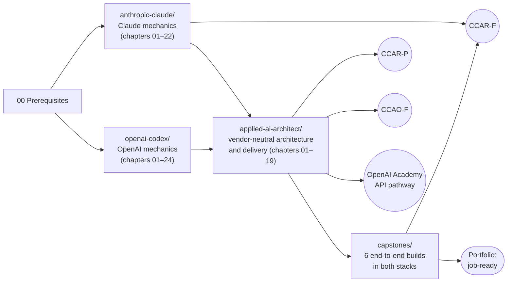
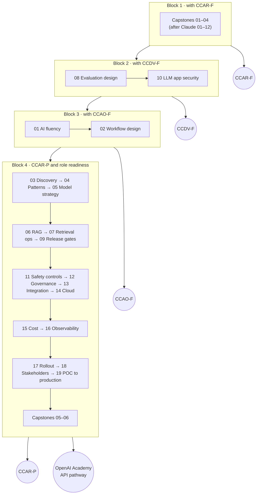

# Applied AI Architect Track: Vendor-Neutral Solution Architecture with Claude and OpenAI

> **Goal:** be job-ready as an **Applied AI Solution Architect** · **Main certification served:** Claude Certified Architect – Professional (**CCAR-P**), plus parts of CCAO-F and CCDV-F · **OpenAI Academy courses served:** Scope AI Solutions, Evaluate AI Applications, Build with RAG, Optimize AI Application Performance, AI Leadership · **Status:** 19 chapters planned, capstones 01–04 written (📝), capstones 05–06 planned · **Facts checked:** 2026-10-03

The [Claude path](../anthropic-claude/README.md) and the [OpenAI path](../openai-codex/README.md) teach how each vendor's platform works: APIs, tools, agent SDKs, MCP, coding agents, batching and context. This third track covers the work that sits **above** any one vendor. That is what an applied AI architect does with a customer: find the right use case, design the system, prove it works with evals, secure and govern it, deploy it on the right platform, run it in production, and hand it over.

Every chapter is written vendor-neutral first. Then it shows **the same solution built with Claude and with OpenAI** and compares the two on capability, cost, latency, governance and lock-in. Customers ask "Claude or OpenAI, and why?" in almost every engagement, so a side-by-side comparison is the most useful thing an architect can bring.



---

## Contents

- [Who this track is for](#who-this-track-is-for)
- [How this track relates to the vendor tracks](#how-this-track-relates-to-the-vendor-tracks)
- [Certifications and courses this track serves](#certifications-and-courses-this-track-serves)
- [What employers ask for](#what-employers-ask-for)
- [Chapter plan](#chapter-plan)
- [Capstones](#capstones)
- [Role competency matrix: where the repo covers each area](#role-competency-matrix-where-the-repo-covers-each-area)
- [Claude ↔ OpenAI at the architecture level](#claude--openai-at-the-architecture-level)
- [Study order](#study-order)
- [How the chapters are built](#how-the-chapters-are-built)
- [Progress tracker](#progress-tracker)
- [Certification coverage](#certification-coverage)
- [Sources and credits](#sources-and-credits)

---

## Who this track is for

- **You finished (or are finishing) the vendor chapters** and can build a tool-using agent on at least one platform. You now want to know how to scope, justify, evaluate, secure and ship it for a real customer.
- **You are preparing for CCAR-P.** About three quarters of its task statements are vendor-neutral architecture, evaluation, governance and delivery skills. They live here, not in the Claude track (see [below](#certifications-and-courses-this-track-serves)).
- **You are aiming at a customer-facing AI role:** Applied AI Architect, Applied AI Engineer, Forward Deployed Engineer, AI Deployment Engineer or Solutions Architect for generative AI at a model lab, a cloud provider or a systems integrator.
- **You are a software or cloud architect moving into AI.** You already know distributed systems, identity and CI/CD, and you need the LLM-specific layer: evals, retrieval, guardrails and model choice.

You do **not** need a machine-learning background. Where an architect needs ML basics (for example to judge a fine-tuning proposal), chapter 05 teaches just enough.

**Prerequisites:** [00-prerequisites](../00-prerequisites/README.md), plus the Claude path chapters 01–06 or the OpenAI path chapters 01–06. Chapters 01 and 02 of this track are the exception: they target business users (CCAO-F) and need no coding background.

---

## How this track relates to the vendor tracks

| | `anthropic-claude/` | `openai-codex/` | `applied-ai-architect/` (this track) |
|---|---|---|---|
| **Question it answers** | How does Claude work, and how do I build with it? | How does the OpenAI platform work, and how is it different from Claude? | What should we build, why, and how do we prove, secure, ship and run it? |
| **Unit of study** | API features, SDKs, Claude Code | API features, SDKs, Codex | Decisions, patterns, trade-offs, deliverables |
| **Main credential** | CCAR-F, CCDV-F | Academy API and Codex pathways | CCAR-P, role readiness (and CCAO-F through chapters 01–02) |
| **Code** | Single-vendor notebooks | Single-vendor notebooks (a "delta course" from Claude) | Both vendors behind one interface, compared side by side |
| **Ends with** | Exam prep per Claude certification | Exam prep per Academy pathway | Six capstones that combine all three tracks |

**One primary home per topic.** Each requirement in this repo is taught in exactly one place. When a chapter here needs a vendor mechanic (for example Claude's `cache_control` or OpenAI's `file_search`), it links to the vendor chapter instead of re-teaching it. When a vendor chapter needs an architecture judgment (for example "workflow or agent?"), it links here.

---

## Certifications and courses this track serves

### Anthropic: Claude Certified Architect – Professional (CCAR-P) relies on this track

CCAR-P (63 items, 120 minutes, scaled passing score 720 out of 1,000; exam guide v1.0, effective July 2026) is aimed at architects who own Claude solutions end to end. Its blueprint is mostly vendor-neutral. The guide lists **38 task statements**; this repo's requirement checklist splits their enumerated sub-points into 87 items. **29 of the 38 statements (69 of the 87 items) have their primary home in this track**:

| CCAR-P domain | Weight | Where it is taught |
|---|---|---|
| 1. Solution Design & Architecture | 17% | Chapters 03, 04 (4 of 6 task statements); multi-agent design and decomposition are in Claude 03 and 08 |
| 2. Claude Models, Prompting & Context Engineering | 13% | The Claude track (Claude 06, 11, and planned 16 and 17) for all 5 statements; chapter 11 here covers the "guardrails" part of the system-prompt statement |
| 3. Integration | 19% | Chapters 04, 06, 07, 10, 15, 16 (all 8 task statements) |
| 4. Evaluation, Testing & Optimization | 16% | Chapters 08, 09, 15, 16 (all 6) |
| 5. Governance, Safety & Risk Management | 14% | Chapters 11, 12 (all 5) |
| 6. Stakeholder Communication & Lifecycle Management | 14% | Chapters 03, 18, 19 (all 5) |
| 7. Developer Productivity & Operational Enablement | 7% | Mostly the Claude track (planned Claude 19 and 20); chapter 16 here covers one of the 3 statements (debugging and operational support) |

The CCAR-P guide's "How to Prepare" section recommends building and operating at least one end-to-end Claude solution that includes RAG, evaluation and observability. Capstone 05 is that build. A CCAR-P study path (blueprint review, scenario drills, an original mock exam) is planned at `anthropic-claude/exam-prep/ccar-p`.

### Other Anthropic certifications

- **CCAO-F (Claude Certified Associate – Foundations):** chapters 01, 02, 11, 12, 17 and 18 cover its business-facing domains: prompting and task execution, output evaluation, workflow design, governance and responsible use, and troubleshooting. About half of the CCAO-F checklist lives here; the rest is in the Claude track (product and model selection, configuration and knowledge management).
- **CCDV-F (Claude Certified Developer – Foundations):** chapters 03, 04, 08, 10, 11, 13, 16 and 19 cover domain 7 (Security and Safety), which lives almost entirely here, plus a few weighted skills from other domains: Agent Architecture (domain 1), Understanding Requirements and Systems Life Cycle (domain 2), and trace analysis for debugging (domain 4). The rest of CCDV-F is in the Claude track.
- **CCAR-F (Claude Certified Architect – Foundations):** CCAR-F is taught in the Claude track. Its four official preparation exercises become [capstones 01–04](#capstones), built in both stacks. The six official exam scenarios are mapped to the capstones in [capstones/README.md](capstones/README.md).

### OpenAI Academy: the API pathway and AI Leadership

OpenAI has no proctored architect certification. Its Academy issues course badges and pathway certificates of completion, which OpenAI says are not certifications. Each course badge needs the course plus an assessment passed at 80% or higher. This track carries most of the API pathway's vendor-neutral content:

| Academy course | Where it is covered |
|---|---|
| Scope AI Solutions | Chapters 03 (main), 04, 05, 08, 19 |
| Evaluate AI Applications | Chapters 08 (main), 09, 11 |
| Design and Build Agentic Systems | Mostly the OpenAI track ([03](../openai-codex/03-agents-sdk-and-agents-api/README.md), [08](../openai-codex/08-task-decomposition-and-orchestration/README.md)); its deliverable (a multi-agent workflow tested against outcome and safety requirements) is built across capstones 01 (safety and escalation) and 02 (multi-agent orchestration) |
| Build with Retrieval-Augmented Generation | Chapters 06, 07 (main), 05; OpenAI [04](../openai-codex/04-built-in-tools-and-mcp/README.md) for `file_search`; its deliverable is built in capstone 05 |
| Optimize AI Application Performance | Chapters 09, 15, 16 (main), 05; OpenAI [07](../openai-codex/07-batch-and-cost/README.md) for Batch and caching |
| AI Leadership (standalone course) | Chapters 02, 03, 12, 17, 18, 19; its "AI strategy brief" deliverable is built in capstone 06 |
| Foundations pathway (AI Foundations, Applied AI Foundations, Agents and Workflows) | Chapters 01, 02 |

Badge rules, assessment formats and a checklist per course are planned at `openai-codex/exam-prep`.

---

## What employers ask for

The role competency matrix behind this track combines two sources, both read on 2026-10-03:

- **Job postings:** every open Anthropic and OpenAI posting for Applied AI Architect or Engineer, Forward Deployed Engineer and AI Deployment roles. That is 139 postings, which come down to 25 unique Anthropic and 40 unique OpenAI role descriptions once location copies are merged.
- **Certification guides:** seven in total, the two Claude architect exams plus five AWS, Google Cloud and Microsoft AI certifications. These show which skills the industry treats as baseline.

Each competency gets a score that blends how often postings ask for it with how many exams test it. The **ten most-demanded competencies**:

| Rank | Competency | Area | Primary home in this repo |
|---|---|---|---|
| 1 | Responsible AI and safety-first judgment | SAFE | Chapter 11 |
| 2 | Ambiguity, prioritization and ownership | CHANGE | Chapter 03 |
| 3 | Use-case-specific evaluation frameworks | EVAL | Chapter 08 |
| 4 | Audience-tailored technical communication | COMM | Chapter 18 |
| 5 | POC-to-production delivery ownership | CHANGE | Chapter 19 |
| 6 | Executive and C-suite engagement | CHANGE | Chapter 18 |
| 7 | Field-to-product feedback loop | CHANGE | Chapter 18 |
| 8 | Model selection and trade-off reasoning | ARCH | Chapter 05 |
| 9 | Cross-functional coordination | CHANGE | Chapter 19 |
| 10 | Agent architecture and agentic workflows | AGENT | Chapter 04 |

What the data says:

1. **Postings and exams measure different layers.** Postings ask for outcomes: discovery, evals, getting a POC into production, earning executive trust, feeding learnings back to product. Exams test mechanics: RAG, guardrails, caching, routing, monitoring. Postings rarely name mechanics such as vector databases or prompt injection, because they assume them under "production LLM experience". You need both layers, so every chapter here pairs a decision skill with a hands-on build.
2. **Evals are the most-demanded technical skill.** 20 of 25 unique Anthropic postings ask for evaluation frameworks built for the customer's own use case. That is why chapter 08 is one of the first chapters built in this track.
3. **The two labs stress different things.** Anthropic postings stress prompt and context engineering, MCP, agent skills and safety. OpenAI postings stress measurable business impact, reusable reference architectures, security and governance, observability, and Codex.
4. **Fine-tuning is judgment, not execution.** Only 2 of 65 unique postings mention fine-tuning, but four of the five cloud certification guides test the "prompting vs RAG vs fine-tuning" decision. Chapter 05 teaches the decision and the lifecycle at an architect's depth.

---

## Chapter plan

These folders are planned and are listed without links until they exist. Each will hold the same three files as every chapter in the repo (see [How the chapters are built](#how-the-chapters-are-built)). Area codes refer to the [competency matrix](#role-competency-matrix-where-the-repo-covers-each-area).

| # | Chapter folder (planned) | Title | Scope in one line | Certs and courses served | Role areas | Status |
|---|---|---|---|---|---|---|
| 01 | `01-ai-fluency-prompting-and-output-validation` | AI fluency, prompting and output validation | The 4D AI Fluency framework (Delegation, Description, Discernment, Diligence), prompts for business tasks, and checking outputs for errors, gaps, hallucinations and bias, in Claude and ChatGPT | CCAO-F D1, D2, D7; Anthropic AI Fluency courses; OpenAI AI Foundations | Groundwork for PROMPT and SAFE | ⏳ |
| 02 | `02-workflow-design-and-delegation` | Workflow design and delegation | Break recurring work into steps, decide what AI does, what a human keeps and what is shared, add review checkpoints, and move from asking AI to assigning work to agents | CCAO-F D4, D7; OpenAI Applied AI Foundations, Agents and Workflows | CHANGE | ⏳ |
| 03 | `03-discovery-and-use-case-scoping` | Discovery, use-case scoping and value case | Structured discovery with stakeholders, use-case prioritization, problem statement, value case and ROI, success criteria and an evaluation plan | CCAR-P D1, D6; CCDV-F D2; OpenAI Scope AI Solutions, AI Leadership | DISC, CHANGE | ⏳ |
| 04 | `04-solution-architecture-patterns` | Solution architecture patterns | Augmented LLM vs workflow vs agent, reference architectures, choosing MCP, API/CLI or agent-to-agent integration, and resilience patterns (retries, fallbacks, circuit breakers, idempotency) | CCAR-P D1, D3; CCDV-F D1; OpenAI Scope AI Solutions | ARCH, AGENT | ⏳ |
| 05 | `05-model-strategy-and-customization` | Model strategy and customization trade-offs | Eval-driven model selection, provider-agnostic and multi-model designs, prompting vs RAG vs fine-tuning, and a vendor-neutral fine-tuning lifecycle | OpenAI Scope, Build with RAG, Optimize; OpenAI AI app development track | ARCH, TUNE, COMM | ⏳ |
| 06 | `06-rag-pipelines` | RAG pipelines | Ingestion, chunking, embeddings, BM25 + semantic hybrid search, reranking, contextual retrieval, and managed File Search vs a custom pipeline | CCAR-P D3; OpenAI Build with RAG; Anthropic Academy API, Bedrock and Google Cloud courses (RAG modules) | RAG | ⏳ |
| 07 | `07-retrieval-strategy-and-knowledge-operations` | Retrieval strategy and knowledge operations | Match retrieval to the data and query shape, measure retrieval and answer quality separately, find the failing stage, and keep indexes fresh and permission-aware | CCAR-P D3; OpenAI Build with RAG | RAG | ⏳ |
| 08 | `08-evaluation-design` | Evaluation design | Success criteria, representative datasets, code-based vs model-based graders, calibrating an LLM judge against human labels, agent and multi-turn evals, eval-driven development | CCAR-P D4; CCDV-F; OpenAI Evaluate AI Applications; Anthropic Academy eval modules | EVAL | ⏳ |
| 09 | `09-experimentation-and-release-gates` | Experimentation and release gates | A/B tests without overclaiming, regression gates before prompt or model changes, prompt versioning, segment-level regressions and online evaluation | CCAR-P D4; OpenAI Evaluate, Optimize | EVAL, PROMPT | ⏳ |
| 10 | `10-llm-application-security` | LLM application security | Direct and indirect prompt injection, data leakage, PII and secrets handling, least privilege for agents and tools, and red teaming | CCDV-F D7; CCAR-P D3 | SAFE, EVAL | ⏳ |
| 11 | `11-responsible-ai-and-safety-controls` | Responsible AI and the safety-control stack | What model training covers vs what the application must enforce, input and output screening, tool-call authorization, failing closed, risk-based routing, fairness | CCAR-P D5; CCAO-F D6; CCDV-F D7; OpenAI Evaluate | SAFE, EVAL | ⏳ |
| 12 | `12-compliance-and-ai-governance` | Compliance and AI governance | GDPR, HIPAA, FedRAMP and sector rules, mapping each obligation to a control, an owner and evidence, AI policies and auditability | CCAR-P D5; CCAO-F D6; OpenAI AI Leadership | SAFE | ⏳ |
| 13 | `13-enterprise-integration-and-identity` | Enterprise integration and identity | Integration patterns (API, SDK, MCP, coding agents, events, gateways), SSO, OAuth and scoped identity, permission-aware data access, security reviews and procurement | CCDV-F D7; CCAR-P integration objective | ENT | ⏳ |
| 14 | `14-cloud-deployment-and-platform-choice` | Cloud deployment and platform choice | Claude on Amazon Bedrock, Google Cloud and Microsoft Foundry; OpenAI on Azure and Amazon Bedrock; first-party vs cloud trade-offs, quotas, private networking, data residency and IaC | Anthropic Academy Bedrock and Google Cloud courses; CCAR-P and CCDV-F Academy paths | CLOUD, ARCH, BUILD, AGENT, SAFE | ⏳ |
| 15 | `15-cost-latency-and-scaling` | Cost, latency and scaling | Cost-latency-quality trade-offs, model routing and cascades, token budgets, perceived latency and throughput at production volume | CCAR-P D3, D4; OpenAI Optimize; OpenAI Building agents track | COST | ⏳ |
| 16 | `16-observability-and-operations` | Observability and operations | Tracing LLM and agent systems (OpenTelemetry GenAI conventions), quality, drift and safety monitoring, root-cause analysis from traces, runbooks and incident response | CCAR-P D3, D4, D7; CCDV-F D4; OpenAI Optimize | OBS | ⏳ |
| 17 | `17-enterprise-rollout-and-adoption` | Enterprise rollout and adoption | Claude Enterprise and ChatGPT Enterprise rollout decisions, spend controls, adoption signals, champions and workshops, a technical account plan | Anthropic "Deploying Claude Enterprise" course; OpenAI AI Leadership; CCAO-F | ENT, OBS, CHANGE, COMM, DISC | ⏳ |
| 18 | `18-stakeholder-communication-and-presales` | Stakeholder communication and pre-sales | Trade-off briefs for executives, communicating value and limits, objection handling, scenario demos, field-to-product feedback | CCAR-P D6; CCAO-F D4; OpenAI AI Leadership | CHANGE, COMM, CLOUD | ⏳ |
| 19 | `19-poc-to-production-delivery-and-handoff` | POC to production: delivery and handoff | POC-to-production checklist, lifecycle phases and SLAs, iterate vs re-architect, architecture docs and handoffs, reusable accelerators | CCAR-P D6; CCDV-F D2; OpenAI Scope, AI Leadership | BUILD, CHANGE, COMM | ⏳ |

Status legend (same as the [root progress tracker](../README.md#progress-tracker)): ✅ done (studied, notebooks run against the live API) · 🚧 in progress · 📝 written: README and both notebooks drafted, not yet run end to end against the live API · ⏳ planned.

---

## Capstones

A capstone is one realistic customer problem built end to end **in both stacks**. It combines several chapters from all three tracks and ends in a portfolio piece you can show an interviewer. Full details, the scenario mapping and the grading approach are in [capstones/README.md](capstones/README.md). Capstones 05 and 06 are planned; their folders are listed without links until their READMEs exist.

| # | Capstone | Based on | Claude stack vs OpenAI stack | Status |
|---|---|---|---|---|
| 01 | [Customer support resolution agent](capstones/01-support-resolution-agent/README.md) | CCAR-F scenario 1 and exercise 1; part of the OpenAI Design and Build Agentic Systems deliverable | Claude Messages API loop (plus an Agent SDK hooks variant) vs OpenAI Agents SDK guardrails and approvals | 📝 |
| 02 | [Multi-agent research system with provenance](capstones/02-multi-agent-research-with-provenance/README.md) | CCAR-F scenario 3 and exercise 4; part of the OpenAI Design and Build Agentic Systems deliverable | Claude orchestrator-workers (Messages API, plus an Agent SDK subagent variant) vs OpenAI agents-as-tools | 📝 |
| 03 | [Structured extraction pipeline at scale](capstones/03-extraction-pipeline-at-scale/README.md) | CCAR-F scenario 6 and exercise 3 | Claude Message Batches vs OpenAI Batch API | 📝 |
| 04 | [Coding agents for a team](capstones/04-coding-agents-for-a-team/README.md) | CCAR-F scenarios 2, 4, 5 and exercise 2; OpenAI Get Started with Codex deliverable | Claude Code vs Codex | 📝 |
| 05 | `05-enterprise-rag-assistant`: enterprise RAG assistant with evals and observability (planned) | CCAR-P preparation advice; OpenAI Build with RAG deliverable | Claude with your own retrieval vs OpenAI File Search | ⏳ |
| 06 | `06-discovery-to-production-engagement`: a full customer engagement, paper plus prototype (planned) | CCAR-P domains 1, 5, 6; OpenAI AI Leadership deliverable (AI strategy brief) and Scope AI Solutions skills | Vendor-neutral documents; prototype in both stacks | ⏳ |

---

## Role competency matrix: where the repo covers each area

The matrix has **113 competencies in 16 areas**. 88 of them have their primary home in this track. The rest are taught in a vendor chapter or in the prerequisites. "Mean score" is the blended demand score (0–100) from [What employers ask for](#what-employers-ask-for). Linked folders exist today; plain-text folders are planned.

| Area | What it covers | # | Mean score | Most-demanded competency | Where the repo covers it |
|---|---|---|---|---|---|
| **DISC** | Customer discovery, use-case scoping and ROI | 6 | 40 | Technical discovery and requirements translation | Chapter 03 (5 competencies), chapter 17 (account plan); capstone 06 |
| **ARCH** | Solution design and reference architectures | 6 | 39 | Model selection and trade-off reasoning | Chapters 04 (end-to-end design, blueprints, resilience), 05 (model choice, multi-model), 14 (cloud foundations); every capstone |
| **BUILD** | Hands-on engineering and prototyping | 7 | 39 | Python proficiency | [00-prerequisites](../00-prerequisites/README.md) (Python, TypeScript), chapter 19 (prototyping, production delivery), chapter 14 (CI/CD and IaC), planned Claude 14 (API integration) and Claude 19 (coding agents); capstone 04 |
| **PROMPT** | Prompt and context engineering | 6 | 21 | Advanced prompt engineering | [Claude 06](../anthropic-claude/06-prompt-engineering/README.md), [Claude 11](../anthropic-claude/11-context-management/README.md), [Claude 02](../anthropic-claude/02-tool-use/README.md) (structured outputs), [Claude 08](../anthropic-claude/08-task-decomposition/README.md) (chaining), planned Claude 14 (reasoning control); chapter 09 here (prompt versioning) |
| **AGENT** | Tool use and agents | 11 | 21 | Agent architecture and agentic workflows | Chapter 04 (agent architecture), [Claude 02](../anthropic-claude/02-tool-use/README.md), [Claude 03](../anthropic-claude/03-agent-sdk/README.md), [Claude 04](../anthropic-claude/04-model-context-protocol/README.md), [Claude 09](../anthropic-claude/09-escalation-human-in-the-loop/README.md), [OpenAI 03](../openai-codex/03-agents-sdk-and-agents-api/README.md), [OpenAI 04](../openai-codex/04-built-in-tools-and-mcp/README.md), planned Claude 21 (memory, frameworks), chapter 14 (cloud agent runtimes); capstones 01, 02 |
| **RAG** | RAG, retrieval, embeddings and vector stores | 7 | 15 | RAG architecture and grounding | Chapters 06 (pipeline), 07 (strategy, quality, freshness, enterprise data); capstone 05 |
| **EVAL** | Evaluation: offline, online, LLM-as-judge, red teaming | 9 | 21 | Use-case-specific evaluation frameworks | Chapters 08 (frameworks, graders, datasets, agent evals), 09 (online evals, release gates), 10 (red teaming), 11 (safety and fairness evals); capstones 01, 05 |
| **SAFE** | Safety, guardrails, security and compliance | 11 | 29 | Responsible AI and safety-first judgment | Chapters 10 (injection, PII, agent access), 11 (guardrails, responsible AI), 12 (compliance, audit), 14 (residency); [Claude 12](../anthropic-claude/12-provenance/README.md) (citations and hallucination mitigation) |
| **CLOUD** | Deployment on cloud platforms | 9 | 10 | Deployment options, quotas and throughput | Chapter 14 (all three clouds for Claude, Azure and Bedrock for OpenAI), chapter 18 (cloud-partner co-sell) |
| **COST** | Cost and latency optimization | 7 | 17 | Throughput and scaling at production volume | Chapter 15 (trade-offs, routing, budgets, scale), [Claude 07](../anthropic-claude/07-message-batches/README.md) and [OpenAI 07](../openai-codex/07-batch-and-cost/README.md) (batch), planned Claude 16 (prompt caching) and Claude 14 (streaming); capstone 03 |
| **OBS** | Observability, monitoring and troubleshooting | 5 | 22 | Troubleshooting and root-cause analysis | Chapter 16 (tracing, monitoring, root-cause analysis, incidents), chapter 17 (adoption and value tracking); capstone 05 |
| **TUNE** | Fine-tuning vs prompting trade-offs | 4 | 17 | ML and data-science foundations | Chapter 05 (all four competencies) |
| **MM** | Multimodal and voice | 3 | 9 | Vision and document understanding | Planned Claude 15 (vision and PDFs), planned OpenAI 15 (image generation) and OpenAI 23 (realtime voice) |
| **ENT** | Enterprise integration: SSO, data governance | 6 | 18 | Enterprise systems integration | Chapter 13 (integration, identity, permission-aware access, procurement), chapter 17 (Claude Enterprise and ChatGPT Enterprise rollout) |
| **CHANGE** | Change management, stakeholders, POC to production | 9 | 46 | Ambiguity, prioritization and ownership | Chapters 02 (workflow redesign), 03 (ownership under ambiguity), 17 (adoption), 18 (executives, pre-sales, product feedback), 19 (delivery, coordination, partner handoffs); capstone 06 |
| **COMM** | Technical writing, demos and enablement | 7 | 35 | Audience-tailored technical communication | Chapters 18 (communication, demos, public content), 17 (workshops, mentoring), 19 (documentation), 05 (staying current); capstone 06. This repo's "Share your progress" posts practise public technical content in every chapter. |

The two strongest areas by demand (CHANGE and DISC) are almost absent from vendor documentation and certification prep. They are the main reason this track exists.

---

## Claude ↔ OpenAI at the architecture level

The [API-level translation table](../openai-codex/README.md#claude--openai-concept-mapping) in the OpenAI path maps every parameter and field. This table stays at the level an architect presents to a customer: which building block each vendor offers for each architectural concern, and where the repo teaches it.

| Architectural concern | Claude | OpenAI | Where to learn it |
|---|---|---|---|
| Core model call | Messages API (stateless) | Responses API (stateless or server-stateful) | [Claude 01](../anthropic-claude/01-claude-api-fundamentals/README.md), [OpenAI 01](../openai-codex/01-responses-api-fundamentals/README.md) |
| Reliable structured output | Strict tool schemas, JSON-schema output format | Strict function tools, Structured Outputs | [Claude 02](../anthropic-claude/02-tool-use/README.md), [OpenAI 02](../openai-codex/02-function-calling-and-structured-outputs/README.md) |
| Agent runtime you embed | Claude Agent SDK (the Claude Code harness as a library) | OpenAI Agents SDK (orchestration library on top of Responses) | [Claude 03](../anthropic-claude/03-agent-sdk/README.md), [OpenAI 03](../openai-codex/03-agents-sdk-and-agents-api/README.md) |
| Managed agent runtime | Claude Managed Agents (beta) | Agents API (beta) | [OpenAI 03](../openai-codex/03-agents-sdk-and-agents-api/README.md); planned Claude 21 |
| Multi-agent pattern | Coordinator with subagents (the Agent tool, called `Task` in the exam guide) | Agents-as-tools (coordinator keeps control) or handoffs (control moves) | [Claude 08](../anthropic-claude/08-task-decomposition/README.md), [OpenAI 08](../openai-codex/08-task-decomposition-and-orchestration/README.md) |
| Deterministic policy enforcement | Hooks (for example `PreToolUse`) and permission modes | Tool guardrails, input/output guardrails, tool approvals | [Claude 03](../anthropic-claude/03-agent-sdk/README.md), [Claude 09](../anthropic-claude/09-escalation-human-in-the-loop/README.md), [OpenAI 09](../openai-codex/09-escalation-human-in-the-loop/README.md) |
| Tool and data integration | MCP (Claude Code, Agent SDK, MCP connector in the API) | MCP (remote MCP tool in Responses, Agents SDK, Codex) | [Claude 04](../anthropic-claude/04-model-context-protocol/README.md), [OpenAI 04](../openai-codex/04-built-in-tools-and-mcp/README.md) |
| Retrieval (RAG) | Bring your own retriever; Anthropic has no first-party embedding model (its docs point to Voyage AI) | Embeddings, vector stores and the hosted `file_search` tool | [OpenAI 04](../openai-codex/04-built-in-tools-and-mcp/README.md); planned chapters 06–07 here |
| Citations and provenance | Claim-to-source mapping in your own schema, plus API citations | Annotations on output, plus your own schema | [Claude 12](../anthropic-claude/12-provenance/README.md); planned OpenAI 12 |
| Bulk, non-urgent work | Message Batches API (50% off, results within 24 h) | Batch API (50% off, results within 24 h; JSONL upload) | [Claude 07](../anthropic-claude/07-message-batches/README.md), [OpenAI 07](../openai-codex/07-batch-and-cost/README.md) |
| Prompt caching | `cache_control` (explicit breakpoints or automatic) | Automatic prefix caching; explicit mode on newer models | [OpenAI 07](../openai-codex/07-batch-and-cost/README.md); planned Claude 16 |
| Coding agent for a team | Claude Code with `CLAUDE.md`, rules, skills, hooks | Codex with `AGENTS.md`, skills, approval and sandbox policies | [Claude 05](../anthropic-claude/05-claude-code/README.md), [OpenAI 05](../openai-codex/05-codex/README.md) |
| Evaluation | Your own harness | Your own harness or Promptfoo (the OpenAI Evals platform is being retired) | [Claude 06](../anthropic-claude/06-prompt-engineering/README.md), [OpenAI 06](../openai-codex/06-prompt-engineering-and-evals/README.md); planned chapter 08 here |
| Enterprise workspace | Claude Enterprise | ChatGPT Enterprise | Planned chapter 17 here, planned Claude 22 and OpenAI 22 |
| Hyperscaler availability | Amazon Bedrock, Google Cloud (Gemini Enterprise Agent Platform, formerly Vertex AI), Microsoft Foundry | Azure (Microsoft Foundry), Amazon Bedrock | Planned chapter 14 here |
| Voice and image generation | No first-party speech or image-generation API | Realtime API; image generation | Planned OpenAI 15 and 23 |

---

## Study order

Follow the repo's certification order: **CCAR-F first**, then CCDV-F, CCAO-F and CCAR-P, with the OpenAI Academy API pathway running alongside the second half. The track is not studied front to back. Each block below unlocks one milestone.



| Block | When | Track items | Milestone |
|---|---|---|---|
| 1 | After Claude chapters 01–12 (and the OpenAI mirrors 01–11 as a second pass) | Capstones 01–04 | CCAR-F; Academy "Design and Build Agentic Systems" and "Get Started with Codex" deliverables |
| 2 | After the planned Claude chapters 14–21 | Chapters 08, 10 | CCDV-F; Academy "Evaluate AI Applications" |
| 3 | Any time; no code needed | Chapters 01, 02 (with the planned Claude 22 and OpenAI 22) | CCAO-F; Academy Foundations pathway |
| 4 | After blocks 1–3 | Chapters 03–07, 09, 11–19, then capstones 05 and 06 | CCAR-P; Academy Scope, Build with RAG, Optimize and AI Leadership; job readiness |

**If you are short on time,** read in order of employer demand: 08 (evals), 11 (safety), 03 (discovery), 19 (POC to production), 18 (stakeholders), 04 (patterns), 05 (model strategy). Those seven chapters cover the whole top-10 list.

**If an early credential matters more than order,** block 3 (CCAO-F) needs only chapters 01–02 and can move first. It is the cheapest Claude exam, but it does not count toward Claude Partner Network tier eligibility.

---

## How the chapters are built

Each chapter follows the same pattern as the vendor tracks:

- **`README.md`**: the theory, decision frameworks, diagrams, common mistakes and a certification-coverage section. A "Claude vs OpenAI" section compares the two implementations.
- **`01_practice.ipynb`**: guided practical work, one section per concept, ending in a mini-project that runs against **both** vendors through one small interface.
- **`02_homework.ipynb`**: a self-test with an original scenario quiz, auto-checked exercises and an architecture scenario with a rubric. The pass mark is 72%, mirroring the Claude exams' scaled passing score of 720 out of 1,000 (a scaled score, not a raw percentage).

**Offline first.** Every notebook runs end to end without API keys. Model calls go through simulated clients that return recorded or scripted responses, so you can learn the control flow, graders and decision logic for free. Cells that call a real API, a cloud account or a CLI are opt-in: they sit behind a flag that defaults to `False`, and the cell says what it costs. Chapters that need extra libraries (for example a local embedding model or a BM25 package) guard the import and point to a future `requirements-extras.txt`. They never change the shared `requirements.txt`.

**Exam integrity.** Quizzes and drills here are original. They test the same competencies as the official guides but never copy official sample questions, and they never include "recalled" exam content. The Anthropic exam NDA covers all exam content, so please do not post recalled questions in issues either.

---

## Progress tracker

Copy this table into your fork and update it as you go. Build status uses the legend above; "My status" is for your own study.

| Item | Build status | My status | Notes / link to post |
|---|---|---|---|
| 01 AI fluency, prompting and output validation | ⏳ | [ ] | |
| 02 Workflow design and delegation | ⏳ | [ ] | |
| 03 Discovery, use-case scoping and value case | ⏳ | [ ] | |
| 04 Solution architecture patterns | ⏳ | [ ] | |
| 05 Model strategy and customization | ⏳ | [ ] | |
| 06 RAG pipelines | ⏳ | [ ] | |
| 07 Retrieval strategy and knowledge operations | ⏳ | [ ] | |
| 08 Evaluation design | ⏳ | [ ] | |
| 09 Experimentation and release gates | ⏳ | [ ] | |
| 10 LLM application security | ⏳ | [ ] | |
| 11 Responsible AI and safety controls | ⏳ | [ ] | |
| 12 Compliance and AI governance | ⏳ | [ ] | |
| 13 Enterprise integration and identity | ⏳ | [ ] | |
| 14 Cloud deployment and platform choice | ⏳ | [ ] | |
| 15 Cost, latency and scaling | ⏳ | [ ] | |
| 16 Observability and operations | ⏳ | [ ] | |
| 17 Enterprise rollout and adoption | ⏳ | [ ] | |
| 18 Stakeholder communication and pre-sales | ⏳ | [ ] | |
| 19 POC to production: delivery and handoff | ⏳ | [ ] | |
| Capstone 01 Support resolution agent | 📝 | [ ] | |
| Capstone 02 Multi-agent research with provenance | 📝 | [ ] | |
| Capstone 03 Extraction pipeline at scale | 📝 | [ ] | |
| Capstone 04 Coding agents for a team | 📝 | [ ] | |
| Capstone 05 Enterprise RAG assistant | ⏳ | [ ] | |
| Capstone 06 Discovery-to-production engagement | ⏳ | [ ] | |
| 🎯 CCAO-F (block 3) | — | [ ] | |
| 🎯 CCAR-P (block 4) | — | [ ] | |
| 🎯 OpenAI Academy API pathway certificate | — | [ ] | Certificate of completion, not a certification |
| 🎯 OpenAI Academy AI Leadership badge | — | [ ] | Standalone course |
| 🎯 Portfolio: all six capstones public | — | [ ] | |

### Share your progress

```text
AI Solution Architect journey: starting the vendor-neutral track.

The vendor courses teach the APIs. The job is everything around them.

What I'm learning next:
1. Discovery and value cases before architecture
2. Evals as the definition of "done"
3. Safety, governance and POC-to-production, built in Claude AND OpenAI side by side

Track plan + capstones: https://github.com/<your-handle>/AI-solution-architect/tree/main/applied-ai-architect
#AIArchitecture #AppliedAI #ClaudeAI #OpenAI #BuildInPublic
```

---

## Certification coverage

This page is the track overview: it maps certifications, courses and role competencies to chapters and capstones, and teaches only the program facts below. Each built chapter and capstone carries its own coverage table for the requirements it teaches (see [capstones/README.md](capstones/README.md) and the capstone READMEs). The primary homes of these program items are the exam-prep folders.

| Requirement ID | What it asks (short) | Where in this chapter | Depth (Primary/Supporting) |
|---|---|---|---|
| `CCAR-P/PREP/1` | Study the CCAR-P blueprint and self-assess against each objective | [CCAR-P relies on this track](#anthropic-claude-certified-architect--professional-ccar-p-relies-on-this-track) (domains, weights and where each is taught) | Supporting |
| `OAI/academy/_program/2` | A course badge needs the course plus an assessment passed at 80% or higher | [OpenAI Academy](#openai-academy-the-api-pathway-and-ai-leadership) | Supporting |
| `OAI/academy/_program/6` | A pathway certificate of completion needs every course and assessment in the pathway; AI Leadership is standalone | [OpenAI Academy](#openai-academy-the-api-pathway-and-ai-leadership); [Progress tracker](#progress-tracker) | Supporting |
| `OAI/academy/_program/7` | Badges and certificates are not certifications | [OpenAI Academy](#openai-academy-the-api-pathway-and-ai-leadership) | Supporting |

---

## Sources and credits

- **Official exam guides:** Claude Certified Architect – Foundations and – Professional, Claude Certified Developer – Foundations and Claude Certified Associate – Foundations (exam guides v1.0, effective July 2026). Domain names and weights above come from these guides. Where this page and the official guides disagree, the guides win.
- **OpenAI Academy:** the API, Codex and Foundations pathway pages and the AI Leadership course at [academy.openai.com](https://academy.openai.com), plus the [OpenAI developer learning tracks](https://developers.openai.com/tracks/ai-application-development).
- **Role competency matrix:** this repo's own analysis of public Anthropic and OpenAI job postings and of the AWS, Google Cloud and Microsoft generative-AI certification guides, as of 2026-10-03. The keyword-based demand scores are a heuristic, not a hiring guarantee.
- **Community study guide:** [paullarionov/claude-certified-architect](https://github.com/paullarionov/claude-certified-architect/blob/main/guide_en.md). The capstones build on its walkthroughs of the CCAR-F exercises, rewritten and extended to both vendors in my own words.
- Facts checked on **2026-10-03**. Certification programs and product names change often, so please open an issue if something looks out of date.

---

[↑ Root README](../README.md) | [← OpenAI path](../openai-codex/README.md) | [Capstones →](capstones/README.md)
