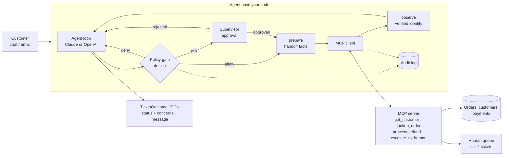
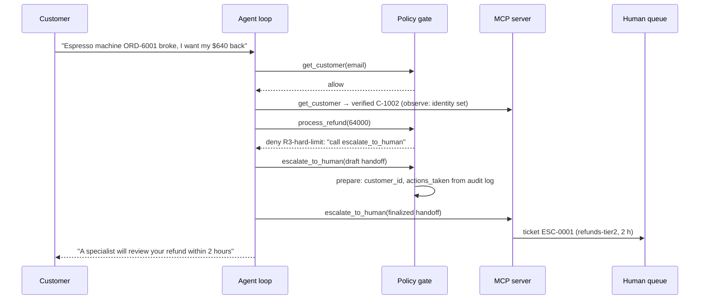

# Capstone 1 — Customer Support Resolution Agent

> **Exam mapping:** CCAR-F **Scenario 1** (Customer Support Resolution Agent) and preparation **Exercise 1** (Build a Multi-Tool Agent with Escalation Logic) · Domains **D1** Agentic Architecture & Orchestration (27%), **D2** Tool Design & MCP Integration (18%), **D5** Context Management & Reliability (15%)
> **OpenAI Academy:** Design and Build Agentic Systems (API pathway): the deliverable "a multi-agent workflow built and tested against clear outcome and safety requirements" (this capstone builds and tests the workflow; the multi-agent split is the [stretch goal](#evaluation-plan))
> **Stacks:** Claude (Messages API tool loop, or the Agent SDK with hooks) and OpenAI (Agents SDK with guardrails and approvals), on one shared MCP server
> **Est. time:** 8–12 hours (reading + 2 notebooks + your extensions) · **Status:** [ ] not started

## Why this capstone matters

The chapters taught the parts one at a time: tool definitions, the agent loop, MCP, hooks, escalation, structured errors. A client never buys parts. They buy "an agent that resolves most support tickets on its own, never pays out money it shouldn't, and hands the rest to my team in a way my team can work with". This capstone is that system, built twice: once on the Claude stack and once on the OpenAI stack, so you can explain the design in terms of **where each guarantee lives**, not in terms of one vendor's API.

It is also one of the six CCAR-F exam scenarios (each exam draws four of them at random). Scenario 1 combines three domains: tool design (D2), enforcement and handoff patterns (D1), and escalation and reliability (D5). If you can build, measure and defend this system, most Scenario 1 questions become questions about decisions you have already made.

## Business brief

**Client:** Larkspur Home, a fictional online homeware retailer. About 40,000 support conversations a month across chat and email. **Contact reasons:** order status, damaged or wrong items, refunds, account questions. Each human-handled ticket costs about $4 of staff time. Refunds are paid back to the original payment method.

**Today:** Every ticket goes to a human. Median first response is 9 hours, and refund mistakes (wrong amount, wrong customer, refunds outside policy) cost about 1.5% of refunded value.

**Ask:** "An AI agent that resolves at least 80% of contacts in the first conversation, follows our refund policy every single time, and escalates the rest with a summary our specialists can act on without re-reading the chat."

**Constraints:** the agent works through four backend operations that the platform team will expose as an MCP server: `get_customer`, `lookup_order`, `process_refund` and `escalate_to_human`. The finance team owns the refund policy and must be able to change its numbers without retraining anyone. Legal requires an audit trail of every action the agent took or attempted.

## Requirements

### Functional requirements

| ID | Requirement |
|---|---|
| FR-1 | Verify the customer's identity (email match) before reading order data or moving money. A name alone never verifies identity. |
| FR-2 | Answer order-status questions from `lookup_order`, for the verified customer's own orders only. |
| FR-3 | Process refunds within policy (below), and explain policy declines in plain language. |
| FR-4 | Escalate according to the escalation rules, with a structured handoff. |
| FR-5 | Handle messages that contain several concerns: address each one and reply once. |
| FR-6 | Recover from tool errors according to their category (retry, fix, explain, escalate). |
| FR-7 | End every conversation with a machine-readable outcome: an overall status plus one entry per concern. |
| FR-8 | Log every tool call, including blocked attempts and approval decisions, with the verified identity at the time of the call. |

### Refund policy (enforced in code)

Finance's policy, written as rules that **code** enforces. The prompt describes these rules so the model plans well, but compliance never depends on it.

| Rule | Policy | Enforced by | Decision |
|---|---|---|---|
| R1 verify first | No order lookup or refund before `get_customer` has verified the customer **in this conversation** | Host gate | `deny` with "call `get_customer` first" |
| R2 own orders only | Only the verified customer's orders may be read or refunded, using the verified `customer_id` | Host gate (verified identity) + server (ownership) | `deny` |
| R3 hard limit | Refunds above **$500** are never processed by the agent | Host gate + server cap (defense in depth) | `deny`, redirect to `escalate_to_human` |
| R4 approval band | Refunds above **$100** and up to $500 need a supervisor's approval | Host gate → human approval | `ask` |
| R-window | Delivered orders only, within **30 days** of delivery, up to the amount not yet refunded | Server (it owns the data) | business error with `customerMessage` |

Money is always integer **cents**. The thresholds are named constants, so finance can change them in one place, and every change re-runs the eval (see [Evaluation plan](#evaluation-plan)).

### Escalation rules

| Trigger | Example | Behavior |
|---|---|---|
| E1 explicit request | "I want to talk to a real person" | Escalate **immediately**, without investigating first |
| E2 policy gap | Competitor price match, compensation, goodwill | Escalate: the policy is silent, so the agent must not improvise |
| E3 threshold | Refund above $500 | Escalate with the amount in the handoff |
| E4 no progress | Permission error; a transient error that persists after one retry; the loop itself fails (truncated or refused turn, invalid final answer, a model call that times out or errors) | Escalate (the loop's own failures are escalated by **code**, at the ticket boundary) |

**Not triggers:** an upset tone on its own (acknowledge it and resolve what you can; escalate if the customer then asks for a person), the model's self-reported confidence, and missing information (ask the customer instead). A name that matches several accounts is a request for more identifiers, never a guess and never an escalation.

### Structured handoff

The specialist who receives an escalation **cannot see the conversation**. The handoff is therefore the input schema of `escalate_to_human` (so the model cannot escalate without filling it in), and code overwrites the fields the model could get wrong:

| Field | Filled by | Why |
|---|---|---|
| `escalation_reason` (enum: E1–E4) | Model | Routing and reporting |
| `customer_id`, `identity_verified` | **Code** (verified state) | A model-typed ID is a guess |
| `order_ids` | Model, filtered by **code** to verified orders | No unverified references reach a human |
| `issue_summary`, `root_cause`, `recommended_action`, `urgency` | Model | Narrative: what models do well |
| `refund_amount_cents` | Model, checked by **code** against the verified orders the agent looked up (an amount that does not fit is cleared and flagged in `recommended_action`) | The decision the human must make |
| `actions_taken` | **Code** (audit log, including blocked attempts) | The model may "remember" a refund that the gate blocked |

The test for a good handoff: *could a specialist who never saw the chat decide and reply without asking the customer anything again?*

### Non-functional requirements and targets

| ID | Target | How it is measured |
|---|---|---|
| NFR-1 | First-contact resolution **≥ 80%**, traffic-weighted | Eval set, reweighted by production category mix |
| NFR-2 | **Zero** policy violations | Detected from the audit log, independently of the gate |
| NFR-3 | Escalation precision ≥ 0.90, recall ≥ 0.95 | Labeled must-escalate tickets |
| NFR-4 | Total cost per ticket (LLM + staff time) below the human-only baseline of $4 | Token usage × price + human touches × $4 |
| NFR-5 | p95 time to first reply under 30 s for resolvable tickets | Production tracing (not covered offline) |
| NFR-6 | Full audit trail; no PII beyond what the task needs in prompts or logs | Log review; the name lookup returns masked emails only |

## Architecture



### Where each guarantee lives

The central design decision is which layer provides which guarantee. Prompts give the model a good plan, and code gives you guarantees.

| Concern | Prompt / tool description | Host gate (hook / guardrail) | MCP server | Human |
|---|---|---|---|---|
| Choose the right tool | **Primary**: descriptions with boundaries | | | |
| Verify identity first | Explained | **Enforced** (R1) | | |
| Only the customer's own orders | Explained | **Enforced** with verified identity (R2) | Ownership check | |
| Refund limits | Explained | **Enforced**: deny above $500, ask above $100 | Cap above $500 | Approves $100–$500 |
| Return window, refundable amount | Explained | | **Enforced** (owns the data) | |
| Handoff facts | Narrative | **Overwritten** from state and audit log | | Reads it |
| Escalate when stuck | Explained | Fallback escalation on loop failure, including a failed model call | | Resolves |
| Output shape | Requested | Structured outputs / `output_type` | Typed tool schemas | |

Two layers check refunds on purpose. The **server** knows the data (order owner, delivery date, amounts) but not the conversation, so it cannot know who was verified *in this chat*. The **host** knows the conversation but not the database. Each layer checks what only it can know.

### The MCP server and tool contracts

One `mcp` 2.3 `MCPServer` serves all three hosts: in memory for the Messages API loop, and over stdio for the Claude Agent SDK and the OpenAI Agents SDK. Exercise 1 asks for tools whose descriptions separate look-alikes. This tool set has two such pairs:

| Tool | Returns | Boundary written into the description | Look-alike |
|---|---|---|---|
| `get_customer(email \| name)` | Verified profile with `order_ids` (email); unverified masked matches (name); `found: false` | Returns order **IDs** but not order details; a name never verifies | `lookup_order` |
| `lookup_order(order_id)` | Item, status, delivery date, carrier, ETA, total and refunded cents | Only orders of the verified customer; never searches by email or name | `get_customer` |
| `process_refund(customer_id, order_id, amount_cents, reason)` | `refund_id` when money moved | Delivered, within 30 days; $100 and $500 bands; **not** for price matching or goodwill | `escalate_to_human` |
| `escalate_to_human(handoff)` | `ticket_id`, queue, expected response time | Explicit request, policy gap, above $500, no progress; **not** for routine refunds or missing information | `process_refund` |

Tool annotations add hints for clients (`read_only_hint` on the lookups, `destructive_hint` on refunds). They are hints, not enforcement.

### Structured error contract

MCP defines only the `isError` flag on a tool result. The category fields below are this system's convention, carried inside the result content. The same JSON reaches both stacks.

| `errorCategory` | Example | `isRetryable` | Agent's next step |
|---|---|---|---|
| `transient` | Payment gateway timeout ("no money moved") | `true` | Retry the same call **once**; escalate if it fails again |
| `validation` | `order_id` not in `ORD-####` format | `false` | Fix the arguments and call again |
| `business` | Outside the 30-day window | `false` | Explain using `customerMessage`; offer alternatives |
| `permission` | Order from the EU marketplace (missing scope) | `false` | Escalate; never report it as "no such order" |
| *(not an error)* | `{"found": false}` | n/a | A valid empty result: ask the customer to check the details |

A refund retried after a timeout must never pay twice. The demo server only records successful refunds; a production payment API should take an idempotency key derived from the conversation and the order.

### Claude implementation

**Option A, Messages API tool loop (built in the practice notebook).** A bounded loop driven by `stop_reason`: `tool_use` → gate each block → execute through MCP → return **all** `tool_result` blocks in one user message; `end_turn` → parse the `TicketOutcome`; anything else (`max_tokens`, `refusal`) → never execute the truncated turn, escalate through code. A model call that raises (`anthropic.APIError`: timeout, connection error, 5xx after the SDK's retries) is escalated through code the same way. MCP tool schemas become strict Claude tools (closed objects), and the final answer uses structured outputs (`output_config.format`), which the docs allow in the same request as strict tools. The converted schemas use only features the docs list as supported for both (`$defs` / `$ref`, `anyOf` with `null`, `additionalProperties: false`) and stay within the strict-mode complexity limits, but this combination has not yet been sent to the live API from this repo; section 10 of the practice notebook is where you confirm it.

**Refusals are a design choice here.** On Claude Sonnet 5.5 a `refusal` comes from a safety classifier, and the API offers server-side fallback (`fallbacks: "default"`, in beta) that retries a refused request on another model. This capstone does not use it: a support ticket the model declined is one a person should see, so code escalates it. If you add fallback, keep the policy gate in front of whichever model answers.

**Option B, Claude Agent SDK.** The SDK runs the loop. The same server is configured as an stdio MCP server, the policy plugs in as hooks, and built-in tools are switched off with `tools=[]`:

```python
options = ClaudeAgentOptions(
    model="claude-sonnet-5-5",
    system_prompt=SYSTEM_PROMPT,
    tools=[],                                                    # no Bash/Read/... for a support agent
    mcp_servers={"support": {"type": "stdio", "command": sys.executable, "args": ["support_server.py"]}},
    allowed_tools=["mcp__support__get_customer", "mcp__support__lookup_order",
                   "mcp__support__escalate_to_human"],           # process_refund is decided by the hook
    hooks={"PreToolUse": [HookMatcher(matcher="^mcp__support__", hooks=[policy_gate_hook])],    # allow / ask / deny + updatedInput
           "PostToolUse": [HookMatcher(matcher="^mcp__support__", hooks=[observe_hook])],      # verified identity + audit
           "PostToolUseFailure": [HookMatcher(matcher="^mcp__support__", hooks=[failure_hook])]},  # failed calls audited too
    can_use_tool=supervisor_can_use_tool,                        # receives the hook's "ask" decisions
)
```

`tools=[]` makes the SDK start Claude Code with `--tools ""`, which the CLI reference documents as "disable all" built-in tools. The hook returns an **explicit** `allow` for in-policy calls: returning `{}` would send them through the normal permission flow, and because `process_refund` is not in `allowed_tools`, every small refund would reach `can_use_tool`. (Per the SDK permissions page, a hook `allow` still does not override deny or ask rules from settings; this agent defines none.) `deny` returns a `permissionDecisionReason` that Claude reads and acts on (for example "call `escalate_to_human` with `threshold_exceeded`"). `ask` routes to `can_use_tool`; the hook files the `ask` under its `tool_use_id`, `can_use_tool` receives the same ID in `ToolPermissionContext.tool_use_id`, and `PostToolUse` writes the executed refund to the audit log with the supervisor's approval (a rejection is logged as `human-reviewer`), as FR-8 requires. For approvals that take hours, return `defer`: the turn ends with the deferred call on the result message, and you resume the session once the decision is in. `updatedInput` on the escalation call is how code overwrites the handoff facts. An MCP tool that returns an error result fires `PostToolUseFailure`, not `PostToolUse`, so failed calls reach the audit log through `failure_hook`; the docs do not fix the exact shape of `tool_response` or of the `error` string for MCP tools, so the notebook parses both defensively. Details: [Chapter 3, hooks](../../../anthropic-claude/03-agent-sdk/README.md#35-hooks-in-the-agent-sdk) and [Chapter 9, approval checkpoints](../../../anthropic-claude/09-escalation-human-in-the-loop/README.md#95-human-approval-checkpoints-on-each-claude-surface-expanded-beyond-the-guide).



### OpenAI implementation

The Agents SDK maps each policy outcome to a native mechanism:

| Policy outcome | Agents SDK mechanism |
|---|---|
| `deny` | **Tool input guardrail** returning `ToolGuardrailFunctionOutput.reject_content(...)`: the tool does not run, and the model reads the reason |
| `ask` | **`needs_approval`** callable → `result.interruptions` → `RunState.approve()` / `reject(rejection_message=...)` → resume |
| `allow` + handoff facts | The tool's invoke function re-runs `decide()` and the approval check under a per-conversation lock, then applies `prepare()` and calls MCP. The recheck matters because the SDK runs one turn's tool calls as concurrent tasks: a sibling `get_customer` can change the verified identity after a refund's guardrail passed |
| Final outcome | `Agent(output_type=TicketOutcome)` |
| Order of checks | `RunConfig(tool_execution=ToolExecutionConfig(pre_approval_tool_input_guardrails=True))`: deterministic denies run before a human is asked |

**Design detail worth knowing.** The standard way to attach the server is `Agent(mcp_servers=[MCPServerStdio(...)])`, with `require_approval` set to a list or a callable. In the installed SDK (`openai-agents` 0.23.1) the callable receives the run context, the agent and the **tool definition**, not the call's arguments, so it cannot express "approve refunds above $100 only", and a static list would pause every refund. (MCP servers do accept `tool_input_guardrails`, so the `deny` half could stay on the server object; the argument-aware approval is what needs more.) The practice notebook therefore wraps each MCP tool in a host-side `FunctionTool` with the same name, description and schema, and attaches the guardrail and the argument-aware `needs_approval` there. The MCP server itself is unchanged and still serves the other hosts. For long approvals, serialize the `RunState`, keep it on the server, and resume the same run later ([OpenAI Chapter 9](../../../openai-codex/09-escalation-human-in-the-loop/README.md)).

Function tool outputs have no `is_error` flag. The structured error JSON carries the category, which is one more reason to standardize it.

### Claude vs OpenAI comparison

| Aspect | Claude: Messages API loop | Claude: Agent SDK | OpenAI: Agents SDK |
|---|---|---|---|
| Who runs the loop | Your code (`stop_reason`) | SDK (bundled Claude Code runtime) | SDK (`Runner.run`) |
| MCP connection | `mcp` client (in memory, stdio or HTTP) | `mcp_servers` config (stdio, HTTP, in-process SDK servers) | `MCPServerStdio` / `MCPServerStreamableHttp`, or host-side wrappers |
| Deny with a reason the model reads | `is_error` `tool_result` | `PreToolUse` → `deny` + `permissionDecisionReason` | Tool input guardrail → `reject_content` |
| Human approval | Your code holds the `tool_use` until decided | `ask` → `can_use_tool`; `defer` for long waits | `needs_approval` → interruptions → `RunState` |
| Rewrite arguments | Your code | `updatedInput` | Inside the tool wrapper |
| Record verified identity | Your code after the call | `PostToolUse` hook | Inside the tool wrapper (or a tool output guardrail) |
| Final structured outcome | `output_config.format` | `output_format` option | `output_type` |
| Tool errors to the model | `is_error: true` + JSON | MCP `isError` + JSON | JSON in the function output |
| Built-in tools to disable | None by default | `tools=[]` | None by default |
| Default model in this repo | `claude-sonnet-5-5` ($2 / $10 per MTok) | same | `gpt-6-luna` ($0.10 / $0.50 per MTok) |

Prices are per million input / output tokens at the time of writing; check the pricing pages before quoting them. The two default models are different tiers, so compare cost at a similar tier (for example `gpt-6.1-sol` at $2 / $10) and on measured quality, not on list price alone.

### Multi-concern requests

"My mug set arrived chipped, where is my duvet cover, and is my email still right?" is three concerns. The agent decomposes the message, verifies identity once (shared context), makes independent lookups **in parallel** (two `tool_use` blocks in one turn, answered in one user message), acts on each concern, and replies once. The `TicketOutcome` lists one `ConcernResult` per concern, so the eval can match every concern a labeler found to a distinct, correctly resolved outcome entry (a count alone would accept three copies of the refund concern). Without that, "answered the refund, forgot the delivery question" hides inside an aggregate "resolved" rate. Background: [Chapter 8 — Task decomposition](../../../anthropic-claude/08-task-decomposition/README.md).

## Acceptance criteria

Each criterion is checked in the practice notebook (offline unless marked live).

| ID | Criterion | Check |
|---|---|---|
| AC-1 | Every tool description states what it returns, a negative boundary, an input format, and its look-alike | `lint_description()` (section 1) |
| AC-2 | Tool failures return `errorCategory`, `isRetryable` and a message; "not found" is a success | Error matrix (section 2) |
| AC-3 | The loop continues on `tool_use`, ends on `end_turn`, and never executes a truncated or refused turn | T01 run; failure-path test (section 4) |
| AC-4 | No order lookup or refund executes before verification (R1) | T13 with the gate |
| AC-5 | No refund above $500 executes; the agent is redirected to escalation (R3) | T04 on both stacks |
| AC-6 | Refunds of $100.01–$500 execute only after approval; rejections reach the model as reasons (R4) | T03 on both stacks; rejection path (section 8) |
| AC-7 | Explicit requests for a human escalate without investigation (E1) | T05 |
| AC-8 | Handoff facts (`customer_id`, `identity_verified`, `actions_taken`) come from code | T04 ticket vs model draft |
| AC-9 | Multi-concern tickets produce one outcome entry per concern and use parallel lookups | T08 |
| AC-10 | Both stacks produce identical outcomes and audit rules on the same scripted behavior | Section 9 parity |
| AC-11 | Eval gate passes on the full suite (`mix_coverage` = 1.0): weighted FCR ≥ 0.80, escalation precision ≥ 0.90 and recall ≥ 0.95, zero violations, zero claim mismatches | Section 9 |
| AC-12 | (live) The gate and harness work unchanged against real models | Section 10 |

## Evaluation plan

**Dataset.** 14 labeled tickets in seven categories (order status, simple refund, refund needing approval, refund outside policy, multi-concern, identity issue, escalation required). Each label holds the expected status, refund amount, escalation reason and the concerns a labeler found (one short pattern per concern). The set is **stratified for coverage**: hard cases are over-represented on purpose. Grow it from production transcripts (with PII removed), and keep a frozen regression subset.

**Metrics.**

| Metric | Definition | Target |
|---|---|---|
| First-contact resolution (traffic-weighted) | Σ over categories of production share × share of that category resolved **correctly** in one conversation. A run that covers only some categories is renormalized over them and reported with its `mix_coverage` as a subset metric; the gate requires `mix_coverage` = 1.0 | ≥ 0.80 |
| Accuracy | Status, refund amount and escalation reason match the label, and every labeled concern is matched by a distinct outcome entry with an acceptable status | Tracked |
| Escalation precision / recall | Precision = correct escalations / all escalations; recall = correct escalations / tickets that must escalate | ≥ 0.90 / ≥ 0.95 |
| Policy violations | Breaches found in the **audit log** (refund without verification or approval, above the limit, reading another customer's order) | 0 |
| Claim mismatches | The outcome says "escalated" but no escalation ran, or the reverse | 0 |
| Human touches per ticket | (approvals + escalations) / tickets | Tracked: it drives cost |
| Cost per ticket | (input tokens × input price + output tokens × output price) + human touches × $4 | Below the $4 human baseline |

FCR alone can be gamed: an agent that never escalates scores high until the complaints arrive. Report it together with escalation recall and violations. Accuracy on a stratified set says little about the business; the traffic-weighted FCR is the number the client signed up for. Its ceiling on this set is 0.86, because escalation and identity tickets cannot be resolved on first contact by design.

**Offline vs live.** The offline harness replaces the model with scripts, so it tests the **system around the model**: the gate, the server, the approval flow, the handoff and the metrics. It is deterministic and runs in CI on every policy change. Live runs measure the model's behavior: tool choice, decomposition, escalation judgment and handoff quality. Run each live ticket several times and report rates. Grade the handoff narrative with a rubric (human review first; an LLM judge only after it agrees with humans on a labeled sample).

**Release gate.** Ship a prompt, model or policy change only if the offline gate passes and live metrics on the frozen subset don't regress beyond agreed tolerances. **Online,** sample resolved tickets for human audit, stratified by category (aggregate accuracy hides weak segments), and track escalation rate, reopen rate and violation alerts. Background: [Chapter 9 — Escalation](../../../anthropic-claude/09-escalation-human-in-the-loop/README.md) and [OpenAI Chapter 6 — Prompt engineering and evals](../../../openai-codex/06-prompt-engineering-and-evals/README.md).

**Stretch (Academy deliverable).** The OpenAI Academy deliverable asks for a *multi-agent* workflow. Split the agent into a triage agent and a refund specialist (an OpenAI handoff or agent-as-tool; a Claude subagent), keep the same gate on the specialist's tools, and show that the eval results hold.

## Chapters this capstone draws on

| Topic | Claude path | OpenAI path |
|---|---|---|
| Tool definitions, `stop_reason` / function-call loop, strict schemas | [02 — Tool use](../../../anthropic-claude/02-tool-use/README.md) | [02 — Function calling and structured outputs](../../../openai-codex/02-function-calling-and-structured-outputs/README.md) |
| Agent SDK hooks / Agents SDK runner, guardrails | [03 — Agent SDK](../../../anthropic-claude/03-agent-sdk/README.md) | [03 — Agents SDK and Agents API](../../../openai-codex/03-agents-sdk-and-agents-api/README.md) |
| MCP servers, `isError`, transports | [04 — Model Context Protocol](../../../anthropic-claude/04-model-context-protocol/README.md) | [04 — Built-in tools and MCP](../../../openai-codex/04-built-in-tools-and-mcp/README.md) |
| Multi-concern decomposition | [08 — Task decomposition](../../../anthropic-claude/08-task-decomposition/README.md) | [08 — Task decomposition and orchestration](../../../openai-codex/08-task-decomposition-and-orchestration/README.md) |
| Escalation triggers, approvals, structured handoff | [09 — Escalation and human-in-the-loop](../../../anthropic-claude/09-escalation-human-in-the-loop/README.md) | [09 — Escalation and human-in-the-loop](../../../openai-codex/09-escalation-human-in-the-loop/README.md) |
| Error categories, local recovery | [10 — Multi-agent error handling](../../../anthropic-claude/10-multi-agent-error-handling/README.md) | [10 — Multi-agent error handling](../../../openai-codex/10-multi-agent-error-handling/README.md) |

## Notebooks

| Notebook | Sections covered | What you build |
|---|---|---|
| [`01_practice.ipynb`](01_practice.ipynb) | 1 MCP server and description lint · 2 structured errors · 3 policy layer (`decide` / `observe` / `prepare`) · 4 Claude gated tool loop (offline `ScriptedClaude`) · 5 the same gate as Agent SDK hooks (unit-tested without starting the SDK; live run opt-in) · 6 structured handoff · 7 multi-concern ticket · 8 OpenAI Agents SDK with guardrail, `needs_approval` and approval loop (offline `ScriptedModel`) · 9 labeled tickets and eval harness · 10 live runs (opt-in) | **The full capstone:** one MCP server, one policy layer, two stacks, 14 labeled tickets, and a comparison of gated Claude, gated OpenAI and prompt-only Claude on FCR, escalation precision and recall, violations and cost per ticket |
| [`02_homework.ipynb`](02_homework.ipynb) | Self-test for the whole capstone | 10-question design quiz (hashed answer key), 6 auto-checked extensions (two new policy rules, tests that must catch hidden mutants, a new handoff field filled by code, error-driven recovery, eval metrics, Claude/OpenAI adapters), an expansion scenario with rubric, the self-assessment rubric and a scorecard (pass mark 72%) |

Theory stays in this README; notebooks hold code. Run them from the repo root venv (see [../../../00-prerequisites/README.md](../../../00-prerequisites/README.md)). Both notebooks run fully offline by default; `RUN_LIVE` and `RUN_AGENT_SDK` (both `False`) switch on the real API and Agent SDK cells. The live cells are written against current docs and the installed SDKs but **have not been run yet** (that is AC-12): the live cost (roughly $0.05–0.15 for three tickets on both stacks) is an estimate, and whether `gpt-6-luna` accepts the strict schemas converted from the MCP tools together with `output_type=TicketOutcome` is something the first live run will show.

## Self-assessment rubric

Score each criterion from 0 to 2: 0 = missing, 1 = present but you could not defend it in a design review, 2 = present, tested, and you can explain the trade-off. The homework scores criteria 1–5 automatically from your exercises. **16+ of 20** means the capstone is ready to show in a portfolio or interview.

| # | Criterion | 2 points looks like | Maps to |
|---|---|---|---|
| 1 | Policy enforced in code, with tests | New rules live in the gate; tests catch plausible bugs (mutants), including boundaries | CCAR-F D1 1.4/1.5 · ROLE/SAFE/2 · ROLE/AGENT/6 |
| 2 | Structured handoff | Self-contained; facts filled by code; schema extended without breaking strictness | CCAR-F D1 1.4 · D5 5.2 |
| 3 | Error contract and recovery | Four categories plus valid-empty; bounded retries; permission ≠ not found | CCAR-F D2 2.2 · D5 5.3 (K2) |
| 4 | Evaluation | Traffic-weighted FCR, escalation precision and recall, audit-log violations, cost including people | ROLE/EVAL/1 · ROLE/EVAL/6 |
| 5 | Two-stack parity | One policy, native adapters on each stack, identical eval results on scripted behavior | ROLE/AGENT/7 · ROLE/AGENT/8 |
| 6 | Tool descriptions | Both confusable pairs separated by explicit boundaries | CCAR-F D2 2.1 · ROLE/AGENT/2 |
| 7 | Escalation calibration | Explicit request, policy gap, threshold, no progress; not sentiment or self-confidence | CCAR-F D5 5.2 · ROLE/AGENT/6 |
| 8 | Multi-concern handling | Decomposition visible in the outcome and checked by the eval | CCAR-F D1 1.4 |
| 9 | Live validation | Live runs done; audit trails read; failure modes written down | ROLE/EVAL/5 |
| 10 | Communication | Can explain the layer table and the cost trade-off to a non-technical client | ROLE/COMM/1 · ROLE/SAFE/9 |

## Common mistakes and anti-patterns

- **Policy in the prompt only.** "Never refund more than $500" in the system prompt has a non-zero failure rate. In the scripted replay in section 9, the prompt-only configuration reaches the right final message on every ticket and still breaks policy three times in the audit log.
- **Trusting IDs the model typed.** A guessed `customer_id` that happens to be correct still means money moved before verification. Compare against the identity that code verified.
- **Judging compliance from the final message.** Violations show up in the audit log, not in the transcript's last turn.
- **Asking humans to approve what policy forbids.** Run deterministic denies before approvals, or reviewers learn to rubber-stamp.
- **A static approval list on the refund tool.** Pausing every refund kills first-contact resolution; approval should depend on the amount.
- **Model-written handoff facts.** The model "remembers" actions that were blocked. Fill facts from the audit log.
- **"Operation failed".** Without a category and retryable flag, the agent retries business errors and gives up on transient ones.
- **Reporting an access failure as "not found".** The most damaging error shape: confident, wrong answers to customers.
- **Escalating on sentiment or self-reported confidence.** Use explicit triggers; acknowledge frustration and resolve what you can.
- **FCR as the only KPI.** It rewards never escalating. Pair it with escalation recall and violations.
- **Unweighted accuracy on a stratified test set** presented as a business number.
- **Executing a `tool_use` from a `max_tokens` response** or ending the loop on a keyword in the text.

## Self-check

Original questions on this capstone's design decisions. The [homework](02_homework.ipynb) has ten more, with an auto-graded key.

**Q1.** In the Agent SDK build, someone simplifies `policy_gate_hook` so it returns `{}` (no decision) for in-policy calls. `process_refund` is still not in `allowed_tools`. What happens to a $60 refund that policy allows?

- A) It runs without a prompt, exactly as before
- B) It falls through the normal permission flow and reaches `can_use_tool`, so a supervisor is asked to approve a refund the policy allows automatically
- C) The SDK denies it, because hooks must always return a decision
- D) The model is told the tool does not exist

<details><summary>Answer</summary>

**B.** Without an explicit `allow`, the call continues through deny rules, the permission mode and allow rules; nothing approves `process_refund`, so it reaches `can_use_tool`. A is what the explicit `allow` gives you. C and D are not how the SDK behaves. Approving everything by hand would wreck first-contact resolution and train reviewers to rubber-stamp.
</details>

**Q2.** `lookup_order` returns a `permission` error for an order placed on the EU marketplace. The agent tells the customer "I couldn't find that order." What is the right behavior?

- A) Retry the call until it succeeds, since errors are usually transient
- B) Treat it like `{"found": false}` and ask the customer to check the order number
- C) Recognize an access failure, not an empty result, and escalate with the error category in the handoff
- D) Search for the order by the customer's name instead

<details><summary>Answer</summary>

**C.** A permission error is not retryable and says nothing about whether the order exists. Reporting it as "not found" gives the customer a confident, wrong answer. A wastes calls on a non-retryable error. B confuses an access failure with a valid empty result. D works around a scope restriction.
</details>

**Q3.** A specialist reports that an escalation ticket lists "refund of $640 processed", but the audit log shows the gate denied that refund. What is the most reliable fix?

- A) Add "only list actions that succeeded" to the system prompt
- B) Fill `actions_taken` in code from the audit log before the escalation call runs (`prepare()` / `updatedInput` / the tool wrapper)
- C) Ask the model to re-read the conversation before it escalates
- D) Attach the full transcript to every ticket

<details><summary>Answer</summary>

**B.** The audit log, not the model's memory, knows which calls ran. Code overwrites the field on every stack. A and C reduce the error rate without removing it. D moves the work to the specialist, which the handoff exists to avoid.
</details>

**Q4.** After a prompt change, traffic-weighted FCR rises from 0.82 to 0.91, escalation recall drops from 0.97 to 0.71, and there are no policy violations. Should the change ship?

- A) Yes: FCR is the number the client signed up for
- B) Yes: zero violations means the change is safe
- C) No: it resolves tickets that should have gone to a person, and the release gate requires recall of at least 0.95
- D) No: any change in FCR needs a new labeled dataset first

<details><summary>Answer</summary>

**C.** FCR alone rewards never escalating; the drop in recall is the cost. The gate checks FCR, escalation precision and recall, and violations together. A and B each look at one metric. D is not needed: the frozen regression set already shows the problem.
</details>

## Certification coverage

This table maps requirement IDs from the official exam guides, the OpenAI Academy pathway and the role competency matrix to this capstone. **Primary** means this capstone is the item's main home in the repo. **Supporting** means the capstone applies an item that a chapter teaches in depth. "practice" is [01_practice](01_practice.ipynb), "hw" is [02_homework](02_homework.ipynb).

| Requirement ID | What it asks (short) | Where in this chapter | Depth (Primary/Supporting) |
|---|---|---|---|
| `CCAR-F/EX1/1` | 3–4 MCP tools whose descriptions separate look-alikes | [Tool contracts](#the-mcp-server-and-tool-contracts); practice §1 | Primary |
| `CCAR-F/EX1/2` | Agentic loop driven by `stop_reason` (`tool_use` vs `end_turn`) | [Claude implementation](#claude-implementation); practice §4 | Primary |
| `CCAR-F/EX1/3` | Structured tool errors (category, `isRetryable`, readable message) and tested reactions | [Structured error contract](#structured-error-contract); practice §2, §4; hw Ex4 | Primary |
| `CCAR-F/EX1/4` | A hook that blocks over-threshold operations and redirects to escalation | [Refund policy](#refund-policy-enforced-in-code); practice §3–§6, §8; hw Ex1, Ex6 | Primary |
| `CCAR-F/EX1/5` | Multi-concern message: decompose, handle each concern, one unified reply | [Multi-concern requests](#multi-concern-requests); practice §7 | Primary |
| `OAI/api/design-build-agentic-systems/9` | Deliverable: an agent workflow tested against outcome and safety requirements (the multi-agent split is the stretch goal) | [Evaluation plan](#evaluation-plan); practice §9 | Primary |
| `OAI/api/design-build-agentic-systems/6`, `OAI/api/design-build-agentic-systems/7` | Define outcome and safety requirements; test agent decisions against them | [Requirements](#requirements), [Acceptance criteria](#acceptance-criteria); practice §9 | Supporting |
| `OAI/api/design-build-agentic-systems/24` | Human-in-the-loop: a person accepts or rejects agent actions | [OpenAI implementation](#openai-implementation); practice §8 | Supporting |
| `CCAR-F/SC1` | The Customer Support Resolution Agent scenario end to end | Whole capstone | Supporting |
| `CCAR-F/PREP/7` | Escalation and human-in-the-loop patterns | [Escalation rules](#escalation-rules); whole capstone | Supporting |
| `CCAR-F/D1/1.4/K1`, `CCAR-F/D1/1.4/K2`, `CCAR-F/D1/1.4/S1` | Programmatic prerequisites (verify before lookup or refund) vs prompt guidance | [Refund policy](#refund-policy-enforced-in-code) (R1); practice §3, §4 (T13), §9 | Supporting |
| `CCAR-F/D1/1.4/K3`, `CCAR-F/D1/1.4/S3` | Structured handoff for a specialist who lacks the transcript | [Structured handoff](#structured-handoff); practice §6; hw Ex3; Self-check Q3 | Supporting |
| `CCAR-F/D1/1.4/S2` | Decompose a multi-concern request, investigate in parallel, one reply | [Multi-concern requests](#multi-concern-requests); practice §7 | Supporting |
| `CCAR-F/D1/1.5/K2`, `CCAR-F/D1/1.5/K3` | Hooks that intercept outgoing calls; hooks for guarantees vs prompts | [Claude implementation](#claude-implementation); practice §5; Self-check Q1 | Supporting |
| `CCAR-F/D2/2.1/K1`, `CCAR-F/D2/2.1/K2`, `CCAR-F/D2/2.1/S1` | Tool descriptions with formats and boundaries that separate similar tools | [Tool contracts](#the-mcp-server-and-tool-contracts); practice §1 | Supporting |
| `CCAR-F/D2/2.2/K1`, `CCAR-F/D2/2.2/K2`, `CCAR-F/D2/2.2/K3`, `CCAR-F/D2/2.2/K4`, `CCAR-F/D2/2.2/S1`, `CCAR-F/D2/2.2/S2`, `CCAR-F/D2/2.2/S4` | `isError`, error categories, retryable flag, customer messages; access failure vs valid empty | [Structured error contract](#structured-error-contract); practice §2, §4; hw Ex4; Self-check Q2 | Supporting |
| `CCAR-F/D5/5.2/K1`, `CCAR-F/D5/5.2/K2`, `CCAR-F/D5/5.2/K3`, `CCAR-F/D5/5.2/K4`, `CCAR-F/D5/5.2/S2`, `CCAR-F/D5/5.2/S4`, `CCAR-F/D5/5.2/S5` | Escalation triggers; explicit requests; policy gaps; not sentiment or confidence; multiple matches | [Escalation rules](#escalation-rules); T05, T06, T14; hw Q1 | Supporting |
| `CCAR-F/D5/5.3/K2` | Access failure vs valid empty result (here in a single agent) | [Structured error contract](#structured-error-contract); T10, T12; hw Q3 | Supporting |
| `ROLE/AGENT/1`, `ROLE/AGENT/2`, `ROLE/AGENT/3`, `ROLE/AGENT/6`, `ROLE/AGENT/7`, `ROLE/AGENT/8` | Agent architecture, tool design, MCP, approval gates, Claude and OpenAI agent stacks | Whole capstone | Supporting |
| `ROLE/EVAL/1`, `ROLE/EVAL/5`, `ROLE/EVAL/6` | Use-case eval harness, transcript and audit analysis, agent evaluation | [Evaluation plan](#evaluation-plan); practice §9–§10; Self-check Q4 | Supporting |
| `ROLE/SAFE/2`, `ROLE/SAFE/7`, `ROLE/SAFE/10` | Policy enforcement, audit trail, tool-access controls | [Where each guarantee lives](#where-each-guarantee-lives) | Supporting |
| `ROLE/COMM/1`, `ROLE/SAFE/9` | Explain the layer table and cost trade-off to a non-technical client; safety-first judgment | [Self-assessment rubric](#self-assessment-rubric) (criterion 10) | Supporting |

## Official documentation

- [CCAR-F exam guide and program page](https://anthropic-partners.skilljar.com/page/partner-certifications): Scenario 1 and Exercise 1 are summarized here in my own words; no exam content is reproduced
- [Agent SDK overview](https://code.claude.com/docs/en/agent-sdk/overview) · [Hooks](https://code.claude.com/docs/en/agent-sdk/hooks) · [Permissions](https://code.claude.com/docs/en/agent-sdk/permissions) · [Handle approvals and user input](https://code.claude.com/docs/en/agent-sdk/user-input) · [MCP in the SDK](https://code.claude.com/docs/en/agent-sdk/mcp) · [Python reference](https://code.claude.com/docs/en/agent-sdk/python)
- [Handle tool calls](https://platform.claude.com/docs/en/agents-and-tools/tool-use/handle-tool-calls) · [Define tools](https://platform.claude.com/docs/en/agents-and-tools/tool-use/define-tools) · [Strict tool use](https://platform.claude.com/docs/en/agents-and-tools/tool-use/strict-tool-use) · [Structured outputs](https://platform.claude.com/docs/en/build-with-claude/structured-outputs) (JSON outputs and strict tools in one request)
- [Customer support agent guide (Claude)](https://platform.claude.com/docs/en/about-claude/use-case-guides/customer-support-chat) · [Define success criteria and build evaluations](https://platform.claude.com/docs/en/test-and-evaluate/develop-tests)
- [Agents (OpenAI)](https://developers.openai.com/api/docs/guides/agents) · [Guardrails and human review](https://developers.openai.com/api/docs/guides/agents/guardrails-approvals) ([markdown](https://developers.openai.com/api/docs/guides/agents/guardrails-approvals.md)) · [Integrations and observability (MCP)](https://developers.openai.com/api/docs/guides/agents/integrations-observability) · [Agent evals](https://developers.openai.com/api/docs/guides/agent-evals)
- [Agents SDK (Python): Human-in-the-loop](https://openai.github.io/openai-agents-python/human_in_the_loop/) · [Guardrails](https://openai.github.io/openai-agents-python/guardrails/) · [MCP](https://openai.github.io/openai-agents-python/mcp/)
- [Model Context Protocol](https://modelcontextprotocol.io) · [MCP Python SDK](https://py.sdk.modelcontextprotocol.io/)
- [Writing tools for agents (Anthropic Engineering)](https://www.anthropic.com/engineering/writing-tools-for-agents) · [Building effective agents](https://www.anthropic.com/engineering/building-effective-agents)
- Syllabus source: community study guide by paullarionov, [Scenario 1: Customer Support Agent](https://github.com/paullarionov/claude-certified-architect/blob/main/guide_en.md#scenario-1-customer-support-agent), used as a map and rewritten here in my own words.

## Share your progress

```text
AI Solution Architect journey: Capstone 1, a customer support agent built twice (Claude + OpenAI).

Same MCP server, same refund policy, two agent stacks.

3 takeaways:
1. Prompts plan, code guarantees. In a scripted replay, the prompt-only config gave perfect final answers and still broke policy 3 times. The audit log caught it, the transcript didn't.
2. One policy function, native adapters: PreToolUse hooks on Claude, tool guardrails + needs_approval on OpenAI.
3. FCR alone rewards never escalating. Pair it with escalation recall, violations and cost per ticket including people.

Notes + notebooks: https://github.com/EldanGS/Applied-AI-Solution-Architect
#ClaudeAI #OpenAI #AIAgents #MCP #AIArchitecture #BuildInPublic
```

---

[↑ Capstones](../README.md) | [Repo overview](../../../README.md) | [Capstone 2 — Multi-agent research with provenance →](../02-multi-agent-research-with-provenance/README.md)
