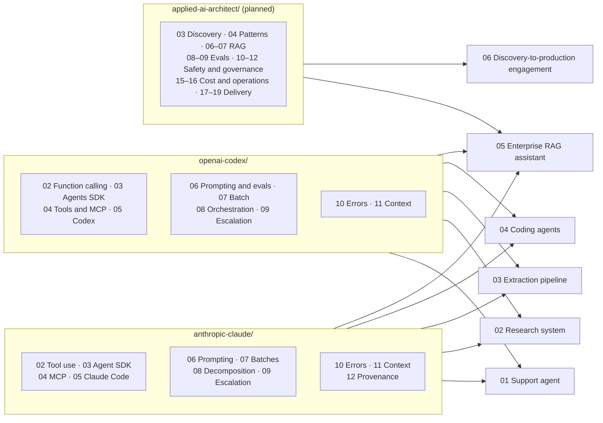

# Capstones: End-to-End Builds in Claude and OpenAI

> **Serves:** CCAR-F (all six official scenarios and all four preparation exercises), CCAR-P (the "build one end-to-end solution" advice), OpenAI Academy course deliverables, and the role competency matrix · **Status:** capstones 01–04 in progress, 05–06 planned · **Facts checked:** 2026-10-03

A chapter teaches one topic. A capstone gives you **one customer problem** and asks you to solve it the way an applied AI architect would. You scope it, design it, build it, measure it, make it safe, and explain the trade-offs. Each capstone pulls together several chapters from all three tracks. It is built **twice, once on Claude and once on OpenAI**, on the same data, tools and evals, so the comparison is fair. What you finish with is a portfolio piece you can walk an interviewer through.



---

## Contents

- [What makes a capstone different from a chapter](#what-makes-a-capstone-different-from-a-chapter)
- [The six capstones](#the-six-capstones)
- [Mapping to the official CCAR-F scenarios and exercises](#mapping-to-the-official-ccar-f-scenarios-and-exercises)
- [Capstone briefs](#capstone-briefs)
- [Uniform structure](#uniform-structure)
- [Grading rubric approach](#grading-rubric-approach)
- [Exam integrity](#exam-integrity)
- [Certification coverage](#certification-coverage)
- [Progress tracker](#progress-tracker)

---

## What makes a capstone different from a chapter

| | Chapter | Capstone |
|---|---|---|
| **Starts from** | A concept ("tool use", "context management") | A customer brief with a business goal, constraints and a success metric |
| **Vendors** | One (vendor tracks) or both behind a small interface (applied track) | Both, as two complete builds that share data, tool contracts and the eval suite |
| **Scope** | One topic, with a mini-project | Several chapters combined into one working system |
| **Self-test** | Quiz, auto-checked exercises, one scenario | A rubric-based self-assessment backed by evidence: eval results, traces, configs and a written comparison |
| **Output** | Understanding | A portfolio artifact: working code, a design write-up and a Claude vs OpenAI comparison |
| **Time** | About 4–8 hours | Roughly 8–16 hours each (estimates; each capstone README gives its own) |

---

## The six capstones

| # | Capstone | Customer problem | Certification and course mapping | Main role competencies | Combines |
|---|---|---|---|---|---|
| 01 | [Customer support resolution agent](01-support-resolution-agent/README.md) | Resolve order, refund and account issues on first contact, and know when to hand over to a human | CCAR-F SC1, EX1 (D1, D2, D5); OpenAI "Design and Build Agentic Systems" deliverable (outcome and safety requirements, with capstone 02) | Agent architecture, tool design, MCP, human-in-the-loop, agent evaluation, securing tool access | Claude 02, 03, 04, 08, 09, 10 · OpenAI 02, 03, 04, 08, 09, 10 |
| 02 | [Multi-agent research system with provenance](02-multi-agent-research-with-provenance/README.md) | Produce a cited research report from several sources, and say clearly what is contested or missing | CCAR-F SC3, EX4 (D1, D2, D5); OpenAI "Design and Build Agentic Systems" deliverable (the multi-agent workflow, with capstone 01) | Multi-agent orchestration, context management, hallucination mitigation and citations, resilience | Claude 03, 08, 10, 11, 12 · OpenAI 03, 08, 10, 11 |
| 03 | [Structured extraction pipeline at scale](03-extraction-pipeline-at-scale/README.md) | Extract validated fields from 100 mixed-format documents overnight, and send uncertain fields to people | CCAR-F SC6, EX3 (D4, D5) | Structured outputs, batch processing, cost trade-offs, representative datasets, human review routing | Claude 02, 06, 07, 09 · OpenAI 02, 06, 07, 09 |
| 04 | [Coding agents for a team](04-coding-agents-for-a-team/README.md) | Roll out a coding agent to a team with shared standards, safe tool access and automated PR review | CCAR-F SC2, SC4, SC5, EX2 (D3, D2, plus D1, D4 and D5 through the scenarios); OpenAI "Get Started with Codex" deliverable | AI coding agents, MCP, the Claude and OpenAI agent stacks, regression gates, technical documentation | Claude 04, 05 · OpenAI 04, 05 (later also the planned Claude 13, 19, 20 and OpenAI 13, 19, 20) |
| 05 | `05-enterprise-rag-assistant` (planned) | Answer employee policy questions from permitted documents only, with citations, a release gate, tracing and a cost dashboard | CCAR-P preparation advice; CCAR-P D3, D4; OpenAI "Build with RAG" deliverable | RAG (all seven competencies), evaluation, observability, permission-aware access, cost-latency trade-offs | Applied 06, 07, 08, 09, 15, 16 · Claude 12 · OpenAI 04 |
| 06 | `06-discovery-to-production-engagement` (planned) | Take a fictional company from first discovery call to a governed pilot and a handoff pack | CCAR-P D1, D5, D6; OpenAI "AI Leadership" deliverable (AI strategy brief) and "Scope AI Solutions" skills | Discovery and value case, ownership under ambiguity, executive communication, POC to production, compliance, documentation | Applied 03, 04, 08, 12, 17, 18, 19 |

Capstones 05 and 06 are planned; their folders are listed without links until their READMEs exist.

Every capstone also covers a top-demanded role competency that no exam tests directly: **explaining a trade-off to a non-technical stakeholder.** Each capstone ends with a one-page "Claude or OpenAI for this customer?" recommendation.

---

## Mapping to the official CCAR-F scenarios and exercises

The CCAR-F exam guide (v1.0) lists **six scenarios**. Each exam draws four of them at random. The guide also describes **four preparation exercises**. Capstones 01–04 cover every scenario and every exercise, so whichever four scenarios you get, you will have built a system like it.

| Official item | Name in the exam guide | Primary domains | Capstone |
|---|---|---|---|
| SC1 | Customer Support Resolution Agent | D1, D2, D5 | 01 |
| SC2 | Code Generation with Claude Code | D3, D5 | 04 |
| SC3 | Multi-Agent Research System | D1, D2, D5 | 02 |
| SC4 | Developer Productivity with Claude | D2, D3, D1 | 04 |
| SC5 | Claude Code for Continuous Integration | D3, D4 | 04 |
| SC6 | Structured Data Extraction | D4, D5 | 03 |
| EX1 | Build a Multi-Tool Agent with Escalation Logic | D1, D2, D5 | 01 |
| EX2 | Configure Claude Code for a Team Development Workflow | D3, D2 | 04 |
| EX3 | Build a Structured Data Extraction Pipeline | D4, D5 | 03 |
| EX4 | Design and Debug a Multi-Agent Research Pipeline | D1, D2, D5 | 02 |

Domain key: D1 Agentic Architecture & Orchestration (27%), D2 Tool Design & MCP Integration (18%), D3 Claude Code Configuration & Workflows (20%), D4 Prompt Engineering & Structured Output (20%), D5 Context Management & Reliability (15%).

Capstones 05 and 06 have no CCAR-F scenario. RAG, evaluation programs, governance and stakeholder work are CCAR-P territory, and CCAR-F lists embedding-model and vector-database implementation details as out of scope.

The exercises' step lists live in the official guide. Each capstone README links to the guide and restates every step in its own words as a checklist, but it does not copy the guide's text.

---

## Capstone briefs

Each brief below is the short version. The capstone's own README has the full customer brief, the architecture and the rubric.

### 01 · Customer support resolution agent

- **Build:** a support agent with four tools on one MCP server: look up the customer, look up the order, issue a refund, escalate to a human. The tools form two look-alike pairs, so the descriptions have to do the routing. The agent loop continues on `stop_reason: "tool_use"` and stops on `"end_turn"`; any other stop reason is never executed and code escalates instead. Tools return structured errors (category, retryable flag, readable message). The refund policy is enforced in code, not in the prompt: verify identity first, refunds above $100 need a supervisor's approval, refunds above $500 are denied and redirected to escalation. Escalations carry a structured handoff whose facts code fills from the audit log. The agent splits a multi-concern message into separate issues and answers them in one reply.
- **Claude stack:** a hand-written `stop_reason` loop on the Messages API with a policy gate (the main build), plus an Agent SDK variant where the same policy runs as `PreToolUse` / `PostToolUse` / `PostToolUseFailure` hooks and `can_use_tool` handles approvals. The MCP server runs in memory for the loop and over stdio for the SDK.
- **OpenAI stack:** OpenAI Agents SDK with host-side function-tool wrappers around the same MCP tools: a tool input guardrail for the denials and an amount-aware `needs_approval` for the approval band.
- **Measure:** traffic-weighted first-contact resolution, escalation precision and recall on 14 labelled tickets, policy violations found in the audit log (target: zero), and cost per ticket including staff time, for each stack and for a prompt-only baseline.

### 02 · Multi-agent research system with provenance

- **Build:** a coordinator that sends search and document-analysis subagents out in parallel and passes each one exactly the context it needs. Subagents return claims kept apart from their metadata: evidence excerpt, source and date. A simulated subagent timeout must reach the coordinator as a structured error with the partial results, and the final report must flag the coverage gap. Conflicting sources are reported side by side with attribution, not merged into one answer.
- **Claude stack:** an orchestrator-workers build on the Messages API (parallel workers with `asyncio`, Citations for provenance), plus the exam's own framing as a variant: an Agent SDK coordinator with subagents defined through `AgentDefinition` and spawned with the Agent tool (the exam guide calls it `Task`).
- **OpenAI stack:** an orchestrator agent that calls specialist agents as tools (`Agent.as_tool`), keeping control of the conversation.
- **Measure:** citation accuracy (does every claim trace to a source that supports it?), coverage-gap reporting, how contested facts are handled, and latency in parallel vs sequential runs.

### 03 · Structured extraction pipeline at scale

- **Build:** an extraction schema with required, optional and nullable fields and an enum with an "other" value plus a detail field. Missing data must come back as null, never invented. A validation-retry loop feeds the document, the failed extraction and the specific errors back to the model and records which errors a retry can fix and which it cannot. Few-shot examples cover different document layouts and are chosen on a labelled sample. A 100-document batch run resubmits only the failures by `custom_id`, each with the right modification (chunking, a larger output cap, feedback, or as is), and SLA arithmetic decides when retries go synchronous. Field-level confidence is calibrated per document type and field on a labelled set, low-confidence fields go to a capacity-limited review queue, and accuracy is reported per document type and per field next to the aggregate.
- **Claude stack:** strict tool schemas or structured outputs, and the Message Batches API.
- **OpenAI stack:** Structured Outputs and the Batch API (JSONL uploaded through the Files API).
- **Measure:** accuracy by document type and field (next to the aggregate), fabricated values on documents with absent fields, fixable vs unfixable retry issues, review load against the clerks' capacity, and cost per accepted document including human review, in batch and synchronous mode.

### 04 · Coding agents for a team

- **Build:** one sample repository set up for both coding agents. It has shared standards, path-scoped rules, a project skill that runs in isolation, an MCP server whose credentials come from environment variables, and a personal server kept separate from the team config. It also has a CI job that reviews pull requests with structured, low-noise findings and generates tests. A plan-mode vs direct-execution comparison covers three tasks of increasing complexity. Every change ships with the evidence a reviewer needs, as the Codex pathway asks.
- **Claude stack:** `CLAUDE.md`, `.claude/rules/`, `.claude/skills/`, `.mcp.json`, plan mode, and headless `claude -p` in CI.
- **OpenAI stack:** `AGENTS.md`, Codex skills, MCP in `config.toml`, approval and sandbox policies, and `codex exec` or `openai/codex-action@v1` in CI.
- **Measure:** review precision (real issues vs noise), test pass rates, how well the config respects least privilege, and how fast a new teammate gets the same results.
- **Note: changed since the guide.** The official exercise talks about "allowed-tools restrictions" on a skill. In current Claude Code, `allowed-tools` in a skill pre-approves tools but does not remove the others. Use `disallowed-tools` to take tools away (see [Claude 05](../../anthropic-claude/05-claude-code/README.md)).

### 05 · Enterprise RAG assistant (planned)

- **Build:** an assistant over a policy corpus that answers only from documents the user is allowed to see. It cites its sources and refuses when the answer is not in the corpus. A release gate blocks prompt or index changes that cause regressions. It also has tracing, a cost and latency dashboard, and a drill where you find the broken stage after a re-index.
- **Claude stack:** Claude with your own retriever (hybrid search, reranking). Anthropic has no first-party embedding model (its docs point to Voyage AI), so the embeddings come from a third-party provider such as Voyage AI or OpenAI, or from a small local model.
- **OpenAI stack:** vector stores with the hosted `file_search` tool, compared with the same custom retriever.
- **Measure:** retrieval recall, faithfulness, citation correctness, permission leaks (target: zero), p95 latency and cost per answer.

### 06 · Discovery-to-production engagement (planned)

- **Build:** a full engagement portfolio for a fictional company. It contains discovery notes, prioritized use cases, a problem statement and solution plan, a value case, architecture decision records, an eval plan, a compliance control matrix, a rollout and handoff pack, an executive trade-off brief and a ten-minute demo script. A small prototype in both stacks proves the riskiest assumption.
- **Measure:** the rubric is scored against the DISC, CHANGE and COMM areas of the role matrix. One question runs through it: could another team pick up this pack and carry on without you?

---

## Uniform structure

Every capstone folder has the same three files as a chapter, used a little differently:

```text
capstones/NN-<name>/
├── README.md            # the brief: customer, goals, constraints, architecture, rubric
├── 01_practice.ipynb    # guided build: both stacks, step by step, ending in the comparison
└── 02_homework.ipynb    # self-assessment: automated checks + rubric scoring + design review
```

### `README.md`: the brief

1. **Customer brief:** who the customer is, the problem, the business goal, constraints (budget, latency, compliance), and what "done" means as measurable success criteria.
2. **Scenario and exercise mapping:** the official scenario or exercise it covers, the exam domains and task statements, the Academy deliverable if there is one, and the role competencies.
3. **Architecture:** a Mermaid diagram of the vendor-neutral design, then one subsection each for the Claude build and the OpenAI build.
4. **Build checklist:** the steps, restated in this repo's own words, each linked to the chapter that teaches it.
5. **Evaluation plan:** the dataset, metrics, graders and pass thresholds, all fixed **before** the build.
6. **Failure modes and safeguards:** what can go wrong and which layer catches it (schema, code, hook or guardrail, human).
7. **Claude vs OpenAI comparison:** capability, cost, latency, governance controls, lock-in, and a recommendation for this customer.
8. **Rubric:** see [below](#grading-rubric-approach).
9. **Share your progress** post template and the nav footer.

### `01_practice.ipynb`: the guided build

- Runs **offline first.** Shared fixtures (customers, documents, repositories, labelled conversations) and simulated model clients let the whole build, the graders and the comparison run without API keys or cost. Simulated clients return scripted responses for the agent loop, in the same way as the `ScriptedModel` pattern in [OpenAI 10](../../openai-codex/10-multi-agent-error-handling/README.md).
- Builds the **shared layer first**: tool contracts, schemas, fixtures and the eval suite. Then it builds the Claude implementation, then the OpenAI implementation, both against the same eval suite.
- **Live cells are opt-in.** Real API calls, cloud accounts, the `claude` and `codex` CLIs and paid sandboxes sit behind flags that default to `False`. Each such cell states its estimated cost. Capstones 01, 02 and 04 rely on agent runtimes or CLIs for their live parts, so their offline versions simulate those runtimes.
- Ends with a **comparison table** produced by the eval suite (quality, cost, latency per stack) and a written recommendation.
- Extra libraries are never added to `requirements.txt`. If a capstone needs one, it guards the import, falls back to an offline path, and points to a future `requirements-extras.txt`.

### `02_homework.ipynb`: the self-assessment

1. **Automated checks:** offline graders run against your build. Examples: "the refund hook blocks every over-limit call", "missing fields come back as null", "every claim in the report has a supporting source". Each check prints pass or fail with a hint and never crashes the notebook.
2. **Rubric scoring:** you score each rubric dimension and attach evidence (a check result, an eval number, a trace, a config file or a paragraph of your write-up). The notebook totals the weighted score.
3. **Design review:** two or three original "what would you change if…" scenarios, such as a new regulation, ten times the traffic, or a model deprecation. Each one comes with a model answer in a collapsed block.
4. **Scorecard:** PASS or RETRY at 72%, the same bar as every self-test in this repo, plus the list of dimensions to revisit.

---

## Grading rubric approach

Capstones are graded like a design review, not like a quiz. The rubric rewards **evidence and judgment**, not code volume.

**Dimensions.** Each capstone has 5–7 dimensions taken from its exam domains and role competencies. A typical set:

| Dimension | What a strong submission shows | Typical evidence |
|---|---|---|
| Problem framing | Clear success criteria and constraints, set before building | Brief, eval plan |
| Architecture | The right pattern (workflow vs agent, single vs multi-agent), with the reasons written down | Diagram, decision record |
| Reliability | Deterministic enforcement where the stakes are high; structured errors; retries only where they help | Hook or guardrail tests, error-path checks |
| Evaluation | A representative dataset, graders that fit the task, results reported per segment | Eval report |
| Safety and governance | Least privilege, human review where it matters, no data leaks | Permission config, check results |
| Cost and operations | Cost and latency measured and justified; traceable runs | Cost table, sample trace |
| Communication | A recommendation a non-technical stakeholder can act on | One-page comparison |

**Levels.** Each dimension is scored 0–3:

| Score | Meaning |
|---|---|
| 0 | Missing, or contradicts the brief |
| 1 | Present but not backed by evidence, or works only on the happy path |
| 2 | Meets the brief and is backed by evidence from the checks or evals |
| 3 | Production-grade: also handles edge cases, explains trade-offs, and would survive a review by a senior architect |

**Weights** follow the exam domain weights for the scenario. For example, a capstone that maps to D1, D2 and D5 weights architecture and reliability more than communication. Each capstone README publishes its weights.

**Caps (red flags).** Some mistakes cap the total score, whatever else is good, because in a real review they would block the design:

- A business rule with financial or safety impact is enforced only by the prompt.
- Missing data is filled in with invented values instead of null or "unknown".
- A failure is hidden (empty results presented as success) instead of being reported to the caller.
- Secrets are committed, or a tool has more access than the task needs.
- There are no eval numbers, so "it works" rests on a few hand-picked examples.

**Both stacks count.** A dimension scores 2 or higher only when the evidence covers the Claude build **and** the OpenAI build, or explains with evidence why one stack cannot do it.

**Pass mark:** 72% of the weighted maximum, with no capped dimension. The same rubric works for optional peer review: share your capstone README and evidence, and ask a reviewer to score it blind.

**Each capstone's own rubric is authoritative.** The scale above is the default, and capstone 02 uses it as written. Capstones 01 and 03 score each criterion 0–2 with their own thresholds (capstone 01: 16 of 20 is portfolio-ready; capstone 03: 16 of 24 is a pass), and capstone 04 scores 0–3 with a points threshold and criteria that must not score zero. The self-test in every capstone's `02_homework.ipynb` uses the same 72% pass mark.

---

## Exam integrity

- Capstones follow the **published** scenario and exercise descriptions in the official exam guides. The steps are restated in this repo's own words, and the design-review questions are original.
- Nothing here reproduces official sample questions or exam items, and nothing here is "recalled" from a sitting. The Anthropic exam NDA covers all exam content, including questions, answer options and scenarios as they appear in the exam.
- The OpenAI Academy deliverables are used as project goals. Assessment questions are not reproduced.

---

## Certification coverage

This overview page maps the six official CCAR-F scenarios to the capstones; it does not teach them on its own. The exercise steps (`CCAR-F/EX1/1` to `CCAR-F/EX4/5`), the OpenAI Academy deliverables and the role competencies are mapped in each capstone's own "Certification coverage" section, where the work is done. The primary home of every scenario is the CCAR-F study path in [`anthropic-claude/exam-prep/ccar-f`](../../anthropic-claude/exam-prep/ccar-f/README.md).

| Requirement ID | What it asks (short) | Where in this chapter | Depth (Primary/Supporting) |
|---|---|---|---|
| `CCAR-F/SC1` | Scenario 1: Customer Support Resolution Agent (D1, D2, D5) | [Scenario mapping](#mapping-to-the-official-ccar-f-scenarios-and-exercises); [brief 01](#01--customer-support-resolution-agent) → [capstone 01](01-support-resolution-agent/README.md) | Supporting |
| `CCAR-F/SC2` | Scenario 2: Code Generation with Claude Code (D3, D5) | [Scenario mapping](#mapping-to-the-official-ccar-f-scenarios-and-exercises); [brief 04](#04--coding-agents-for-a-team) → [capstone 04](04-coding-agents-for-a-team/README.md) | Supporting |
| `CCAR-F/SC3` | Scenario 3: Multi-Agent Research System (D1, D2, D5) | [Scenario mapping](#mapping-to-the-official-ccar-f-scenarios-and-exercises); [brief 02](#02--multi-agent-research-system-with-provenance) → [capstone 02](02-multi-agent-research-with-provenance/README.md) | Supporting |
| `CCAR-F/SC4` | Scenario 4: Developer Productivity with Claude (D2, D3, D1) | [Scenario mapping](#mapping-to-the-official-ccar-f-scenarios-and-exercises); [brief 04](#04--coding-agents-for-a-team) → [capstone 04](04-coding-agents-for-a-team/README.md) | Supporting |
| `CCAR-F/SC5` | Scenario 5: Claude Code for Continuous Integration (D3, D4) | [Scenario mapping](#mapping-to-the-official-ccar-f-scenarios-and-exercises); [brief 04](#04--coding-agents-for-a-team) → [capstone 04](04-coding-agents-for-a-team/README.md) | Supporting |
| `CCAR-F/SC6` | Scenario 6: Structured Data Extraction (D4, D5) | [Scenario mapping](#mapping-to-the-official-ccar-f-scenarios-and-exercises); [brief 03](#03--structured-extraction-pipeline-at-scale) → [capstone 03](03-extraction-pipeline-at-scale/README.md) | Supporting |

---

## Progress tracker

| Capstone | Build status | Claude build | OpenAI build | Rubric score | Post |
|---|---|---|---|---|---|
| 01 Support resolution agent | 🚧 | [ ] | [ ] | | |
| 02 Multi-agent research with provenance | 🚧 | [ ] | [ ] | | |
| 03 Extraction pipeline at scale | 🚧 | [ ] | [ ] | | |
| 04 Coding agents for a team | 🚧 | [ ] | [ ] | | |
| 05 Enterprise RAG assistant | ⏳ | [ ] | [ ] | | |
| 06 Discovery-to-production engagement | ⏳ | [ ] | [ ] | | |

Status legend: ✅ done · 🚧 in progress · 📝 written, not yet run against the live APIs · ⏳ planned.

---

[↑ Applied AI architect track](../README.md) | [↑ Root README](../../README.md) | [Capstone 01 — Customer support resolution agent →](01-support-resolution-agent/README.md)
