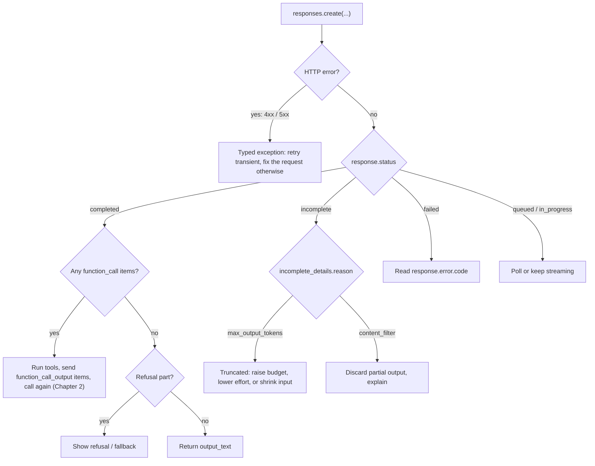
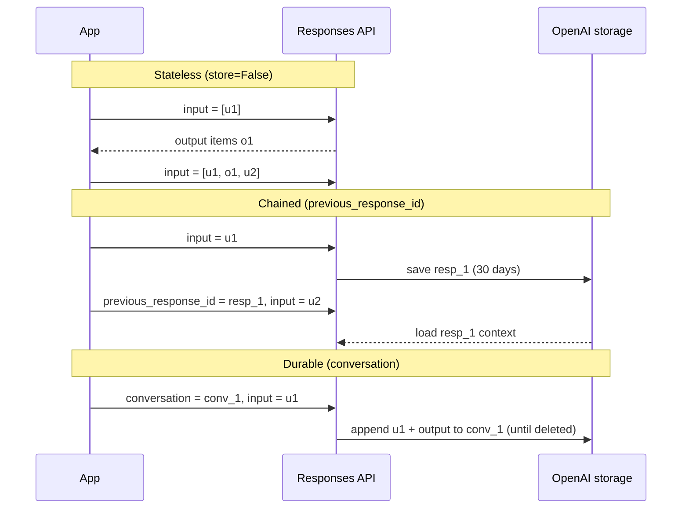

# Chapter 1 — Responses API Fundamentals: How You Talk to GPT Models

> **Claude counterpart:** [Chapter 1 — Claude API Fundamentals](../../anthropic-claude/01-claude-api-fundamentals/README.md) · **Academy course(s):** Scope AI Solutions (API pathway) · **Est. time:** 5–7 hours (reading + notebooks) · **Status:** [ ] not started

Everything else in the OpenAI path (function calling, the Agents SDK, built-in tools, MCP, Codex) sits on one HTTP call: `POST /v1/responses`. This chapter takes that call apart: what you send, what comes back, how to tell whether the model actually finished, the three ways to carry a conversation forward, how to keep long jobs alive with streaming and background mode, how tokens, reasoning effort and model choice drive cost, and how a Playground prototype becomes versioned code when every run can return a different answer.

If you finished the Claude chapter, most ideas will feel familiar. The real differences are **server-side state** (the Responses API can remember the conversation for you), **no single `stop_reason` field** (you read `status`, `incomplete_details` and the output item types instead), and a **reasoning-effort scale with model-specific values**.

---

## Why this matters for a solution architect

On the Claude side the API is stateless, so the main architecture question is "how much history do I resend?". On OpenAI you first have to decide **who owns the conversation state**: your app (stateless, `store=False`), OpenAI per response (`previous_response_id`, stored for 30 days by default), or OpenAI as a durable object (Conversations API, kept until deleted). That choice touches data retention, compliance (Zero Data Retention), portability, latency and cost. A lot of production incidents also come from reading the response wrong: assuming `output[0]` is the answer, ignoring `status: "incomplete"`, or setting `max_output_tokens` so low that the model spends it all on reasoning and returns nothing. This chapter is about getting that contract right.

## Learning objectives

- [ ] Build a valid Responses API request and explain every common field (`model`, `input`, `instructions`, `max_output_tokens`, `reasoning`, `store`, `stream`, `background`)
- [ ] Explain input items and roles (`user`, `assistant`, `developer`, `system`), and when to use `instructions` instead of a `developer` message
- [ ] Read the `output` array by item type and explain why `output_text` exists and when it is not enough
- [ ] Use `status` and `incomplete_details.reason` (the OpenAI analogue of `stop_reason`) and write a handler for every case
- [ ] Choose between stateless history, `previous_response_id` and the Conversations API, and explain the retention and billing consequences of each
- [ ] Stream a response, run one in background mode, poll it, cancel it, and know when webhooks fit
- [ ] Count input tokens before a call, read `usage` after it (including reasoning and cached tokens), and estimate cost per request
- [ ] Explain reasoning vs non-reasoning behavior (chain of thought, effort, latency and cost), and when a fast conversational model should delegate demanding work to the flagship
- [ ] Pick a model and `reasoning.effort` from evals, and recognize Chat Completions code well enough to migrate it
- [ ] Prototype in the Playground and move the result into versioned code, and explain why identical requests can return different answers (and what that means for tests and evals)

## Prerequisites

- [00 — Prerequisites](../../00-prerequisites/README.md): Python 3.11+, virtual environment, `requirements.txt` installed, `.env` with `OPENAI_API_KEY` (and optionally `OPENAI_MODEL`)
- [OpenAI path overview](../README.md): certification status, the three runtimes, and the Claude ↔ OpenAI mapping
- Optional but recommended: [Claude Chapter 1](../../anthropic-claude/01-claude-api-fundamentals/README.md). This chapter often says "same as Claude, except…"

Shared setup used by every snippet in this chapter:

```python
# pip install openai python-dotenv   (already in requirements.txt)
import os
import time
from dotenv import load_dotenv
from openai import OpenAI

load_dotenv()                                   # reads OPENAI_API_KEY from .env
client = OpenAI()                               # picks the key up from the environment, never hardcode it
MODEL = os.getenv("OPENAI_MODEL", "gpt-6-luna") # cheapest GPT-6 model; fine for learning
RULES = "You are a concise travel assistant. Answer in at most three sentences."  # sample instructions
```

> `gpt-6-luna` costs $0.10 / $0.50 per million input / output tokens, so every notebook in this chapter stays well under a cent. Switch to `gpt-6.1-sol` or `gpt-6-astra` only when a section is about model quality (see [1.7](#17-model-selection-and-reasoning-effort)).

---

## Concepts

### 1.1 Anatomy of a Responses API request

All text generation, tool use, structured output and built-in tools go through `POST /v1/responses` (`client.responses.create` in the Python SDK). As on Claude, features are *parameters on this endpoint*, not separate APIs.

```python
response = client.responses.create(
    model=MODEL,                                      # which model answers
    instructions="You are a concise assistant for a cloud architecture team.",
    input="In two sentences, what is an API gateway?",  # a string = one user message
    reasoning={"effort": "low"},                      # how much the model thinks (see 1.7)
    max_output_tokens=2000,                           # ceiling on ALL generated tokens, reasoning included
)
print(response.output_text)
```

| Field | Required | What it does | Architect notes |
|---|---|---|---|
| `model` | in practice, yes | Model ID, e.g. `gpt-6-luna` | Read it from config. Pin a snapshot in production when one exists, and check the model page for supported features. |
| `input` | yes, unless state comes from `previous_response_id` / `conversation` | A string, or a list of **input items** (messages, function call outputs, earlier output items) | A plain string is shorthand for one `user` message. |
| `instructions` | no | A system/developer message inserted into the model's context | **Not** carried over when you chain with `previous_response_id`. Resend it every turn. |
| `max_output_tokens` | no | Upper bound on generated tokens, **including reasoning tokens** | Unlike Claude's `max_tokens`, it is optional. Set too low, you can get `status: "incomplete"` with no visible text at all. |
| `reasoning` | no | `effort` (`none` … `max`, model-dependent), `summary`, `mode` (`standard` / `pro`), `context` | Covered in [1.7](#17-model-selection-and-reasoning-effort). |
| `text` | no | `format` (Structured Outputs) and `verbosity` (`low` / `medium` / `high`) | Structured Outputs come in [Chapter 2](../02-function-calling-and-structured-outputs/README.md). |
| `tools`, `tool_choice`, `parallel_tool_calls`, `max_tool_calls` | no | Function tools and built-in tools | Chapters 02 and 04. |
| `store` | no, **defaults to `true`** | Whether OpenAI keeps the response (30 days by default) | Set `store=False` for stateless or ZDR-style flows. See [1.4](#14-conversation-state-stateless-chained-or-durable). |
| `previous_response_id` / `conversation` | no | Server-side conversation state | Mutually exclusive: you cannot send both. |
| `stream` | no | Server-sent events instead of one JSON body | See [1.5](#15-streaming-background-mode-and-webhooks). |
| `background` | no | Run asynchronously and poll | See [1.5](#15-streaming-background-mode-and-webhooks). |
| `truncation` | no | `disabled` (default): an over-long input fails with 400. `auto`: drop items from the start of the conversation | Silent truncation drops your oldest facts; prefer explicit trimming or compaction. |
| `context_management` | no | Server-side compaction (`[{"type": "compaction", "compact_threshold": N}]`) | Long-running agents; see [1.6](#16-context-window-tokens-and-cost). |
| `safety_identifier` | no | Stable, hashed end-user ID (max 64 chars) for abuse detection | Replaces the older `user` field. Never send raw emails or names. |
| `metadata` | no | Your own key/value tags | Useful for tracing and dashboard filtering. |
| `temperature`, `top_p` | no | Sampling | On GPT-6 models, remove them whenever reasoning effort is not `none`. |

**What comes back.** A `Response` object:

```python
print(response.id)                 # "resp_..." — the handle for chaining, retrieve, cancel, delete
print(response.status)             # completed | incomplete | failed | cancelled | queued | in_progress
print(response.incomplete_details) # None, or an object whose .reason says why output stopped (see 1.3)
print(response.usage)              # input/output tokens, cached tokens, reasoning tokens

# output is a LIST of typed items: reasoning, message, function_call, web_search_call, ...
for item in response.output:
    if item.type == "message":
        for part in item.content:
            if part.type == "output_text":
                print(part.text)
            elif part.type == "refusal":
                print("Refused:", part.refusal)
```

`response.output_text` is an SDK convenience property. It joins every `output_text` part from every `message` item, and returns `""` when there are none. It is perfect for "just give me the answer" code, and wrong for anything that must react to tool calls, refusals or incomplete output.

> **Exam trap:** `response.output[0].content[0].text` is a bug waiting to happen. With a reasoning model the first item is usually a `reasoning` item (no `content` text), and with tools it may be a `function_call`. OpenAI's own docs warn that "it is not safe to assume that the model's text output is present at `output[0].content[0].text`". Use `output_text` for plain text, or iterate and filter by `item.type`.

**Errors are not statuses.** A request that fails validation or auth returns an HTTP error (`400`, `401`, `403`, `404`, `429`, `500`, `503`). A request that the API accepted returns a `Response` with a `status`. The Python SDK retries connection errors, `408`, `409`, `429` and `5xx` twice by default with backoff (`max_retries` on the client changes this), and it honors `Retry-After`. Catch typed exceptions (`openai.RateLimitError`, `openai.BadRequestError`, `openai.AuthenticationError`, `openai.APIConnectionError`) rather than string-matching messages. Billing and quota `429`s (`insufficient_quota`, spend limits) will not go away by retrying.

---

### 1.2 Input items, roles and instructions

On Claude, `messages` is a list of `user` / `assistant` turns and the system prompt lives in a separate `system` field. The Responses API is more general: `input` is a list of **items**, and a message is only one item type.

| Item | Who creates it | Example |
|---|---|---|
| Message with `role: "user"` | Your app, for the end user | `{"role": "user", "content": "Hi"}` |
| Message with `role: "developer"` (or `"system"`) | Your app, as the operator | `{"role": "developer", "content": "Answer in German."}` |
| Message with `role: "assistant"` | The model (you replay it) | An earlier `message` output item |
| `reasoning` | The model | Opaque; replay it unchanged when you manage state yourself |
| `function_call` / `function_call_output` | Model / your app | Linked by `call_id` (Chapter 2) |

Message `content` can be a string or a list of typed parts (`input_text`, `input_image`, `input_file`). The roles carry **different authority**, following OpenAI's model spec chain of command: `developer` (and `system`) instructions take precedence over `user` instructions, and `assistant` messages are treated as the model's own earlier output.

**`instructions` vs. a `developer` message.** These two requests are roughly equivalent:

```python
client.responses.create(model=MODEL, instructions="Talk like a pirate.",
                        input="Are semicolons optional in JavaScript?")

client.responses.create(model=MODEL, input=[
    {"role": "developer", "content": "Talk like a pirate."},
    {"role": "user", "content": "Are semicolons optional in JavaScript?"},
])
```

The difference shows up across turns:

| | `instructions` parameter | `developer` message in `input` |
|---|---|---|
| Scope | **This request only** | Part of the conversation items |
| With `previous_response_id` | Not carried over; resend it every turn | Stays in the chained context because it is an input item |
| With the Conversations API | Not a conversation item: the API adds only the response's input and output items to the conversation, and `instructions` is a separate request parameter. Resend it | Stored in the conversation (it is an input item) |
| Good for | Stable app rules you control from code; easy to swap per request | A transcript you need to replay exactly, or an operator update partway through |

> **Exam trap:** "After switching to `previous_response_id`, the bot stopped following our tone rules from turn 2 onward." The rules were sent as `instructions` on turn 1 only. `instructions` from a previous response are not carried over. Resend them on every request (or put them in a `developer` message that is part of the chain).

**Prompts live in code.** Reusable prompt objects (`v1/prompts`, the `prompt` parameter with a prompt ID) are deprecated and shut down on 2026-11-30. Keep prompt builders in your codebase, typed and under review, and pass the result as `instructions` and `input`.

> **Gotcha: the `phase` field.** Assistant messages can carry `phase: "commentary"` (an intermediate update, such as a preamble before tool calls) or `phase: "final_answer"`. OpenAI recommends preserving it for long, tool-heavy flows (the docs call this out for GPT-5.5 and GPT-5.4); dropping it can make a preamble look like a final answer. `previous_response_id` preserves it for you. If you replay history manually, replay the output items unchanged rather than rebuilding them from text.

---

### 1.3 Status and incomplete_details: why generation stopped

Claude gives you one control field, `stop_reason`. OpenAI splits the same information across three places:

1. **`response.status`**: did the run finish?
2. **`response.incomplete_details.reason`**: if it is `incomplete`, why?
3. **The output item types**: did the model ask for a tool (`function_call`), refuse (a `refusal` content part), or answer (`output_text`)?

| `status` | Meaning | What your code should do |
|---|---|---|
| `completed` | The model finished its turn | Inspect the output items: run any `function_call` items (Chapter 2) or return the text |
| `incomplete` | Generation stopped early; read `incomplete_details.reason` | See the next table |
| `failed` | The run failed; `response.error` has `code` and `message` (e.g. `server_error`, `rate_limit_exceeded`, `invalid_prompt`) | Log `error.code`; retry only transient codes |
| `cancelled` | You (or your system) cancelled a background response | Stop; nothing to return |
| `queued` / `in_progress` | Background or streaming response still running | Keep polling or reading the stream |

| `incomplete_details.reason` | Meaning | Fix |
|---|---|---|
| `max_output_tokens` | The token ceiling was hit, by your `max_output_tokens` **or by the context window** | If there is partial `output_text`, it is truncated. If there is none, the budget ran out **during reasoning**: you paid for input and reasoning tokens and got nothing visible. Raise the limit (OpenAI suggests reserving at least 25,000 tokens when you start with reasoning models), lower effort, or shrink the input. |
| `content_filter` | Output was interrupted by the content filter | Don't show partial output as an answer; explain or fall back |
| `steered` | The response stopped at a safe boundary after a WebSocket `response.steer` event; the server can continue in a successor response | Only relevant with mid-turn steering over WebSocket mode |
| `max_messages` | Listed in the API reference without further description in the guides used for this chapter | Treat as incomplete; log it |



A defensive handler you can reuse:

```python
def handle(resp) -> str | None:
    match resp.status:
        case "completed":
            if any(item.type == "function_call" for item in resp.output):
                raise NotImplementedError("Run the tools and loop (Chapter 2)")
            refusals = [p.refusal for item in resp.output if item.type == "message"
                        for p in item.content if p.type == "refusal"]
            if refusals:
                print("Refused:", refusals[0])
                return None
            return resp.output_text
        case "incomplete":
            reason = resp.incomplete_details.reason if resp.incomplete_details else None
            if reason == "max_output_tokens":
                if resp.output_text:
                    raise RuntimeError("Truncated answer: raise max_output_tokens or lower effort")
                raise RuntimeError("Budget spent on reasoning: no visible output at all")
            raise RuntimeError(f"Incomplete: {reason}")
        case "failed":
            raise RuntimeError(f"Failed: {resp.error.code if resp.error else 'unknown'}")
        case "queued" | "in_progress":
            raise RuntimeError("Still running: poll with responses.retrieve(resp.id)")
        case "cancelled":
            return None
        case other:
            raise ValueError(f"Unknown status: {other}")   # future-proofing
```

> **Exam trap:** "The model returned an empty string, but the request succeeded (HTTP 200)." Look at `status` before blaming the prompt. `incomplete` + `max_output_tokens` + empty `output_text` means the whole budget went into reasoning tokens. Raising `max_output_tokens` (or lowering effort) fixes it; rewording the prompt does not.

> **Exam trap:** For agent loops, "keep looping while the latest response contains `function_call` items; stop when a `completed` response has none" is the OpenAI equivalent of "continue while `stop_reason == "tool_use"`". Checking whether `output_text` is non-empty is wrong: the model can write a preamble **and** call a tool in the same response.

---

### 1.4 Conversation state: stateless, chained or durable

Each model call is independent, but the Responses API gives you three ways to continue a conversation:

| Pattern | How | What OpenAI stores | Billing | Best for |
|---|---|---|---|---|
| **Stateless (manual history)** | Keep a list; append `response.output` items and the next user message; send it all as `input`. Use `store=False`. | Nothing durable (with `store=False`) | Full history billed as input every turn | ZDR/compliance, full control over trimming, portability across providers |
| **Chained (`previous_response_id`)** | Send only the new input plus `previous_response_id=prev.id` | Each response, 30 days by default | **All previous input tokens in the chain are still billed as input** | Simplest multi-turn code; short-lived sessions |
| **Durable (Conversations API)** | `conv = client.conversations.create()`, then `conversation=conv.id` on every `responses.create` | A conversation object and its items, **until you delete them** (no 30-day TTL) | Same: the context the model sees is billed as input | Long-lived threads across sessions, devices or jobs; a server-side transcript |

```python
# 1) Stateless: your app owns the transcript
history = [{"role": "user", "content": "I'm vegetarian and I love hiking."}]
r1 = client.responses.create(model=MODEL, input=history, store=False)
history += r1.output          # keep EVERY output item (reasoning items carry encrypted_content)
history.append({"role": "user", "content": "Suggest a weekend trip near Almaty."})
r2 = client.responses.create(model=MODEL, input=history, store=False)

# 2) Chained: OpenAI keeps the previous response
r1 = client.responses.create(model=MODEL, instructions=RULES, input="I'm vegetarian.")
r2 = client.responses.create(model=MODEL, instructions=RULES,          # resend instructions!
                             previous_response_id=r1.id, input="Suggest a trip.")

# 3) Durable: a conversation object
conv = client.conversations.create(metadata={"user": "u_123"})
client.responses.create(model=MODEL, instructions=RULES, conversation=conv.id, input="I'm vegetarian.")
client.responses.create(model=MODEL, instructions=RULES, conversation=conv.id, input="Suggest a trip.")

# Clean-up: deleting a conversation does NOT delete its items, so delete the items first
item_ids = [item.id for item in client.conversations.items.list(conv.id)]  # iterating auto-paginates
for item_id in item_ids:
    client.conversations.items.delete(item_id, conversation_id=conv.id)
client.conversations.delete(conv.id)
```



**Rules worth memorizing:**

- `store` defaults to `true` on the Responses API. Stored responses are kept for 30 days and are visible in the dashboard logs. Conversation objects and their items have **no** 30-day TTL: any response attached to a conversation has its items persisted with no TTL.
- **Deleting a conversation does not delete its items.** The API reference for `DELETE /v1/conversations/{id}` says so explicitly. To remove the transcript, delete each item (`client.conversations.items.delete(item_id, conversation_id=...)`) and then the conversation. The responses you created are separate stored objects (30 days with the default `store=true`); delete them with `client.responses.delete(response_id)` if your retention policy requires it.
- `previous_response_id` and `conversation` **cannot be combined** in one request.
- With `conversation`, the earlier conversation items are prepended to your input, and this response's input and output items are added to the conversation "after this response completes" (API reference). The docs do not say what happens to the items of an `incomplete` or `failed` response. Before you resend a turn after an incomplete one, list the conversation items (`client.conversations.items.list(conv.id)`) and check whether the user message is already there, so you don't store it twice.
- `previous_response_id` needs a response the API can load. OpenAI's guidance is "use `previous_response_id` for stored responses", and with `store=False` nothing is persisted to load from. The one exception is WebSocket mode, which keeps recent responses in a connection-local memory cache, so chaining works with `store=False` there until the ID drops out of the cache (then you get `previous_response_not_found`). Over plain HTTP, the docs do not spell out the exact error, so treat "`store=False` + `previous_response_id`" as unsupported and replay history instead.
- Server-side state does **not** make long chats cheaper per se. Even with `previous_response_id`, all earlier input tokens in the chain are billed as input. What helps is prompt caching (a stable prefix gets the cached-input rate) and compaction (a smaller context).
- With **Zero Data Retention**, `store` is always treated as `false`, and the Conversations API is not ZDR-eligible. A ZDR design is therefore stateless: replay every output item (reasoning items include `encrypted_content` by default when `store=False`), and use compaction to keep the context small.
- Reasoning continuity: when you replay history manually, keep **every** output item, not just the text. Models that support it can reuse earlier reasoning (`reasoning.context`: `current_turn` / `all_turns`).

> **Exam trap:** "The assistant forgets what the user said two turns ago." On Claude the answer is always "resend history". On OpenAI there are three candidate causes: the app sends only the new message **without** `previous_response_id` or `conversation`; it chains from the wrong response ID (for example an older or a failed one); or it uses `store=False` and then tries to chain with `previous_response_id` over HTTP, where there is no stored response to load (only WebSocket mode keeps an in-memory copy). The fix is never a bigger context window.

> **Gotcha:** Switching from manual history to `previous_response_id` is not just a refactor. It moves your conversation data into OpenAI storage for 30 days. Check this with whoever owns data retention before you ship it.

---

### 1.5 Streaming, background mode and webhooks

By default the API generates the whole response and then returns one JSON body. For long outputs or long-running reasoning that is slow to feel and fragile over HTTP. Three tools help:

**Streaming (`stream=True`).** The Responses API streams **semantic, typed events** over server-sent events, not raw text chunks. Common ones for text: `response.created`, `response.output_text.delta`, `response.completed`, and `error`. Others include `response.output_item.added` / `.done`, `response.function_call_arguments.delta`, `response.incomplete` and `response.failed`.

```python
stream = client.responses.create(model=MODEL, input="Explain idempotency in 3 bullets.", stream=True)
for event in stream:
    if event.type == "response.output_text.delta":
        print(event.delta, end="", flush=True)
    elif event.type in ("response.completed", "response.incomplete", "response.failed"):
        final = event.response            # the full Response object, with status and usage

# The SDK helper accumulates for you:
with client.responses.stream(model=MODEL, input="Explain idempotency in 3 bullets.") as s:
    for event in s:
        if event.type == "response.output_text.delta":
            print(event.delta, end="")
    final = s.get_final_response()
```

**Background mode (`background=True`).** The API starts the job, returns immediately with `status: "queued"` or `"in_progress"`, and you poll `responses.retrieve(id)` until the status leaves those two states. `responses.cancel(id)` stops it (cancelling twice is idempotent). Background mode exists for reasoning tasks that can take minutes, where a held-open HTTP connection would time out.

```python
job = client.responses.create(model=MODEL, input="Write a long migration plan.", background=True)
while job.status in {"queued", "in_progress"}:
    time.sleep(2)
    job = client.responses.retrieve(job.id)
print(job.status, job.output_text)
```

- `background=True` + `stream=True` lets you stream **and** resume: each event has a `sequence_number` you keep as a cursor. You can only start a new stream from a background response that you created with `stream=True`.
- Background responses need temporary storage to support polling. With `store=False` (or ZDR) the data is kept for roughly 10 minutes and then deleted.
- The docs note that time to first token is currently higher in background mode than for a synchronous request.

**Webhooks.** Instead of polling, register an endpoint in the dashboard and subscribe to events such as `response.completed`. Verify signatures with `client.webhooks.unwrap(body, headers)` (OpenAI follows the Standard Webhooks spec). Webhooks fit background jobs, batches and other async work.

**WebSocket mode** (`client.responses.connect()`) keeps one connection open and continues each turn with `previous_response_id` plus only the new input items. OpenAI reports up to roughly 40% faster end-to-end execution for rollouts with 20+ tool calls. It matters for tool-heavy agents (Chapter 3) and it is the transport for mid-turn steering.

| Need | Use |
|---|---|
| Show text as it is generated in a chat UI | `stream=True` |
| A task that may run for minutes; client may disconnect | `background=True` + polling or webhooks |
| Both, with reconnect | `background=True, stream=True` + `sequence_number` cursor |
| Many fast tool round trips in one agent loop | WebSocket mode |
| Thousands of non-urgent requests | Batch API (50% off, within 24 h; covered in [chapter 07](../07-batch-and-cost/README.md)) |

> **Exam trap:** "Long reasoning requests time out at the load balancer after 60 seconds." The fix is `background=True` with polling or a webhook, not a bigger timeout or a retry loop that starts the (expensive) job again.

> **Gotcha:** Streaming makes moderation harder: partial output reaches the user before the whole answer can be checked. If you request moderation scores with a generation request, they arrive only after the full output exists.

---

### 1.6 Context window, tokens and cost

The **context window** is the most tokens one request can use: input, output **and reasoning** tokens together. The current GPT-6 models (`gpt-6-astra`, `gpt-6.1-sol`, `gpt-6-luna`) all list:

| Limit | Value |
|---|---|
| Context window | 1,050,000 tokens |
| Maximum input tokens | 922,000 |
| Maximum output tokens | 128,000 |

What fills a request: `instructions`, tool definitions, every input item (including replayed reasoning items and tool outputs), images and files, plus this turn's reasoning and visible output. Reasoning tokens are never shown, but they occupy the window and are **billed as output tokens**.

**Before sending: the input token count endpoint.** `client.responses.input_tokens.count(...)` (`POST /v1/responses/input_tokens`) accepts the same input format as `responses.create`: `model`, `instructions`, `input` (text, images, files), `tools`, `tool_choice`, `reasoning`, `text`, `truncation`, `previous_response_id` and `conversation`. It returns `input_tokens`, and it also counts formatting tokens for roles and message boundaries, which a local tokenizer cannot see. It does **not** accept generation-only options: in the Python SDK, passing `max_output_tokens`, `stream`, `store` or `background` raises `TypeError`. Keep the context in one dict and add generation options only when you call `create`:

```python
context = dict(
    model=MODEL,                         # counts are model-specific: use the model you will call
    instructions=RULES,
    input=history + [{"role": "user", "content": open("contract.txt").read()}],
)
count = client.responses.input_tokens.count(**context)
print(count.input_tokens)
response = client.responses.create(**context, max_output_tokens=2000, store=False)  # generation options here
```

**After sending: `response.usage`.**

```python
u = response.usage
print(u.input_tokens, u.input_tokens_details.cached_tokens, u.input_tokens_details.cache_write_tokens)
print(u.output_tokens, u.output_tokens_details.reasoning_tokens)   # reasoning is INSIDE output_tokens
print(u.total_tokens)
```

A simple cost model (rates per million tokens, from the model pages on 2026-10-03):

| Model | Input | Cached input | Cache writes | Output |
|---|---|---|---|---|
| `gpt-6-astra` | $10 | $1 | $12.50 | $50 |
| `gpt-6.1-sol` | $2 | $0.10 | $2.50 | $10 |
| `gpt-6-luna` | $0.10 | $0.01 | $0.125 | $0.50 |

```python
PRICES = {"gpt-6-luna": {"input": 0.10, "cached": 0.01, "cache_write": 0.125, "output": 0.50}}

def cost_usd(usage, model: str) -> float:
    p = PRICES[model]
    cached = usage.input_tokens_details.cached_tokens
    writes = usage.input_tokens_details.cache_write_tokens
    uncached = usage.input_tokens - cached - writes
    long_ctx = usage.input_tokens > 272_000          # long-context surcharge (see below)
    in_mult, out_mult = (2.0, 1.5) if long_ctx else (1.0, 1.0)
    return (uncached * p["input"] + cached * p["cached"] + writes * p["cache_write"]) * in_mult / 1e6 \
        + usage.output_tokens * p["output"] * out_mult / 1e6
```

Practical rules:

- **Long prompts cost more per token.** On the GPT-6 models, prompts with more than 272K input tokens are priced at 2x input and cache rates and 1.5x output **for the whole request**. A 1M window is available, but filling it is a pricing decision, not just a capacity one.
- **Prompt caching is automatic** for supported models. Cached input is up to 95% cheaper, and the minimum cacheable prefix is 1,024 tokens on GPT-5.6 and later. Keep stable content (instructions, tool definitions) at the start. [Chapter 07](../07-batch-and-cost/README.md) covers explicit cache breakpoints.
- **`max_output_tokens` limits every generated token**, including reasoning and non-visible formatting tokens. Leave headroom.
- **Use the counting endpoint, not `tiktoken` or chars ÷ 4**, for anything with images, files, tools or schemas.
- **Long conversations:** `truncation="auto"` silently drops the oldest items; server-side compaction (`context_management=[{"type": "compaction", "compact_threshold": 200000}]`) or the standalone `client.responses.compact(...)` endpoint replaces older context with an opaque, encrypted compaction item. Both are ZDR-friendly with `store=False`. The context-curation patterns from the Claude chapter (lost in the middle, trimming tool results, a never-summarized "case facts" block) apply unchanged.

> **Exam trap:** "Use `previous_response_id` so we stop paying for the history." Wrong: the chain's earlier input tokens are still billed as input on every turn. Caching lowers the price of a stable prefix; compaction and trimming lower the size.

---

### 1.7 Model selection and reasoning effort

Current lineup (Responses API, standard processing, 2026-10-03):

| Model | API ID | Positioning in OpenAI's docs | Input / Output per MTok | `reasoning.effort` values | Default effort |
|---|---|---|---|---|---|
| GPT-6 Astra | `gpt-6-astra` | Most capable; complex reasoning, coding, computer use | $10 / $50 | `low` … `max` (no `none`) | not stated in the docs; set it explicitly |
| GPT-6.1 Sol | `gpt-6.1-sol` | Near-Astra performance at lower cost | $2 / $10 | `low` … `max` (no `none` / `minimal`) | `medium` |
| GPT-6 Luna | `gpt-6-luna` | Most efficient; focused, high-volume tasks | $0.10 / $0.50 | `none`, `low` … `max` | `medium` |

`gpt-6-sol` (the earlier Sol, $2 / $10) is still listed and supports `none`. Batch and Flex processing are priced at 50% of standard rates; Fast mode costs 2x.

#### Reasoning vs non-reasoning models

A **reasoning model** works through the problem before it answers. OpenAI calls that thinking a "chain of thought": the model forms hypotheses, tests and refines them, then commits to an answer. You never see the raw chain of thought. It comes back as an opaque `reasoning` item (optionally with a `reasoning.summary`), and its tokens are billed as output tokens. A **non-reasoning model** answers straight away. OpenAI's Building Agents track sums up the trade-off:

| | Reasoning | Non-reasoning |
|---|---|---|
| Strength | More accurate and reliable on hard problems | Faster and usually cheaper |
| Cost of that strength | Latency and reasoning tokens | Weaker on multi-step problems |
| Typical work | Planning, math, code generation, multi-tool workflows | Chat-style back-and-forth, simple tasks where latency matters |
| Control | `reasoning.effort` sets how hard it thinks | Nothing to set |

On the current models this is less a choice of model *family* and more a setting: every GPT-6 model reasons, and `reasoning.effort` decides how much. `none` (Luna and the earlier GPT-6 Sol) is the reasoning guide's choice for "latency-critical tasks that do not benefit from any reasoning", such as voice, fast retrieval and classification. Older non-reasoning models such as GPT-4.1 ("smartest non-reasoning model" on the models page) still exist for legacy code. Prompting differs too: the track warns that you don't prompt a reasoning model the same way as a GPT model, so when you switch, re-run your evals rather than just swapping the model name.

**Fast front, flagship behind.** For a conversational product, the track recommends a fast model that chats with the user and **delegates the demanding tasks** to the flagship (its example: `gpt-5.6-terra` for the conversation, `gpt-6-astra` for the heavy work). The user gets quick turns, and you pay flagship prices only on the turns that need them:

```python
def reply(user_text: str, history: list) -> str:
    fast = client.responses.create(model="gpt-6-luna", reasoning={"effort": "none"},
                                   instructions=FRONT_DESK_RULES, input=history + [{"role": "user", "content": user_text}],
                                   tools=[DELEGATE_TOOL], store=False)
    calls = [item for item in fast.output if item.type == "function_call"]
    if not calls:
        return fast.output_text                      # most turns end here: fast and cheap
    task = json.loads(calls[0].arguments)["task"]    # the fast model asked for help
    deep = client.responses.create(model="gpt-6-astra", reasoning={"effort": "high"},
                                   input=task, background=True, store=False)  # long job: poll it (1.5)
    ...
```

This is a sketch (`FRONT_DESK_RULES` and `DELEGATE_TOOL` are placeholders, and it needs `import json`); the practice notebook has a runnable offline version. Function calling is [Chapter 2](../02-function-calling-and-structured-outputs/README.md), and the Agents SDK version of the same pattern (an agent used as a tool, or a handoff) is [Chapter 3](../03-agents-sdk-and-agents-api/README.md).

You have four levers:

1. **Model tier:** capability ceiling and price.
2. **`reasoning.effort`:** how much the model thinks. The API accepts `none`, `minimal`, `low`, `medium`, `high`, `xhigh`, `max`, but **each model supports a subset** (an unsupported value returns HTTP 400). OpenAI's guidance: `low` for extraction, routing, classification and routine rewrites; `medium` or `high` for diagnosis, planning and code; `xhigh` / `max` only when evals show the gain is worth the latency and cost.
3. **`text.verbosity`** (`low` / `medium` / `high`): the main lever for answer length. Lower verbosity means fewer output tokens and a faster answer.
4. **`reasoning.mode`:** `standard` (default) or `pro`, which does more model work at the same effort and bills it at the model's normal token rates. Use it only for the hardest, quality-first tasks.

```python
resp = client.responses.create(
    model="gpt-6-luna",
    reasoning={"effort": "low"},      # cheap and fast for a simple classification
    text={"verbosity": "low"},
    instructions="Classify the ticket as billing, technical or other. Reply with one word.",
    input="My invoice shows two charges for September.",
)
```

**Changing effort mid-conversation** without breaking the cached prefix: on GPT-6 models (standard, single-agent mode) add a `{"type": "configuration_update", "reasoning": {"effort": "high"}}` input item before the next user message, and keep the request-level `reasoning.effort` unchanged.

Selection process, the way an architect should defend it:

1. Build an **eval set** of 20–100 real examples with a pass criterion.
2. OpenAI suggests: if cost and latency don't matter, default to Astra. Otherwise start where your task sits on their guide (for example Luna · Low for well-scoped extraction, Sol · Medium for complex technical work).
3. Step down (lower effort, then a cheaper model) while the eval still passes. Step up only when it fails.
4. Compare **cost per successful task**, including reasoning and cache-write tokens, not cost per request.
5. Check lifecycle and compatibility: the deprecations page, data residency eligibility (for example, Fast mode is not available with EU data residency for Astra, Sol and Luna), and `client.models.retrieve(id).shutdown_date`.

> **Gotcha: parameters that break on reasoning models.** On GPT-6 models, when reasoning effort is not `none`, remove `temperature`, `top_p` and `top_logprobs`. Old snippets that set `temperature=0` "for determinism" need rework before they run on GPT-6.

> **Exam trap:** "Use the biggest model and `max` effort to be safe" and "pick the model with the largest context window" are typical wrong answers. The expected reasoning: measure on representative data, then pick the cheapest model + effort that meets the quality and latency bar.

---

### 1.8 Chat Completions: the legacy contrast

Chat Completions (`POST /v1/chat/completions`) is **still supported** and not deprecated, but OpenAI recommends Responses for all new projects. You will still meet it in tutorials and in code you migrate, so learn to read it.

| Concept | Chat Completions | Responses |
|---|---|---|
| Endpoint / SDK | `client.chat.completions.create` | `client.responses.create` |
| Input | `messages=[...]` (`system`/`developer`, `user`, `assistant`, `tool`) | `input` (string or items) + `instructions` |
| Output | `completion.choices[0].message.content` | `response.output` items; `response.output_text` helper |
| Why it stopped | `choices[0].finish_reason` (`stop`, `length`, `tool_calls`, `content_filter`, `function_call`) | `status` + `incomplete_details.reason` + item types |
| Output limit | `max_completion_tokens` | `max_output_tokens` |
| Reasoning effort | `reasoning_effort="low"` | `reasoning={"effort": "low"}` |
| Multiple candidates | `n` | Not available; make separate requests |
| State | Always manual | Manual, `previous_response_id`, or Conversations |
| Storage default | Stored by default for new accounts; `store=False` to disable | Stored by default; `store=False` to disable |
| Structured Outputs | `response_format` | `text.format` |
| Tool calling on GPT-6 | Astra and 6.1 Sol: **not supported** in Chat Completions. Sol and Luna: only with `reasoning_effort="none"` | Supported |
| Hosted tools (web search, file search, MCP, …) | Not available natively | Built in |

```python
# Legacy shape you will see in older code
completion = client.chat.completions.create(
    model=MODEL,
    messages=[{"role": "system", "content": "You are a helpful assistant."},
              {"role": "user", "content": "Hello!"}],
)
print(completion.choices[0].message.content, completion.choices[0].finish_reason)

# The Responses equivalent; text-only message lists are accepted as-is
response = client.responses.create(model=MODEL, input=[
    {"role": "system", "content": "You are a helpful assistant."},
    {"role": "user", "content": "Hello!"},
])
print(response.output_text, response.status)
```

OpenAI's migration guide also reports better results with reasoning models on Responses (a 3% SWE-bench improvement in their internal evals with the same prompt) and better cache utilization (40% to 80% in internal tests).

> **Avoid / migrating from:** the **Assistants API** (threads, runs) was retired on 2026-08-26. Its replacement is Responses + the Conversations API. Reusable prompt objects (`v1/prompts`) shut down on 2026-11-30. Don't start new work on either.

> **Exam trap:** "We migrated our GPT-6 Astra tool-calling bot from Chat Completions and it now fails." The fix is not a different `finish_reason` check. GPT-6 Astra and GPT-6.1 Sol require the Responses API for tool calling.

---

### 1.9 Playground to code, sampling and non-determinism

#### Prototype in the Playground, then move to code

OpenAI's AI Application Development track puts this step before any real building: test ideas in the [Playground](https://platform.openai.com/chat/edit), and "once you have tested your prompts and tools and you have a sense of the type of output you can get", move from the Playground into your application. The Playground is a dashboard UI over the same API, so it is the fastest way to answer early questions without writing code: is the task feasible at all, which model and effort are good enough, how the output changes when you reword the instructions, and whether a tool or schema behaves the way you expect. Its **Generate** button drafts prompts, function definitions and JSON schemas from a short task description, using meta-prompts built on OpenAI's prompt-engineering guidance. Treat what it produces as a first draft to review, not a finished prompt.

What changes when you leave the Playground:

| Settled in the Playground | Where it lives in code |
|---|---|
| Model choice | Config (`OPENAI_MODEL`), with a pinned snapshot for production when one exists |
| System or developer prompt | A named prompt builder in your repo, passed as `instructions` (or a `developer` message) |
| Effort, verbosity, mode | `reasoning={"effort": ...}`, `text={"verbosity": ...}`, `reasoning={"mode": ...}` |
| Tools and schemas | `tools=[...]` and `text={"format": ...}`, checked into the repo with tests ([Chapter 2](../02-function-calling-and-structured-outputs/README.md)) |
| "It looked right on the three examples I tried" | An eval set with a pass criterion, run on every prompt change ([Chapter 6](../06-prompt-engineering-and-evals/README.md)) |

Two current-platform rules shape this hand-off:

- **Don't wire the app to a saved prompt object.** Reusable prompt objects (`v1/prompts`, the `prompt` parameter) are deprecated: creation was de-emphasized from June 3, 2026, and the endpoint shuts down on November 30, 2026. OpenAI's prompting guide now says to treat prompts as application code: keep each production prompt in a code-managed, versioned helper, replace prompt variables with typed function parameters, review changes in pull requests, and run tests and evals with your deployment process.
- **The dataset-backed prompt optimizer goes away with the Evals platform** (read-only for existing users from October 31, 2026, shut down on November 30, 2026). Optimizing a prompt by hand in the Playground is still fine; keeping the evidence that it is better belongs in your own eval harness.

```python
# prompts/support_reply.py: the prompt you settled on in the Playground, now reviewed like code
SUPPORT_REPLY_V3 = "You are a support assistant for {product}. Answer in at most {max_sentences} sentences."

def support_reply_request(question: str, *, product: str, max_sentences: int = 3) -> dict:
    return dict(
        model=os.getenv("OPENAI_MODEL", "gpt-6-luna"),
        instructions=SUPPORT_REPLY_V3.format(product=product, max_sentences=max_sentences),
        input=question,
        reasoning={"effort": "low"},          # the effort that passed the eval, not a guess
        text={"verbosity": "low"},
    )

response = client.responses.create(**support_reply_request("How do I reset my password?", product="Acme Cloud"))
```

#### Sampling and non-determinism

Each output token is **sampled** from a probability distribution over possible next tokens (the loop is drawn in [00 — Prerequisites §2.9](../../00-prerequisites/README.md#29-next-token-generation)). On the Responses API two parameters reshape that distribution:

| Parameter | What it does | On current GPT-6 models |
|---|---|---|
| `temperature` (0–2) | Lower values make output "more focused and deterministic", higher values "more random" (API reference) | Remove it whenever `reasoning.effort` is not `none` (OpenAI's GPT-6 guide: "When reasoning effort is not `none`, remove `temperature`, `top_p`, and `top_logprobs`") |
| `top_p` (nucleus sampling) | Considers only the tokens in the top `top_p` probability mass; `0.1` means the top 10% | Same rule: remove it unless effort is `none` |

OpenAI recommends changing `temperature` or `top_p`, not both. `top_logprobs` follows the same GPT-6 rule. There is no `seed` parameter on `responses.create` (neither the API reference nor the `openai` 3.24 SDK has one).

**Reasoning vs non-reasoning, again.** With effort `none` (or on an older non-reasoning model) you still have the classic sampling knobs. With any other effort you don't, and the model also chooses its own reasoning path, so two runs of the same request can reason differently and produce different text, different tool calls, or occasionally a different label. OpenAI's text-generation guide says it directly: "the content generated from a model is non-deterministic." Even a low `temperature` makes output more predictable, not guaranteed identical. Prompt caching does not change this: it reuses the processed prompt prefix, not the answer.

What this means for engineering and evals (the same rules as in [Claude Chapter 1](../../anthropic-claude/01-claude-api-fundamentals/README.md#sampling-and-non-determinism)):

- **Test properties, not strings.** Assert that the output parses, matches the schema, picks the right label, contains the required facts, or stays under a length limit.
- **Sample several runs per eval example** (3–5 is a common start) and report a **pass rate** with its spread. Compare two configurations on the same examples with the same number of runs. One run that "worked" in the Playground proves little.
- **Make the shape deterministic, not the wording.** Structured Outputs (`text.format` with a strict JSON schema) guarantee the shape ([Chapter 2](../02-function-calling-and-structured-outputs/README.md)); validators and graders check the content.
- **Pin what you can:** model snapshot, prompt version, `reasoning.effort`, `text.verbosity`, tool set. Log the request and `response.id`.
- **If the product needs the same answer every time** (an approved FAQ answer, a regulated disclosure), store and reuse that answer in your application.

> **Exam trap:** "Set `temperature=0` so the GPT-6 tests are deterministic" is wrong twice: on a GPT-6 model with reasoning on, OpenAI says to remove `temperature` altogether, and even where it is accepted a low temperature never promised identical output. The expected answer: run several samples per example, check properties, and use Structured Outputs for the shape.

> **Gotcha:** A prompt that "works" in the Playground has been tested on a handful of hand-picked inputs, at one moment, usually once each. Before it ships, it needs the same eval set and multi-run pass rate as any other change.

---

## Claude ↔ OpenAI comparison

| Concept | Claude (Messages API) | OpenAI (Responses API) | Architect takeaway |
|---|---|---|---|
| Endpoint | `POST /v1/messages` | `POST /v1/responses` (Chat Completions still supported) | Same role: one endpoint, features as parameters |
| Output limit | `max_tokens`, **required**; thinking counts against it | `max_output_tokens`, optional; reasoning counts against it | Both: set too low and reasoning eats the budget |
| Operator instructions | Top-level `system` field (plus mid-conversation `system` messages on supported models) | `instructions` (this request only) or `developer` / `system` input messages | OpenAI's `instructions` are **not** carried by `previous_response_id`; resend them |
| Response body | `content`: list of typed blocks (`text`, `thinking`, `tool_use`) | `output`: list of typed items (`reasoning`, `message`, `function_call`, …); SDK `output_text` helper | Never index position 0 on either side; filter by type |
| Why generation stopped | `stop_reason` (7 values incl. `end_turn`, `tool_use`, `max_tokens`, `refusal`, `model_context_window_exceeded`) | `status` + `incomplete_details.reason` (`max_output_tokens`, `content_filter`, …) + output item types | OpenAI has no single field. A tool call is a `completed` response that contains `function_call` items. |
| Refusals | `stop_reason: "refusal"` (+ `stop_details`) | A `refusal` content part inside a `message` item; `content_filter` as an incomplete reason | Check for refusals before showing text on both platforms |
| Conversation state | Stateless only: resend full history | Stateless (`store=False`), chained (`previous_response_id`, 30 days), or durable (Conversations API, until deleted) | On OpenAI, state location is a **data-retention decision** |
| Default storage | No server-side conversation state in the Messages API | `store=true` by default (30 days) | Opt out explicitly for sensitive or ZDR workloads |
| Long-running work | Streaming (SSE); Message Batches for async bulk (chapter 07) | Streaming (typed SSE events), `background=True` + polling/webhooks, WebSocket mode, Batch API | OpenAI adds a per-request async mode for multi-minute reasoning |
| Reasoning control | `output_config={"effort": "low" … "max"}`; adaptive thinking | `reasoning={"effort": "none" … "max"}` (subset per model), `reasoning.mode`, `text.verbosity` | Value sets and defaults differ per model; validate per model |
| Sampling parameters | `temperature` / `top_p` / `top_k` deprecated on the newest models (non-default values rejected) | `temperature` (0–2) / `top_p` only when GPT-6 effort is `none`; no `seed` on Responses | Neither side gives you determinism: sample several runs and test properties |
| Prototyping UI | The Claude Developer Platform Console (`platform.claude.com`) | Playground (`platform.openai.com/chat/edit`) | Prototype in the UI, then move the prompt into versioned code; OpenAI's saved prompt objects shut down 2026-11-30 |
| Pre-flight token count | `client.messages.count_tokens(...)` (free) | `client.responses.input_tokens.count(...)` | Same idea: use the provider's endpoint, not a local tokenizer |
| Usage fields | `input_tokens`, `output_tokens`, `cache_creation_input_tokens`, `cache_read_input_tokens` | `input_tokens` (+ `cached_tokens`, `cache_write_tokens`), `output_tokens` (+ `reasoning_tokens`) | OpenAI reports reasoning tokens separately but bills them as output |
| Context window (current flagships) | 1M tokens on Fable 5.1 / Opus 5.5 / Sonnet 5.5 (128K max output) | 1.05M window, 922K max input, 128K max output on GPT-6 Astra / 6.1 Sol / Luna | GPT-6 prompts over 272K input tokens cost 2x input and 1.5x output |
| Overflow behavior | Input too large → 400; generation filling the window → `model_context_window_exceeded` | `truncation="disabled"` (default) → 400; `auto` drops oldest items; hitting the limit while generating → `incomplete` / `max_output_tokens` | Prefer explicit trimming or compaction over silent truncation |
| Compaction | Compaction / context editing (beta) | `context_management` (server-side) or `responses.compact` (standalone) | Both vendors ship server-side compaction now |
| Cheapest current model | Haiku 4.5: $1 / $5 | GPT-6 Luna: $0.10 / $0.50 | Measure cost per successful task, not list price |

---

## Notebooks

| Notebook | Sections covered | What you build |
|---|---|---|
| [`01_practice.ipynb`](01_practice.ipynb) | 1.1–1.9: first call and output items, `instructions` vs `developer` messages (and why `instructions` don't survive `previous_response_id`), a `status` / `incomplete_details` handler tested on mock responses, the same chat built three ways (stateless, chained, Conversations API), streaming and background mode, token counting vs `usage` and a cost calculator, an effort sweep and a fast-front / flagship delegation router, Chat Completions side by side, a Playground-to-code request builder that drops sampling parameters GPT-6 rejects, and a multi-run pass-rate check | **Mini-project:** `ChatSession`, a multi-turn chat helper with `chain` / `conversation` / `stateless` modes, instructions resent every turn, retry on `max_output_tokens` truncation, and a usage and cost report. It is tested offline against a fake client, then run live. |
| [`02_homework.ipynb`](02_homework.ipynb) | Self-test for the whole chapter | 12-question scenario quiz (hashed answer key), 5 auto-checked offline exercises (request builder, response classifier, next-turn state builder, cost calculator, stream accumulator) plus 1 optional live exercise, an architecture scenario (ZDR support assistant) with a rubric, and a scorecard with a 72% pass mark |

Theory stays in this README; notebooks hold code. Run them from the repo root venv (see [../../00-prerequisites/README.md](../../00-prerequisites/README.md)).

---

## Architect decision cheat-sheet

| Situation | Choose | Over | Why |
|---|---|---|---|
| Regulated workload, ZDR or strict retention | Stateless history with `store=False`, replaying all output items; compaction for length | `previous_response_id` or Conversations | ZDR forces `store=false`; Conversations are not ZDR-eligible |
| Simple multi-turn chat, short sessions | `previous_response_id` (resend `instructions`) | Hand-rolled history | Least code; OpenAI keeps reasoning context |
| Thread must survive across devices, sessions or jobs | Conversations API (delete its items, then the conversation, when done) | Chaining response IDs | Durable object with no 30-day TTL |
| Want to cut the cost of long chats | Stable prefix for prompt caching + compaction/trimming | "Switch to `previous_response_id`" | The chain is still billed as input |
| Empty answer with `status: "incomplete"` | Raise `max_output_tokens` or lower effort | Rewriting the prompt | Reasoning used the whole budget |
| Partial answer, `incomplete` / `max_output_tokens` | Raise the budget, lower verbosity, or split the task | Showing it as final | The text is truncated |
| Multi-minute reasoning job behind a proxy with short timeouts | `background=True` + polling or a `response.completed` webhook | Longer timeouts or blind retries | Retries restart and re-bill the job |
| Chat UI needs text as it is produced | `stream=True` (or `responses.stream` helper) | Polling | Typed delta events |
| Many tool round trips in one agent loop | WebSocket mode | One HTTP request per turn | Lower per-turn overhead |
| Need the token count before a big request | `responses.input_tokens.count` with the target model | `tiktoken` / chars ÷ 4 | Counts tools, images, files and formatting tokens |
| High-volume simple classification | Luna at `low` (or `none`) effort, checked by an eval | Astra at default effort | Cost per successful task at the quality bar |
| Tool calling on GPT-6 Astra / 6.1 Sol | Responses API | Chat Completions | Chat Completions does not support it on these models |
| Chat product where a few turns need deep work | A fast model (Luna at `none` / `low`) at the front that delegates heavy tasks to Astra | Astra on every turn | Fast turns for most users; flagship cost only where it pays off |
| A prompt that worked in the Playground | Move it into a versioned prompt builder with an eval set | A saved prompt object or "it looked right" | `v1/prompts` shuts down 2026-11-30; a few manual tries are not evidence |
| Tests flake because outputs vary | Several runs per example, property checks, Structured Outputs for the shape | `temperature=0` | Output is non-deterministic; GPT-6 rejects `temperature` when reasoning is on |

---

## Common mistakes and anti-patterns

- **Reading `output[0].content[0].text`.** The first item is often `reasoning` or a `function_call`. Use `output_text` for plain text or filter by type.
- **Ignoring `status`.** `incomplete` responses arrive with HTTP 200. Treating them as success ships truncated JSON and empty answers.
- **Setting a tiny `max_output_tokens` on a reasoning model.** The budget includes reasoning, so the model can run out before writing anything, and you still pay.
- **Sending `instructions` only on the first turn of a `previous_response_id` chain.** They are not carried over.
- **Combining `previous_response_id` and `conversation`.** The API does not allow both.
- **Chaining with `previous_response_id` while using `store=False`.** OpenAI says to use `previous_response_id` for stored responses; over HTTP nothing was persisted to load (WebSocket mode's in-memory cache is the only exception). Stateless means replaying the history yourself.
- **Resending a turn blindly after an `incomplete` response in a Conversation.** The docs don't say whether that turn's items were added; check `conversations.items.list` first.
- **Replaying only the assistant text in manual history.** Keep every output item, including reasoning items (with `encrypted_content`) and `phase` values.
- **Assuming server-side state is free.** Chained and conversation context is billed as input on every turn.
- **Forgetting that Conversations persist until deleted**, or assuming `conversations.delete()` removes the transcript. It doesn't delete the items; delete them explicitly. Plan deletion and retention like any other stored user data.
- **Retrying a timed-out long request instead of using background mode.** Each retry starts and bills a new run.
- **Copying `temperature=0` into GPT-6 reasoning requests**, or using effort values a model does not support (for example `none` on Astra).
- **Starting new projects on Chat Completions or the retired Assistants API.**
- **Using `truncation="auto"` as a memory strategy.** It drops the oldest items, which often hold the critical facts.
- **Shipping a prompt because it looked right in the Playground**, or judging any change on one run per example. Outputs vary between runs; measure a pass rate over several runs.

---

## Self-check

**Q1.** A support bot built on the Responses API asks again for the order number the user gave two turns earlier. Each request sends `input=user_message` and `instructions=RULES`, with default settings. What is the most likely cause?

- A) The 1.05M context window is full
- B) The requests send neither the earlier items, nor `previous_response_id`, nor a `conversation`, so each call is independent
- C) `store` defaults to `false`, so OpenAI discards the earlier turns
- D) `instructions` override the earlier user messages

<details><summary>Answer</summary>

**B.** Each call only sees its own input unless you replay history, chain with `previous_response_id`, or attach a `conversation`. A is impossible for a short chat. C is false: `store` defaults to `true`, but storing a response doesn't attach it to the next request. D is not how `instructions` work.
</details>

**Q2.** A request to `gpt-6-luna` with `max_output_tokens=200` returns HTTP 200, `status: "incomplete"`, `incomplete_details.reason: "max_output_tokens"`, and `output_text == ""`. What happened, and what is the best fix?

- A) A content filter removed the answer; rephrase the prompt
- B) The model spent the whole budget on reasoning tokens; raise `max_output_tokens` or lower `reasoning.effort`
- C) The input exceeded the context window; enable `truncation="auto"`
- D) The response is still running; poll `responses.retrieve`

<details><summary>Answer</summary>

**B.** `max_output_tokens` includes reasoning tokens. An empty `output_text` with this reason means the budget ran out during reasoning. A would show `content_filter`, C would be a 400 error with the default `truncation="disabled"`, and D would show `queued` / `in_progress`.
</details>

**Q3.** You move a chat from manual history to `previous_response_id`. From turn 2 onward the assistant ignores the persona rules, which are passed in `instructions` on the first request only. What is the fix?

- A) Put the rules in the first user message
- B) Resend `instructions` on every request
- C) Use `truncation="auto"` so the rules stay in context
- D) Raise `reasoning.effort` so the model remembers the rules

<details><summary>Answer</summary>

**B.** `instructions` apply only to the current request; when chaining with `previous_response_id`, earlier instructions are not carried over. A gives the rules user-level authority, C is unrelated, D does not restore missing instructions.
</details>

**Q4.** A bank's compliance team requires Zero Data Retention. The team wants a multi-turn assistant on a reasoning model with good continuity. Which design fits?

- A) The Conversations API, deleting conversations after 30 days
- B) `previous_response_id` with `store=True`
- C) Stateless requests with `store=False`, replaying every output item (including encrypted reasoning items), plus compaction for long sessions
- D) Chat Completions with `n=2` so state is duplicated

<details><summary>Answer</summary>

**C.** Under ZDR, `store` is always treated as `false` and the Conversations API is not ZDR-eligible, so state must live in the app. Reasoning items carry `encrypted_content` when `store=False`, which preserves continuity without server-side storage. A and B rely on server storage; D is meaningless.
</details>

**Q5.** A product manager says: "Switching to `previous_response_id` will cut our input token bill, because we no longer resend the history." What is the accurate response?

- A) Correct: chained context is free
- B) Correct, but only with `store=True`
- C) Incorrect: all earlier input tokens in the chain are still billed as input; use prompt caching and compaction to reduce cost
- D) Incorrect: `previous_response_id` doubles the bill because responses are stored twice

<details><summary>Answer</summary>

**C.** OpenAI states that even with `previous_response_id`, all previous input tokens in the chain are billed as input. Savings come from cached-input pricing on a stable prefix and from making the context smaller.
</details>

**Q6.** An analysis job on `gpt-6-astra` at `xhigh` effort runs for several minutes, and your API gateway kills idle HTTP connections after 60 seconds. Users see random failures. What should you do?

- A) Retry failed requests up to five times
- B) Use `background=True` and poll `responses.retrieve` (or subscribe to the `response.completed` webhook)
- C) Lower `max_output_tokens` to 1,000 so the job finishes faster
- D) Switch to Chat Completions, which has longer timeouts

<details><summary>Answer</summary>

**B.** Background mode is designed for long-running reasoning: the job runs server-side and you poll or receive a webhook. A re-runs and re-bills the job, C risks `incomplete` output, and D does not address the transport problem (and Chat Completions loses Responses features).
</details>

**Q7.** Your agent loop on the Responses API ends as soon as `response.output_text` is non-empty. Sometimes it stops before the requested action has happened. What is the reliable rule?

- A) Stop when the text contains "done"
- B) Continue while the latest `completed` response contains `function_call` items (after you return their outputs); stop when it contains none
- C) Stop after a fixed number of iterations
- D) Stop when `incomplete_details` is `null`

<details><summary>Answer</summary>

**B.** The model can write a preamble and call a tool in the same response, so "has text" is wrong. The presence of `function_call` items is the structured signal (Chapter 2 builds the full loop). A is fragile, C is a safety net only, and D is true for every completed response, including ones with pending tool calls.
</details>

**Q8.** You must classify 2 million short tickets per day with p95 latency under 2 seconds. Which approach is best?

- A) `gpt-6-astra` at `max` effort, because accuracy matters
- B) Build a labeled eval and compare `gpt-6-luna` at `none`/`low` effort with `gpt-6.1-sol` at `low`; pick the cheapest configuration that meets accuracy and latency
- C) The model with the largest context window
- D) Chat Completions with `temperature=0` on `gpt-6-astra`

<details><summary>Answer</summary>

**B.** Model choice should be measured as cost per successful task at the required quality and latency. A is far too slow and expensive for this volume, C is irrelevant for short inputs, and D uses the legacy API plus a sampling parameter that OpenAI says to remove from GPT-6 requests whenever reasoning effort is not `none`.
</details>

**Q9.** A prompt for routing tickets passed every example the team tried in the Playground. In CI, the same eval example sometimes passes and sometimes fails on `gpt-6.1-sol` at `medium` effort. A developer proposes adding `temperature=0`. What should you do instead?

- A) Add `temperature=0` and `top_p=0` together to force determinism
- B) Add a `seed` to the request so the runs repeat
- C) Run each eval example several times, report a pass rate, check properties (the right label, valid schema) rather than exact strings, and use Structured Outputs for the shape
- D) Keep the Playground result as the reference, because it was reviewed by hand

<details><summary>Answer</summary>

**C.** Output is non-deterministic, and with reasoning on GPT-6 models `temperature` and `top_p` are unsupported (OpenAI says to remove them when effort is not `none`), so A fails on this model and would not guarantee identical output anyway. B: `responses.create` has no `seed` parameter. D confuses a few manual tries with evidence.
</details>

**Q10.** A travel chat app runs every turn on `gpt-6-astra` at `high` effort. Users complain that small talk feels slow, but about 5% of turns ask for a full multi-city itinerary that needs real planning. Which design follows OpenAI's guidance?

- A) Keep Astra on every turn and lower `max_output_tokens`
- B) Put a fast model (for example Luna at `none` or `low`) in front for the conversation, and let it delegate the planning requests to Astra; confirm both choices with evals
- C) Switch every turn to Luna at `max` effort
- D) Use Chat Completions for small talk and Responses for planning

<details><summary>Answer</summary>

**B.** OpenAI's Building Agents track recommends a fast conversational model that delegates demanding tasks to the flagship. Most turns become fast and cheap, and you pay for flagship reasoning only where it matters. A risks `incomplete` answers without fixing latency, C makes small talk slow again, and D changes the API rather than the model choice.
</details>

---

## Certification coverage

IDs come from this repo's requirement checklists: OpenAI Academy courses, bootcamps and developer tracks (`OAI/...`) and the role competency matrix (`ROLE/...`). Items marked **[INFERRED]** in the checklist are likely curriculum, not confirmed course content, because the Academy course internals are behind sign-in.

| Requirement ID | What it asks (short) | Where in this chapter | Depth (Primary/Supporting) |
|---|---|---|---|
| `OAI/bootcamp/api-builder/2` | API Foundations: core API building blocks | [1.1](#11-anatomy-of-a-responses-api-request)–[1.6](#16-context-window-tokens-and-cost) (request, items and roles, status, state, streaming and background, tokens and cost); practice notebook and mini-project | Primary |
| `OAI/tracks/building-agents/3` | Reasoning vs non-reasoning models: chain of thought, effort, latency and cost | [1.7](#17-model-selection-and-reasoning-effort) ("Reasoning vs non-reasoning models", effort levers), 1.3 (reasoning eats `max_output_tokens`), 1.6 (reasoning billed as output); practice effort sweep | Primary |
| `OAI/api/design-build-agentic-systems/21` [INFERRED] | Reasoning vs non-reasoning and effort; a fast model for conversation that delegates demanding work to the flagship | 1.7 ("Fast front, flagship behind"), cheat-sheet, Q10; practice delegation router | Primary |
| `OAI/tracks/ai-app-development/11` | Prototype in the Playground, then move the code into the app | [1.9](#19-playground-to-code-sampling-and-non-determinism) ("Prototype in the Playground, then move to code"); practice request builder | Primary |
| `OAI/bootcamp/api-builder/3` | API Foundations: model selection | 1.7 (lineup, levers, eval-driven selection process) | Supporting (full treatment planned for chapter 16, models and migration) |
| `OAI/tracks/building-agents/4` | Start with the flagship, use smaller models for latency, conversational model delegates heavy tasks | 1.7 | Supporting (full treatment planned for chapter 16, models and migration) |
| `ROLE/BUILD/5` | Work fluently with model APIs and SDKs | 1.1–1.8, practice notebook and homework exercises | Supporting |
| `ROLE/ARCH/3` | Model selection and trade-off reasoning | 1.7, cheat-sheet, Q8, Q10 | Supporting |
| `ROLE/BUILD/3` | Rapid prototyping, POCs and pilots | 1.9 (Playground to versioned code, eval before shipping) | Supporting |

---

## Official documentation

- [Text generation (roles, `instructions`, `output_text`)](https://developers.openai.com/api/docs/guides/text)
- [Responses API reference: create](https://developers.openai.com/api/reference/resources/responses/methods/create) · [Responses API overview](https://developers.openai.com/api/reference/resources/responses)
- [Conversation state](https://developers.openai.com/api/docs/guides/conversation-state) · [Conversations API reference](https://developers.openai.com/api/reference/resources/conversations/methods/create)
- [Streaming API responses](https://developers.openai.com/api/docs/guides/streaming-responses) · [Background mode](https://developers.openai.com/api/docs/guides/background) · [Webhooks](https://developers.openai.com/api/docs/guides/webhooks) · [WebSocket mode](https://developers.openai.com/api/docs/guides/websocket-mode)
- [Reasoning models (effort, incomplete responses, persisted reasoning)](https://developers.openai.com/api/docs/guides/reasoning)
- [Counting tokens](https://developers.openai.com/api/docs/guides/token-counting) · [Compaction](https://developers.openai.com/api/docs/guides/compaction) · [Prompt caching](https://developers.openai.com/api/docs/guides/prompt-caching)
- [Models](https://developers.openai.com/api/docs/models) · [GPT-6 Astra](https://developers.openai.com/api/docs/models/gpt-6-astra) · [GPT-6.1 Sol](https://developers.openai.com/api/docs/models/gpt-6.1-sol) · [GPT-6 Luna](https://developers.openai.com/api/docs/models/gpt-6-luna) · [Using GPT-6](https://developers.openai.com/api/docs/guides/latest-model/gpt-6-astra) · [Model selection](https://developers.openai.com/api/docs/guides/model-selection) · [Pricing](https://developers.openai.com/api/docs/pricing)
- [Migrate to the Responses API](https://developers.openai.com/api/docs/guides/migrate-to-responses) · [Deprecations](https://developers.openai.com/api/docs/deprecations)
- [Playground](https://platform.openai.com/chat/edit) · [Prompt generation (the Playground's Generate button)](https://developers.openai.com/api/docs/guides/prompt-generation) · [Prompting (prompts as application code)](https://developers.openai.com/api/docs/guides/prompting) · [Migrate from prompt objects](https://developers.openai.com/api/docs/guides/prompting/migrate-from-prompt-object)
- Developer tracks: [AI Application Development](https://developers.openai.com/tracks/ai-application-development) (Playground first) · [Building Agents](https://developers.openai.com/tracks/building-agents) (reasoning vs non-reasoning, choosing a model)
- [API deployment checklist](https://developers.openai.com/api/docs/guides/deployment-checklist) · [Error codes](https://developers.openai.com/api/docs/guides/error-codes)
- [Data controls (retention, ZDR)](https://developers.openai.com/api/docs/guides/your-data)
- [OpenAI Python SDK on GitHub](https://github.com/openai/openai-python)

**Sources:** all OpenAI facts were checked against developers.openai.com (markdown versions of the pages above) and the installed `openai` 3.24 Python SDK on 2026-10-03. Claude facts come from this repo's [Claude Chapter 1](../../anthropic-claude/01-claude-api-fundamentals/README.md).

---

## Share your progress

```text
OpenAI branch, chapter 1: the Responses API.

3 takeaways:
1. State is a design choice: resend history, chain with previous_response_id, or use a Conversation. Each has different retention rules.
2. There is no stop_reason. Check status + incomplete_details, and never trust output[0].
3. max_output_tokens includes reasoning. Set it too low and you pay for an empty answer.

Notes + notebooks: https://github.com/<your-handle>/AI-solution-architect
#OpenAI #AIArchitecture #LLM #BuildInPublic
```

---

[← OpenAI path overview](../README.md) | [↑ Root README](../../README.md) | [Chapter 2 — Function Calling and Structured Outputs →](../02-function-calling-and-structured-outputs/README.md)
