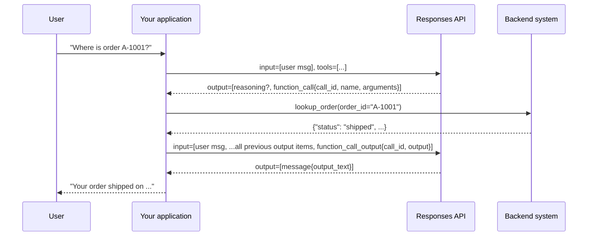

# Chapter 2 — Function Calling and Structured Outputs

> **Claude counterpart:** [Chapter 2 — Tools and `tool_use`](../../anthropic-claude/02-tool-use/README.md) (and the structured-output parts of [Chapter 6](../../anthropic-claude/06-prompt-engineering/README.md)) · **Academy course(s):** Design and Build Agentic Systems (API pathway) · **Est. time:** 5–7 hours (reading + notebooks) · **Status:** [ ] not started

## Why this matters for a solution architect

Function calling is where a model stops talking and starts acting on your systems: CRMs, order databases, payment APIs. Structured Outputs is where it stops producing prose and starts producing data your code can trust. On the OpenAI platform both features share one engine (constrained decoding against a JSON Schema), so the architecture questions are the same as on the Claude side: **which guarantees come from the API, and which ones must your code add?** The API can guarantee that arguments and outputs match a schema. It can't guarantee that a refund is allowed, that a total adds up, or that a customer ID is real. If you know exactly where that line falls, your system is neither over-engineered nor fragile.

This is a delta chapter. If you finished the Claude chapter, you already know the loop. The new parts are the names and shapes (`function_call` items, `call_id`, `arguments` as a JSON *string*, `text.format`), OpenAI's stricter "every field is required" rule, `allowed_tools`, and the fact that there is no `stop_reason` to drive the loop.

## Learning objectives

- [ ] Explain the Responses API round trip: `function_call` output item → your code runs the function → `function_call_output` input item, matched by `call_id`
- [ ] Decide between a function tool and a built-in tool, based on who executes the call
- [ ] Write function tools in the **Responses** (flat) shape, and translate to and from the **Chat Completions** (nested) shape
- [ ] Apply the strict-mode schema rules: `additionalProperties: false`, every property in `required`, optional fields as `["type", "null"]`
- [ ] Know what happens when you **omit** `strict` in Responses vs Chat Completions
- [ ] Choose a `tool_choice` (`auto`, `required`, `none`, a specific function, `allowed_tools`) and decide when to set `parallel_tool_calls: false`
- [ ] Write a bounded tool loop that replays every output item, returns one output per `call_id`, and reports tool errors as data
- [ ] Get typed data back with `text.format` (`json_schema`) and `client.responses.parse(text_format=PydanticModel)`
- [ ] Handle refusals and incomplete responses before you trust parsed output
- [ ] Separate **syntax** guarantees (the schema) from **semantic** validation (your code)

## Prerequisites

- [00-prerequisites](../../00-prerequisites/README.md): Python environment, `.env` with `OPENAI_API_KEY`, basic JSON Schema
- [Chapter 1 — Responses API fundamentals](../01-responses-api-fundamentals/README.md): request and response shape, output items, `status` / `incomplete_details`, conversation state (`previous_response_id`, `store`)
- Optional but recommended: [Claude Chapter 2 — Tools and `tool_use`](../../anthropic-claude/02-tool-use/README.md). This chapter assumes you know the tool-loop idea and focuses on the OpenAI differences.

All snippets below assume this setup (the same in every notebook):

```python
import json
import logging
import os

from dotenv import find_dotenv, load_dotenv
from openai import OpenAI

load_dotenv(find_dotenv())                       # loads OPENAI_API_KEY from .env, never hardcode keys
client = OpenAI()                                # the SDK reads OPENAI_API_KEY from the environment
MODEL = os.getenv("OPENAI_MODEL", "gpt-6-luna")  # cheap default for loops and experiments
```

`gpt-6-luna` is fine for the small tool sets in this chapter. For long multi-step tool use or hard extraction, compare it with `gpt-6.1-sol` (or `gpt-6-astra` for the hardest tasks) on your own examples before you choose.

---

## Concepts

### 2.1 The function-calling round trip

The model never runs your code. It returns a **`function_call` output item** (a name plus JSON arguments). Your application decides whether to run it, runs it, and sends the result back as a **`function_call_output` input item**. The two are linked by `call_id`.

OpenAI's docs describe five steps:

1. Make a request with the tools the model could call.
2. Receive a tool call from the model.
3. Execute code on your side with the tool call's input.
4. Make a second request that includes the tool output.
5. Receive a final response (or more tool calls).



What a function call looks like in `response.output`:

```json
{
  "type": "function_call",
  "id": "fc_12345xyz",
  "call_id": "call_12345xyz",
  "name": "lookup_order",
  "arguments": "{\"order_id\":\"A-1001\"}"
}
```

Three details trip people up:

| Detail | What to do |
|---|---|
| `arguments` is a **JSON-encoded string**, not an object | `json.loads(item.arguments)` before you use it (Claude's `tool_use.input` is already a dict) |
| There are **two IDs**: `id` (`fc_...`, the item) and `call_id` (`call_...`, the link) | Return results with `call_id`. Using `id` is a classic bug. |
| Reasoning models return **reasoning items** alongside the calls | Pass them back. The docs say reasoning items returned with tool calls "must also be passed back with tool call outputs". The simple way is to append the whole `response.output` to your input list. |

The minimal manual round trip (from the docs, adapted):

```python
input_list = [{"role": "user", "content": "Where is order A-1001?"}]
response = client.responses.create(model=MODEL, tools=tools, input=input_list)

input_list += response.output                    # keep EVERY output item: reasoning, function_call, message
for item in response.output:
    if item.type == "function_call":
        args = json.loads(item.arguments)
        result = call_function(item.name, args)  # your dispatcher
        input_list.append({
            "type": "function_call_output",
            "call_id": item.call_id,             # not item.id
            "output": json.dumps(result),        # a string (JSON, plain text, error codes: your choice)
        })

response = client.responses.create(model=MODEL, tools=tools, input=input_list)
print(response.output_text)
```

> **Gotcha:** Chat Completions models this differently: an assistant message with a `tool_calls` list, then one `{"role": "tool", "tool_call_id": ..., "content": ...}` message per call. In Responses, calls and outputs are separate **items**, not messages. Mixing the two shapes is the most common migration bug.

> **Exam trap:** "The model called the refund API" is never literally true. The model *requested* a call, and your code made it. Approval gates, permission checks and rate limits belong in your code, around execution.

#### Function tools vs built-in tools

Function calling is one of several kinds of tool in the same `tools` array. OpenAI's [tools overview](https://developers.openai.com/api/docs/guides/tools) also lists **built-in** tools: web search, file search, remote MCP servers, skills, shell, computer use, image generation, tool search and Programmatic Tool Calling. The difference that matters for your loop is **who executes the call**:

| Kind | Examples (`type`) | Who executes | What your loop does |
|---|---|---|---|
| **Function tool** | `function`, `custom` | Your application | Run it and return a `function_call_output` (or `custom_tool_call_output`) with the same `call_id` |
| **Hosted built-in tool** | `web_search`, `file_search`, `image_generation`, `shell` with a hosted container | OpenAI | Nothing to run: the call item (`web_search_call`, `file_search_call`, ...) and its result come back in the same response |
| **Remote MCP** | `mcp` | A remote MCP server, called by OpenAI | Usually nothing, except approving calls when the server config asks for approval |
| **Client-executed built-in tool** | `computer`, `shell` with a local environment, `apply_patch` | Your application, with a fixed OpenAI-defined schema | Run the action in your sandbox and return the matching `*_output` item |

**Rule: use a built-in tool when one exists.** If the requirement is "search the web" or "search our uploaded documents", don't write `search_web()` or a retrieval function: `web_search` and `file_search` are already integrated, maintained and cited. Write a function when the capability is **yours**: your CRM, your order database, your refund API, or a hosted tool that can't meet a requirement (an internal index, a data-residency rule, custom ranking). The two kinds can be combined in one request. Your loop should then execute **only** `function_call` items and leave hosted call items alone. [Chapter 4](../04-built-in-tools-and-mcp/README.md) covers each built-in tool, its pricing and its security model.

> **Note:** Some older OpenAI learning tracks list "code interpreter" among the built-in tools. The current tools overview lists hosted **shell** for code execution instead; Chapter 4 covers the status of `code_interpreter`.

### 2.2 Defining function tools: Responses vs Chat Completions shape

A function tool in the Responses API has these fields:

| Field | Purpose |
|---|---|
| `type` | Always `"function"` |
| `name` | The function's name, for example `lookup_order`. Keep it to letters, digits, `_` and `-`, at most 64 characters. That rule is written on the shared (Chat Completions) `FunctionDefinition` type in the OpenAI SDK; the Responses function-tool reference doesn't restate it, so treat it as the portable limit for both APIs. |
| `description` | When and how to use the function. This is the model's main signal for choosing a tool. |
| `parameters` | A JSON Schema object for the arguments |
| `strict` | Whether to enforce strict mode (see 2.3) |

The SDK also exposes newer optional fields such as `defer_loading` (for [tool search](https://developers.openai.com/api/docs/guides/tools-tool-search)) and `async` (see 2.5). Chapter 4 covers tool search.

**The two shapes.** The migration guide says Chat Completions function definitions are *externally tagged* and Responses definitions are *internally tagged*. In practice: Chat Completions nests everything under a `function` key, and Responses puts it at the top level.

```python
# Chat Completions (legacy but supported): nested under "function"
chat_tool = {
    "type": "function",
    "function": {
        "name": "lookup_order",
        "description": "...",
        "strict": True,
        "parameters": {...},
    },
}

# Responses API: flat
responses_tool = {
    "type": "function",
    "name": "lookup_order",
    "description": "...",
    "strict": True,
    "parameters": {...},
}
```

> **Gotcha:** `openai.pydantic_function_tool(MyModel)` returns the **Chat Completions** (nested) shape. `client.responses.parse(tools=[...])` accepts it and converts it for you, but `client.responses.create(tools=[...])` expects the flat shape. If you build tools with that helper and call `create()`, flatten them first (the practice notebook shows how).

Here is a definition written the way an architect should write it, for the customer-support agent used throughout this chapter:

```python
lookup_order = {
    "type": "function",
    "name": "lookup_order",
    "description": (
        "Look up ONE order by its order ID and return status, items, total in USD, "
        "order date and the owning customer ID. Use this for any question about an "
        "order's status, contents or delivery. Do NOT use it to find a customer; use "
        "get_customer for that. Order IDs look like 'A-1001'."
    ),
    "strict": True,
    "parameters": {
        "type": "object",
        "properties": {
            "order_id": {"type": "string", "description": "Order ID, e.g. A-1001"},
        },
        "required": ["order_id"],
        "additionalProperties": False,
    },
}
```

**OpenAI's best practices for function definitions** (from the function-calling guide):

1. **Write clear names, parameter descriptions and instructions.** Describe the purpose, each parameter and its format, and what the output means. Use the system prompt (`instructions`) to say when, and when not, to use each function.
2. **Apply software-engineering practice.** Make functions predictable, and **use enums and object structure to make invalid states impossible** (`toggle_light(on: bool, off: bool)` allows nonsense calls). Pass the "intern test": could a person use the function correctly from only what you gave the model?
3. **Offload work to code.** Don't make the model fill arguments you already know. If your app already has the `order_id`, define `submit_refund()` with no parameters and inject the ID in code. Combine functions that are always called in sequence.
4. **Keep the initial tool set small.** The docs suggest aiming for fewer than 20 functions available at the start of a turn (a soft suggestion), and using tool search to defer the rest.
5. **Remember the cost.** Function definitions are injected into the model's context and billed as input tokens.

Two related tool types you will see in the docs:

- **Namespaces** (`{"type": "namespace", "name": "crm", "tools": [...]}`) group related functions by domain. They matter most with tool search (Chapter 4).
- **Custom tools** (`{"type": "custom", ...}`) take **free-form text** instead of JSON arguments, optionally constrained by a Lark or regex grammar. The model returns a `custom_tool_call` item with an `input` string. Use them when wrapping the input in JSON adds nothing (code, SQL, a DSL).

> **Exam trap:** When the agent picks the wrong tool, the first fix is the same as on Claude: **rewrite and differentiate the descriptions** (and the `instructions`). Adding more tools, a routing classifier or fine-tuning are heavier options and come later.

### 2.3 Strict mode schema rules

`strict: true` makes the function's arguments reliably follow the schema, instead of best effort. It uses the same machinery as Structured Outputs. OpenAI recommends always enabling it. Strict mode has two hard requirements:

1. `additionalProperties` must be `false` on **every** object in `parameters`.
2. **Every** field in `properties` must be listed in `required`.

To make a field "optional", keep it required and add `null` to its type:

```python
"parameters": {
    "type": "object",
    "properties": {
        "email":       {"type": ["string", "null"], "description": "Customer email, or null"},
        "customer_id": {"type": ["string", "null"], "description": "Customer ID like C-001, or null"},
    },
    "required": ["email", "customer_id"],     # both listed, both nullable
    "additionalProperties": False,
}
```

> **Exam trap:** This is a real difference from Claude. Claude strict tools allow non-required (optional) parameters, within limits. OpenAI strict mode rejects a schema with any property missing from `required`. The OpenAI pattern is **required + nullable**, and the model sends `null` when the value doesn't apply.

**What happens if you leave `strict` out?** This differs by API:

| API | `strict` omitted | `strict: true` with a non-compliant schema |
|---|---|---|
| **Responses** | The API *tries* to normalize your schema into strict mode. If it can't, it falls back to non-strict, best-effort calling, and the tool in the response shows `strict: false`. Set `strict: false` to opt out explicitly. | The request is rejected with details of the missing constraints |
| **Chat Completions** | Non-strict by default | Rejected |

> **Gotcha:** Because Responses silently falls back, "I didn't set strict and it worked" doesn't mean you got strict guarantees. Set `strict: true` explicitly so a bad schema fails loudly at development time, not as an odd argument in production.

**Supported JSON Schema subset** (Structured Outputs guide; the same rules apply to strict functions):

| Area | Supported | Not supported |
|---|---|---|
| Types | string, number, boolean, integer, object, array, enum, `anyOf` | — |
| String keywords | `pattern`, `format` (`date-time`, `time`, `date`, `duration`, `email`, `hostname`, `ipv4`, `ipv6`, `uuid`) | — |
| Number keywords | `minimum`, `maximum`, `exclusiveMinimum`, `exclusiveMaximum`, `multipleOf` | — |
| Array keywords | `minItems`, `maxItems` | — |
| Structure | `$defs` + `$ref`, recursion (`"$ref": "#"`), `anyOf` inside properties | `anyOf` at the **root** (the root must be an object), `allOf`, `not`, `if`/`then`/`else`, `dependentRequired`, `dependentSchemas` |
| Size limits | Up to 5,000 object properties, 10 levels of nesting, 1,000 enum values in total, 120,000 characters of names/enum/const strings | — |

Fine-tuned models support less: no string, number, array or `patternProperties` constraints at all.

> **Unclear in the docs:** `minLength` and `maxLength` are **not** in the guide's list of supported string keywords, yet the same guide names them among the keywords that fine-tuned models "additionally" don't support, which hints that other models accept them. Because the documentation contradicts itself, don't depend on them. If a length limit matters (an SMS body, a database column), check it in code (2.8) and send a clear error back.

> **Note:** This is another difference from Claude. Claude's strict mode does **not** support `minimum`/`maximum`, but OpenAI's does (on non-fine-tuned models). You still need code-level validation for business rules, as 2.8 explains.

Other strict-mode facts:

- The **first request** with a new schema has extra latency while the API processes it. Later requests with the same schema don't.
- Output keys come back **in the order of the schema's keys**. Put reasoning-like fields (for example `explanation`) before the fields that depend on them.
- With **Pydantic**, `openai.pydantic_function_tool()` and `responses.parse(text_format=...)` generate a strict schema for you: every field goes into `required`, `Optional[...]` becomes `anyOf [..., null]`, and `additionalProperties: false` is added. A Pydantic default value does **not** make a field optional in the sent schema; the model still has to send a value (possibly `null`).

### 2.4 `tool_choice` and `parallel_tool_calls`

`tool_choice` controls **whether** the model must call a tool and **which** ones it may call.

| Value (Responses API) | Behavior | Typical use |
|---|---|---|
| `"auto"` (default) | Call zero, one or several functions | Assistants and agents |
| `"required"` | Call **one or more** functions; the model picks which | Unknown document type, several extraction tools, and you must get a tool call |
| `{"type": "function", "name": "lookup_order"}` | Call **exactly this** function | Forcing a pipeline step |
| `{"type": "allowed_tools", "mode": "auto" \| "required", "tools": [{"type": "function", "name": "..."}, ...]}` | Restrict this turn to a **subset** of the tools you sent | Per-turn permissions (read-only phase vs write phase) without changing `tools` |
| `"none"` | Don't call tools; behave as if no functions were passed | A pure text turn while keeping the tool list stable |

Why `allowed_tools` exists: the docs say you can restrict the callable subset "but not modify the list of tools you pass in, so you can maximize savings from prompt caching". Tool definitions are part of the prompt prefix. If you change the `tools` array, the prefix changes; if you change only `tool_choice`, the prefix stays the same.

```python
# Before the customer is verified: only read-only tools, and at least one call is required
response = client.responses.create(
    model=MODEL,
    tools=[get_customer, lookup_order, process_refund],   # stable list, cache-friendly
    tool_choice={
        "type": "allowed_tools",
        "mode": "required",
        "tools": [{"type": "function", "name": "get_customer"},
                  {"type": "function", "name": "lookup_order"}],
    },
    input=input_list,
)
```

The Chat Completions equivalents nest the function name: `{"type": "function", "function": {"name": "lookup_order"}}`.

**Parallel function calling.** The model may call several functions in one turn (several `function_call` items in one `output`). Setting `parallel_tool_calls: false` (a **top-level** request parameter) ensures that **zero or one** tool is called per turn. The docs add that on supported models from GPT-5 on, functions can be called in parallel when built-in tools are also available, but built-in tools can't be part of a parallel function-call batch.

| Want | Claude | OpenAI |
|---|---|---|
| Must call some tool | `tool_choice: {"type": "any"}` | `tool_choice: "required"` |
| Must call this tool | `{"type": "tool", "name": ...}` | `{"type": "function", "name": ...}` |
| No tools this turn | `{"type": "none"}` | `"none"` |
| At most one call per turn | `disable_parallel_tool_use: true` **inside** `tool_choice` | `parallel_tool_calls: false` **top-level** |

> **Exam trap:** `auto` does **not** guarantee a call. If the business process requires a tool to run, the guarantee comes from `required` / a forced function, or from code that checks for the call. A sentence in the prompt is not a guarantee.

> **Note:** In the Claude chapter, Claude Opus 5.5 / Sonnet 5.5 / Fable 5.1 reject forced tool use with a 400. The OpenAI function-calling guide documents no such restriction for `required` or forced functions.

### 2.5 The client-side loop, and errors in tool outputs

There is **no `stop_reason`** in the Responses API. Your loop decides what to do from the **output items** and the response `status`:

| What you see | Meaning | Loop action |
|---|---|---|
| `status == "completed"` and one or more `function_call` items | The model wants your functions to run | Run them, append one `function_call_output` per `call_id`, call again |
| `status == "completed"`, a `message`, no `function_call` | The model has finished | Return `response.output_text` |
| `status == "incomplete"`, `incomplete_details.reason == "max_output_tokens"` | Output was cut off | Don't execute half-written calls; raise the limit or fail |
| `status == "incomplete"`, `reason == "content_filter"` | Generation was stopped by the content filter | Stop and handle it |
| A `refusal` content part in the message | The model declined (see 2.7) | Stop; never act on that turn |

```python
def run_agent(user_text: str, tools: list[dict], handlers: dict, max_turns: int = 8) -> str:
    input_list: list = [{"role": "user", "content": user_text}]
    for _ in range(max_turns):                                   # your own bound; see the gotcha below
        response = client.responses.create(
            model=MODEL, instructions=INSTRUCTIONS, tools=tools, input=input_list,
        )
        if response.status != "completed":
            raise RuntimeError(f"Response {response.status}: {response.incomplete_details}")

        refusal = find_refusal(response)                         # 1. a refusal is "completed" too:
        if refusal is not None:                                  #    never act on (or hide) a refused turn
            return f"[refused] {refusal}"
        input_list += response.output                            # 2. replay ALL items (reasoning too)
        calls = [i for i in response.output if i.type == "function_call"]
        if not calls:                                            # 3. no calls -> final answer
            return response.output_text

        for call in calls:                                       # 4. one output per call_id
            input_list.append({
                "type": "function_call_output",
                "call_id": call.call_id,
                "output": execute_tool(call, handlers),          # always a string, errors included
            })
    raise RuntimeError("Agent exceeded max_turns")


def find_refusal(response) -> str | None:
    """Return the refusal text if the model declined, else None."""
    for item in response.output:
        if item.type == "message":
            for part in item.content:
                if part.type == "refusal":
                    return part.refusal
    return None
```

Without step 1, a refused turn has no `function_call` items, so the loop would return `response.output_text`, which is an empty string, and the refusal would be silently lost.

**Errors are data.** `function_call_output` has **no `is_error` flag** (unlike Claude's `tool_result`). The docs say the output "should typically be a string, where the format is up to you (JSON, error codes, plain text, etc.)". So the convention is yours to design. A good one is a JSON object that says what went wrong, whether retrying makes sense, and what to do next:

```python
def execute_tool(call, handlers: dict) -> str:
    """Run one function call. Never raise: every failure becomes an output the model can read."""
    handler = handlers.get(call.name)
    if handler is None:
        return json.dumps({"error": "unknown_tool", "retryable": False,
                           "message": f"No tool named {call.name!r}."})
    try:
        args = json.loads(call.arguments)
    except json.JSONDecodeError as exc:                  # only possible without strict mode
        return json.dumps({"error": "invalid_json", "retryable": False, "message": str(exc)})
    try:
        return json.dumps(handler(**args))               # serialization inside the try: a result that
    except TimeoutError:                                 # isn't JSON-serializable must not escape either
        return json.dumps({"error": "timeout", "retryable": True,
                           "message": "Order service timed out. Try once more, then tell the user."})
    except PermissionError as exc:                       # ownership / authorization rules
        return json.dumps({"error": "not_allowed", "retryable": False, "message": str(exc)})
    except (LookupError, ValueError) as exc:             # not found, validation, business rules
        return json.dumps({"error": "invalid_request", "retryable": False, "message": str(exc)})
    except Exception:                                    # anything else: log it, but don't leak internals
        logging.exception("tool %s failed", call.name)
        return json.dumps({"error": "internal_error", "retryable": False,
                           "message": "Unexpected failure. Apologize and offer a human handoff."})
```

Rules for the loop:

- **Replay every output item.** Appending only the text, or only the function calls, drops reasoning items. The conversation-state guide says to "preserve every item in the response's `output` array" for stateless reasoning requests.
- **One `function_call_output` for every `call_id`,** including failed calls. Don't silently drop a call. Return an error output instead.
- **Parallel calls:** run them (concurrently if they are independent and safe), then append **all** outputs before the next request.
- **Server-side state is an option.** Instead of replaying, send `previous_response_id=response.id` and only the new `function_call_output` items as `input`. Resend `instructions` and `tools` every time: `previous_response_id` doesn't carry the previous response's top-level `instructions`. (State trade-offs are covered in Chapter 1.)
- **Bound the loop yourself.** The `max_tool_calls` request parameter limits calls to **built-in** tools only, not your functions.
- **Retry transient failures inside the tool** (with backoff). Send **validation** errors straight back with details, because retrying them never helps.

**Async function tools (newer models).** Setting `"async": true` on a function or custom tool lets the model keep working after it issues the call. You return the result later on the original `call_id` (usually with `previous_response_id`), and the call item carries `async: true` (`call.async_` in the Python SDK). Your application still executes the tool. The async tool-calling guide says it "is supported by GPT-6 Astra and later models", and says not to combine async tools with parallel tool calls in multi-agent mode. The docs don't say whether GPT-6 Luna or GPT-6.1 Sol count as "later" for this feature (the GPT-6 guide lists async tool calling under "What's new" for GPT-6 in general, and the model pages don't mention it), so confirm on your model before you design around it. Treat it as an optimization for slow lookups, not a default.

> **Exam trap:** The loop ends when a completed response contains **no function calls**, not when the text contains "done" and not after a fixed number of iterations. Keep `max_turns` as a safety net only.

### 2.6 Structured Outputs: `text.format` and `responses.parse()`

Structured Outputs makes the model's **final answer** match your JSON Schema. The docs give a simple rule for choosing between the two forms:

- Connecting the model to tools, functions or data in your system → **function calling** (strict).
- Structuring the model's response to the user or to your pipeline → **`text.format`** with `json_schema`.

The raw form (Responses API):

```python
response = client.responses.create(
    model=MODEL,
    input="Classify this support ticket: 'I was charged twice for order A-1001.'",
    text={
        "format": {
            "type": "json_schema",
            "name": "ticket_classification",   # a-z, A-Z, 0-9, _ and -, max 64 chars
            "strict": True,
            "schema": {
                "type": "object",
                "properties": {
                    "category": {"type": "string", "enum": ["billing", "shipping", "account", "unclear", "other"]},
                    "category_detail": {"type": ["string", "null"]},
                    "order_id": {"type": ["string", "null"]},
                },
                "required": ["category", "category_detail", "order_id"],
                "additionalProperties": False,
            },
        }
    },
)
data = json.loads(response.output_text)
```

The SDK form with Pydantic (one source of truth for the schema and the validation):

```python
from typing import Literal, Optional
from pydantic import BaseModel

class TicketClassification(BaseModel):
    category: Literal["billing", "shipping", "account", "unclear", "other"]
    category_detail: Optional[str]     # required key, value may be None
    order_id: Optional[str]

response = client.responses.parse(
    model=MODEL,
    input="Classify this support ticket: 'I was charged twice for order A-1001.'",
    text_format=TicketClassification,
)
ticket = response.output_parsed        # a TicketClassification instance, or None (refusal etc.)
```

| Mechanism | Where | Guarantees |
|---|---|---|
| **JSON mode** `text={"format": {"type": "json_object"}}` | Older approach | Valid JSON only, **no** schema adherence. You must mention "JSON" in the context, or the API returns an error |
| **Structured Outputs** `text.format` `json_schema` + `strict: true` | Final answer | Valid JSON **and** schema adherence (supported subset) |
| **`responses.parse(text_format=Model)`** | SDK helper | Same as above, plus a parsed Pydantic object in `output_parsed` |
| **Strict function tools** | Tool arguments | Arguments match the tool's schema |
| **`responses.parse(tools=[openai.pydantic_function_tool(Model)])`** | SDK helper | Parsed tool arguments in `call.parsed_arguments` |

> **Gotcha:** Structured Outputs moved. Chat Completions uses `response_format={"type": "json_schema", "json_schema": {"name": ..., "strict": True, "schema": ...}}`. Responses uses `text={"format": {"type": "json_schema", "name": ..., "strict": True, "schema": ...}}`: one level less nesting, and `name` / `schema` sit directly in `format`. Sending `response_format` to Responses is listed as a common migration error. In the SDK, passing both `text={"format": ...}` and `text_format=` to `parse()` raises a `TypeError`.

**Schema design principles** (same as the Claude chapter, adapted to OpenAI's "all required" rule):

1. **Required + nullable for information that may be absent.** Since every key is required in strict mode, `null` is how the model says "not in the source". Describe it: "null if the ticket has no order ID".
2. **Enums with `"other"` + a detail field**, and an honest **`"unclear"`** value for routing to human review.
3. **Field descriptions are prompts.** Spell out units and formats ("amount in USD", "ISO 8601 date").
4. **Tell the model what to do with unrelated input.** The docs warn that the model "will always try to adhere to the provided schema, which can result in hallucinations if the input is completely unrelated to the schema". Give it a way out (an `"unclear"` category, nullable fields) and an instruction to use it.
5. **Avoid schema drift.** Generate the schema from your types (Pydantic) instead of maintaining a hand-written copy.

### 2.7 Refusals and incomplete responses

A schema can't stop two things: a **safety refusal**, and a response that is **cut off**. Check both before you trust parsed data.

**Refusals.** When the model refuses for safety reasons, the output message contains a content part of type `refusal` instead of `output_text`. The refusal doesn't follow your schema. The response `status` is still `"completed"`, so checking `status` alone is not enough.

```json
{"type": "message", "role": "assistant",
 "content": [{"type": "refusal", "refusal": "I'm sorry, I cannot assist with that request."}]}
```

**Incomplete responses.** If the response hits `max_output_tokens` (or the content filter), `status` is `"incomplete"` and `incomplete_details.reason` says why. The JSON may be truncated.

The handling order:

```python
def read_structured(response) -> dict:
    if response.status != "completed":                   # incomplete, failed, cancelled, queued, ...
        reason = response.incomplete_details.reason if response.incomplete_details else None
        raise RuntimeError(f"Response {response.status} ({reason})")   # never parse a non-final payload
    for item in response.output:
        if item.type != "message" or item.phase not in (None, "final_answer"):
            continue                                     # skip reasoning, tool calls and commentary preambles
        for part in item.content:
            if part.type == "refusal":
                return {"refused": True, "reason": part.refusal}          # show it, log it, don't parse
            if part.type == "output_text":
                return {"refused": False, "data": json.loads(part.text)}
    raise RuntimeError("No final-answer message in output")
```

Assistant messages can carry a `phase`: `"commentary"` for intermediate updates such as a preamble, `"final_answer"` for the answer itself (older responses have no phase). Only final-answer text is your structured result. The SDK's `parse()` follows the same rule, and `response.output_text` does not: it concatenates the text of **every** message, preambles included.

With `responses.parse()`, `response.output_parsed` is `None` when there is no parsed text (for example on a refusal), so check for `None` and look for the refusal part before you use the object. Note that `parse()` validates the text **inside the call**: a truncated JSON payload from an `incomplete` response raises `pydantic.ValidationError` from `parse()` itself, before your code can look at `status`. Catch that exception (as in 2.8), or call `responses.create()`, run `read_structured()`, and then validate with `Model.model_validate(...)`.

| Situation | Claude | OpenAI |
|---|---|---|
| Safety refusal | `stop_reason: "refusal"` | `refusal` content part; `status` is `completed` |
| Output cut off | `stop_reason: "max_tokens"` | `status: "incomplete"`, `incomplete_details.reason: "max_output_tokens"` |

> **Exam trap:** "We use Structured Outputs, so `json.loads(response.output_text)` can never fail" is wrong. Refusals and truncated responses are the documented exceptions. Check `status` and the content type first.

### 2.8 Syntax vs semantic validation

| Error type | Examples | What prevents or catches it |
|---|---|---|
| **Syntax / structural** | Invalid JSON, wrong type, missing key, value outside the enum, extra keys | Strict functions and `text.format` `json_schema` **eliminate** these by construction. The documented exceptions are refusals and incomplete responses (2.7). |
| **Semantic** | Line items don't add up to the total, a plausible but invented order ID, a refund larger than the order, dates out of order, the wrong category | **Your code**: Pydantic validators, cross-field checks, lookups against real data, retry with specific feedback, human review |

The docs say it directly: "Structured Outputs can still contain mistakes." A schema guarantees **shape**, never **truth**.

```python
from pydantic import BaseModel, ValidationError

class LineItem(BaseModel):
    description: str
    amount_usd: float

class InvoiceExtraction(BaseModel):
    invoice_number: str | None       # null if the document has no invoice number
    line_items: list[LineItem]
    stated_total_usd: float | None   # the total exactly as printed; null if no total is printed

def cents(usd: float) -> int:
    return round(usd * 100)          # compare money as integer cents, never as raw floats

def semantic_errors(inv: InvoiceExtraction) -> list[str]:
    errors = []
    computed = sum(cents(i.amount_usd) for i in inv.line_items)
    if inv.stated_total_usd is not None and abs(computed - cents(inv.stated_total_usd)) > 1:   # > 1 cent
        errors.append(f"sum(line_items)={computed / 100:.2f} but stated_total_usd={inv.stated_total_usd}; "
                      "re-check each amount.")
    return errors
```

**Retry with feedback** when the model can fix the mistake from what it already has:

```python
def extract_with_retry(document: str, max_retries: int = 2) -> InvoiceExtraction:
    input_list = [{"role": "user", "content": f"Extract the invoice data:\n\n{document}"}]
    for _ in range(max_retries + 1):
        try:
            response = client.responses.parse(model=MODEL, input=input_list, text_format=InvoiceExtraction)
        except ValidationError as exc:         # parse() validates first: truncated JSON raises here (2.7)
            raise ValueError("Unparseable extraction (likely truncated); route to human review") from exc
        invoice = response.output_parsed
        if response.status != "completed" or invoice is None:
            raise ValueError("No valid extraction (incomplete or refused); route to human review")
        if invoice.stated_total_usd is None:   # missing from the source: a retry can't fix that
            raise ValueError("No total printed on the invoice; route to human review")
        errors = semantic_errors(invoice)
        if not errors:
            return invoice
        input_list += response.output          # the previous attempt
        input_list.append({"role": "user", "content": "Validation failed:\n- " + "\n- ".join(errors)
                           + "\nCorrect only the affected fields. Don't invent values: use null for "
                             "invoice_number or stated_total_usd if they are not in the document."})
    raise ValueError(f"Still inconsistent after retries; route to human review: {errors}")
```

- **Retries help with:** values in the wrong field, arithmetic the model can re-check, format slips.
- **Retries don't help when the information isn't in the source.** They only produce more confident fabrication. Return `null` or escalate.
- **Extract the stated total and compute the sum in code.** Don't ask the model to "make the totals match": it will quietly fudge a number. A mismatch may be a real error in the source document, and that should be flagged.
- **The same applies to tool arguments.** A strict `process_refund(order_id, amount_usd)` call can still name another customer's order, exceed what is still refundable (the order total minus earlier refunds), or repeat a refund that already went through. Check ownership, status, the remaining refundable amount and limits in the handler, make the operation idempotent (for example, an idempotency key per refund request), and return a clear error output.

> **Exam trap:** "We enabled strict mode, so the extraction is now correct" is wrong. Strict mode removes syntax errors only. Business rules need validation code plus retry-with-feedback or human review.

---

## Claude ↔ OpenAI comparison

| Concept | Claude (Messages API) | OpenAI (Responses API) | Architect takeaway |
|---|---|---|---|
| Tool definition | `{name, description, input_schema, strict?, input_examples?}` | `{type: "function", name, description, parameters, strict}` (flat). Chat Completions nests it under `function`. | Keep one internal tool registry and render it per provider |
| Tool call | `tool_use` content block; `input` is an object; `id` | `function_call` output item; `arguments` is a JSON **string**; `call_id` (plus a separate item `id`) | `json.loads` on OpenAI; match on `call_id`, not `id` |
| Tool result | `tool_result` block in the next **user message**, `tool_use_id`, optional `is_error` | `function_call_output` **input item**, `call_id`, `output` string (or image/file array), **no error flag** | On OpenAI, design your own error format inside `output` |
| Loop signal | `stop_reason == "tool_use"` / `"end_turn"` | No `stop_reason`: `function_call` items present or not, plus `status` / `incomplete_details` | Drive the loop from structured signals on both, never from text |
| History to replay | Full assistant `content` (text, thinking, tool_use) | Every `output` item (reasoning, function_call, message), or `previous_response_id` | Dropping reasoning items breaks reasoning models on OpenAI |
| Strict tools default | Off unless `strict: true` | Responses: tries strict when omitted, falls back silently; Chat Completions: off | Always set `strict: true` explicitly on OpenAI too |
| Optional params in strict mode | Allowed (within limits on optional and union parameters) | Not allowed: every property in `required`; use `["type", "null"]` | Required + nullable is the portable pattern |
| Numeric/string constraints in strict mode | `minimum`/`maximum`/`minLength`/`maxLength` not supported | `minimum`/`maximum`/`multipleOf`, `pattern`, `format` supported (not on fine-tuned models) | Still validate business rules in code on both |
| Force some tool | `tool_choice: {"type": "any"}` (rejected on Opus 5.5 / Sonnet 5.5 / Fable 5.1) | `tool_choice: "required"` | Same idea, different name |
| Force one tool | `{"type": "tool", "name": ...}` (same model restriction) | `{"type": "function", "name": ...}` | — |
| Restrict to a subset | No `tool_choice` option in the Claude chapter; send a smaller `tools` list | `{"type": "allowed_tools", "mode": ..., "tools": [...]}` | OpenAI keeps the tool list (and cache prefix) stable |
| One call per turn | `disable_parallel_tool_use: true` inside `tool_choice` | `parallel_tool_calls: false` (top level) | Different place, same intent |
| Structured final answer | `output_config.format`, `client.messages.parse(output_format=Model)` → `parsed_output` | `text.format` (`json_schema`), `client.responses.parse(text_format=Model)` → `output_parsed` | Near-identical; watch the parameter names |
| Refusal | `stop_reason: "refusal"` | `refusal` content part, `status` still `completed` | Check content type, not just status |
| Truncation | `stop_reason: "max_tokens"` | `status: "incomplete"`, reason `max_output_tokens` | Never execute or parse a truncated turn |
| Free-text tool input | Not covered in the Claude chapter | Custom tools (`type: "custom"`) with optional Lark/regex grammar | Useful for code/SQL/DSL inputs |
| Deferred async results | Not covered in the Claude chapter | `async: true` function tools (GPT-6 Astra and later; confirm before using on Luna or 6.1 Sol) | Optimization for slow tools; your app still runs them |
| Loop helper in the SDK | Tool Runner (beta) | Agents SDK `Runner` (Chapter 3) | Write the manual loop once, then use the helper |

---

## Notebooks

| File | Sections covered | Mini-project / contents |
|---|---|---|
| [`01_practice.ipynb`](01_practice.ipynb) | 2.1 round trip by hand (`call_id` vs `id`, replaying reasoning items), and a mixed response where only the `function_call` is yours to run (hosted `web_search_call` / `file_search_call` are not) · 2.2 flat vs nested tool shapes, `pydantic_function_tool` · 2.3 a strict-schema linter and what Pydantic sends · 2.4 every `tool_choice` form, parallel calls, a forced call on "Hi there!" · 2.5 `execute_tool` with JSON error outputs and a bounded loop · 2.6 `text.format` and `responses.parse` · 2.7 refusal / truncation handling · 2.8 invoice extraction with semantic retry. Most cells run offline on fake `Response` objects built from the real SDK types; five small cells are live. | **Customer-support agent loop:** `get_customer` / `lookup_order` / `process_refund` on fake in-memory data, `allowed_tools` phase gating, ownership and refund-limit rules enforced in code, run offline with a scripted client and then live |
| [`02_homework.ipynb`](02_homework.ipynb) | All | 10-question scenario quiz (hashed answer key) · 6 offline exercises with auto-checks (tool-shape converter, `make_strict`, phase-aware request builder, one output per `call_id`, bounded loop, refusal → truncation → semantic validation) · airline disruption-assistant architecture scenario with rubric · scorecard (pass mark 72%) |

Theory stays in this README; notebooks hold code. Run them from the repo root venv (see [../../00-prerequisites/README.md](../../00-prerequisites/README.md)).

---

## Architect decision cheat-sheet

| Situation | Choose | Over | Why |
|---|---|---|---|
| New integration | Responses API function tools | Chat Completions functions | Recommended for new work; GPT-6 Astra / 6.1 Sol need Responses for tool calling, and Luna supports Chat Completions function calling only with `reasoning_effort: "none"` |
| Model picks the wrong tool | Rewrite and differentiate descriptions and `instructions` | Routing classifier, fine-tuning | Descriptions are the selection mechanism; fix the cheap root cause first |
| You only need JSON back, no action taken | `text.format` / `responses.parse(text_format=...)` | A fake "extraction function" with forced `tool_choice` | Purpose-built for the final answer; the docs recommend it for this case |
| Arguments must always type-check | `strict: true` (explicitly) | Omitting `strict` | Responses may fall back to non-strict silently |
| A field may be absent | Required + nullable + "null if absent" | Leaving it out of `required` | Strict mode rejects it, and forcing a non-null value invites fabrication |
| Different permissions per phase (read-only before verification) | `tool_choice: allowed_tools` | Rebuilding the `tools` list each turn | Stable prefix for prompt caching; same security effect |
| Must get some tool call | `tool_choice: "required"` | `auto` + prompt wording | `auto` may answer in prose |
| Calls have ordering dependencies or side effects | `parallel_tool_calls: false`, plus preconditions checked in each handler (or per-step `allowed_tools`) | Default parallel calls | `parallel_tool_calls: false` guarantees zero or one call per turn, so calls run one at a time. It doesn't make the model pick the right next call: enforce the order in code |
| Slow independent lookups on a GPT-6 Astra-class model | `async: true` tools | Blocking the whole turn | The model keeps working; your app still owns execution |
| Irreversible action (refund) | Code-level preconditions in the handler (ownership, status, limits, approval) | Warnings in the description | Probabilistic compliance isn't enough for destructive actions |
| Extraction is well-formed but numbers disagree | Semantic validation + retry with the specific error | "Be careful" prompt, bigger model only | Schemas can't express cross-field business rules |

## Common mistakes and anti-patterns

- **Returning the output with `item.id` (`fc_...`) instead of `item.call_id` (`call_...`).**
- **Treating `arguments` as a dict.** It's a JSON string; `json.loads` it.
- **Appending only the text or only the function calls** to history and dropping reasoning items.
- **Passing Chat Completions-shaped tools** (`{"type": "function", "function": {...}}`) to `responses.create`, including the output of `openai.pydantic_function_tool()`.
- **Using `response_format` in a Responses request** instead of `text.format`.
- **Leaving optional fields out of `required`** in a strict schema, or forgetting `additionalProperties: false` on nested objects.
- **Assuming that omitting `strict` gives you strict mode** (Responses may fall back silently).
- **Raising an exception out of the loop when a tool fails**, or dropping that call, instead of returning an error output for its `call_id`.
- **Generic error strings** ("Operation failed") that give the model nothing to act on.
- **Relying on `max_tool_calls` to stop a runaway function loop.** It only counts built-in tools.
- **Ending the loop by parsing text** ("if 'done' in text") instead of checking for function calls.
- **Parsing without checking `status` and refusals.**
- **Treating strict mode as a correctness guarantee.** It guarantees shape, not truth.
- **Retrying forever** on missing information or validation errors, while not retrying real timeouts inside the tool.

---

## Self-check

**Q1. (Migration)** You are reviewing a pull request that moves a Chat Completions tool loop to the Responses API. The tools are still built with `openai.pydantic_function_tool()` and passed unchanged to `client.responses.create()`. What must change before this can work?

- A) Nothing, because Responses doesn't support strict tools and ignores the extra fields
- B) The tools are in the nested Chat Completions shape; `responses.create()` expects `name`, `description`, `parameters` and `strict` at the top level, so flatten them (or call `responses.parse()`, which converts them)
- C) `tool_choice` must be set to `"required"` in Responses
- D) Pydantic models can't be used with the Responses API, so rewrite the schemas by hand

<details><summary>Answer</summary>

**B.** `pydantic_function_tool()` returns the Chat Completions shape (`{"type": "function", "function": {...}}`). The Responses function-tool type has `name`, `parameters` and `strict` at the top level. The SDK's `responses.parse()` converts the nested shape for you, but `responses.create()` sends your `tools` as they are, so flatten them first (homework exercise 1). A is wrong: Responses supports strict tools and even tries strict mode when `strict` is omitted. C has nothing to do with the tool shape. D is wrong: `responses.parse(text_format=...)` and converted tools work with Pydantic. (This answer relies on the documented shapes and the SDK source. The exact API error for a nested tool isn't documented, so the question asks what must change rather than what the error says.)
</details>

**Q2. (Strict schemas)** A strict `get_customer` tool has `properties` `email` and `customer_id`, with `"required": ["email"]` because callers send one or the other. The request is rejected. What is the correct fix?

- A) Remove `strict: true` and validate in code
- B) Add `customer_id` to `required` and make both fields nullable (`["string", "null"]`), describing that one of them may be null
- C) Add `"additionalProperties": true` so the schema is more flexible
- D) Split the tool into `get_customer_by_email` and `get_customer_by_id`

<details><summary>Answer</summary>

**B.** OpenAI strict mode requires every property to be listed in `required` and `additionalProperties: false`. Optional values are expressed as a union with `null`. A gives up the guarantee. C breaks the other strict requirement. D can work, but it doubles the tool surface to avoid a one-line schema fix, so it isn't the correct first fix.
</details>

**Q3. (Agent loop)** A teammate's loop sends results back as `{"type": "function_call_output", "call_id": item.id, "output": ...}` and only appends `function_call` items (not reasoning items) to the history. Responses become erratic or fail. Which pair of fixes is correct?

- A) Use `item.call_id`, and append every item in `response.output` to the input list
- B) Use `item.id`, and append only the final message text
- C) Send each result in its own request, and switch to Chat Completions
- D) Set `parallel_tool_calls: false`, and remove `instructions`

<details><summary>Answer</summary>

**A.** Outputs are matched by `call_id`, not the item `id`. Reasoning items returned with tool calls must be passed back, and the simplest correct approach is to replay the whole `output` array. B repeats both bugs. C and D don't address the cause.
</details>

**Q4. (`tool_choice`)** Your support agent sends `get_customer`, `lookup_order` and `process_refund` on every turn to keep prompt caching effective. Before the customer is verified, the model must call a read-only tool and must not be able to call `process_refund`. Which request setting fits best?

- A) `tool_choice: "required"`, and a sentence in `instructions` saying not to refund yet
- B) Remove `process_refund` from `tools` until verification
- C) `tool_choice: {"type": "allowed_tools", "mode": "required", "tools": [get_customer, lookup_order references]}`
- D) `tool_choice: {"type": "function", "name": "get_customer"}` on every turn

<details><summary>Answer</summary>

**C.** `allowed_tools` restricts the callable subset for this turn without changing the `tools` list (so the cached prefix stays stable), and `mode: "required"` guarantees a call. A relies on the prompt for a security rule. B works functionally but changes the prefix every phase, which is exactly what `allowed_tools` is designed to avoid. D forces one tool even when `lookup_order` is the right one. (Keep a code-level check in the refund handler anyway.)
</details>

**Q5. (Errors)** `lookup_order` sometimes times out (succeeds on retry) and sometimes gets an unknown order ID (never succeeds). Both currently raise an exception that crashes the loop. What should you change?

- A) Catch nothing; let the caller retry the whole conversation
- B) Retry timeouts with backoff inside the tool; for unknown IDs return a `function_call_output` for that `call_id` with a clear JSON error (`"error": "not_found", "retryable": false`, and what to ask the user)
- C) Return an empty string as the output for both cases
- D) Set `is_error: true` on the `function_call_output`

<details><summary>Answer</summary>

**B.** The tool knows which failure happened, so deterministic retry belongs there. Validation-type errors go straight back as data the model can act on, and every `call_id` still gets an output. A wastes work and loses context. C gives the model nothing. D: `function_call_output` has no `is_error` field on OpenAI; that is Claude's `tool_result` field.
</details>

**Q6. (Structured Outputs)** You call `client.responses.parse(text_format=Invoice)` and then do `response.output_parsed.total`. In production this sometimes raises `AttributeError: 'NoneType' object has no attribute 'total'`, although `response.status == "completed"`. What is the most likely cause, and the fix?

- A) A network error; add retries
- B) A refusal; look for a `refusal` content part in the message and handle it before using `output_parsed`
- C) The schema is too large; split it
- D) `max_output_tokens` was reached; raise it

<details><summary>Answer</summary>

**B.** A refusal comes back with `status: "completed"` and a `refusal` content part, so there is nothing to parse and `output_parsed` is `None`. D would show `status: "incomplete"`. A would raise an exception from the client, not return a response. C would be rejected at request time.
</details>

**Q7. (Validation)** After moving an invoice extractor to `text.format` with a strict schema, JSON errors drop to zero, but 4% of invoices have line items that don't add up to the stated total. What is the right next step?

- A) Nothing; strict mode guarantees correct values
- B) Add `minimum: 0` to every amount field
- C) Compute the sum in code, compare it with the extracted stated total, re-prompt with the specific discrepancy, and send cases that still fail to human review
- D) Switch to JSON mode for more flexibility

<details><summary>Answer</summary>

**C.** This is a semantic error. The schema guarantees shape, and the docs explicitly warn that Structured Outputs can still contain mistakes. B is supported on OpenAI but can't express "sum equals total". D removes the schema guarantee.
</details>

**Q8. (Model and API choice)** A team wants to keep Chat Completions and use `gpt-6.1-sol` with function calling for a new agent. What does the current guidance say?

- A) That works the same as on Responses
- B) GPT-6.1 Sol requires the Responses API for tool calling; use Responses for the new agent
- C) Function calling is only available on `gpt-6-astra`
- D) They must use JSON mode instead of tools

<details><summary>Answer</summary>

**B.** The GPT-6 guidance says GPT-6 Astra and GPT-6.1 Sol support Chat Completions but tool calling requires Responses. GPT-6 Sol and GPT-6 Luna support function calling in Chat Completions only with `reasoning_effort: "none"`. C and D are false.
</details>

**Q9. (Function vs built-in tool)** A support agent must answer questions from the company's uploaded policy PDFs and check the live status of orders in an internal database. A teammate proposes two functions, `search_policies(query)` (calling a home-grown vector index) and `lookup_order(order_id)`, and one loop that executes every tool-call item in `response.output`. What is the better design?

- A) Keep both functions; built-in tools are only for prototypes
- B) Use `file_search` (hosted) for the policy PDFs and a strict `lookup_order` function for the database; the loop executes only `function_call` items, because hosted calls have already run at OpenAI
- C) Use `web_search` for both, because it can reach any URL
- D) Use only `lookup_order`, and paste every policy PDF into `instructions`

<details><summary>Answer</summary>

**B.** Use a built-in tool when one exists (retrieval over uploaded files is `file_search`), and write a function only for capabilities that are yours (the order database). Hosted call items such as `file_search_call` come back already executed, so a loop that tries to "execute" every call item is wrong. A rebuilds a maintained capability for no gain, unless a requirement rules the hosted tool out. C can't reach an internal database. D wastes context and money on every turn and doesn't scale.
</details>

---

## Certification coverage

OpenAI has no public architect certification. This table maps the chapter to the OpenAI Academy courses, bootcamps and developer tracks this repo targets (`OAI/...` IDs) and to the solution-architect competency matrix (`ROLE/...` IDs). Items marked **[INFERRED]** are not stated on the course page itself (course internals are behind sign-in); they are mapped from the matching bootcamp session or developer track, so treat them as likely, not confirmed, curriculum.

| Requirement ID | What it asks (short) | Where in this chapter | Depth (Primary/Supporting) |
|---|---|---|---|
| `OAI/api/design-build-agentic-systems/16` **[INFERRED]** | The function-calling flow (define, model calls, you execute, return, model continues); compare with built-in tools and use one when it exists | [2.1](#21-the-function-calling-round-trip), [Function tools vs built-in tools](#function-tools-vs-built-in-tools), [2.5](#25-the-client-side-loop-and-errors-in-tool-outputs), Self-check Q3 and Q9; `01_practice.ipynb` 2.1 and 2.5 | Primary |
| `OAI/api/design-build-agentic-systems/22` **[INFERRED]** | Use structured outputs (strict JSON schema) for any agent output the application consumes | [2.6](#26-structured-outputs-textformat-and-responsesparse), [2.7](#27-refusals-and-incomplete-responses), [cheat-sheet](#architect-decision-cheat-sheet); `01_practice.ipynb` 2.6–2.7 | Primary |
| `OAI/bootcamp/api-builder/5` | API Foundations: structured outputs | [2.6](#26-structured-outputs-textformat-and-responsesparse)–[2.8](#28-syntax-vs-semantic-validation); `01_practice.ipynb` 2.6–2.8; homework exercise 6 | Primary |
| `OAI/tracks/ai-app-development/9` | Structured outputs (strict JSON schema) and strict function-call schemas for reliable outputs | [2.3](#23-strict-mode-schema-rules), [2.6](#26-structured-outputs-textformat-and-responsesparse); `01_practice.ipynb` 2.3 (strict-schema linter); homework exercise 2 (`make_strict`) | Primary |
| `OAI/tracks/building-agents/6` | Function-calling flow: define, model calls, you execute, return result, model continues | [2.1](#21-the-function-calling-round-trip), [2.5](#25-the-client-side-loop-and-errors-in-tool-outputs); `01_practice.ipynb` 2.1, 2.5 and the mini-project | Primary |
| `OAI/tracks/building-agents/21` | Structured outputs for app-consumed output, and output guardrails for user-facing agents | [2.6](#26-structured-outputs-textformat-and-responsesparse) covers the structured-output half; output guardrails are in [Chapter 3](../03-agents-sdk-and-agents-api/README.md) | Supporting |
| `ROLE/AGENT/2` | Tool / function-calling design: reliable tool schemas and descriptions, tool errors and the tool-result flow | [2.2](#22-defining-function-tools-responses-vs-chat-completions-shape)–[2.5](#25-the-client-side-loop-and-errors-in-tool-outputs); `01_practice.ipynb` mini-project; homework exercises 1–5 | Primary |
| `ROLE/PROMPT/3` | Structured outputs and schema enforcement, with validation and retry loops | [2.6](#26-structured-outputs-textformat-and-responsesparse)–[2.8](#28-syntax-vs-semantic-validation) (`extract_with_retry`); `01_practice.ipynb` 2.8; homework exercise 6 | Primary |

---

## Official documentation

- [Function calling](https://developers.openai.com/api/docs/guides/function-calling): definitions, `tool_choice`, `allowed_tools`, parallel calls, strict mode, streaming, custom tools ([markdown version](https://developers.openai.com/api/docs/guides/function-calling.md))
- [Structured model outputs](https://developers.openai.com/api/docs/guides/structured-outputs): `text.format`, `responses.parse`, refusals, supported schemas, JSON mode ([markdown version](https://developers.openai.com/api/docs/guides/structured-outputs.md))
- [Async tool calling](https://developers.openai.com/api/docs/guides/async-tool-calling): `async: true`, wait-tool pattern
- [Using tools](https://developers.openai.com/api/docs/guides/tools): function calling next to the built-in tools, remote MCP and tool search
- [Migrate to the Responses API](https://developers.openai.com/api/docs/guides/migrate-to-responses): function definition and Structured Outputs differences, common migration errors
- [Conversation state](https://developers.openai.com/api/docs/guides/conversation-state): replaying output items vs `previous_response_id`
- [Using GPT-6 (latest model guide)](https://developers.openai.com/api/docs/guides/latest-model): tool calling requires Responses on Astra / 6.1 Sol
- [GPT-6 Luna model page](https://developers.openai.com/api/docs/models/gpt-6-luna): supported features and pricing
- [Tool search](https://developers.openai.com/api/docs/guides/tools-tool-search): deferred functions and namespaces (Chapter 4)
- [OpenAI Python SDK helpers](https://github.com/openai/openai-python/blob/main/helpers.md): Structured Outputs parsing helpers, `pydantic_function_tool`
- [OpenAI Python SDK on GitHub](https://github.com/openai/openai-python)

## Share your progress

```text
AI Solution Architect journey: OpenAI Chapter 2, function calling + Structured Outputs.

Same loop as Claude, different wiring.

3 takeaways:
1. arguments is a JSON string, and outputs go back by call_id (not id).
2. Strict mode = every field required. "Optional" means required + nullable.
3. A schema guarantees shape, not truth. Refusals, truncation and bad totals still need code.

Notes + notebooks: https://github.com/<your-handle>/AI-solution-architect
#OpenAI #AIArchitecture #LLM #FunctionCalling #BuildInPublic
```

---

[← Chapter 1 — Responses API Fundamentals](../01-responses-api-fundamentals/README.md) | [↑ OpenAI path](../README.md) | [Chapter 3 — Agents SDK and Agents API →](../03-agents-sdk-and-agents-api/README.md)
