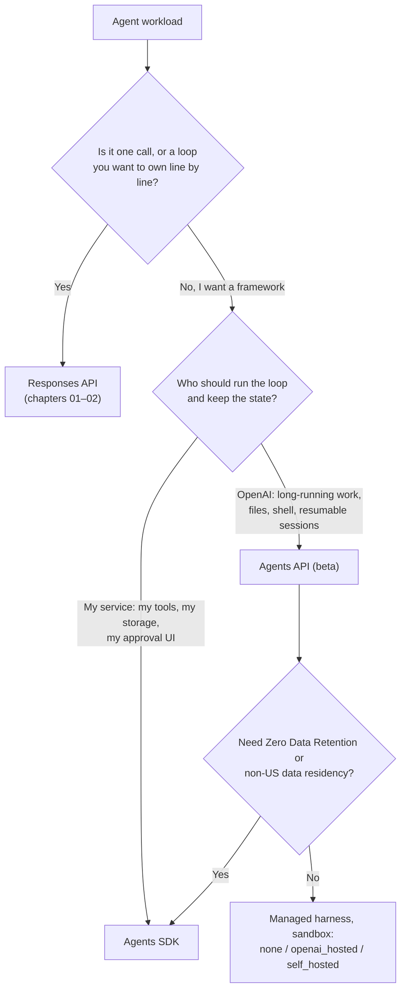
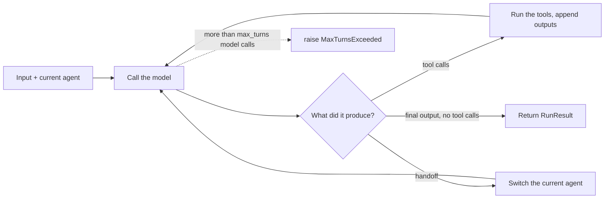
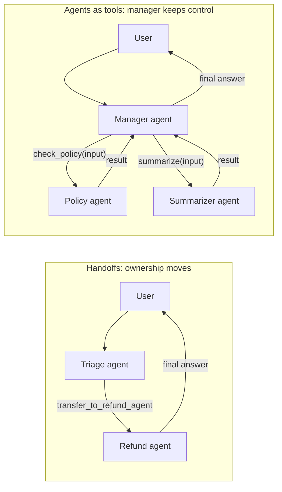
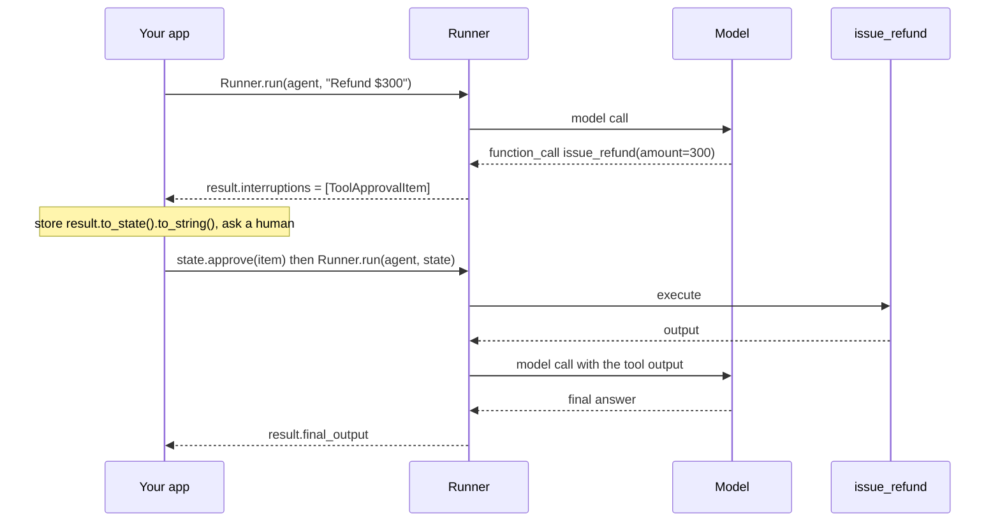

# Chapter 3 — Agents SDK and the Agents API: Building Agentic Systems on OpenAI

> **Claude counterpart:** [Chapter 3 — Claude Agent SDK](../../anthropic-claude/03-agent-sdk/README.md) · **Academy course:** Design and Build Agentic Systems (API pathway) · **Est. time:** 8–10 hours (reading + 2 notebooks) · **Status:** [ ] not started

## Why this matters for a solution architect

On the Claude side you chose between writing the loop yourself and letting the Claude Agent SDK run it. On OpenAI the first decision has **three** options: your own loop on the Responses API, the **Agents SDK** (a library that runs the loop inside your service), or the **Agents API** (a managed Codex harness that OpenAI runs, currently a beta API). After that come the same questions you met in the Claude chapter, under new names: **who owns the reply** (a handoff moves ownership to a specialist, an agent-as-tool keeps it with a manager), **which rules must hold every time** (guardrails, tool guardrails, and approvals in code) versus which only need to hold most of the time (instructions), and **where conversation state lives** (your storage, an SDK session, or OpenAI's servers). Each choice trades control against effort, and each one has data-retention and cost consequences that a client will ask you about.

## Learning objectives

- [ ] Choose between the Responses API, the Agents SDK, and the Agents API for a workload, and justify the choice in terms of hosting, state, tools, and data controls
- [ ] Define agents with `Agent` (`name`, `instructions`, `model`, `tools`, `handoffs`, `handoff_description`, `output_type`) and run them with `Runner.run`, `Runner.run_sync`, and `Runner.run_streamed`
- [ ] Explain how the runner decides a run is finished, and handle `MaxTurnsExceeded` (`max_turns` defaults to 10) as an error, not as a success signal
- [ ] Write function tools with `@function_tool` and keep application state in the local run context (`RunContextWrapper`), which the model never sees
- [ ] Plug RAG into an agent as a retrieval tool (`FileSearchTool` or your own function tool) and a fine-tuned model in as `model=`, and explain why fine-tuning changes behavior, not knowledge
- [ ] Choose between **handoffs** (the specialist takes over) and **agents-as-tools** (`Agent.as_tool()`, the manager keeps control)
- [ ] Add input, output, and tool guardrails, explain tripwires and `run_in_parallel`, and know which agent each guardrail type actually runs on
- [ ] Pause a run for human review with `needs_approval`, then approve or reject from `result.to_state()` and resume the **same** run
- [ ] Pick one conversation-state strategy per conversation: `to_input_list()`, a session such as `SQLiteSession`, `conversation_id`, or `previous_response_id`
- [ ] Use tracing and lifecycle hooks (`RunHooks`, `AgentHooks`) for observability, and know when tracing is unavailable
- [ ] Describe the managed Agents API (agent, environment, session, events), its environment options, and its current data-control limits
- [ ] Write outcome and safety requirements for an agent workflow, then test routing, ownership, tool use and guardrail decisions against the trace

## Prerequisites

- [Chapter 1 — Responses API Fundamentals](../01-responses-api-fundamentals/README.md): output items, `previous_response_id`, the Conversations API
- [Chapter 2 — Function Calling and Structured Outputs](../02-function-calling-and-structured-outputs/README.md): function tools, the `function_call` → `function_call_output` loop, strict schemas, Pydantic outputs
- [00 — Prerequisites](../../00-prerequisites/README.md): Python 3.11+, `async`/`await`, virtual environments, `.env` handling
- Optional but recommended: [Claude Chapter 3 — Claude Agent SDK](../../anthropic-claude/03-agent-sdk/README.md). This chapter is written as a delta against it.
- Install for this chapter: `pip install openai openai-agents python-dotenv` (already in the root `requirements.txt`; the package is `openai-agents`, the import name is `agents`; 0.23.1 at the time of writing)

> [!TIP]
> **Running the SDK inside Jupyter:** the notebook already runs an event loop, so `asyncio.run(main())` and `Runner.run_sync(...)` both fail there. Use top-level `await Runner.run(...)` in a cell. The snippets below use `asyncio.run` because they are written as scripts.

---

## Concepts

### 3.1 Choosing a runtime: Responses API, Agents SDK, or Agents API

**What counts as an agent.** OpenAI's [Building agents](https://developers.openai.com/tracks/building-agents) track defines an agent by three parts: **instructions** (what it should do), **guardrails** (what it should not do) and **tools** (what it can do), and it takes action on the user's behalf. A chatbot that only answers questions is not an agent; a system connected to other systems that acts on the user's input is. Every OpenAI agent stack is built from the same four platform primitives: **models** (the reasoning), **tools** (hosted tools, your functions, MCP), **state and memory** (conversation history, sessions, files), and **orchestration** (the loop, handoffs, guardrails, tracing). The three runtimes below differ in which of these you build and which OpenAI provides.

All three can run an agent. They differ in **where the loop runs** and **who keeps the state**.

| | **Responses API** (build it yourself) | **Agents SDK** (`openai-agents`) | **Agents API** (beta, managed Codex harness) |
|---|---|---|---|
| Use for | Direct model calls, or an agent loop you write from scratch | Agents with custom tools and workflows inside your application | Long-running tasks where OpenAI manages the agent and saves its progress |
| Where the loop runs | Your code | The SDK, inside your process | OpenAI's service |
| Integration effort (per OpenAI's docs) | High | Medium | Low |
| State between tasks | Manual history, `previous_response_id`, or Conversations | Your storage and SDK sessions, or Responses conversation state | Saved session configuration, turns, and items |
| Tool execution | Hosted tools plus tools your code runs | Tools and integrations configured in your application | Service-connected tools, your function handlers, and an optional sandbox |
| Execution environment | Your own | Your runtime, plus sandbox provider integrations (`SandboxAgent`) | OpenAI-hosted sandbox, self-hosted sandbox, or none |



**How to read the decision:**

- **Responses API** when the workload is a single call (classification, extraction, one chat turn), or when the loop is so unusual that a framework would get in the way. You already wrote this loop in Chapter 2.
- **Agents SDK** when your application must own deployment, tool implementations, storage, and approval decisions. The SDK runs the loop and adds handoffs, guardrails, sessions and tracing; you own everything around it. It is built on the Responses API but not tied to it or to OpenAI models: besides the default OpenAI provider, the Python SDK routes `litellm/...` and `any-llm/...` model names to adapter providers, and you can plug in your own `ModelProvider` (checked in openai-agents 0.23.1). This is the closest match to the Claude Agent SDK's role in your architecture, although the Claude Agent SDK ships the Claude Code harness with file and shell tools built in, while the OpenAI Agents SDK is a lighter orchestration library on top of Responses.
- **Agents API** when you want OpenAI to run the harness (sessions, orchestration, context compaction, recovery) and the agent may need a sandbox to run code, edit files, and produce artifacts. See [3.9](#39-the-managed-agents-api-beta).

**OpenAI's reference demos.** OpenAI publishes three open-source demos that show these runtimes in a realistic app. Read their code after this chapter; each maps to sections here.

| Demo | Runtime | What to look at | Where in this chapter |
|---|---|---|---|
| [Customer service agents](https://github.com/openai/openai-cs-agents-demo) | Agents SDK (Python backend, Next.js UI) | A triage agent that hands off to specialists, plus relevance and jailbreak input guardrails | [3.4](#34-handoffs-vs-agents-as-tools), [3.5](#35-guardrails-and-tripwires) |
| [Support agent with human in the loop](https://github.com/openai/openai-support-agent-demo) | Responses API (file search, function calling) | An AI agent suggests replies and tool calls; a human agent approves the sensitive ones | [3.6](#36-human-review-approvals-and-resumable-state) |
| [Testing agent](https://github.com/openai/openai-testing-agent-demo) | Responses API computer use tool + Playwright | A computer-use model follows a written test case against a web app | [Chapter 4](../04-built-in-tools-and-mcp/README.md) (built-in tools) |

> **Gotcha:** "Agents SDK session", "Agents API session", "Responses conversation", and "sandbox" are four **different** resources with different lifecycles and cleanup rules. Name them precisely in design documents.

> [!NOTE]
> **Avoid / migrating from:** the **Assistants API** (threads and runs) was retired on 2026-08-26; use Responses plus Conversations. **Agent Builder**, the visual builder launched under the "AgentKit" name, was deprecated on 2026-06-03 and shuts down on 2026-11-30; OpenAI points users to the Agents SDK or ChatGPT Workspace Agents. Do not start new work on either.

### 3.2 `Agent` and `Runner`: the SDK agent loop

An `Agent` is configuration: a model plus instructions plus optional tools, handoffs, guardrails, and an output type. The `Runner` runs the loop.

```python
import asyncio
import os
from dotenv import load_dotenv
from agents import Agent, Runner

load_dotenv()                                          # OPENAI_API_KEY from .env
MODEL = os.getenv("OPENAI_MODEL", "gpt-6-luna")

agent = Agent(
    name="Support assistant",                          # shows up in traces and handoff tool names
    instructions="Answer billing questions in two sentences or fewer.",
    model=MODEL,                                       # set it explicitly; see the gotcha below
)

async def main() -> None:
    result = await Runner.run(agent, "Why was I charged twice this month?")
    print(result.final_output)                         # the answer
    print(result.last_agent.name)                      # who produced it (matters after handoffs)

asyncio.run(main())
```

**The loop.** One `Runner.run` call is one application-level turn. The runner:



The final-output rule is structural: the model produced output of the agent's `output_type` (plain text by default) **and** made no tool calls. You never parse the text for "done". This is the same idea as `stop_reason` on Claude.

**Three ways to run:**

| Method | Returns | Use when |
|---|---|---|
| `await Runner.run(agent, input)` | `RunResult` | Default in async code (FastAPI, workers, notebooks) |
| `Runner.run_sync(agent, input)` | `RunResult` | Plain scripts. It wraps `run()` and fails inside an already running event loop |
| `Runner.run_streamed(agent, input)` | `RunResultStreaming` | UI that shows progress; iterate `result.stream_events()` |

`input` can be a string (one user message), a list of Responses input items, or a `RunState` when you resume a paused run (see [3.6](#36-human-review-approvals-and-resumable-state)).

**What a `RunResult` gives you:**

| You need | Use |
|---|---|
| The answer | `result.final_output` (typed if the agent has `output_type`; `result.final_output_as(MyModel)` casts) |
| The specialist that answered | `result.last_agent` |
| Replay-ready history for the next turn | `result.to_input_list()` |
| Server-side chaining | `result.last_response_id` |
| Pending approvals and a resumable snapshot | `result.interruptions` plus `result.to_state()` |
| Everything that happened | `result.new_items` (message, tool call, tool output, handoff items) |

**Streaming** uses the same loop. Three event types arrive from `stream_events()`: `raw_response_event` (token-level Responses events), `run_item_stream_event` (a finished item, with `event.name` such as `tool_called`, `tool_output`, `handoff_requested`, `message_output_created`), and `agent_updated_stream_event` (the current agent changed after a handoff). Wait until the iterator finishes before you treat the run as settled.

```python
from openai.types.responses import ResponseTextDeltaEvent

stream = Runner.run_streamed(agent, "Explain proration in one paragraph.")
async for event in stream.stream_events():
    if event.type == "raw_response_event" and isinstance(event.data, ResponseTextDeltaEvent):
        print(event.data.delta, end="", flush=True)
    elif event.type == "run_item_stream_event":
        print(f"\n[{event.name}]")
print("\nFinal:", stream.final_output)
```

**Limits and failure handling.**

- `max_turns` defaults to **10** model calls per run. Exceeding it raises `MaxTurnsExceeded`. `max_turns=None` disables the limit, which is rarely what you want in production.
- `error_handlers={"max_turns": ..., "model_refusal": ..., "invalid_final_output": ...}` lets you return a controlled fallback instead of an exception. The handler returns `RunErrorHandlerResult(final_output=..., include_in_history=...)`.
- Other exceptions you should catch: `InputGuardrailTripwireTriggered`, `OutputGuardrailTripwireTriggered`, `ToolInputGuardrailTripwireTriggered`, `ToolOutputGuardrailTripwireTriggered`, `ModelBehaviorError`, and the `openai` client errors.

**Per-run configuration** goes in `RunConfig` instead of on every agent: `model` (overrides all agents), `model_settings`, `input_guardrails` / `output_guardrails` for every run, `handoff_input_filter`, `tracing_disabled`, `workflow_name`, `group_id`, `trace_include_sensitive_data`, and more.

> **Gotcha: set the model explicitly.** If neither the agent nor `RunConfig` nor the `OPENAI_DEFAULT_MODEL` environment variable sets a model, the SDK uses its own built-in fallback. In openai-agents 0.23.1 that fallback is `gpt-5.6-luna`, not the current GPT-6 family. OpenAI's docs say it plainly: if you care about the default, set it yourself. This repo reads `OPENAI_MODEL` (default `gpt-6-luna`, the cheap tier). OpenAI's SDK guide suggests starting with `gpt-6-astra` for most new SDK workflows and moving to a smaller model when latency or cost matters; a common pattern is a cheap triage model plus a stronger specialist.

> **Exam trap:** "The loop stops when the reply contains 'Done'" or "we set `max_turns=3` so it always finishes" are the OpenAI versions of the Claude anti-patterns. Completion is structural (final output with no tool calls). `max_turns` is a guardrail, and hitting it is an error to investigate.

> **Gotcha:** `Agent(prompt=...)` references a stored prompt object from the Responses API. Reusable prompt objects (`v1/prompts`) shut down on 2026-11-30. Keep instructions in code, under version control.

### 3.3 Function tools and local context

`@function_tool` turns a Python function into a tool. The function name becomes the tool name, the docstring becomes the description, the type hints become a **strict** JSON schema (`strict_mode=True` by default), and Google, Sphinx, or NumPy-style `Args:` sections become per-parameter descriptions.

```python
from dataclasses import dataclass, field
from agents import Agent, RunContextWrapper, function_tool

@dataclass
class SupportContext:                     # local context: YOUR code sees it, the model never does
    customer_id: str
    tier: str = "standard"
    audit_log: list[str] = field(default_factory=list)

@function_tool
def lookup_invoice(ctx: RunContextWrapper[SupportContext], invoice_id: str) -> str:
    """Return the status and amount of one invoice for the current customer.

    Args:
        invoice_id: Invoice ID such as INV-1001.
    """
    ctx.context.audit_log.append(f"lookup_invoice {invoice_id}")
    return fake_db_lookup(ctx.context.customer_id, invoice_id)   # your own data access

billing_agent = Agent[SupportContext](
    name="Billing agent",
    instructions="Answer invoice questions. Always look the invoice up first.",
    tools=[lookup_invoice],
)
# await Runner.run(billing_agent, "Status of INV-1001?", context=SupportContext(customer_id="C-42"))
```

The `ctx` parameter is **not** part of the tool schema. The SDK injects it. That is the key boundary, in OpenAI's words: *conversation history is what the model sees; run context is what your code sees.* Put the authenticated user, database clients, loggers, and feature flags in the context. If the model needs a fact, put it in instructions, input, retrieval, or a tool result.

| Need | Mechanism |
|---|---|
| Per-user data the tools need (user ID, tenant, DB handle) | `context=` on `Runner.run`, read via `RunContextWrapper.context` |
| Instructions that depend on the user | `instructions=` as a function `(ctx, agent) -> str` (dynamic instructions) |
| Typed final answer | `output_type=MyPydanticModel` |
| Stop after a tool and return its output directly | `tool_use_behavior="stop_on_first_tool"` or `StopAtTools(stop_at_tool_names=[...])` |
| Force tool use | `model_settings=ModelSettings(tool_choice="required")` (or a tool name) |
| Hide a tool for some users | `is_enabled=` (bool or callable) on the tool |
| Tool crashes | By default the SDK sends an error message back to the model; customize with `failure_error_function` |

> **Gotcha:** every agent, tool, hook, and guardrail in one run must use the **same context type**. The context is also serialized into `RunState` when a run pauses for approval (3.6), so don't put secrets in it unless you want them stored with the paused state.

#### Knowledge and behavior: where RAG and fine-tuned models plug into an agent

Phase 2 of OpenAI's [AI application development track](https://developers.openai.com/tracks/ai-application-development) has three parts: **building agents**, **RAG**, and **fine-tuning**. This chapter teaches the first part. The other two are not separate kinds of system. They plug into the same `Agent` at two different points:

- **Knowledge (RAG) enters through a tool.** The agent retrieves facts at run time, so the answer is only as current as the index.
- **Behavior and format (fine-tuning) enter through `model=`.** A fine-tuned model ID goes where any model name goes. The instructions, tools, guardrails, and runner code stay the same.

| Building block | How it plugs into an `Agent` | Choose it when | Taught in depth |
|---|---|---|---|
| Hosted RAG | `tools=[FileSearchTool(vector_store_ids=[...], max_num_results=..., filters=..., ranking_options=..., include_search_results=True)]` | Your documents can live in an OpenAI vector store, and you use OpenAI models through the Responses API (the SDK's hosted tools only work there) | [Chapter 4, 4.3](../04-built-in-tools-and-mcp/README.md#43-file-search-and-vector-stores-hosted-rag) (vector stores, chunking, filters, ranking, refresh) |
| Your own retriever as a function tool | `@function_tool def search_kb(ctx, query)` that queries your vector database. The tenant or region filter comes from `ctx.context`, never from the model | The data must stay in your store, you need your own re-ranking, or the agent runs on a non-OpenAI model (`litellm/...`) | `applied-ai-architect/06-rag-pipelines` (planned) |
| Retrieve first, then run | Your code retrieves before `Runner.run` and puts the chunks into the input | Every question needs the same retrieval, so a model decision (and an extra turn) adds nothing | `applied-ai-architect/06-rag-pipelines` (planned) |
| Fine-tuned model | `Agent(model="ft:gpt-4.1-nano-2025-04-14:openai::BTz2REMH", ...)` (an example ID in OpenAI's format) | Tone, style, or output format is easier to *show* with examples than to *tell* in instructions, and evals show prompting is not enough | `applied-ai-architect/05-model-strategy-and-customization` and `openai-codex/16-models-migration-and-model-optimization` (both planned) |

```python
from agents import Agent, FileSearchTool

kb_agent = Agent(
    name="Policy agent",
    instructions="Answer only from the retrieved policy documents. Say so when they don't cover the question.",
    model=MODEL,
    tools=[FileSearchTool(
        vector_store_ids=["vs_..."],                              # created and filled as in Chapter 4
        max_num_results=4,                                       # 1-50
        filters={"type": "eq", "key": "region", "value": "EU"},  # a hard boundary, set in code
        include_search_results=True,                             # adds include=["file_search_call.results"]
    )],
)

# Same agent, fine-tuned model: only the model string changes.
styled_agent = kb_agent.clone(model="ft:gpt-4.1-nano-2025-04-14:openai::BTz2REMH")
```

**The RAG pipeline in one paragraph.** The track splits RAG into three steps. **Data preparation:** clean the documents, chunk them, embed the chunks, and store them in a vector database. **Retrieval:** turn the question into a search query and fetch the most relevant chunks, often with re-ranking. **Generation:** put the retrieved chunks into the model's context and answer from them. `FileSearchTool` (and the Responses API's `file_search` tool under it) hides all three steps: OpenAI chunks, embeds, indexes, re-ranks, and adds `file_citation` annotations. With your own retriever you build and own every step.

**Fine-tuning in one paragraph.** The track names supervised fine-tuning (SFT) for strict tone, style, or format rules, preference fine-tuning (DPO) for training on preferred versus non-preferred answers, and reinforcement fine-tuning (RFT) for reasoning models with nuanced goals. All three change **behavior**. None of them is a reliable way to add facts: a model fine-tuned on last quarter's price list still answers from what it absorbed in training, cannot cite a source, and goes stale on the next price change. Facts belong in retrieval. Check availability before you plan on fine-tuning: OpenAI is winding down its fine-tuning platform. It no longer accepts new users, and existing users can create training jobs only for a limited time (dates in the [OpenAI track README](../README.md#deprecated-and-retired-do-not-learn-these)). Existing fine-tuned models keep serving until their base model is deprecated. For most new agent designs, the answer is better instructions plus retrieval plus model choice.

> **Exam trap:** "The support agent gives outdated prices. The team proposes fine-tuning it on the new price list." Wrong lever: fine-tuning changes behavior, not knowledge. Put the price list behind a retrieval tool (`FileSearchTool` or your own `search_kb`) and refresh the index when prices change.

> **Gotcha:** `FileSearchTool` is a **hosted** tool. It runs on OpenAI's side and works only with OpenAI models through the Responses API. If you route an agent to another provider with `litellm/...`, write retrieval as a function tool instead. In both cases put tenancy and region rules in code (`filters` on the tool, or `ctx.context` in your function), not in the prompt.

### 3.4 Handoffs vs agents-as-tools

This is the decision the Claude chapter does not have. OpenAI's Agents SDK has two multi-agent patterns, and the question that separates them is **who owns the final, user-facing answer**.

| | **Handoff** | **Agent as tool** |
|---|---|---|
| Control | Moves to the specialist for the rest of the turn | Stays with the manager |
| What the specialist sees | The conversation history (unless you filter it) | Only the input the manager passes in the tool call |
| Who writes the reply | The specialist | The manager, which synthesizes |
| How the model sees it | A tool named `transfer_to_<agent_name>` | A function tool with the name you choose |
| `result.last_agent` | The specialist | The manager |
| Best for | Routing: triage, then billing or refunds | Bounded subtasks: classify, summarize, check policy, combine several specialists |
| Claude analogy | No direct equivalent (Claude subagents always return to the coordinator) | Hub-and-spoke subagents via the `Agent` tool |



**Handoffs:**

```python
from pydantic import BaseModel
from agents import Agent, handoff, RunContextWrapper

billing_agent = Agent(
    name="Billing agent",
    handoff_description="Invoices, charges, payment methods. Not refunds.",   # routing signal
    instructions="...",
)
refund_agent = Agent(
    name="Refund agent",
    handoff_description="Refund requests for a specific order.",
    instructions="...",
)

class EscalationData(BaseModel):
    reason: str

async def log_refund_handoff(ctx: RunContextWrapper[None], data: EscalationData) -> None:
    print("refund handoff:", data.reason)       # runs when the handoff is invoked

triage_agent = Agent(
    name="Triage agent",
    instructions="Route the customer to exactly one specialist. Do not answer yourself.",
    handoffs=[
        billing_agent,                                     # plain Agent -> transfer_to_billing_agent
        handoff(refund_agent,                              # handoff() to customize
                on_handoff=log_refund_handoff,
                input_type=EscalationData),                # model must supply {"reason": ...}
    ],
)
```

`handoff()` options worth knowing: `tool_name_override`, `tool_description_override`, `on_handoff` (callback; with `input_type`, it receives the model's parsed payload), `input_filter` (change what history the next agent sees, for example `agents.extensions.handoff_filters.remove_all_tools`), and `is_enabled`. `agents.extensions.handoff_prompt.RECOMMENDED_PROMPT_PREFIX` is a ready-made instruction prefix that explains handoffs to the model.

**Agents as tools:**

```python
policy_agent = Agent(name="Policy checker", instructions="Answer ALLOWED or DENIED with one reason.")
manager = Agent(
    name="Support manager",
    instructions="Check policy before you promise anything. You write the final reply.",
    tools=[
        policy_agent.as_tool(
            tool_name="check_refund_policy",
            tool_description="Check whether a refund request is allowed by policy.",
        ),
    ],
)
```

By default `as_tool()` exposes a single string parameter called `input`, runs the nested agent, and returns its final output to the manager. Use `parameters=` for a structured input, `custom_output_extractor=` to shape what comes back, and `needs_approval=` to require review before the specialist runs.

**You can combine them.** A triage agent can hand off to a specialist, and the specialist can call other agents as tools. You can also orchestrate **in code** instead of through the model: run a classifier agent with a structured `output_type`, then pick the next agent with an `if`; chain agents; or run independent agents concurrently with `asyncio.gather`. Code orchestration is cheaper and more predictable; model orchestration is more flexible.

> **Exam trap:** "The manager should combine answers from three specialists into one reply" → agents as tools, not handoffs. After a handoff the manager is no longer in the loop for that turn, so it cannot synthesize anything.

> **Gotcha:** OpenAI's docs say to start with one agent and split only when a specialist needs different tools, a different approval policy or guardrail, a different model, or clearer routing in traces. Each extra agent adds prompts, traces, and approval surfaces.

### 3.5 Guardrails and tripwires

Guardrails are automatic checks that run in your process. When a check fails it trips a **tripwire**, and the runner stops with an exception you catch.

| Guardrail | Attached to | Runs | On trip |
|---|---|---|---|
| Input guardrail (`@input_guardrail`) | `Agent.input_guardrails` (or `RunConfig.input_guardrails`) | On the user input, **only if the agent is the first agent of the run** | `InputGuardrailTripwireTriggered` |
| Output guardrail (`@output_guardrail`) | `Agent.output_guardrails` | On the final output, **only for the agent that produces it** | `OutputGuardrailTripwireTriggered` |
| Tool input guardrail (`@tool_input_guardrail`) | `@function_tool(tool_input_guardrails=[...])` | Before **every** call of that function tool | `allow`, `reject_content` (model gets your message instead of the tool running), or `raise_exception` |
| Tool output guardrail (`@tool_output_guardrail`) | `@function_tool(tool_output_guardrails=[...])` | After every call of that tool | `allow`, `reject_content`, or `raise_exception` |

```python
import json, math, re
from agents import (Agent, GuardrailFunctionOutput, RunContextWrapper, ToolGuardrailFunctionOutput,
                    function_tool, input_guardrail, output_guardrail, tool_input_guardrail)

@input_guardrail(run_in_parallel=False)              # blocking: the agent does not start if this trips
async def block_prompt_injection(ctx: RunContextWrapper, agent: Agent, user_input) -> GuardrailFunctionOutput:
    hit = "ignore previous instructions" in str(user_input).lower()
    return GuardrailFunctionOutput(output_info={"injection": hit}, tripwire_triggered=hit)

CARD = re.compile(r"\b(?:\d[ -]?){13,16}\b")

@output_guardrail
async def no_card_numbers(ctx: RunContextWrapper, agent: Agent, output) -> GuardrailFunctionOutput:
    leaked = bool(CARD.search(str(output)))
    return GuardrailFunctionOutput(output_info={"card_number": leaked}, tripwire_triggered=leaked)

REFUND_LIMIT_USD = 500

@tool_input_guardrail
def refund_limit(data) -> ToolGuardrailFunctionOutput:
    try:
        amount = float(json.loads(data.context.tool_arguments or "{}").get("amount"))
    except (TypeError, ValueError):
        amount = math.nan
    if not (math.isfinite(amount) and 0 < amount <= REFUND_LIMIT_USD):   # fail closed: NaN, inf, <= 0, too big
        return ToolGuardrailFunctionOutput.reject_content(       # the tool never runs
            f"Refund NOT issued: amounts over ${REFUND_LIMIT_USD} (or invalid amounts) require human review. "
            "Tell the customer that; do not say it was escalated."
        )
    return ToolGuardrailFunctionOutput.allow()

@function_tool(tool_input_guardrails=[refund_limit])
def issue_refund(order_id: str, amount: float) -> str:
    """Issue a refund for an order."""
    return f"Refunded ${amount:.2f} on {order_id}"
```

> **Gotcha:** write money checks so they **fail closed**. `float("NaN")` parses, and every comparison with NaN is `False`, so a check written as `if amount > limit: reject` lets a NaN amount through. Check `math.isfinite` (or use the positive form `0 < amount <= limit`) before you compare.

> **Gotcha:** `reject_content` only blocks the call and gives the model your message in place of the tool result. It does **not** escalate, open a ticket, or notify anyone, so the message must not claim that it did. If a person really has to review the refund, use `needs_approval` (3.6) or a handoff to a human desk (3.4), and say "escalated" only after that code has run.

A guardrail function returns `GuardrailFunctionOutput(output_info=..., tripwire_triggered=...)`. `output_info` is for your logs and for the exception (`exc.guardrail_result.output.output_info`). A guardrail can itself call a small, cheap agent with a structured `output_type` (OpenAI's docs show exactly this), or it can be plain Python: a regex, a lookup, a policy table.

**Which guardrails to build, and how strong.** OpenAI's [Building agents](https://developers.openai.com/tracks/building-agents) track gives two reasons for input guardrails: so the agent "can't be jailbreaked", and so you don't pay to process **irrelevant inputs**. OpenAI's [customer service agents demo](https://github.com/openai/openai-cs-agents-demo) runs exactly these two, a **relevance** guardrail and a **jailbreak** guardrail, on its triage agent. The track also says to size them to the tools, the risk you accept and your scale: a prompt line or keyword check can be enough for a low-risk FAQ bot, a small classifier agent with a structured `output_type` suits a public-facing agent, and anything that guards money or personal data also needs tool guardrails and approvals behind it, because no input filter catches everything. For outputs the same track says: use **structured outputs** when your application consumes the result, and add **output guardrails** when the agent is user-facing. Section [3.10](#310-testing-agent-decisions-and-handoffs) adds a relevance and a jailbreak guardrail to a triage desk and tests that each one fires.

**Execution modes for input guardrails:**

- `run_in_parallel=True` (the default): the guardrail and the agent start together. Best latency, but if the tripwire fires the agent may already have spent tokens **and executed tools**.
- `run_in_parallel=False` (blocking): the guardrail finishes before the agent starts. Use it when tool side effects or the cost of the main model matter more than latency.

**Workflow boundaries are the classic mistake.** In a triage → specialist workflow:

- an input guardrail on the **billing** agent never runs, because billing is not the first agent;
- an output guardrail on the **triage** agent never runs if triage hands off, because triage does not produce the final output;
- tool guardrails run on every guarded function-tool call, wherever that tool lives. They do **not** run on handoff calls, hosted tools (web search, file search, hosted MCP, code interpreter, image generation) or built-in execution tools (computer, shell, apply_patch), and `Agent.as_tool()` does not expose tool-guardrail options.

So: put input guardrails on the entry agent (or in `RunConfig`), put output guardrails on **every agent that can produce the final answer**, and put side-effect checks **on the tool** that creates the side effect.

> **Exam trap:** "Refunds over $500 must never be issued without a human." A sentence in the refund agent's instructions is probabilistic. A tool input guardrail (or a check inside the tool, or an approval) is deterministic. This is the same "cost of failure" rule as hooks versus prompts in the Claude chapter: money, identity, compliance, and safety go in code.

> **Gotcha:** guardrails validate **content**; Claude hooks intercept **lifecycle events**. They overlap (a tool input guardrail behaves much like a `PreToolUse` deny), but the OpenAI SDK's lifecycle hooks (3.8) are observers, and its blocking logic lives in guardrails and approvals.

### 3.6 Human review: approvals and resumable state

A guardrail decides automatically. **Human review** pauses the run until a person (or a policy service) approves or rejects a sensitive tool call. The model still decides that the action is needed; your application decides whether it happens.

```python
from agents import Agent, Runner, function_tool

async def over_200(_ctx, params: dict, _call_id: str) -> bool:     # per-call approval policy
    return float(params.get("amount", 0)) > 200

@function_tool(needs_approval=over_200)        # or needs_approval=True to always ask
async def issue_refund(order_id: str, amount: float) -> str:
    """Issue a refund for an order."""
    return f"Refunded ${amount:.2f} on {order_id}"

refund_agent = Agent(name="Refund agent", instructions="...", tools=[issue_refund])

result = await Runner.run(refund_agent, "Refund $300 for order A-19")
while result.interruptions:                    # paused: final_output is not the answer yet
    state = result.to_state()
    for item in result.interruptions:          # ToolApprovalItem: .name, .arguments, .agent
        if reviewer_approves(item.name, item.arguments):        # your UI, ticket, or policy service
            state.approve(item)
        else:
            state.reject(item, rejection_message="A supervisor declined this refund.")
    result = await Runner.run(refund_agent, state)              # resume the SAME run
print(result.final_output)
```



**Rules that matter:**

1. **An approval is a paused run, not a new turn.** Resume from `state` with the **original top-level agent**. Sending a new user message instead breaks turn counts, history, and server-side continuation IDs.
2. **Long reviews are fine.** Serialize with `state.to_string()` or `state.to_json()`, store it, and later rebuild with `await RunState.from_string(agent, s)` or `RunState.from_json(...)`. Read the pending items with `state.get_interruptions()`.
3. **The pattern is run-wide.** Approvals raised after a handoff, or inside a nested `Agent.as_tool()` run, still surface on the outer result.
4. **Sticky decisions:** `state.approve(item, always_approve=True)` or `state.reject(item, always_reject=True)` applies to later calls of the same tool in the rest of the run.
5. **Order with tool guardrails:** tool input guardrails normally run **after** approval, just before execution. Set `RunConfig(tool_execution=ToolExecutionConfig(pre_approval_tool_input_guardrails=True))` to check before asking a human, so reviewers never see requests that policy would reject anyway.
6. `needs_approval` exists on `function_tool`, `Agent.as_tool`, `ShellTool`, and `ApplyPatchTool`. Local MCP servers use `require_approval`, and `HostedMCPTool` uses `tool_config={"require_approval": "always"}` with an optional `on_approval_request` callback.

> **Gotcha: a serialized `RunState` is not authenticated.** It contains pending tool calls, arguments, approval decisions, and your context. Keep it in server-side storage, authenticate and authorize the reviewer on your server, and never accept a state blob or replacement arguments from a browser.

> **Gotcha:** a callable `needs_approval` **fails closed**: if the SDK can't safely parse the arguments (missing, malformed JSON, not an object), it skips your callable and requires manual approval.

### 3.7 Conversation state and sessions

The runner is stateless between calls unless you choose a strategy. OpenAI lists four, and says to **pick one per conversation**:

| Strategy | State lives in | Next turn you pass | Good for |
|---|---|---|---|
| `result.to_input_list()` | Your app | Full history + new message | Small loops, maximum control |
| `session=SQLiteSession(...)` (or another session) | Your storage, managed by the SDK | The same session + new message | Chat apps, durable memory, resumable approvals |
| `conversation_id=` | OpenAI Conversations API | The same ID + only the new message | State shared across workers and services |
| `previous_response_id=result.last_response_id` | OpenAI Responses API | The last response ID + only the new message | The lightest server-side continuation |

```python
from agents import Agent, Runner, SQLiteSession

agent = Agent(name="Support assistant", instructions="Reply concisely.", model=MODEL)
session = SQLiteSession("customer_C-42", "conversations.db")   # omit the path -> in-memory, lost on exit

await Runner.run(agent, "My order A-17 arrived broken.", session=session)
result = await Runner.run(agent, "Can I get my money back for it?", session=session)  # remembers A-17
```

Before each run the session loads history and prepends it; after the run it stores the new items. `session.get_items()`, `add_items()`, `pop_item()` (undo the last item), and `clear_session()` let you inspect and correct it.

**Session backends** (all implement the same protocol): `SQLiteSession` (built in, in-memory by default or file-backed), `AsyncSQLiteSession`, `RedisSession`, `SQLAlchemySession`, `MongoDBSession`, `DaprSession`, `OpenAIConversationsSession` (server-side storage in OpenAI), `OpenAIResponsesCompactionSession` (wraps another session and compacts long history with the Responses API), `AdvancedSQLiteSession` (branching and analytics), and `EncryptedSession` (encryption and TTL around another backend).

> **Gotcha:** a session **cannot** be combined with `conversation_id`, `previous_response_id`, or `auto_previous_response_id` in the same run. Mixing local replay with server-side state duplicates context.

> **Gotcha:** `SQLiteSession("user_42")` without a path is in-memory and per-process. In a multi-worker deployment, use a shared backend (Redis, SQLAlchemy, MongoDB) or server-side state.

> **Architect note:** after a handoff, pass the specialist (`result.last_agent`) as the starting agent of the next turn if it should stay in control; otherwise every turn starts at triage again. And remember the data question: server-side state (`conversation_id`, `previous_response_id`, `OpenAIConversationsSession`) means OpenAI stores the conversation; a SQL or Redis session keeps it in your infrastructure.

**Compared with Claude:** the Claude Agent SDK resumes a session by ID and can `fork_session` to branch it. The OpenAI Agents SDK has no `fork` flag on `Runner.run`; you branch by copying history (`to_input_list()`) into a new session, or by using `AdvancedSQLiteSession`'s branching features.

### 3.8 Tracing and lifecycle hooks

**Tracing is on by default** in the normal server-side path. Every `Runner.run` is wrapped in a trace, and the SDK records spans for each agent, model generation, function tool call, guardrail, and handoff. You can view traces in the [Traces dashboard](https://platform.openai.com/traces).

```python
from agents import Runner, RunConfig, trace

with trace("Refund workflow", group_id="customer_C-42"):          # several runs in ONE trace
    first = await Runner.run(triage_agent, "Refund order A-17")
    # trace() only groups spans; it carries no conversation. Pass the history (or use a session, 3.7).
    follow_up = first.to_input_list() + [{"role": "user", "content": "Actually make it store credit"}]
    second = await Runner.run(first.last_agent, follow_up)

# per-run settings
await Runner.run(agent, "hi", run_config=RunConfig(workflow_name="Support", trace_include_sensitive_data=False))
```

| Control | Effect |
|---|---|
| `OPENAI_AGENTS_DISABLE_TRACING=1` | Disable tracing for the whole process |
| `set_tracing_disabled(True)` | Same, in code |
| `RunConfig(tracing_disabled=True)` | Disable for one run |
| `RunConfig(trace_include_sensitive_data=False)` | Keep model and tool inputs/outputs out of spans |
| `set_tracing_export_api_key(key)` | Export traces with an OpenAI key when the model provider is not OpenAI |
| `add_trace_processor(...)` / `set_trace_processors([...])` | Also send spans to your own observability stack, or replace the default exporter |

> **Gotcha:** tracing is **unavailable for organizations under a Zero Data Retention (ZDR) policy**. And by default spans can contain prompts and tool data, so set `trace_include_sensitive_data=False` when that data is regulated.

**Lifecycle hooks** observe the run. Two scopes:

| Class | Attach with | Callbacks |
|---|---|---|
| `RunHooks` | `Runner.run(..., hooks=MyRunHooks())` — sees the whole run, across handoffs | `on_agent_start`, `on_agent_end`, `on_llm_start`, `on_llm_end`, `on_tool_start`, `on_tool_end`, `on_handoff` |
| `AgentHooks` | `Agent(..., hooks=MyAgentHooks())` — one agent only | `on_start`, `on_end`, `on_llm_start`, `on_llm_end`, `on_tool_start`, `on_tool_end`, `on_handoff` |

```python
from agents import RunHooks

class AuditHooks(RunHooks):
    def __init__(self) -> None:
        self.events: list[str] = []
    async def on_handoff(self, context, from_agent, to_agent) -> None:
        self.events.append(f"handoff {from_agent.name} -> {to_agent.name}")
    async def on_tool_start(self, context, agent, tool) -> None:
        self.events.append(f"{agent.name} calls {tool.name}")
    async def on_agent_end(self, context, agent, output) -> None:
        self.events.append(f"{agent.name} finished; requests so far: {context.usage.requests}")
```

Use hooks for audit logs, metrics, pre-fetching data on a handoff, and usage accounting. They return nothing: to **block** something, use a guardrail or an approval, not a hook. Agent start/end hooks receive an `AgentHookContext`; LLM, tool, and handoff hooks receive a `RunContextWrapper` (for function tools, a `ToolContext` with `tool_name`, `tool_call_id`, and `tool_arguments`).

<a id="39-the-managed-agents-api-public-beta"></a>

### 3.9 The managed Agents API (beta)

The Agents API gives your application the **Codex harness as a managed API**. OpenAI runs the agent loop, keeps the session, compacts context, recovers from interruptions, and (optionally) provisions a sandbox. Your application sends input, receives events, and handles any function tools.

**Four concepts:**

| Concept | Meaning |
|---|---|
| **Agent** | Model, instructions, tools, MCP servers. Pass it inline per session, or save it once and reuse it by `agent_id` |
| **Environment** | Where commands run and files live: `none`, `openai_hosted` (OpenAI manages a sandbox), or `self_hosted` (your compute connects an executor; partner sandboxes such as E2B, Modal, Daytona, Vercel, Cloudflare, and AWS Lambda MicroVMs have guides) |
| **Session** | A durable instance of an agent: conversation plus saved work. A message to an idle session starts a new **turn**; a message during an active turn **steers** it |
| **Events and items** | Events are live progress (stream or webhooks); items are the saved messages and tool calls you fetch later |

```python
from openai import OpenAI

client = OpenAI()   # the SDK adds the OpenAI-Beta: agents=v1 header for you

session = client.beta.agents.sessions.create(
    agent={
        "model": "gpt-6-astra",
        "instructions": "Answer questions about our API. Delegate independent research to subagents.",
        "tools": [{"type": "web_search"}],
        "multi_agent": {"enabled": True, "max_concurrent_subagents": 4},
    },
    environment={"type": "none"},           # required; no sandbox needed for this agent
    input="Summarize the recommended way to connect an MCP server to an agent.",
)
print(session.id)                            # store it with your app's conversation
```

**What the managed harness adds, and how it maps to what you know:**

| Capability | Agents API | Nearest Agents SDK equivalent |
|---|---|---|
| Multi-agent | `multi_agent.enabled`; the harness supplies create/message/wait/interrupt subagent tools; default `max_concurrent_subagents` is 6. Subagents share the environment's filesystem and **do not support function tools** | Agents as tools, or `asyncio.gather` in code |
| Your functions | Defined in `agent.tools`; the session emits `agent.session.requires_action`, you read `required_actions`, run the function, and return a `tool_result` with the same `turn_id` and `call_id` | `@function_tool` runs in-process |
| Secrets | **Vaults** (`vault_ids`): MCP bearer or OAuth credentials, or environment-variable placeholders that a proxy swaps for the real secret only for allowed hosts | Your own secret manager |
| Async completion | **Session webhooks**: `agent.session.created`, `action_required`, `in_progress`, `idle`, `failed` | Your own job queue |
| Observability | Logs → Agents in the dashboard; export a session's traces as OTLP JSON | SDK tracing and trace processors |
| Context management | Automatic compaction | `OpenAIResponsesCompactionSession` or your own trimming |

**Pricing:** OpenAI's overview lists three components: model usage at the selected model's API rates, OpenAI tools at their standard rates, and OpenAI-hosted sandboxes at standard container rates. It lists no separate Agents API charge; check the [pricing page](https://developers.openai.com/api/docs/pricing) before you quote a client, because beta pricing can change.

> **Gotcha: `idle` is not success.** `agent.session.idle` means the session is ready for more input. Check the turn outcome (`agent.session.turn.completed`, `turn.failed`, `turn.cancelled`), then check the tool results too: a completed turn can contain failed tool calls.

> **Gotcha: data controls.** The Agents API currently supports data residency **only in the United States** and does **not** support Zero Data Retention. Choosing a self-hosted sandbox does **not** make it ZDR-eligible. A ZDR or EU-residency requirement points you back to the Agents SDK or the Responses API, with your own storage.

> **Gotcha:** it is a beta. Requests carry `OpenAI-Beta: agents=v1`, the SDKs expose it under `client.beta.agents`, field names and limits can change (the docs already describe separate beta and GA contracts, for example a different session `error` shape, so check which one you target), and settings such as `tools`, `instructions`, and `multi_agent` cannot be changed on an existing session (only `model`, `reasoning.effort`, `service_tier`, and `metadata` can). Saved-agent updates apply only to new sessions.

The Agents API's sandboxes, environments, and MCP connections come back in [Chapter 4](../04-built-in-tools-and-mcp/README.md), and the Codex harness itself is the subject of [Chapter 5](../05-codex/README.md).

### 3.10 Testing agent decisions and handoffs

Sections 3.4–3.6 gave you the mechanisms. This section is about proving that a workflow built from them does the right thing. The OpenAI Academy course *Design and Build Agentic Systems* frames it as three steps, and they map directly onto the SDK.

**1. Write the requirements first, as data.** For each kind of input, write down:

| Requirement type | Question it answers | Example for the support desk |
|---|---|---|
| **Outcome** | Who must own the reply, and what must it contain? | A refund request ends with the Refund agent; an invoice question ends with the Billing agent |
| **Safety** | What must never happen, and which control must fire? | `issue_refund` never runs for an invoice question; an off-topic or jailbreak input is blocked by an input guardrail before any specialist runs |
| **Ownership** | How many times may control move, and from where? | At most one handoff, and only from the entry (triage) agent |

**2. Keep one owner at every handoff.** A handoff transfers ownership of the turn ([3.4](#34-handoffs-vs-agents-as-tools)). Design so that at any moment exactly one agent owns the conversation, and ownership moves only along edges you intended:

- Give specialists **no `handoffs` of their own** unless the design needs it. A specialist that can hand off again turns a tree into a graph, and "who owns this?" stops having a simple answer.
- Make `handoff_description`s non-overlapping, so only one specialist fits each request.
- Hand over only what the next owner needs: `input_type` for structured handoff data, `input_filter` to trim history, and `on_handoff` to record the transfer (for example, open a ticket).
- When the entry agent must keep ownership (it synthesizes several results), use agents-as-tools instead. `result.last_agent` then stays the manager.
- In the next turn, start from `result.last_agent` if the specialist should keep ownership ([3.7](#37-conversation-state-and-sessions)).

**3. Test decisions against the trace, not only the final text.** The tracing system from [3.8](#38-tracing-and-lifecycle-hooks) records an `agent` span per agent, a `handoff` span (`from_agent`, `to_agent`) per transfer, a `function` span per tool call, and a `guardrail` span (`name`, `triggered`) per input or output guardrail. A test registers its own trace processor, runs one case, and checks the spans against the requirements:

```python
from agents import Runner, TracingProcessor, InputGuardrailTripwireTriggered, set_trace_processors

class TraceRecorder(TracingProcessor):
    def __init__(self): self.spans = []
    def on_span_end(self, span): self.spans.append({"type": span.span_data.type, **(span.span_data.export() or {})})
    def on_trace_start(self, trace): pass
    def on_trace_end(self, trace): pass
    def on_span_start(self, span): pass
    def shutdown(self): pass
    def force_flush(self): pass

recorder = TraceRecorder()
set_trace_processors([recorder])           # in tests, replace the exporter: nothing leaves the machine

async def test_refund_request_is_owned_by_refund_agent():
    recorder.spans.clear()
    result = await Runner.run(triage_agent, "I want my money back for order A-17")
    handoffs = [(s["from_agent"], s["to_agent"]) for s in recorder.spans if s["type"] == "handoff"]
    tools = [s["name"] for s in recorder.spans if s["type"] == "function"]
    assert result.last_agent.name == "Refund agent"                 # outcome
    assert handoffs == [("Triage agent", "Refund agent")]          # ownership: one transfer, from the entry agent
    assert "lookup_invoice" not in tools                            # safety: least privilege held

async def test_off_topic_input_is_blocked():
    recorder.spans.clear()
    try:
        await Runner.run(triage_agent, "Write me a poem about strawberries")
        raise AssertionError("expected the relevance guardrail to block this")
    except InputGuardrailTripwireTriggered:
        pass
    assert any(s["type"] == "guardrail" and s["name"] == "relevance_check" and s["triggered"] for s in recorder.spans)
```

Why the trace matters: in the practice notebook, a regressed desk sends a refund request triage → billing → refund. The customer still gets the refund agent's answer, so a test that checks only the final text passes. The handoff spans show that ownership moved twice.

**Making the tests useful:**

- **Offline first.** Replace the model with a scripted stand-in (the notebooks' `ScriptedModel` implements the SDK's `Model` interface) to test the *wiring* deterministically: guardrail placement, handoff graph, tool permissions, approval flow. These belong in CI.
- **Then live, with repetition.** Routing quality depends on the real model, instructions and `handoff_description`s. Run each case several times on the real model and track the pass rate per requirement. One green run proves little. Turning these runs into graded evals is [Chapter 6](../06-prompt-engineering-and-evals/README.md); orchestration-level verification contracts are [Chapter 8](../08-task-decomposition-and-orchestration/README.md).
- **Know what is not in the spans.** In openai-agents 0.23.1, tool input and output guardrails do not create guardrail spans. Read their decisions from `result.tool_input_guardrail_results` and `result.tool_output_guardrail_results`. Paused approvals show up in `result.interruptions`.
- **Keep sensitive data out of test traces** the same way as in production: `trace_include_sensitive_data=False`, or a local processor only.

> **Exam trap:** "The refund test passes because the final reply came from the Refund agent." That checks the outcome but not ownership or safety. If billing handled the request first, a specialist without refund authority owned the conversation for a step, and could have called tools. Assert on the handoff and function spans too.

---

## Claude ↔ OpenAI comparison

| Concept | Claude (this repo's Claude chapter 3) | OpenAI | Architect takeaway |
|---|---|---|---|
| Runtimes | Own loop on the Messages API, or the Claude Agent SDK (Claude Managed Agents exists in beta but is not covered in the Claude chapters) | Own loop on Responses, the Agents SDK, or the Agents API (beta) | OpenAI forces an explicit "who hosts the loop" decision; document it in the design |
| Framework package | `claude-agent-sdk`, `query()` / `ClaudeSDKClient`, `ClaudeAgentOptions` | `openai-agents` (`import agents`), `Agent` + `Runner.run` / `run_sync` / `run_streamed` | Claude's SDK is the Claude Code harness with file and shell tools built in; OpenAI's SDK is a lighter orchestration layer. The "coding harness as a service" on OpenAI is the Agents API or the Codex SDK |
| Completion signal | `stop_reason` / `ResultMessage.subtype` | Final output of `output_type` with no tool calls; `RunResult.final_output` | Both are structural. Never parse text for "done" |
| Turn cap | `max_turns` (plus `max_budget_usd`) | `max_turns` (default 10) → `MaxTurnsExceeded`; `error_handlers` for a fallback | OpenAI's SDK has no dollar budget cap; watch `context.usage` or enforce cost limits yourself |
| Specialist definition | `AgentDefinition(description, prompt, tools, model)` in a dict keyed by name | `Agent(name, instructions, tools, model, handoff_description)` objects | `description` ≈ `handoff_description` / `tool_description`: both are routing signals |
| Delegation, manager keeps control | Subagents via the `Agent` tool (formerly `Task`) | `Agent.as_tool()` | Same hub-and-spoke idea. Subagent context isolation ≈ the nested agent seeing only the tool input |
| Delegation, ownership moves | No direct equivalent | Handoffs (`transfer_to_<name>`) | New pattern: the specialist answers the user directly |
| Deterministic pre-tool policy | `PreToolUse` hook returning `permissionDecision: "deny"` | Tool input guardrail (`reject_content` / `raise_exception`), or `needs_approval` | Same "money, identity, compliance in code" rule |
| Post-tool processing | `PostToolUse` hook (`updatedToolOutput`) | Tool output guardrail (allow / reject / raise) | OpenAI's tool output guardrail can replace output with a message but is framed as validation, not normalization |
| Input / output screening | `UserPromptSubmit` hook; your own checks | Input guardrails (first agent only, parallel or blocking), output guardrails (final agent only) | Watch the workflow boundaries |
| Human approval | Permission modes, the `PermissionRequest` hook, and the SDK's approval / user-input callback | `needs_approval` → `interruptions` → `to_state()` → `approve`/`reject` → resume | OpenAI's paused run is serializable, so approvals can take days |
| Lifecycle observation | Hooks (also used to block) | `RunHooks` / `AgentHooks` (observe only) | On OpenAI, blocking lives in guardrails and approvals, not hooks |
| Sessions | `resume=session_id`, `fork_session=True`, `continue_conversation` | `SQLiteSession` and other backends, `conversation_id`, `previous_response_id`, `to_input_list()`, `RunState` | OpenAI lets you choose where history lives (your DB or OpenAI's); no built-in fork flag |
| Tracing | Not covered in the Claude chapter | Built in, on by default, Traces dashboard; unavailable under ZDR | Decide early whether traces may leave your environment |
| Managed runtime | Claude Managed Agents (beta, `managed-agents-2026-04-01` header) | Agents API (beta, `OpenAI-Beta: agents=v1`): sessions, sandboxes, vaults, subagents, webhooks, OTLP trace export | Same idea on both sides; check data residency and retention before proposing either |

---

## Notebooks

| Notebook | Sections covered | What you will build/run |
|---|---|---|
| [`01_practice.ipynb`](01_practice.ipynb) | 3.1–3.10: runtime chooser, `Runner.run` / `run_streamed`, `max_turns` and `error_handlers`, function tools and local context, RAG as a region-scoped retrieval tool vs `FileSearchTool` and a fine-tuned `model=` swap, handoffs vs `as_tool()`, input / output / tool guardrails (parallel vs blocking), approvals with a serialized `RunState`, sessions, `RunHooks` and a local trace processor, an Agents API session request checked against the installed SDK, a requirement-driven test suite (outcome, ownership and safety) that asserts on trace spans and catches a routing regression | **Mini-project:** a triage desk that hands off to billing and refund specialists, with a per-tier refund-limit tool guardrail, supervisor approvals above $200 (policy checked before people), a card-number output guardrail on every answering agent, an audit hook and a session. Runs offline with a scripted model; flip `RUN_LIVE` to run it on `MODEL` |
| [`02_homework.ipynb`](02_homework.ipynb) | 3.1–3.10 | 10 scenario quiz questions (hashed answer key), 6 offline auto-graded exercises (configure a least-privilege `Agent`, a card-number output guardrail, a refund-limit tool guardrail, handoff vs agent-as-tool decisions plus retrieval vs fine-tuned model vs instructions placement, the approval/resume loop, a `violations()` checker that tests runs against outcome and safety requirements using trace spans) plus 1 optional live routing exercise, an architecture scenario with a rubric, and a 72% scorecard |

Theory stays in this README; notebooks hold code. Run them from the repo root venv (see [../../00-prerequisites/README.md](../../00-prerequisites/README.md)). Most cells use `ScriptedModel`, an offline stand-in that implements the SDK's `Model` interface, so you can learn every mechanism without API credit.

---

## Architect decision cheat-sheet

| Situation | Choose | Over | Why |
|---|---|---|---|
| One-shot extraction, classification, or a single chat turn | Responses API (+ Structured Outputs) | Agents SDK | A framework adds nothing to a single call |
| Agent with your own tools, storage, and approval UI, in your service | Agents SDK | Agents API | You own deployment, data, and approvals; the SDK owns the loop |
| Long-running, file- or shell-heavy task; you want OpenAI to manage sessions, compaction, recovery, and a sandbox | Agents API (beta) | Hand-rolled loop + your own sandbox | Low integration effort, durable sessions |
| ZDR or non-US data residency is a hard requirement | Agents SDK or Responses with your own storage | Agents API | The Agents API is US-only and not ZDR-eligible today |
| Specialist should answer the user directly | Handoff | Agent as tool | Ownership transfer; the specialist owns the turn |
| Manager must combine several specialists into one answer | Agents as tools | Handoffs | The manager stays in the loop and synthesizes |
| Routing is a fixed, well-known classification | Classifier agent with `output_type` + `if` in code | LLM handoffs | Cheaper, testable, deterministic |
| Rule with financial, legal, or safety impact on a tool | Tool input guardrail or a check inside the tool | Instructions | Deterministic vs probabilistic |
| Action needs a human decision | `needs_approval` + `interruptions` + `RunState` | A "please confirm" chat message | The run pauses in a resumable, serializable state |
| Cheap screening before an expensive agent with side-effecting tools | Input guardrail with `run_in_parallel=False` | Default parallel guardrail | The agent never starts when the tripwire fires |
| Output must never contain card numbers, whoever answers | Output guardrail on **every** agent that can produce the final output | One guardrail on the triage agent | Output guardrails only run on the final agent |
| Multi-worker chat backend | Shared session backend (Redis, SQLAlchemy) or `conversation_id` | In-memory `SQLiteSession` | In-memory state is per process |
| Agent must answer from documents that change (policies, prices, manuals) | Retrieval tool: `FileSearchTool` or your own `search_kb` function tool | Fine-tuning on the documents | Retrieval adds current, citable knowledge; fine-tuning changes behavior and goes stale |
| Regulated data in prompts and tool results | `trace_include_sensitive_data=False`, or disable tracing / use your own processor | Default tracing | Spans can carry sensitive data; tracing is unavailable under ZDR anyway |

## Common mistakes and anti-patterns

- **Text-based completion detection** or treating `max_turns` as "done". The runner already returns on a structural final output; `MaxTurnsExceeded` is an error.
- **Relying on the SDK's default model.** In 0.23.1 the fallback is `gpt-5.6-luna`. Set `model` on the agent, in `RunConfig`, or via `OPENAI_DEFAULT_MODEL`.
- **Using `Runner.run_sync` or `asyncio.run` inside Jupyter or an async web server.** Use `await Runner.run(...)`.
- **Handoffs when the manager must synthesize**, or agents-as-tools when the specialist should own the conversation.
- **Vague or overlapping `handoff_description`s.** Triage routes by them; overlap causes misrouting.
- **Input guardrail on a specialist** reached by handoff (it never runs), or **output guardrail only on triage** (it never runs if triage hands off).
- **Default parallel input guardrail in front of side-effecting tools.** The agent can act before the tripwire fires; use `run_in_parallel=False`.
- **Business rules only in `instructions`** (refund limits, identity checks). They will be skipped in some fraction of runs.
- **Resuming an approval as a new user message** instead of `Runner.run(original_agent, state)`.
- **Trusting a `RunState` blob from the client**, or putting secrets in the run context that gets serialized with it.
- **Mixing a session with `previous_response_id` or `conversation_id`**, which duplicates history.
- **In-memory `SQLiteSession` in a multi-worker deployment.**
- **Forgetting `result.last_agent`** after a handoff, so every new turn restarts at triage.
- **Proposing the Agents API to a ZDR or EU-residency customer**, or treating `agent.session.idle` as success.
- **Starting new work on the Assistants API, Agent Builder, or stored prompt objects.**

---

## Self-check

**Q1.** A support app routes every message through a triage agent. For refund questions, the refund specialist should talk to the customer directly for the rest of the turn. Which pattern fits?

- A) `refund_agent.as_tool()` on the triage agent
- B) `handoffs=[refund_agent]` on the triage agent
- C) A tool input guardrail that redirects refund questions
- D) A second `Runner.run` call started from a lifecycle hook

<details><summary>Answer</summary>

**B.** A handoff moves ownership to the specialist, which then produces the final output (`result.last_agent` is the refund agent). A keeps the triage agent in control and makes it rewrite the answer. C and D misuse guardrails and hooks, which validate and observe; they don't route.
</details>

**Q2.** A research manager calls three specialists (pricing, competitors, regulations) and must merge their findings into one report. Which design is correct?

- A) Triage agent with handoffs to all three
- B) Manager agent with the three specialists exposed via `Agent.as_tool()`
- C) Chain three handoffs: pricing → competitors → regulations
- D) One agent with all three specialists' instructions concatenated

<details><summary>Answer</summary>

**B.** Agents as tools keep the manager in control so it can synthesize. With handoffs (A, C) control leaves the manager, so nothing merges the results. D loses the separation of tools and prompts that justified specialists in the first place.
</details>

**Q3.** You attached an input guardrail that blocks prompt-injection attempts to the **billing** agent. Billing is only reached through a handoff from triage. Logs show the guardrail never runs. Why, and what is the fix?

- A) Guardrails only run in streaming mode; switch to `run_streamed`
- B) Input guardrails run only for the first agent of a run; attach it to the triage agent (or `RunConfig.input_guardrails`)
- C) `run_in_parallel` must be `True`
- D) Handoffs disable all guardrails; use agents-as-tools

<details><summary>Answer</summary>

**B.** Input guardrails run on the user input for the first agent only. A and C are false. D is false: output guardrails still run on the final agent and tool guardrails still run on guarded function tools.
</details>

**Q4.** Refunds above $500 must never be issued without a human. After instruction changes, 3% of runs still issue large refunds. What should you do?

- A) Add few-shot examples of refusing large refunds
- B) Add `needs_approval` (or a tool input guardrail) on `issue_refund` that pauses or rejects calls above $500
- C) Add an output guardrail on the triage agent
- D) Lower `max_turns` so the agent has fewer chances to call the tool

<details><summary>Answer</summary>

**B.** A deterministic check on the tool that creates the side effect. A is still probabilistic. C runs on the wrong agent and after the money has moved. D does not stop a single bad call.
</details>

**Q5.** A refund call paused for approval. The supervisor approves it two hours later in a web dashboard. How should the backend continue?

- A) Send "The supervisor approved it" as a new user message
- B) Load the stored `RunState` on the server, call `state.approve(item)`, and resume with `Runner.run(original_top_level_agent, state)`
- C) Call `issue_refund` directly and start a fresh run
- D) Accept the serialized state from the dashboard's request body and resume it

<details><summary>Answer</summary>

**B.** An approval resumes the same paused run. A creates a new turn and leaves the call unexecuted. C bypasses the agent's history. D trusts an unauthenticated client blob, which the SDK docs warn against.
</details>

**Q6.** An expensive agent with side-effecting tools sits behind a cheap moderation guardrail. Tripped requests are blocked, but logs show some tools still ran first. What changed fixes it?

- A) Move the check into `instructions`
- B) Set `run_in_parallel=False` on the input guardrail
- C) Make it an output guardrail
- D) Disable tracing

<details><summary>Answer</summary>

**B.** The default (parallel) mode starts the agent alongside the guardrail. Blocking mode finishes the guardrail first, so a tripped request never reaches the agent or its tools.
</details>

**Q7.** A bank wants an agent that edits files in a sandbox, runs for long periods, and resumes later. The bank's contract requires Zero Data Retention. Which runtime do you propose?

- A) The Agents API with an OpenAI-hosted sandbox
- B) The Agents API with a self-hosted sandbox, which makes it ZDR-eligible
- C) The Agents SDK in the bank's own service, with its own storage and sandbox integration
- D) The Assistants API with threads

<details><summary>Answer</summary>

**C.** The Agents API currently does not support ZDR, and a self-hosted sandbox does not change that (B is a trap). D was retired on 2026-08-26. Also note that SDK tracing is unavailable for ZDR organizations, so plan observability with your own trace processor.
</details>

**Q8.** A chat backend runs on four workers behind a load balancer. Each request does `Runner.run(agent, msg, session=SQLiteSession(user_id), previous_response_id=last_id)`. Users report the agent "forgets" or repeats things. What are the problems?

- A) Only that `SQLiteSession` is slow
- B) The session is in-memory per process, and combining a session with `previous_response_id` mixes two state strategies
- C) `previous_response_id` only works with `run_streamed`
- D) Sessions require `max_turns=None`

<details><summary>Answer</summary>

**B.** Without a db path, `SQLiteSession` is in-memory, so each worker has its own history. And sessions must not be combined with server-side continuation. Pick one: a shared session backend (Redis, SQLAlchemy) or `conversation_id` / `previous_response_id` alone.
</details>

**Q9.** Your CI test for a triage desk sends "I want my money back for order A-17" and asserts `result.last_agent.name == "Refund agent"`. It passes. A week later you find that triage now routes refunds to the billing agent, which hands them on to the refund agent. What should the test have asserted as well?

- A) That `result.final_output` contains the word "refund"
- B) That the trace has exactly one handoff span, from the triage agent to the refund agent, and no function span for tools the request must not use
- C) That `max_turns` was not exceeded
- D) Nothing more: the outcome was correct, so the workflow is correct

<details><summary>Answer</summary>

**B.** The outcome requirement (who owns the reply) held, but the ownership and safety requirements did not: control moved twice, and for one step a specialist without refund authority owned the conversation. Handoff and function spans show this; the final text (A) and the turn count (C) do not. D is the "outcome-only test" trap from [3.10](#310-testing-agent-decisions-and-handoffs).
</details>

**Q10.** A retail support agent built with the Agents SDK quotes last month's return rules. The rules change every few weeks and are stored as documents per region. The product owner asks you to fine-tune the agent's model on the new rules. What do you propose?

- A) Fine-tune on the new rules, then fine-tune again after every change
- B) Paste all regions' rules into the agent's `instructions`
- C) A retrieval tool on the agent (`FileSearchTool` over a vector store, or your own `search_kb` function tool), with the region filter set in code and the index refreshed when rules change
- D) Switch the agent to a larger model so it remembers the rules better

<details><summary>Answer</summary>

**C.** The rules are knowledge that changes, so they belong behind retrieval, scoped by region in code ([3.3](#knowledge-and-behavior-where-rag-and-fine-tuned-models-plug-into-an-agent)). A is the "fine-tuning teaches data" misconception: fine-tuning shapes tone, style, and format, goes stale on the next change, and OpenAI's fine-tuning platform no longer accepts new users. B mixes regions and bloats every request. D changes nothing about what the model knows today.
</details>

## Certification coverage

| Requirement ID | What it asks (short) | Where in this chapter | Depth (Primary/Supporting) |
|---|---|---|---|
| OAI/api/design-build-agentic-systems/1 | Every agent has a clear role | [3.4](#34-handoffs-vs-agents-as-tools) (`handoff_description` as the routing signal, "start with one agent, split only when…"), [3.10](#310-testing-agent-decisions-and-handoffs) step 2 (non-overlapping descriptions); homework Ex 1 | Primary |
| OAI/api/design-build-agentic-systems/2 | Control tool access within safety limits | [3.3](#33-function-tools-and-local-context) (least-privilege tool lists, `is_enabled`), [3.5](#35-guardrails-and-tripwires) (tool input/output guardrails, fail-closed money checks), [3.6](#36-human-review-approvals-and-resumable-state) (`needs_approval`); homework Ex 1, 3, 5 | Primary |
| OAI/api/design-build-agentic-systems/3 | Reliable, safe handoffs between agents | [3.4](#34-handoffs-vs-agents-as-tools) (`handoff()`, `input_type`, `input_filter`, `on_handoff`), [3.5](#35-guardrails-and-tripwires) (guardrails at workflow boundaries), [3.10](#310-testing-agent-decisions-and-handoffs) | Primary |
| OAI/api/design-build-agentic-systems/5 | Preserve ownership at every handoff | [3.10](#310-testing-agent-decisions-and-handoffs) step 2 (one owner, intended edges only, `result.last_agent` next turn), [3.4](#34-handoffs-vs-agents-as-tools), [3.7](#37-conversation-state-and-sessions) architect note | Primary |
| OAI/api/design-build-agentic-systems/6 | Define outcome and safety requirements | [3.10](#310-testing-agent-decisions-and-handoffs) step 1 (outcome / safety / ownership table); practice 3.10 `Case`; homework Ex 6 `Requirement` | Primary |
| OAI/api/design-build-agentic-systems/7 | Test decisions and handoffs against those requirements | [3.10](#310-testing-agent-decisions-and-handoffs) step 3 (assert on handoff, function and guardrail spans; offline then live with repetition); practice 3.10 regression suite; homework Ex 6; Self-check Q9 | Primary |
| OAI/api/design-build-agentic-systems/8 | Agents that use tools and coordinate multistep tasks | [3.2](#32-agent-and-runner-the-sdk-agent-loop) (the runner loop), [3.3](#33-function-tools-and-local-context), [3.4](#34-handoffs-vs-agents-as-tools) (handoffs, agents-as-tools, code orchestration); practice mini-project | Primary |
| OAI/api/design-build-agentic-systems/14 | SDK primitives: Agent, Handoff, Guardrail, Session | [3.2](#32-agent-and-runner-the-sdk-agent-loop), [3.4](#34-handoffs-vs-agents-as-tools), [3.5](#35-guardrails-and-tripwires), [3.7](#37-conversation-state-and-sessions) | Primary |
| OAI/api/design-build-agentic-systems/15 | Responses API vs Agents SDK | [3.1](#31-choosing-a-runtime-responses-api-agents-sdk-or-agents-api) (comparison table and decision flow); architect cheat-sheet | Primary |
| OAI/api/design-build-agentic-systems/17 | Agent-as-tool pattern | [3.4](#34-handoffs-vs-agents-as-tools) (`Agent.as_tool()`, `parameters`, `custom_output_extractor`); homework Ex 4; Self-check Q2 | Primary |
| OAI/api/design-build-agentic-systems/19 | Input/output guardrails, tripwires, jailbreak and irrelevant-input protection | [3.5](#35-guardrails-and-tripwires) (all four guardrail types, `run_in_parallel`, relevance and jailbreak guardrails), [3.10](#310-testing-agent-decisions-and-handoffs); homework Ex 2, 3 | Primary |
| OAI/api/design-build-agentic-systems/20 | Tracing shows which tools, agents and guardrails fired | [3.8](#38-tracing-and-lifecycle-hooks) (spans, controls, ZDR limit), [3.10](#310-testing-agent-decisions-and-handoffs) (span types used in tests) | Primary |
| OAI/bootcamp/api-builder/9 | Production-grade customer-support agent with the Agents SDK | [3.1](#31-choosing-a-runtime-responses-api-agents-sdk-or-agents-api) (OpenAI's customer service agents demo); practice mini-project (triage desk with billing and refund specialists, guardrails, approvals, session, audit hook); homework Ex 5 (`cancel_order` with approval). FAQ answering and complaint intake are not built here | Supporting |
| OAI/bootcamp/api-builder/10 | Agents: tools and instructions | [3.2](#32-agent-and-runner-the-sdk-agent-loop) (`instructions`, model choice), [3.3](#33-function-tools-and-local-context) (`@function_tool`, dynamic instructions) | Primary |
| OAI/bootcamp/api-builder/12 | Guardrails and tripwires | [3.5](#35-guardrails-and-tripwires); homework Ex 2, 3; Self-check Q3, Q6 | Primary |
| OAI/bootcamp/api-builder/13 | Agents: tracing | [3.8](#38-tracing-and-lifecycle-hooks), [3.10](#310-testing-agent-decisions-and-handoffs) | Primary |
| OAI/bootcamp/api-builder/15 | From one agent to agent-as-tool delegation and multistep patterns | [3.4](#34-handoffs-vs-agents-as-tools) ("You can combine them": handoffs plus agents-as-tools, chaining, `asyncio.gather`, classifier + `if`) | Primary |
| OAI/tracks/ai-app-development/5 | What an agent is and what it can do | [3.1](#31-choosing-a-runtime-responses-api-agents-sdk-or-agents-api) ("What counts as an agent"), [3.3](#33-function-tools-and-local-context) (tools), [3.7](#37-conversation-state-and-sessions) (context and memory) | Primary |
| OAI/tracks/ai-app-development/10 | Phase 2: building agents, RAG, fine-tuning | Building agents: the whole chapter ([3.1](#31-choosing-a-runtime-responses-api-agents-sdk-or-agents-api)–[3.10](#310-testing-agent-decisions-and-handoffs)). How RAG and fine-tuning fit into an agent: [3.3, "Knowledge and behavior"](#knowledge-and-behavior-where-rag-and-fine-tuned-models-plug-into-an-agent) (RAG as a retrieval tool, a fine-tuned model as `model=`, the three RAG steps, SFT/DPO/RFT at a glance, platform wind-down); practice 3.3 "Knowledge and behavior" cells; homework Ex 4 part B; Self-check Q10. Tracked elsewhere: hosted file search in depth in [Chapter 4, 4.3](../04-built-in-tools-and-mcp/README.md#43-file-search-and-vector-stores-hosted-rag); the full RAG pipeline (OAI/tracks/ai-app-development/14) in `applied-ai-architect/06-rag-pipelines` (planned); fine-tuning methods and the RAG-vs-fine-tuning decision (OAI/tracks/ai-app-development/8, /15) in `applied-ai-architect/05-model-strategy-and-customization` (planned); distillation (OAI/tracks/ai-app-development/24) in `openai-codex/16-models-migration-and-model-optimization` (planned) | Primary (building agents); Supporting (RAG, fine-tuning) |
| OAI/tracks/ai-app-development/12 | Responses API features, and the Agents SDK as a layer on top | [3.1](#31-choosing-a-runtime-responses-api-agents-sdk-or-agents-api) (the SDK is built on Responses; runtime table). The Responses API features themselves are in [Chapter 1](../01-responses-api-fundamentals/README.md) | Supporting |
| OAI/tracks/ai-app-development/13 | Reference demos: HITL support agent, multi-agent customer service, computer-use testing agent | [3.1](#31-choosing-a-runtime-responses-api-agents-sdk-or-agents-api) (demo table mapped to sections) | Primary |
| OAI/tracks/ai-app-development/14 | RAG pipeline steps (prepare, retrieve, generate) and the built-in file search tool | [3.3, "Knowledge and behavior"](#knowledge-and-behavior-where-rag-and-fine-tuned-models-plug-into-an-agent) (the three steps; `FileSearchTool` on an agent and what it hides; own retriever as a function tool); practice 3.3 "Knowledge and behavior" cells | Supporting (primary: planned `applied-ai-architect/06-rag-pipelines`; hosted file search: [Chapter 4, 4.3](../04-built-in-tools-and-mcp/README.md#43-file-search-and-vector-stores-hosted-rag)) |
| OAI/tracks/building-agents/1 | Agent = instructions + guardrails + tools, acting for the user; a chatbot is not an agent | [3.1](#31-choosing-a-runtime-responses-api-agents-sdk-or-agents-api) ("What counts as an agent") | Primary |
| OAI/tracks/building-agents/2 | Platform primitives: models, tools, state and memory, orchestration | [3.1](#31-choosing-a-runtime-responses-api-agents-sdk-or-agents-api) | Primary |
| OAI/tracks/building-agents/5 | Responses API vs Agents SDK (state, loop, guardrails, tracing, other providers) | [3.1](#31-choosing-a-runtime-responses-api-agents-sdk-or-agents-api) (table, decision notes, `litellm/` and custom `ModelProvider`) | Primary |
| OAI/tracks/building-agents/15 | SDK primitives; automatic agent loop and handoffs | [3.2](#32-agent-and-runner-the-sdk-agent-loop), [3.4](#34-handoffs-vs-agents-as-tools), [3.5](#35-guardrails-and-tripwires), [3.7](#37-conversation-state-and-sessions) | Primary |
| OAI/tracks/building-agents/16 | Built-in tracing | [3.8](#38-tracing-and-lifecycle-hooks) | Primary |
| OAI/tracks/building-agents/20 | Input guardrails for jailbreaks and irrelevant input, scaled to risk | [3.5](#35-guardrails-and-tripwires) ("Which guardrails to build, and how strong") | Primary |
| OAI/tracks/building-agents/21 | Structured outputs for app-consumed output; output guardrails for user-facing agents | [3.5](#35-guardrails-and-tripwires) ("Which guardrails to build"), [3.3](#33-function-tools-and-local-context) (`output_type`); homework Ex 2 | Primary |
| ROLE/AGENT/8 | OpenAI agent stack (Codex, ChatGPT apps, API agents) | This chapter covers the API side: Agents SDK and Agents API ([3.1](#31-choosing-a-runtime-responses-api-agents-sdk-or-agents-api)–[3.9](#39-the-managed-agents-api-beta)). Codex is [Chapter 5](../05-codex/README.md) | Supporting |

---

## Official documentation

- [Agents overview: compare the Agents API, Agents SDK, and Responses API](https://developers.openai.com/api/docs/guides/agents)
- Agents SDK guides: [Overview](https://developers.openai.com/api/docs/guides/agents/sdk) · [Quickstart](https://developers.openai.com/api/docs/guides/agents/quickstart) · [Agent definitions](https://developers.openai.com/api/docs/guides/agents/define-agents) · [Models and providers](https://developers.openai.com/api/docs/guides/agents/models) · [Running agents](https://developers.openai.com/api/docs/guides/agents/running-agents) · [Orchestration and handoffs](https://developers.openai.com/api/docs/guides/agents/orchestration) · [Guardrails and human review](https://developers.openai.com/api/docs/guides/agents/guardrails-approvals) · [Results and state](https://developers.openai.com/api/docs/guides/agents/results) · [Integrations and observability](https://developers.openai.com/api/docs/guides/agents/integrations-observability) · [Sandbox agents](https://developers.openai.com/api/docs/guides/agents/sandboxes)
- Python SDK reference site: [openai.github.io/openai-agents-python](https://openai.github.io/openai-agents-python/) — [Agents](https://openai.github.io/openai-agents-python/agents/) · [Running agents](https://openai.github.io/openai-agents-python/running_agents/) · [Tools](https://openai.github.io/openai-agents-python/tools/) · [Handoffs](https://openai.github.io/openai-agents-python/handoffs/) · [Multi-agent orchestration](https://openai.github.io/openai-agents-python/multi_agent/) · [Guardrails](https://openai.github.io/openai-agents-python/guardrails/) · [Human-in-the-loop](https://openai.github.io/openai-agents-python/human_in_the_loop/) · [Context](https://openai.github.io/openai-agents-python/context/) · [Sessions](https://openai.github.io/openai-agents-python/sessions/) · [Results](https://openai.github.io/openai-agents-python/results/) · [Tracing](https://openai.github.io/openai-agents-python/tracing/)
- Agents API (beta): [Overview](https://developers.openai.com/api/docs/guides/agents-api/overview) · [Quickstart](https://developers.openai.com/api/docs/guides/agents-api/quickstart) · [Architecture](https://developers.openai.com/api/docs/guides/agents-api/architecture) · [Configuring agents](https://developers.openai.com/api/docs/guides/agents-api/configuration) · [Run and continue sessions](https://developers.openai.com/api/docs/guides/agents-api/sessions) · [Functions](https://developers.openai.com/api/docs/guides/agents-api/tools/functions) · [Multi-agent](https://developers.openai.com/api/docs/guides/agents-api/multi-agent) · [Vaults](https://developers.openai.com/api/docs/guides/agents-api/tools/vaults) · [Session webhooks](https://developers.openai.com/api/docs/guides/agents-api/sessions/webhooks) · [Tracing](https://developers.openai.com/api/docs/guides/agents-api/tracing) · [Errors and recovery](https://developers.openai.com/api/docs/guides/agents-api/errors) · [API reference](https://developers.openai.com/api/reference/resources/beta/subresources/agents)
- [Migrate from Agent Builder](https://developers.openai.com/api/docs/guides/agent-builder/migrate-from-agent-builder) · [Deprecations](https://developers.openai.com/api/docs/deprecations)
- Code: [openai-agents-python](https://github.com/openai/openai-agents-python) (see `examples/agent_patterns`) · [openai-agents-js](https://github.com/openai/openai-agents-js) · PyPI: [`openai-agents`](https://pypi.org/project/openai-agents/)

*Checked against developers.openai.com, openai.github.io/openai-agents-python, and the installed `openai-agents` 0.23.1 / `openai` 3.24 packages on 2026-10-03.*

## Share your progress

```text
Chapter 3 of my OpenAI path: agents with the OpenAI Agents SDK, plus the new managed Agents API.

3 takeaways:
1. Handoff = the specialist takes over. Agent-as-tool = the manager keeps control and synthesizes
2. Input guardrails run only on the first agent, output guardrails only on the last. Refund limits go on the tool
3. Approvals pause the run; you resume the same RunState, not a new chat turn

Notes + notebooks: https://github.com/<your-handle>/AI-solution-architect
#OpenAI #AIAgents #SolutionArchitect #LearningInPublic
```

---

[← Chapter 2 — Function Calling and Structured Outputs](../02-function-calling-and-structured-outputs/README.md) | [↑ OpenAI path](../README.md) | [Chapter 4 — Built-in Tools and MCP →](../04-built-in-tools-and-mcp/README.md)
