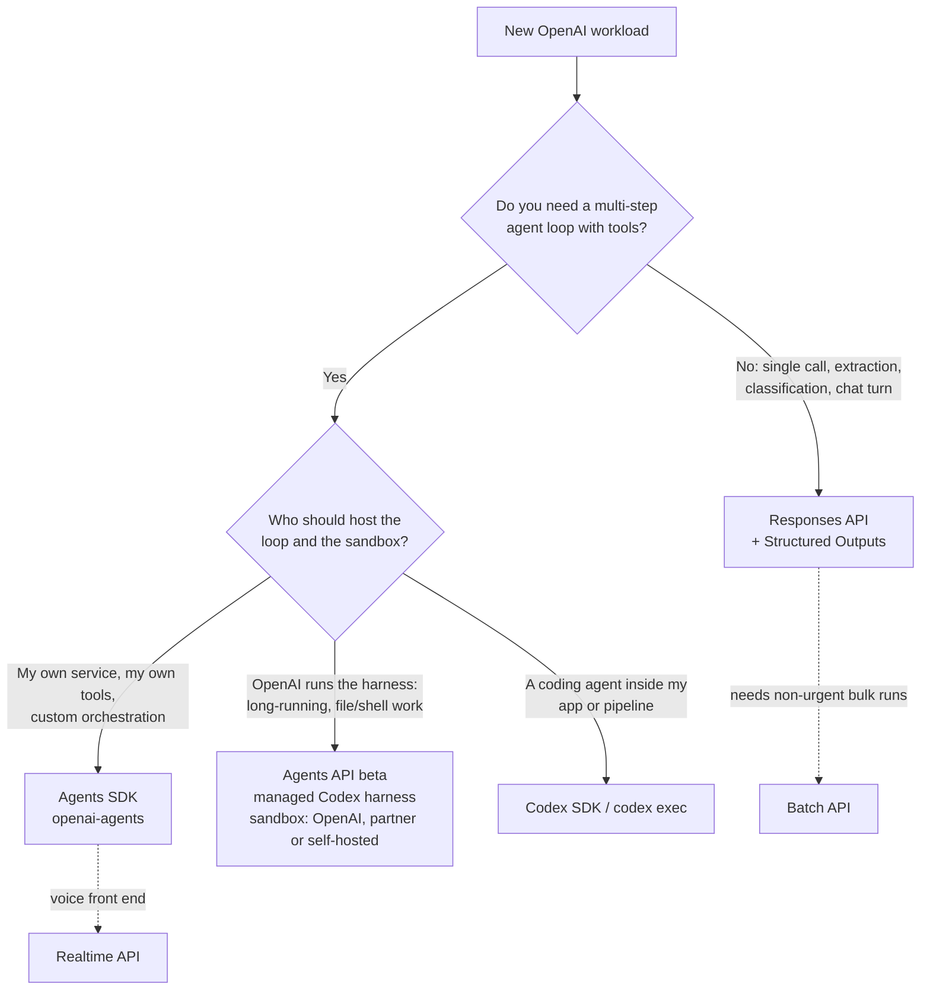

# OpenAI (Codex) Path: Solution Architect Skills on the OpenAI Platform

> **Status:** chapters 01–11 written (README + 2 notebooks each); 12–14 and exam-prep planned · **Last verified against official docs:** 2026-10-03 · **Language:** Python for every notebook

This is the second branch of the journey. The [Claude path](../anthropic-claude/README.md) teaches the architect skill set against a real, proctored exam. This branch teaches the same skill set on the OpenAI platform: the Responses API, the Agents SDK, the managed Agents API, built-in tools and MCP, Codex, prompting and evals, batch and cost control, orchestration, human-in-the-loop, multi-agent error handling and context management, with provenance, realtime voice and ChatGPT plugins planned next.

OpenAI and Anthropic platforms have converged a lot. Both have a core model API, strict tool schemas, structured outputs, MCP, an agent SDK, a coding agent with a project instruction file, and a 50%-off batch API. Because of that overlap, this path is written as a **delta course**. Each chapter starts from what you already learned on the Claude side, then focuses on what is different, what has a different name, and what does not exist on the other side.

---

## Table of contents

- [How this path mirrors and differs from the Claude path](#how-this-path-mirrors-and-differs-from-the-claude-path)
- [Certification status (read this first)](#certification-status-read-this-first)
- [Skill tree for an OpenAI solution architect](#skill-tree-for-an-openai-solution-architect)
- [Which OpenAI runtime do I need?](#which-openai-runtime-do-i-need)
- [Chapter folders](#chapter-folders)
- [Claude ↔ OpenAI concept mapping](#claude--openai-concept-mapping)
- [Deprecated and retired: do not learn these](#deprecated-and-retired-do-not-learn-these)
- [Environment setup for this path](#environment-setup-for-this-path)
- [Official docs and learning resources](#official-docs-and-learning-resources)
- [Progress tracker](#progress-tracker)

---

## How this path mirrors and differs from the Claude path

| Aspect | Claude path | OpenAI path |
|---|---|---|
| **External goal** | Claude Certified Architect – Foundations, a proctored, scenario-based exam | No architect exam exists (see [below](#certification-status-read-this-first)). The goal is the OpenAI Academy **API** and **Codex** pathway certificates, plus a portfolio. |
| **Syllabus source** | Exam guide, its 5 domains, and the community study guide | Official docs, the Academy API and Codex pathways, and OpenAI's developer tracks |
| **Chapter style** | Full theory chapters | Delta chapters: "you know X from Claude; here is the OpenAI version and what's different" |
| **Folder layout** | `NN-topic/README.md` + `01_practice.ipynb` (guided practice) + `02_homework.ipynb` (self-test) | Same convention |
| **Exam prep** | Practice questions mapped to the 5 domains | A self-made scenario bank in the same style as the Claude exam, so both paths get tested the same way |
| **Coding agent** | Claude Code, `CLAUDE.md`, `claude -p` in CI | Codex (CLI, IDE, cloud), `AGENTS.md`, `codex exec` in CI |

**Why do the Claude path first?** The Claude exam gives you a fixed, testable structure: agent loops, tool design, MCP, coding-agent configuration, prompt engineering, and context management. Once those ideas are solid, most of the OpenAI material is a vocabulary and API-shape change. The real differences (server-side conversation state, the managed Agents API, realtime voice, the Codex sandbox model) get a full section in each chapter.

**Biggest conceptual differences to keep in mind:**

1. **State.** The Claude Messages API is stateless, so your app resends the history every time. The OpenAI Responses API *can* be used the same way, but it also offers server-side state through `previous_response_id` and the Conversations API. That is an architecture decision (data retention, cost, portability), not just a convenience.
2. **Three agent runtimes to choose from.** On OpenAI you choose between building the loop yourself on the Responses API, using the Agents SDK (a library you host), or using the Agents API (a managed Codex harness, with the sandbox hosted by OpenAI, by you, or by a sandbox partner). Anthropic now has a similar three-way split (your own loop on the Messages API, the Claude Agent SDK, and Claude Managed Agents, in beta), but the Claude chapters of this repo focus on the first two, so the managed runtime gets its full treatment here.
3. **Voice is first-class.** OpenAI has a realtime speech-to-speech API. The Claude path has no matching chapter.
4. **No embeddings or retrieval primitives on the Claude side.** OpenAI ships embeddings, vector stores, and a hosted `file_search` tool. On Claude you bring your own retrieval stack.

---

## Certification status (read this first)

> **Plain answer, as of 2026-10-03 (based on OpenAI's public Academy, help center and announcement pages):** OpenAI has **no Solution Architect certification**. It also has **no proctored developer or architect exam** that an individual can book. Nothing on the OpenAI side currently matches Anthropic's Claude Certified Architect.

The real options, from the closest fit to the least relevant:

| Option | What it is | Who can get it | Is it a certification? |
|---|---|---|---|
| **OpenAI Academy: API pathway certificate** ⭐ | Five self-paced courses: Scope AI Solutions (30 min), Evaluate AI Applications (70 min), Design and Build Agentic Systems (110 min), Build with Retrieval-Augmented Generation (100 min), Optimize AI Application Performance (30 min). Each course assessment is 10–20 questions drawn from a 50-question bank, with an 80% pass mark and retakes allowed. Badges are issued through Accredible. Finishing all five courses earns a pathway certificate of completion. These five plus the three Codex courses below make up the Academy's 8-course "Build with AI" learning path (launched 2026-09-21). | Open to individuals, free (check academy.openai.com for sign-in and availability in your region) | **No.** OpenAI's help center says badges and certificates "are not certifications and do not guarantee eligibility for a future certification." |
| **OpenAI Academy: Codex pathway certificate** ⭐ | Get Started with Codex (80 min), Extend Codex Workflows (90 min), Scale Codex Across Governed Teams and Systems (100 min). Same assessment model. | Anyone, free | **No** (same disclaimer) |
| **API Builder Bootcamp** (live) | Five live sessions: API Foundations, Agents, Realtime, RAG, Production & Optimization. Attending all five earns a shareable completion certificate. The first run was 2026-08-19 to 2026-09-16 and has ended; watch the Academy Builders club for the next run. | Anyone who attends live | **No.** It is an attendance certificate. |
| **Codex Bootcamp** (live) | 101 / 102 / 103 sessions, also listed as 101 / 201 / 301 | Anyone who attends live | **No.** It is an attendance certificate. |
| **Foundations pathway** | AI Foundations, Applied AI Foundations, Agents and Workflows | Open to individuals, free | **No.** Useful as a warm-up only. |
| **"OpenAI Certified" app in ChatGPT** | The formal OpenAI Certifications program. The app is Coursera-powered and runs inside ChatGPT; credentials are issued through Coursera and distributed via Credly. The program was announced on 2025-12-09, starting with "AI Foundations" (inside ChatGPT, for pilot partners) and "ChatGPT Foundations for Teachers" (on Coursera). ETS and Credly by Pearson are named credential partners. The stated plan is that more courses plus a hands-on project lead to "full OpenAI Certification." | **Invite-only**, for ChatGPT Enterprise and Edu workspaces, through your OpenAI account representative | Yes, but it covers **workforce AI literacy**, not engineering or architecture |
| **OpenAI Partner Network** | Announced 2026-06-14 (with a $150M commitment): Select / Advanced / Elite tiers, a goal of 300,000 certified consultants by end of 2026, and planned specializations such as Codex, cybersecurity, API and agent transformation | **Organizations** (partner firms). No individual enrollment path found. | For partner firms and their staff only |
| **Academy Community Trainer Program** | Pilot, announced 2026-09-23 in "Two years of OpenAI Academy." Staff assigned by participating organizations learn the Academy curriculum and how to facilitate practical workshops, then teach Academy material in their communities. | Staff of participating organizations | It prepares **trainers**, not engineers |

> **Not an OpenAI credential:** "AI-Assisted Developer: Codex Certification" on devcerts.org is from a third party, DevCerts. It is not issued or endorsed by OpenAI. This repo does not target it.

### What this repo targets

1. 🎯 **Primary:** OpenAI Academy **API pathway** certificate of completion.
2. 🎯 **Primary:** OpenAI Academy **Codex pathway** certificate of completion.
3. ➕ **Optional:** API Builder Bootcamp and Codex Bootcamp completion certificates, if the live dates fit.
4. 🧱 **Portfolio:** every chapter notebook in this folder, plus one end-to-end capstone (an agent with tools, MCP, structured output, evals and a cost report). Since no exam exists, the portfolio is the real evidence of skill.

Every post about these will say **"certificate of completion, not a certification."** Being precise here is part of credibility.

### Watch list

| What to watch | Why it matters | Where |
|---|---|---|
| Formal OpenAI Certification beyond "AI Foundations" | If an engineering or architect track appears, this path becomes its prep course | [OpenAI certificate courses announcement](https://openai.com/index/openai-certificate-courses/), [OpenAI Certified app help article](https://help.openai.com/en/articles/20001151-openai-certified-app) |
| Partner Network specializations (Codex, agents) | The "300,000 certified consultants" goal suggests individual consultant credentials may follow | [Partner Network announcement](https://openai.com/index/introducing-openai-partner-network/), [OpenAI partners page](https://openai.com/business/partners/) |
| New Academy pathways | Role-based learning paths were introduced on 2026-09-21 and are still growing | [Expanding OpenAI Academy with new learning paths](https://openai.com/index/expanding-openai-academy-with-new-learning-paths/), [Two years of OpenAI Academy](https://openai.com/index/two-years-of-openai-academy/) |
| Next API Builder / Codex Bootcamp runs | The first API Builder Bootcamp series has already ended | [Codex for Builders (bootcamps)](https://academy.openai.com/public/clubs/builders-etkn1/tags/codex-for-builders-6a1f09c4a9f06c84af305c74) |

---

## Skill tree for an OpenAI solution architect

The tree below is grouped the same way as the Claude exam domains, so you can compare your progress on both paths directly.

```text
OpenAI Solution Architect
├── 1. Core API and model choice
│   ├── Responses API: input, instructions, output items, output_text, status
│   ├── Conversation state: stateless resend vs previous_response_id vs Conversations API; store=false
│   ├── Model selection: GPT-6 family (astra / sol / luna), reasoning.effort, cost vs latency
│   ├── Streaming, background mode, webhooks, WebSocket mode
│   └── Chat Completions: read it, but don't start new work on it
├── 2. Tools and structured output
│   ├── Function calling: function_call → function_call_output, matched by call_id
│   ├── Strict schemas (strict: true, additionalProperties: false)
│   ├── Structured Outputs: text.format, responses.parse(text_format=PydanticModel)
│   ├── Built-in tools: web_search, file_search, shell (hosted or local), code_interpreter, computer use, image generation, skills, apply_patch (your code applies the diff)
│   ├── Scaling tool sets: tool_search (deferred loading, namespaces), programmatic tool calling, async tool calls
│   └── Remote MCP servers (type: "mcp"), approvals, Secure MCP Tunnel
├── 3. Agent architecture and orchestration
│   ├── Agents SDK: Agent, Runner, function_tool, handoffs, agents-as-tools
│   ├── Guardrails and human review, sessions, tracing
│   ├── Agents API (beta): managed Codex harness, sandboxes, vaults, subagents, session webhooks, OTLP tracing
│   └── Choosing between building on Responses, the Agents SDK, and the Agents API
├── 4. Codex: the coding agent
│   ├── Surfaces: CLI, IDE extension, Codex Cloud, Code Review, Codex Security
│   ├── AGENTS.md hierarchy and override rules, config.toml (user and trusted-project layers)
│   ├── Sandbox and approval modes
│   ├── codex exec in CI: --sandbox, --json, --output-schema, resume; codex-action
│   ├── Extending it: MCP, skills, hooks, subagents, plugins, rules
│   └── Codex SDK (Python: openai-codex) for embedding the harness in your own apps
├── 5. Prompting, evaluation and reliability
│   ├── Prompt structure for reasoning models, few-shot, prompts kept in code (not v1/prompts)
│   ├── Evals with your own harness or Promptfoo (the OpenAI Evals platform is being retired)
│   ├── Moderation, safety classifiers, safety_identifier
│   └── Context management: compaction, token counting
├── 6. Retrieval (RAG)
│   ├── Embeddings, vector stores, file_search with metadata filters
│   └── When to use hosted retrieval and when to bring your own
├── 7. Cost, scale and operations
│   ├── Batch API (50% off, within 24 h), flex processing (beta), service tiers
│   ├── Prompt caching (automatic; explicit breakpoints on GPT-5.6 and later), rate limits, retries
│   └── Admin APIs, projects, Terraform project controls
├── 8. Realtime and voice
│   ├── GPT-Live, gpt-realtime-2.1 / -mini, WebRTC vs WebSocket, VAD
│   ├── Realtime with tools and MCP; translation
│   └── Transcription: gpt-transcribe, gpt-live-transcribe
└── 9. Distribution inside ChatGPT
    ├── ChatGPT plugins (formerly the Apps SDK): MCP servers + skills + optional UI
    ├── Plugin extensions, MCP Events, submission guide
    └── Workspace agents (API triggers), Sign in with ChatGPT (beta, limited partners)
```

---

## Which OpenAI runtime do I need?

This is the first architecture question in almost every OpenAI scenario. Chapter 03 covers it in depth.



---

<a id="planned-chapter-folders"></a>

## Chapter folders

Chapters 01–11 exist. Each folder follows the same convention as the Claude path: a `README.md` (theory, written as a delta on the Claude chapter), `01_practice.ipynb` (guided practical work) and `02_homework.ipynb` (self-test with a quiz, auto-checked exercises and an architecture scenario). Status legend (same as the [root progress tracker](../README.md#progress-tracker)): 📝 written, not yet run end to end against the live API · ⏳ planned.

| # | Folder | What it covers | Claude chapter it builds on | Academy course it supports | Status |
|---|---|---|---|---|---|
| 01 | [01-responses-api-fundamentals](01-responses-api-fundamentals/README.md) | Responses API request/response shape, output items, `status` and `incomplete_details`, `instructions`, conversation state (`store`, `previous_response_id`, Conversations API), streaming, background mode, model and `reasoning.effort` choice, token counting | [01 Claude API Fundamentals](../anthropic-claude/01-claude-api-fundamentals/README.md) | Scope AI Solutions | 📝 |
| 02 | [02-function-calling-and-structured-outputs](02-function-calling-and-structured-outputs/README.md) | Function tools, the `function_call` → `function_call_output` loop, strict schemas, parallel and async calls, Structured Outputs with Pydantic, `tool_choice` | [02 Tool Use](../anthropic-claude/02-tool-use/README.md), [06 Prompt Engineering](../anthropic-claude/06-prompt-engineering/README.md) (structured output) | Design and Build Agentic Systems | 📝 |
| 03 | [03-agents-sdk-and-agents-api](03-agents-sdk-and-agents-api/README.md) | Agents SDK (agents, runner, handoffs, agents-as-tools, guardrails, human review, sessions, tracing) and the managed Agents API (sandboxes, vaults, subagents, webhooks). Choosing a runtime. | [03 Agent SDK](../anthropic-claude/03-agent-sdk/README.md) | Design and Build Agentic Systems | 📝 |
| 04 | [04-built-in-tools-and-mcp](04-built-in-tools-and-mcp/README.md) | Built-in tools (web search, file search with vector stores, hosted or local shell, code interpreter, computer use, apply_patch), tool search and programmatic tool calling, remote MCP servers, MCP in the Agents SDK, Secure MCP Tunnel | [04 Model Context Protocol](../anthropic-claude/04-model-context-protocol/README.md) | Build with RAG, Design and Build Agentic Systems | 📝 |
| 05 | [05-codex](05-codex/README.md) | Codex CLI, IDE extension and cloud environments, `AGENTS.md` and `config.toml`, sandbox and approval modes, skills, hooks, subagents and plugins, `codex exec` in CI, `openai/codex-action@v1`, the Python Codex SDK | [05 Claude Code](../anthropic-claude/05-claude-code/README.md) | Codex pathway (all three courses) | 📝 |
| 06 | [06-prompt-engineering-and-evals](06-prompt-engineering-and-evals/README.md) | Prompting reasoning models, few-shot, prompts in code, building an eval harness (Promptfoo or your own), graders, regression testing, moderation and safety | [06 Prompt Engineering](../anthropic-claude/06-prompt-engineering/README.md) | Evaluate AI Applications | 📝 |
| 07 | [07-batch-and-cost](07-batch-and-cost/README.md) | Batch API (JSONL, `custom_id`, 24 h window), flex processing and service tiers, prompt caching, rate limits and retries, model routing, cost modeling | [07 Message Batches](../anthropic-claude/07-message-batches/README.md) | Optimize AI Application Performance | 📝 |
| 08 | [08-task-decomposition-and-orchestration](08-task-decomposition-and-orchestration/README.md) | Orchestration in code vs by the model (agents-as-tools, handoffs) vs on OpenAI's servers, parallel fan-out, multi-pass review, Codex subagents and code review | [08 Task Decomposition](../anthropic-claude/08-task-decomposition/README.md) | Design and Build Agentic Systems; Scale Codex Across Governed Teams and Systems | 📝 |
| 09 | [09-escalation-human-in-the-loop](09-escalation-human-in-the-loop/README.md) | Escalation triggers, tool approvals, serializable `RunState`, guardrails and tripwires, MCP approvals, structured handoffs, calibration and stratified review | [09 Escalation and HITL](../anthropic-claude/09-escalation-human-in-the-loop/README.md) | Design and Build Agentic Systems, Scope AI Solutions | 📝 |
| 10 | [10-multi-agent-error-handling](10-multi-agent-error-handling/README.md) | Error layers (HTTP, Agents SDK, tool output, background and Agents API statuses), retry rules, structured worker errors, partial results, coverage annotations, tracing | [10 Multi-agent Error Handling](../anthropic-claude/10-multi-agent-error-handling/README.md) | Design and Build Agentic Systems, Optimize AI Application Performance | 📝 |
| 11 | [11-context-management](11-context-management/README.md) | Where state lives (your store, Responses store, Conversations), curated case facts, trimming tool output, compaction, long-context pricing, checkpoints and resumption | [11 Context Management](../anthropic-claude/11-context-management/README.md) | Optimize AI Application Performance, Design and Build Agentic Systems | 📝 |
| 12 | `12-provenance` (planned) | Claim–source mapping with web search and file search citations (`url_citation`, `file_citation` annotations), conflicting sources, dates and uncertainty | [12 Provenance](../anthropic-claude/12-provenance/README.md) | Build with RAG | ⏳ |
| 13 | `13-realtime-and-voice` (planned) | Realtime API (GA), GPT-Live, WebRTC and WebSocket, VAD, tools and MCP in realtime sessions, transcription and translation | No Claude equivalent | API Builder Bootcamp: Realtime session | ⏳ |
| 14 | `14-chatgpt-plugins-and-apps` (planned) | ChatGPT plugins (formerly the Apps SDK): MCP server + skills + UI, plugin extensions, MCP Events, submission, workspace agents (API triggers), Sign in with ChatGPT | [04 MCP](../anthropic-claude/04-model-context-protocol/README.md), [05 Claude Code](../anthropic-claude/05-claude-code/README.md) (plugins) | (none yet) | ⏳ |
| — | `exam-prep` (planned) | Scenario question bank in the Claude exam style, a checklist for each Academy course, capstone project brief | Claude `exam-prep` (planned, see the [Claude roadmap](../anthropic-claude/README.md#roadmap)) | All | ⏳ |

> **Note: renumbered from the first plan.** The first plan had `08-realtime-and-voice` and `09-chatgpt-plugins-and-apps`. To keep the OpenAI chapters aligned one-to-one with the Claude chapters (and with the CCAR-F task statements they map to), chapters 08–11 now mirror Claude chapters 08–11, and realtime voice and ChatGPT plugins moved to 13 and 14 after a planned `12-provenance`. Earlier still, `09-agentkit-and-apps` was renamed because the name "AgentKit" no longer appears in OpenAI's current docs and Agent Builder (its visual builder) shuts down on 2026-11-30, and `03-agents-sdk` became `03-agents-sdk-and-agents-api`, because the managed Agents API (public beta since 2026-09-10) is a separate runtime you have to choose between.

---

## Claude ↔ OpenAI concept mapping

Use this table as your translation layer. "≈" means similar purpose but a meaningful difference, which is explained in the last column. Each row is expanded in the chapter shown.

| Concept | Anthropic (Claude) | OpenAI | Match | Key difference | Ch. |
|---|---|---|---|---|---|
| Core model API | Messages API, `POST /v1/messages` | Responses API, `POST /v1/responses` (Chat Completions still supported but not recommended for new work) | ≈ | Messages is stateless. Responses can be stateless (`store=False`, resend input) **or** server-stateful. | 01 |
| Conversation state | Your app resends the full `messages` list | `previous_response_id`, or a durable `conversation` from the Conversations API | ≈ | Server-side state on OpenAI changes data retention and portability | 01 |
| System prompt | `system` parameter | `instructions` parameter (or a developer-role input message) | = | `instructions` is not carried over automatically when you chain with `previous_response_id`; resend it each turn | 01 |
| Why generation stopped | `stop_reason` (`end_turn`, `tool_use`, `max_tokens`, `pause_turn`, …) | `response.status` (`completed` / `incomplete`), `incomplete_details.reason`, and the **types of output items** (for example a `function_call` item) | ≈ | No single field. Your loop checks the output items for tool calls. | 01 |
| Reasoning depth | Extended/adaptive thinking, `output_config={"effort": ...}` | `reasoning={"effort": ...}` (`none`, `minimal`, `low`, `medium`, `high`, `xhigh`, `max`; not every model supports every value), `reasoning.summary` | ≈ | Different effort values and different defaults per model | 01 |
| Tool call | `tool_use` content block → `tool_result` block, matched by `tool_use_id` | `function_call` output item → `function_call_output` input item, matched by `call_id` | = | OpenAI `arguments` is a JSON **string** you must `json.loads`; Claude `input` is already an object | 02 |
| Strict tool schemas | `strict: true` on the tool definition | `"strict": True` on the function tool, with `additionalProperties: False` | = | Same idea: schema-valid arguments every time | 02 |
| Structured output | `output_config.format` (JSON schema) | `text.format` (JSON schema), `client.responses.parse(..., text_format=Model)` | = | The Python SDK parses straight into a Pydantic model | 02 |
| Forcing a tool | `tool_choice` (`auto` / `any` / `tool` / `none`) | `tool_choice` (`auto` / `required` / `none` / a specific function or tool) | ≈ | Claude's `any` corresponds to OpenAI's `required` | 02 |
| Agent framework | Claude Agent SDK (`claude-agent-sdk`, `query()`, `ClaudeAgentOptions`) | Agents SDK (`openai-agents`, `from agents import Agent, Runner, function_tool`) | ≈ | The Claude Agent SDK *is* the Claude Code harness, with file and bash tools built in. The OpenAI Agents SDK is a lighter orchestration library on top of Responses. The closest match to "the coding harness as a library" is the **Codex SDK** or the **Agents API**. | 03 |
| Multi-agent | Subagents (coordinator delegates through the Agent/Task tool) | Handoffs (control moves to another agent) and agents-as-tools (coordinator keeps control); `multi_agent` subagents in the Agents API | ≈ | OpenAI has two distinct patterns. Agents-as-tools is the hub-and-spoke pattern from the Claude chapter. | 03 |
| Agent control points | Hooks (`PreToolUse`, `PostToolUse`, …), permission modes | Input/output guardrails, tool approvals and human review | ≈ | Guardrails validate content. Hooks intercept lifecycle events. They overlap but are not the same. | 03 |
| Managed, hosted agent runtime | Claude Managed Agents (beta, `managed-agents-2026-04-01` header): Anthropic-managed cloud sandbox or self-hosted sandbox | Agents API (beta, `OpenAI-Beta: agents=v1`): managed Codex harness, OpenAI-hosted, self-hosted or partner sandboxes, vaults | ≈ | Same idea on both sides. The Claude chapters of this repo do not cover Managed Agents, so chapter 03 here is your first deep look at a managed runtime. | 03 |
| MCP from the API | MCP connector (`mcp_servers`, beta, remote, tools only; allowlist/denylist and per-tool config) | Remote MCP tool (`{"type": "mcp", ...}`) in Responses, plus Secure MCP Tunnel (`tunnel_id`) for private servers | = | Both call a remote MCP server for you. OpenAI adds a human approval step per tool (`require_approval`). Anthropic's MCP tunnels for private servers are still a limited research preview. | 04 |
| MCP in the coding agent | `.mcp.json` (project) and user config | `codex mcp` commands; `~/.codex/config.toml` (user) or `.codex/config.toml` (trusted projects only) | ≈ | Different config files, same protocol | 04/05 |
| Web search | `web_search` server tool | `web_search` hosted tool | = | — | 04 |
| Code execution | `code_execution` server tool | `code_interpreter` and hosted or local `shell` | ≈ | OpenAI separates a Python sandbox from a general shell | 04 |
| Computer use | Computer use tool | Computer use tool on current models such as `gpt-6-astra` (`computer-use-preview` is retired) | = | — | 04 |
| Large tool catalogs | Tool search | `tool_search` (deferred loading, namespaces) | = | — | 04 |
| Programmatic tool calling | Programmatic tool calling (model writes Python in the code execution container that calls tools) | Programmatic tool calling (model writes JavaScript that orchestrates tools) | ≈ | Different execution language and sandbox | 04 |
| Retrieval | Bring your own vector DB (Anthropic has no first-party embeddings model) | Embeddings + vector stores + `file_search` | — | OpenAI has hosted RAG; Claude does not | 04 |
| Coding agent | Claude Code (CLI, IDE, web) | Codex (CLI, IDE extension, Codex Cloud, Code Review) | ≈ | Codex has an explicit OS-level sandbox mode as well as approval policies | 05 |
| Project instructions file | `CLAUDE.md` (user / project / directory levels, `@path` imports, `CLAUDE.local.md`) | `AGENTS.md` (`~/.codex/AGENTS.md` global, `AGENTS.override.md`, at most one file per directory from the Git root down to the current dir, closest wins, 32 KiB combined cap by default) | ≈ | Codex has no import syntax. Once the combined size reaches `project_doc_max_bytes`, Codex stops adding further files, so keep instructions short. Claude Code (v2.1.277+) can also read `AGENTS.md` when a repo has no `CLAUDE.md`. | 05 |
| Agent settings | `.claude/settings.json` | `~/.codex/config.toml` (user) and `.codex/config.toml` (trusted projects) | ≈ | JSON vs TOML | 05 |
| Reusable workflows | Skills (`SKILL.md`), slash commands | Skills (Codex custom prompts are deprecated in favor of skills) | = | — | 05 |
| Extensions bundle | Claude Code plugins | Codex plugins; ChatGPT plugins | ≈ | OpenAI publishes a guide for converting a Claude Code plugin to an OpenAI plugin | 05/14 |
| Headless / CI mode | `claude -p`, `--output-format json`, `--json-schema`, `--resume` | `codex exec` (read-only by default), `--sandbox workspace-write`, `--json`, `--output-schema`, `codex exec resume --last`, key in `CODEX_API_KEY` | = | Codex exec is read-only unless you allow writes | 05 |
| CI action | `anthropics/claude-code-action@v1` | `openai/codex-action@v1` | = | — | 05 |
| Embedding the coding agent | Claude Agent SDK | Codex SDK (`pip install openai-codex`, Python 3.10+; `from openai_codex import Codex, Sandbox`; `AsyncCodex` for async) | ≈ | — | 05 |
| Evals | Your own harness (Console tooling) | Your own harness or Promptfoo. The OpenAI Evals platform is being retired. | ≈ | Don't build on the OpenAI Evals dashboard or API now | 06 |
| Async bulk processing | Message Batches API (requests sent inline, 50% off, within 24 h, `custom_id`) | Batch API (upload a JSONL file through the Files API, 50% off, within 24 h, `custom_id`) | = | OpenAI needs a file upload step; Claude takes the requests in the create call | 07 |
| Cheaper non-urgent calls | (batch only) | Flex processing (`service_tier="flex"`, beta, limited models) | — | Priced at Batch API rates but synchronous: slower, and can return `429 Resource Unavailable` when capacity is short; no 24 h queue | 07 |
| Prompt caching | Explicit `cache_control` breakpoints on blocks, or automatic caching with one top-level `cache_control` | Automatic prefix caching by default; on GPT-5.6 and later you can also set `prompt_cache_options.mode="explicit"` and mark `prompt_cache_breakpoint`s | ≈ | Both now offer an automatic and an explicit mode. On OpenAI's default mode, caching depends on putting stable content first. | 07 |
| Context compaction | Compaction / context editing | `context_management=[{"type": "compaction", ...}]`, auto-compaction in the Agents API | ≈ | — | 01/03/11 |
| Realtime voice | No equivalent | Realtime API, GPT-Live | — | OpenAI only | 13 (planned) |
| Distribution inside the chat product | Connectors (MCP) in Claude apps | ChatGPT plugins (MCP + skills + UI) | ≈ | — | 14 (planned) |

> The Claude column uses the names from this repo's Claude chapters, which were checked against current Anthropic docs (Claude Managed Agents, prompt caching and the Claude Code `AGENTS.md` behavior were checked against platform.claude.com and code.claude.com on 2026-10-03). The OpenAI column was checked against developers.openai.com and learn.chatgpt.com on 2026-10-03. Both platforms change fast, so re-check before you post a comparison publicly.

---

## Deprecated and retired: do not learn these

Many tutorials and blog posts still teach these. Skip them, or read them only so you can recognize legacy code during a migration.

| Item | Status | Use instead |
|---|---|---|
| **Assistants API** (threads, runs) | Retired 2026-08-26 | Responses API + Conversations API |
| **Agent Builder** (visual builder, launched under the "AgentKit" name) | Deprecated 2026-06-03; shuts down 2026-11-30 | Agents SDK or ChatGPT Workspace Agents (ChatKit remains available) |
| **Evals platform** (dashboard + API) | Deprecated 2026-06-03; read-only from 2026-10-31; shuts down 2026-11-30 | Promptfoo (suggested migration) or your own harness |
| **Reusable prompt objects / `v1/prompts`** | Shuts down 2026-11-30 | Keep prompts in your code, under version control |
| **Self-serve fine-tuning** | Orgs that never ran fine-tuning can't start since 2026-05-07; orgs without recent activity lost access on 2026-07-02; active existing customers can't create new jobs from 2027-01-06 | Prompting, retrieval, and model choice. Existing fine-tuned models keep serving until their base model is deprecated. |
| **Realtime beta interface** (`OpenAI-Beta: realtime=v1`) | Removed 2026-05-12 | GA Realtime API |
| **Older realtime/audio models** (`gpt-realtime`, `gpt-realtime-mini`, `gpt-audio`, `gpt-audio-mini`, `gpt-4o-realtime*`, `gpt-4o-audio*`, `gpt-4o-mini-realtime*`, …) | Some preview snapshots are already gone (for example `gpt-4o-realtime-preview` on 2026-05-07); the rest shut down 2027-01-20 | `gpt-realtime-2.1` or `gpt-realtime-2.1-mini` |
| **`tts-1`, `tts-1-hd`** | Shut down 2027-01-06 | `gpt-realtime-2.1-mini` |
| **`whisper-1`, `gpt-4o-transcribe`** | Shut down 2027-02-26 | `gpt-transcribe`, `gpt-live-transcribe` |
| **`computer-use-preview`** | Retired 2026-07-23 | The computer use tool on a current model (the deprecations page names `gpt-5.6-terra`; `gpt-6-astra` also supports it) |
| **Videos API / Sora 2** | Retired 2026-09-24 | None |
| **`gpt-5.1`, `gpt-5.3-codex`, `gpt-5.4-nano`** | Shut down 2027-04-01 | `gpt-6-sol` (the models page now lists `gpt-6.1-sol`) for `gpt-5.1` and `gpt-5.3-codex`; `gpt-6-luna` for `gpt-5.4-nano` |
| **Older models in tutorials** (`o1`, `o3`, `o3-mini`, `o4-mini`, `gpt-4.1-nano`, `gpt-5`, `gpt-5-mini`, `gpt-5-nano`) | Deprecated, with shutdowns on 2026-10-23 (`o1`, `o3-mini`, `o4-mini`, `gpt-4.1-nano`) and 2026-12-11 (`o3`, `gpt-5`, `gpt-5-mini`, `gpt-5-nano`) | The current GPT-6 family (the deprecations page lists `gpt-5.6-*` substitutes) |
| **Codex MCP server** (`codex mcp-server`) | Deprecated in August 2026, then removed from the CLI | Codex app server |
| **Codex custom prompts** | Deprecated since 2026-01-22 | Skills |
| **`codex exec --full-auto`** | Still works, deprecated | `--sandbox workspace-write` |
| **Chat Completions** | Still supported, **not** deprecated | Responses API for new projects. You still need to read Chat Completions code for migrations. |

Source: [OpenAI deprecations page](https://developers.openai.com/api/docs/deprecations), plus the Codex docs for the Codex rows.

---

## Environment setup for this path

Follow [00 — Prerequisites](../00-prerequisites/README.md) first. That covers the Python version, the virtual environment, the shared `requirements.txt`, and copying `.env.example` to `.env`. For this path you need `OPENAI_API_KEY` set in `.env`. For the Codex CLI you need either Node.js (npm install) or the standalone installer.

```bash
pip install -r requirements.txt     # includes openai, openai-agents, python-dotenv
pip install openai-codex            # Codex Python SDK (Python 3.10+), only needed for chapter 05; not in requirements.txt yet

# Codex CLI (chapter 05): pick one
npm i -g @openai/codex                                  # needs Node.js
curl -fsSL https://chatgpt.com/codex/install.sh | sh    # standalone installer (macOS/Linux)
```

A shared setup cell that every notebook in this path will start with:

```python
import os
from dotenv import load_dotenv, find_dotenv
from openai import OpenAI

load_dotenv(find_dotenv(usecwd=True))          # finds the repo-root .env; never hardcode keys
client = OpenAI()                              # picks OPENAI_API_KEY up from the environment
MODEL = os.getenv("OPENAI_MODEL", "gpt-6-luna")  # cheapest tier (the .env.example default); switch per notebook when the point is model-specific

response = client.responses.create(
    model=MODEL,
    instructions="You are a concise assistant for a solution architect.",
    input="In one sentence: what is the Responses API?",
)
print(response.status, "|", response.output_text)
```

> **Cost tip:** At time of writing, `gpt-6-luna` costs $0.10 / $0.50 per million input/output tokens, compared with $2 / $10 for `gpt-6.1-sol` and $10 / $50 for `gpt-6-astra`. Use luna (the `OPENAI_MODEL` default in `.env.example`) for loops and experiments, and only move up a tier when the notebook is about model quality. Check the [models page](https://developers.openai.com/api/docs/models) for current pricing.

---

## Official docs and learning resources

**Platform docs** (developers.openai.com)

- API docs home and index: https://developers.openai.com/api/docs/llms.txt
- Models and pricing: https://developers.openai.com/api/docs/models
- Migrate to the Responses API: https://developers.openai.com/api/docs/guides/migrate-to-responses
- Conversation state: https://developers.openai.com/api/docs/guides/conversation-state
- Tools overview: https://developers.openai.com/api/docs/guides/tools
- Structured Outputs: https://developers.openai.com/api/docs/guides/structured-outputs
- Agents (all three runtimes): https://developers.openai.com/api/docs/guides/agents
- Agents SDK quickstart: https://developers.openai.com/api/docs/guides/agents/quickstart
- Batch API: https://developers.openai.com/api/docs/guides/batch
- Deprecations: https://developers.openai.com/api/docs/deprecations
- Developer learning tracks (AI app development, Building agents, Model optimization): https://developers.openai.com/tracks
- ChatGPT plugins and Apps SDK: https://developers.openai.com/plugins/llms.txt

**Codex docs** (now at learn.chatgpt.com; developers.openai.com/codex redirects there)

- CLI: https://learn.chatgpt.com/docs/codex/cli
- IDE extension: https://learn.chatgpt.com/docs/codex/ide
- Cloud environments: https://learn.chatgpt.com/docs/cloud
- AGENTS.md: https://learn.chatgpt.com/docs/agent-configuration/agents-md
- Non-interactive mode (`codex exec`): https://learn.chatgpt.com/docs/non-interactive-mode
- Codex SDK: https://learn.chatgpt.com/docs/codex-sdk
- GitHub Action: https://learn.chatgpt.com/docs/github-action

**Announcements used in this README**

- Introducing the Agents API: https://openai.com/index/introducing-the-agents-api/
- DevDay 2026 recap: https://openai.com/index/devday-2026-recap/

**OpenAI Academy and certificates**

- OpenAI Academy: https://academy.openai.com/
- Academy courses, badges and certificates (help center): https://help.openai.com/en/articles/20001270-openai-academy-courses
- OpenAI Certified app (help center): https://help.openai.com/en/articles/20001151-openai-certified-app
- OpenAI certificate courses announcement: https://openai.com/index/openai-certificate-courses/
- Expanding OpenAI Academy with new learning paths (2026-09-21): https://openai.com/index/expanding-openai-academy-with-new-learning-paths/
- Two years of OpenAI Academy (Community Trainer Program): https://openai.com/index/two-years-of-openai-academy/
- Codex for Builders (bootcamps): https://academy.openai.com/public/clubs/builders-etkn1/tags/codex-for-builders-6a1f09c4a9f06c84af305c74
- OpenAI Partner Network: https://openai.com/index/introducing-openai-partner-network/

**Packages**

- Python SDK: [`openai`](https://pypi.org/project/openai/) · Agents SDK: [`openai-agents`](https://pypi.org/project/openai-agents/) (0.23.1 at time of writing) · Codex SDK: [`openai-codex`](https://pypi.org/project/openai-codex/) (0.160.0) · Codex CLI: [`@openai/codex`](https://www.npmjs.com/package/@openai/codex) (0.160.0)

> **Credit:** The chapter-by-chapter structure mirrors the Claude path, which follows the community [Claude Certified Architect study guide by paullarionov](https://github.com/paullarionov/claude-certified-architect/blob/main/guide_en.md). That guide covers Claude only. All OpenAI content here comes from OpenAI's official docs and announcements listed above.

---

## Progress tracker

This tracks my own study progress (the chapter content status is in [Chapter folders](#chapter-folders)). Status markers: ⬜ not started · 🟡 in progress · ✅ done

| Item | Status | Notes / link to post |
|---|---|---|
| [01 Responses API fundamentals](01-responses-api-fundamentals/README.md) | ⬜ | Chapter written |
| [02 Function calling and Structured Outputs](02-function-calling-and-structured-outputs/README.md) | ⬜ | Chapter written |
| [03 Agents SDK and Agents API](03-agents-sdk-and-agents-api/README.md) | ⬜ | Chapter written |
| [04 Built-in tools and MCP](04-built-in-tools-and-mcp/README.md) | ⬜ | Chapter written |
| [05 Codex](05-codex/README.md) | ⬜ | Chapter written |
| [06 Prompt engineering and evals](06-prompt-engineering-and-evals/README.md) | ⬜ | Chapter written |
| [07 Batch and cost](07-batch-and-cost/README.md) | ⬜ | Chapter written |
| [08 Task decomposition and orchestration](08-task-decomposition-and-orchestration/README.md) | ⬜ | Chapter written |
| [09 Escalation and human-in-the-loop](09-escalation-human-in-the-loop/README.md) | ⬜ | Chapter written |
| [10 Multi-agent error handling](10-multi-agent-error-handling/README.md) | ⬜ | Chapter written |
| [11 Context management](11-context-management/README.md) | ⬜ | Chapter written |
| 12 Provenance | ⬜ | Chapter planned |
| 13 Realtime and voice | ⬜ | Chapter planned |
| 14 ChatGPT plugins and apps | ⬜ | Chapter planned |
| Capstone project | ⬜ | |
| Academy: API pathway certificate | ⬜ | *Certificate of completion, not a certification* |
| Academy: Codex pathway certificate | ⬜ | *Certificate of completion, not a certification* |
| API Builder Bootcamp (optional) | ⬜ | |
| Codex Bootcamp (optional) | ⬜ | |
| Watch list re-checked | ⬜ | Re-check monthly; last checked 2026-10-03 |

### Post template for this branch

```text
Starting the OpenAI branch of my AI Solution Architect journey.

Honest finding: OpenAI has no Solution Architect certification today, and no proctored developer exam.
So my plan is:
1. OpenAI Academy API + Codex pathways (certificates of completion, not certifications)
2. A public notebook for every concept, mapped 1:1 to what I learned on Claude
3. Watching the formal OpenAI Certification and Partner Network tracks

Claude <-> OpenAI translation table in the repo: https://github.com/<your-handle>/AI-solution-architect/tree/main/openai-codex
#OpenAI #Codex #AIArchitecture #LLM #BuildInPublic
```

---

[↑ Root README](../README.md) | [← 00 — Prerequisites](../00-prerequisites/README.md) | [Claude path (do it first)](../anthropic-claude/README.md) | [Start → 01 — Responses API Fundamentals](01-responses-api-fundamentals/README.md)
